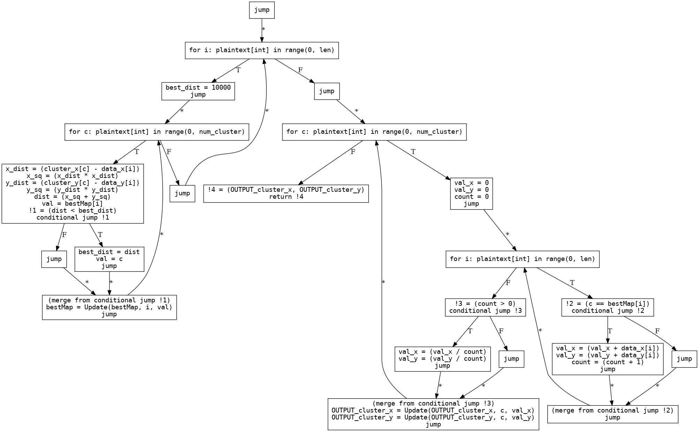
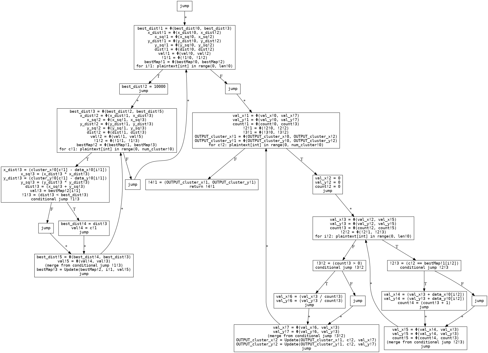
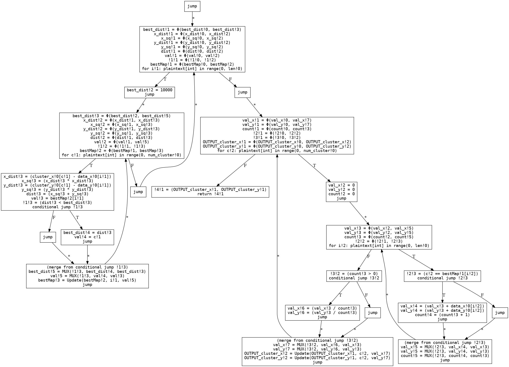
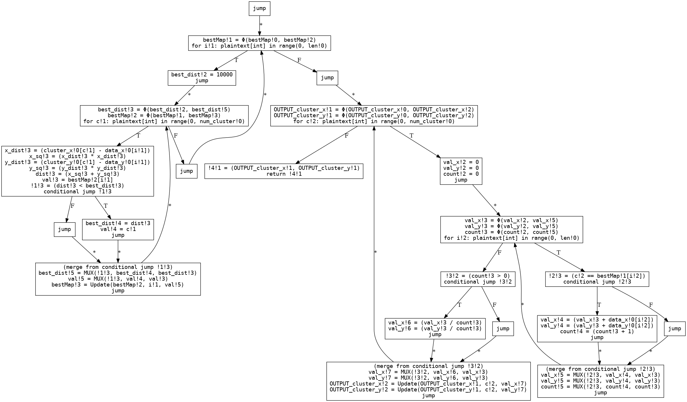
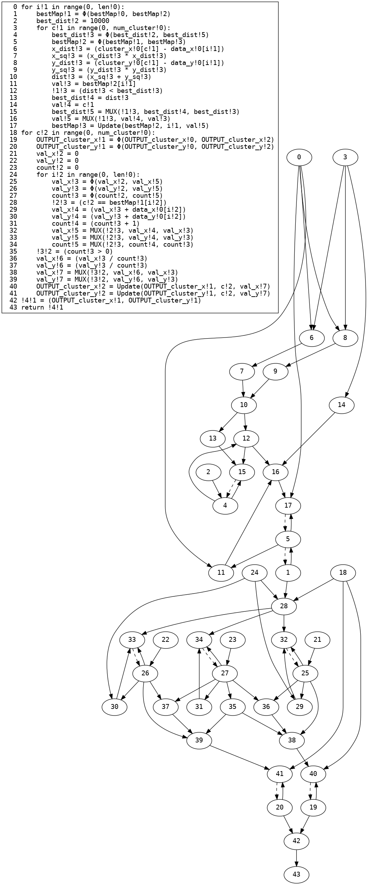
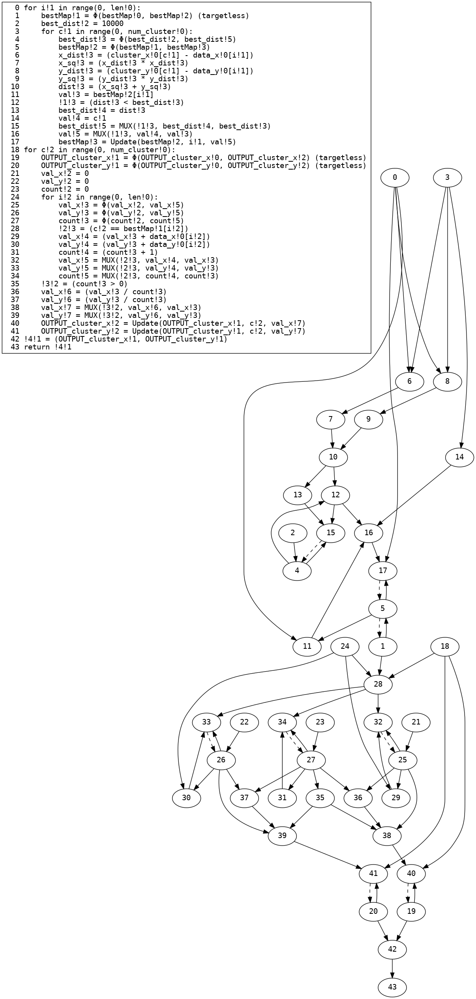
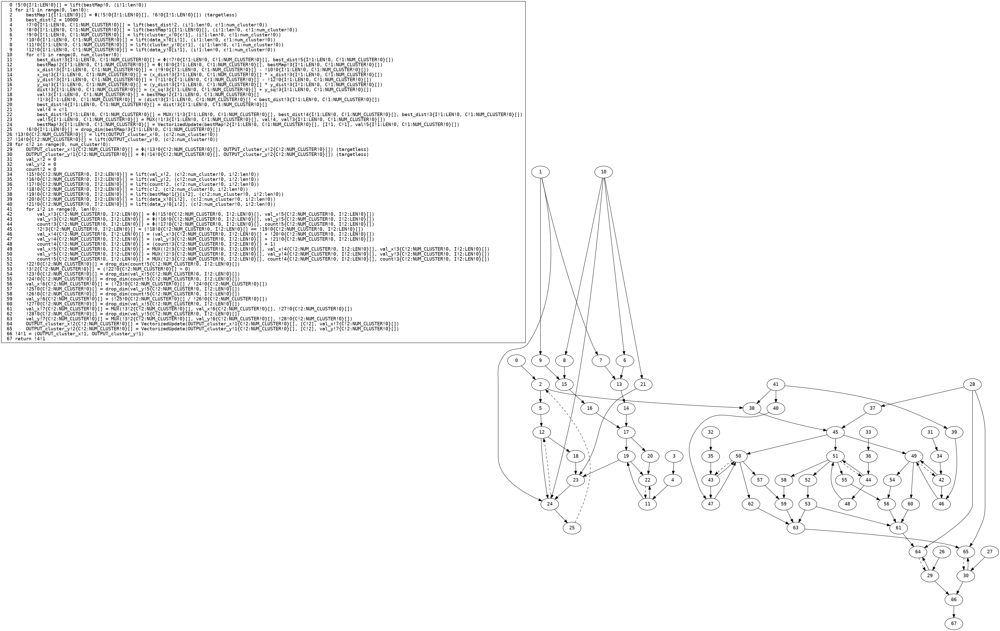
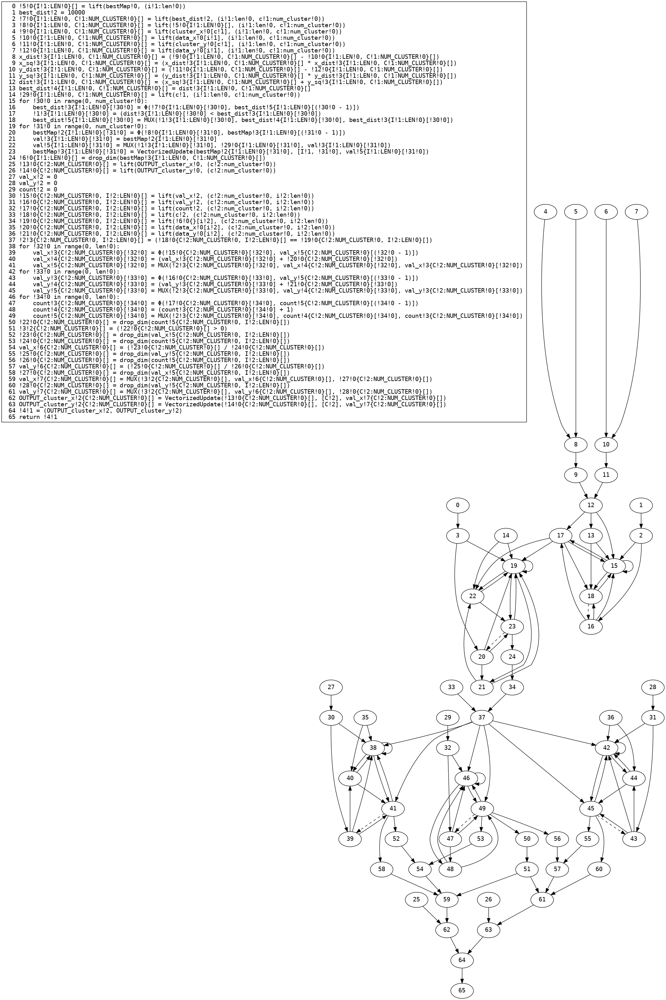

## [View the current version of the paper here](paper_SIMD.pdf)
## Benchmark Data

### BooleanGmw
| Benchmark | Total # Gates | # SIMD gates | # Non-SIMD gates | # messages sent (party 0) | Sent size (party 0) | # messages received (party 0) | Received Size (party 0) | Runtime | Circuit Generation Time |
| - | - | - | - | - | - | - | - | - | - |
|biometric|5469|4518|911|4945|0.814 MiB |4945|0.814 MiB |2190.34 ms |472.0 ms |
|biometric (Non-Vectorized)|58602|0|58558|47071|4.671 MiB |47071|4.671 MiB |12486.211 ms |4205.0 ms |
|count_102|3220|104|3079|3818|0.388 MiB |3818|0.388 MiB |1929.857 ms |340.0 ms |
|count_102 (Non-Vectorized)|4098|0|4071|5510|0.543 MiB |5510|0.543 MiB |2344.578 ms |411.0 ms |
|count_10s|2297|105|2158|2846|0.287 MiB |2846|0.287 MiB |1414.109 ms |218.0 ms |
|count_10s (Non-Vectorized)|2877|0|2857|3974|0.391 MiB |3974|0.391 MiB |1431.939 ms |285.0 ms |
|count_123|2304|109|2160|2848|0.288 MiB |2848|0.288 MiB |1595.376 ms |212.0 ms |
|count_123 (Non-Vectorized)|2899|0|2878|3988|0.392 MiB |3988|0.392 MiB |1471.035 ms |291.0 ms |
|db_variance|16280|3307|12939|13644|1.49 MiB |13644|1.49 MiB |9525.779 ms |1183.0 ms |
|db_variance (Non-Vectorized)|39399|0|39357|31522|3.126 MiB |31522|3.126 MiB |11201.961 ms |3774.0 ms |
|histogram|2688|2499|118|3016|0.396 MiB |3016|0.396 MiB |1583.254 ms |243.0 ms |
|histogram (Non-Vectorized)|13473|0|13405|15674|1.553 MiB |15674|1.553 MiB |3599.688 ms |1206.0 ms |
|inner_product|3886|2969|906|3580|0.387 MiB |3580|0.387 MiB |1340.07 ms |314.0 ms |
|inner_product (Non-Vectorized)|9819|0|9808|8052|0.796 MiB |8052|0.796 MiB |2336.274 ms |778.0 ms |
|longest_102|5469|110|5312|5640|0.568 MiB |5640|0.568 MiB |3191.53 ms |500.0 ms |
|longest_102 (Non-Vectorized)|6368|0|6341|7350|0.725 MiB |7350|0.725 MiB |2846.268 ms |538.0 ms |
|max_dist_between_syms|4262|37|4197|4452|0.441 MiB |4452|0.441 MiB |2184.232 ms |332.0 ms |
|max_dist_between_syms (Non-Vectorized)|4485|0|4465|4886|0.481 MiB |4886|0.481 MiB |2052.3 ms |403.0 ms |
|max_sum_between_syms|4261|37|4197|4452|0.441 MiB |4452|0.441 MiB |2414.079 ms |322.0 ms |
|max_sum_between_syms (Non-Vectorized)|4484|0|4465|4886|0.481 MiB |4886|0.481 MiB |1924.688 ms |347.0 ms |
|minimal_points|531|478|36|763|0.097 MiB |763|0.097 MiB |227.898 ms |37.0 ms |
|minimal_points (Non-Vectorized)|4064|0|4038|3647|0.361 MiB |3647|0.361 MiB |931.941 ms |280.0 ms |
|psi|131|61|42|472|0.063 MiB |472|0.063 MiB |114.915 ms |12.0 ms |
|psi (Non-Vectorized)|1261|0|1200|2644|0.26 MiB |2644|0.26 MiB |606.161 ms |137.0 ms |

### Bmr
| Benchmark | Total # Gates | # SIMD gates | # Non-SIMD gates | # messages sent (party 0) | Sent size (party 0) | # messages received (party 0) | Received Size (party 0) | Runtime | Circuit Generation Time |
| - | - | - | - | - | - | - | - | - | - |
|biometric|4492|3637|815|7865|4.528 MiB |7857|4.527 MiB |517.391 ms |466.0 ms |
|biometric (Non-Vectorized)|51466|0|51422|86533|9.924 MiB |86521|9.923 MiB |6518.657 ms |4561.0 ms |
|count_102|1770|104|1629|3869|0.655 MiB |3838|0.653 MiB |290.371 ms |180.0 ms |
|count_102 (Non-Vectorized)|2648|0|2621|8079|0.939 MiB |8058|0.938 MiB |355.64 ms |327.0 ms |
|count_10s|1282|105|1143|2982|0.484 MiB |2952|0.482 MiB |157.204 ms |135.0 ms |
|count_10s (Non-Vectorized)|1862|0|1842|5774|0.669 MiB |5758|0.668 MiB |211.934 ms |233.0 ms |
|count_123|1289|109|1145|2988|0.486 MiB |2959|0.484 MiB |147.157 ms |133.0 ms |
|count_123 (Non-Vectorized)|1884|0|1863|5810|0.673 MiB |5795|0.672 MiB |256.395 ms |232.0 ms |
|db_variance|13365|3014|10317|20728|4.017 MiB |20710|4.015 MiB |1620.814 ms |1154.0 ms |
|db_variance (Non-Vectorized)|34433|0|34391|56584|6.483 MiB |56558|6.481 MiB |3919.89 ms |3014.0 ms |
|histogram|1528|1339|118|2953|1.11 MiB |2898|1.106 MiB |249.251 ms |191.0 ms |
|histogram (Non-Vectorized)|7673|0|7605|18080|2.146 MiB |18028|2.142 MiB |985.949 ms |828.0 ms |
|inner_product|3301|2825|465|5837|1.118 MiB |5832|1.117 MiB |295.698 ms |290.0 ms |
|inner_product (Non-Vectorized)|8946|0|8935|15767|1.799 MiB |15762|1.799 MiB |978.17 ms |783.0 ms |
|longest_102|3759|110|3602|6834|1.015 MiB |6793|1.013 MiB |568.598 ms |394.0 ms |
|longest_102 (Non-Vectorized)|4658|0|4631|11069|1.296 MiB |11048|1.295 MiB |523.081 ms |566.0 ms |
|max_dist_between_syms|2894|37|2829|5182|0.667 MiB |5156|0.665 MiB |405.041 ms |297.0 ms |
|max_dist_between_syms (Non-Vectorized)|3117|0|3097|6251|0.737 MiB |6233|0.735 MiB |428.695 ms |346.0 ms |
|max_sum_between_syms|2893|37|2829|5180|0.666 MiB |5155|0.665 MiB |373.395 ms |295.0 ms |
|max_sum_between_syms (Non-Vectorized)|3116|0|3097|6249|0.736 MiB |6232|0.735 MiB |447.122 ms |341.0 ms |
|minimal_points|479|426|36|1019|0.269 MiB |1014|0.269 MiB |101.153 ms |51.0 ms |
|minimal_points (Non-Vectorized)|3572|0|3546|4183|0.491 MiB |4169|0.49 MiB |459.145 ms |303.0 ms |
|psi|147|77|42|760|0.37 MiB |746|0.369 MiB |90.395 ms |26.0 ms |
|psi (Non-Vectorized)|1341|0|1280|6752|0.796 MiB |6705|0.793 MiB |229.707 ms |267.0 ms |

## Compiler stages with different benchmarks
## `biometric`
### Input
```python
from UTIL import shared

# Biometric matching
# D is the number of features we are matching. Usually small, e.g., D=4
# N is the size of the database S
# C is the vector of features we are tryign to match.
# S is the (originally two dimentional) database array: S[0,0],S[0,1],..S[0,D-1],S[1,0]... S[N-1,D-1]
def biometric(
    C: shared[list[int]], D: int, S: shared[list[int]], N: int
) -> tuple[shared[int], shared[int]]:
    min_sum: int = 10000
    min_index = 0  # -1 (compiler doesn't support negative constants)
    for i in range(N):
        sum = 0
        for j in range(D):
            d = S[i * D + j] - C[j]
            p = d * d
            sum = sum + p
        if sum < min_sum:
            min_sum = sum
            min_index = i

    return (min_sum, min_index)


C = [1, 2, 3, 4]
S = [4, 5, 2, 10, 2, 120, 4, 10, 99, 88, 77, 66, 55, 44, 33, 22]
print(biometric(C, 4, S, 4))

```
### Restricted AST
```python
def biometric(C: shared[list[int; ?]], D: plaintext[int], S: shared[list[int; ?]], N: plaintext[int]) -> tuple[shared[int], shared[int]]:
    min_sum = 10000
    min_index = 0
    for i: plaintext[int] in range(0, N):
        sum = 0
        for j: plaintext[int] in range(0, D):
            d = (S[((i * D) + j)] - C[j])
            p = (d * d)
            sum = (sum + p)
        if (sum < min_sum):
            min_sum = sum
            min_index = i
    return (min_sum, min_index)
```
### Three-address code CFG

### SSA

### SSA ϕ→MUX

### Dead code elimination

### Linear code with loops
```python
def biometric(C!0: shared[list[int; ?]], D!0: plaintext[int], S!0: shared[list[int; ?]], N!0: plaintext[int]) -> tuple[shared[int], shared[int]]:
    min_sum!1 = 10000
    min_index!1 = 0
    for i!1 in range(0, N!0):
        min_sum!2 = Φ(min_sum!1, min_sum!4)
        min_index!2 = Φ(min_index!1, min_index!4)
        sum!2 = 0
        for j!1 in range(0, D!0):
            sum!3 = Φ(sum!2, sum!4)
            d!3 = (S!0[((i!1 * D!0) + j!1)] - C!0[j!1])
            p!3 = (d!3 * d!3)
            sum!4 = (sum!3 + p!3)
        !1!2 = (sum!3 < min_sum!2)
        min_sum!3 = sum!3
        min_index!3 = i!1
        min_sum!4 = MUX(!1!2, min_sum!3, min_sum!2)
        min_index!4 = MUX(!1!2, min_index!3, min_index!2)
    !2!1 = (min_sum!2, min_index!2)
    return !2!1
```
### Dependency graph

### Removal of infeasible edges

### Type Environment Before Vectorization
| Variable | Type |
| - | - |
| `C!0` | `shared[list[int; ?]]` |
| `D!0` | `plaintext[int]` |
| `S!0` | `shared[list[int; ?]]` |
| `N!0` | `plaintext[int]` |
| `i!1` | `plaintext[int]` |
| `j!1` | `plaintext[int]` |
| `!2!1` | `tuple[shared[int], shared[int]]` |
| `min_index!4` | `shared[int]` |
| `min_index!2` | `shared[int]` |
| `min_sum!4` | `shared[int]` |
| `min_sum!2` | `shared[int]` |
| `!1!2` | `shared[bool]` |
| `min_index!3` | `plaintext[int]` |
| `min_sum!3` | `shared[int]` |
| `sum!4` | `shared[int]` |
| `sum!3` | `shared[int]` |
| `p!3` | `shared[int]` |
| `d!3` | `shared[int]` |
| `sum!2` | `plaintext[int]` |
| `min_index!1` | `plaintext[int]` |
| `min_sum!1` | `plaintext[int]` |
### Basic Vectorization Phase 1
```python
def biometric(C!0: shared[list[int; ?]], D!0: plaintext[int], S!0: shared[list[int; ?]], N!0: plaintext[int]) -> tuple[shared[int], shared[int]]:
    min_sum!1 = 10000
    min_index!1 = 0
    !3!0{I!1:N!0}[] = lift(min_sum!1, (i!1:N!0))
    !4!0{I!1:N!0}[] = lift(min_index!1, (i!1:N!0))
    for i!1 in range(0, N!0):
        min_sum!2{I!1:N!0}[] = Φ(!3!0{I!1:N!0}[], min_sum!4{I!1:N!0}[])
        min_index!2{I!1:N!0}[] = Φ(!4!0{I!1:N!0}[], min_index!4{I!1:N!0}[])
        sum!2 = 0
        !5!0{I!1:N!0, J!1:D!0}[] = lift(sum!2, (i!1:N!0, j!1:D!0))
        !6!0{I!1:N!0, J!1:D!0}[] = lift(S!0[((i!1 * D!0) + j!1)], (i!1:N!0, j!1:D!0))
        !7!0{I!1:N!0, J!1:D!0}[] = lift(C!0[j!1], (i!1:N!0, j!1:D!0))
        for j!1 in range(0, D!0):
            sum!3{I!1:N!0, J!1:D!0}[] = Φ(!5!0{I!1:N!0, J!1:D!0}[], sum!4{I!1:N!0, J!1:D!0}[])
            d!3{I!1:N!0, J!1:D!0}[] = (!6!0{I!1:N!0, J!1:D!0}[] - !7!0{I!1:N!0, J!1:D!0}[])
            p!3{I!1:N!0, J!1:D!0}[] = (d!3{I!1:N!0, J!1:D!0}[] * d!3{I!1:N!0, J!1:D!0}[])
            sum!4{I!1:N!0, J!1:D!0}[] = (sum!3{I!1:N!0, J!1:D!0}[] + p!3{I!1:N!0, J!1:D!0}[])
        !8!0{I!1:N!0}[] = drop_dim(sum!4{I!1:N!0, J!1:D!0}[])
        !1!2{I!1:N!0}[] = (!8!0{I!1:N!0}[] < min_sum!2{I!1:N!0}[])
        !9!0{I!1:N!0}[] = drop_dim(sum!4{I!1:N!0, J!1:D!0}[])
        min_sum!3{I!1:N!0}[] = !9!0{I!1:N!0}[]
        min_index!3 = i!1
        min_sum!4{I!1:N!0}[] = MUX(!1!2{I!1:N!0}[], min_sum!3{I!1:N!0}[], min_sum!2{I!1:N!0}[])
        min_index!4{I!1:N!0}[] = MUX(!1!2{I!1:N!0}[], min_index!3, min_index!2{I!1:N!0}[])
    !10!0 = drop_dim(min_sum!4{I!1:N!0}[])
    !11!0 = drop_dim(min_index!4{I!1:N!0}[])
    !2!1 = (!10!0, !11!0)
    return !2!1
```
### Basic Vectorization Phase 1 (dependence graph)

### Basic Vectorization Phase 2
```python
def biometric(C!0: shared[list[int; ?]], D!0: plaintext[int], S!0: shared[list[int; ?]], N!0: plaintext[int]) -> tuple[shared[int], shared[int]]:
    min_sum!1 = 10000
    min_index!1 = 0
    !3!0{I!1:N!0}[] = lift(min_sum!1, (i!1:N!0))
    !4!0{I!1:N!0}[] = lift(min_index!1, (i!1:N!0))
    sum!2 = 0
    !5!0{I!1:N!0, J!1:D!0}[] = lift(sum!2, (i!1:N!0, j!1:D!0))
    !6!0{I!1:N!0, J!1:D!0}[] = lift(S!0[((i!1 * D!0) + j!1)], (i!1:N!0, j!1:D!0))
    !7!0{I!1:N!0, J!1:D!0}[] = lift(C!0[j!1], (i!1:N!0, j!1:D!0))
    d!3{I!1:N!0, J!1:D!0}[] = (!6!0{I!1:N!0, J!1:D!0}[] - !7!0{I!1:N!0, J!1:D!0}[])
    p!3{I!1:N!0, J!1:D!0}[] = (d!3{I!1:N!0, J!1:D!0}[] * d!3{I!1:N!0, J!1:D!0}[])
    for !12!0 in range(0, D!0):
        sum!3{I!1:N!0}[!12!0] = Φ(!5!0{I!1:N!0}[!12!0], sum!4{I!1:N!0}[(!12!0 - 1)])
        sum!4{I!1:N!0}[!12!0] = (sum!3{I!1:N!0}[!12!0] + p!3{I!1:N!0}[!12!0])
    !8!0{I!1:N!0}[] = drop_dim(sum!4{I!1:N!0, J!1:D!0}[])
    !9!0{I!1:N!0}[] = drop_dim(sum!4{I!1:N!0, J!1:D!0}[])
    min_sum!3{I!1:N!0}[] = !9!0{I!1:N!0}[]
    !13!0{I!1:N!0}[] = lift(i!1, (i!1:N!0))
    for !14!0 in range(0, N!0):
        min_sum!2{}[!14!0] = Φ(!3!0{}[!14!0], min_sum!4{}[(!14!0 - 1)])
        !1!2{}[!14!0] = (!8!0{}[!14!0] < min_sum!2{}[!14!0])
        min_sum!4{}[!14!0] = MUX(!1!2{}[!14!0], min_sum!3{}[!14!0], min_sum!2{}[!14!0])
    for !15!0 in range(0, N!0):
        min_index!2{}[!15!0] = Φ(!4!0{}[!15!0], min_index!4{}[(!15!0 - 1)])
        min_index!4{}[!15!0] = MUX(!1!2{}[!15!0], !13!0{}[!15!0], min_index!2{}[!15!0])
    !10!0 = drop_dim(min_sum!4{I!1:N!0}[])
    !11!0 = drop_dim(min_index!4{I!1:N!0}[])
    !2!1 = (!10!0, !11!0)
    return !2!1
```
### Basic Vectorization Phase 2 (dependence graph)

### Type Environment After Vectorization
| Variable | Type |
| - | - |
| `C!0` | `shared[list[int; ?]]` |
| `D!0` | `plaintext[int]` |
| `S!0` | `shared[list[int; ?]]` |
| `N!0` | `plaintext[int]` |
| `!12!0` | `plaintext[int]` |
| `!14!0` | `plaintext[int]` |
| `!15!0` | `plaintext[int]` |
| `!2!1` | `tuple[shared[int], shared[int]]` |
| `!11!0` | `shared[int]` |
| `!10!0` | `shared[int]` |
| `min_index!4` | `shared[list[int; (N!0)]]` |
| `min_index!2` | `shared[list[int; (N!0)]]` |
| `min_sum!4` | `shared[list[int; (N!0)]]` |
| `min_sum!2` | `shared[list[int; (N!0)]]` |
| `!1!2` | `shared[list[bool; (N!0)]]` |
| `!13!0` | `plaintext[list[int; (N!0)]]` |
| `min_sum!3` | `shared[list[int; (N!0)]]` |
| `!9!0` | `shared[list[int; (N!0)]]` |
| `!8!0` | `shared[list[int; (N!0)]]` |
| `sum!4` | `shared[list[list[int; (N!0)]; (D!0)]]` |
| `sum!3` | `shared[list[list[int; (N!0)]; (D!0)]]` |
| `p!3` | `shared[list[list[int; (N!0)]; (D!0)]]` |
| `d!3` | `shared[list[list[int; (N!0)]; (D!0)]]` |
| `!7!0` | `shared[list[list[int; (N!0)]; (D!0)]]` |
| `!6!0` | `shared[list[list[int; (N!0)]; (D!0)]]` |
| `!5!0` | `plaintext[list[list[int; (N!0)]; (D!0)]]` |
| `sum!2` | `plaintext[int]` |
| `!4!0` | `plaintext[list[int; (N!0)]]` |
| `!3!0` | `plaintext[list[int; (N!0)]]` |
| `min_index!1` | `plaintext[int]` |
| `min_sum!1` | `plaintext[int]` |
### Motion code
```cpp
template <encrypto::motion::MpcProtocol Protocol>
std::tuple<encrypto::motion::SecureUnsignedInteger, encrypto::motion::SecureUnsignedInteger> biometric(
    encrypto::motion::PartyPointer &party,
    std::vector<encrypto::motion::SecureUnsignedInteger> C_0,
    std::uint32_t _MPC_PLAINTEXT_D_0,
    std::vector<encrypto::motion::SecureUnsignedInteger> S_0,
    std::uint32_t _MPC_PLAINTEXT_N_0
) {
    // Shared variable declarations
    std::vector<encrypto::motion::ShareWrapper> _1_2((_MPC_PLAINTEXT_N_0));
    encrypto::motion::SecureUnsignedInteger _10_0;
    encrypto::motion::SecureUnsignedInteger _11_0;
    encrypto::motion::SecureUnsignedInteger _12_0;
    std::vector<encrypto::motion::SecureUnsignedInteger> _13_0((_MPC_PLAINTEXT_N_0));
    encrypto::motion::SecureUnsignedInteger _14_0;
    encrypto::motion::SecureUnsignedInteger _15_0;
    std::tuple<encrypto::motion::SecureUnsignedInteger, encrypto::motion::SecureUnsignedInteger> _2_1;
    std::vector<encrypto::motion::SecureUnsignedInteger> _3_0((_MPC_PLAINTEXT_N_0));
    std::vector<encrypto::motion::SecureUnsignedInteger> _4_0((_MPC_PLAINTEXT_N_0));
    std::vector<encrypto::motion::SecureUnsignedInteger> _5_0((_MPC_PLAINTEXT_N_0) * (_MPC_PLAINTEXT_D_0));
    std::vector<encrypto::motion::SecureUnsignedInteger> _6_0((_MPC_PLAINTEXT_N_0) * (_MPC_PLAINTEXT_D_0));
    std::vector<encrypto::motion::SecureUnsignedInteger> _7_0((_MPC_PLAINTEXT_N_0) * (_MPC_PLAINTEXT_D_0));
    std::vector<encrypto::motion::SecureUnsignedInteger> _8_0((_MPC_PLAINTEXT_N_0));
    std::vector<encrypto::motion::SecureUnsignedInteger> _9_0((_MPC_PLAINTEXT_N_0));
    encrypto::motion::SecureUnsignedInteger D_0;
    encrypto::motion::SecureUnsignedInteger N_0;
    std::vector<encrypto::motion::SecureUnsignedInteger> d_3((_MPC_PLAINTEXT_N_0) * (_MPC_PLAINTEXT_D_0));
    encrypto::motion::SecureUnsignedInteger min_index_1;
    std::vector<encrypto::motion::SecureUnsignedInteger> min_index_2((_MPC_PLAINTEXT_N_0));
    std::vector<encrypto::motion::SecureUnsignedInteger> min_index_4((_MPC_PLAINTEXT_N_0));
    encrypto::motion::SecureUnsignedInteger min_sum_1;
    std::vector<encrypto::motion::SecureUnsignedInteger> min_sum_2((_MPC_PLAINTEXT_N_0));
    std::vector<encrypto::motion::SecureUnsignedInteger> min_sum_3((_MPC_PLAINTEXT_N_0));
    std::vector<encrypto::motion::SecureUnsignedInteger> min_sum_4((_MPC_PLAINTEXT_N_0));
    std::vector<encrypto::motion::SecureUnsignedInteger> p_3((_MPC_PLAINTEXT_N_0) * (_MPC_PLAINTEXT_D_0));
    encrypto::motion::SecureUnsignedInteger sum_2;
    std::vector<encrypto::motion::SecureUnsignedInteger> sum_3((_MPC_PLAINTEXT_N_0) * (_MPC_PLAINTEXT_D_0));
    std::vector<encrypto::motion::SecureUnsignedInteger> sum_4((_MPC_PLAINTEXT_N_0) * (_MPC_PLAINTEXT_D_0));

    // Plaintext variable declarations
    std::uint32_t _MPC_PLAINTEXT__12_0;
    std::vector<std::uint32_t> _MPC_PLAINTEXT__13_0((_MPC_PLAINTEXT_N_0 + 1));
    std::uint32_t _MPC_PLAINTEXT__14_0;
    std::uint32_t _MPC_PLAINTEXT__15_0;
    std::tuple<std::uint32_t, std::uint32_t> _MPC_PLAINTEXT__2_1;
    std::vector<std::uint32_t> _MPC_PLAINTEXT__3_0((_MPC_PLAINTEXT_N_0 + 1));
    std::vector<std::uint32_t> _MPC_PLAINTEXT__4_0((_MPC_PLAINTEXT_N_0 + 1));
    std::vector<std::uint32_t> _MPC_PLAINTEXT__5_0((_MPC_PLAINTEXT_N_0 + 1) * (_MPC_PLAINTEXT_D_0 + 1));
    std::uint32_t _MPC_PLAINTEXT_min_index_1;
    std::uint32_t _MPC_PLAINTEXT_min_sum_1;
    std::uint32_t _MPC_PLAINTEXT_sum_2;

    // Constant initializations
    encrypto::motion::SecureUnsignedInteger _MPC_CONSTANT_0 = party->In<Protocol>(encrypto::motion::ToInput(std::uint32_t(0)), 0);
    encrypto::motion::SecureUnsignedInteger _MPC_CONSTANT_10000 = party->In<Protocol>(encrypto::motion::ToInput(std::uint32_t(10000)), 0);

    // Plaintext parameter assignments
    D_0 = party->In<Protocol>(encrypto::motion::ToInput(_MPC_PLAINTEXT_D_0), 0);
    N_0 = party->In<Protocol>(encrypto::motion::ToInput(_MPC_PLAINTEXT_N_0), 0);

    // Function body
    min_sum_1 = _MPC_CONSTANT_10000;
    _MPC_PLAINTEXT_min_sum_1 = std::uint32_t(10000);
    min_index_1 = _MPC_CONSTANT_0;
    _MPC_PLAINTEXT_min_index_1 = std::uint32_t(0);
    vectorized_assign(_3_0, {_MPC_PLAINTEXT_N_0}, {true}, {}, lift(std::function([&](const std::vector<std::uint32_t> &indices){return min_sum_1;}), {_MPC_PLAINTEXT_N_0}));
    vectorized_assign(_4_0, {_MPC_PLAINTEXT_N_0}, {true}, {}, lift(std::function([&](const std::vector<std::uint32_t> &indices){return min_index_1;}), {_MPC_PLAINTEXT_N_0}));
    sum_2 = _MPC_CONSTANT_0;
    _MPC_PLAINTEXT_sum_2 = std::uint32_t(0);
    vectorized_assign(_5_0, {_MPC_PLAINTEXT_N_0, _MPC_PLAINTEXT_D_0}, {true, true}, {}, lift(std::function([&](const std::vector<std::uint32_t> &indices){return sum_2;}), {_MPC_PLAINTEXT_N_0, _MPC_PLAINTEXT_D_0}));
    vectorized_assign(_6_0, {_MPC_PLAINTEXT_N_0, _MPC_PLAINTEXT_D_0}, {true, true}, {}, lift(std::function([&](const std::vector<std::uint32_t> &indices){return S_0[((indices[0] * _MPC_PLAINTEXT_D_0) + indices[1])];}), {_MPC_PLAINTEXT_N_0, _MPC_PLAINTEXT_D_0}));
    vectorized_assign(_7_0, {_MPC_PLAINTEXT_N_0, _MPC_PLAINTEXT_D_0}, {true, true}, {}, lift(std::function([&](const std::vector<std::uint32_t> &indices){return C_0[indices[1]];}), {_MPC_PLAINTEXT_N_0, _MPC_PLAINTEXT_D_0}));
    vectorized_assign(d_3, {_MPC_PLAINTEXT_N_0, _MPC_PLAINTEXT_D_0}, {true, true}, {}, (vectorized_access(_6_0, {_MPC_PLAINTEXT_N_0, _MPC_PLAINTEXT_D_0}, {true, true}, {}) - vectorized_access(_7_0, {_MPC_PLAINTEXT_N_0, _MPC_PLAINTEXT_D_0}, {true, true}, {})));
    vectorized_assign(p_3, {_MPC_PLAINTEXT_N_0, _MPC_PLAINTEXT_D_0}, {true, true}, {}, (vectorized_access(d_3, {_MPC_PLAINTEXT_N_0, _MPC_PLAINTEXT_D_0}, {true, true}, {}) * vectorized_access(d_3, {_MPC_PLAINTEXT_N_0, _MPC_PLAINTEXT_D_0}, {true, true}, {})));

    // Initialize loop counter
    _MPC_PLAINTEXT__12_0 = std::uint32_t(0);
    // Initialize phi values
    vectorized_assign(sum_3, {_MPC_PLAINTEXT_N_0, _MPC_PLAINTEXT_D_0}, {true, false}, {_MPC_PLAINTEXT__12_0}, vectorized_access(_5_0, {_MPC_PLAINTEXT_N_0, _MPC_PLAINTEXT_D_0}, {true, false}, {_MPC_PLAINTEXT__12_0}));
    for (; _MPC_PLAINTEXT__12_0 < _MPC_PLAINTEXT_D_0; _MPC_PLAINTEXT__12_0++) {
        _12_0 = party->In<Protocol>(encrypto::motion::ToInput(_MPC_PLAINTEXT__12_0), 0);
        // Update phi values
        if (_MPC_PLAINTEXT__12_0 != std::uint32_t(0)) {
            vectorized_assign(sum_3, {_MPC_PLAINTEXT_N_0, _MPC_PLAINTEXT_D_0}, {true, false}, {_MPC_PLAINTEXT__12_0}, vectorized_access(sum_4, {_MPC_PLAINTEXT_N_0, _MPC_PLAINTEXT_D_0}, {true, false}, {(_MPC_PLAINTEXT__12_0 - std::uint32_t(1))}));
        }

        vectorized_assign(sum_4, {_MPC_PLAINTEXT_N_0, _MPC_PLAINTEXT_D_0}, {true, false}, {_MPC_PLAINTEXT__12_0}, (vectorized_access(sum_3, {_MPC_PLAINTEXT_N_0, _MPC_PLAINTEXT_D_0}, {true, false}, {_MPC_PLAINTEXT__12_0}) + vectorized_access(p_3, {_MPC_PLAINTEXT_N_0, _MPC_PLAINTEXT_D_0}, {true, false}, {_MPC_PLAINTEXT__12_0})));

    }

    vectorized_assign(_8_0, {_MPC_PLAINTEXT_N_0}, {true}, {}, drop_dim(sum_4, {_MPC_PLAINTEXT_N_0, _MPC_PLAINTEXT_D_0}));
    vectorized_assign(_9_0, {_MPC_PLAINTEXT_N_0}, {true}, {}, drop_dim(sum_4, {_MPC_PLAINTEXT_N_0, _MPC_PLAINTEXT_D_0}));
    vectorized_assign(min_sum_3, {_MPC_PLAINTEXT_N_0}, {true}, {}, vectorized_access(_9_0, {_MPC_PLAINTEXT_N_0}, {true}, {}));
    vectorized_assign(_13_0, {_MPC_PLAINTEXT_N_0}, {true}, {}, lift(std::function([&](const std::vector<std::uint32_t> &indices){return encrypto::motion::SecureUnsignedInteger(party->In<Protocol>(encrypto::motion::ToInput(indices[0]), 0));}), {_MPC_PLAINTEXT_N_0}));

    // Initialize loop counter
    _MPC_PLAINTEXT__14_0 = std::uint32_t(0);
    // Initialize phi values
    min_sum_2[_MPC_PLAINTEXT__14_0] = _3_0[_MPC_PLAINTEXT__14_0];
    for (; _MPC_PLAINTEXT__14_0 < _MPC_PLAINTEXT_N_0; _MPC_PLAINTEXT__14_0++) {
        _14_0 = party->In<Protocol>(encrypto::motion::ToInput(_MPC_PLAINTEXT__14_0), 0);
        // Update phi values
        if (_MPC_PLAINTEXT__14_0 != std::uint32_t(0)) {
            min_sum_2[_MPC_PLAINTEXT__14_0] = min_sum_4[(_MPC_PLAINTEXT__14_0 - std::uint32_t(1))];
        }

        _1_2[_MPC_PLAINTEXT__14_0] = (min_sum_2[_MPC_PLAINTEXT__14_0] > _8_0[_MPC_PLAINTEXT__14_0]);
        min_sum_4[_MPC_PLAINTEXT__14_0] = _1_2[_MPC_PLAINTEXT__14_0].Mux(min_sum_3[_MPC_PLAINTEXT__14_0].Get(), min_sum_2[_MPC_PLAINTEXT__14_0].Get());

    }


    // Initialize loop counter
    _MPC_PLAINTEXT__15_0 = std::uint32_t(0);
    // Initialize phi values
    min_index_2[_MPC_PLAINTEXT__15_0] = _4_0[_MPC_PLAINTEXT__15_0];
    for (; _MPC_PLAINTEXT__15_0 < _MPC_PLAINTEXT_N_0; _MPC_PLAINTEXT__15_0++) {
        _15_0 = party->In<Protocol>(encrypto::motion::ToInput(_MPC_PLAINTEXT__15_0), 0);
        // Update phi values
        if (_MPC_PLAINTEXT__15_0 != std::uint32_t(0)) {
            min_index_2[_MPC_PLAINTEXT__15_0] = min_index_4[(_MPC_PLAINTEXT__15_0 - std::uint32_t(1))];
        }

        min_index_4[_MPC_PLAINTEXT__15_0] = _1_2[_MPC_PLAINTEXT__15_0].Mux(_13_0[_MPC_PLAINTEXT__15_0].Get(), min_index_2[_MPC_PLAINTEXT__15_0].Get());

    }

    _10_0 = drop_dim_monoreturn(min_sum_4, {_MPC_PLAINTEXT_N_0});
    _11_0 = drop_dim_monoreturn(min_index_4, {_MPC_PLAINTEXT_N_0});
    _2_1 = std::make_tuple(_10_0, _11_0);
    return _2_1;

}
```
## `count_102`
### Input
```python
from UTIL import shared


def count_102(Seq: shared[list[int]], N: int, Syms: shared[list[int]]) -> shared[int]:
    """
    Computes the number of instances of regex a(b*)c in a provided sequence.
    Syms is a list of form [a, b, c].
    """
    s0 = False
    c = 0

    for i in range(0, N):
        if s0 and (Seq[i] == Syms[2]):
            c = c + 1

        s0 = (Seq[i] == Syms[1]) or (s0 and (Seq[i] == Syms[0]))

    return c


seq = [1, 0, 2, 1, 0, 0, 2, 1, 2, 2]
print(count_102(seq, 10, [1, 0, 2]))

```
### Restricted AST
```python
def count_102(Seq: shared[list[int; ?]], N: plaintext[int], Syms: shared[list[int; ?]]) -> shared[int]:
    s0 = False
    c = 0
    for i: plaintext[int] in range(0, N):
        if (s0 and (Seq[i] == Syms[2])):
            c = (c + 1)
        s0 = ((Seq[i] == Syms[1]) or (s0 and (Seq[i] == Syms[0])))
    return c
```
### Three-address code CFG

### SSA

### SSA ϕ→MUX

### Dead code elimination

### Linear code with loops
```python
def count_102(Seq!0: shared[list[int; ?]], N!0: plaintext[int], Syms!0: shared[list[int; ?]]) -> shared[int]:
    s0!1 = False
    c!1 = 0
    for i!1 in range(0, N!0):
        s0!2 = Φ(s0!1, s0!3)
        c!2 = Φ(c!1, c!4)
        !1!2 = (Seq!0[i!1] == Syms!0[2])
        !2!2 = (s0!2 and !1!2)
        c!3 = (c!2 + 1)
        c!4 = MUX(!2!2, c!3, c!2)
        !3!2 = (Seq!0[i!1] == Syms!0[1])
        !5!2 = (Seq!0[i!1] == Syms!0[0])
        !6!2 = (s0!2 and !5!2)
        s0!3 = (!3!2 or !6!2)
    return c!2
```
### Dependency graph

### Removal of infeasible edges

### Type Environment Before Vectorization
| Variable | Type |
| - | - |
| `Seq!0` | `shared[list[int; ?]]` |
| `N!0` | `plaintext[int]` |
| `Syms!0` | `shared[list[int; ?]]` |
| `i!1` | `plaintext[int]` |
| `s0!3` | `shared[bool]` |
| `s0!2` | `shared[bool]` |
| `!6!2` | `shared[bool]` |
| `!2!2` | `shared[bool]` |
| `c!4` | `shared[int]` |
| `c!2` | `shared[int]` |
| `c!3` | `shared[int]` |
| `!5!2` | `shared[bool]` |
| `!3!2` | `shared[bool]` |
| `!1!2` | `shared[bool]` |
| `c!1` | `plaintext[int]` |
| `s0!1` | `plaintext[bool]` |
### Basic Vectorization Phase 1
```python
def count_102(Seq!0: shared[list[int; ?]], N!0: plaintext[int], Syms!0: shared[list[int; ?]]) -> shared[int]:
    s0!1 = False
    c!1 = 0
    !7!0{I!1:N!0}[] = lift(s0!1, (i!1:N!0))
    !8!0{I!1:N!0}[] = lift(c!1, (i!1:N!0))
    !9!0{I!1:N!0}[] = lift(Seq!0[i!1], (i!1:N!0))
    !10!0{I!1:N!0}[] = lift(Syms!0[2], (i!1:N!0))
    !11!0{I!1:N!0}[] = lift(Seq!0[i!1], (i!1:N!0))
    !12!0{I!1:N!0}[] = lift(Syms!0[1], (i!1:N!0))
    !13!0{I!1:N!0}[] = lift(Seq!0[i!1], (i!1:N!0))
    !14!0{I!1:N!0}[] = lift(Syms!0[0], (i!1:N!0))
    for i!1 in range(0, N!0):
        s0!2{I!1:N!0}[] = Φ(!7!0{I!1:N!0}[], s0!3{I!1:N!0}[])
        c!2{I!1:N!0}[] = Φ(!8!0{I!1:N!0}[], c!4{I!1:N!0}[])
        !1!2{I!1:N!0}[] = (!9!0{I!1:N!0}[] == !10!0{I!1:N!0}[])
        !2!2{I!1:N!0}[] = (s0!2{I!1:N!0}[] and !1!2{I!1:N!0}[])
        c!3{I!1:N!0}[] = (c!2{I!1:N!0}[] + 1)
        c!4{I!1:N!0}[] = MUX(!2!2{I!1:N!0}[], c!3{I!1:N!0}[], c!2{I!1:N!0}[])
        !3!2{I!1:N!0}[] = (!11!0{I!1:N!0}[] == !12!0{I!1:N!0}[])
        !5!2{I!1:N!0}[] = (!13!0{I!1:N!0}[] == !14!0{I!1:N!0}[])
        !6!2{I!1:N!0}[] = (s0!2{I!1:N!0}[] and !5!2{I!1:N!0}[])
        s0!3{I!1:N!0}[] = (!3!2{I!1:N!0}[] or !6!2{I!1:N!0}[])
    !15!0 = drop_dim(c!4{I!1:N!0}[])
    return !15!0
```
### Basic Vectorization Phase 1 (dependence graph)

### Basic Vectorization Phase 2
```python
def count_102(Seq!0: shared[list[int; ?]], N!0: plaintext[int], Syms!0: shared[list[int; ?]]) -> shared[int]:
    s0!1 = False
    c!1 = 0
    !7!0{I!1:N!0}[] = lift(s0!1, (i!1:N!0))
    !8!0{I!1:N!0}[] = lift(c!1, (i!1:N!0))
    !9!0{I!1:N!0}[] = lift(Seq!0[i!1], (i!1:N!0))
    !10!0{I!1:N!0}[] = lift(Syms!0[2], (i!1:N!0))
    !11!0{I!1:N!0}[] = lift(Seq!0[i!1], (i!1:N!0))
    !12!0{I!1:N!0}[] = lift(Syms!0[1], (i!1:N!0))
    !13!0{I!1:N!0}[] = lift(Seq!0[i!1], (i!1:N!0))
    !14!0{I!1:N!0}[] = lift(Syms!0[0], (i!1:N!0))
    !1!2{I!1:N!0}[] = (!9!0{I!1:N!0}[] == !10!0{I!1:N!0}[])
    !3!2{I!1:N!0}[] = (!11!0{I!1:N!0}[] == !12!0{I!1:N!0}[])
    !5!2{I!1:N!0}[] = (!13!0{I!1:N!0}[] == !14!0{I!1:N!0}[])
    for !16!0 in range(0, N!0):
        s0!2{}[!16!0] = Φ(!7!0{}[!16!0], s0!3{}[(!16!0 - 1)])
        !6!2{}[!16!0] = (s0!2{}[!16!0] and !5!2{}[!16!0])
        s0!3{}[!16!0] = (!3!2{}[!16!0] or !6!2{}[!16!0])
    !2!2{I!1:N!0}[] = (s0!2{I!1:N!0}[] and !1!2{I!1:N!0}[])
    for !17!0 in range(0, N!0):
        c!2{}[!17!0] = Φ(!8!0{}[!17!0], c!4{}[(!17!0 - 1)])
        c!3{}[!17!0] = (c!2{}[!17!0] + 1)
        c!4{}[!17!0] = MUX(!2!2{}[!17!0], c!3{}[!17!0], c!2{}[!17!0])
    !15!0 = drop_dim(c!4{I!1:N!0}[])
    return !15!0
```
### Basic Vectorization Phase 2 (dependence graph)

### Type Environment After Vectorization
| Variable | Type |
| - | - |
| `Seq!0` | `shared[list[int; ?]]` |
| `N!0` | `plaintext[int]` |
| `Syms!0` | `shared[list[int; ?]]` |
| `!16!0` | `plaintext[int]` |
| `!17!0` | `plaintext[int]` |
| `!15!0` | `shared[int]` |
| `c!4` | `shared[list[int; (N!0)]]` |
| `c!2` | `shared[list[int; (N!0)]]` |
| `c!3` | `shared[list[int; (N!0)]]` |
| `!2!2` | `shared[list[bool; (N!0)]]` |
| `s0!3` | `shared[list[bool; (N!0)]]` |
| `s0!2` | `shared[list[bool; (N!0)]]` |
| `!6!2` | `shared[list[bool; (N!0)]]` |
| `!5!2` | `shared[list[bool; (N!0)]]` |
| `!3!2` | `shared[list[bool; (N!0)]]` |
| `!1!2` | `shared[list[bool; (N!0)]]` |
| `!14!0` | `shared[list[int; (N!0)]]` |
| `!13!0` | `shared[list[int; (N!0)]]` |
| `!12!0` | `shared[list[int; (N!0)]]` |
| `!11!0` | `shared[list[int; (N!0)]]` |
| `!10!0` | `shared[list[int; (N!0)]]` |
| `!9!0` | `shared[list[int; (N!0)]]` |
| `!8!0` | `plaintext[list[int; (N!0)]]` |
| `!7!0` | `plaintext[list[bool; (N!0)]]` |
| `c!1` | `plaintext[int]` |
| `s0!1` | `plaintext[bool]` |
### Motion code
```cpp
template <encrypto::motion::MpcProtocol Protocol>
encrypto::motion::SecureUnsignedInteger count_102(
    encrypto::motion::PartyPointer &party,
    std::vector<encrypto::motion::SecureUnsignedInteger> Seq_0,
    std::uint32_t _MPC_PLAINTEXT_N_0,
    std::vector<encrypto::motion::SecureUnsignedInteger> Syms_0
) {
    // Shared variable declarations
    std::vector<encrypto::motion::ShareWrapper> _1_2((_MPC_PLAINTEXT_N_0));
    std::vector<encrypto::motion::SecureUnsignedInteger> _10_0((_MPC_PLAINTEXT_N_0));
    std::vector<encrypto::motion::SecureUnsignedInteger> _11_0((_MPC_PLAINTEXT_N_0));
    std::vector<encrypto::motion::SecureUnsignedInteger> _12_0((_MPC_PLAINTEXT_N_0));
    std::vector<encrypto::motion::SecureUnsignedInteger> _13_0((_MPC_PLAINTEXT_N_0));
    std::vector<encrypto::motion::SecureUnsignedInteger> _14_0((_MPC_PLAINTEXT_N_0));
    encrypto::motion::SecureUnsignedInteger _15_0;
    encrypto::motion::SecureUnsignedInteger _16_0;
    encrypto::motion::SecureUnsignedInteger _17_0;
    std::vector<encrypto::motion::ShareWrapper> _2_2((_MPC_PLAINTEXT_N_0));
    std::vector<encrypto::motion::ShareWrapper> _3_2((_MPC_PLAINTEXT_N_0));
    std::vector<encrypto::motion::ShareWrapper> _5_2((_MPC_PLAINTEXT_N_0));
    std::vector<encrypto::motion::ShareWrapper> _6_2((_MPC_PLAINTEXT_N_0));
    std::vector<encrypto::motion::ShareWrapper> _7_0((_MPC_PLAINTEXT_N_0));
    std::vector<encrypto::motion::SecureUnsignedInteger> _8_0((_MPC_PLAINTEXT_N_0));
    std::vector<encrypto::motion::SecureUnsignedInteger> _9_0((_MPC_PLAINTEXT_N_0));
    encrypto::motion::SecureUnsignedInteger N_0;
    encrypto::motion::SecureUnsignedInteger c_1;
    std::vector<encrypto::motion::SecureUnsignedInteger> c_2((_MPC_PLAINTEXT_N_0));
    std::vector<encrypto::motion::SecureUnsignedInteger> c_3((_MPC_PLAINTEXT_N_0));
    std::vector<encrypto::motion::SecureUnsignedInteger> c_4((_MPC_PLAINTEXT_N_0));
    encrypto::motion::ShareWrapper s0_1;
    std::vector<encrypto::motion::ShareWrapper> s0_2((_MPC_PLAINTEXT_N_0));
    std::vector<encrypto::motion::ShareWrapper> s0_3((_MPC_PLAINTEXT_N_0));

    // Plaintext variable declarations
    std::uint32_t _MPC_PLAINTEXT__16_0;
    std::uint32_t _MPC_PLAINTEXT__17_0;
    std::vector<bool> _MPC_PLAINTEXT__7_0((_MPC_PLAINTEXT_N_0 + 1));
    std::vector<std::uint32_t> _MPC_PLAINTEXT__8_0((_MPC_PLAINTEXT_N_0 + 1));
    std::uint32_t _MPC_PLAINTEXT_c_1;
    bool _MPC_PLAINTEXT_s0_1;

    // Constant initializations
    encrypto::motion::SecureUnsignedInteger _MPC_CONSTANT_0 = party->In<Protocol>(encrypto::motion::ToInput(std::uint32_t(0)), 0);
    encrypto::motion::SecureUnsignedInteger _MPC_CONSTANT_1 = party->In<Protocol>(encrypto::motion::ToInput(std::uint32_t(1)), 0);
    encrypto::motion::ShareWrapper _MPC_CONSTANT_false = party->In<Protocol>(encrypto::motion::BitVector(1, false), 0);

    // Plaintext parameter assignments
    N_0 = party->In<Protocol>(encrypto::motion::ToInput(_MPC_PLAINTEXT_N_0), 0);

    // Function body
    s0_1 = _MPC_CONSTANT_false;
    _MPC_PLAINTEXT_s0_1 = false;
    c_1 = _MPC_CONSTANT_0;
    _MPC_PLAINTEXT_c_1 = std::uint32_t(0);
    vectorized_assign(_7_0, {_MPC_PLAINTEXT_N_0}, {true}, {}, lift(std::function([&](const std::vector<std::uint32_t> &indices){return s0_1;}), {_MPC_PLAINTEXT_N_0}));
    vectorized_assign(_8_0, {_MPC_PLAINTEXT_N_0}, {true}, {}, lift(std::function([&](const std::vector<std::uint32_t> &indices){return c_1;}), {_MPC_PLAINTEXT_N_0}));
    vectorized_assign(_9_0, {_MPC_PLAINTEXT_N_0}, {true}, {}, lift(std::function([&](const std::vector<std::uint32_t> &indices){return Seq_0[indices[0]];}), {_MPC_PLAINTEXT_N_0}));
    vectorized_assign(_10_0, {_MPC_PLAINTEXT_N_0}, {true}, {}, lift(std::function([&](const std::vector<std::uint32_t> &indices){return Syms_0[std::uint32_t(2)];}), {_MPC_PLAINTEXT_N_0}));
    vectorized_assign(_11_0, {_MPC_PLAINTEXT_N_0}, {true}, {}, lift(std::function([&](const std::vector<std::uint32_t> &indices){return Seq_0[indices[0]];}), {_MPC_PLAINTEXT_N_0}));
    vectorized_assign(_12_0, {_MPC_PLAINTEXT_N_0}, {true}, {}, lift(std::function([&](const std::vector<std::uint32_t> &indices){return Syms_0[std::uint32_t(1)];}), {_MPC_PLAINTEXT_N_0}));
    vectorized_assign(_13_0, {_MPC_PLAINTEXT_N_0}, {true}, {}, lift(std::function([&](const std::vector<std::uint32_t> &indices){return Seq_0[indices[0]];}), {_MPC_PLAINTEXT_N_0}));
    vectorized_assign(_14_0, {_MPC_PLAINTEXT_N_0}, {true}, {}, lift(std::function([&](const std::vector<std::uint32_t> &indices){return Syms_0[std::uint32_t(0)];}), {_MPC_PLAINTEXT_N_0}));
    vectorized_assign(_1_2, {_MPC_PLAINTEXT_N_0}, {true}, {}, (encrypto::motion::ShareWrapper(vectorized_access(_9_0, {_MPC_PLAINTEXT_N_0}, {true}, {}).Get()) == encrypto::motion::ShareWrapper(vectorized_access(_10_0, {_MPC_PLAINTEXT_N_0}, {true}, {}).Get())));
    vectorized_assign(_3_2, {_MPC_PLAINTEXT_N_0}, {true}, {}, (encrypto::motion::ShareWrapper(vectorized_access(_11_0, {_MPC_PLAINTEXT_N_0}, {true}, {}).Get()) == encrypto::motion::ShareWrapper(vectorized_access(_12_0, {_MPC_PLAINTEXT_N_0}, {true}, {}).Get())));
    vectorized_assign(_5_2, {_MPC_PLAINTEXT_N_0}, {true}, {}, (encrypto::motion::ShareWrapper(vectorized_access(_13_0, {_MPC_PLAINTEXT_N_0}, {true}, {}).Get()) == encrypto::motion::ShareWrapper(vectorized_access(_14_0, {_MPC_PLAINTEXT_N_0}, {true}, {}).Get())));

    // Initialize loop counter
    _MPC_PLAINTEXT__16_0 = std::uint32_t(0);
    // Initialize phi values
    s0_2[_MPC_PLAINTEXT__16_0] = _7_0[_MPC_PLAINTEXT__16_0];
    for (; _MPC_PLAINTEXT__16_0 < _MPC_PLAINTEXT_N_0; _MPC_PLAINTEXT__16_0++) {
        _16_0 = party->In<Protocol>(encrypto::motion::ToInput(_MPC_PLAINTEXT__16_0), 0);
        // Update phi values
        if (_MPC_PLAINTEXT__16_0 != std::uint32_t(0)) {
            s0_2[_MPC_PLAINTEXT__16_0] = s0_3[(_MPC_PLAINTEXT__16_0 - std::uint32_t(1))];
        }

        _6_2[_MPC_PLAINTEXT__16_0] = (encrypto::motion::ShareWrapper(s0_2[_MPC_PLAINTEXT__16_0].Get()) & encrypto::motion::ShareWrapper(_5_2[_MPC_PLAINTEXT__16_0].Get()));
        s0_3[_MPC_PLAINTEXT__16_0] = (encrypto::motion::ShareWrapper(_3_2[_MPC_PLAINTEXT__16_0].Get()) | encrypto::motion::ShareWrapper(_6_2[_MPC_PLAINTEXT__16_0].Get()));

    }

    vectorized_assign(_2_2, {_MPC_PLAINTEXT_N_0}, {true}, {}, (encrypto::motion::ShareWrapper(vectorized_access(s0_2, {_MPC_PLAINTEXT_N_0}, {true}, {}).Get()) & encrypto::motion::ShareWrapper(vectorized_access(_1_2, {_MPC_PLAINTEXT_N_0}, {true}, {}).Get())));

    // Initialize loop counter
    _MPC_PLAINTEXT__17_0 = std::uint32_t(0);
    // Initialize phi values
    c_2[_MPC_PLAINTEXT__17_0] = _8_0[_MPC_PLAINTEXT__17_0];
    for (; _MPC_PLAINTEXT__17_0 < _MPC_PLAINTEXT_N_0; _MPC_PLAINTEXT__17_0++) {
        _17_0 = party->In<Protocol>(encrypto::motion::ToInput(_MPC_PLAINTEXT__17_0), 0);
        // Update phi values
        if (_MPC_PLAINTEXT__17_0 != std::uint32_t(0)) {
            c_2[_MPC_PLAINTEXT__17_0] = c_4[(_MPC_PLAINTEXT__17_0 - std::uint32_t(1))];
        }

        c_3[_MPC_PLAINTEXT__17_0] = (c_2[_MPC_PLAINTEXT__17_0] + _MPC_CONSTANT_1);
        c_4[_MPC_PLAINTEXT__17_0] = _2_2[_MPC_PLAINTEXT__17_0].Mux(c_3[_MPC_PLAINTEXT__17_0].Get(), c_2[_MPC_PLAINTEXT__17_0].Get());

    }

    _15_0 = drop_dim_monoreturn(c_4, {_MPC_PLAINTEXT_N_0});
    return _15_0;

}
```
## `count_10s`
### Input
```python
from UTIL import shared


def count_10s(Seq: shared[list[int]], N: int, Syms: shared[list[int]]) -> shared[int]:
    """
    Computes the number of instances of regex a(b+) in a provided sequence.
    Syms is a list of form [a, b].
    """
    s0 = False
    s1 = False
    scount = 0

    for i in range(0, N):
        if s1 and (Seq[i] != Syms[0]):
            scount = scount + 1

        s1 = (Seq[i] == Syms[0]) and (s0 or s1)
        s0 = Seq[i] == Syms[1]

    return scount


seq = [1, 0, 0, 1, 1, 0, 2]
print(count_10s(seq, 7, [0, 1]))

```
### Restricted AST
```python
def count_10s(Seq: shared[list[int; ?]], N: plaintext[int], Syms: shared[list[int; ?]]) -> shared[int]:
    s0 = False
    s1 = False
    scount = 0
    for i: plaintext[int] in range(0, N):
        if (s1 and (Seq[i] != Syms[0])):
            scount = (scount + 1)
        s1 = ((Seq[i] == Syms[0]) and (s0 or s1))
        s0 = (Seq[i] == Syms[1])
    return scount
```
### Three-address code CFG

### SSA

### SSA ϕ→MUX

### Dead code elimination

### Linear code with loops
```python
def count_10s(Seq!0: shared[list[int; ?]], N!0: plaintext[int], Syms!0: shared[list[int; ?]]) -> shared[int]:
    s0!1 = False
    s1!1 = False
    scount!1 = 0
    for i!1 in range(0, N!0):
        s0!2 = Φ(s0!1, s0!3)
        s1!2 = Φ(s1!1, s1!3)
        scount!2 = Φ(scount!1, scount!4)
        !1!2 = (Seq!0[i!1] != Syms!0[0])
        !2!2 = (s1!2 and !1!2)
        scount!3 = (scount!2 + 1)
        scount!4 = MUX(!2!2, scount!3, scount!2)
        !3!2 = (Seq!0[i!1] == Syms!0[0])
        !4!2 = (s0!2 or s1!2)
        s1!3 = (!3!2 and !4!2)
        s0!3 = (Seq!0[i!1] == Syms!0[1])
    return scount!2
```
### Dependency graph

### Removal of infeasible edges

### Type Environment Before Vectorization
| Variable | Type |
| - | - |
| `Seq!0` | `shared[list[int; ?]]` |
| `N!0` | `plaintext[int]` |
| `Syms!0` | `shared[list[int; ?]]` |
| `i!1` | `plaintext[int]` |
| `s0!3` | `shared[bool]` |
| `s0!2` | `shared[bool]` |
| `!4!2` | `shared[bool]` |
| `s1!3` | `shared[bool]` |
| `s1!2` | `shared[bool]` |
| `!2!2` | `shared[bool]` |
| `scount!4` | `shared[int]` |
| `scount!2` | `shared[int]` |
| `scount!3` | `shared[int]` |
| `!3!2` | `shared[bool]` |
| `!1!2` | `shared[bool]` |
| `scount!1` | `plaintext[int]` |
| `s1!1` | `plaintext[bool]` |
| `s0!1` | `plaintext[bool]` |
### Basic Vectorization Phase 1
```python
def count_10s(Seq!0: shared[list[int; ?]], N!0: plaintext[int], Syms!0: shared[list[int; ?]]) -> shared[int]:
    s0!1 = False
    s1!1 = False
    scount!1 = 0
    !5!0{I!1:N!0}[] = lift(s0!1, (i!1:N!0))
    !6!0{I!1:N!0}[] = lift(s1!1, (i!1:N!0))
    !7!0{I!1:N!0}[] = lift(scount!1, (i!1:N!0))
    !8!0{I!1:N!0}[] = lift(Seq!0[i!1], (i!1:N!0))
    !9!0{I!1:N!0}[] = lift(Syms!0[0], (i!1:N!0))
    !10!0{I!1:N!0}[] = lift(Seq!0[i!1], (i!1:N!0))
    !11!0{I!1:N!0}[] = lift(Syms!0[0], (i!1:N!0))
    !12!0{I!1:N!0}[] = lift(Seq!0[i!1], (i!1:N!0))
    !13!0{I!1:N!0}[] = lift(Syms!0[1], (i!1:N!0))
    for i!1 in range(0, N!0):
        s0!2{I!1:N!0}[] = Φ(!5!0{I!1:N!0}[], s0!3{I!1:N!0}[])
        s1!2{I!1:N!0}[] = Φ(!6!0{I!1:N!0}[], s1!3{I!1:N!0}[])
        scount!2{I!1:N!0}[] = Φ(!7!0{I!1:N!0}[], scount!4{I!1:N!0}[])
        !1!2{I!1:N!0}[] = (!8!0{I!1:N!0}[] != !9!0{I!1:N!0}[])
        !2!2{I!1:N!0}[] = (s1!2{I!1:N!0}[] and !1!2{I!1:N!0}[])
        scount!3{I!1:N!0}[] = (scount!2{I!1:N!0}[] + 1)
        scount!4{I!1:N!0}[] = MUX(!2!2{I!1:N!0}[], scount!3{I!1:N!0}[], scount!2{I!1:N!0}[])
        !3!2{I!1:N!0}[] = (!10!0{I!1:N!0}[] == !11!0{I!1:N!0}[])
        !4!2{I!1:N!0}[] = (s0!2{I!1:N!0}[] or s1!2{I!1:N!0}[])
        s1!3{I!1:N!0}[] = (!3!2{I!1:N!0}[] and !4!2{I!1:N!0}[])
        s0!3{I!1:N!0}[] = (!12!0{I!1:N!0}[] == !13!0{I!1:N!0}[])
    !14!0 = drop_dim(scount!4{I!1:N!0}[])
    return !14!0
```
### Basic Vectorization Phase 1 (dependence graph)

### Basic Vectorization Phase 2
```python
def count_10s(Seq!0: shared[list[int; ?]], N!0: plaintext[int], Syms!0: shared[list[int; ?]]) -> shared[int]:
    s0!1 = False
    s1!1 = False
    scount!1 = 0
    !5!0{I!1:N!0}[] = lift(s0!1, (i!1:N!0))
    !6!0{I!1:N!0}[] = lift(s1!1, (i!1:N!0))
    !7!0{I!1:N!0}[] = lift(scount!1, (i!1:N!0))
    !8!0{I!1:N!0}[] = lift(Seq!0[i!1], (i!1:N!0))
    !9!0{I!1:N!0}[] = lift(Syms!0[0], (i!1:N!0))
    !10!0{I!1:N!0}[] = lift(Seq!0[i!1], (i!1:N!0))
    !11!0{I!1:N!0}[] = lift(Syms!0[0], (i!1:N!0))
    !12!0{I!1:N!0}[] = lift(Seq!0[i!1], (i!1:N!0))
    !13!0{I!1:N!0}[] = lift(Syms!0[1], (i!1:N!0))
    !1!2{I!1:N!0}[] = (!8!0{I!1:N!0}[] != !9!0{I!1:N!0}[])
    !3!2{I!1:N!0}[] = (!10!0{I!1:N!0}[] == !11!0{I!1:N!0}[])
    s0!3{I!1:N!0}[] = (!12!0{I!1:N!0}[] == !13!0{I!1:N!0}[])
    for !15!0 in range(0, N!0):
        s0!2{}[!15!0] = Φ(!5!0{}[!15!0], s0!3{}[(!15!0 - 1)])
    for !16!0 in range(0, N!0):
        s1!2{}[!16!0] = Φ(!6!0{}[!16!0], s1!3{}[(!16!0 - 1)])
        !4!2{}[!16!0] = (s0!2{}[!16!0] or s1!2{}[!16!0])
        s1!3{}[!16!0] = (!3!2{}[!16!0] and !4!2{}[!16!0])
    !2!2{I!1:N!0}[] = (s1!2{I!1:N!0}[] and !1!2{I!1:N!0}[])
    for !17!0 in range(0, N!0):
        scount!2{}[!17!0] = Φ(!7!0{}[!17!0], scount!4{}[(!17!0 - 1)])
        scount!3{}[!17!0] = (scount!2{}[!17!0] + 1)
        scount!4{}[!17!0] = MUX(!2!2{}[!17!0], scount!3{}[!17!0], scount!2{}[!17!0])
    !14!0 = drop_dim(scount!4{I!1:N!0}[])
    return !14!0
```
### Basic Vectorization Phase 2 (dependence graph)

### Type Environment After Vectorization
| Variable | Type |
| - | - |
| `Seq!0` | `shared[list[int; ?]]` |
| `N!0` | `plaintext[int]` |
| `Syms!0` | `shared[list[int; ?]]` |
| `!15!0` | `plaintext[int]` |
| `!16!0` | `plaintext[int]` |
| `!17!0` | `plaintext[int]` |
| `!14!0` | `shared[int]` |
| `scount!4` | `shared[list[int; (N!0)]]` |
| `scount!2` | `shared[list[int; (N!0)]]` |
| `scount!3` | `shared[list[int; (N!0)]]` |
| `!2!2` | `shared[list[bool; (N!0)]]` |
| `s1!3` | `shared[list[bool; (N!0)]]` |
| `s1!2` | `shared[list[bool; (N!0)]]` |
| `!4!2` | `shared[list[bool; (N!0)]]` |
| `s0!2` | `shared[list[bool; (N!0)]]` |
| `s0!3` | `shared[list[bool; (N!0)]]` |
| `!3!2` | `shared[list[bool; (N!0)]]` |
| `!1!2` | `shared[list[bool; (N!0)]]` |
| `!13!0` | `shared[list[int; (N!0)]]` |
| `!12!0` | `shared[list[int; (N!0)]]` |
| `!11!0` | `shared[list[int; (N!0)]]` |
| `!10!0` | `shared[list[int; (N!0)]]` |
| `!9!0` | `shared[list[int; (N!0)]]` |
| `!8!0` | `shared[list[int; (N!0)]]` |
| `!7!0` | `plaintext[list[int; (N!0)]]` |
| `!6!0` | `plaintext[list[bool; (N!0)]]` |
| `!5!0` | `plaintext[list[bool; (N!0)]]` |
| `scount!1` | `plaintext[int]` |
| `s1!1` | `plaintext[bool]` |
| `s0!1` | `plaintext[bool]` |
### Motion code
```cpp
template <encrypto::motion::MpcProtocol Protocol>
encrypto::motion::SecureUnsignedInteger count_10s(
    encrypto::motion::PartyPointer &party,
    std::vector<encrypto::motion::SecureUnsignedInteger> Seq_0,
    std::uint32_t _MPC_PLAINTEXT_N_0,
    std::vector<encrypto::motion::SecureUnsignedInteger> Syms_0
) {
    // Shared variable declarations
    std::vector<encrypto::motion::ShareWrapper> _1_2((_MPC_PLAINTEXT_N_0));
    std::vector<encrypto::motion::SecureUnsignedInteger> _10_0((_MPC_PLAINTEXT_N_0));
    std::vector<encrypto::motion::SecureUnsignedInteger> _11_0((_MPC_PLAINTEXT_N_0));
    std::vector<encrypto::motion::SecureUnsignedInteger> _12_0((_MPC_PLAINTEXT_N_0));
    std::vector<encrypto::motion::SecureUnsignedInteger> _13_0((_MPC_PLAINTEXT_N_0));
    encrypto::motion::SecureUnsignedInteger _14_0;
    encrypto::motion::SecureUnsignedInteger _15_0;
    encrypto::motion::SecureUnsignedInteger _16_0;
    encrypto::motion::SecureUnsignedInteger _17_0;
    std::vector<encrypto::motion::ShareWrapper> _2_2((_MPC_PLAINTEXT_N_0));
    std::vector<encrypto::motion::ShareWrapper> _3_2((_MPC_PLAINTEXT_N_0));
    std::vector<encrypto::motion::ShareWrapper> _4_2((_MPC_PLAINTEXT_N_0));
    std::vector<encrypto::motion::ShareWrapper> _5_0((_MPC_PLAINTEXT_N_0));
    std::vector<encrypto::motion::ShareWrapper> _6_0((_MPC_PLAINTEXT_N_0));
    std::vector<encrypto::motion::SecureUnsignedInteger> _7_0((_MPC_PLAINTEXT_N_0));
    std::vector<encrypto::motion::SecureUnsignedInteger> _8_0((_MPC_PLAINTEXT_N_0));
    std::vector<encrypto::motion::SecureUnsignedInteger> _9_0((_MPC_PLAINTEXT_N_0));
    encrypto::motion::SecureUnsignedInteger N_0;
    encrypto::motion::ShareWrapper s0_1;
    std::vector<encrypto::motion::ShareWrapper> s0_2((_MPC_PLAINTEXT_N_0));
    std::vector<encrypto::motion::ShareWrapper> s0_3((_MPC_PLAINTEXT_N_0));
    encrypto::motion::ShareWrapper s1_1;
    std::vector<encrypto::motion::ShareWrapper> s1_2((_MPC_PLAINTEXT_N_0));
    std::vector<encrypto::motion::ShareWrapper> s1_3((_MPC_PLAINTEXT_N_0));
    encrypto::motion::SecureUnsignedInteger scount_1;
    std::vector<encrypto::motion::SecureUnsignedInteger> scount_2((_MPC_PLAINTEXT_N_0));
    std::vector<encrypto::motion::SecureUnsignedInteger> scount_3((_MPC_PLAINTEXT_N_0));
    std::vector<encrypto::motion::SecureUnsignedInteger> scount_4((_MPC_PLAINTEXT_N_0));

    // Plaintext variable declarations
    std::uint32_t _MPC_PLAINTEXT__15_0;
    std::uint32_t _MPC_PLAINTEXT__16_0;
    std::uint32_t _MPC_PLAINTEXT__17_0;
    std::vector<bool> _MPC_PLAINTEXT__5_0((_MPC_PLAINTEXT_N_0 + 1));
    std::vector<bool> _MPC_PLAINTEXT__6_0((_MPC_PLAINTEXT_N_0 + 1));
    std::vector<std::uint32_t> _MPC_PLAINTEXT__7_0((_MPC_PLAINTEXT_N_0 + 1));
    bool _MPC_PLAINTEXT_s0_1;
    bool _MPC_PLAINTEXT_s1_1;
    std::uint32_t _MPC_PLAINTEXT_scount_1;

    // Constant initializations
    encrypto::motion::SecureUnsignedInteger _MPC_CONSTANT_0 = party->In<Protocol>(encrypto::motion::ToInput(std::uint32_t(0)), 0);
    encrypto::motion::SecureUnsignedInteger _MPC_CONSTANT_1 = party->In<Protocol>(encrypto::motion::ToInput(std::uint32_t(1)), 0);
    encrypto::motion::ShareWrapper _MPC_CONSTANT_false = party->In<Protocol>(encrypto::motion::BitVector(1, false), 0);

    // Plaintext parameter assignments
    N_0 = party->In<Protocol>(encrypto::motion::ToInput(_MPC_PLAINTEXT_N_0), 0);

    // Function body
    s0_1 = _MPC_CONSTANT_false;
    _MPC_PLAINTEXT_s0_1 = false;
    s1_1 = _MPC_CONSTANT_false;
    _MPC_PLAINTEXT_s1_1 = false;
    scount_1 = _MPC_CONSTANT_0;
    _MPC_PLAINTEXT_scount_1 = std::uint32_t(0);
    vectorized_assign(_5_0, {_MPC_PLAINTEXT_N_0}, {true}, {}, lift(std::function([&](const std::vector<std::uint32_t> &indices){return s0_1;}), {_MPC_PLAINTEXT_N_0}));
    vectorized_assign(_6_0, {_MPC_PLAINTEXT_N_0}, {true}, {}, lift(std::function([&](const std::vector<std::uint32_t> &indices){return s1_1;}), {_MPC_PLAINTEXT_N_0}));
    vectorized_assign(_7_0, {_MPC_PLAINTEXT_N_0}, {true}, {}, lift(std::function([&](const std::vector<std::uint32_t> &indices){return scount_1;}), {_MPC_PLAINTEXT_N_0}));
    vectorized_assign(_8_0, {_MPC_PLAINTEXT_N_0}, {true}, {}, lift(std::function([&](const std::vector<std::uint32_t> &indices){return Seq_0[indices[0]];}), {_MPC_PLAINTEXT_N_0}));
    vectorized_assign(_9_0, {_MPC_PLAINTEXT_N_0}, {true}, {}, lift(std::function([&](const std::vector<std::uint32_t> &indices){return Syms_0[std::uint32_t(0)];}), {_MPC_PLAINTEXT_N_0}));
    vectorized_assign(_10_0, {_MPC_PLAINTEXT_N_0}, {true}, {}, lift(std::function([&](const std::vector<std::uint32_t> &indices){return Seq_0[indices[0]];}), {_MPC_PLAINTEXT_N_0}));
    vectorized_assign(_11_0, {_MPC_PLAINTEXT_N_0}, {true}, {}, lift(std::function([&](const std::vector<std::uint32_t> &indices){return Syms_0[std::uint32_t(0)];}), {_MPC_PLAINTEXT_N_0}));
    vectorized_assign(_12_0, {_MPC_PLAINTEXT_N_0}, {true}, {}, lift(std::function([&](const std::vector<std::uint32_t> &indices){return Seq_0[indices[0]];}), {_MPC_PLAINTEXT_N_0}));
    vectorized_assign(_13_0, {_MPC_PLAINTEXT_N_0}, {true}, {}, lift(std::function([&](const std::vector<std::uint32_t> &indices){return Syms_0[std::uint32_t(1)];}), {_MPC_PLAINTEXT_N_0}));
    vectorized_assign(_1_2, {_MPC_PLAINTEXT_N_0}, {true}, {}, (~(encrypto::motion::ShareWrapper(vectorized_access(_8_0, {_MPC_PLAINTEXT_N_0}, {true}, {}).Get()) == encrypto::motion::ShareWrapper(vectorized_access(_9_0, {_MPC_PLAINTEXT_N_0}, {true}, {}).Get()))));
    vectorized_assign(_3_2, {_MPC_PLAINTEXT_N_0}, {true}, {}, (encrypto::motion::ShareWrapper(vectorized_access(_10_0, {_MPC_PLAINTEXT_N_0}, {true}, {}).Get()) == encrypto::motion::ShareWrapper(vectorized_access(_11_0, {_MPC_PLAINTEXT_N_0}, {true}, {}).Get())));
    vectorized_assign(s0_3, {_MPC_PLAINTEXT_N_0}, {true}, {}, (encrypto::motion::ShareWrapper(vectorized_access(_12_0, {_MPC_PLAINTEXT_N_0}, {true}, {}).Get()) == encrypto::motion::ShareWrapper(vectorized_access(_13_0, {_MPC_PLAINTEXT_N_0}, {true}, {}).Get())));

    // Initialize loop counter
    _MPC_PLAINTEXT__15_0 = std::uint32_t(0);
    // Initialize phi values
    s0_2[_MPC_PLAINTEXT__15_0] = _5_0[_MPC_PLAINTEXT__15_0];
    for (; _MPC_PLAINTEXT__15_0 < _MPC_PLAINTEXT_N_0; _MPC_PLAINTEXT__15_0++) {
        _15_0 = party->In<Protocol>(encrypto::motion::ToInput(_MPC_PLAINTEXT__15_0), 0);
        // Update phi values
        if (_MPC_PLAINTEXT__15_0 != std::uint32_t(0)) {
            s0_2[_MPC_PLAINTEXT__15_0] = s0_3[(_MPC_PLAINTEXT__15_0 - std::uint32_t(1))];
        }


    }


    // Initialize loop counter
    _MPC_PLAINTEXT__16_0 = std::uint32_t(0);
    // Initialize phi values
    s1_2[_MPC_PLAINTEXT__16_0] = _6_0[_MPC_PLAINTEXT__16_0];
    for (; _MPC_PLAINTEXT__16_0 < _MPC_PLAINTEXT_N_0; _MPC_PLAINTEXT__16_0++) {
        _16_0 = party->In<Protocol>(encrypto::motion::ToInput(_MPC_PLAINTEXT__16_0), 0);
        // Update phi values
        if (_MPC_PLAINTEXT__16_0 != std::uint32_t(0)) {
            s1_2[_MPC_PLAINTEXT__16_0] = s1_3[(_MPC_PLAINTEXT__16_0 - std::uint32_t(1))];
        }

        _4_2[_MPC_PLAINTEXT__16_0] = (encrypto::motion::ShareWrapper(s0_2[_MPC_PLAINTEXT__16_0].Get()) | encrypto::motion::ShareWrapper(s1_2[_MPC_PLAINTEXT__16_0].Get()));
        s1_3[_MPC_PLAINTEXT__16_0] = (encrypto::motion::ShareWrapper(_3_2[_MPC_PLAINTEXT__16_0].Get()) & encrypto::motion::ShareWrapper(_4_2[_MPC_PLAINTEXT__16_0].Get()));

    }

    vectorized_assign(_2_2, {_MPC_PLAINTEXT_N_0}, {true}, {}, (encrypto::motion::ShareWrapper(vectorized_access(s1_2, {_MPC_PLAINTEXT_N_0}, {true}, {}).Get()) & encrypto::motion::ShareWrapper(vectorized_access(_1_2, {_MPC_PLAINTEXT_N_0}, {true}, {}).Get())));

    // Initialize loop counter
    _MPC_PLAINTEXT__17_0 = std::uint32_t(0);
    // Initialize phi values
    scount_2[_MPC_PLAINTEXT__17_0] = _7_0[_MPC_PLAINTEXT__17_0];
    for (; _MPC_PLAINTEXT__17_0 < _MPC_PLAINTEXT_N_0; _MPC_PLAINTEXT__17_0++) {
        _17_0 = party->In<Protocol>(encrypto::motion::ToInput(_MPC_PLAINTEXT__17_0), 0);
        // Update phi values
        if (_MPC_PLAINTEXT__17_0 != std::uint32_t(0)) {
            scount_2[_MPC_PLAINTEXT__17_0] = scount_4[(_MPC_PLAINTEXT__17_0 - std::uint32_t(1))];
        }

        scount_3[_MPC_PLAINTEXT__17_0] = (scount_2[_MPC_PLAINTEXT__17_0] + _MPC_CONSTANT_1);
        scount_4[_MPC_PLAINTEXT__17_0] = _2_2[_MPC_PLAINTEXT__17_0].Mux(scount_3[_MPC_PLAINTEXT__17_0].Get(), scount_2[_MPC_PLAINTEXT__17_0].Get());

    }

    _14_0 = drop_dim_monoreturn(scount_4, {_MPC_PLAINTEXT_N_0});
    return _14_0;

}
```
## `count_123`
### Input
```python
from UTIL import shared


def count_123(Seq: shared[list[int]], N: int, Syms: shared[list[int]]) -> shared[int]:
    """
    Computes the number of instances of regex a*b*c* in a provided sequence.
    Syms is a list of form [a, b, c].
    """

    s1 = False
    s2 = False
    s3 = False
    c = 0

    for i in range(0, N):
        if Seq[i] == Syms[2] and (s2 or s1):
            c = c + 1
        s2 = (Seq[i] == Syms[1]) and (s1 or s2)
        s1 = Seq[i] == Syms[0]

    return c


seq = [1, 2, 3, 1, 3, 3, 4]
print(count_123(seq, 7, [1, 2, 3]))

```
### Restricted AST
```python
def count_123(Seq: shared[list[int; ?]], N: plaintext[int], Syms: shared[list[int; ?]]) -> shared[int]:
    s1 = False
    s2 = False
    s3 = False
    c = 0
    for i: plaintext[int] in range(0, N):
        if ((Seq[i] == Syms[2]) and (s2 or s1)):
            c = (c + 1)
        s2 = ((Seq[i] == Syms[1]) and (s1 or s2))
        s1 = (Seq[i] == Syms[0])
    return c
```
### Three-address code CFG

### SSA

### SSA ϕ→MUX

### Dead code elimination

### Linear code with loops
```python
def count_123(Seq!0: shared[list[int; ?]], N!0: plaintext[int], Syms!0: shared[list[int; ?]]) -> shared[int]:
    s1!1 = False
    s2!1 = False
    c!1 = 0
    for i!1 in range(0, N!0):
        s1!2 = Φ(s1!1, s1!3)
        s2!2 = Φ(s2!1, s2!3)
        c!2 = Φ(c!1, c!4)
        !1!2 = (Seq!0[i!1] == Syms!0[2])
        !2!2 = (s2!2 or s1!2)
        !3!2 = (!1!2 and !2!2)
        c!3 = (c!2 + 1)
        c!4 = MUX(!3!2, c!3, c!2)
        !4!2 = (Seq!0[i!1] == Syms!0[1])
        !5!2 = (s1!2 or s2!2)
        s2!3 = (!4!2 and !5!2)
        s1!3 = (Seq!0[i!1] == Syms!0[0])
    return c!2
```
### Dependency graph

### Removal of infeasible edges

### Type Environment Before Vectorization
| Variable | Type |
| - | - |
| `Seq!0` | `shared[list[int; ?]]` |
| `N!0` | `plaintext[int]` |
| `Syms!0` | `shared[list[int; ?]]` |
| `i!1` | `plaintext[int]` |
| `s1!3` | `shared[bool]` |
| `s1!2` | `shared[bool]` |
| `!5!2` | `shared[bool]` |
| `s2!3` | `shared[bool]` |
| `s2!2` | `shared[bool]` |
| `!2!2` | `shared[bool]` |
| `!3!2` | `shared[bool]` |
| `c!4` | `shared[int]` |
| `c!2` | `shared[int]` |
| `c!3` | `shared[int]` |
| `!4!2` | `shared[bool]` |
| `!1!2` | `shared[bool]` |
| `c!1` | `plaintext[int]` |
| `s2!1` | `plaintext[bool]` |
| `s1!1` | `plaintext[bool]` |
### Basic Vectorization Phase 1
```python
def count_123(Seq!0: shared[list[int; ?]], N!0: plaintext[int], Syms!0: shared[list[int; ?]]) -> shared[int]:
    s1!1 = False
    s2!1 = False
    c!1 = 0
    !6!0{I!1:N!0}[] = lift(s1!1, (i!1:N!0))
    !7!0{I!1:N!0}[] = lift(s2!1, (i!1:N!0))
    !8!0{I!1:N!0}[] = lift(c!1, (i!1:N!0))
    !9!0{I!1:N!0}[] = lift(Seq!0[i!1], (i!1:N!0))
    !10!0{I!1:N!0}[] = lift(Syms!0[2], (i!1:N!0))
    !11!0{I!1:N!0}[] = lift(Seq!0[i!1], (i!1:N!0))
    !12!0{I!1:N!0}[] = lift(Syms!0[1], (i!1:N!0))
    !13!0{I!1:N!0}[] = lift(Seq!0[i!1], (i!1:N!0))
    !14!0{I!1:N!0}[] = lift(Syms!0[0], (i!1:N!0))
    for i!1 in range(0, N!0):
        s1!2{I!1:N!0}[] = Φ(!6!0{I!1:N!0}[], s1!3{I!1:N!0}[])
        s2!2{I!1:N!0}[] = Φ(!7!0{I!1:N!0}[], s2!3{I!1:N!0}[])
        c!2{I!1:N!0}[] = Φ(!8!0{I!1:N!0}[], c!4{I!1:N!0}[])
        !1!2{I!1:N!0}[] = (!9!0{I!1:N!0}[] == !10!0{I!1:N!0}[])
        !2!2{I!1:N!0}[] = (s2!2{I!1:N!0}[] or s1!2{I!1:N!0}[])
        !3!2{I!1:N!0}[] = (!1!2{I!1:N!0}[] and !2!2{I!1:N!0}[])
        c!3{I!1:N!0}[] = (c!2{I!1:N!0}[] + 1)
        c!4{I!1:N!0}[] = MUX(!3!2{I!1:N!0}[], c!3{I!1:N!0}[], c!2{I!1:N!0}[])
        !4!2{I!1:N!0}[] = (!11!0{I!1:N!0}[] == !12!0{I!1:N!0}[])
        !5!2{I!1:N!0}[] = (s1!2{I!1:N!0}[] or s2!2{I!1:N!0}[])
        s2!3{I!1:N!0}[] = (!4!2{I!1:N!0}[] and !5!2{I!1:N!0}[])
        s1!3{I!1:N!0}[] = (!13!0{I!1:N!0}[] == !14!0{I!1:N!0}[])
    !15!0 = drop_dim(c!4{I!1:N!0}[])
    return !15!0
```
### Basic Vectorization Phase 1 (dependence graph)

### Basic Vectorization Phase 2
```python
def count_123(Seq!0: shared[list[int; ?]], N!0: plaintext[int], Syms!0: shared[list[int; ?]]) -> shared[int]:
    s1!1 = False
    s2!1 = False
    c!1 = 0
    !6!0{I!1:N!0}[] = lift(s1!1, (i!1:N!0))
    !7!0{I!1:N!0}[] = lift(s2!1, (i!1:N!0))
    !8!0{I!1:N!0}[] = lift(c!1, (i!1:N!0))
    !9!0{I!1:N!0}[] = lift(Seq!0[i!1], (i!1:N!0))
    !10!0{I!1:N!0}[] = lift(Syms!0[2], (i!1:N!0))
    !11!0{I!1:N!0}[] = lift(Seq!0[i!1], (i!1:N!0))
    !12!0{I!1:N!0}[] = lift(Syms!0[1], (i!1:N!0))
    !13!0{I!1:N!0}[] = lift(Seq!0[i!1], (i!1:N!0))
    !14!0{I!1:N!0}[] = lift(Syms!0[0], (i!1:N!0))
    !1!2{I!1:N!0}[] = (!9!0{I!1:N!0}[] == !10!0{I!1:N!0}[])
    !4!2{I!1:N!0}[] = (!11!0{I!1:N!0}[] == !12!0{I!1:N!0}[])
    s1!3{I!1:N!0}[] = (!13!0{I!1:N!0}[] == !14!0{I!1:N!0}[])
    for !16!0 in range(0, N!0):
        s1!2{}[!16!0] = Φ(!6!0{}[!16!0], s1!3{}[(!16!0 - 1)])
    for !17!0 in range(0, N!0):
        s2!2{}[!17!0] = Φ(!7!0{}[!17!0], s2!3{}[(!17!0 - 1)])
        !5!2{}[!17!0] = (s1!2{}[!17!0] or s2!2{}[!17!0])
        s2!3{}[!17!0] = (!4!2{}[!17!0] and !5!2{}[!17!0])
    !2!2{I!1:N!0}[] = (s2!2{I!1:N!0}[] or s1!2{I!1:N!0}[])
    !3!2{I!1:N!0}[] = (!1!2{I!1:N!0}[] and !2!2{I!1:N!0}[])
    for !18!0 in range(0, N!0):
        c!2{}[!18!0] = Φ(!8!0{}[!18!0], c!4{}[(!18!0 - 1)])
        c!3{}[!18!0] = (c!2{}[!18!0] + 1)
        c!4{}[!18!0] = MUX(!3!2{}[!18!0], c!3{}[!18!0], c!2{}[!18!0])
    !15!0 = drop_dim(c!4{I!1:N!0}[])
    return !15!0
```
### Basic Vectorization Phase 2 (dependence graph)

### Type Environment After Vectorization
| Variable | Type |
| - | - |
| `Seq!0` | `shared[list[int; ?]]` |
| `N!0` | `plaintext[int]` |
| `Syms!0` | `shared[list[int; ?]]` |
| `!16!0` | `plaintext[int]` |
| `!17!0` | `plaintext[int]` |
| `!18!0` | `plaintext[int]` |
| `!15!0` | `shared[int]` |
| `c!4` | `shared[list[int; (N!0)]]` |
| `c!2` | `shared[list[int; (N!0)]]` |
| `c!3` | `shared[list[int; (N!0)]]` |
| `!3!2` | `shared[list[bool; (N!0)]]` |
| `!2!2` | `shared[list[bool; (N!0)]]` |
| `s2!3` | `shared[list[bool; (N!0)]]` |
| `s2!2` | `shared[list[bool; (N!0)]]` |
| `!5!2` | `shared[list[bool; (N!0)]]` |
| `s1!2` | `shared[list[bool; (N!0)]]` |
| `s1!3` | `shared[list[bool; (N!0)]]` |
| `!4!2` | `shared[list[bool; (N!0)]]` |
| `!1!2` | `shared[list[bool; (N!0)]]` |
| `!14!0` | `shared[list[int; (N!0)]]` |
| `!13!0` | `shared[list[int; (N!0)]]` |
| `!12!0` | `shared[list[int; (N!0)]]` |
| `!11!0` | `shared[list[int; (N!0)]]` |
| `!10!0` | `shared[list[int; (N!0)]]` |
| `!9!0` | `shared[list[int; (N!0)]]` |
| `!8!0` | `plaintext[list[int; (N!0)]]` |
| `!7!0` | `plaintext[list[bool; (N!0)]]` |
| `!6!0` | `plaintext[list[bool; (N!0)]]` |
| `c!1` | `plaintext[int]` |
| `s2!1` | `plaintext[bool]` |
| `s1!1` | `plaintext[bool]` |
### Motion code
```cpp
template <encrypto::motion::MpcProtocol Protocol>
encrypto::motion::SecureUnsignedInteger count_123(
    encrypto::motion::PartyPointer &party,
    std::vector<encrypto::motion::SecureUnsignedInteger> Seq_0,
    std::uint32_t _MPC_PLAINTEXT_N_0,
    std::vector<encrypto::motion::SecureUnsignedInteger> Syms_0
) {
    // Shared variable declarations
    std::vector<encrypto::motion::ShareWrapper> _1_2((_MPC_PLAINTEXT_N_0));
    std::vector<encrypto::motion::SecureUnsignedInteger> _10_0((_MPC_PLAINTEXT_N_0));
    std::vector<encrypto::motion::SecureUnsignedInteger> _11_0((_MPC_PLAINTEXT_N_0));
    std::vector<encrypto::motion::SecureUnsignedInteger> _12_0((_MPC_PLAINTEXT_N_0));
    std::vector<encrypto::motion::SecureUnsignedInteger> _13_0((_MPC_PLAINTEXT_N_0));
    std::vector<encrypto::motion::SecureUnsignedInteger> _14_0((_MPC_PLAINTEXT_N_0));
    encrypto::motion::SecureUnsignedInteger _15_0;
    encrypto::motion::SecureUnsignedInteger _16_0;
    encrypto::motion::SecureUnsignedInteger _17_0;
    encrypto::motion::SecureUnsignedInteger _18_0;
    std::vector<encrypto::motion::ShareWrapper> _2_2((_MPC_PLAINTEXT_N_0));
    std::vector<encrypto::motion::ShareWrapper> _3_2((_MPC_PLAINTEXT_N_0));
    std::vector<encrypto::motion::ShareWrapper> _4_2((_MPC_PLAINTEXT_N_0));
    std::vector<encrypto::motion::ShareWrapper> _5_2((_MPC_PLAINTEXT_N_0));
    std::vector<encrypto::motion::ShareWrapper> _6_0((_MPC_PLAINTEXT_N_0));
    std::vector<encrypto::motion::ShareWrapper> _7_0((_MPC_PLAINTEXT_N_0));
    std::vector<encrypto::motion::SecureUnsignedInteger> _8_0((_MPC_PLAINTEXT_N_0));
    std::vector<encrypto::motion::SecureUnsignedInteger> _9_0((_MPC_PLAINTEXT_N_0));
    encrypto::motion::SecureUnsignedInteger N_0;
    encrypto::motion::SecureUnsignedInteger c_1;
    std::vector<encrypto::motion::SecureUnsignedInteger> c_2((_MPC_PLAINTEXT_N_0));
    std::vector<encrypto::motion::SecureUnsignedInteger> c_3((_MPC_PLAINTEXT_N_0));
    std::vector<encrypto::motion::SecureUnsignedInteger> c_4((_MPC_PLAINTEXT_N_0));
    encrypto::motion::ShareWrapper s1_1;
    std::vector<encrypto::motion::ShareWrapper> s1_2((_MPC_PLAINTEXT_N_0));
    std::vector<encrypto::motion::ShareWrapper> s1_3((_MPC_PLAINTEXT_N_0));
    encrypto::motion::ShareWrapper s2_1;
    std::vector<encrypto::motion::ShareWrapper> s2_2((_MPC_PLAINTEXT_N_0));
    std::vector<encrypto::motion::ShareWrapper> s2_3((_MPC_PLAINTEXT_N_0));

    // Plaintext variable declarations
    std::uint32_t _MPC_PLAINTEXT__16_0;
    std::uint32_t _MPC_PLAINTEXT__17_0;
    std::uint32_t _MPC_PLAINTEXT__18_0;
    std::vector<bool> _MPC_PLAINTEXT__6_0((_MPC_PLAINTEXT_N_0 + 1));
    std::vector<bool> _MPC_PLAINTEXT__7_0((_MPC_PLAINTEXT_N_0 + 1));
    std::vector<std::uint32_t> _MPC_PLAINTEXT__8_0((_MPC_PLAINTEXT_N_0 + 1));
    std::uint32_t _MPC_PLAINTEXT_c_1;
    bool _MPC_PLAINTEXT_s1_1;
    bool _MPC_PLAINTEXT_s2_1;

    // Constant initializations
    encrypto::motion::SecureUnsignedInteger _MPC_CONSTANT_0 = party->In<Protocol>(encrypto::motion::ToInput(std::uint32_t(0)), 0);
    encrypto::motion::SecureUnsignedInteger _MPC_CONSTANT_1 = party->In<Protocol>(encrypto::motion::ToInput(std::uint32_t(1)), 0);
    encrypto::motion::ShareWrapper _MPC_CONSTANT_false = party->In<Protocol>(encrypto::motion::BitVector(1, false), 0);

    // Plaintext parameter assignments
    N_0 = party->In<Protocol>(encrypto::motion::ToInput(_MPC_PLAINTEXT_N_0), 0);

    // Function body
    s1_1 = _MPC_CONSTANT_false;
    _MPC_PLAINTEXT_s1_1 = false;
    s2_1 = _MPC_CONSTANT_false;
    _MPC_PLAINTEXT_s2_1 = false;
    c_1 = _MPC_CONSTANT_0;
    _MPC_PLAINTEXT_c_1 = std::uint32_t(0);
    vectorized_assign(_6_0, {_MPC_PLAINTEXT_N_0}, {true}, {}, lift(std::function([&](const std::vector<std::uint32_t> &indices){return s1_1;}), {_MPC_PLAINTEXT_N_0}));
    vectorized_assign(_7_0, {_MPC_PLAINTEXT_N_0}, {true}, {}, lift(std::function([&](const std::vector<std::uint32_t> &indices){return s2_1;}), {_MPC_PLAINTEXT_N_0}));
    vectorized_assign(_8_0, {_MPC_PLAINTEXT_N_0}, {true}, {}, lift(std::function([&](const std::vector<std::uint32_t> &indices){return c_1;}), {_MPC_PLAINTEXT_N_0}));
    vectorized_assign(_9_0, {_MPC_PLAINTEXT_N_0}, {true}, {}, lift(std::function([&](const std::vector<std::uint32_t> &indices){return Seq_0[indices[0]];}), {_MPC_PLAINTEXT_N_0}));
    vectorized_assign(_10_0, {_MPC_PLAINTEXT_N_0}, {true}, {}, lift(std::function([&](const std::vector<std::uint32_t> &indices){return Syms_0[std::uint32_t(2)];}), {_MPC_PLAINTEXT_N_0}));
    vectorized_assign(_11_0, {_MPC_PLAINTEXT_N_0}, {true}, {}, lift(std::function([&](const std::vector<std::uint32_t> &indices){return Seq_0[indices[0]];}), {_MPC_PLAINTEXT_N_0}));
    vectorized_assign(_12_0, {_MPC_PLAINTEXT_N_0}, {true}, {}, lift(std::function([&](const std::vector<std::uint32_t> &indices){return Syms_0[std::uint32_t(1)];}), {_MPC_PLAINTEXT_N_0}));
    vectorized_assign(_13_0, {_MPC_PLAINTEXT_N_0}, {true}, {}, lift(std::function([&](const std::vector<std::uint32_t> &indices){return Seq_0[indices[0]];}), {_MPC_PLAINTEXT_N_0}));
    vectorized_assign(_14_0, {_MPC_PLAINTEXT_N_0}, {true}, {}, lift(std::function([&](const std::vector<std::uint32_t> &indices){return Syms_0[std::uint32_t(0)];}), {_MPC_PLAINTEXT_N_0}));
    vectorized_assign(_1_2, {_MPC_PLAINTEXT_N_0}, {true}, {}, (encrypto::motion::ShareWrapper(vectorized_access(_9_0, {_MPC_PLAINTEXT_N_0}, {true}, {}).Get()) == encrypto::motion::ShareWrapper(vectorized_access(_10_0, {_MPC_PLAINTEXT_N_0}, {true}, {}).Get())));
    vectorized_assign(_4_2, {_MPC_PLAINTEXT_N_0}, {true}, {}, (encrypto::motion::ShareWrapper(vectorized_access(_11_0, {_MPC_PLAINTEXT_N_0}, {true}, {}).Get()) == encrypto::motion::ShareWrapper(vectorized_access(_12_0, {_MPC_PLAINTEXT_N_0}, {true}, {}).Get())));
    vectorized_assign(s1_3, {_MPC_PLAINTEXT_N_0}, {true}, {}, (encrypto::motion::ShareWrapper(vectorized_access(_13_0, {_MPC_PLAINTEXT_N_0}, {true}, {}).Get()) == encrypto::motion::ShareWrapper(vectorized_access(_14_0, {_MPC_PLAINTEXT_N_0}, {true}, {}).Get())));

    // Initialize loop counter
    _MPC_PLAINTEXT__16_0 = std::uint32_t(0);
    // Initialize phi values
    s1_2[_MPC_PLAINTEXT__16_0] = _6_0[_MPC_PLAINTEXT__16_0];
    for (; _MPC_PLAINTEXT__16_0 < _MPC_PLAINTEXT_N_0; _MPC_PLAINTEXT__16_0++) {
        _16_0 = party->In<Protocol>(encrypto::motion::ToInput(_MPC_PLAINTEXT__16_0), 0);
        // Update phi values
        if (_MPC_PLAINTEXT__16_0 != std::uint32_t(0)) {
            s1_2[_MPC_PLAINTEXT__16_0] = s1_3[(_MPC_PLAINTEXT__16_0 - std::uint32_t(1))];
        }


    }


    // Initialize loop counter
    _MPC_PLAINTEXT__17_0 = std::uint32_t(0);
    // Initialize phi values
    s2_2[_MPC_PLAINTEXT__17_0] = _7_0[_MPC_PLAINTEXT__17_0];
    for (; _MPC_PLAINTEXT__17_0 < _MPC_PLAINTEXT_N_0; _MPC_PLAINTEXT__17_0++) {
        _17_0 = party->In<Protocol>(encrypto::motion::ToInput(_MPC_PLAINTEXT__17_0), 0);
        // Update phi values
        if (_MPC_PLAINTEXT__17_0 != std::uint32_t(0)) {
            s2_2[_MPC_PLAINTEXT__17_0] = s2_3[(_MPC_PLAINTEXT__17_0 - std::uint32_t(1))];
        }

        _5_2[_MPC_PLAINTEXT__17_0] = (encrypto::motion::ShareWrapper(s1_2[_MPC_PLAINTEXT__17_0].Get()) | encrypto::motion::ShareWrapper(s2_2[_MPC_PLAINTEXT__17_0].Get()));
        s2_3[_MPC_PLAINTEXT__17_0] = (encrypto::motion::ShareWrapper(_4_2[_MPC_PLAINTEXT__17_0].Get()) & encrypto::motion::ShareWrapper(_5_2[_MPC_PLAINTEXT__17_0].Get()));

    }

    vectorized_assign(_2_2, {_MPC_PLAINTEXT_N_0}, {true}, {}, (encrypto::motion::ShareWrapper(vectorized_access(s2_2, {_MPC_PLAINTEXT_N_0}, {true}, {}).Get()) | encrypto::motion::ShareWrapper(vectorized_access(s1_2, {_MPC_PLAINTEXT_N_0}, {true}, {}).Get())));
    vectorized_assign(_3_2, {_MPC_PLAINTEXT_N_0}, {true}, {}, (encrypto::motion::ShareWrapper(vectorized_access(_1_2, {_MPC_PLAINTEXT_N_0}, {true}, {}).Get()) & encrypto::motion::ShareWrapper(vectorized_access(_2_2, {_MPC_PLAINTEXT_N_0}, {true}, {}).Get())));

    // Initialize loop counter
    _MPC_PLAINTEXT__18_0 = std::uint32_t(0);
    // Initialize phi values
    c_2[_MPC_PLAINTEXT__18_0] = _8_0[_MPC_PLAINTEXT__18_0];
    for (; _MPC_PLAINTEXT__18_0 < _MPC_PLAINTEXT_N_0; _MPC_PLAINTEXT__18_0++) {
        _18_0 = party->In<Protocol>(encrypto::motion::ToInput(_MPC_PLAINTEXT__18_0), 0);
        // Update phi values
        if (_MPC_PLAINTEXT__18_0 != std::uint32_t(0)) {
            c_2[_MPC_PLAINTEXT__18_0] = c_4[(_MPC_PLAINTEXT__18_0 - std::uint32_t(1))];
        }

        c_3[_MPC_PLAINTEXT__18_0] = (c_2[_MPC_PLAINTEXT__18_0] + _MPC_CONSTANT_1);
        c_4[_MPC_PLAINTEXT__18_0] = _3_2[_MPC_PLAINTEXT__18_0].Mux(c_3[_MPC_PLAINTEXT__18_0].Get(), c_2[_MPC_PLAINTEXT__18_0].Get());

    }

    _15_0 = drop_dim_monoreturn(c_4, {_MPC_PLAINTEXT_N_0});
    return _15_0;

}
```
## `db_variance`
### Input
```python
from UTIL import shared

# Array A is a the input array of integers i, merges the arrays of two parties
# Array V is a same-size result array, contains variance
# A = [0,2,1,0,3,4,2,3]
# V = [0,0,0,0,0,0,0,0]

A = [0, 2, 1, 0, 3, 4, 2, 3]
V = [0, 0, 0, 0, 0, 0, 0, 0]
len = 8
# requires: len(A) == len(V) == len
# V is an array of 0s
def db_variance(A: shared[list[int]], V: shared[list[int]], len: int) -> shared[int]:
    sum = 0
    for i in range(len):
        sum = sum + A[i]
    # Does MOTION have integer division operation
    exp = sum // len
    for i in range(len):
        dist = A[i] - exp
        V[i] = dist * dist
    res = 0
    for i in range(len):
        res = res + V[i]
    variance = res // len
    return variance


A = [0, 2, 1, 0, 3, 4, 2, 3]
V = [0, 0, 0, 0, 0, 0, 0, 0]
len = 8
print(db_variance(A, V, len))

```
### Restricted AST
```python
def db_variance(A: shared[list[int; ?]], V: shared[list[int; ?]], len: plaintext[int]) -> shared[int]:
    sum = 0
    for i: plaintext[int] in range(0, len):
        sum = (sum + A[i])
    exp = (sum / len)
    for i: plaintext[int] in range(0, len):
        dist = (A[i] - exp)
        V[i] = (dist * dist)
    res = 0
    for i: plaintext[int] in range(0, len):
        res = (res + V[i])
    variance = (res / len)
    return variance
```
### Three-address code CFG

### SSA

### SSA ϕ→MUX

### Dead code elimination

### Linear code with loops
```python
def db_variance(A!0: shared[list[int; ?]], V!0: shared[list[int; ?]], len!0: plaintext[int]) -> shared[int]:
    sum!1 = 0
    for i!1 in range(0, len!0):
        sum!2 = Φ(sum!1, sum!3)
        sum!3 = (sum!2 + A!0[i!1])
    exp!1 = (sum!2 / len!0)
    for i!2 in range(0, len!0):
        V!1 = Φ(V!0, V!2)
        dist!2 = (A!0[i!2] - exp!1)
        !1!2 = (dist!2 * dist!2)
        V!2 = Update(V!1, i!2, !1!2)
    res!1 = 0
    for i!3 in range(0, len!0):
        res!2 = Φ(res!1, res!3)
        res!3 = (res!2 + V!1[i!3])
    variance!1 = (res!2 / len!0)
    return variance!1
```
### Dependency graph

### Removal of infeasible edges

### Type Environment Before Vectorization
| Variable | Type |
| - | - |
| `A!0` | `shared[list[int; ?]]` |
| `V!0` | `shared[list[int; ?]]` |
| `len!0` | `plaintext[int]` |
| `i!1` | `plaintext[int]` |
| `i!2` | `plaintext[int]` |
| `i!3` | `plaintext[int]` |
| `variance!1` | `shared[int]` |
| `V!1` | `shared[list[int; ?]]` |
| `res!3` | `shared[int]` |
| `res!2` | `shared[int]` |
| `res!1` | `plaintext[int]` |
| `V!2` | `shared[list[int; ?]]` |
| `!1!2` | `shared[int]` |
| `dist!2` | `shared[int]` |
| `exp!1` | `shared[int]` |
| `sum!3` | `shared[int]` |
| `sum!2` | `shared[int]` |
| `sum!1` | `plaintext[int]` |
### Basic Vectorization Phase 1
```python
def db_variance(A!0: shared[list[int; ?]], V!0: shared[list[int; ?]], len!0: plaintext[int]) -> shared[int]:
    sum!1 = 0
    !2!0{I!1:LEN!0}[] = lift(sum!1, (i!1:len!0))
    !3!0{I!1:LEN!0}[] = lift(A!0[i!1], (i!1:len!0))
    for i!1 in range(0, len!0):
        sum!2{I!1:LEN!0}[] = Φ(!2!0{I!1:LEN!0}[], sum!3{I!1:LEN!0}[])
        sum!3{I!1:LEN!0}[] = (sum!2{I!1:LEN!0}[] + !3!0{I!1:LEN!0}[])
    !4!0 = drop_dim(sum!3{I!1:LEN!0}[])
    exp!1 = (!4!0 / len!0)
    !5!0{I!2:LEN!0}[] = lift(V!0, (i!2:len!0))
    !6!0{I!2:LEN!0}[] = lift(A!0[i!2], (i!2:len!0))
    !7!0{I!2:LEN!0}[] = lift(exp!1, (i!2:len!0))
    for i!2 in range(0, len!0):
        V!1{I!2:LEN!0}[] = Φ(!5!0{I!2:LEN!0}[], V!2{I!2:LEN!0}[]) (targetless)
        dist!2{I!2:LEN!0}[] = (!6!0{I!2:LEN!0}[] - !7!0{I!2:LEN!0}[])
        !1!2{I!2:LEN!0}[] = (dist!2{I!2:LEN!0}[] * dist!2{I!2:LEN!0}[])
        V!2{I!2:LEN!0}[] = VectorizedUpdate(V!1{I!2:LEN!0}[], [I!2], !1!2{I!2:LEN!0}[])
    res!1 = 0
    !8!0{I!3:LEN!0}[] = lift(res!1, (i!3:len!0))
    for i!3 in range(0, len!0):
        res!2{I!3:LEN!0}[] = Φ(!8!0{I!3:LEN!0}[], res!3{I!3:LEN!0}[])
        res!3{I!3:LEN!0}[] = (res!2{I!3:LEN!0}[] + V!1{I!2:LEN!0}[])
    !9!0 = drop_dim(res!3{I!3:LEN!0}[])
    variance!1 = (!9!0 / len!0)
    return variance!1
```
### Basic Vectorization Phase 1 (dependence graph)

### Basic Vectorization Phase 2
```python
def db_variance(A!0: shared[list[int; ?]], V!0: shared[list[int; ?]], len!0: plaintext[int]) -> shared[int]:
    sum!1 = 0
    !2!0{I!1:LEN!0}[] = lift(sum!1, (i!1:len!0))
    !3!0{I!1:LEN!0}[] = lift(A!0[i!1], (i!1:len!0))
    for !10!0 in range(0, len!0):
        sum!2{}[!10!0] = Φ(!2!0{}[!10!0], sum!3{}[(!10!0 - 1)])
        sum!3{}[!10!0] = (sum!2{}[!10!0] + !3!0{}[!10!0])
    !4!0 = drop_dim(sum!3{I!1:LEN!0}[])
    exp!1 = (!4!0 / len!0)
    !5!0{I!2:LEN!0}[] = lift(V!0, (i!2:len!0))
    !6!0{I!2:LEN!0}[] = lift(A!0[i!2], (i!2:len!0))
    !7!0{I!2:LEN!0}[] = lift(exp!1, (i!2:len!0))
    dist!2{I!2:LEN!0}[] = (!6!0{I!2:LEN!0}[] - !7!0{I!2:LEN!0}[])
    !1!2{I!2:LEN!0}[] = (dist!2{I!2:LEN!0}[] * dist!2{I!2:LEN!0}[])
    V!2{I!2:LEN!0}[] = VectorizedUpdate(!5!0{I!2:LEN!0}[], [I!2], !1!2{I!2:LEN!0}[])
    res!1 = 0
    !8!0{I!3:LEN!0}[] = lift(res!1, (i!3:len!0))
    for !11!0 in range(0, len!0):
        res!2{}[!11!0] = Φ(!8!0{}[!11!0], res!3{}[(!11!0 - 1)])
        res!3{}[!11!0] = (res!2{}[!11!0] + V!2{}[!11!0])
    !9!0 = drop_dim(res!3{I!3:LEN!0}[])
    variance!1 = (!9!0 / len!0)
    return variance!1
```
### Basic Vectorization Phase 2 (dependence graph)

### Type Environment After Vectorization
| Variable | Type |
| - | - |
| `A!0` | `shared[list[int; ?]]` |
| `V!0` | `shared[list[int; ?]]` |
| `len!0` | `plaintext[int]` |
| `!10!0` | `plaintext[int]` |
| `!11!0` | `plaintext[int]` |
| `variance!1` | `shared[int]` |
| `!9!0` | `shared[int]` |
| `res!3` | `shared[list[int; (len!0)]]` |
| `res!2` | `shared[list[int; (len!0)]]` |
| `!8!0` | `plaintext[list[int; (len!0)]]` |
| `res!1` | `plaintext[int]` |
| `V!2` | `shared[list[int; (len!0)]]` |
| `!1!2` | `shared[list[int; (len!0)]]` |
| `dist!2` | `shared[list[int; (len!0)]]` |
| `!7!0` | `shared[list[int; (len!0)]]` |
| `!6!0` | `shared[list[int; (len!0)]]` |
| `!5!0` | `shared[list[int; (len!0)]]` |
| `exp!1` | `shared[int]` |
| `!4!0` | `shared[int]` |
| `sum!3` | `shared[list[int; (len!0)]]` |
| `sum!2` | `shared[list[int; (len!0)]]` |
| `!3!0` | `shared[list[int; (len!0)]]` |
| `!2!0` | `plaintext[list[int; (len!0)]]` |
| `sum!1` | `plaintext[int]` |
### Motion code
```cpp
template <encrypto::motion::MpcProtocol Protocol>
encrypto::motion::SecureUnsignedInteger db_variance(
    encrypto::motion::PartyPointer &party,
    std::vector<encrypto::motion::SecureUnsignedInteger> A_0,
    std::vector<encrypto::motion::SecureUnsignedInteger> V_0,
    std::uint32_t _MPC_PLAINTEXT_len_0
) {
    // Shared variable declarations
    std::vector<encrypto::motion::SecureUnsignedInteger> _1_2((_MPC_PLAINTEXT_len_0));
    encrypto::motion::SecureUnsignedInteger _10_0;
    encrypto::motion::SecureUnsignedInteger _11_0;
    std::vector<encrypto::motion::SecureUnsignedInteger> _2_0((_MPC_PLAINTEXT_len_0));
    std::vector<encrypto::motion::SecureUnsignedInteger> _3_0((_MPC_PLAINTEXT_len_0));
    encrypto::motion::SecureUnsignedInteger _4_0;
    std::vector<encrypto::motion::SecureUnsignedInteger> _5_0((_MPC_PLAINTEXT_len_0));
    std::vector<encrypto::motion::SecureUnsignedInteger> _6_0((_MPC_PLAINTEXT_len_0));
    std::vector<encrypto::motion::SecureUnsignedInteger> _7_0((_MPC_PLAINTEXT_len_0));
    std::vector<encrypto::motion::SecureUnsignedInteger> _8_0((_MPC_PLAINTEXT_len_0));
    encrypto::motion::SecureUnsignedInteger _9_0;
    std::vector<encrypto::motion::SecureUnsignedInteger> V_2((_MPC_PLAINTEXT_len_0));
    std::vector<encrypto::motion::SecureUnsignedInteger> dist_2((_MPC_PLAINTEXT_len_0));
    encrypto::motion::SecureUnsignedInteger exp_1;
    encrypto::motion::SecureUnsignedInteger len_0;
    encrypto::motion::SecureUnsignedInteger res_1;
    std::vector<encrypto::motion::SecureUnsignedInteger> res_2((_MPC_PLAINTEXT_len_0));
    std::vector<encrypto::motion::SecureUnsignedInteger> res_3((_MPC_PLAINTEXT_len_0));
    encrypto::motion::SecureUnsignedInteger sum_1;
    std::vector<encrypto::motion::SecureUnsignedInteger> sum_2((_MPC_PLAINTEXT_len_0));
    std::vector<encrypto::motion::SecureUnsignedInteger> sum_3((_MPC_PLAINTEXT_len_0));
    encrypto::motion::SecureUnsignedInteger variance_1;

    // Plaintext variable declarations
    std::uint32_t _MPC_PLAINTEXT__10_0;
    std::uint32_t _MPC_PLAINTEXT__11_0;
    std::vector<std::uint32_t> _MPC_PLAINTEXT__2_0((_MPC_PLAINTEXT_len_0 + 1));
    std::vector<std::uint32_t> _MPC_PLAINTEXT__8_0((_MPC_PLAINTEXT_len_0 + 1));
    std::uint32_t _MPC_PLAINTEXT_res_1;
    std::uint32_t _MPC_PLAINTEXT_sum_1;

    // Constant initializations
    encrypto::motion::SecureUnsignedInteger _MPC_CONSTANT_0 = party->In<Protocol>(encrypto::motion::ToInput(std::uint32_t(0)), 0);

    // Plaintext parameter assignments
    len_0 = party->In<Protocol>(encrypto::motion::ToInput(_MPC_PLAINTEXT_len_0), 0);

    // Function body
    sum_1 = _MPC_CONSTANT_0;
    _MPC_PLAINTEXT_sum_1 = std::uint32_t(0);
    vectorized_assign(_2_0, {_MPC_PLAINTEXT_len_0}, {true}, {}, lift(std::function([&](const std::vector<std::uint32_t> &indices){return sum_1;}), {_MPC_PLAINTEXT_len_0}));
    vectorized_assign(_3_0, {_MPC_PLAINTEXT_len_0}, {true}, {}, lift(std::function([&](const std::vector<std::uint32_t> &indices){return A_0[indices[0]];}), {_MPC_PLAINTEXT_len_0}));

    // Initialize loop counter
    _MPC_PLAINTEXT__10_0 = std::uint32_t(0);
    // Initialize phi values
    sum_2[_MPC_PLAINTEXT__10_0] = _2_0[_MPC_PLAINTEXT__10_0];
    for (; _MPC_PLAINTEXT__10_0 < _MPC_PLAINTEXT_len_0; _MPC_PLAINTEXT__10_0++) {
        _10_0 = party->In<Protocol>(encrypto::motion::ToInput(_MPC_PLAINTEXT__10_0), 0);
        // Update phi values
        if (_MPC_PLAINTEXT__10_0 != std::uint32_t(0)) {
            sum_2[_MPC_PLAINTEXT__10_0] = sum_3[(_MPC_PLAINTEXT__10_0 - std::uint32_t(1))];
        }

        sum_3[_MPC_PLAINTEXT__10_0] = (sum_2[_MPC_PLAINTEXT__10_0] + _3_0[_MPC_PLAINTEXT__10_0]);

    }

    _4_0 = drop_dim_monoreturn(sum_3, {_MPC_PLAINTEXT_len_0});
    exp_1 = (_4_0 / len_0);
    vectorized_assign(_5_0, {_MPC_PLAINTEXT_len_0}, {true}, {}, lift(std::function([&](const std::vector<std::uint32_t> &indices){return V_0;}), {_MPC_PLAINTEXT_len_0}));
    vectorized_assign(_6_0, {_MPC_PLAINTEXT_len_0}, {true}, {}, lift(std::function([&](const std::vector<std::uint32_t> &indices){return A_0[indices[0]];}), {_MPC_PLAINTEXT_len_0}));
    vectorized_assign(_7_0, {_MPC_PLAINTEXT_len_0}, {true}, {}, lift(std::function([&](const std::vector<std::uint32_t> &indices){return exp_1;}), {_MPC_PLAINTEXT_len_0}));
    vectorized_assign(dist_2, {_MPC_PLAINTEXT_len_0}, {true}, {}, (vectorized_access(_6_0, {_MPC_PLAINTEXT_len_0}, {true}, {}) - vectorized_access(_7_0, {_MPC_PLAINTEXT_len_0}, {true}, {})));
    vectorized_assign(_1_2, {_MPC_PLAINTEXT_len_0}, {true}, {}, (vectorized_access(dist_2, {_MPC_PLAINTEXT_len_0}, {true}, {}) * vectorized_access(dist_2, {_MPC_PLAINTEXT_len_0}, {true}, {})));
    vectorized_assign(V_2, {_MPC_PLAINTEXT_len_0}, {true}, {}, vectorized_update(vectorized_access(_5_0, {_MPC_PLAINTEXT_len_0}, {true}, {}), {_MPC_PLAINTEXT_len_0}, {true}, {}, vectorized_access(_1_2, {_MPC_PLAINTEXT_len_0}, {true}, {})));
    res_1 = _MPC_CONSTANT_0;
    _MPC_PLAINTEXT_res_1 = std::uint32_t(0);
    vectorized_assign(_8_0, {_MPC_PLAINTEXT_len_0}, {true}, {}, lift(std::function([&](const std::vector<std::uint32_t> &indices){return res_1;}), {_MPC_PLAINTEXT_len_0}));

    // Initialize loop counter
    _MPC_PLAINTEXT__11_0 = std::uint32_t(0);
    // Initialize phi values
    res_2[_MPC_PLAINTEXT__11_0] = _8_0[_MPC_PLAINTEXT__11_0];
    for (; _MPC_PLAINTEXT__11_0 < _MPC_PLAINTEXT_len_0; _MPC_PLAINTEXT__11_0++) {
        _11_0 = party->In<Protocol>(encrypto::motion::ToInput(_MPC_PLAINTEXT__11_0), 0);
        // Update phi values
        if (_MPC_PLAINTEXT__11_0 != std::uint32_t(0)) {
            res_2[_MPC_PLAINTEXT__11_0] = res_3[(_MPC_PLAINTEXT__11_0 - std::uint32_t(1))];
        }

        res_3[_MPC_PLAINTEXT__11_0] = (res_2[_MPC_PLAINTEXT__11_0] + V_2[_MPC_PLAINTEXT__11_0]);

    }

    _9_0 = drop_dim_monoreturn(res_3, {_MPC_PLAINTEXT_len_0});
    variance_1 = (_9_0 / len_0);
    return variance_1;

}
```
## `histogram`
### Input
```python
from UTIL import shared

# Array A contains a list of integers i in [1,num_bins]
# Array B is a same-size array, contains number of collected ratings for that bin
# E.g., below we have collected 10 1-star ratings, 1 3-star rating, etc., then 2 more 1-star rating etc.
# A = [0,2,1,0,3,4,2,3]
# B = [10,1,5,2,15,0,10,1000]
# We need to sum up num ratings in each bin to compute a histogram
# 1: 12 0-star ratings
# 2: 5 1-star
# 3: 11 2-star
# 4: 1015 3-star
# 5: 0 4-star

# This is very similar to the crosstabs app in MOTION
# But we were first to suggest this as a benchmark :).
# requires: len(A) == len(B) = N
def histogram(
    A: shared[list[int]], B: shared[list[int]], N: int, num_bins: int, result: list[int] 
) -> shared[list[int]]:
    for i in range(num_bins):
        for j in range(N):
            if A[j] == i:
                val = result[i] + B[j]
            else:
                val = result[i]
            result[i] = val
    return result


A = [0, 2, 1, 0, 3, 4, 2, 3]
B = [10, 1, 5, 2, 15, 0, 10, 1000]
N = 8  # len(A)
#R = [12, 5, 11, 1015, 0]
R = [0, 0, 0, 0, 0]
print(histogram(A, B, N, 5, R))

```
### Restricted AST
```python
def histogram(A: shared[list[int; ?]], B: shared[list[int; ?]], N: plaintext[int], num_bins: plaintext[int], result: plaintext[list[int; ?]]) -> shared[list[int; ?]]:
    for i: plaintext[int] in range(0, num_bins):
        for j: plaintext[int] in range(0, N):
            if (A[j] == i):
                val = (result[i] + B[j])
            else:
                val = result[i]
            result[i] = val
    return result
```
### Three-address code CFG

### SSA

### SSA ϕ→MUX

### Dead code elimination

### Linear code with loops
```python
def histogram(A!0: shared[list[int; ?]], B!0: shared[list[int; ?]], N!0: plaintext[int], num_bins!0: plaintext[int], result!0: plaintext[list[int; ?]]) -> shared[list[int; ?]]:
    for i!1 in range(0, num_bins!0):
        result!1 = Φ(result!0, result!2)
        for j!1 in range(0, N!0):
            result!2 = Φ(result!1, result!3)
            !1!3 = (A!0[j!1] == i!1)
            val!4 = result!2[i!1]
            val!3 = (result!2[i!1] + B!0[j!1])
            val!5 = MUX(!1!3, val!3, val!4)
            result!3 = Update(result!2, i!1, val!5)
    return result!1
```
### Dependency graph

### Removal of infeasible edges

### Type Environment Before Vectorization
| Variable | Type |
| - | - |
| `A!0` | `shared[list[int; ?]]` |
| `B!0` | `shared[list[int; ?]]` |
| `N!0` | `plaintext[int]` |
| `num_bins!0` | `plaintext[int]` |
| `result!0` | `plaintext[list[int; ?]]` |
| `i!1` | `plaintext[int]` |
| `j!1` | `plaintext[int]` |
| `result!3` | `shared[list[int; ?]]` |
| `result!2` | `shared[list[int; ?]]` |
| `val!3` | `shared[int]` |
| `val!5` | `shared[int]` |
| `val!4` | `shared[int]` |
| `result!1` | `shared[list[int; ?]]` |
| `!1!3` | `shared[bool]` |
### Basic Vectorization Phase 1
```python
def histogram(A!0: shared[list[int; ?]], B!0: shared[list[int; ?]], N!0: plaintext[int], num_bins!0: plaintext[int], result!0: plaintext[list[int; ?]]) -> shared[list[int; ?]]:
    !2!0{I!1:NUM_BINS!0}[] = lift(result!0, (i!1:num_bins!0))
    for i!1 in range(0, num_bins!0):
        result!1{I!1:NUM_BINS!0}[] = Φ(!2!0{I!1:NUM_BINS!0}[], !3!0{I!1:NUM_BINS!0}[]) (targetless)
        !4!0{I!1:NUM_BINS!0, J!1:N!0}[] = lift(result!1{I!1:NUM_BINS!0}[], (i!1:num_bins!0, j!1:N!0))
        !5!0{I!1:NUM_BINS!0, J!1:N!0}[] = lift(A!0[j!1], (i!1:num_bins!0, j!1:N!0))
        !6!0{I!1:NUM_BINS!0, J!1:N!0}[] = lift(i!1, (i!1:num_bins!0, j!1:N!0))
        !7!0{I!1:NUM_BINS!0, J!1:N!0}[] = lift(B!0[j!1], (i!1:num_bins!0, j!1:N!0))
        for j!1 in range(0, N!0):
            result!2{I!1:NUM_BINS!0, J!1:N!0}[] = Φ(!4!0{I!1:NUM_BINS!0, J!1:N!0}[], result!3{I!1:NUM_BINS!0, J!1:N!0}[])
            !1!3{I!1:NUM_BINS!0, J!1:N!0}[] = (!5!0{I!1:NUM_BINS!0, J!1:N!0}[] == !6!0{I!1:NUM_BINS!0, J!1:N!0}[])
            val!4{I!1:NUM_BINS!0, J!1:N!0}[] = result!2{I!1:NUM_BINS!0, J!1:N!0}[]
            val!3{I!1:NUM_BINS!0, J!1:N!0}[] = (result!2{I!1:NUM_BINS!0, J!1:N!0}[] + !7!0{I!1:NUM_BINS!0, J!1:N!0}[])
            val!5{I!1:NUM_BINS!0, J!1:N!0}[] = MUX(!1!3{I!1:NUM_BINS!0, J!1:N!0}[], val!3{I!1:NUM_BINS!0, J!1:N!0}[], val!4{I!1:NUM_BINS!0, J!1:N!0}[])
            result!3{I!1:NUM_BINS!0, J!1:N!0}[] = VectorizedUpdate(result!2{I!1:NUM_BINS!0, J!1:N!0}[], [I!1, J!1], val!5{I!1:NUM_BINS!0, J!1:N!0}[])
        !3!0{I!1:NUM_BINS!0}[] = drop_dim(result!3{I!1:NUM_BINS!0, J!1:N!0}[])
    return result!1
```
### Basic Vectorization Phase 1 (dependence graph)

### Basic Vectorization Phase 2
```python
def histogram(A!0: shared[list[int; ?]], B!0: shared[list[int; ?]], N!0: plaintext[int], num_bins!0: plaintext[int], result!0: plaintext[list[int; ?]]) -> shared[list[int; ?]]:
    !2!0{I!1:NUM_BINS!0}[] = lift(result!0, (i!1:num_bins!0))
    !4!0{I!1:NUM_BINS!0, J!1:N!0}[] = lift(!2!0{I!1:NUM_BINS!0}[], (i!1:num_bins!0, j!1:N!0))
    !5!0{I!1:NUM_BINS!0, J!1:N!0}[] = lift(A!0[j!1], (i!1:num_bins!0, j!1:N!0))
    !6!0{I!1:NUM_BINS!0, J!1:N!0}[] = lift(i!1, (i!1:num_bins!0, j!1:N!0))
    !7!0{I!1:NUM_BINS!0, J!1:N!0}[] = lift(B!0[j!1], (i!1:num_bins!0, j!1:N!0))
    !1!3{I!1:NUM_BINS!0, J!1:N!0}[] = (!5!0{I!1:NUM_BINS!0, J!1:N!0}[] == !6!0{I!1:NUM_BINS!0, J!1:N!0}[])
    for !8!0 in range(0, N!0):
        result!2{I!1:NUM_BINS!0}[!8!0] = Φ(!4!0{I!1:NUM_BINS!0}[!8!0], result!3{I!1:NUM_BINS!0}[(!8!0 - 1)])
        val!4{I!1:NUM_BINS!0}[!8!0] = result!2{I!1:NUM_BINS!0}[!8!0]
        val!3{I!1:NUM_BINS!0}[!8!0] = (result!2{I!1:NUM_BINS!0}[!8!0] + !7!0{I!1:NUM_BINS!0}[!8!0])
        val!5{I!1:NUM_BINS!0}[!8!0] = MUX(!1!3{I!1:NUM_BINS!0}[!8!0], val!3{I!1:NUM_BINS!0}[!8!0], val!4{I!1:NUM_BINS!0}[!8!0])
        result!3{I!1:NUM_BINS!0}[!8!0] = VectorizedUpdate(result!2{I!1:NUM_BINS!0}[!8!0], [I!1, !8!0], val!5{I!1:NUM_BINS!0}[!8!0])
    !3!0{I!1:NUM_BINS!0}[] = drop_dim(result!3{I!1:NUM_BINS!0, J!1:N!0}[])
    return !3!0
```
### Basic Vectorization Phase 2 (dependence graph)

### Type Environment After Vectorization
| Variable | Type |
| - | - |
| `A!0` | `shared[list[int; ?]]` |
| `B!0` | `shared[list[int; ?]]` |
| `N!0` | `plaintext[int]` |
| `num_bins!0` | `plaintext[int]` |
| `result!0` | `plaintext[list[int; ?]]` |
| `!8!0` | `plaintext[int]` |
| `!3!0` | `shared[list[int; (num_bins!0)]]` |
| `result!3` | `shared[list[list[int; (num_bins!0)]; (N!0)]]` |
| `result!2` | `shared[list[list[int; (num_bins!0)]; (N!0)]]` |
| `val!3` | `shared[list[list[int; (num_bins!0)]; (N!0)]]` |
| `val!5` | `shared[list[list[int; (num_bins!0)]; (N!0)]]` |
| `val!4` | `shared[list[list[int; (num_bins!0)]; (N!0)]]` |
| `!1!3` | `shared[list[list[bool; (num_bins!0)]; (N!0)]]` |
| `!7!0` | `shared[list[list[int; (num_bins!0)]; (N!0)]]` |
| `!6!0` | `plaintext[list[list[int; (num_bins!0)]; (N!0)]]` |
| `!5!0` | `shared[list[list[int; (num_bins!0)]; (N!0)]]` |
| `!4!0` | `plaintext[list[list[int; (num_bins!0)]; (N!0)]]` |
| `!2!0` | `plaintext[list[int; (num_bins!0)]]` |
### Motion code
```cpp
template <encrypto::motion::MpcProtocol Protocol>
std::vector<encrypto::motion::SecureUnsignedInteger> histogram(
    encrypto::motion::PartyPointer &party,
    std::vector<encrypto::motion::SecureUnsignedInteger> A_0,
    std::vector<encrypto::motion::SecureUnsignedInteger> B_0,
    std::uint32_t _MPC_PLAINTEXT_N_0,
    std::uint32_t _MPC_PLAINTEXT_num_bins_0,
    std::vector<std::uint32_t> _MPC_PLAINTEXT_result_0
) {
    // Shared variable declarations
    std::vector<encrypto::motion::ShareWrapper> _1_3((_MPC_PLAINTEXT_num_bins_0) * (_MPC_PLAINTEXT_N_0));
    std::vector<encrypto::motion::SecureUnsignedInteger> _2_0((_MPC_PLAINTEXT_num_bins_0));
    std::vector<encrypto::motion::SecureUnsignedInteger> _3_0((_MPC_PLAINTEXT_num_bins_0));
    std::vector<encrypto::motion::SecureUnsignedInteger> _4_0((_MPC_PLAINTEXT_num_bins_0) * (_MPC_PLAINTEXT_N_0));
    std::vector<encrypto::motion::SecureUnsignedInteger> _5_0((_MPC_PLAINTEXT_num_bins_0) * (_MPC_PLAINTEXT_N_0));
    std::vector<encrypto::motion::SecureUnsignedInteger> _6_0((_MPC_PLAINTEXT_num_bins_0) * (_MPC_PLAINTEXT_N_0));
    std::vector<encrypto::motion::SecureUnsignedInteger> _7_0((_MPC_PLAINTEXT_num_bins_0) * (_MPC_PLAINTEXT_N_0));
    encrypto::motion::SecureUnsignedInteger _8_0;
    encrypto::motion::SecureUnsignedInteger N_0;
    encrypto::motion::SecureUnsignedInteger num_bins_0;
    std::vector<encrypto::motion::SecureUnsignedInteger> result_0;
    std::vector<encrypto::motion::SecureUnsignedInteger> result_2((_MPC_PLAINTEXT_num_bins_0) * (_MPC_PLAINTEXT_N_0));
    std::vector<encrypto::motion::SecureUnsignedInteger> result_3((_MPC_PLAINTEXT_num_bins_0) * (_MPC_PLAINTEXT_N_0));
    std::vector<encrypto::motion::SecureUnsignedInteger> val_3((_MPC_PLAINTEXT_num_bins_0) * (_MPC_PLAINTEXT_N_0));
    std::vector<encrypto::motion::SecureUnsignedInteger> val_4((_MPC_PLAINTEXT_num_bins_0) * (_MPC_PLAINTEXT_N_0));
    std::vector<encrypto::motion::SecureUnsignedInteger> val_5((_MPC_PLAINTEXT_num_bins_0) * (_MPC_PLAINTEXT_N_0));

    // Plaintext variable declarations
    std::vector<std::uint32_t> _MPC_PLAINTEXT__2_0((_MPC_PLAINTEXT_num_bins_0 + 1));
    std::vector<std::uint32_t> _MPC_PLAINTEXT__4_0((_MPC_PLAINTEXT_num_bins_0 + 1) * (_MPC_PLAINTEXT_N_0 + 1));
    std::vector<std::uint32_t> _MPC_PLAINTEXT__6_0((_MPC_PLAINTEXT_num_bins_0 + 1) * (_MPC_PLAINTEXT_N_0 + 1));
    std::uint32_t _MPC_PLAINTEXT__8_0;

    // Constant initializations


    // Plaintext parameter assignments
    N_0 = party->In<Protocol>(encrypto::motion::ToInput(_MPC_PLAINTEXT_N_0), 0);
    num_bins_0 = party->In<Protocol>(encrypto::motion::ToInput(_MPC_PLAINTEXT_num_bins_0), 0);
    result_0.clear();
    std::transform(_MPC_PLAINTEXT_result_0.begin(), _MPC_PLAINTEXT_result_0.end(), std::back_inserter(result_0), [&](const auto &val) { return party->In<Protocol>(encrypto::motion::ToInput(val), 0); });

    // Function body
    vectorized_assign(_2_0, {_MPC_PLAINTEXT_num_bins_0}, {true}, {}, lift(std::function([&](const std::vector<std::uint32_t> &indices){return result_0;}), {_MPC_PLAINTEXT_num_bins_0}));
    vectorized_assign(_4_0, {_MPC_PLAINTEXT_num_bins_0, _MPC_PLAINTEXT_N_0}, {true, true}, {}, lift(std::function([&](const std::vector<std::uint32_t> &indices){return vectorized_access(_2_0, {_MPC_PLAINTEXT_num_bins_0}, {true}, {});}), {_MPC_PLAINTEXT_num_bins_0, _MPC_PLAINTEXT_N_0}));
    vectorized_assign(_5_0, {_MPC_PLAINTEXT_num_bins_0, _MPC_PLAINTEXT_N_0}, {true, true}, {}, lift(std::function([&](const std::vector<std::uint32_t> &indices){return A_0[indices[1]];}), {_MPC_PLAINTEXT_num_bins_0, _MPC_PLAINTEXT_N_0}));
    vectorized_assign(_6_0, {_MPC_PLAINTEXT_num_bins_0, _MPC_PLAINTEXT_N_0}, {true, true}, {}, lift(std::function([&](const std::vector<std::uint32_t> &indices){return encrypto::motion::SecureUnsignedInteger(party->In<Protocol>(encrypto::motion::ToInput(indices[0]), 0));}), {_MPC_PLAINTEXT_num_bins_0, _MPC_PLAINTEXT_N_0}));
    vectorized_assign(_7_0, {_MPC_PLAINTEXT_num_bins_0, _MPC_PLAINTEXT_N_0}, {true, true}, {}, lift(std::function([&](const std::vector<std::uint32_t> &indices){return B_0[indices[1]];}), {_MPC_PLAINTEXT_num_bins_0, _MPC_PLAINTEXT_N_0}));
    vectorized_assign(_1_3, {_MPC_PLAINTEXT_num_bins_0, _MPC_PLAINTEXT_N_0}, {true, true}, {}, (encrypto::motion::ShareWrapper(vectorized_access(_5_0, {_MPC_PLAINTEXT_num_bins_0, _MPC_PLAINTEXT_N_0}, {true, true}, {}).Get()) == encrypto::motion::ShareWrapper(vectorized_access(_6_0, {_MPC_PLAINTEXT_num_bins_0, _MPC_PLAINTEXT_N_0}, {true, true}, {}).Get())));

    // Initialize loop counter
    _MPC_PLAINTEXT__8_0 = std::uint32_t(0);
    // Initialize phi values
    vectorized_assign(result_2, {_MPC_PLAINTEXT_num_bins_0, _MPC_PLAINTEXT_N_0}, {true, false}, {_MPC_PLAINTEXT__8_0}, vectorized_access(_4_0, {_MPC_PLAINTEXT_num_bins_0, _MPC_PLAINTEXT_N_0}, {true, false}, {_MPC_PLAINTEXT__8_0}));
    for (; _MPC_PLAINTEXT__8_0 < _MPC_PLAINTEXT_N_0; _MPC_PLAINTEXT__8_0++) {
        _8_0 = party->In<Protocol>(encrypto::motion::ToInput(_MPC_PLAINTEXT__8_0), 0);
        // Update phi values
        if (_MPC_PLAINTEXT__8_0 != std::uint32_t(0)) {
            vectorized_assign(result_2, {_MPC_PLAINTEXT_num_bins_0, _MPC_PLAINTEXT_N_0}, {true, false}, {_MPC_PLAINTEXT__8_0}, vectorized_access(result_3, {_MPC_PLAINTEXT_num_bins_0, _MPC_PLAINTEXT_N_0}, {true, false}, {(_MPC_PLAINTEXT__8_0 - std::uint32_t(1))}));
        }

        vectorized_assign(val_4, {_MPC_PLAINTEXT_num_bins_0, _MPC_PLAINTEXT_N_0}, {true, false}, {_MPC_PLAINTEXT__8_0}, vectorized_access(result_2, {_MPC_PLAINTEXT_num_bins_0, _MPC_PLAINTEXT_N_0}, {true, false}, {_MPC_PLAINTEXT__8_0}));
        vectorized_assign(val_3, {_MPC_PLAINTEXT_num_bins_0, _MPC_PLAINTEXT_N_0}, {true, false}, {_MPC_PLAINTEXT__8_0}, (vectorized_access(result_2, {_MPC_PLAINTEXT_num_bins_0, _MPC_PLAINTEXT_N_0}, {true, false}, {_MPC_PLAINTEXT__8_0}) + vectorized_access(_7_0, {_MPC_PLAINTEXT_num_bins_0, _MPC_PLAINTEXT_N_0}, {true, false}, {_MPC_PLAINTEXT__8_0})));
        vectorized_assign(val_5, {_MPC_PLAINTEXT_num_bins_0, _MPC_PLAINTEXT_N_0}, {true, false}, {_MPC_PLAINTEXT__8_0}, vectorized_access(_1_3, {_MPC_PLAINTEXT_num_bins_0, _MPC_PLAINTEXT_N_0}, {true, false}, {_MPC_PLAINTEXT__8_0}).Mux(vectorized_access(val_3, {_MPC_PLAINTEXT_num_bins_0, _MPC_PLAINTEXT_N_0}, {true, false}, {_MPC_PLAINTEXT__8_0}).Get(), vectorized_access(val_4, {_MPC_PLAINTEXT_num_bins_0, _MPC_PLAINTEXT_N_0}, {true, false}, {_MPC_PLAINTEXT__8_0}).Get()));
        vectorized_assign(result_3, {_MPC_PLAINTEXT_num_bins_0, _MPC_PLAINTEXT_N_0}, {true, false}, {_MPC_PLAINTEXT__8_0}, vectorized_update(vectorized_access(result_2, {_MPC_PLAINTEXT_num_bins_0, _MPC_PLAINTEXT_N_0}, {true, false}, {_MPC_PLAINTEXT__8_0}), {_MPC_PLAINTEXT_num_bins_0}, {true}, {}, vectorized_access(val_5, {_MPC_PLAINTEXT_num_bins_0, _MPC_PLAINTEXT_N_0}, {true, false}, {_MPC_PLAINTEXT__8_0})));

    }

    vectorized_assign(_3_0, {_MPC_PLAINTEXT_num_bins_0}, {true}, {}, drop_dim(result_3, {_MPC_PLAINTEXT_num_bins_0, _MPC_PLAINTEXT_N_0}));
    return _3_0;

}
```
## `inner_product`
### Input
```python
from UTIL import shared


def inner_product(A: shared[list[int]], B: shared[list[int]], N: int) -> shared[int]:
    sum = 0
    for i in range(0, N):
        temp = A[i] * B[i]
        sum = sum + temp
    return sum


A = [1, 2, 3]
B = [4, 5, 6]
print(inner_product(A, B, 3))

```
### Restricted AST
```python
def inner_product(A: shared[list[int; ?]], B: shared[list[int; ?]], N: plaintext[int]) -> shared[int]:
    sum = 0
    for i: plaintext[int] in range(0, N):
        temp = (A[i] * B[i])
        sum = (sum + temp)
    return sum
```
### Three-address code CFG

### SSA

### SSA ϕ→MUX

### Dead code elimination

### Linear code with loops
```python
def inner_product(A!0: shared[list[int; ?]], B!0: shared[list[int; ?]], N!0: plaintext[int]) -> shared[int]:
    sum!1 = 0
    for i!1 in range(0, N!0):
        sum!2 = Φ(sum!1, sum!3)
        temp!2 = (A!0[i!1] * B!0[i!1])
        sum!3 = (sum!2 + temp!2)
    return sum!2
```
### Dependency graph

### Removal of infeasible edges

### Type Environment Before Vectorization
| Variable | Type |
| - | - |
| `A!0` | `shared[list[int; ?]]` |
| `B!0` | `shared[list[int; ?]]` |
| `N!0` | `plaintext[int]` |
| `i!1` | `plaintext[int]` |
| `sum!3` | `shared[int]` |
| `sum!2` | `shared[int]` |
| `temp!2` | `shared[int]` |
| `sum!1` | `plaintext[int]` |
### Basic Vectorization Phase 1
```python
def inner_product(A!0: shared[list[int; ?]], B!0: shared[list[int; ?]], N!0: plaintext[int]) -> shared[int]:
    sum!1 = 0
    !1!0{I!1:N!0}[] = lift(sum!1, (i!1:N!0))
    !2!0{I!1:N!0}[] = lift(A!0[i!1], (i!1:N!0))
    !3!0{I!1:N!0}[] = lift(B!0[i!1], (i!1:N!0))
    for i!1 in range(0, N!0):
        sum!2{I!1:N!0}[] = Φ(!1!0{I!1:N!0}[], sum!3{I!1:N!0}[])
        temp!2{I!1:N!0}[] = (!2!0{I!1:N!0}[] * !3!0{I!1:N!0}[])
        sum!3{I!1:N!0}[] = (sum!2{I!1:N!0}[] + temp!2{I!1:N!0}[])
    !4!0 = drop_dim(sum!3{I!1:N!0}[])
    return !4!0
```
### Basic Vectorization Phase 1 (dependence graph)

### Basic Vectorization Phase 2
```python
def inner_product(A!0: shared[list[int; ?]], B!0: shared[list[int; ?]], N!0: plaintext[int]) -> shared[int]:
    sum!1 = 0
    !1!0{I!1:N!0}[] = lift(sum!1, (i!1:N!0))
    !2!0{I!1:N!0}[] = lift(A!0[i!1], (i!1:N!0))
    !3!0{I!1:N!0}[] = lift(B!0[i!1], (i!1:N!0))
    temp!2{I!1:N!0}[] = (!2!0{I!1:N!0}[] * !3!0{I!1:N!0}[])
    for !5!0 in range(0, N!0):
        sum!2{}[!5!0] = Φ(!1!0{}[!5!0], sum!3{}[(!5!0 - 1)])
        sum!3{}[!5!0] = (sum!2{}[!5!0] + temp!2{}[!5!0])
    !4!0 = drop_dim(sum!3{I!1:N!0}[])
    return !4!0
```
### Basic Vectorization Phase 2 (dependence graph)

### Type Environment After Vectorization
| Variable | Type |
| - | - |
| `A!0` | `shared[list[int; ?]]` |
| `B!0` | `shared[list[int; ?]]` |
| `N!0` | `plaintext[int]` |
| `!5!0` | `plaintext[int]` |
| `!4!0` | `shared[int]` |
| `sum!3` | `shared[list[int; (N!0)]]` |
| `sum!2` | `shared[list[int; (N!0)]]` |
| `temp!2` | `shared[list[int; (N!0)]]` |
| `!3!0` | `shared[list[int; (N!0)]]` |
| `!2!0` | `shared[list[int; (N!0)]]` |
| `!1!0` | `plaintext[list[int; (N!0)]]` |
| `sum!1` | `plaintext[int]` |
### Motion code
```cpp
template <encrypto::motion::MpcProtocol Protocol>
encrypto::motion::SecureUnsignedInteger inner_product(
    encrypto::motion::PartyPointer &party,
    std::vector<encrypto::motion::SecureUnsignedInteger> A_0,
    std::vector<encrypto::motion::SecureUnsignedInteger> B_0,
    std::uint32_t _MPC_PLAINTEXT_N_0
) {
    // Shared variable declarations
    std::vector<encrypto::motion::SecureUnsignedInteger> _1_0((_MPC_PLAINTEXT_N_0));
    std::vector<encrypto::motion::SecureUnsignedInteger> _2_0((_MPC_PLAINTEXT_N_0));
    std::vector<encrypto::motion::SecureUnsignedInteger> _3_0((_MPC_PLAINTEXT_N_0));
    encrypto::motion::SecureUnsignedInteger _4_0;
    encrypto::motion::SecureUnsignedInteger _5_0;
    encrypto::motion::SecureUnsignedInteger N_0;
    encrypto::motion::SecureUnsignedInteger sum_1;
    std::vector<encrypto::motion::SecureUnsignedInteger> sum_2((_MPC_PLAINTEXT_N_0));
    std::vector<encrypto::motion::SecureUnsignedInteger> sum_3((_MPC_PLAINTEXT_N_0));
    std::vector<encrypto::motion::SecureUnsignedInteger> temp_2((_MPC_PLAINTEXT_N_0));

    // Plaintext variable declarations
    std::vector<std::uint32_t> _MPC_PLAINTEXT__1_0((_MPC_PLAINTEXT_N_0 + 1));
    std::uint32_t _MPC_PLAINTEXT__5_0;
    std::uint32_t _MPC_PLAINTEXT_sum_1;

    // Constant initializations
    encrypto::motion::SecureUnsignedInteger _MPC_CONSTANT_0 = party->In<Protocol>(encrypto::motion::ToInput(std::uint32_t(0)), 0);

    // Plaintext parameter assignments
    N_0 = party->In<Protocol>(encrypto::motion::ToInput(_MPC_PLAINTEXT_N_0), 0);

    // Function body
    sum_1 = _MPC_CONSTANT_0;
    _MPC_PLAINTEXT_sum_1 = std::uint32_t(0);
    vectorized_assign(_1_0, {_MPC_PLAINTEXT_N_0}, {true}, {}, lift(std::function([&](const std::vector<std::uint32_t> &indices){return sum_1;}), {_MPC_PLAINTEXT_N_0}));
    vectorized_assign(_2_0, {_MPC_PLAINTEXT_N_0}, {true}, {}, lift(std::function([&](const std::vector<std::uint32_t> &indices){return A_0[indices[0]];}), {_MPC_PLAINTEXT_N_0}));
    vectorized_assign(_3_0, {_MPC_PLAINTEXT_N_0}, {true}, {}, lift(std::function([&](const std::vector<std::uint32_t> &indices){return B_0[indices[0]];}), {_MPC_PLAINTEXT_N_0}));
    vectorized_assign(temp_2, {_MPC_PLAINTEXT_N_0}, {true}, {}, (vectorized_access(_2_0, {_MPC_PLAINTEXT_N_0}, {true}, {}) * vectorized_access(_3_0, {_MPC_PLAINTEXT_N_0}, {true}, {})));

    // Initialize loop counter
    _MPC_PLAINTEXT__5_0 = std::uint32_t(0);
    // Initialize phi values
    sum_2[_MPC_PLAINTEXT__5_0] = _1_0[_MPC_PLAINTEXT__5_0];
    for (; _MPC_PLAINTEXT__5_0 < _MPC_PLAINTEXT_N_0; _MPC_PLAINTEXT__5_0++) {
        _5_0 = party->In<Protocol>(encrypto::motion::ToInput(_MPC_PLAINTEXT__5_0), 0);
        // Update phi values
        if (_MPC_PLAINTEXT__5_0 != std::uint32_t(0)) {
            sum_2[_MPC_PLAINTEXT__5_0] = sum_3[(_MPC_PLAINTEXT__5_0 - std::uint32_t(1))];
        }

        sum_3[_MPC_PLAINTEXT__5_0] = (sum_2[_MPC_PLAINTEXT__5_0] + temp_2[_MPC_PLAINTEXT__5_0]);

    }

    _4_0 = drop_dim_monoreturn(sum_3, {_MPC_PLAINTEXT_N_0});
    return _4_0;

}
```
## `kmeans_iteration`
### Input
```python
from UTIL import shared

# kmeans iteration: data and clusters are 2-dimensional points (x,y). First computes closest cluster per data point, then recomputes clusters.
#
# requires: len(data_x) == len(data_y) == len, len(cluster_x) == len(cluster_y) == num_cluster
# OUTPUT_cluster_x and OUTPUT_cluster_y are arrays of 0's
# len(OUTPUT_cluster_x) == len(OUTPUT_cluster_y) == num_clusters
# bestMap is an array of 0's
# len(bestMap) = len
# TODO: rewrite to allow for arbitrary number of features, not just two
def kmeans_iteration(
    data_x: shared[list[int]],
    data_y: shared[list[int]],
    cluster_x: shared[list[int]],
    cluster_y: shared[list[int]],
    OUTPUT_cluster_x: shared[list[int]],
    OUTPUT_cluster_y: shared[list[int]],
    len: int,
    num_cluster: int,
    bestMap: list[int],
) -> tuple[shared[list[int]], shared[list[int]]]:

    # Compute nearest clusters for Data item i
    for i in range(len):
        best_dist = 10000  # dist2(cluster[0], cluster[1], dx, dy);
        for c in range(num_cluster):
            x_dist = cluster_x[c] - data_x[i]
            x_sq = x_dist * x_dist
            y_dist = cluster_y[c] - data_y[i]
            y_sq = y_dist * y_dist
            dist = x_sq + y_sq
            val = bestMap[i]
            if dist < best_dist:
                best_dist = dist
                val = c
            bestMap[i] = val

    # Recompute cluster Pos
    for c in range(num_cluster):
        val_x = 0
        val_y = 0
        count = 0
        for i in range(len):
            if c == bestMap[i]:
                val_x = val_x + data_x[i]
                val_y = val_y + data_y[i]
                count = count + 1
        if count > 0:
            val_x = val_x // count
            val_y = val_y // count
        OUTPUT_cluster_x[c] = val_x
        OUTPUT_cluster_y[c] = val_y

    return (OUTPUT_cluster_x, OUTPUT_cluster_y)


# Data is two-dimensional, 200 datapoints, 100 from Party A and 100 from Party B
len = 200
data_x = [i for i in range(len)]
data_y = [len - i for i in range(len)]
num_cluster = 5
cluster_x = [i for i in range(5)]
cluster_y = [i + 1 for i in range(5)]
OUTPUT_cluster_x = [0 for i in range(num_cluster)]
OUTPUT_cluster_y = [0 for i in range(num_cluster)]
bestMap = [0 for i in range(len)]
print(
    kmeans_iteration(
        data_x,
        data_y,
        cluster_x,
        cluster_y,
        OUTPUT_cluster_x,
        OUTPUT_cluster_y,
        len,
        num_cluster,
        bestMap,
    )
)

```
### Restricted AST
```python
def kmeans_iteration(data_x: shared[list[int; ?]], data_y: shared[list[int; ?]], cluster_x: shared[list[int; ?]], cluster_y: shared[list[int; ?]], OUTPUT_cluster_x: shared[list[int; ?]], OUTPUT_cluster_y: shared[list[int; ?]], len: plaintext[int], num_cluster: plaintext[int], bestMap: plaintext[list[int; ?]]) -> tuple[shared[list[int; ?]], shared[list[int; ?]]]:
    for i: plaintext[int] in range(0, len):
        best_dist = 10000
        for c: plaintext[int] in range(0, num_cluster):
            x_dist = (cluster_x[c] - data_x[i])
            x_sq = (x_dist * x_dist)
            y_dist = (cluster_y[c] - data_y[i])
            y_sq = (y_dist * y_dist)
            dist = (x_sq + y_sq)
            val = bestMap[i]
            if (dist < best_dist):
                best_dist = dist
                val = c
            bestMap[i] = val
    for c: plaintext[int] in range(0, num_cluster):
        val_x = 0
        val_y = 0
        count = 0
        for i: plaintext[int] in range(0, len):
            if (c == bestMap[i]):
                val_x = (val_x + data_x[i])
                val_y = (val_y + data_y[i])
                count = (count + 1)
        if (count > 0):
            val_x = (val_x / count)
            val_y = (val_y / count)
        OUTPUT_cluster_x[c] = val_x
        OUTPUT_cluster_y[c] = val_y
    return (OUTPUT_cluster_x, OUTPUT_cluster_y)
```
### Three-address code CFG

### SSA

### SSA ϕ→MUX

### Dead code elimination

### Linear code with loops
```python
def kmeans_iteration(data_x!0: shared[list[int; ?]], data_y!0: shared[list[int; ?]], cluster_x!0: shared[list[int; ?]], cluster_y!0: shared[list[int; ?]], OUTPUT_cluster_x!0: shared[list[int; ?]], OUTPUT_cluster_y!0: shared[list[int; ?]], len!0: plaintext[int], num_cluster!0: plaintext[int], bestMap!0: plaintext[list[int; ?]]) -> tuple[shared[list[int; ?]], shared[list[int; ?]]]:
    for i!1 in range(0, len!0):
        bestMap!1 = Φ(bestMap!0, bestMap!2)
        best_dist!2 = 10000
        for c!1 in range(0, num_cluster!0):
            best_dist!3 = Φ(best_dist!2, best_dist!5)
            bestMap!2 = Φ(bestMap!1, bestMap!3)
            x_dist!3 = (cluster_x!0[c!1] - data_x!0[i!1])
            x_sq!3 = (x_dist!3 * x_dist!3)
            y_dist!3 = (cluster_y!0[c!1] - data_y!0[i!1])
            y_sq!3 = (y_dist!3 * y_dist!3)
            dist!3 = (x_sq!3 + y_sq!3)
            val!3 = bestMap!2[i!1]
            !1!3 = (dist!3 < best_dist!3)
            best_dist!4 = dist!3
            val!4 = c!1
            best_dist!5 = MUX(!1!3, best_dist!4, best_dist!3)
            val!5 = MUX(!1!3, val!4, val!3)
            bestMap!3 = Update(bestMap!2, i!1, val!5)
    for c!2 in range(0, num_cluster!0):
        OUTPUT_cluster_x!1 = Φ(OUTPUT_cluster_x!0, OUTPUT_cluster_x!2)
        OUTPUT_cluster_y!1 = Φ(OUTPUT_cluster_y!0, OUTPUT_cluster_y!2)
        val_x!2 = 0
        val_y!2 = 0
        count!2 = 0
        for i!2 in range(0, len!0):
            val_x!3 = Φ(val_x!2, val_x!5)
            val_y!3 = Φ(val_y!2, val_y!5)
            count!3 = Φ(count!2, count!5)
            !2!3 = (c!2 == bestMap!1[i!2])
            val_x!4 = (val_x!3 + data_x!0[i!2])
            val_y!4 = (val_y!3 + data_y!0[i!2])
            count!4 = (count!3 + 1)
            val_x!5 = MUX(!2!3, val_x!4, val_x!3)
            val_y!5 = MUX(!2!3, val_y!4, val_y!3)
            count!5 = MUX(!2!3, count!4, count!3)
        !3!2 = (count!3 > 0)
        val_x!6 = (val_x!3 / count!3)
        val_y!6 = (val_y!3 / count!3)
        val_x!7 = MUX(!3!2, val_x!6, val_x!3)
        val_y!7 = MUX(!3!2, val_y!6, val_y!3)
        OUTPUT_cluster_x!2 = Update(OUTPUT_cluster_x!1, c!2, val_x!7)
        OUTPUT_cluster_y!2 = Update(OUTPUT_cluster_y!1, c!2, val_y!7)
    !4!1 = (OUTPUT_cluster_x!1, OUTPUT_cluster_y!1)
    return !4!1
```
### Dependency graph

### Removal of infeasible edges

### Type Environment Before Vectorization
| Variable | Type |
| - | - |
| `data_x!0` | `shared[list[int; ?]]` |
| `data_y!0` | `shared[list[int; ?]]` |
| `cluster_x!0` | `shared[list[int; ?]]` |
| `cluster_y!0` | `shared[list[int; ?]]` |
| `OUTPUT_cluster_x!0` | `shared[list[int; ?]]` |
| `OUTPUT_cluster_y!0` | `shared[list[int; ?]]` |
| `len!0` | `plaintext[int]` |
| `num_cluster!0` | `plaintext[int]` |
| `bestMap!0` | `plaintext[list[int; ?]]` |
| `i!1` | `plaintext[int]` |
| `c!1` | `plaintext[int]` |
| `c!2` | `plaintext[int]` |
| `i!2` | `plaintext[int]` |
| `!4!1` | `tuple[shared[list[int; ?]], shared[list[int; ?]]]` |
| `OUTPUT_cluster_y!2` | `shared[list[int; ?]]` |
| `OUTPUT_cluster_y!1` | `shared[list[int; ?]]` |
| `OUTPUT_cluster_x!2` | `shared[list[int; ?]]` |
| `OUTPUT_cluster_x!1` | `shared[list[int; ?]]` |
| `val_y!7` | `shared[int]` |
| `val_x!7` | `shared[int]` |
| `val_y!6` | `shared[int]` |
| `val_x!6` | `shared[int]` |
| `!3!2` | `shared[bool]` |
| `count!5` | `shared[int]` |
| `count!3` | `shared[int]` |
| `count!4` | `shared[int]` |
| `val_y!5` | `shared[int]` |
| `val_y!3` | `shared[int]` |
| `val_y!4` | `shared[int]` |
| `val_x!5` | `shared[int]` |
| `val_x!3` | `shared[int]` |
| `val_x!4` | `shared[int]` |
| `bestMap!1` | `shared[list[int; ?]]` |
| `!2!3` | `shared[bool]` |
| `count!2` | `plaintext[int]` |
| `val_y!2` | `plaintext[int]` |
| `val_x!2` | `plaintext[int]` |
| `bestMap!3` | `shared[list[int; ?]]` |
| `bestMap!2` | `shared[list[int; ?]]` |
| `val!3` | `shared[int]` |
| `val!5` | `shared[int]` |
| `best_dist!5` | `shared[int]` |
| `best_dist!3` | `shared[int]` |
| `!1!3` | `shared[bool]` |
| `val!4` | `plaintext[int]` |
| `best_dist!4` | `shared[int]` |
| `dist!3` | `shared[int]` |
| `y_sq!3` | `shared[int]` |
| `y_dist!3` | `shared[int]` |
| `x_sq!3` | `shared[int]` |
| `x_dist!3` | `shared[int]` |
| `best_dist!2` | `plaintext[int]` |
### Basic Vectorization Phase 1
```python
def kmeans_iteration(data_x!0: shared[list[int; ?]], data_y!0: shared[list[int; ?]], cluster_x!0: shared[list[int; ?]], cluster_y!0: shared[list[int; ?]], OUTPUT_cluster_x!0: shared[list[int; ?]], OUTPUT_cluster_y!0: shared[list[int; ?]], len!0: plaintext[int], num_cluster!0: plaintext[int], bestMap!0: plaintext[list[int; ?]]) -> tuple[shared[list[int; ?]], shared[list[int; ?]]]:
    !5!0{I!1:LEN!0}[] = lift(bestMap!0, (i!1:len!0))
    for i!1 in range(0, len!0):
        bestMap!1{I!1:LEN!0}[] = Φ(!5!0{I!1:LEN!0}[], !6!0{I!1:LEN!0}[]) (targetless)
        best_dist!2 = 10000
        !7!0{I!1:LEN!0, C!1:NUM_CLUSTER!0}[] = lift(best_dist!2, (i!1:len!0, c!1:num_cluster!0))
        !8!0{I!1:LEN!0, C!1:NUM_CLUSTER!0}[] = lift(bestMap!1{I!1:LEN!0}[], (i!1:len!0, c!1:num_cluster!0))
        !9!0{I!1:LEN!0, C!1:NUM_CLUSTER!0}[] = lift(cluster_x!0[c!1], (i!1:len!0, c!1:num_cluster!0))
        !10!0{I!1:LEN!0, C!1:NUM_CLUSTER!0}[] = lift(data_x!0[i!1], (i!1:len!0, c!1:num_cluster!0))
        !11!0{I!1:LEN!0, C!1:NUM_CLUSTER!0}[] = lift(cluster_y!0[c!1], (i!1:len!0, c!1:num_cluster!0))
        !12!0{I!1:LEN!0, C!1:NUM_CLUSTER!0}[] = lift(data_y!0[i!1], (i!1:len!0, c!1:num_cluster!0))
        for c!1 in range(0, num_cluster!0):
            best_dist!3{I!1:LEN!0, C!1:NUM_CLUSTER!0}[] = Φ(!7!0{I!1:LEN!0, C!1:NUM_CLUSTER!0}[], best_dist!5{I!1:LEN!0, C!1:NUM_CLUSTER!0}[])
            bestMap!2{I!1:LEN!0, C!1:NUM_CLUSTER!0}[] = Φ(!8!0{I!1:LEN!0, C!1:NUM_CLUSTER!0}[], bestMap!3{I!1:LEN!0, C!1:NUM_CLUSTER!0}[])
            x_dist!3{I!1:LEN!0, C!1:NUM_CLUSTER!0}[] = (!9!0{I!1:LEN!0, C!1:NUM_CLUSTER!0}[] - !10!0{I!1:LEN!0, C!1:NUM_CLUSTER!0}[])
            x_sq!3{I!1:LEN!0, C!1:NUM_CLUSTER!0}[] = (x_dist!3{I!1:LEN!0, C!1:NUM_CLUSTER!0}[] * x_dist!3{I!1:LEN!0, C!1:NUM_CLUSTER!0}[])
            y_dist!3{I!1:LEN!0, C!1:NUM_CLUSTER!0}[] = (!11!0{I!1:LEN!0, C!1:NUM_CLUSTER!0}[] - !12!0{I!1:LEN!0, C!1:NUM_CLUSTER!0}[])
            y_sq!3{I!1:LEN!0, C!1:NUM_CLUSTER!0}[] = (y_dist!3{I!1:LEN!0, C!1:NUM_CLUSTER!0}[] * y_dist!3{I!1:LEN!0, C!1:NUM_CLUSTER!0}[])
            dist!3{I!1:LEN!0, C!1:NUM_CLUSTER!0}[] = (x_sq!3{I!1:LEN!0, C!1:NUM_CLUSTER!0}[] + y_sq!3{I!1:LEN!0, C!1:NUM_CLUSTER!0}[])
            val!3{I!1:LEN!0, C!1:NUM_CLUSTER!0}[] = bestMap!2{I!1:LEN!0, C!1:NUM_CLUSTER!0}[]
            !1!3{I!1:LEN!0, C!1:NUM_CLUSTER!0}[] = (dist!3{I!1:LEN!0, C!1:NUM_CLUSTER!0}[] < best_dist!3{I!1:LEN!0, C!1:NUM_CLUSTER!0}[])
            best_dist!4{I!1:LEN!0, C!1:NUM_CLUSTER!0}[] = dist!3{I!1:LEN!0, C!1:NUM_CLUSTER!0}[]
            val!4 = c!1
            best_dist!5{I!1:LEN!0, C!1:NUM_CLUSTER!0}[] = MUX(!1!3{I!1:LEN!0, C!1:NUM_CLUSTER!0}[], best_dist!4{I!1:LEN!0, C!1:NUM_CLUSTER!0}[], best_dist!3{I!1:LEN!0, C!1:NUM_CLUSTER!0}[])
            val!5{I!1:LEN!0, C!1:NUM_CLUSTER!0}[] = MUX(!1!3{I!1:LEN!0, C!1:NUM_CLUSTER!0}[], val!4, val!3{I!1:LEN!0, C!1:NUM_CLUSTER!0}[])
            bestMap!3{I!1:LEN!0, C!1:NUM_CLUSTER!0}[] = VectorizedUpdate(bestMap!2{I!1:LEN!0, C!1:NUM_CLUSTER!0}[], [I!1, C!1], val!5{I!1:LEN!0, C!1:NUM_CLUSTER!0}[])
        !6!0{I!1:LEN!0}[] = drop_dim(bestMap!3{I!1:LEN!0, C!1:NUM_CLUSTER!0}[])
    !13!0{C!2:NUM_CLUSTER!0}[] = lift(OUTPUT_cluster_x!0, (c!2:num_cluster!0))
    !14!0{C!2:NUM_CLUSTER!0}[] = lift(OUTPUT_cluster_y!0, (c!2:num_cluster!0))
    for c!2 in range(0, num_cluster!0):
        OUTPUT_cluster_x!1{C!2:NUM_CLUSTER!0}[] = Φ(!13!0{C!2:NUM_CLUSTER!0}[], OUTPUT_cluster_x!2{C!2:NUM_CLUSTER!0}[]) (targetless)
        OUTPUT_cluster_y!1{C!2:NUM_CLUSTER!0}[] = Φ(!14!0{C!2:NUM_CLUSTER!0}[], OUTPUT_cluster_y!2{C!2:NUM_CLUSTER!0}[]) (targetless)
        val_x!2 = 0
        val_y!2 = 0
        count!2 = 0
        !15!0{C!2:NUM_CLUSTER!0, I!2:LEN!0}[] = lift(val_x!2, (c!2:num_cluster!0, i!2:len!0))
        !16!0{C!2:NUM_CLUSTER!0, I!2:LEN!0}[] = lift(val_y!2, (c!2:num_cluster!0, i!2:len!0))
        !17!0{C!2:NUM_CLUSTER!0, I!2:LEN!0}[] = lift(count!2, (c!2:num_cluster!0, i!2:len!0))
        !18!0{C!2:NUM_CLUSTER!0, I!2:LEN!0}[] = lift(c!2, (c!2:num_cluster!0, i!2:len!0))
        !19!0{C!2:NUM_CLUSTER!0, I!2:LEN!0}[] = lift(bestMap!1{}[i!2], (c!2:num_cluster!0, i!2:len!0))
        !20!0{C!2:NUM_CLUSTER!0, I!2:LEN!0}[] = lift(data_x!0[i!2], (c!2:num_cluster!0, i!2:len!0))
        !21!0{C!2:NUM_CLUSTER!0, I!2:LEN!0}[] = lift(data_y!0[i!2], (c!2:num_cluster!0, i!2:len!0))
        for i!2 in range(0, len!0):
            val_x!3{C!2:NUM_CLUSTER!0, I!2:LEN!0}[] = Φ(!15!0{C!2:NUM_CLUSTER!0, I!2:LEN!0}[], val_x!5{C!2:NUM_CLUSTER!0, I!2:LEN!0}[])
            val_y!3{C!2:NUM_CLUSTER!0, I!2:LEN!0}[] = Φ(!16!0{C!2:NUM_CLUSTER!0, I!2:LEN!0}[], val_y!5{C!2:NUM_CLUSTER!0, I!2:LEN!0}[])
            count!3{C!2:NUM_CLUSTER!0, I!2:LEN!0}[] = Φ(!17!0{C!2:NUM_CLUSTER!0, I!2:LEN!0}[], count!5{C!2:NUM_CLUSTER!0, I!2:LEN!0}[])
            !2!3{C!2:NUM_CLUSTER!0, I!2:LEN!0}[] = (!18!0{C!2:NUM_CLUSTER!0, I!2:LEN!0}[] == !19!0{C!2:NUM_CLUSTER!0, I!2:LEN!0}[])
            val_x!4{C!2:NUM_CLUSTER!0, I!2:LEN!0}[] = (val_x!3{C!2:NUM_CLUSTER!0, I!2:LEN!0}[] + !20!0{C!2:NUM_CLUSTER!0, I!2:LEN!0}[])
            val_y!4{C!2:NUM_CLUSTER!0, I!2:LEN!0}[] = (val_y!3{C!2:NUM_CLUSTER!0, I!2:LEN!0}[] + !21!0{C!2:NUM_CLUSTER!0, I!2:LEN!0}[])
            count!4{C!2:NUM_CLUSTER!0, I!2:LEN!0}[] = (count!3{C!2:NUM_CLUSTER!0, I!2:LEN!0}[] + 1)
            val_x!5{C!2:NUM_CLUSTER!0, I!2:LEN!0}[] = MUX(!2!3{C!2:NUM_CLUSTER!0, I!2:LEN!0}[], val_x!4{C!2:NUM_CLUSTER!0, I!2:LEN!0}[], val_x!3{C!2:NUM_CLUSTER!0, I!2:LEN!0}[])
            val_y!5{C!2:NUM_CLUSTER!0, I!2:LEN!0}[] = MUX(!2!3{C!2:NUM_CLUSTER!0, I!2:LEN!0}[], val_y!4{C!2:NUM_CLUSTER!0, I!2:LEN!0}[], val_y!3{C!2:NUM_CLUSTER!0, I!2:LEN!0}[])
            count!5{C!2:NUM_CLUSTER!0, I!2:LEN!0}[] = MUX(!2!3{C!2:NUM_CLUSTER!0, I!2:LEN!0}[], count!4{C!2:NUM_CLUSTER!0, I!2:LEN!0}[], count!3{C!2:NUM_CLUSTER!0, I!2:LEN!0}[])
        !22!0{C!2:NUM_CLUSTER!0}[] = drop_dim(count!5{C!2:NUM_CLUSTER!0, I!2:LEN!0}[])
        !3!2{C!2:NUM_CLUSTER!0}[] = (!22!0{C!2:NUM_CLUSTER!0}[] > 0)
        !23!0{C!2:NUM_CLUSTER!0}[] = drop_dim(val_x!5{C!2:NUM_CLUSTER!0, I!2:LEN!0}[])
        !24!0{C!2:NUM_CLUSTER!0}[] = drop_dim(count!5{C!2:NUM_CLUSTER!0, I!2:LEN!0}[])
        val_x!6{C!2:NUM_CLUSTER!0}[] = (!23!0{C!2:NUM_CLUSTER!0}[] / !24!0{C!2:NUM_CLUSTER!0}[])
        !25!0{C!2:NUM_CLUSTER!0}[] = drop_dim(val_y!5{C!2:NUM_CLUSTER!0, I!2:LEN!0}[])
        !26!0{C!2:NUM_CLUSTER!0}[] = drop_dim(count!5{C!2:NUM_CLUSTER!0, I!2:LEN!0}[])
        val_y!6{C!2:NUM_CLUSTER!0}[] = (!25!0{C!2:NUM_CLUSTER!0}[] / !26!0{C!2:NUM_CLUSTER!0}[])
        !27!0{C!2:NUM_CLUSTER!0}[] = drop_dim(val_x!5{C!2:NUM_CLUSTER!0, I!2:LEN!0}[])
        val_x!7{C!2:NUM_CLUSTER!0}[] = MUX(!3!2{C!2:NUM_CLUSTER!0}[], val_x!6{C!2:NUM_CLUSTER!0}[], !27!0{C!2:NUM_CLUSTER!0}[])
        !28!0{C!2:NUM_CLUSTER!0}[] = drop_dim(val_y!5{C!2:NUM_CLUSTER!0, I!2:LEN!0}[])
        val_y!7{C!2:NUM_CLUSTER!0}[] = MUX(!3!2{C!2:NUM_CLUSTER!0}[], val_y!6{C!2:NUM_CLUSTER!0}[], !28!0{C!2:NUM_CLUSTER!0}[])
        OUTPUT_cluster_x!2{C!2:NUM_CLUSTER!0}[] = VectorizedUpdate(OUTPUT_cluster_x!1{C!2:NUM_CLUSTER!0}[], [C!2], val_x!7{C!2:NUM_CLUSTER!0}[])
        OUTPUT_cluster_y!2{C!2:NUM_CLUSTER!0}[] = VectorizedUpdate(OUTPUT_cluster_y!1{C!2:NUM_CLUSTER!0}[], [C!2], val_y!7{C!2:NUM_CLUSTER!0}[])
    !4!1 = (OUTPUT_cluster_x!1, OUTPUT_cluster_y!1)
    return !4!1
```
### Basic Vectorization Phase 1 (dependence graph)

### Basic Vectorization Phase 2
```python
def kmeans_iteration(data_x!0: shared[list[int; ?]], data_y!0: shared[list[int; ?]], cluster_x!0: shared[list[int; ?]], cluster_y!0: shared[list[int; ?]], OUTPUT_cluster_x!0: shared[list[int; ?]], OUTPUT_cluster_y!0: shared[list[int; ?]], len!0: plaintext[int], num_cluster!0: plaintext[int], bestMap!0: plaintext[list[int; ?]]) -> tuple[shared[list[int; ?]], shared[list[int; ?]]]:
    !5!0{I!1:LEN!0}[] = lift(bestMap!0, (i!1:len!0))
    best_dist!2 = 10000
    !7!0{I!1:LEN!0, C!1:NUM_CLUSTER!0}[] = lift(best_dist!2, (i!1:len!0, c!1:num_cluster!0))
    !8!0{I!1:LEN!0, C!1:NUM_CLUSTER!0}[] = lift(!5!0{I!1:LEN!0}[], (i!1:len!0, c!1:num_cluster!0))
    !9!0{I!1:LEN!0, C!1:NUM_CLUSTER!0}[] = lift(cluster_x!0[c!1], (i!1:len!0, c!1:num_cluster!0))
    !10!0{I!1:LEN!0, C!1:NUM_CLUSTER!0}[] = lift(data_x!0[i!1], (i!1:len!0, c!1:num_cluster!0))
    !11!0{I!1:LEN!0, C!1:NUM_CLUSTER!0}[] = lift(cluster_y!0[c!1], (i!1:len!0, c!1:num_cluster!0))
    !12!0{I!1:LEN!0, C!1:NUM_CLUSTER!0}[] = lift(data_y!0[i!1], (i!1:len!0, c!1:num_cluster!0))
    x_dist!3{I!1:LEN!0, C!1:NUM_CLUSTER!0}[] = (!9!0{I!1:LEN!0, C!1:NUM_CLUSTER!0}[] - !10!0{I!1:LEN!0, C!1:NUM_CLUSTER!0}[])
    x_sq!3{I!1:LEN!0, C!1:NUM_CLUSTER!0}[] = (x_dist!3{I!1:LEN!0, C!1:NUM_CLUSTER!0}[] * x_dist!3{I!1:LEN!0, C!1:NUM_CLUSTER!0}[])
    y_dist!3{I!1:LEN!0, C!1:NUM_CLUSTER!0}[] = (!11!0{I!1:LEN!0, C!1:NUM_CLUSTER!0}[] - !12!0{I!1:LEN!0, C!1:NUM_CLUSTER!0}[])
    y_sq!3{I!1:LEN!0, C!1:NUM_CLUSTER!0}[] = (y_dist!3{I!1:LEN!0, C!1:NUM_CLUSTER!0}[] * y_dist!3{I!1:LEN!0, C!1:NUM_CLUSTER!0}[])
    dist!3{I!1:LEN!0, C!1:NUM_CLUSTER!0}[] = (x_sq!3{I!1:LEN!0, C!1:NUM_CLUSTER!0}[] + y_sq!3{I!1:LEN!0, C!1:NUM_CLUSTER!0}[])
    best_dist!4{I!1:LEN!0, C!1:NUM_CLUSTER!0}[] = dist!3{I!1:LEN!0, C!1:NUM_CLUSTER!0}[]
    !29!0{I!1:LEN!0, C!1:NUM_CLUSTER!0}[] = lift(c!1, (i!1:len!0, c!1:num_cluster!0))
    for !30!0 in range(0, num_cluster!0):
        best_dist!3{I!1:LEN!0}[!30!0] = Φ(!7!0{I!1:LEN!0}[!30!0], best_dist!5{I!1:LEN!0}[(!30!0 - 1)])
        !1!3{I!1:LEN!0}[!30!0] = (dist!3{I!1:LEN!0}[!30!0] < best_dist!3{I!1:LEN!0}[!30!0])
        best_dist!5{I!1:LEN!0}[!30!0] = MUX(!1!3{I!1:LEN!0}[!30!0], best_dist!4{I!1:LEN!0}[!30!0], best_dist!3{I!1:LEN!0}[!30!0])
    for !31!0 in range(0, num_cluster!0):
        bestMap!2{I!1:LEN!0}[!31!0] = Φ(!8!0{I!1:LEN!0}[!31!0], bestMap!3{I!1:LEN!0}[(!31!0 - 1)])
        val!3{I!1:LEN!0}[!31!0] = bestMap!2{I!1:LEN!0}[!31!0]
        val!5{I!1:LEN!0}[!31!0] = MUX(!1!3{I!1:LEN!0}[!31!0], !29!0{I!1:LEN!0}[!31!0], val!3{I!1:LEN!0}[!31!0])
        bestMap!3{I!1:LEN!0}[!31!0] = VectorizedUpdate(bestMap!2{I!1:LEN!0}[!31!0], [I!1, !31!0], val!5{I!1:LEN!0}[!31!0])
    !6!0{I!1:LEN!0}[] = drop_dim(bestMap!3{I!1:LEN!0, C!1:NUM_CLUSTER!0}[])
    !13!0{C!2:NUM_CLUSTER!0}[] = lift(OUTPUT_cluster_x!0, (c!2:num_cluster!0))
    !14!0{C!2:NUM_CLUSTER!0}[] = lift(OUTPUT_cluster_y!0, (c!2:num_cluster!0))
    val_x!2 = 0
    val_y!2 = 0
    count!2 = 0
    !15!0{C!2:NUM_CLUSTER!0, I!2:LEN!0}[] = lift(val_x!2, (c!2:num_cluster!0, i!2:len!0))
    !16!0{C!2:NUM_CLUSTER!0, I!2:LEN!0}[] = lift(val_y!2, (c!2:num_cluster!0, i!2:len!0))
    !17!0{C!2:NUM_CLUSTER!0, I!2:LEN!0}[] = lift(count!2, (c!2:num_cluster!0, i!2:len!0))
    !18!0{C!2:NUM_CLUSTER!0, I!2:LEN!0}[] = lift(c!2, (c!2:num_cluster!0, i!2:len!0))
    !19!0{C!2:NUM_CLUSTER!0, I!2:LEN!0}[] = lift(!6!0{}[i!2], (c!2:num_cluster!0, i!2:len!0))
    !20!0{C!2:NUM_CLUSTER!0, I!2:LEN!0}[] = lift(data_x!0[i!2], (c!2:num_cluster!0, i!2:len!0))
    !21!0{C!2:NUM_CLUSTER!0, I!2:LEN!0}[] = lift(data_y!0[i!2], (c!2:num_cluster!0, i!2:len!0))
    !2!3{C!2:NUM_CLUSTER!0, I!2:LEN!0}[] = (!18!0{C!2:NUM_CLUSTER!0, I!2:LEN!0}[] == !19!0{C!2:NUM_CLUSTER!0, I!2:LEN!0}[])
    for !32!0 in range(0, len!0):
        val_x!3{C!2:NUM_CLUSTER!0}[!32!0] = Φ(!15!0{C!2:NUM_CLUSTER!0}[!32!0], val_x!5{C!2:NUM_CLUSTER!0}[(!32!0 - 1)])
        val_x!4{C!2:NUM_CLUSTER!0}[!32!0] = (val_x!3{C!2:NUM_CLUSTER!0}[!32!0] + !20!0{C!2:NUM_CLUSTER!0}[!32!0])
        val_x!5{C!2:NUM_CLUSTER!0}[!32!0] = MUX(!2!3{C!2:NUM_CLUSTER!0}[!32!0], val_x!4{C!2:NUM_CLUSTER!0}[!32!0], val_x!3{C!2:NUM_CLUSTER!0}[!32!0])
    for !33!0 in range(0, len!0):
        val_y!3{C!2:NUM_CLUSTER!0}[!33!0] = Φ(!16!0{C!2:NUM_CLUSTER!0}[!33!0], val_y!5{C!2:NUM_CLUSTER!0}[(!33!0 - 1)])
        val_y!4{C!2:NUM_CLUSTER!0}[!33!0] = (val_y!3{C!2:NUM_CLUSTER!0}[!33!0] + !21!0{C!2:NUM_CLUSTER!0}[!33!0])
        val_y!5{C!2:NUM_CLUSTER!0}[!33!0] = MUX(!2!3{C!2:NUM_CLUSTER!0}[!33!0], val_y!4{C!2:NUM_CLUSTER!0}[!33!0], val_y!3{C!2:NUM_CLUSTER!0}[!33!0])
    for !34!0 in range(0, len!0):
        count!3{C!2:NUM_CLUSTER!0}[!34!0] = Φ(!17!0{C!2:NUM_CLUSTER!0}[!34!0], count!5{C!2:NUM_CLUSTER!0}[(!34!0 - 1)])
        count!4{C!2:NUM_CLUSTER!0}[!34!0] = (count!3{C!2:NUM_CLUSTER!0}[!34!0] + 1)
        count!5{C!2:NUM_CLUSTER!0}[!34!0] = MUX(!2!3{C!2:NUM_CLUSTER!0}[!34!0], count!4{C!2:NUM_CLUSTER!0}[!34!0], count!3{C!2:NUM_CLUSTER!0}[!34!0])
    !22!0{C!2:NUM_CLUSTER!0}[] = drop_dim(count!5{C!2:NUM_CLUSTER!0, I!2:LEN!0}[])
    !3!2{C!2:NUM_CLUSTER!0}[] = (!22!0{C!2:NUM_CLUSTER!0}[] > 0)
    !23!0{C!2:NUM_CLUSTER!0}[] = drop_dim(val_x!5{C!2:NUM_CLUSTER!0, I!2:LEN!0}[])
    !24!0{C!2:NUM_CLUSTER!0}[] = drop_dim(count!5{C!2:NUM_CLUSTER!0, I!2:LEN!0}[])
    val_x!6{C!2:NUM_CLUSTER!0}[] = (!23!0{C!2:NUM_CLUSTER!0}[] / !24!0{C!2:NUM_CLUSTER!0}[])
    !25!0{C!2:NUM_CLUSTER!0}[] = drop_dim(val_y!5{C!2:NUM_CLUSTER!0, I!2:LEN!0}[])
    !26!0{C!2:NUM_CLUSTER!0}[] = drop_dim(count!5{C!2:NUM_CLUSTER!0, I!2:LEN!0}[])
    val_y!6{C!2:NUM_CLUSTER!0}[] = (!25!0{C!2:NUM_CLUSTER!0}[] / !26!0{C!2:NUM_CLUSTER!0}[])
    !27!0{C!2:NUM_CLUSTER!0}[] = drop_dim(val_x!5{C!2:NUM_CLUSTER!0, I!2:LEN!0}[])
    val_x!7{C!2:NUM_CLUSTER!0}[] = MUX(!3!2{C!2:NUM_CLUSTER!0}[], val_x!6{C!2:NUM_CLUSTER!0}[], !27!0{C!2:NUM_CLUSTER!0}[])
    !28!0{C!2:NUM_CLUSTER!0}[] = drop_dim(val_y!5{C!2:NUM_CLUSTER!0, I!2:LEN!0}[])
    val_y!7{C!2:NUM_CLUSTER!0}[] = MUX(!3!2{C!2:NUM_CLUSTER!0}[], val_y!6{C!2:NUM_CLUSTER!0}[], !28!0{C!2:NUM_CLUSTER!0}[])
    OUTPUT_cluster_x!2{C!2:NUM_CLUSTER!0}[] = VectorizedUpdate(!13!0{C!2:NUM_CLUSTER!0}[], [C!2], val_x!7{C!2:NUM_CLUSTER!0}[])
    OUTPUT_cluster_y!2{C!2:NUM_CLUSTER!0}[] = VectorizedUpdate(!14!0{C!2:NUM_CLUSTER!0}[], [C!2], val_y!7{C!2:NUM_CLUSTER!0}[])
    !4!1 = (OUTPUT_cluster_x!2, OUTPUT_cluster_y!2)
    return !4!1
```
### Basic Vectorization Phase 2 (dependence graph)

### Type Environment After Vectorization
| Variable | Type |
| - | - |
| `data_x!0` | `shared[list[int; ?]]` |
| `data_y!0` | `shared[list[int; ?]]` |
| `cluster_x!0` | `shared[list[int; ?]]` |
| `cluster_y!0` | `shared[list[int; ?]]` |
| `OUTPUT_cluster_x!0` | `shared[list[int; ?]]` |
| `OUTPUT_cluster_y!0` | `shared[list[int; ?]]` |
| `len!0` | `plaintext[int]` |
| `num_cluster!0` | `plaintext[int]` |
| `bestMap!0` | `plaintext[list[int; ?]]` |
| `!30!0` | `plaintext[int]` |
| `!31!0` | `plaintext[int]` |
| `!32!0` | `plaintext[int]` |
| `!33!0` | `plaintext[int]` |
| `!34!0` | `plaintext[int]` |
| `!4!1` | `tuple[shared[list[int; (num_cluster!0)]], shared[list[int; (num_cluster!0)]]]` |
| `OUTPUT_cluster_y!2` | `shared[list[int; (num_cluster!0)]]` |
| `OUTPUT_cluster_x!2` | `shared[list[int; (num_cluster!0)]]` |
| `val_y!7` | `shared[list[int; (num_cluster!0)]]` |
| `!28!0` | `shared[list[int; (num_cluster!0)]]` |
| `val_x!7` | `shared[list[int; (num_cluster!0)]]` |
| `!27!0` | `shared[list[int; (num_cluster!0)]]` |
| `val_y!6` | `shared[list[int; (num_cluster!0)]]` |
| `!26!0` | `shared[list[int; (num_cluster!0)]]` |
| `!25!0` | `shared[list[int; (num_cluster!0)]]` |
| `val_x!6` | `shared[list[int; (num_cluster!0)]]` |
| `!24!0` | `shared[list[int; (num_cluster!0)]]` |
| `!23!0` | `shared[list[int; (num_cluster!0)]]` |
| `!3!2` | `shared[list[bool; (num_cluster!0)]]` |
| `!22!0` | `shared[list[int; (num_cluster!0)]]` |
| `count!5` | `shared[list[list[int; (num_cluster!0)]; (len!0)]]` |
| `count!3` | `shared[list[list[int; (num_cluster!0)]; (len!0)]]` |
| `count!4` | `shared[list[list[int; (num_cluster!0)]; (len!0)]]` |
| `val_y!5` | `shared[list[list[int; (num_cluster!0)]; (len!0)]]` |
| `val_y!3` | `shared[list[list[int; (num_cluster!0)]; (len!0)]]` |
| `val_y!4` | `shared[list[list[int; (num_cluster!0)]; (len!0)]]` |
| `val_x!5` | `shared[list[list[int; (num_cluster!0)]; (len!0)]]` |
| `val_x!3` | `shared[list[list[int; (num_cluster!0)]; (len!0)]]` |
| `val_x!4` | `shared[list[list[int; (num_cluster!0)]; (len!0)]]` |
| `!2!3` | `shared[list[list[bool; (num_cluster!0)]; (len!0)]]` |
| `!21!0` | `shared[list[list[int; (num_cluster!0)]; (len!0)]]` |
| `!20!0` | `shared[list[list[int; (num_cluster!0)]; (len!0)]]` |
| `!19!0` | `shared[list[list[int; (num_cluster!0)]; (len!0)]]` |
| `!18!0` | `plaintext[list[list[int; (num_cluster!0)]; (len!0)]]` |
| `!17!0` | `plaintext[list[list[int; (num_cluster!0)]; (len!0)]]` |
| `!16!0` | `plaintext[list[list[int; (num_cluster!0)]; (len!0)]]` |
| `!15!0` | `plaintext[list[list[int; (num_cluster!0)]; (len!0)]]` |
| `count!2` | `plaintext[int]` |
| `val_y!2` | `plaintext[int]` |
| `val_x!2` | `plaintext[int]` |
| `!14!0` | `shared[list[int; (num_cluster!0)]]` |
| `!13!0` | `shared[list[int; (num_cluster!0)]]` |
| `!6!0` | `shared[list[int; (len!0)]]` |
| `bestMap!3` | `shared[list[list[int; (len!0)]; (num_cluster!0)]]` |
| `bestMap!2` | `shared[list[list[int; (len!0)]; (num_cluster!0)]]` |
| `val!3` | `shared[list[list[int; (len!0)]; (num_cluster!0)]]` |
| `val!5` | `shared[list[list[int; (len!0)]; (num_cluster!0)]]` |
| `best_dist!5` | `shared[list[list[int; (len!0)]; (num_cluster!0)]]` |
| `best_dist!3` | `shared[list[list[int; (len!0)]; (num_cluster!0)]]` |
| `!1!3` | `shared[list[list[bool; (len!0)]; (num_cluster!0)]]` |
| `!29!0` | `plaintext[list[list[int; (len!0)]; (num_cluster!0)]]` |
| `best_dist!4` | `shared[list[list[int; (len!0)]; (num_cluster!0)]]` |
| `dist!3` | `shared[list[list[int; (len!0)]; (num_cluster!0)]]` |
| `y_sq!3` | `shared[list[list[int; (len!0)]; (num_cluster!0)]]` |
| `y_dist!3` | `shared[list[list[int; (len!0)]; (num_cluster!0)]]` |
| `x_sq!3` | `shared[list[list[int; (len!0)]; (num_cluster!0)]]` |
| `x_dist!3` | `shared[list[list[int; (len!0)]; (num_cluster!0)]]` |
| `!12!0` | `shared[list[list[int; (len!0)]; (num_cluster!0)]]` |
| `!11!0` | `shared[list[list[int; (len!0)]; (num_cluster!0)]]` |
| `!10!0` | `shared[list[list[int; (len!0)]; (num_cluster!0)]]` |
| `!9!0` | `shared[list[list[int; (len!0)]; (num_cluster!0)]]` |
| `!8!0` | `plaintext[list[list[int; (len!0)]; (num_cluster!0)]]` |
| `!7!0` | `plaintext[list[list[int; (len!0)]; (num_cluster!0)]]` |
| `best_dist!2` | `plaintext[int]` |
| `!5!0` | `plaintext[list[int; (len!0)]]` |
### Motion code
```cpp
template <encrypto::motion::MpcProtocol Protocol>
std::tuple<std::vector<encrypto::motion::SecureUnsignedInteger>, std::vector<encrypto::motion::SecureUnsignedInteger>> kmeans_iteration(
    encrypto::motion::PartyPointer &party,
    std::vector<encrypto::motion::SecureUnsignedInteger> data_x_0,
    std::vector<encrypto::motion::SecureUnsignedInteger> data_y_0,
    std::vector<encrypto::motion::SecureUnsignedInteger> cluster_x_0,
    std::vector<encrypto::motion::SecureUnsignedInteger> cluster_y_0,
    std::vector<encrypto::motion::SecureUnsignedInteger> OUTPUT_cluster_x_0,
    std::vector<encrypto::motion::SecureUnsignedInteger> OUTPUT_cluster_y_0,
    std::uint32_t _MPC_PLAINTEXT_len_0,
    std::uint32_t _MPC_PLAINTEXT_num_cluster_0,
    std::vector<std::uint32_t> _MPC_PLAINTEXT_bestMap_0
) {
    // Shared variable declarations
    std::vector<encrypto::motion::ShareWrapper> _1_3((_MPC_PLAINTEXT_len_0) * (_MPC_PLAINTEXT_num_cluster_0));
    std::vector<encrypto::motion::SecureUnsignedInteger> _10_0((_MPC_PLAINTEXT_len_0) * (_MPC_PLAINTEXT_num_cluster_0));
    std::vector<encrypto::motion::SecureUnsignedInteger> _11_0((_MPC_PLAINTEXT_len_0) * (_MPC_PLAINTEXT_num_cluster_0));
    std::vector<encrypto::motion::SecureUnsignedInteger> _12_0((_MPC_PLAINTEXT_len_0) * (_MPC_PLAINTEXT_num_cluster_0));
    std::vector<encrypto::motion::SecureUnsignedInteger> _13_0((_MPC_PLAINTEXT_num_cluster_0));
    std::vector<encrypto::motion::SecureUnsignedInteger> _14_0((_MPC_PLAINTEXT_num_cluster_0));
    std::vector<encrypto::motion::SecureUnsignedInteger> _15_0((_MPC_PLAINTEXT_num_cluster_0) * (_MPC_PLAINTEXT_len_0));
    std::vector<encrypto::motion::SecureUnsignedInteger> _16_0((_MPC_PLAINTEXT_num_cluster_0) * (_MPC_PLAINTEXT_len_0));
    std::vector<encrypto::motion::SecureUnsignedInteger> _17_0((_MPC_PLAINTEXT_num_cluster_0) * (_MPC_PLAINTEXT_len_0));
    std::vector<encrypto::motion::SecureUnsignedInteger> _18_0((_MPC_PLAINTEXT_num_cluster_0) * (_MPC_PLAINTEXT_len_0));
    std::vector<encrypto::motion::SecureUnsignedInteger> _19_0((_MPC_PLAINTEXT_num_cluster_0) * (_MPC_PLAINTEXT_len_0));
    std::vector<encrypto::motion::ShareWrapper> _2_3((_MPC_PLAINTEXT_num_cluster_0) * (_MPC_PLAINTEXT_len_0));
    std::vector<encrypto::motion::SecureUnsignedInteger> _20_0((_MPC_PLAINTEXT_num_cluster_0) * (_MPC_PLAINTEXT_len_0));
    std::vector<encrypto::motion::SecureUnsignedInteger> _21_0((_MPC_PLAINTEXT_num_cluster_0) * (_MPC_PLAINTEXT_len_0));
    std::vector<encrypto::motion::SecureUnsignedInteger> _22_0((_MPC_PLAINTEXT_num_cluster_0));
    std::vector<encrypto::motion::SecureUnsignedInteger> _23_0((_MPC_PLAINTEXT_num_cluster_0));
    std::vector<encrypto::motion::SecureUnsignedInteger> _24_0((_MPC_PLAINTEXT_num_cluster_0));
    std::vector<encrypto::motion::SecureUnsignedInteger> _25_0((_MPC_PLAINTEXT_num_cluster_0));
    std::vector<encrypto::motion::SecureUnsignedInteger> _26_0((_MPC_PLAINTEXT_num_cluster_0));
    std::vector<encrypto::motion::SecureUnsignedInteger> _27_0((_MPC_PLAINTEXT_num_cluster_0));
    std::vector<encrypto::motion::SecureUnsignedInteger> _28_0((_MPC_PLAINTEXT_num_cluster_0));
    std::vector<encrypto::motion::SecureUnsignedInteger> _29_0((_MPC_PLAINTEXT_len_0) * (_MPC_PLAINTEXT_num_cluster_0));
    std::vector<encrypto::motion::ShareWrapper> _3_2((_MPC_PLAINTEXT_num_cluster_0));
    encrypto::motion::SecureUnsignedInteger _30_0;
    encrypto::motion::SecureUnsignedInteger _31_0;
    encrypto::motion::SecureUnsignedInteger _32_0;
    encrypto::motion::SecureUnsignedInteger _33_0;
    encrypto::motion::SecureUnsignedInteger _34_0;
    std::tuple<std::vector<encrypto::motion::SecureUnsignedInteger>, std::vector<encrypto::motion::SecureUnsignedInteger>> _4_1;
    std::vector<encrypto::motion::SecureUnsignedInteger> _5_0((_MPC_PLAINTEXT_len_0));
    std::vector<encrypto::motion::SecureUnsignedInteger> _6_0((_MPC_PLAINTEXT_len_0));
    std::vector<encrypto::motion::SecureUnsignedInteger> _7_0((_MPC_PLAINTEXT_len_0) * (_MPC_PLAINTEXT_num_cluster_0));
    std::vector<encrypto::motion::SecureUnsignedInteger> _8_0((_MPC_PLAINTEXT_len_0) * (_MPC_PLAINTEXT_num_cluster_0));
    std::vector<encrypto::motion::SecureUnsignedInteger> _9_0((_MPC_PLAINTEXT_len_0) * (_MPC_PLAINTEXT_num_cluster_0));
    std::vector<encrypto::motion::SecureUnsignedInteger> OUTPUT_cluster_x_2((_MPC_PLAINTEXT_num_cluster_0));
    std::vector<encrypto::motion::SecureUnsignedInteger> OUTPUT_cluster_y_2((_MPC_PLAINTEXT_num_cluster_0));
    std::vector<encrypto::motion::SecureUnsignedInteger> bestMap_0;
    std::vector<encrypto::motion::SecureUnsignedInteger> bestMap_2((_MPC_PLAINTEXT_len_0) * (_MPC_PLAINTEXT_num_cluster_0));
    std::vector<encrypto::motion::SecureUnsignedInteger> bestMap_3((_MPC_PLAINTEXT_len_0) * (_MPC_PLAINTEXT_num_cluster_0));
    encrypto::motion::SecureUnsignedInteger best_dist_2;
    std::vector<encrypto::motion::SecureUnsignedInteger> best_dist_3((_MPC_PLAINTEXT_len_0) * (_MPC_PLAINTEXT_num_cluster_0));
    std::vector<encrypto::motion::SecureUnsignedInteger> best_dist_4((_MPC_PLAINTEXT_len_0) * (_MPC_PLAINTEXT_num_cluster_0));
    std::vector<encrypto::motion::SecureUnsignedInteger> best_dist_5((_MPC_PLAINTEXT_len_0) * (_MPC_PLAINTEXT_num_cluster_0));
    encrypto::motion::SecureUnsignedInteger count_2;
    std::vector<encrypto::motion::SecureUnsignedInteger> count_3((_MPC_PLAINTEXT_num_cluster_0) * (_MPC_PLAINTEXT_len_0));
    std::vector<encrypto::motion::SecureUnsignedInteger> count_4((_MPC_PLAINTEXT_num_cluster_0) * (_MPC_PLAINTEXT_len_0));
    std::vector<encrypto::motion::SecureUnsignedInteger> count_5((_MPC_PLAINTEXT_num_cluster_0) * (_MPC_PLAINTEXT_len_0));
    std::vector<encrypto::motion::SecureUnsignedInteger> dist_3((_MPC_PLAINTEXT_len_0) * (_MPC_PLAINTEXT_num_cluster_0));
    encrypto::motion::SecureUnsignedInteger len_0;
    encrypto::motion::SecureUnsignedInteger num_cluster_0;
    std::vector<encrypto::motion::SecureUnsignedInteger> val_3((_MPC_PLAINTEXT_len_0) * (_MPC_PLAINTEXT_num_cluster_0));
    std::vector<encrypto::motion::SecureUnsignedInteger> val_5((_MPC_PLAINTEXT_len_0) * (_MPC_PLAINTEXT_num_cluster_0));
    encrypto::motion::SecureUnsignedInteger val_x_2;
    std::vector<encrypto::motion::SecureUnsignedInteger> val_x_3((_MPC_PLAINTEXT_num_cluster_0) * (_MPC_PLAINTEXT_len_0));
    std::vector<encrypto::motion::SecureUnsignedInteger> val_x_4((_MPC_PLAINTEXT_num_cluster_0) * (_MPC_PLAINTEXT_len_0));
    std::vector<encrypto::motion::SecureUnsignedInteger> val_x_5((_MPC_PLAINTEXT_num_cluster_0) * (_MPC_PLAINTEXT_len_0));
    std::vector<encrypto::motion::SecureUnsignedInteger> val_x_6((_MPC_PLAINTEXT_num_cluster_0));
    std::vector<encrypto::motion::SecureUnsignedInteger> val_x_7((_MPC_PLAINTEXT_num_cluster_0));
    encrypto::motion::SecureUnsignedInteger val_y_2;
    std::vector<encrypto::motion::SecureUnsignedInteger> val_y_3((_MPC_PLAINTEXT_num_cluster_0) * (_MPC_PLAINTEXT_len_0));
    std::vector<encrypto::motion::SecureUnsignedInteger> val_y_4((_MPC_PLAINTEXT_num_cluster_0) * (_MPC_PLAINTEXT_len_0));
    std::vector<encrypto::motion::SecureUnsignedInteger> val_y_5((_MPC_PLAINTEXT_num_cluster_0) * (_MPC_PLAINTEXT_len_0));
    std::vector<encrypto::motion::SecureUnsignedInteger> val_y_6((_MPC_PLAINTEXT_num_cluster_0));
    std::vector<encrypto::motion::SecureUnsignedInteger> val_y_7((_MPC_PLAINTEXT_num_cluster_0));
    std::vector<encrypto::motion::SecureUnsignedInteger> x_dist_3((_MPC_PLAINTEXT_len_0) * (_MPC_PLAINTEXT_num_cluster_0));
    std::vector<encrypto::motion::SecureUnsignedInteger> x_sq_3((_MPC_PLAINTEXT_len_0) * (_MPC_PLAINTEXT_num_cluster_0));
    std::vector<encrypto::motion::SecureUnsignedInteger> y_dist_3((_MPC_PLAINTEXT_len_0) * (_MPC_PLAINTEXT_num_cluster_0));
    std::vector<encrypto::motion::SecureUnsignedInteger> y_sq_3((_MPC_PLAINTEXT_len_0) * (_MPC_PLAINTEXT_num_cluster_0));

    // Plaintext variable declarations
    std::vector<std::uint32_t> _MPC_PLAINTEXT__15_0((_MPC_PLAINTEXT_num_cluster_0 + 1) * (_MPC_PLAINTEXT_len_0 + 1));
    std::vector<std::uint32_t> _MPC_PLAINTEXT__16_0((_MPC_PLAINTEXT_num_cluster_0 + 1) * (_MPC_PLAINTEXT_len_0 + 1));
    std::vector<std::uint32_t> _MPC_PLAINTEXT__17_0((_MPC_PLAINTEXT_num_cluster_0 + 1) * (_MPC_PLAINTEXT_len_0 + 1));
    std::vector<std::uint32_t> _MPC_PLAINTEXT__18_0((_MPC_PLAINTEXT_num_cluster_0 + 1) * (_MPC_PLAINTEXT_len_0 + 1));
    std::vector<std::uint32_t> _MPC_PLAINTEXT__29_0((_MPC_PLAINTEXT_len_0 + 1) * (_MPC_PLAINTEXT_num_cluster_0 + 1));
    std::uint32_t _MPC_PLAINTEXT__30_0;
    std::uint32_t _MPC_PLAINTEXT__31_0;
    std::uint32_t _MPC_PLAINTEXT__32_0;
    std::uint32_t _MPC_PLAINTEXT__33_0;
    std::uint32_t _MPC_PLAINTEXT__34_0;
    std::tuple<std::vector<std::uint32_t>, std::vector<std::uint32_t>> _MPC_PLAINTEXT__4_1;
    std::vector<std::uint32_t> _MPC_PLAINTEXT__5_0((_MPC_PLAINTEXT_len_0 + 1));
    std::vector<std::uint32_t> _MPC_PLAINTEXT__7_0((_MPC_PLAINTEXT_len_0 + 1) * (_MPC_PLAINTEXT_num_cluster_0 + 1));
    std::vector<std::uint32_t> _MPC_PLAINTEXT__8_0((_MPC_PLAINTEXT_len_0 + 1) * (_MPC_PLAINTEXT_num_cluster_0 + 1));
    std::uint32_t _MPC_PLAINTEXT_best_dist_2;
    std::uint32_t _MPC_PLAINTEXT_count_2;
    std::uint32_t _MPC_PLAINTEXT_val_x_2;
    std::uint32_t _MPC_PLAINTEXT_val_y_2;

    // Constant initializations
    encrypto::motion::SecureUnsignedInteger _MPC_CONSTANT_0 = party->In<Protocol>(encrypto::motion::ToInput(std::uint32_t(0)), 0);
    encrypto::motion::SecureUnsignedInteger _MPC_CONSTANT_1 = party->In<Protocol>(encrypto::motion::ToInput(std::uint32_t(1)), 0);
    encrypto::motion::SecureUnsignedInteger _MPC_CONSTANT_10000 = party->In<Protocol>(encrypto::motion::ToInput(std::uint32_t(10000)), 0);

    // Plaintext parameter assignments
    bestMap_0.clear();
    std::transform(_MPC_PLAINTEXT_bestMap_0.begin(), _MPC_PLAINTEXT_bestMap_0.end(), std::back_inserter(bestMap_0), [&](const auto &val) { return party->In<Protocol>(encrypto::motion::ToInput(val), 0); });
    len_0 = party->In<Protocol>(encrypto::motion::ToInput(_MPC_PLAINTEXT_len_0), 0);
    num_cluster_0 = party->In<Protocol>(encrypto::motion::ToInput(_MPC_PLAINTEXT_num_cluster_0), 0);

    // Function body
    vectorized_assign(_5_0, {_MPC_PLAINTEXT_len_0}, {true}, {}, lift(std::function([&](const std::vector<std::uint32_t> &indices){return bestMap_0;}), {_MPC_PLAINTEXT_len_0}));
    best_dist_2 = _MPC_CONSTANT_10000;
    _MPC_PLAINTEXT_best_dist_2 = std::uint32_t(10000);
    vectorized_assign(_7_0, {_MPC_PLAINTEXT_len_0, _MPC_PLAINTEXT_num_cluster_0}, {true, true}, {}, lift(std::function([&](const std::vector<std::uint32_t> &indices){return best_dist_2;}), {_MPC_PLAINTEXT_len_0, _MPC_PLAINTEXT_num_cluster_0}));
    vectorized_assign(_8_0, {_MPC_PLAINTEXT_len_0, _MPC_PLAINTEXT_num_cluster_0}, {true, true}, {}, lift(std::function([&](const std::vector<std::uint32_t> &indices){return vectorized_access(_5_0, {_MPC_PLAINTEXT_len_0}, {true}, {});}), {_MPC_PLAINTEXT_len_0, _MPC_PLAINTEXT_num_cluster_0}));
    vectorized_assign(_9_0, {_MPC_PLAINTEXT_len_0, _MPC_PLAINTEXT_num_cluster_0}, {true, true}, {}, lift(std::function([&](const std::vector<std::uint32_t> &indices){return cluster_x_0[indices[1]];}), {_MPC_PLAINTEXT_len_0, _MPC_PLAINTEXT_num_cluster_0}));
    vectorized_assign(_10_0, {_MPC_PLAINTEXT_len_0, _MPC_PLAINTEXT_num_cluster_0}, {true, true}, {}, lift(std::function([&](const std::vector<std::uint32_t> &indices){return data_x_0[indices[0]];}), {_MPC_PLAINTEXT_len_0, _MPC_PLAINTEXT_num_cluster_0}));
    vectorized_assign(_11_0, {_MPC_PLAINTEXT_len_0, _MPC_PLAINTEXT_num_cluster_0}, {true, true}, {}, lift(std::function([&](const std::vector<std::uint32_t> &indices){return cluster_y_0[indices[1]];}), {_MPC_PLAINTEXT_len_0, _MPC_PLAINTEXT_num_cluster_0}));
    vectorized_assign(_12_0, {_MPC_PLAINTEXT_len_0, _MPC_PLAINTEXT_num_cluster_0}, {true, true}, {}, lift(std::function([&](const std::vector<std::uint32_t> &indices){return data_y_0[indices[0]];}), {_MPC_PLAINTEXT_len_0, _MPC_PLAINTEXT_num_cluster_0}));
    vectorized_assign(x_dist_3, {_MPC_PLAINTEXT_len_0, _MPC_PLAINTEXT_num_cluster_0}, {true, true}, {}, (vectorized_access(_9_0, {_MPC_PLAINTEXT_len_0, _MPC_PLAINTEXT_num_cluster_0}, {true, true}, {}) - vectorized_access(_10_0, {_MPC_PLAINTEXT_len_0, _MPC_PLAINTEXT_num_cluster_0}, {true, true}, {})));
    vectorized_assign(x_sq_3, {_MPC_PLAINTEXT_len_0, _MPC_PLAINTEXT_num_cluster_0}, {true, true}, {}, (vectorized_access(x_dist_3, {_MPC_PLAINTEXT_len_0, _MPC_PLAINTEXT_num_cluster_0}, {true, true}, {}) * vectorized_access(x_dist_3, {_MPC_PLAINTEXT_len_0, _MPC_PLAINTEXT_num_cluster_0}, {true, true}, {})));
    vectorized_assign(y_dist_3, {_MPC_PLAINTEXT_len_0, _MPC_PLAINTEXT_num_cluster_0}, {true, true}, {}, (vectorized_access(_11_0, {_MPC_PLAINTEXT_len_0, _MPC_PLAINTEXT_num_cluster_0}, {true, true}, {}) - vectorized_access(_12_0, {_MPC_PLAINTEXT_len_0, _MPC_PLAINTEXT_num_cluster_0}, {true, true}, {})));
    vectorized_assign(y_sq_3, {_MPC_PLAINTEXT_len_0, _MPC_PLAINTEXT_num_cluster_0}, {true, true}, {}, (vectorized_access(y_dist_3, {_MPC_PLAINTEXT_len_0, _MPC_PLAINTEXT_num_cluster_0}, {true, true}, {}) * vectorized_access(y_dist_3, {_MPC_PLAINTEXT_len_0, _MPC_PLAINTEXT_num_cluster_0}, {true, true}, {})));
    vectorized_assign(dist_3, {_MPC_PLAINTEXT_len_0, _MPC_PLAINTEXT_num_cluster_0}, {true, true}, {}, (vectorized_access(x_sq_3, {_MPC_PLAINTEXT_len_0, _MPC_PLAINTEXT_num_cluster_0}, {true, true}, {}) + vectorized_access(y_sq_3, {_MPC_PLAINTEXT_len_0, _MPC_PLAINTEXT_num_cluster_0}, {true, true}, {})));
    vectorized_assign(best_dist_4, {_MPC_PLAINTEXT_len_0, _MPC_PLAINTEXT_num_cluster_0}, {true, true}, {}, vectorized_access(dist_3, {_MPC_PLAINTEXT_len_0, _MPC_PLAINTEXT_num_cluster_0}, {true, true}, {}));
    vectorized_assign(_29_0, {_MPC_PLAINTEXT_len_0, _MPC_PLAINTEXT_num_cluster_0}, {true, true}, {}, lift(std::function([&](const std::vector<std::uint32_t> &indices){return encrypto::motion::SecureUnsignedInteger(party->In<Protocol>(encrypto::motion::ToInput(indices[1]), 0));}), {_MPC_PLAINTEXT_len_0, _MPC_PLAINTEXT_num_cluster_0}));

    // Initialize loop counter
    _MPC_PLAINTEXT__30_0 = std::uint32_t(0);
    // Initialize phi values
    vectorized_assign(best_dist_3, {_MPC_PLAINTEXT_len_0, _MPC_PLAINTEXT_num_cluster_0}, {true, false}, {_MPC_PLAINTEXT__30_0}, vectorized_access(_7_0, {_MPC_PLAINTEXT_len_0, _MPC_PLAINTEXT_num_cluster_0}, {true, false}, {_MPC_PLAINTEXT__30_0}));
    for (; _MPC_PLAINTEXT__30_0 < _MPC_PLAINTEXT_num_cluster_0; _MPC_PLAINTEXT__30_0++) {
        _30_0 = party->In<Protocol>(encrypto::motion::ToInput(_MPC_PLAINTEXT__30_0), 0);
        // Update phi values
        if (_MPC_PLAINTEXT__30_0 != std::uint32_t(0)) {
            vectorized_assign(best_dist_3, {_MPC_PLAINTEXT_len_0, _MPC_PLAINTEXT_num_cluster_0}, {true, false}, {_MPC_PLAINTEXT__30_0}, vectorized_access(best_dist_5, {_MPC_PLAINTEXT_len_0, _MPC_PLAINTEXT_num_cluster_0}, {true, false}, {(_MPC_PLAINTEXT__30_0 - std::uint32_t(1))}));
        }

        vectorized_assign(_1_3, {_MPC_PLAINTEXT_len_0, _MPC_PLAINTEXT_num_cluster_0}, {true, false}, {_MPC_PLAINTEXT__30_0}, (vectorized_access(best_dist_3, {_MPC_PLAINTEXT_len_0, _MPC_PLAINTEXT_num_cluster_0}, {true, false}, {_MPC_PLAINTEXT__30_0}) > vectorized_access(dist_3, {_MPC_PLAINTEXT_len_0, _MPC_PLAINTEXT_num_cluster_0}, {true, false}, {_MPC_PLAINTEXT__30_0})));
        vectorized_assign(best_dist_5, {_MPC_PLAINTEXT_len_0, _MPC_PLAINTEXT_num_cluster_0}, {true, false}, {_MPC_PLAINTEXT__30_0}, vectorized_access(_1_3, {_MPC_PLAINTEXT_len_0, _MPC_PLAINTEXT_num_cluster_0}, {true, false}, {_MPC_PLAINTEXT__30_0}).Mux(vectorized_access(best_dist_4, {_MPC_PLAINTEXT_len_0, _MPC_PLAINTEXT_num_cluster_0}, {true, false}, {_MPC_PLAINTEXT__30_0}).Get(), vectorized_access(best_dist_3, {_MPC_PLAINTEXT_len_0, _MPC_PLAINTEXT_num_cluster_0}, {true, false}, {_MPC_PLAINTEXT__30_0}).Get()));

    }


    // Initialize loop counter
    _MPC_PLAINTEXT__31_0 = std::uint32_t(0);
    // Initialize phi values
    vectorized_assign(bestMap_2, {_MPC_PLAINTEXT_len_0, _MPC_PLAINTEXT_num_cluster_0}, {true, false}, {_MPC_PLAINTEXT__31_0}, vectorized_access(_8_0, {_MPC_PLAINTEXT_len_0, _MPC_PLAINTEXT_num_cluster_0}, {true, false}, {_MPC_PLAINTEXT__31_0}));
    for (; _MPC_PLAINTEXT__31_0 < _MPC_PLAINTEXT_num_cluster_0; _MPC_PLAINTEXT__31_0++) {
        _31_0 = party->In<Protocol>(encrypto::motion::ToInput(_MPC_PLAINTEXT__31_0), 0);
        // Update phi values
        if (_MPC_PLAINTEXT__31_0 != std::uint32_t(0)) {
            vectorized_assign(bestMap_2, {_MPC_PLAINTEXT_len_0, _MPC_PLAINTEXT_num_cluster_0}, {true, false}, {_MPC_PLAINTEXT__31_0}, vectorized_access(bestMap_3, {_MPC_PLAINTEXT_len_0, _MPC_PLAINTEXT_num_cluster_0}, {true, false}, {(_MPC_PLAINTEXT__31_0 - std::uint32_t(1))}));
        }

        vectorized_assign(val_3, {_MPC_PLAINTEXT_len_0, _MPC_PLAINTEXT_num_cluster_0}, {true, false}, {_MPC_PLAINTEXT__31_0}, vectorized_access(bestMap_2, {_MPC_PLAINTEXT_len_0, _MPC_PLAINTEXT_num_cluster_0}, {true, false}, {_MPC_PLAINTEXT__31_0}));
        vectorized_assign(val_5, {_MPC_PLAINTEXT_len_0, _MPC_PLAINTEXT_num_cluster_0}, {true, false}, {_MPC_PLAINTEXT__31_0}, vectorized_access(_1_3, {_MPC_PLAINTEXT_len_0, _MPC_PLAINTEXT_num_cluster_0}, {true, false}, {_MPC_PLAINTEXT__31_0}).Mux(vectorized_access(_29_0, {_MPC_PLAINTEXT_len_0, _MPC_PLAINTEXT_num_cluster_0}, {true, false}, {_MPC_PLAINTEXT__31_0}).Get(), vectorized_access(val_3, {_MPC_PLAINTEXT_len_0, _MPC_PLAINTEXT_num_cluster_0}, {true, false}, {_MPC_PLAINTEXT__31_0}).Get()));
        vectorized_assign(bestMap_3, {_MPC_PLAINTEXT_len_0, _MPC_PLAINTEXT_num_cluster_0}, {true, false}, {_MPC_PLAINTEXT__31_0}, vectorized_update(vectorized_access(bestMap_2, {_MPC_PLAINTEXT_len_0, _MPC_PLAINTEXT_num_cluster_0}, {true, false}, {_MPC_PLAINTEXT__31_0}), {_MPC_PLAINTEXT_len_0}, {true}, {}, vectorized_access(val_5, {_MPC_PLAINTEXT_len_0, _MPC_PLAINTEXT_num_cluster_0}, {true, false}, {_MPC_PLAINTEXT__31_0})));

    }

    vectorized_assign(_6_0, {_MPC_PLAINTEXT_len_0}, {true}, {}, drop_dim(bestMap_3, {_MPC_PLAINTEXT_len_0, _MPC_PLAINTEXT_num_cluster_0}));
    vectorized_assign(_13_0, {_MPC_PLAINTEXT_num_cluster_0}, {true}, {}, lift(std::function([&](const std::vector<std::uint32_t> &indices){return OUTPUT_cluster_x_0;}), {_MPC_PLAINTEXT_num_cluster_0}));
    vectorized_assign(_14_0, {_MPC_PLAINTEXT_num_cluster_0}, {true}, {}, lift(std::function([&](const std::vector<std::uint32_t> &indices){return OUTPUT_cluster_y_0;}), {_MPC_PLAINTEXT_num_cluster_0}));
    val_x_2 = _MPC_CONSTANT_0;
    _MPC_PLAINTEXT_val_x_2 = std::uint32_t(0);
    val_y_2 = _MPC_CONSTANT_0;
    _MPC_PLAINTEXT_val_y_2 = std::uint32_t(0);
    count_2 = _MPC_CONSTANT_0;
    _MPC_PLAINTEXT_count_2 = std::uint32_t(0);
    vectorized_assign(_15_0, {_MPC_PLAINTEXT_num_cluster_0, _MPC_PLAINTEXT_len_0}, {true, true}, {}, lift(std::function([&](const std::vector<std::uint32_t> &indices){return val_x_2;}), {_MPC_PLAINTEXT_num_cluster_0, _MPC_PLAINTEXT_len_0}));
    vectorized_assign(_16_0, {_MPC_PLAINTEXT_num_cluster_0, _MPC_PLAINTEXT_len_0}, {true, true}, {}, lift(std::function([&](const std::vector<std::uint32_t> &indices){return val_y_2;}), {_MPC_PLAINTEXT_num_cluster_0, _MPC_PLAINTEXT_len_0}));
    vectorized_assign(_17_0, {_MPC_PLAINTEXT_num_cluster_0, _MPC_PLAINTEXT_len_0}, {true, true}, {}, lift(std::function([&](const std::vector<std::uint32_t> &indices){return count_2;}), {_MPC_PLAINTEXT_num_cluster_0, _MPC_PLAINTEXT_len_0}));
    vectorized_assign(_18_0, {_MPC_PLAINTEXT_num_cluster_0, _MPC_PLAINTEXT_len_0}, {true, true}, {}, lift(std::function([&](const std::vector<std::uint32_t> &indices){return encrypto::motion::SecureUnsignedInteger(party->In<Protocol>(encrypto::motion::ToInput(indices[0]), 0));}), {_MPC_PLAINTEXT_num_cluster_0, _MPC_PLAINTEXT_len_0}));
    vectorized_assign(_19_0, {_MPC_PLAINTEXT_num_cluster_0, _MPC_PLAINTEXT_len_0}, {true, true}, {}, lift(std::function([&](const std::vector<std::uint32_t> &indices){return _6_0[indices[1]];}), {_MPC_PLAINTEXT_num_cluster_0, _MPC_PLAINTEXT_len_0}));
    vectorized_assign(_20_0, {_MPC_PLAINTEXT_num_cluster_0, _MPC_PLAINTEXT_len_0}, {true, true}, {}, lift(std::function([&](const std::vector<std::uint32_t> &indices){return data_x_0[indices[1]];}), {_MPC_PLAINTEXT_num_cluster_0, _MPC_PLAINTEXT_len_0}));
    vectorized_assign(_21_0, {_MPC_PLAINTEXT_num_cluster_0, _MPC_PLAINTEXT_len_0}, {true, true}, {}, lift(std::function([&](const std::vector<std::uint32_t> &indices){return data_y_0[indices[1]];}), {_MPC_PLAINTEXT_num_cluster_0, _MPC_PLAINTEXT_len_0}));
    vectorized_assign(_2_3, {_MPC_PLAINTEXT_num_cluster_0, _MPC_PLAINTEXT_len_0}, {true, true}, {}, (encrypto::motion::ShareWrapper(vectorized_access(_18_0, {_MPC_PLAINTEXT_num_cluster_0, _MPC_PLAINTEXT_len_0}, {true, true}, {}).Get()) == encrypto::motion::ShareWrapper(vectorized_access(_19_0, {_MPC_PLAINTEXT_num_cluster_0, _MPC_PLAINTEXT_len_0}, {true, true}, {}).Get())));

    // Initialize loop counter
    _MPC_PLAINTEXT__32_0 = std::uint32_t(0);
    // Initialize phi values
    vectorized_assign(val_x_3, {_MPC_PLAINTEXT_num_cluster_0, _MPC_PLAINTEXT_len_0}, {true, false}, {_MPC_PLAINTEXT__32_0}, vectorized_access(_15_0, {_MPC_PLAINTEXT_num_cluster_0, _MPC_PLAINTEXT_len_0}, {true, false}, {_MPC_PLAINTEXT__32_0}));
    for (; _MPC_PLAINTEXT__32_0 < _MPC_PLAINTEXT_len_0; _MPC_PLAINTEXT__32_0++) {
        _32_0 = party->In<Protocol>(encrypto::motion::ToInput(_MPC_PLAINTEXT__32_0), 0);
        // Update phi values
        if (_MPC_PLAINTEXT__32_0 != std::uint32_t(0)) {
            vectorized_assign(val_x_3, {_MPC_PLAINTEXT_num_cluster_0, _MPC_PLAINTEXT_len_0}, {true, false}, {_MPC_PLAINTEXT__32_0}, vectorized_access(val_x_5, {_MPC_PLAINTEXT_num_cluster_0, _MPC_PLAINTEXT_len_0}, {true, false}, {(_MPC_PLAINTEXT__32_0 - std::uint32_t(1))}));
        }

        vectorized_assign(val_x_4, {_MPC_PLAINTEXT_num_cluster_0, _MPC_PLAINTEXT_len_0}, {true, false}, {_MPC_PLAINTEXT__32_0}, (vectorized_access(val_x_3, {_MPC_PLAINTEXT_num_cluster_0, _MPC_PLAINTEXT_len_0}, {true, false}, {_MPC_PLAINTEXT__32_0}) + vectorized_access(_20_0, {_MPC_PLAINTEXT_num_cluster_0, _MPC_PLAINTEXT_len_0}, {true, false}, {_MPC_PLAINTEXT__32_0})));
        vectorized_assign(val_x_5, {_MPC_PLAINTEXT_num_cluster_0, _MPC_PLAINTEXT_len_0}, {true, false}, {_MPC_PLAINTEXT__32_0}, vectorized_access(_2_3, {_MPC_PLAINTEXT_num_cluster_0, _MPC_PLAINTEXT_len_0}, {true, false}, {_MPC_PLAINTEXT__32_0}).Mux(vectorized_access(val_x_4, {_MPC_PLAINTEXT_num_cluster_0, _MPC_PLAINTEXT_len_0}, {true, false}, {_MPC_PLAINTEXT__32_0}).Get(), vectorized_access(val_x_3, {_MPC_PLAINTEXT_num_cluster_0, _MPC_PLAINTEXT_len_0}, {true, false}, {_MPC_PLAINTEXT__32_0}).Get()));

    }


    // Initialize loop counter
    _MPC_PLAINTEXT__33_0 = std::uint32_t(0);
    // Initialize phi values
    vectorized_assign(val_y_3, {_MPC_PLAINTEXT_num_cluster_0, _MPC_PLAINTEXT_len_0}, {true, false}, {_MPC_PLAINTEXT__33_0}, vectorized_access(_16_0, {_MPC_PLAINTEXT_num_cluster_0, _MPC_PLAINTEXT_len_0}, {true, false}, {_MPC_PLAINTEXT__33_0}));
    for (; _MPC_PLAINTEXT__33_0 < _MPC_PLAINTEXT_len_0; _MPC_PLAINTEXT__33_0++) {
        _33_0 = party->In<Protocol>(encrypto::motion::ToInput(_MPC_PLAINTEXT__33_0), 0);
        // Update phi values
        if (_MPC_PLAINTEXT__33_0 != std::uint32_t(0)) {
            vectorized_assign(val_y_3, {_MPC_PLAINTEXT_num_cluster_0, _MPC_PLAINTEXT_len_0}, {true, false}, {_MPC_PLAINTEXT__33_0}, vectorized_access(val_y_5, {_MPC_PLAINTEXT_num_cluster_0, _MPC_PLAINTEXT_len_0}, {true, false}, {(_MPC_PLAINTEXT__33_0 - std::uint32_t(1))}));
        }

        vectorized_assign(val_y_4, {_MPC_PLAINTEXT_num_cluster_0, _MPC_PLAINTEXT_len_0}, {true, false}, {_MPC_PLAINTEXT__33_0}, (vectorized_access(val_y_3, {_MPC_PLAINTEXT_num_cluster_0, _MPC_PLAINTEXT_len_0}, {true, false}, {_MPC_PLAINTEXT__33_0}) + vectorized_access(_21_0, {_MPC_PLAINTEXT_num_cluster_0, _MPC_PLAINTEXT_len_0}, {true, false}, {_MPC_PLAINTEXT__33_0})));
        vectorized_assign(val_y_5, {_MPC_PLAINTEXT_num_cluster_0, _MPC_PLAINTEXT_len_0}, {true, false}, {_MPC_PLAINTEXT__33_0}, vectorized_access(_2_3, {_MPC_PLAINTEXT_num_cluster_0, _MPC_PLAINTEXT_len_0}, {true, false}, {_MPC_PLAINTEXT__33_0}).Mux(vectorized_access(val_y_4, {_MPC_PLAINTEXT_num_cluster_0, _MPC_PLAINTEXT_len_0}, {true, false}, {_MPC_PLAINTEXT__33_0}).Get(), vectorized_access(val_y_3, {_MPC_PLAINTEXT_num_cluster_0, _MPC_PLAINTEXT_len_0}, {true, false}, {_MPC_PLAINTEXT__33_0}).Get()));

    }


    // Initialize loop counter
    _MPC_PLAINTEXT__34_0 = std::uint32_t(0);
    // Initialize phi values
    vectorized_assign(count_3, {_MPC_PLAINTEXT_num_cluster_0, _MPC_PLAINTEXT_len_0}, {true, false}, {_MPC_PLAINTEXT__34_0}, vectorized_access(_17_0, {_MPC_PLAINTEXT_num_cluster_0, _MPC_PLAINTEXT_len_0}, {true, false}, {_MPC_PLAINTEXT__34_0}));
    for (; _MPC_PLAINTEXT__34_0 < _MPC_PLAINTEXT_len_0; _MPC_PLAINTEXT__34_0++) {
        _34_0 = party->In<Protocol>(encrypto::motion::ToInput(_MPC_PLAINTEXT__34_0), 0);
        // Update phi values
        if (_MPC_PLAINTEXT__34_0 != std::uint32_t(0)) {
            vectorized_assign(count_3, {_MPC_PLAINTEXT_num_cluster_0, _MPC_PLAINTEXT_len_0}, {true, false}, {_MPC_PLAINTEXT__34_0}, vectorized_access(count_5, {_MPC_PLAINTEXT_num_cluster_0, _MPC_PLAINTEXT_len_0}, {true, false}, {(_MPC_PLAINTEXT__34_0 - std::uint32_t(1))}));
        }

        vectorized_assign(count_4, {_MPC_PLAINTEXT_num_cluster_0, _MPC_PLAINTEXT_len_0}, {true, false}, {_MPC_PLAINTEXT__34_0}, (vectorized_access(count_3, {_MPC_PLAINTEXT_num_cluster_0, _MPC_PLAINTEXT_len_0}, {true, false}, {_MPC_PLAINTEXT__34_0}) + decltype(_MPC_CONSTANT_1)::Simdify(lift(std::function([&](const std::vector<std::uint32_t> &indices){return _MPC_CONSTANT_1;}), {_MPC_PLAINTEXT_num_cluster_0}))));
        vectorized_assign(count_5, {_MPC_PLAINTEXT_num_cluster_0, _MPC_PLAINTEXT_len_0}, {true, false}, {_MPC_PLAINTEXT__34_0}, vectorized_access(_2_3, {_MPC_PLAINTEXT_num_cluster_0, _MPC_PLAINTEXT_len_0}, {true, false}, {_MPC_PLAINTEXT__34_0}).Mux(vectorized_access(count_4, {_MPC_PLAINTEXT_num_cluster_0, _MPC_PLAINTEXT_len_0}, {true, false}, {_MPC_PLAINTEXT__34_0}).Get(), vectorized_access(count_3, {_MPC_PLAINTEXT_num_cluster_0, _MPC_PLAINTEXT_len_0}, {true, false}, {_MPC_PLAINTEXT__34_0}).Get()));

    }

    vectorized_assign(_22_0, {_MPC_PLAINTEXT_num_cluster_0}, {true}, {}, drop_dim(count_5, {_MPC_PLAINTEXT_num_cluster_0, _MPC_PLAINTEXT_len_0}));
    vectorized_assign(_3_2, {_MPC_PLAINTEXT_num_cluster_0}, {true}, {}, (vectorized_access(_22_0, {_MPC_PLAINTEXT_num_cluster_0}, {true}, {}) > decltype(_MPC_CONSTANT_0)::Simdify(lift(std::function([&](const std::vector<std::uint32_t> &indices){return _MPC_CONSTANT_0;}), {_MPC_PLAINTEXT_num_cluster_0}))));
    vectorized_assign(_23_0, {_MPC_PLAINTEXT_num_cluster_0}, {true}, {}, drop_dim(val_x_5, {_MPC_PLAINTEXT_num_cluster_0, _MPC_PLAINTEXT_len_0}));
    vectorized_assign(_24_0, {_MPC_PLAINTEXT_num_cluster_0}, {true}, {}, drop_dim(count_5, {_MPC_PLAINTEXT_num_cluster_0, _MPC_PLAINTEXT_len_0}));
    vectorized_assign(val_x_6, {_MPC_PLAINTEXT_num_cluster_0}, {true}, {}, (vectorized_access(_23_0, {_MPC_PLAINTEXT_num_cluster_0}, {true}, {}) / vectorized_access(_24_0, {_MPC_PLAINTEXT_num_cluster_0}, {true}, {})));
    vectorized_assign(_25_0, {_MPC_PLAINTEXT_num_cluster_0}, {true}, {}, drop_dim(val_y_5, {_MPC_PLAINTEXT_num_cluster_0, _MPC_PLAINTEXT_len_0}));
    vectorized_assign(_26_0, {_MPC_PLAINTEXT_num_cluster_0}, {true}, {}, drop_dim(count_5, {_MPC_PLAINTEXT_num_cluster_0, _MPC_PLAINTEXT_len_0}));
    vectorized_assign(val_y_6, {_MPC_PLAINTEXT_num_cluster_0}, {true}, {}, (vectorized_access(_25_0, {_MPC_PLAINTEXT_num_cluster_0}, {true}, {}) / vectorized_access(_26_0, {_MPC_PLAINTEXT_num_cluster_0}, {true}, {})));
    vectorized_assign(_27_0, {_MPC_PLAINTEXT_num_cluster_0}, {true}, {}, drop_dim(val_x_5, {_MPC_PLAINTEXT_num_cluster_0, _MPC_PLAINTEXT_len_0}));
    vectorized_assign(val_x_7, {_MPC_PLAINTEXT_num_cluster_0}, {true}, {}, vectorized_access(_3_2, {_MPC_PLAINTEXT_num_cluster_0}, {true}, {}).Mux(vectorized_access(val_x_6, {_MPC_PLAINTEXT_num_cluster_0}, {true}, {}).Get(), vectorized_access(_27_0, {_MPC_PLAINTEXT_num_cluster_0}, {true}, {}).Get()));
    vectorized_assign(_28_0, {_MPC_PLAINTEXT_num_cluster_0}, {true}, {}, drop_dim(val_y_5, {_MPC_PLAINTEXT_num_cluster_0, _MPC_PLAINTEXT_len_0}));
    vectorized_assign(val_y_7, {_MPC_PLAINTEXT_num_cluster_0}, {true}, {}, vectorized_access(_3_2, {_MPC_PLAINTEXT_num_cluster_0}, {true}, {}).Mux(vectorized_access(val_y_6, {_MPC_PLAINTEXT_num_cluster_0}, {true}, {}).Get(), vectorized_access(_28_0, {_MPC_PLAINTEXT_num_cluster_0}, {true}, {}).Get()));
    vectorized_assign(OUTPUT_cluster_x_2, {_MPC_PLAINTEXT_num_cluster_0}, {true}, {}, vectorized_update(vectorized_access(_13_0, {_MPC_PLAINTEXT_num_cluster_0}, {true}, {}), {_MPC_PLAINTEXT_num_cluster_0}, {true}, {}, vectorized_access(val_x_7, {_MPC_PLAINTEXT_num_cluster_0}, {true}, {})));
    vectorized_assign(OUTPUT_cluster_y_2, {_MPC_PLAINTEXT_num_cluster_0}, {true}, {}, vectorized_update(vectorized_access(_14_0, {_MPC_PLAINTEXT_num_cluster_0}, {true}, {}), {_MPC_PLAINTEXT_num_cluster_0}, {true}, {}, vectorized_access(val_y_7, {_MPC_PLAINTEXT_num_cluster_0}, {true}, {})));
    _4_1 = std::make_tuple(OUTPUT_cluster_x_2, OUTPUT_cluster_y_2);
    return _4_1;

}
```
## `longest_102`
### Input
```python
from UTIL import shared


def longest_102(Seq: shared[list[int]], N: int, Syms: shared[list[int]]) -> shared[int]:
    """
    Computes the length of the largest instance of regex a(b*)c in a provided sequence.
    Syms is a list of form [a, b, c].
    """
    s0 = False

    max_len = 0
    length = 0

    for i in range(0, N):
        s1 = s0 and (Seq[i] == Syms[2])
        s0 = (Seq[i] == Syms[1]) or (s0 and (Seq[i] == Syms[0]))

        if s1 or s0:
            length = length + 1
        else:
            length = 0

        if s1 and max_len < length:
            max_len = length

    return max_len


seq = [1, 0, 2, 1, 0, 0, 2, 1, 2, 2]
print(longest_102(seq, 10, [1, 0, 2]))

```
### Restricted AST
```python
def longest_102(Seq: shared[list[int; ?]], N: plaintext[int], Syms: shared[list[int; ?]]) -> shared[int]:
    s0 = False
    max_len = 0
    length = 0
    for i: plaintext[int] in range(0, N):
        s1 = (s0 and (Seq[i] == Syms[2]))
        s0 = ((Seq[i] == Syms[1]) or (s0 and (Seq[i] == Syms[0])))
        if (s1 or s0):
            length = (length + 1)
        else:
            length = 0
        if (s1 and (max_len < length)):
            max_len = length
    return max_len
```
### Three-address code CFG

### SSA

### SSA ϕ→MUX

### Dead code elimination

### Linear code with loops
```python
def longest_102(Seq!0: shared[list[int; ?]], N!0: plaintext[int], Syms!0: shared[list[int; ?]]) -> shared[int]:
    s0!1 = False
    max_len!1 = 0
    length!1 = 0
    for i!1 in range(0, N!0):
        s0!2 = Φ(s0!1, s0!3)
        max_len!2 = Φ(max_len!1, max_len!4)
        length!2 = Φ(length!1, length!5)
        !1!2 = (Seq!0[i!1] == Syms!0[2])
        s1!2 = (s0!2 and !1!2)
        !2!2 = (Seq!0[i!1] == Syms!0[1])
        !4!2 = (Seq!0[i!1] == Syms!0[0])
        !5!2 = (s0!2 and !4!2)
        s0!3 = (!2!2 or !5!2)
        !6!2 = (s1!2 or s0!3)
        length!4 = 0
        length!3 = (length!2 + 1)
        length!5 = MUX(!6!2, length!3, length!4)
        !7!2 = (max_len!2 < length!5)
        !8!2 = (s1!2 and !7!2)
        max_len!3 = length!5
        max_len!4 = MUX(!8!2, max_len!3, max_len!2)
    return max_len!2
```
### Dependency graph

### Removal of infeasible edges

### Type Environment Before Vectorization
| Variable | Type |
| - | - |
| `Seq!0` | `shared[list[int; ?]]` |
| `N!0` | `plaintext[int]` |
| `Syms!0` | `shared[list[int; ?]]` |
| `i!1` | `plaintext[int]` |
| `max_len!4` | `shared[int]` |
| `max_len!2` | `shared[int]` |
| `!7!2` | `shared[bool]` |
| `!8!2` | `shared[bool]` |
| `max_len!3` | `shared[int]` |
| `length!5` | `shared[int]` |
| `length!2` | `shared[int]` |
| `length!3` | `shared[int]` |
| `length!4` | `plaintext[int]` |
| `!6!2` | `shared[bool]` |
| `s0!3` | `shared[bool]` |
| `s0!2` | `shared[bool]` |
| `!5!2` | `shared[bool]` |
| `s1!2` | `shared[bool]` |
| `!4!2` | `shared[bool]` |
| `!2!2` | `shared[bool]` |
| `!1!2` | `shared[bool]` |
| `length!1` | `plaintext[int]` |
| `max_len!1` | `plaintext[int]` |
| `s0!1` | `plaintext[bool]` |
### Basic Vectorization Phase 1
```python
def longest_102(Seq!0: shared[list[int; ?]], N!0: plaintext[int], Syms!0: shared[list[int; ?]]) -> shared[int]:
    s0!1 = False
    max_len!1 = 0
    length!1 = 0
    !9!0{I!1:N!0}[] = lift(s0!1, (i!1:N!0))
    !10!0{I!1:N!0}[] = lift(max_len!1, (i!1:N!0))
    !11!0{I!1:N!0}[] = lift(length!1, (i!1:N!0))
    !12!0{I!1:N!0}[] = lift(Seq!0[i!1], (i!1:N!0))
    !13!0{I!1:N!0}[] = lift(Syms!0[2], (i!1:N!0))
    !14!0{I!1:N!0}[] = lift(Seq!0[i!1], (i!1:N!0))
    !15!0{I!1:N!0}[] = lift(Syms!0[1], (i!1:N!0))
    !16!0{I!1:N!0}[] = lift(Seq!0[i!1], (i!1:N!0))
    !17!0{I!1:N!0}[] = lift(Syms!0[0], (i!1:N!0))
    for i!1 in range(0, N!0):
        s0!2{I!1:N!0}[] = Φ(!9!0{I!1:N!0}[], s0!3{I!1:N!0}[])
        max_len!2{I!1:N!0}[] = Φ(!10!0{I!1:N!0}[], max_len!4{I!1:N!0}[])
        length!2{I!1:N!0}[] = Φ(!11!0{I!1:N!0}[], length!5{I!1:N!0}[])
        !1!2{I!1:N!0}[] = (!12!0{I!1:N!0}[] == !13!0{I!1:N!0}[])
        s1!2{I!1:N!0}[] = (s0!2{I!1:N!0}[] and !1!2{I!1:N!0}[])
        !2!2{I!1:N!0}[] = (!14!0{I!1:N!0}[] == !15!0{I!1:N!0}[])
        !4!2{I!1:N!0}[] = (!16!0{I!1:N!0}[] == !17!0{I!1:N!0}[])
        !5!2{I!1:N!0}[] = (s0!2{I!1:N!0}[] and !4!2{I!1:N!0}[])
        s0!3{I!1:N!0}[] = (!2!2{I!1:N!0}[] or !5!2{I!1:N!0}[])
        !6!2{I!1:N!0}[] = (s1!2{I!1:N!0}[] or s0!3{I!1:N!0}[])
        length!4 = 0
        length!3{I!1:N!0}[] = (length!2{I!1:N!0}[] + 1)
        length!5{I!1:N!0}[] = MUX(!6!2{I!1:N!0}[], length!3{I!1:N!0}[], length!4)
        !7!2{I!1:N!0}[] = (max_len!2{I!1:N!0}[] < length!5{I!1:N!0}[])
        !8!2{I!1:N!0}[] = (s1!2{I!1:N!0}[] and !7!2{I!1:N!0}[])
        max_len!3{I!1:N!0}[] = length!5{I!1:N!0}[]
        max_len!4{I!1:N!0}[] = MUX(!8!2{I!1:N!0}[], max_len!3{I!1:N!0}[], max_len!2{I!1:N!0}[])
    !18!0 = drop_dim(max_len!4{I!1:N!0}[])
    return !18!0
```
### Basic Vectorization Phase 1 (dependence graph)

### Basic Vectorization Phase 2
```python
def longest_102(Seq!0: shared[list[int; ?]], N!0: plaintext[int], Syms!0: shared[list[int; ?]]) -> shared[int]:
    s0!1 = False
    max_len!1 = 0
    length!1 = 0
    !9!0{I!1:N!0}[] = lift(s0!1, (i!1:N!0))
    !10!0{I!1:N!0}[] = lift(max_len!1, (i!1:N!0))
    !11!0{I!1:N!0}[] = lift(length!1, (i!1:N!0))
    !12!0{I!1:N!0}[] = lift(Seq!0[i!1], (i!1:N!0))
    !13!0{I!1:N!0}[] = lift(Syms!0[2], (i!1:N!0))
    !14!0{I!1:N!0}[] = lift(Seq!0[i!1], (i!1:N!0))
    !15!0{I!1:N!0}[] = lift(Syms!0[1], (i!1:N!0))
    !16!0{I!1:N!0}[] = lift(Seq!0[i!1], (i!1:N!0))
    !17!0{I!1:N!0}[] = lift(Syms!0[0], (i!1:N!0))
    !1!2{I!1:N!0}[] = (!12!0{I!1:N!0}[] == !13!0{I!1:N!0}[])
    !2!2{I!1:N!0}[] = (!14!0{I!1:N!0}[] == !15!0{I!1:N!0}[])
    !4!2{I!1:N!0}[] = (!16!0{I!1:N!0}[] == !17!0{I!1:N!0}[])
    for !19!0 in range(0, N!0):
        s0!2{}[!19!0] = Φ(!9!0{}[!19!0], s0!3{}[(!19!0 - 1)])
        !5!2{}[!19!0] = (s0!2{}[!19!0] and !4!2{}[!19!0])
        s0!3{}[!19!0] = (!2!2{}[!19!0] or !5!2{}[!19!0])
    s1!2{I!1:N!0}[] = (s0!2{I!1:N!0}[] and !1!2{I!1:N!0}[])
    !6!2{I!1:N!0}[] = (s1!2{I!1:N!0}[] or s0!3{I!1:N!0}[])
    length!4 = 0
    for !20!0 in range(0, N!0):
        length!2{}[!20!0] = Φ(!11!0{}[!20!0], length!5{}[(!20!0 - 1)])
        length!3{}[!20!0] = (length!2{}[!20!0] + 1)
        length!5{}[!20!0] = MUX(!6!2{}[!20!0], length!3{}[!20!0], length!4)
    max_len!3{I!1:N!0}[] = length!5{I!1:N!0}[]
    for !21!0 in range(0, N!0):
        max_len!2{}[!21!0] = Φ(!10!0{}[!21!0], max_len!4{}[(!21!0 - 1)])
        !7!2{}[!21!0] = (max_len!2{}[!21!0] < length!5{}[!21!0])
        !8!2{}[!21!0] = (s1!2{}[!21!0] and !7!2{}[!21!0])
        max_len!4{}[!21!0] = MUX(!8!2{}[!21!0], max_len!3{}[!21!0], max_len!2{}[!21!0])
    !18!0 = drop_dim(max_len!4{I!1:N!0}[])
    return !18!0
```
### Basic Vectorization Phase 2 (dependence graph)

### Type Environment After Vectorization
| Variable | Type |
| - | - |
| `Seq!0` | `shared[list[int; ?]]` |
| `N!0` | `plaintext[int]` |
| `Syms!0` | `shared[list[int; ?]]` |
| `!19!0` | `plaintext[int]` |
| `!20!0` | `plaintext[int]` |
| `!21!0` | `plaintext[int]` |
| `!18!0` | `shared[int]` |
| `max_len!4` | `shared[list[int; (N!0)]]` |
| `max_len!2` | `shared[list[int; (N!0)]]` |
| `!7!2` | `shared[list[bool; (N!0)]]` |
| `!8!2` | `shared[list[bool; (N!0)]]` |
| `max_len!3` | `shared[list[int; (N!0)]]` |
| `length!5` | `shared[list[int; (N!0)]]` |
| `length!2` | `shared[list[int; (N!0)]]` |
| `length!3` | `shared[list[int; (N!0)]]` |
| `length!4` | `plaintext[int]` |
| `!6!2` | `shared[list[bool; (N!0)]]` |
| `s1!2` | `shared[list[bool; (N!0)]]` |
| `s0!3` | `shared[list[bool; (N!0)]]` |
| `s0!2` | `shared[list[bool; (N!0)]]` |
| `!5!2` | `shared[list[bool; (N!0)]]` |
| `!4!2` | `shared[list[bool; (N!0)]]` |
| `!2!2` | `shared[list[bool; (N!0)]]` |
| `!1!2` | `shared[list[bool; (N!0)]]` |
| `!17!0` | `shared[list[int; (N!0)]]` |
| `!16!0` | `shared[list[int; (N!0)]]` |
| `!15!0` | `shared[list[int; (N!0)]]` |
| `!14!0` | `shared[list[int; (N!0)]]` |
| `!13!0` | `shared[list[int; (N!0)]]` |
| `!12!0` | `shared[list[int; (N!0)]]` |
| `!11!0` | `plaintext[list[int; (N!0)]]` |
| `!10!0` | `plaintext[list[int; (N!0)]]` |
| `!9!0` | `plaintext[list[bool; (N!0)]]` |
| `length!1` | `plaintext[int]` |
| `max_len!1` | `plaintext[int]` |
| `s0!1` | `plaintext[bool]` |
### Motion code
```cpp
template <encrypto::motion::MpcProtocol Protocol>
encrypto::motion::SecureUnsignedInteger longest_102(
    encrypto::motion::PartyPointer &party,
    std::vector<encrypto::motion::SecureUnsignedInteger> Seq_0,
    std::uint32_t _MPC_PLAINTEXT_N_0,
    std::vector<encrypto::motion::SecureUnsignedInteger> Syms_0
) {
    // Shared variable declarations
    std::vector<encrypto::motion::ShareWrapper> _1_2((_MPC_PLAINTEXT_N_0));
    std::vector<encrypto::motion::SecureUnsignedInteger> _10_0((_MPC_PLAINTEXT_N_0));
    std::vector<encrypto::motion::SecureUnsignedInteger> _11_0((_MPC_PLAINTEXT_N_0));
    std::vector<encrypto::motion::SecureUnsignedInteger> _12_0((_MPC_PLAINTEXT_N_0));
    std::vector<encrypto::motion::SecureUnsignedInteger> _13_0((_MPC_PLAINTEXT_N_0));
    std::vector<encrypto::motion::SecureUnsignedInteger> _14_0((_MPC_PLAINTEXT_N_0));
    std::vector<encrypto::motion::SecureUnsignedInteger> _15_0((_MPC_PLAINTEXT_N_0));
    std::vector<encrypto::motion::SecureUnsignedInteger> _16_0((_MPC_PLAINTEXT_N_0));
    std::vector<encrypto::motion::SecureUnsignedInteger> _17_0((_MPC_PLAINTEXT_N_0));
    encrypto::motion::SecureUnsignedInteger _18_0;
    encrypto::motion::SecureUnsignedInteger _19_0;
    std::vector<encrypto::motion::ShareWrapper> _2_2((_MPC_PLAINTEXT_N_0));
    encrypto::motion::SecureUnsignedInteger _20_0;
    encrypto::motion::SecureUnsignedInteger _21_0;
    std::vector<encrypto::motion::ShareWrapper> _4_2((_MPC_PLAINTEXT_N_0));
    std::vector<encrypto::motion::ShareWrapper> _5_2((_MPC_PLAINTEXT_N_0));
    std::vector<encrypto::motion::ShareWrapper> _6_2((_MPC_PLAINTEXT_N_0));
    std::vector<encrypto::motion::ShareWrapper> _7_2((_MPC_PLAINTEXT_N_0));
    std::vector<encrypto::motion::ShareWrapper> _8_2((_MPC_PLAINTEXT_N_0));
    std::vector<encrypto::motion::ShareWrapper> _9_0((_MPC_PLAINTEXT_N_0));
    encrypto::motion::SecureUnsignedInteger N_0;
    encrypto::motion::SecureUnsignedInteger length_1;
    std::vector<encrypto::motion::SecureUnsignedInteger> length_2((_MPC_PLAINTEXT_N_0));
    std::vector<encrypto::motion::SecureUnsignedInteger> length_3((_MPC_PLAINTEXT_N_0));
    encrypto::motion::SecureUnsignedInteger length_4;
    std::vector<encrypto::motion::SecureUnsignedInteger> length_5((_MPC_PLAINTEXT_N_0));
    encrypto::motion::SecureUnsignedInteger max_len_1;
    std::vector<encrypto::motion::SecureUnsignedInteger> max_len_2((_MPC_PLAINTEXT_N_0));
    std::vector<encrypto::motion::SecureUnsignedInteger> max_len_3((_MPC_PLAINTEXT_N_0));
    std::vector<encrypto::motion::SecureUnsignedInteger> max_len_4((_MPC_PLAINTEXT_N_0));
    encrypto::motion::ShareWrapper s0_1;
    std::vector<encrypto::motion::ShareWrapper> s0_2((_MPC_PLAINTEXT_N_0));
    std::vector<encrypto::motion::ShareWrapper> s0_3((_MPC_PLAINTEXT_N_0));
    std::vector<encrypto::motion::ShareWrapper> s1_2((_MPC_PLAINTEXT_N_0));

    // Plaintext variable declarations
    std::vector<std::uint32_t> _MPC_PLAINTEXT__10_0((_MPC_PLAINTEXT_N_0 + 1));
    std::vector<std::uint32_t> _MPC_PLAINTEXT__11_0((_MPC_PLAINTEXT_N_0 + 1));
    std::uint32_t _MPC_PLAINTEXT__19_0;
    std::uint32_t _MPC_PLAINTEXT__20_0;
    std::uint32_t _MPC_PLAINTEXT__21_0;
    std::vector<bool> _MPC_PLAINTEXT__9_0((_MPC_PLAINTEXT_N_0 + 1));
    std::uint32_t _MPC_PLAINTEXT_length_1;
    std::uint32_t _MPC_PLAINTEXT_length_4;
    std::uint32_t _MPC_PLAINTEXT_max_len_1;
    bool _MPC_PLAINTEXT_s0_1;

    // Constant initializations
    encrypto::motion::SecureUnsignedInteger _MPC_CONSTANT_0 = party->In<Protocol>(encrypto::motion::ToInput(std::uint32_t(0)), 0);
    encrypto::motion::SecureUnsignedInteger _MPC_CONSTANT_1 = party->In<Protocol>(encrypto::motion::ToInput(std::uint32_t(1)), 0);
    encrypto::motion::ShareWrapper _MPC_CONSTANT_false = party->In<Protocol>(encrypto::motion::BitVector(1, false), 0);

    // Plaintext parameter assignments
    N_0 = party->In<Protocol>(encrypto::motion::ToInput(_MPC_PLAINTEXT_N_0), 0);

    // Function body
    s0_1 = _MPC_CONSTANT_false;
    _MPC_PLAINTEXT_s0_1 = false;
    max_len_1 = _MPC_CONSTANT_0;
    _MPC_PLAINTEXT_max_len_1 = std::uint32_t(0);
    length_1 = _MPC_CONSTANT_0;
    _MPC_PLAINTEXT_length_1 = std::uint32_t(0);
    vectorized_assign(_9_0, {_MPC_PLAINTEXT_N_0}, {true}, {}, lift(std::function([&](const std::vector<std::uint32_t> &indices){return s0_1;}), {_MPC_PLAINTEXT_N_0}));
    vectorized_assign(_10_0, {_MPC_PLAINTEXT_N_0}, {true}, {}, lift(std::function([&](const std::vector<std::uint32_t> &indices){return max_len_1;}), {_MPC_PLAINTEXT_N_0}));
    vectorized_assign(_11_0, {_MPC_PLAINTEXT_N_0}, {true}, {}, lift(std::function([&](const std::vector<std::uint32_t> &indices){return length_1;}), {_MPC_PLAINTEXT_N_0}));
    vectorized_assign(_12_0, {_MPC_PLAINTEXT_N_0}, {true}, {}, lift(std::function([&](const std::vector<std::uint32_t> &indices){return Seq_0[indices[0]];}), {_MPC_PLAINTEXT_N_0}));
    vectorized_assign(_13_0, {_MPC_PLAINTEXT_N_0}, {true}, {}, lift(std::function([&](const std::vector<std::uint32_t> &indices){return Syms_0[std::uint32_t(2)];}), {_MPC_PLAINTEXT_N_0}));
    vectorized_assign(_14_0, {_MPC_PLAINTEXT_N_0}, {true}, {}, lift(std::function([&](const std::vector<std::uint32_t> &indices){return Seq_0[indices[0]];}), {_MPC_PLAINTEXT_N_0}));
    vectorized_assign(_15_0, {_MPC_PLAINTEXT_N_0}, {true}, {}, lift(std::function([&](const std::vector<std::uint32_t> &indices){return Syms_0[std::uint32_t(1)];}), {_MPC_PLAINTEXT_N_0}));
    vectorized_assign(_16_0, {_MPC_PLAINTEXT_N_0}, {true}, {}, lift(std::function([&](const std::vector<std::uint32_t> &indices){return Seq_0[indices[0]];}), {_MPC_PLAINTEXT_N_0}));
    vectorized_assign(_17_0, {_MPC_PLAINTEXT_N_0}, {true}, {}, lift(std::function([&](const std::vector<std::uint32_t> &indices){return Syms_0[std::uint32_t(0)];}), {_MPC_PLAINTEXT_N_0}));
    vectorized_assign(_1_2, {_MPC_PLAINTEXT_N_0}, {true}, {}, (encrypto::motion::ShareWrapper(vectorized_access(_12_0, {_MPC_PLAINTEXT_N_0}, {true}, {}).Get()) == encrypto::motion::ShareWrapper(vectorized_access(_13_0, {_MPC_PLAINTEXT_N_0}, {true}, {}).Get())));
    vectorized_assign(_2_2, {_MPC_PLAINTEXT_N_0}, {true}, {}, (encrypto::motion::ShareWrapper(vectorized_access(_14_0, {_MPC_PLAINTEXT_N_0}, {true}, {}).Get()) == encrypto::motion::ShareWrapper(vectorized_access(_15_0, {_MPC_PLAINTEXT_N_0}, {true}, {}).Get())));
    vectorized_assign(_4_2, {_MPC_PLAINTEXT_N_0}, {true}, {}, (encrypto::motion::ShareWrapper(vectorized_access(_16_0, {_MPC_PLAINTEXT_N_0}, {true}, {}).Get()) == encrypto::motion::ShareWrapper(vectorized_access(_17_0, {_MPC_PLAINTEXT_N_0}, {true}, {}).Get())));

    // Initialize loop counter
    _MPC_PLAINTEXT__19_0 = std::uint32_t(0);
    // Initialize phi values
    s0_2[_MPC_PLAINTEXT__19_0] = _9_0[_MPC_PLAINTEXT__19_0];
    for (; _MPC_PLAINTEXT__19_0 < _MPC_PLAINTEXT_N_0; _MPC_PLAINTEXT__19_0++) {
        _19_0 = party->In<Protocol>(encrypto::motion::ToInput(_MPC_PLAINTEXT__19_0), 0);
        // Update phi values
        if (_MPC_PLAINTEXT__19_0 != std::uint32_t(0)) {
            s0_2[_MPC_PLAINTEXT__19_0] = s0_3[(_MPC_PLAINTEXT__19_0 - std::uint32_t(1))];
        }

        _5_2[_MPC_PLAINTEXT__19_0] = (encrypto::motion::ShareWrapper(s0_2[_MPC_PLAINTEXT__19_0].Get()) & encrypto::motion::ShareWrapper(_4_2[_MPC_PLAINTEXT__19_0].Get()));
        s0_3[_MPC_PLAINTEXT__19_0] = (encrypto::motion::ShareWrapper(_2_2[_MPC_PLAINTEXT__19_0].Get()) | encrypto::motion::ShareWrapper(_5_2[_MPC_PLAINTEXT__19_0].Get()));

    }

    vectorized_assign(s1_2, {_MPC_PLAINTEXT_N_0}, {true}, {}, (encrypto::motion::ShareWrapper(vectorized_access(s0_2, {_MPC_PLAINTEXT_N_0}, {true}, {}).Get()) & encrypto::motion::ShareWrapper(vectorized_access(_1_2, {_MPC_PLAINTEXT_N_0}, {true}, {}).Get())));
    vectorized_assign(_6_2, {_MPC_PLAINTEXT_N_0}, {true}, {}, (encrypto::motion::ShareWrapper(vectorized_access(s1_2, {_MPC_PLAINTEXT_N_0}, {true}, {}).Get()) | encrypto::motion::ShareWrapper(vectorized_access(s0_3, {_MPC_PLAINTEXT_N_0}, {true}, {}).Get())));
    length_4 = _MPC_CONSTANT_0;
    _MPC_PLAINTEXT_length_4 = std::uint32_t(0);

    // Initialize loop counter
    _MPC_PLAINTEXT__20_0 = std::uint32_t(0);
    // Initialize phi values
    length_2[_MPC_PLAINTEXT__20_0] = _11_0[_MPC_PLAINTEXT__20_0];
    for (; _MPC_PLAINTEXT__20_0 < _MPC_PLAINTEXT_N_0; _MPC_PLAINTEXT__20_0++) {
        _20_0 = party->In<Protocol>(encrypto::motion::ToInput(_MPC_PLAINTEXT__20_0), 0);
        // Update phi values
        if (_MPC_PLAINTEXT__20_0 != std::uint32_t(0)) {
            length_2[_MPC_PLAINTEXT__20_0] = length_5[(_MPC_PLAINTEXT__20_0 - std::uint32_t(1))];
        }

        length_3[_MPC_PLAINTEXT__20_0] = (length_2[_MPC_PLAINTEXT__20_0] + _MPC_CONSTANT_1);
        length_5[_MPC_PLAINTEXT__20_0] = _6_2[_MPC_PLAINTEXT__20_0].Mux(length_3[_MPC_PLAINTEXT__20_0].Get(), length_4.Get());

    }

    vectorized_assign(max_len_3, {_MPC_PLAINTEXT_N_0}, {true}, {}, vectorized_access(length_5, {_MPC_PLAINTEXT_N_0}, {true}, {}));

    // Initialize loop counter
    _MPC_PLAINTEXT__21_0 = std::uint32_t(0);
    // Initialize phi values
    max_len_2[_MPC_PLAINTEXT__21_0] = _10_0[_MPC_PLAINTEXT__21_0];
    for (; _MPC_PLAINTEXT__21_0 < _MPC_PLAINTEXT_N_0; _MPC_PLAINTEXT__21_0++) {
        _21_0 = party->In<Protocol>(encrypto::motion::ToInput(_MPC_PLAINTEXT__21_0), 0);
        // Update phi values
        if (_MPC_PLAINTEXT__21_0 != std::uint32_t(0)) {
            max_len_2[_MPC_PLAINTEXT__21_0] = max_len_4[(_MPC_PLAINTEXT__21_0 - std::uint32_t(1))];
        }

        _7_2[_MPC_PLAINTEXT__21_0] = (length_5[_MPC_PLAINTEXT__21_0] > max_len_2[_MPC_PLAINTEXT__21_0]);
        _8_2[_MPC_PLAINTEXT__21_0] = (encrypto::motion::ShareWrapper(s1_2[_MPC_PLAINTEXT__21_0].Get()) & encrypto::motion::ShareWrapper(_7_2[_MPC_PLAINTEXT__21_0].Get()));
        max_len_4[_MPC_PLAINTEXT__21_0] = _8_2[_MPC_PLAINTEXT__21_0].Mux(max_len_3[_MPC_PLAINTEXT__21_0].Get(), max_len_2[_MPC_PLAINTEXT__21_0].Get());

    }

    _18_0 = drop_dim_monoreturn(max_len_4, {_MPC_PLAINTEXT_N_0});
    return _18_0;

}
```
## `max_dist_between_syms`
### Input
```python
from UTIL import shared


def max_dist_between_syms(
    Seq: shared[list[int]], N: int, Sym: shared[int]
) -> shared[int]:
    max_dist = 0
    current_dist = 0
    for i in range(0, N):
        if not (Seq[i] == Sym):
            current_dist = current_dist + 1
        else:
            current_dist = 0

        if current_dist > max_dist:
            max_dist = current_dist
    return max_dist


seq = [1, 2, 1, 1, 2, 3, 4, 1]
print(max_dist_between_syms(seq, 8, 1))

```
### Restricted AST
```python
def max_dist_between_syms(Seq: shared[list[int; ?]], N: plaintext[int], Sym: shared[int]) -> shared[int]:
    max_dist = 0
    current_dist = 0
    for i: plaintext[int] in range(0, N):
        if not (Seq[i] == Sym):
            current_dist = (current_dist + 1)
        else:
            current_dist = 0
        if (current_dist > max_dist):
            max_dist = current_dist
    return max_dist
```
### Three-address code CFG

### SSA

### SSA ϕ→MUX

### Dead code elimination

### Linear code with loops
```python
def max_dist_between_syms(Seq!0: shared[list[int; ?]], N!0: plaintext[int], Sym!0: shared[int]) -> shared[int]:
    max_dist!1 = 0
    current_dist!1 = 0
    for i!1 in range(0, N!0):
        max_dist!2 = Φ(max_dist!1, max_dist!4)
        current_dist!2 = Φ(current_dist!1, current_dist!5)
        !1!2 = (Seq!0[i!1] == Sym!0)
        !2!2 = not !1!2
        current_dist!4 = 0
        current_dist!3 = (current_dist!2 + 1)
        current_dist!5 = MUX(!2!2, current_dist!3, current_dist!4)
        !3!2 = (current_dist!5 > max_dist!2)
        max_dist!3 = current_dist!5
        max_dist!4 = MUX(!3!2, max_dist!3, max_dist!2)
    return max_dist!2
```
### Dependency graph

### Removal of infeasible edges

### Type Environment Before Vectorization
| Variable | Type |
| - | - |
| `Seq!0` | `shared[list[int; ?]]` |
| `N!0` | `plaintext[int]` |
| `Sym!0` | `shared[int]` |
| `i!1` | `plaintext[int]` |
| `max_dist!4` | `shared[int]` |
| `max_dist!2` | `shared[int]` |
| `!3!2` | `shared[bool]` |
| `max_dist!3` | `shared[int]` |
| `current_dist!5` | `shared[int]` |
| `current_dist!2` | `shared[int]` |
| `current_dist!3` | `shared[int]` |
| `current_dist!4` | `plaintext[int]` |
| `!2!2` | `shared[bool]` |
| `!1!2` | `shared[bool]` |
| `current_dist!1` | `plaintext[int]` |
| `max_dist!1` | `plaintext[int]` |
### Basic Vectorization Phase 1
```python
def max_dist_between_syms(Seq!0: shared[list[int; ?]], N!0: plaintext[int], Sym!0: shared[int]) -> shared[int]:
    max_dist!1 = 0
    current_dist!1 = 0
    !4!0{I!1:N!0}[] = lift(max_dist!1, (i!1:N!0))
    !5!0{I!1:N!0}[] = lift(current_dist!1, (i!1:N!0))
    !6!0{I!1:N!0}[] = lift(Seq!0[i!1], (i!1:N!0))
    !7!0{I!1:N!0}[] = lift(Sym!0, (i!1:N!0))
    for i!1 in range(0, N!0):
        max_dist!2{I!1:N!0}[] = Φ(!4!0{I!1:N!0}[], max_dist!4{I!1:N!0}[])
        current_dist!2{I!1:N!0}[] = Φ(!5!0{I!1:N!0}[], current_dist!5{I!1:N!0}[])
        !1!2{I!1:N!0}[] = (!6!0{I!1:N!0}[] == !7!0{I!1:N!0}[])
        !2!2{I!1:N!0}[] = not !1!2{I!1:N!0}[]
        current_dist!4 = 0
        current_dist!3{I!1:N!0}[] = (current_dist!2{I!1:N!0}[] + 1)
        current_dist!5{I!1:N!0}[] = MUX(!2!2{I!1:N!0}[], current_dist!3{I!1:N!0}[], current_dist!4)
        !3!2{I!1:N!0}[] = (current_dist!5{I!1:N!0}[] > max_dist!2{I!1:N!0}[])
        max_dist!3{I!1:N!0}[] = current_dist!5{I!1:N!0}[]
        max_dist!4{I!1:N!0}[] = MUX(!3!2{I!1:N!0}[], max_dist!3{I!1:N!0}[], max_dist!2{I!1:N!0}[])
    !8!0 = drop_dim(max_dist!4{I!1:N!0}[])
    return !8!0
```
### Basic Vectorization Phase 1 (dependence graph)

### Basic Vectorization Phase 2
```python
def max_dist_between_syms(Seq!0: shared[list[int; ?]], N!0: plaintext[int], Sym!0: shared[int]) -> shared[int]:
    max_dist!1 = 0
    current_dist!1 = 0
    !4!0{I!1:N!0}[] = lift(max_dist!1, (i!1:N!0))
    !5!0{I!1:N!0}[] = lift(current_dist!1, (i!1:N!0))
    !6!0{I!1:N!0}[] = lift(Seq!0[i!1], (i!1:N!0))
    !7!0{I!1:N!0}[] = lift(Sym!0, (i!1:N!0))
    !1!2{I!1:N!0}[] = (!6!0{I!1:N!0}[] == !7!0{I!1:N!0}[])
    !2!2{I!1:N!0}[] = not !1!2{I!1:N!0}[]
    current_dist!4 = 0
    for !9!0 in range(0, N!0):
        current_dist!2{}[!9!0] = Φ(!5!0{}[!9!0], current_dist!5{}[(!9!0 - 1)])
        current_dist!3{}[!9!0] = (current_dist!2{}[!9!0] + 1)
        current_dist!5{}[!9!0] = MUX(!2!2{}[!9!0], current_dist!3{}[!9!0], current_dist!4)
    max_dist!3{I!1:N!0}[] = current_dist!5{I!1:N!0}[]
    for !10!0 in range(0, N!0):
        max_dist!2{}[!10!0] = Φ(!4!0{}[!10!0], max_dist!4{}[(!10!0 - 1)])
        !3!2{}[!10!0] = (current_dist!5{}[!10!0] > max_dist!2{}[!10!0])
        max_dist!4{}[!10!0] = MUX(!3!2{}[!10!0], max_dist!3{}[!10!0], max_dist!2{}[!10!0])
    !8!0 = drop_dim(max_dist!4{I!1:N!0}[])
    return !8!0
```
### Basic Vectorization Phase 2 (dependence graph)

### Type Environment After Vectorization
| Variable | Type |
| - | - |
| `Seq!0` | `shared[list[int; ?]]` |
| `N!0` | `plaintext[int]` |
| `Sym!0` | `shared[int]` |
| `!9!0` | `plaintext[int]` |
| `!10!0` | `plaintext[int]` |
| `!8!0` | `shared[int]` |
| `max_dist!4` | `shared[list[int; (N!0)]]` |
| `max_dist!2` | `shared[list[int; (N!0)]]` |
| `!3!2` | `shared[list[bool; (N!0)]]` |
| `max_dist!3` | `shared[list[int; (N!0)]]` |
| `current_dist!5` | `shared[list[int; (N!0)]]` |
| `current_dist!2` | `shared[list[int; (N!0)]]` |
| `current_dist!3` | `shared[list[int; (N!0)]]` |
| `current_dist!4` | `plaintext[int]` |
| `!2!2` | `shared[list[bool; (N!0)]]` |
| `!1!2` | `shared[list[bool; (N!0)]]` |
| `!7!0` | `shared[list[int; (N!0)]]` |
| `!6!0` | `shared[list[int; (N!0)]]` |
| `!5!0` | `plaintext[list[int; (N!0)]]` |
| `!4!0` | `plaintext[list[int; (N!0)]]` |
| `current_dist!1` | `plaintext[int]` |
| `max_dist!1` | `plaintext[int]` |
### Motion code
```cpp
template <encrypto::motion::MpcProtocol Protocol>
encrypto::motion::SecureUnsignedInteger max_dist_between_syms(
    encrypto::motion::PartyPointer &party,
    std::vector<encrypto::motion::SecureUnsignedInteger> Seq_0,
    std::uint32_t _MPC_PLAINTEXT_N_0,
    encrypto::motion::SecureUnsignedInteger Sym_0
) {
    // Shared variable declarations
    std::vector<encrypto::motion::ShareWrapper> _1_2((_MPC_PLAINTEXT_N_0));
    encrypto::motion::SecureUnsignedInteger _10_0;
    std::vector<encrypto::motion::ShareWrapper> _2_2((_MPC_PLAINTEXT_N_0));
    std::vector<encrypto::motion::ShareWrapper> _3_2((_MPC_PLAINTEXT_N_0));
    std::vector<encrypto::motion::SecureUnsignedInteger> _4_0((_MPC_PLAINTEXT_N_0));
    std::vector<encrypto::motion::SecureUnsignedInteger> _5_0((_MPC_PLAINTEXT_N_0));
    std::vector<encrypto::motion::SecureUnsignedInteger> _6_0((_MPC_PLAINTEXT_N_0));
    std::vector<encrypto::motion::SecureUnsignedInteger> _7_0((_MPC_PLAINTEXT_N_0));
    encrypto::motion::SecureUnsignedInteger _8_0;
    encrypto::motion::SecureUnsignedInteger _9_0;
    encrypto::motion::SecureUnsignedInteger N_0;
    encrypto::motion::SecureUnsignedInteger current_dist_1;
    std::vector<encrypto::motion::SecureUnsignedInteger> current_dist_2((_MPC_PLAINTEXT_N_0));
    std::vector<encrypto::motion::SecureUnsignedInteger> current_dist_3((_MPC_PLAINTEXT_N_0));
    encrypto::motion::SecureUnsignedInteger current_dist_4;
    std::vector<encrypto::motion::SecureUnsignedInteger> current_dist_5((_MPC_PLAINTEXT_N_0));
    encrypto::motion::SecureUnsignedInteger max_dist_1;
    std::vector<encrypto::motion::SecureUnsignedInteger> max_dist_2((_MPC_PLAINTEXT_N_0));
    std::vector<encrypto::motion::SecureUnsignedInteger> max_dist_3((_MPC_PLAINTEXT_N_0));
    std::vector<encrypto::motion::SecureUnsignedInteger> max_dist_4((_MPC_PLAINTEXT_N_0));

    // Plaintext variable declarations
    std::uint32_t _MPC_PLAINTEXT__10_0;
    std::vector<std::uint32_t> _MPC_PLAINTEXT__4_0((_MPC_PLAINTEXT_N_0 + 1));
    std::vector<std::uint32_t> _MPC_PLAINTEXT__5_0((_MPC_PLAINTEXT_N_0 + 1));
    std::uint32_t _MPC_PLAINTEXT__9_0;
    std::uint32_t _MPC_PLAINTEXT_current_dist_1;
    std::uint32_t _MPC_PLAINTEXT_current_dist_4;
    std::uint32_t _MPC_PLAINTEXT_max_dist_1;

    // Constant initializations
    encrypto::motion::SecureUnsignedInteger _MPC_CONSTANT_0 = party->In<Protocol>(encrypto::motion::ToInput(std::uint32_t(0)), 0);
    encrypto::motion::SecureUnsignedInteger _MPC_CONSTANT_1 = party->In<Protocol>(encrypto::motion::ToInput(std::uint32_t(1)), 0);

    // Plaintext parameter assignments
    N_0 = party->In<Protocol>(encrypto::motion::ToInput(_MPC_PLAINTEXT_N_0), 0);

    // Function body
    max_dist_1 = _MPC_CONSTANT_0;
    _MPC_PLAINTEXT_max_dist_1 = std::uint32_t(0);
    current_dist_1 = _MPC_CONSTANT_0;
    _MPC_PLAINTEXT_current_dist_1 = std::uint32_t(0);
    vectorized_assign(_4_0, {_MPC_PLAINTEXT_N_0}, {true}, {}, lift(std::function([&](const std::vector<std::uint32_t> &indices){return max_dist_1;}), {_MPC_PLAINTEXT_N_0}));
    vectorized_assign(_5_0, {_MPC_PLAINTEXT_N_0}, {true}, {}, lift(std::function([&](const std::vector<std::uint32_t> &indices){return current_dist_1;}), {_MPC_PLAINTEXT_N_0}));
    vectorized_assign(_6_0, {_MPC_PLAINTEXT_N_0}, {true}, {}, lift(std::function([&](const std::vector<std::uint32_t> &indices){return Seq_0[indices[0]];}), {_MPC_PLAINTEXT_N_0}));
    vectorized_assign(_7_0, {_MPC_PLAINTEXT_N_0}, {true}, {}, lift(std::function([&](const std::vector<std::uint32_t> &indices){return Sym_0;}), {_MPC_PLAINTEXT_N_0}));
    vectorized_assign(_1_2, {_MPC_PLAINTEXT_N_0}, {true}, {}, (encrypto::motion::ShareWrapper(vectorized_access(_6_0, {_MPC_PLAINTEXT_N_0}, {true}, {}).Get()) == encrypto::motion::ShareWrapper(vectorized_access(_7_0, {_MPC_PLAINTEXT_N_0}, {true}, {}).Get())));
    vectorized_assign(_2_2, {_MPC_PLAINTEXT_N_0}, {true}, {}, (~vectorized_access(_1_2, {_MPC_PLAINTEXT_N_0}, {true}, {})));
    current_dist_4 = _MPC_CONSTANT_0;
    _MPC_PLAINTEXT_current_dist_4 = std::uint32_t(0);

    // Initialize loop counter
    _MPC_PLAINTEXT__9_0 = std::uint32_t(0);
    // Initialize phi values
    current_dist_2[_MPC_PLAINTEXT__9_0] = _5_0[_MPC_PLAINTEXT__9_0];
    for (; _MPC_PLAINTEXT__9_0 < _MPC_PLAINTEXT_N_0; _MPC_PLAINTEXT__9_0++) {
        _9_0 = party->In<Protocol>(encrypto::motion::ToInput(_MPC_PLAINTEXT__9_0), 0);
        // Update phi values
        if (_MPC_PLAINTEXT__9_0 != std::uint32_t(0)) {
            current_dist_2[_MPC_PLAINTEXT__9_0] = current_dist_5[(_MPC_PLAINTEXT__9_0 - std::uint32_t(1))];
        }

        current_dist_3[_MPC_PLAINTEXT__9_0] = (current_dist_2[_MPC_PLAINTEXT__9_0] + _MPC_CONSTANT_1);
        current_dist_5[_MPC_PLAINTEXT__9_0] = _2_2[_MPC_PLAINTEXT__9_0].Mux(current_dist_3[_MPC_PLAINTEXT__9_0].Get(), current_dist_4.Get());

    }

    vectorized_assign(max_dist_3, {_MPC_PLAINTEXT_N_0}, {true}, {}, vectorized_access(current_dist_5, {_MPC_PLAINTEXT_N_0}, {true}, {}));

    // Initialize loop counter
    _MPC_PLAINTEXT__10_0 = std::uint32_t(0);
    // Initialize phi values
    max_dist_2[_MPC_PLAINTEXT__10_0] = _4_0[_MPC_PLAINTEXT__10_0];
    for (; _MPC_PLAINTEXT__10_0 < _MPC_PLAINTEXT_N_0; _MPC_PLAINTEXT__10_0++) {
        _10_0 = party->In<Protocol>(encrypto::motion::ToInput(_MPC_PLAINTEXT__10_0), 0);
        // Update phi values
        if (_MPC_PLAINTEXT__10_0 != std::uint32_t(0)) {
            max_dist_2[_MPC_PLAINTEXT__10_0] = max_dist_4[(_MPC_PLAINTEXT__10_0 - std::uint32_t(1))];
        }

        _3_2[_MPC_PLAINTEXT__10_0] = (current_dist_5[_MPC_PLAINTEXT__10_0] > max_dist_2[_MPC_PLAINTEXT__10_0]);
        max_dist_4[_MPC_PLAINTEXT__10_0] = _3_2[_MPC_PLAINTEXT__10_0].Mux(max_dist_3[_MPC_PLAINTEXT__10_0].Get(), max_dist_2[_MPC_PLAINTEXT__10_0].Get());

    }

    _8_0 = drop_dim_monoreturn(max_dist_4, {_MPC_PLAINTEXT_N_0});
    return _8_0;

}
```
## `max_sum_between_syms`
### Input
```python
from UTIL import shared


def max_sum_between_syms(
    Seq: shared[list[int]], N: int, Sym: shared[int]
) -> shared[int]:
    max_sum = 0
    current_sum = 0
    for i in range(0, N):
        if not (Seq[i] == Sym):
            current_sum = current_sum + Seq[i]
        else:
            current_sum = 0

        if current_sum > max_sum:
            max_sum = current_sum
    return max_sum


seq = [1, 2, 1, 1, 2, 3, 4, 1]
print(max_sum_between_syms(seq, 8, 1))

```
### Restricted AST
```python
def max_sum_between_syms(Seq: shared[list[int; ?]], N: plaintext[int], Sym: shared[int]) -> shared[int]:
    max_sum = 0
    current_sum = 0
    for i: plaintext[int] in range(0, N):
        if not (Seq[i] == Sym):
            current_sum = (current_sum + Seq[i])
        else:
            current_sum = 0
        if (current_sum > max_sum):
            max_sum = current_sum
    return max_sum
```
### Three-address code CFG

### SSA

### SSA ϕ→MUX

### Dead code elimination

### Linear code with loops
```python
def max_sum_between_syms(Seq!0: shared[list[int; ?]], N!0: plaintext[int], Sym!0: shared[int]) -> shared[int]:
    max_sum!1 = 0
    current_sum!1 = 0
    for i!1 in range(0, N!0):
        max_sum!2 = Φ(max_sum!1, max_sum!4)
        current_sum!2 = Φ(current_sum!1, current_sum!5)
        !1!2 = (Seq!0[i!1] == Sym!0)
        !2!2 = not !1!2
        current_sum!4 = 0
        current_sum!3 = (current_sum!2 + Seq!0[i!1])
        current_sum!5 = MUX(!2!2, current_sum!3, current_sum!4)
        !3!2 = (current_sum!5 > max_sum!2)
        max_sum!3 = current_sum!5
        max_sum!4 = MUX(!3!2, max_sum!3, max_sum!2)
    return max_sum!2
```
### Dependency graph

### Removal of infeasible edges

### Type Environment Before Vectorization
| Variable | Type |
| - | - |
| `Seq!0` | `shared[list[int; ?]]` |
| `N!0` | `plaintext[int]` |
| `Sym!0` | `shared[int]` |
| `i!1` | `plaintext[int]` |
| `max_sum!4` | `shared[int]` |
| `max_sum!2` | `shared[int]` |
| `!3!2` | `shared[bool]` |
| `max_sum!3` | `shared[int]` |
| `current_sum!5` | `shared[int]` |
| `current_sum!2` | `shared[int]` |
| `current_sum!3` | `shared[int]` |
| `current_sum!4` | `plaintext[int]` |
| `!2!2` | `shared[bool]` |
| `!1!2` | `shared[bool]` |
| `current_sum!1` | `plaintext[int]` |
| `max_sum!1` | `plaintext[int]` |
### Basic Vectorization Phase 1
```python
def max_sum_between_syms(Seq!0: shared[list[int; ?]], N!0: plaintext[int], Sym!0: shared[int]) -> shared[int]:
    max_sum!1 = 0
    current_sum!1 = 0
    !4!0{I!1:N!0}[] = lift(max_sum!1, (i!1:N!0))
    !5!0{I!1:N!0}[] = lift(current_sum!1, (i!1:N!0))
    !6!0{I!1:N!0}[] = lift(Seq!0[i!1], (i!1:N!0))
    !7!0{I!1:N!0}[] = lift(Sym!0, (i!1:N!0))
    !8!0{I!1:N!0}[] = lift(Seq!0[i!1], (i!1:N!0))
    for i!1 in range(0, N!0):
        max_sum!2{I!1:N!0}[] = Φ(!4!0{I!1:N!0}[], max_sum!4{I!1:N!0}[])
        current_sum!2{I!1:N!0}[] = Φ(!5!0{I!1:N!0}[], current_sum!5{I!1:N!0}[])
        !1!2{I!1:N!0}[] = (!6!0{I!1:N!0}[] == !7!0{I!1:N!0}[])
        !2!2{I!1:N!0}[] = not !1!2{I!1:N!0}[]
        current_sum!4 = 0
        current_sum!3{I!1:N!0}[] = (current_sum!2{I!1:N!0}[] + !8!0{I!1:N!0}[])
        current_sum!5{I!1:N!0}[] = MUX(!2!2{I!1:N!0}[], current_sum!3{I!1:N!0}[], current_sum!4)
        !3!2{I!1:N!0}[] = (current_sum!5{I!1:N!0}[] > max_sum!2{I!1:N!0}[])
        max_sum!3{I!1:N!0}[] = current_sum!5{I!1:N!0}[]
        max_sum!4{I!1:N!0}[] = MUX(!3!2{I!1:N!0}[], max_sum!3{I!1:N!0}[], max_sum!2{I!1:N!0}[])
    !9!0 = drop_dim(max_sum!4{I!1:N!0}[])
    return !9!0
```
### Basic Vectorization Phase 1 (dependence graph)

### Basic Vectorization Phase 2
```python
def max_sum_between_syms(Seq!0: shared[list[int; ?]], N!0: plaintext[int], Sym!0: shared[int]) -> shared[int]:
    max_sum!1 = 0
    current_sum!1 = 0
    !4!0{I!1:N!0}[] = lift(max_sum!1, (i!1:N!0))
    !5!0{I!1:N!0}[] = lift(current_sum!1, (i!1:N!0))
    !6!0{I!1:N!0}[] = lift(Seq!0[i!1], (i!1:N!0))
    !7!0{I!1:N!0}[] = lift(Sym!0, (i!1:N!0))
    !8!0{I!1:N!0}[] = lift(Seq!0[i!1], (i!1:N!0))
    !1!2{I!1:N!0}[] = (!6!0{I!1:N!0}[] == !7!0{I!1:N!0}[])
    !2!2{I!1:N!0}[] = not !1!2{I!1:N!0}[]
    current_sum!4 = 0
    for !10!0 in range(0, N!0):
        current_sum!2{}[!10!0] = Φ(!5!0{}[!10!0], current_sum!5{}[(!10!0 - 1)])
        current_sum!3{}[!10!0] = (current_sum!2{}[!10!0] + !8!0{}[!10!0])
        current_sum!5{}[!10!0] = MUX(!2!2{}[!10!0], current_sum!3{}[!10!0], current_sum!4)
    max_sum!3{I!1:N!0}[] = current_sum!5{I!1:N!0}[]
    for !11!0 in range(0, N!0):
        max_sum!2{}[!11!0] = Φ(!4!0{}[!11!0], max_sum!4{}[(!11!0 - 1)])
        !3!2{}[!11!0] = (current_sum!5{}[!11!0] > max_sum!2{}[!11!0])
        max_sum!4{}[!11!0] = MUX(!3!2{}[!11!0], max_sum!3{}[!11!0], max_sum!2{}[!11!0])
    !9!0 = drop_dim(max_sum!4{I!1:N!0}[])
    return !9!0
```
### Basic Vectorization Phase 2 (dependence graph)

### Type Environment After Vectorization
| Variable | Type |
| - | - |
| `Seq!0` | `shared[list[int; ?]]` |
| `N!0` | `plaintext[int]` |
| `Sym!0` | `shared[int]` |
| `!10!0` | `plaintext[int]` |
| `!11!0` | `plaintext[int]` |
| `!9!0` | `shared[int]` |
| `max_sum!4` | `shared[list[int; (N!0)]]` |
| `max_sum!2` | `shared[list[int; (N!0)]]` |
| `!3!2` | `shared[list[bool; (N!0)]]` |
| `max_sum!3` | `shared[list[int; (N!0)]]` |
| `current_sum!5` | `shared[list[int; (N!0)]]` |
| `current_sum!2` | `shared[list[int; (N!0)]]` |
| `current_sum!3` | `shared[list[int; (N!0)]]` |
| `current_sum!4` | `plaintext[int]` |
| `!2!2` | `shared[list[bool; (N!0)]]` |
| `!1!2` | `shared[list[bool; (N!0)]]` |
| `!8!0` | `shared[list[int; (N!0)]]` |
| `!7!0` | `shared[list[int; (N!0)]]` |
| `!6!0` | `shared[list[int; (N!0)]]` |
| `!5!0` | `plaintext[list[int; (N!0)]]` |
| `!4!0` | `plaintext[list[int; (N!0)]]` |
| `current_sum!1` | `plaintext[int]` |
| `max_sum!1` | `plaintext[int]` |
### Motion code
```cpp
template <encrypto::motion::MpcProtocol Protocol>
encrypto::motion::SecureUnsignedInteger max_sum_between_syms(
    encrypto::motion::PartyPointer &party,
    std::vector<encrypto::motion::SecureUnsignedInteger> Seq_0,
    std::uint32_t _MPC_PLAINTEXT_N_0,
    encrypto::motion::SecureUnsignedInteger Sym_0
) {
    // Shared variable declarations
    std::vector<encrypto::motion::ShareWrapper> _1_2((_MPC_PLAINTEXT_N_0));
    encrypto::motion::SecureUnsignedInteger _10_0;
    encrypto::motion::SecureUnsignedInteger _11_0;
    std::vector<encrypto::motion::ShareWrapper> _2_2((_MPC_PLAINTEXT_N_0));
    std::vector<encrypto::motion::ShareWrapper> _3_2((_MPC_PLAINTEXT_N_0));
    std::vector<encrypto::motion::SecureUnsignedInteger> _4_0((_MPC_PLAINTEXT_N_0));
    std::vector<encrypto::motion::SecureUnsignedInteger> _5_0((_MPC_PLAINTEXT_N_0));
    std::vector<encrypto::motion::SecureUnsignedInteger> _6_0((_MPC_PLAINTEXT_N_0));
    std::vector<encrypto::motion::SecureUnsignedInteger> _7_0((_MPC_PLAINTEXT_N_0));
    std::vector<encrypto::motion::SecureUnsignedInteger> _8_0((_MPC_PLAINTEXT_N_0));
    encrypto::motion::SecureUnsignedInteger _9_0;
    encrypto::motion::SecureUnsignedInteger N_0;
    encrypto::motion::SecureUnsignedInteger current_sum_1;
    std::vector<encrypto::motion::SecureUnsignedInteger> current_sum_2((_MPC_PLAINTEXT_N_0));
    std::vector<encrypto::motion::SecureUnsignedInteger> current_sum_3((_MPC_PLAINTEXT_N_0));
    encrypto::motion::SecureUnsignedInteger current_sum_4;
    std::vector<encrypto::motion::SecureUnsignedInteger> current_sum_5((_MPC_PLAINTEXT_N_0));
    encrypto::motion::SecureUnsignedInteger max_sum_1;
    std::vector<encrypto::motion::SecureUnsignedInteger> max_sum_2((_MPC_PLAINTEXT_N_0));
    std::vector<encrypto::motion::SecureUnsignedInteger> max_sum_3((_MPC_PLAINTEXT_N_0));
    std::vector<encrypto::motion::SecureUnsignedInteger> max_sum_4((_MPC_PLAINTEXT_N_0));

    // Plaintext variable declarations
    std::uint32_t _MPC_PLAINTEXT__10_0;
    std::uint32_t _MPC_PLAINTEXT__11_0;
    std::vector<std::uint32_t> _MPC_PLAINTEXT__4_0((_MPC_PLAINTEXT_N_0 + 1));
    std::vector<std::uint32_t> _MPC_PLAINTEXT__5_0((_MPC_PLAINTEXT_N_0 + 1));
    std::uint32_t _MPC_PLAINTEXT_current_sum_1;
    std::uint32_t _MPC_PLAINTEXT_current_sum_4;
    std::uint32_t _MPC_PLAINTEXT_max_sum_1;

    // Constant initializations
    encrypto::motion::SecureUnsignedInteger _MPC_CONSTANT_0 = party->In<Protocol>(encrypto::motion::ToInput(std::uint32_t(0)), 0);

    // Plaintext parameter assignments
    N_0 = party->In<Protocol>(encrypto::motion::ToInput(_MPC_PLAINTEXT_N_0), 0);

    // Function body
    max_sum_1 = _MPC_CONSTANT_0;
    _MPC_PLAINTEXT_max_sum_1 = std::uint32_t(0);
    current_sum_1 = _MPC_CONSTANT_0;
    _MPC_PLAINTEXT_current_sum_1 = std::uint32_t(0);
    vectorized_assign(_4_0, {_MPC_PLAINTEXT_N_0}, {true}, {}, lift(std::function([&](const std::vector<std::uint32_t> &indices){return max_sum_1;}), {_MPC_PLAINTEXT_N_0}));
    vectorized_assign(_5_0, {_MPC_PLAINTEXT_N_0}, {true}, {}, lift(std::function([&](const std::vector<std::uint32_t> &indices){return current_sum_1;}), {_MPC_PLAINTEXT_N_0}));
    vectorized_assign(_6_0, {_MPC_PLAINTEXT_N_0}, {true}, {}, lift(std::function([&](const std::vector<std::uint32_t> &indices){return Seq_0[indices[0]];}), {_MPC_PLAINTEXT_N_0}));
    vectorized_assign(_7_0, {_MPC_PLAINTEXT_N_0}, {true}, {}, lift(std::function([&](const std::vector<std::uint32_t> &indices){return Sym_0;}), {_MPC_PLAINTEXT_N_0}));
    vectorized_assign(_8_0, {_MPC_PLAINTEXT_N_0}, {true}, {}, lift(std::function([&](const std::vector<std::uint32_t> &indices){return Seq_0[indices[0]];}), {_MPC_PLAINTEXT_N_0}));
    vectorized_assign(_1_2, {_MPC_PLAINTEXT_N_0}, {true}, {}, (encrypto::motion::ShareWrapper(vectorized_access(_6_0, {_MPC_PLAINTEXT_N_0}, {true}, {}).Get()) == encrypto::motion::ShareWrapper(vectorized_access(_7_0, {_MPC_PLAINTEXT_N_0}, {true}, {}).Get())));
    vectorized_assign(_2_2, {_MPC_PLAINTEXT_N_0}, {true}, {}, (~vectorized_access(_1_2, {_MPC_PLAINTEXT_N_0}, {true}, {})));
    current_sum_4 = _MPC_CONSTANT_0;
    _MPC_PLAINTEXT_current_sum_4 = std::uint32_t(0);

    // Initialize loop counter
    _MPC_PLAINTEXT__10_0 = std::uint32_t(0);
    // Initialize phi values
    current_sum_2[_MPC_PLAINTEXT__10_0] = _5_0[_MPC_PLAINTEXT__10_0];
    for (; _MPC_PLAINTEXT__10_0 < _MPC_PLAINTEXT_N_0; _MPC_PLAINTEXT__10_0++) {
        _10_0 = party->In<Protocol>(encrypto::motion::ToInput(_MPC_PLAINTEXT__10_0), 0);
        // Update phi values
        if (_MPC_PLAINTEXT__10_0 != std::uint32_t(0)) {
            current_sum_2[_MPC_PLAINTEXT__10_0] = current_sum_5[(_MPC_PLAINTEXT__10_0 - std::uint32_t(1))];
        }

        current_sum_3[_MPC_PLAINTEXT__10_0] = (current_sum_2[_MPC_PLAINTEXT__10_0] + _8_0[_MPC_PLAINTEXT__10_0]);
        current_sum_5[_MPC_PLAINTEXT__10_0] = _2_2[_MPC_PLAINTEXT__10_0].Mux(current_sum_3[_MPC_PLAINTEXT__10_0].Get(), current_sum_4.Get());

    }

    vectorized_assign(max_sum_3, {_MPC_PLAINTEXT_N_0}, {true}, {}, vectorized_access(current_sum_5, {_MPC_PLAINTEXT_N_0}, {true}, {}));

    // Initialize loop counter
    _MPC_PLAINTEXT__11_0 = std::uint32_t(0);
    // Initialize phi values
    max_sum_2[_MPC_PLAINTEXT__11_0] = _4_0[_MPC_PLAINTEXT__11_0];
    for (; _MPC_PLAINTEXT__11_0 < _MPC_PLAINTEXT_N_0; _MPC_PLAINTEXT__11_0++) {
        _11_0 = party->In<Protocol>(encrypto::motion::ToInput(_MPC_PLAINTEXT__11_0), 0);
        // Update phi values
        if (_MPC_PLAINTEXT__11_0 != std::uint32_t(0)) {
            max_sum_2[_MPC_PLAINTEXT__11_0] = max_sum_4[(_MPC_PLAINTEXT__11_0 - std::uint32_t(1))];
        }

        _3_2[_MPC_PLAINTEXT__11_0] = (current_sum_5[_MPC_PLAINTEXT__11_0] > max_sum_2[_MPC_PLAINTEXT__11_0]);
        max_sum_4[_MPC_PLAINTEXT__11_0] = _3_2[_MPC_PLAINTEXT__11_0].Mux(max_sum_3[_MPC_PLAINTEXT__11_0].Get(), max_sum_2[_MPC_PLAINTEXT__11_0].Get());

    }

    _9_0 = drop_dim_monoreturn(max_sum_4, {_MPC_PLAINTEXT_N_0});
    return _9_0;

}
```
## `minimal_points`
### Input
```python
from UTIL import shared

# requires: result_Y and result_X are arrays of dummy values (0's)
def minimal_points(
    X_coords: shared[list[int]], Y_coords: shared[list[int]], N: int, result_X: shared[list[int]], result_Y: shared[list[int]]
) -> tuple[shared[list[int]], shared[list[int]]]:
    min_X: list[int] = []
    min_Y: list[int] = []

    # dummy: int = 0
    for i in range(0, N):
        bx = False
        for j in range(0, N):
            bx = bx or (X_coords[j] < X_coords[i] and Y_coords[j] < Y_coords[i])
        val_X: int = result_X[i]
        val_Y: int = result_Y[i]    
        if not bx:
            val_X = X_coords[i]
            val_Y = Y_coords[i]
        result_X[i] = val_X
        result_Y[i] = val_Y
        
    return (result_X, result_Y)


X_coords = [1, 2, 3]
Y_coords = [4, 5, 6]
result_X = [0 for i in range(len(X_coords))]
result_Y = [0 for i in range(len(Y_coords))]
print(minimal_points(X_coords, Y_coords, 3, result_X, result_Y))

```
### Restricted AST
```python
def minimal_points(X_coords: shared[list[int; ?]], Y_coords: shared[list[int; ?]], N: plaintext[int], result_X: shared[list[int; ?]], result_Y: shared[list[int; ?]]) -> tuple[shared[list[int; ?]], shared[list[int; ?]]]:
    min_X = []
    min_Y = []
    for i: plaintext[int] in range(0, N):
        bx = False
        for j: plaintext[int] in range(0, N):
            bx = (bx or ((X_coords[j] < X_coords[i]) and (Y_coords[j] < Y_coords[i])))
        val_X = result_X[i]
        val_Y = result_Y[i]
        if not bx:
            val_X = X_coords[i]
            val_Y = Y_coords[i]
        result_X[i] = val_X
        result_Y[i] = val_Y
    return (result_X, result_Y)
```
### Three-address code CFG

### SSA

### SSA ϕ→MUX

### Dead code elimination

### Linear code with loops
```python
def minimal_points(X_coords!0: shared[list[int; ?]], Y_coords!0: shared[list[int; ?]], N!0: plaintext[int], result_X!0: shared[list[int; ?]], result_Y!0: shared[list[int; ?]]) -> tuple[shared[list[int; ?]], shared[list[int; ?]]]:
    for i!1 in range(0, N!0):
        result_X!1 = Φ(result_X!0, result_X!2)
        result_Y!1 = Φ(result_Y!0, result_Y!2)
        bx!2 = False
        for j!1 in range(0, N!0):
            bx!3 = Φ(bx!2, bx!4)
            !3!3 = (X_coords!0[j!1] < X_coords!0[i!1])
            !4!3 = (Y_coords!0[j!1] < Y_coords!0[i!1])
            !5!3 = (!3!3 and !4!3)
            bx!4 = (bx!3 or !5!3)
        val_X!2 = result_X!1[i!1]
        val_Y!2 = result_Y!1[i!1]
        !6!2 = not bx!3
        val_X!3 = X_coords!0[i!1]
        val_Y!3 = Y_coords!0[i!1]
        val_X!4 = MUX(!6!2, val_X!3, val_X!2)
        val_Y!4 = MUX(!6!2, val_Y!3, val_Y!2)
        result_X!2 = Update(result_X!1, i!1, val_X!4)
        result_Y!2 = Update(result_Y!1, i!1, val_Y!4)
    !7!1 = (result_X!1, result_Y!1)
    return !7!1
```
### Dependency graph

### Removal of infeasible edges

### Type Environment Before Vectorization
| Variable | Type |
| - | - |
| `X_coords!0` | `shared[list[int; ?]]` |
| `Y_coords!0` | `shared[list[int; ?]]` |
| `N!0` | `plaintext[int]` |
| `result_X!0` | `shared[list[int; ?]]` |
| `result_Y!0` | `shared[list[int; ?]]` |
| `i!1` | `plaintext[int]` |
| `j!1` | `plaintext[int]` |
| `!7!1` | `tuple[shared[list[int; ?]], shared[list[int; ?]]]` |
| `result_Y!2` | `shared[list[int; ?]]` |
| `result_Y!1` | `shared[list[int; ?]]` |
| `val_Y!2` | `shared[int]` |
| `val_Y!4` | `shared[int]` |
| `result_X!2` | `shared[list[int; ?]]` |
| `result_X!1` | `shared[list[int; ?]]` |
| `val_X!2` | `shared[int]` |
| `val_X!4` | `shared[int]` |
| `val_Y!3` | `shared[int]` |
| `val_X!3` | `shared[int]` |
| `!6!2` | `shared[bool]` |
| `bx!4` | `shared[bool]` |
| `bx!3` | `shared[bool]` |
| `!5!3` | `shared[bool]` |
| `!4!3` | `shared[bool]` |
| `!3!3` | `shared[bool]` |
| `bx!2` | `plaintext[bool]` |
### Basic Vectorization Phase 1
```python
def minimal_points(X_coords!0: shared[list[int; ?]], Y_coords!0: shared[list[int; ?]], N!0: plaintext[int], result_X!0: shared[list[int; ?]], result_Y!0: shared[list[int; ?]]) -> tuple[shared[list[int; ?]], shared[list[int; ?]]]:
    !8!0{I!1:N!0}[] = lift(result_X!0, (i!1:N!0))
    !9!0{I!1:N!0}[] = lift(result_Y!0, (i!1:N!0))
    !16!0{I!1:N!0}[] = lift(X_coords!0[i!1], (i!1:N!0))
    !17!0{I!1:N!0}[] = lift(Y_coords!0[i!1], (i!1:N!0))
    for i!1 in range(0, N!0):
        result_X!1{I!1:N!0}[] = Φ(!8!0{I!1:N!0}[], result_X!2{I!1:N!0}[]) (targetless)
        result_Y!1{I!1:N!0}[] = Φ(!9!0{I!1:N!0}[], result_Y!2{I!1:N!0}[]) (targetless)
        bx!2 = False
        !10!0{I!1:N!0, J!1:N!0}[] = lift(bx!2, (i!1:N!0, j!1:N!0))
        !11!0{I!1:N!0, J!1:N!0}[] = lift(X_coords!0[j!1], (i!1:N!0, j!1:N!0))
        !12!0{I!1:N!0, J!1:N!0}[] = lift(X_coords!0[i!1], (i!1:N!0, j!1:N!0))
        !13!0{I!1:N!0, J!1:N!0}[] = lift(Y_coords!0[j!1], (i!1:N!0, j!1:N!0))
        !14!0{I!1:N!0, J!1:N!0}[] = lift(Y_coords!0[i!1], (i!1:N!0, j!1:N!0))
        for j!1 in range(0, N!0):
            bx!3{I!1:N!0, J!1:N!0}[] = Φ(!10!0{I!1:N!0, J!1:N!0}[], bx!4{I!1:N!0, J!1:N!0}[])
            !3!3{I!1:N!0, J!1:N!0}[] = (!11!0{I!1:N!0, J!1:N!0}[] < !12!0{I!1:N!0, J!1:N!0}[])
            !4!3{I!1:N!0, J!1:N!0}[] = (!13!0{I!1:N!0, J!1:N!0}[] < !14!0{I!1:N!0, J!1:N!0}[])
            !5!3{I!1:N!0, J!1:N!0}[] = (!3!3{I!1:N!0, J!1:N!0}[] and !4!3{I!1:N!0, J!1:N!0}[])
            bx!4{I!1:N!0, J!1:N!0}[] = (bx!3{I!1:N!0, J!1:N!0}[] or !5!3{I!1:N!0, J!1:N!0}[])
        val_X!2{I!1:N!0}[] = result_X!1{I!1:N!0}[]
        val_Y!2{I!1:N!0}[] = result_Y!1{I!1:N!0}[]
        !15!0{I!1:N!0}[] = drop_dim(bx!4{I!1:N!0, J!1:N!0}[])
        !6!2{I!1:N!0}[] = not !15!0{I!1:N!0}[]
        val_X!3{I!1:N!0}[] = !16!0{I!1:N!0}[]
        val_Y!3{I!1:N!0}[] = !17!0{I!1:N!0}[]
        val_X!4{I!1:N!0}[] = MUX(!6!2{I!1:N!0}[], val_X!3{I!1:N!0}[], val_X!2{I!1:N!0}[])
        val_Y!4{I!1:N!0}[] = MUX(!6!2{I!1:N!0}[], val_Y!3{I!1:N!0}[], val_Y!2{I!1:N!0}[])
        result_X!2{I!1:N!0}[] = VectorizedUpdate(result_X!1{I!1:N!0}[], [I!1], val_X!4{I!1:N!0}[])
        result_Y!2{I!1:N!0}[] = VectorizedUpdate(result_Y!1{I!1:N!0}[], [I!1], val_Y!4{I!1:N!0}[])
    !7!1 = (result_X!1, result_Y!1)
    return !7!1
```
### Basic Vectorization Phase 1 (dependence graph)

### Basic Vectorization Phase 2
```python
def minimal_points(X_coords!0: shared[list[int; ?]], Y_coords!0: shared[list[int; ?]], N!0: plaintext[int], result_X!0: shared[list[int; ?]], result_Y!0: shared[list[int; ?]]) -> tuple[shared[list[int; ?]], shared[list[int; ?]]]:
    !8!0{I!1:N!0}[] = lift(result_X!0, (i!1:N!0))
    !9!0{I!1:N!0}[] = lift(result_Y!0, (i!1:N!0))
    !16!0{I!1:N!0}[] = lift(X_coords!0[i!1], (i!1:N!0))
    !17!0{I!1:N!0}[] = lift(Y_coords!0[i!1], (i!1:N!0))
    bx!2 = False
    !10!0{I!1:N!0, J!1:N!0}[] = lift(bx!2, (i!1:N!0, j!1:N!0))
    !11!0{I!1:N!0, J!1:N!0}[] = lift(X_coords!0[j!1], (i!1:N!0, j!1:N!0))
    !12!0{I!1:N!0, J!1:N!0}[] = lift(X_coords!0[i!1], (i!1:N!0, j!1:N!0))
    !13!0{I!1:N!0, J!1:N!0}[] = lift(Y_coords!0[j!1], (i!1:N!0, j!1:N!0))
    !14!0{I!1:N!0, J!1:N!0}[] = lift(Y_coords!0[i!1], (i!1:N!0, j!1:N!0))
    !3!3{I!1:N!0, J!1:N!0}[] = (!11!0{I!1:N!0, J!1:N!0}[] < !12!0{I!1:N!0, J!1:N!0}[])
    !4!3{I!1:N!0, J!1:N!0}[] = (!13!0{I!1:N!0, J!1:N!0}[] < !14!0{I!1:N!0, J!1:N!0}[])
    !5!3{I!1:N!0, J!1:N!0}[] = (!3!3{I!1:N!0, J!1:N!0}[] and !4!3{I!1:N!0, J!1:N!0}[])
    for !18!0 in range(0, N!0):
        bx!3{I!1:N!0}[!18!0] = Φ(!10!0{I!1:N!0}[!18!0], bx!4{I!1:N!0}[(!18!0 - 1)])
        bx!4{I!1:N!0}[!18!0] = (bx!3{I!1:N!0}[!18!0] or !5!3{I!1:N!0}[!18!0])
    !15!0{I!1:N!0}[] = drop_dim(bx!4{I!1:N!0, J!1:N!0}[])
    !6!2{I!1:N!0}[] = not !15!0{I!1:N!0}[]
    val_X!3{I!1:N!0}[] = !16!0{I!1:N!0}[]
    val_Y!3{I!1:N!0}[] = !17!0{I!1:N!0}[]
    val_X!2{I!1:N!0}[] = !8!0{I!1:N!0}[]
    val_X!4{I!1:N!0}[] = MUX(!6!2{I!1:N!0}[], val_X!3{I!1:N!0}[], val_X!2{I!1:N!0}[])
    result_X!2{I!1:N!0}[] = VectorizedUpdate(!8!0{I!1:N!0}[], [I!1], val_X!4{I!1:N!0}[])
    val_Y!2{I!1:N!0}[] = !9!0{I!1:N!0}[]
    val_Y!4{I!1:N!0}[] = MUX(!6!2{I!1:N!0}[], val_Y!3{I!1:N!0}[], val_Y!2{I!1:N!0}[])
    result_Y!2{I!1:N!0}[] = VectorizedUpdate(!9!0{I!1:N!0}[], [I!1], val_Y!4{I!1:N!0}[])
    !7!1 = (result_X!2, result_Y!2)
    return !7!1
```
### Basic Vectorization Phase 2 (dependence graph)

### Type Environment After Vectorization
| Variable | Type |
| - | - |
| `X_coords!0` | `shared[list[int; ?]]` |
| `Y_coords!0` | `shared[list[int; ?]]` |
| `N!0` | `plaintext[int]` |
| `result_X!0` | `shared[list[int; ?]]` |
| `result_Y!0` | `shared[list[int; ?]]` |
| `!18!0` | `plaintext[int]` |
| `!7!1` | `tuple[shared[list[int; (N!0)]], shared[list[int; (N!0)]]]` |
| `result_Y!2` | `shared[list[int; (N!0)]]` |
| `val_Y!4` | `shared[list[int; (N!0)]]` |
| `val_Y!2` | `shared[list[int; (N!0)]]` |
| `result_X!2` | `shared[list[int; (N!0)]]` |
| `val_X!4` | `shared[list[int; (N!0)]]` |
| `val_X!2` | `shared[list[int; (N!0)]]` |
| `val_Y!3` | `shared[list[int; (N!0)]]` |
| `val_X!3` | `shared[list[int; (N!0)]]` |
| `!6!2` | `shared[list[bool; (N!0)]]` |
| `!15!0` | `shared[list[bool; (N!0)]]` |
| `bx!4` | `shared[list[list[bool; (N!0)]; (N!0)]]` |
| `bx!3` | `shared[list[list[bool; (N!0)]; (N!0)]]` |
| `!5!3` | `shared[list[list[bool; (N!0)]; (N!0)]]` |
| `!4!3` | `shared[list[list[bool; (N!0)]; (N!0)]]` |
| `!3!3` | `shared[list[list[bool; (N!0)]; (N!0)]]` |
| `!14!0` | `shared[list[list[int; (N!0)]; (N!0)]]` |
| `!13!0` | `shared[list[list[int; (N!0)]; (N!0)]]` |
| `!12!0` | `shared[list[list[int; (N!0)]; (N!0)]]` |
| `!11!0` | `shared[list[list[int; (N!0)]; (N!0)]]` |
| `!10!0` | `plaintext[list[list[bool; (N!0)]; (N!0)]]` |
| `bx!2` | `plaintext[bool]` |
| `!17!0` | `shared[list[int; (N!0)]]` |
| `!16!0` | `shared[list[int; (N!0)]]` |
| `!9!0` | `shared[list[int; (N!0)]]` |
| `!8!0` | `shared[list[int; (N!0)]]` |
### Motion code
```cpp
template <encrypto::motion::MpcProtocol Protocol>
std::tuple<std::vector<encrypto::motion::SecureUnsignedInteger>, std::vector<encrypto::motion::SecureUnsignedInteger>> minimal_points(
    encrypto::motion::PartyPointer &party,
    std::vector<encrypto::motion::SecureUnsignedInteger> X_coords_0,
    std::vector<encrypto::motion::SecureUnsignedInteger> Y_coords_0,
    std::uint32_t _MPC_PLAINTEXT_N_0,
    std::vector<encrypto::motion::SecureUnsignedInteger> result_X_0,
    std::vector<encrypto::motion::SecureUnsignedInteger> result_Y_0
) {
    // Shared variable declarations
    std::vector<encrypto::motion::ShareWrapper> _10_0((_MPC_PLAINTEXT_N_0) * (_MPC_PLAINTEXT_N_0));
    std::vector<encrypto::motion::SecureUnsignedInteger> _11_0((_MPC_PLAINTEXT_N_0) * (_MPC_PLAINTEXT_N_0));
    std::vector<encrypto::motion::SecureUnsignedInteger> _12_0((_MPC_PLAINTEXT_N_0) * (_MPC_PLAINTEXT_N_0));
    std::vector<encrypto::motion::SecureUnsignedInteger> _13_0((_MPC_PLAINTEXT_N_0) * (_MPC_PLAINTEXT_N_0));
    std::vector<encrypto::motion::SecureUnsignedInteger> _14_0((_MPC_PLAINTEXT_N_0) * (_MPC_PLAINTEXT_N_0));
    std::vector<encrypto::motion::ShareWrapper> _15_0((_MPC_PLAINTEXT_N_0));
    std::vector<encrypto::motion::SecureUnsignedInteger> _16_0((_MPC_PLAINTEXT_N_0));
    std::vector<encrypto::motion::SecureUnsignedInteger> _17_0((_MPC_PLAINTEXT_N_0));
    encrypto::motion::SecureUnsignedInteger _18_0;
    std::vector<encrypto::motion::ShareWrapper> _3_3((_MPC_PLAINTEXT_N_0) * (_MPC_PLAINTEXT_N_0));
    std::vector<encrypto::motion::ShareWrapper> _4_3((_MPC_PLAINTEXT_N_0) * (_MPC_PLAINTEXT_N_0));
    std::vector<encrypto::motion::ShareWrapper> _5_3((_MPC_PLAINTEXT_N_0) * (_MPC_PLAINTEXT_N_0));
    std::vector<encrypto::motion::ShareWrapper> _6_2((_MPC_PLAINTEXT_N_0));
    std::tuple<std::vector<encrypto::motion::SecureUnsignedInteger>, std::vector<encrypto::motion::SecureUnsignedInteger>> _7_1;
    std::vector<encrypto::motion::SecureUnsignedInteger> _8_0((_MPC_PLAINTEXT_N_0));
    std::vector<encrypto::motion::SecureUnsignedInteger> _9_0((_MPC_PLAINTEXT_N_0));
    encrypto::motion::SecureUnsignedInteger N_0;
    encrypto::motion::ShareWrapper bx_2;
    std::vector<encrypto::motion::ShareWrapper> bx_3((_MPC_PLAINTEXT_N_0) * (_MPC_PLAINTEXT_N_0));
    std::vector<encrypto::motion::ShareWrapper> bx_4((_MPC_PLAINTEXT_N_0) * (_MPC_PLAINTEXT_N_0));
    std::vector<encrypto::motion::SecureUnsignedInteger> result_X_2((_MPC_PLAINTEXT_N_0));
    std::vector<encrypto::motion::SecureUnsignedInteger> result_Y_2((_MPC_PLAINTEXT_N_0));
    std::vector<encrypto::motion::SecureUnsignedInteger> val_X_2((_MPC_PLAINTEXT_N_0));
    std::vector<encrypto::motion::SecureUnsignedInteger> val_X_3((_MPC_PLAINTEXT_N_0));
    std::vector<encrypto::motion::SecureUnsignedInteger> val_X_4((_MPC_PLAINTEXT_N_0));
    std::vector<encrypto::motion::SecureUnsignedInteger> val_Y_2((_MPC_PLAINTEXT_N_0));
    std::vector<encrypto::motion::SecureUnsignedInteger> val_Y_3((_MPC_PLAINTEXT_N_0));
    std::vector<encrypto::motion::SecureUnsignedInteger> val_Y_4((_MPC_PLAINTEXT_N_0));

    // Plaintext variable declarations
    std::vector<bool> _MPC_PLAINTEXT__10_0((_MPC_PLAINTEXT_N_0 + 1) * (_MPC_PLAINTEXT_N_0 + 1));
    std::uint32_t _MPC_PLAINTEXT__18_0;
    std::tuple<std::vector<std::uint32_t>, std::vector<std::uint32_t>> _MPC_PLAINTEXT__7_1;
    bool _MPC_PLAINTEXT_bx_2;

    // Constant initializations
    encrypto::motion::ShareWrapper _MPC_CONSTANT_false = party->In<Protocol>(encrypto::motion::BitVector(1, false), 0);

    // Plaintext parameter assignments
    N_0 = party->In<Protocol>(encrypto::motion::ToInput(_MPC_PLAINTEXT_N_0), 0);

    // Function body
    vectorized_assign(_8_0, {_MPC_PLAINTEXT_N_0}, {true}, {}, lift(std::function([&](const std::vector<std::uint32_t> &indices){return result_X_0;}), {_MPC_PLAINTEXT_N_0}));
    vectorized_assign(_9_0, {_MPC_PLAINTEXT_N_0}, {true}, {}, lift(std::function([&](const std::vector<std::uint32_t> &indices){return result_Y_0;}), {_MPC_PLAINTEXT_N_0}));
    vectorized_assign(_16_0, {_MPC_PLAINTEXT_N_0}, {true}, {}, lift(std::function([&](const std::vector<std::uint32_t> &indices){return X_coords_0[indices[0]];}), {_MPC_PLAINTEXT_N_0}));
    vectorized_assign(_17_0, {_MPC_PLAINTEXT_N_0}, {true}, {}, lift(std::function([&](const std::vector<std::uint32_t> &indices){return Y_coords_0[indices[0]];}), {_MPC_PLAINTEXT_N_0}));
    bx_2 = _MPC_CONSTANT_false;
    _MPC_PLAINTEXT_bx_2 = false;
    vectorized_assign(_10_0, {_MPC_PLAINTEXT_N_0, _MPC_PLAINTEXT_N_0}, {true, true}, {}, lift(std::function([&](const std::vector<std::uint32_t> &indices){return bx_2;}), {_MPC_PLAINTEXT_N_0, _MPC_PLAINTEXT_N_0}));
    vectorized_assign(_11_0, {_MPC_PLAINTEXT_N_0, _MPC_PLAINTEXT_N_0}, {true, true}, {}, lift(std::function([&](const std::vector<std::uint32_t> &indices){return X_coords_0[indices[1]];}), {_MPC_PLAINTEXT_N_0, _MPC_PLAINTEXT_N_0}));
    vectorized_assign(_12_0, {_MPC_PLAINTEXT_N_0, _MPC_PLAINTEXT_N_0}, {true, true}, {}, lift(std::function([&](const std::vector<std::uint32_t> &indices){return X_coords_0[indices[0]];}), {_MPC_PLAINTEXT_N_0, _MPC_PLAINTEXT_N_0}));
    vectorized_assign(_13_0, {_MPC_PLAINTEXT_N_0, _MPC_PLAINTEXT_N_0}, {true, true}, {}, lift(std::function([&](const std::vector<std::uint32_t> &indices){return Y_coords_0[indices[1]];}), {_MPC_PLAINTEXT_N_0, _MPC_PLAINTEXT_N_0}));
    vectorized_assign(_14_0, {_MPC_PLAINTEXT_N_0, _MPC_PLAINTEXT_N_0}, {true, true}, {}, lift(std::function([&](const std::vector<std::uint32_t> &indices){return Y_coords_0[indices[0]];}), {_MPC_PLAINTEXT_N_0, _MPC_PLAINTEXT_N_0}));
    vectorized_assign(_3_3, {_MPC_PLAINTEXT_N_0, _MPC_PLAINTEXT_N_0}, {true, true}, {}, (vectorized_access(_12_0, {_MPC_PLAINTEXT_N_0, _MPC_PLAINTEXT_N_0}, {true, true}, {}) > vectorized_access(_11_0, {_MPC_PLAINTEXT_N_0, _MPC_PLAINTEXT_N_0}, {true, true}, {})));
    vectorized_assign(_4_3, {_MPC_PLAINTEXT_N_0, _MPC_PLAINTEXT_N_0}, {true, true}, {}, (vectorized_access(_14_0, {_MPC_PLAINTEXT_N_0, _MPC_PLAINTEXT_N_0}, {true, true}, {}) > vectorized_access(_13_0, {_MPC_PLAINTEXT_N_0, _MPC_PLAINTEXT_N_0}, {true, true}, {})));
    vectorized_assign(_5_3, {_MPC_PLAINTEXT_N_0, _MPC_PLAINTEXT_N_0}, {true, true}, {}, (encrypto::motion::ShareWrapper(vectorized_access(_3_3, {_MPC_PLAINTEXT_N_0, _MPC_PLAINTEXT_N_0}, {true, true}, {}).Get()) & encrypto::motion::ShareWrapper(vectorized_access(_4_3, {_MPC_PLAINTEXT_N_0, _MPC_PLAINTEXT_N_0}, {true, true}, {}).Get())));

    // Initialize loop counter
    _MPC_PLAINTEXT__18_0 = std::uint32_t(0);
    // Initialize phi values
    vectorized_assign(bx_3, {_MPC_PLAINTEXT_N_0, _MPC_PLAINTEXT_N_0}, {true, false}, {_MPC_PLAINTEXT__18_0}, vectorized_access(_10_0, {_MPC_PLAINTEXT_N_0, _MPC_PLAINTEXT_N_0}, {true, false}, {_MPC_PLAINTEXT__18_0}));
    for (; _MPC_PLAINTEXT__18_0 < _MPC_PLAINTEXT_N_0; _MPC_PLAINTEXT__18_0++) {
        _18_0 = party->In<Protocol>(encrypto::motion::ToInput(_MPC_PLAINTEXT__18_0), 0);
        // Update phi values
        if (_MPC_PLAINTEXT__18_0 != std::uint32_t(0)) {
            vectorized_assign(bx_3, {_MPC_PLAINTEXT_N_0, _MPC_PLAINTEXT_N_0}, {true, false}, {_MPC_PLAINTEXT__18_0}, vectorized_access(bx_4, {_MPC_PLAINTEXT_N_0, _MPC_PLAINTEXT_N_0}, {true, false}, {(_MPC_PLAINTEXT__18_0 - std::uint32_t(1))}));
        }

        vectorized_assign(bx_4, {_MPC_PLAINTEXT_N_0, _MPC_PLAINTEXT_N_0}, {true, false}, {_MPC_PLAINTEXT__18_0}, (encrypto::motion::ShareWrapper(vectorized_access(bx_3, {_MPC_PLAINTEXT_N_0, _MPC_PLAINTEXT_N_0}, {true, false}, {_MPC_PLAINTEXT__18_0}).Get()) | encrypto::motion::ShareWrapper(vectorized_access(_5_3, {_MPC_PLAINTEXT_N_0, _MPC_PLAINTEXT_N_0}, {true, false}, {_MPC_PLAINTEXT__18_0}).Get())));

    }

    vectorized_assign(_15_0, {_MPC_PLAINTEXT_N_0}, {true}, {}, drop_dim(bx_4, {_MPC_PLAINTEXT_N_0, _MPC_PLAINTEXT_N_0}));
    vectorized_assign(_6_2, {_MPC_PLAINTEXT_N_0}, {true}, {}, (~vectorized_access(_15_0, {_MPC_PLAINTEXT_N_0}, {true}, {})));
    vectorized_assign(val_X_3, {_MPC_PLAINTEXT_N_0}, {true}, {}, vectorized_access(_16_0, {_MPC_PLAINTEXT_N_0}, {true}, {}));
    vectorized_assign(val_Y_3, {_MPC_PLAINTEXT_N_0}, {true}, {}, vectorized_access(_17_0, {_MPC_PLAINTEXT_N_0}, {true}, {}));
    vectorized_assign(val_X_2, {_MPC_PLAINTEXT_N_0}, {true}, {}, vectorized_access(_8_0, {_MPC_PLAINTEXT_N_0}, {true}, {}));
    vectorized_assign(val_X_4, {_MPC_PLAINTEXT_N_0}, {true}, {}, vectorized_access(_6_2, {_MPC_PLAINTEXT_N_0}, {true}, {}).Mux(vectorized_access(val_X_3, {_MPC_PLAINTEXT_N_0}, {true}, {}).Get(), vectorized_access(val_X_2, {_MPC_PLAINTEXT_N_0}, {true}, {}).Get()));
    vectorized_assign(result_X_2, {_MPC_PLAINTEXT_N_0}, {true}, {}, vectorized_update(vectorized_access(_8_0, {_MPC_PLAINTEXT_N_0}, {true}, {}), {_MPC_PLAINTEXT_N_0}, {true}, {}, vectorized_access(val_X_4, {_MPC_PLAINTEXT_N_0}, {true}, {})));
    vectorized_assign(val_Y_2, {_MPC_PLAINTEXT_N_0}, {true}, {}, vectorized_access(_9_0, {_MPC_PLAINTEXT_N_0}, {true}, {}));
    vectorized_assign(val_Y_4, {_MPC_PLAINTEXT_N_0}, {true}, {}, vectorized_access(_6_2, {_MPC_PLAINTEXT_N_0}, {true}, {}).Mux(vectorized_access(val_Y_3, {_MPC_PLAINTEXT_N_0}, {true}, {}).Get(), vectorized_access(val_Y_2, {_MPC_PLAINTEXT_N_0}, {true}, {}).Get()));
    vectorized_assign(result_Y_2, {_MPC_PLAINTEXT_N_0}, {true}, {}, vectorized_update(vectorized_access(_9_0, {_MPC_PLAINTEXT_N_0}, {true}, {}), {_MPC_PLAINTEXT_N_0}, {true}, {}, vectorized_access(val_Y_4, {_MPC_PLAINTEXT_N_0}, {true}, {})));
    _7_1 = std::make_tuple(result_X_2, result_Y_2);
    return _7_1;

}
```
## `psi`
### Input
```python
from UTIL import shared

# returns a list[int] which is the intersection of privite sets of integers A and B
# requires: no repetition of elements in either A or B
# requires: len(A) = SA, len(B) = SB
# requires: result is an array of 0's len(result) >= min(len(A),len(B))
def psi(
    A: shared[list[int]], SA: int, B: shared[list[int]], SB: int, result: shared[list[int]]
) -> shared[list[int]]:
    #dummy: int = 0
    #result: list[int] = []
    for i in range(0, SA):
        flag: bool = False
        for j in range(0, SB):
            if A[i] == B[j]:
                flag = True
        val: int = result[i]
        if flag:
            val = A[i]
        # overloaded +. This is append actually.
        result[i] = val
    return result


A = [4, 2, 3, 1, 10]
B = [2, 10, 3, 4, 5, 6, 7]
result = [0 for i in range(len(A))]
print(psi(A, 5, B, 7, result))

```
### Restricted AST
```python
def psi(A: shared[list[int; ?]], SA: plaintext[int], B: shared[list[int; ?]], SB: plaintext[int], result: shared[list[int; ?]]) -> shared[list[int; ?]]:
    for i: plaintext[int] in range(0, SA):
        flag = False
        for j: plaintext[int] in range(0, SB):
            if (A[i] == B[j]):
                flag = True
        val = result[i]
        if flag:
            val = A[i]
        result[i] = val
    return result
```
### Three-address code CFG

### SSA

### SSA ϕ→MUX

### Dead code elimination

### Linear code with loops
```python
def psi(A!0: shared[list[int; ?]], SA!0: plaintext[int], B!0: shared[list[int; ?]], SB!0: plaintext[int], result!0: shared[list[int; ?]]) -> shared[list[int; ?]]:
    for i!1 in range(0, SA!0):
        result!1 = Φ(result!0, result!2)
        flag!2 = False
        for j!1 in range(0, SB!0):
            flag!3 = Φ(flag!2, flag!5)
            !1!3 = (A!0[i!1] == B!0[j!1])
            flag!4 = True
            flag!5 = MUX(!1!3, flag!4, flag!3)
        val!2 = result!1[i!1]
        val!3 = A!0[i!1]
        val!4 = MUX(flag!3, val!3, val!2)
        result!2 = Update(result!1, i!1, val!4)
    return result!1
```
### Dependency graph

### Removal of infeasible edges

### Type Environment Before Vectorization
| Variable | Type |
| - | - |
| `A!0` | `shared[list[int; ?]]` |
| `SA!0` | `plaintext[int]` |
| `B!0` | `shared[list[int; ?]]` |
| `SB!0` | `plaintext[int]` |
| `result!0` | `shared[list[int; ?]]` |
| `i!1` | `plaintext[int]` |
| `j!1` | `plaintext[int]` |
| `result!2` | `shared[list[int; ?]]` |
| `result!1` | `shared[list[int; ?]]` |
| `val!2` | `shared[int]` |
| `val!4` | `shared[int]` |
| `val!3` | `shared[int]` |
| `flag!5` | `shared[bool]` |
| `flag!3` | `shared[bool]` |
| `flag!4` | `plaintext[bool]` |
| `!1!3` | `shared[bool]` |
| `flag!2` | `plaintext[bool]` |
### Basic Vectorization Phase 1
```python
def psi(A!0: shared[list[int; ?]], SA!0: plaintext[int], B!0: shared[list[int; ?]], SB!0: plaintext[int], result!0: shared[list[int; ?]]) -> shared[list[int; ?]]:
    !2!0{I!1:SA!0}[] = lift(result!0, (i!1:SA!0))
    !6!0{I!1:SA!0}[] = lift(A!0[i!1], (i!1:SA!0))
    for i!1 in range(0, SA!0):
        result!1{I!1:SA!0}[] = Φ(!2!0{I!1:SA!0}[], result!2{I!1:SA!0}[]) (targetless)
        flag!2 = False
        !3!0{I!1:SA!0, J!1:SB!0}[] = lift(flag!2, (i!1:SA!0, j!1:SB!0))
        !4!0{I!1:SA!0, J!1:SB!0}[] = lift(A!0[i!1], (i!1:SA!0, j!1:SB!0))
        !5!0{I!1:SA!0, J!1:SB!0}[] = lift(B!0[j!1], (i!1:SA!0, j!1:SB!0))
        for j!1 in range(0, SB!0):
            flag!3{I!1:SA!0, J!1:SB!0}[] = Φ(!3!0{I!1:SA!0, J!1:SB!0}[], flag!5{I!1:SA!0, J!1:SB!0}[])
            !1!3{I!1:SA!0, J!1:SB!0}[] = (!4!0{I!1:SA!0, J!1:SB!0}[] == !5!0{I!1:SA!0, J!1:SB!0}[])
            flag!4 = True
            flag!5{I!1:SA!0, J!1:SB!0}[] = MUX(!1!3{I!1:SA!0, J!1:SB!0}[], flag!4, flag!3{I!1:SA!0, J!1:SB!0}[])
        val!2{I!1:SA!0}[] = result!1{I!1:SA!0}[]
        val!3{I!1:SA!0}[] = !6!0{I!1:SA!0}[]
        !7!0{I!1:SA!0}[] = drop_dim(flag!5{I!1:SA!0, J!1:SB!0}[])
        val!4{I!1:SA!0}[] = MUX(!7!0{I!1:SA!0}[], val!3{I!1:SA!0}[], val!2{I!1:SA!0}[])
        result!2{I!1:SA!0}[] = VectorizedUpdate(result!1{I!1:SA!0}[], [I!1], val!4{I!1:SA!0}[])
    return result!1
```
### Basic Vectorization Phase 1 (dependence graph)

### Basic Vectorization Phase 2
```python
def psi(A!0: shared[list[int; ?]], SA!0: plaintext[int], B!0: shared[list[int; ?]], SB!0: plaintext[int], result!0: shared[list[int; ?]]) -> shared[list[int; ?]]:
    !2!0{I!1:SA!0}[] = lift(result!0, (i!1:SA!0))
    !6!0{I!1:SA!0}[] = lift(A!0[i!1], (i!1:SA!0))
    flag!2 = False
    !3!0{I!1:SA!0, J!1:SB!0}[] = lift(flag!2, (i!1:SA!0, j!1:SB!0))
    !4!0{I!1:SA!0, J!1:SB!0}[] = lift(A!0[i!1], (i!1:SA!0, j!1:SB!0))
    !5!0{I!1:SA!0, J!1:SB!0}[] = lift(B!0[j!1], (i!1:SA!0, j!1:SB!0))
    !1!3{I!1:SA!0, J!1:SB!0}[] = (!4!0{I!1:SA!0, J!1:SB!0}[] == !5!0{I!1:SA!0, J!1:SB!0}[])
    flag!4 = True
    for !8!0 in range(0, SB!0):
        flag!3{I!1:SA!0}[!8!0] = Φ(!3!0{I!1:SA!0}[!8!0], flag!5{I!1:SA!0}[(!8!0 - 1)])
        flag!5{I!1:SA!0}[!8!0] = MUX(!1!3{I!1:SA!0}[!8!0], flag!4, flag!3{I!1:SA!0}[!8!0])
    val!3{I!1:SA!0}[] = !6!0{I!1:SA!0}[]
    !7!0{I!1:SA!0}[] = drop_dim(flag!5{I!1:SA!0, J!1:SB!0}[])
    val!2{I!1:SA!0}[] = !2!0{I!1:SA!0}[]
    val!4{I!1:SA!0}[] = MUX(!7!0{I!1:SA!0}[], val!3{I!1:SA!0}[], val!2{I!1:SA!0}[])
    result!2{I!1:SA!0}[] = VectorizedUpdate(!2!0{I!1:SA!0}[], [I!1], val!4{I!1:SA!0}[])
    return result!2
```
### Basic Vectorization Phase 2 (dependence graph)

### Type Environment After Vectorization
| Variable | Type |
| - | - |
| `A!0` | `shared[list[int; ?]]` |
| `SA!0` | `plaintext[int]` |
| `B!0` | `shared[list[int; ?]]` |
| `SB!0` | `plaintext[int]` |
| `result!0` | `shared[list[int; ?]]` |
| `!8!0` | `plaintext[int]` |
| `result!2` | `shared[list[int; (SA!0)]]` |
| `val!4` | `shared[list[int; (SA!0)]]` |
| `val!2` | `shared[list[int; (SA!0)]]` |
| `!7!0` | `shared[list[bool; (SA!0)]]` |
| `val!3` | `shared[list[int; (SA!0)]]` |
| `flag!5` | `shared[list[list[bool; (SA!0)]; (SB!0)]]` |
| `flag!3` | `shared[list[list[bool; (SA!0)]; (SB!0)]]` |
| `flag!4` | `plaintext[bool]` |
| `!1!3` | `shared[list[list[bool; (SA!0)]; (SB!0)]]` |
| `!5!0` | `shared[list[list[int; (SA!0)]; (SB!0)]]` |
| `!4!0` | `shared[list[list[int; (SA!0)]; (SB!0)]]` |
| `!3!0` | `plaintext[list[list[bool; (SA!0)]; (SB!0)]]` |
| `flag!2` | `plaintext[bool]` |
| `!6!0` | `shared[list[int; (SA!0)]]` |
| `!2!0` | `shared[list[int; (SA!0)]]` |
### Motion code
```cpp
template <encrypto::motion::MpcProtocol Protocol>
std::vector<encrypto::motion::SecureUnsignedInteger> psi(
    encrypto::motion::PartyPointer &party,
    std::vector<encrypto::motion::SecureUnsignedInteger> A_0,
    std::uint32_t _MPC_PLAINTEXT_SA_0,
    std::vector<encrypto::motion::SecureUnsignedInteger> B_0,
    std::uint32_t _MPC_PLAINTEXT_SB_0,
    std::vector<encrypto::motion::SecureUnsignedInteger> result_0
) {
    // Shared variable declarations
    std::vector<encrypto::motion::ShareWrapper> _1_3((_MPC_PLAINTEXT_SA_0) * (_MPC_PLAINTEXT_SB_0));
    std::vector<encrypto::motion::SecureUnsignedInteger> _2_0((_MPC_PLAINTEXT_SA_0));
    std::vector<encrypto::motion::ShareWrapper> _3_0((_MPC_PLAINTEXT_SA_0) * (_MPC_PLAINTEXT_SB_0));
    std::vector<encrypto::motion::SecureUnsignedInteger> _4_0((_MPC_PLAINTEXT_SA_0) * (_MPC_PLAINTEXT_SB_0));
    std::vector<encrypto::motion::SecureUnsignedInteger> _5_0((_MPC_PLAINTEXT_SA_0) * (_MPC_PLAINTEXT_SB_0));
    std::vector<encrypto::motion::SecureUnsignedInteger> _6_0((_MPC_PLAINTEXT_SA_0));
    std::vector<encrypto::motion::ShareWrapper> _7_0((_MPC_PLAINTEXT_SA_0));
    encrypto::motion::SecureUnsignedInteger _8_0;
    encrypto::motion::SecureUnsignedInteger SA_0;
    encrypto::motion::SecureUnsignedInteger SB_0;
    encrypto::motion::ShareWrapper flag_2;
    std::vector<encrypto::motion::ShareWrapper> flag_3((_MPC_PLAINTEXT_SA_0) * (_MPC_PLAINTEXT_SB_0));
    encrypto::motion::ShareWrapper flag_4;
    std::vector<encrypto::motion::ShareWrapper> flag_5((_MPC_PLAINTEXT_SA_0) * (_MPC_PLAINTEXT_SB_0));
    std::vector<encrypto::motion::SecureUnsignedInteger> result_2((_MPC_PLAINTEXT_SA_0));
    std::vector<encrypto::motion::SecureUnsignedInteger> val_2((_MPC_PLAINTEXT_SA_0));
    std::vector<encrypto::motion::SecureUnsignedInteger> val_3((_MPC_PLAINTEXT_SA_0));
    std::vector<encrypto::motion::SecureUnsignedInteger> val_4((_MPC_PLAINTEXT_SA_0));

    // Plaintext variable declarations
    std::vector<bool> _MPC_PLAINTEXT__3_0((_MPC_PLAINTEXT_SA_0 + 1) * (_MPC_PLAINTEXT_SB_0 + 1));
    std::uint32_t _MPC_PLAINTEXT__8_0;
    bool _MPC_PLAINTEXT_flag_2;
    bool _MPC_PLAINTEXT_flag_4;

    // Constant initializations
    encrypto::motion::ShareWrapper _MPC_CONSTANT_false = party->In<Protocol>(encrypto::motion::BitVector(1, false), 0);
    encrypto::motion::ShareWrapper _MPC_CONSTANT_true = party->In<Protocol>(encrypto::motion::BitVector(1, true), 0);

    // Plaintext parameter assignments
    SA_0 = party->In<Protocol>(encrypto::motion::ToInput(_MPC_PLAINTEXT_SA_0), 0);
    SB_0 = party->In<Protocol>(encrypto::motion::ToInput(_MPC_PLAINTEXT_SB_0), 0);

    // Function body
    vectorized_assign(_2_0, {_MPC_PLAINTEXT_SA_0}, {true}, {}, lift(std::function([&](const std::vector<std::uint32_t> &indices){return result_0;}), {_MPC_PLAINTEXT_SA_0}));
    vectorized_assign(_6_0, {_MPC_PLAINTEXT_SA_0}, {true}, {}, lift(std::function([&](const std::vector<std::uint32_t> &indices){return A_0[indices[0]];}), {_MPC_PLAINTEXT_SA_0}));
    flag_2 = _MPC_CONSTANT_false;
    _MPC_PLAINTEXT_flag_2 = false;
    vectorized_assign(_3_0, {_MPC_PLAINTEXT_SA_0, _MPC_PLAINTEXT_SB_0}, {true, true}, {}, lift(std::function([&](const std::vector<std::uint32_t> &indices){return flag_2;}), {_MPC_PLAINTEXT_SA_0, _MPC_PLAINTEXT_SB_0}));
    vectorized_assign(_4_0, {_MPC_PLAINTEXT_SA_0, _MPC_PLAINTEXT_SB_0}, {true, true}, {}, lift(std::function([&](const std::vector<std::uint32_t> &indices){return A_0[indices[0]];}), {_MPC_PLAINTEXT_SA_0, _MPC_PLAINTEXT_SB_0}));
    vectorized_assign(_5_0, {_MPC_PLAINTEXT_SA_0, _MPC_PLAINTEXT_SB_0}, {true, true}, {}, lift(std::function([&](const std::vector<std::uint32_t> &indices){return B_0[indices[1]];}), {_MPC_PLAINTEXT_SA_0, _MPC_PLAINTEXT_SB_0}));
    vectorized_assign(_1_3, {_MPC_PLAINTEXT_SA_0, _MPC_PLAINTEXT_SB_0}, {true, true}, {}, (encrypto::motion::ShareWrapper(vectorized_access(_4_0, {_MPC_PLAINTEXT_SA_0, _MPC_PLAINTEXT_SB_0}, {true, true}, {}).Get()) == encrypto::motion::ShareWrapper(vectorized_access(_5_0, {_MPC_PLAINTEXT_SA_0, _MPC_PLAINTEXT_SB_0}, {true, true}, {}).Get())));
    flag_4 = _MPC_CONSTANT_true;
    _MPC_PLAINTEXT_flag_4 = true;

    // Initialize loop counter
    _MPC_PLAINTEXT__8_0 = std::uint32_t(0);
    // Initialize phi values
    vectorized_assign(flag_3, {_MPC_PLAINTEXT_SA_0, _MPC_PLAINTEXT_SB_0}, {true, false}, {_MPC_PLAINTEXT__8_0}, vectorized_access(_3_0, {_MPC_PLAINTEXT_SA_0, _MPC_PLAINTEXT_SB_0}, {true, false}, {_MPC_PLAINTEXT__8_0}));
    for (; _MPC_PLAINTEXT__8_0 < _MPC_PLAINTEXT_SB_0; _MPC_PLAINTEXT__8_0++) {
        _8_0 = party->In<Protocol>(encrypto::motion::ToInput(_MPC_PLAINTEXT__8_0), 0);
        // Update phi values
        if (_MPC_PLAINTEXT__8_0 != std::uint32_t(0)) {
            vectorized_assign(flag_3, {_MPC_PLAINTEXT_SA_0, _MPC_PLAINTEXT_SB_0}, {true, false}, {_MPC_PLAINTEXT__8_0}, vectorized_access(flag_5, {_MPC_PLAINTEXT_SA_0, _MPC_PLAINTEXT_SB_0}, {true, false}, {(_MPC_PLAINTEXT__8_0 - std::uint32_t(1))}));
        }

        vectorized_assign(flag_5, {_MPC_PLAINTEXT_SA_0, _MPC_PLAINTEXT_SB_0}, {true, false}, {_MPC_PLAINTEXT__8_0}, vectorized_access(_1_3, {_MPC_PLAINTEXT_SA_0, _MPC_PLAINTEXT_SB_0}, {true, false}, {_MPC_PLAINTEXT__8_0}).Mux(decltype(flag_4)::Simdify(lift(std::function([&](const std::vector<std::uint32_t> &indices){return flag_4;}), {_MPC_PLAINTEXT_SA_0})).Get(), vectorized_access(flag_3, {_MPC_PLAINTEXT_SA_0, _MPC_PLAINTEXT_SB_0}, {true, false}, {_MPC_PLAINTEXT__8_0}).Get()));

    }

    vectorized_assign(val_3, {_MPC_PLAINTEXT_SA_0}, {true}, {}, vectorized_access(_6_0, {_MPC_PLAINTEXT_SA_0}, {true}, {}));
    vectorized_assign(_7_0, {_MPC_PLAINTEXT_SA_0}, {true}, {}, drop_dim(flag_5, {_MPC_PLAINTEXT_SA_0, _MPC_PLAINTEXT_SB_0}));
    vectorized_assign(val_2, {_MPC_PLAINTEXT_SA_0}, {true}, {}, vectorized_access(_2_0, {_MPC_PLAINTEXT_SA_0}, {true}, {}));
    vectorized_assign(val_4, {_MPC_PLAINTEXT_SA_0}, {true}, {}, vectorized_access(_7_0, {_MPC_PLAINTEXT_SA_0}, {true}, {}).Mux(vectorized_access(val_3, {_MPC_PLAINTEXT_SA_0}, {true}, {}).Get(), vectorized_access(val_2, {_MPC_PLAINTEXT_SA_0}, {true}, {}).Get()));
    vectorized_assign(result_2, {_MPC_PLAINTEXT_SA_0}, {true}, {}, vectorized_update(vectorized_access(_2_0, {_MPC_PLAINTEXT_SA_0}, {true}, {}), {_MPC_PLAINTEXT_SA_0}, {true}, {}, vectorized_access(val_4, {_MPC_PLAINTEXT_SA_0}, {true}, {})));
    return result_2;

}
```
