# [View the current version of the paper here](paper_SIMD.pdf)
# Compiler stages with different benchmarks
## `biometric`
### Input
```python
from UTIL import shared

# Biometric matching
# D is the number of features we are matching. Usually small, e.g., D=4
# N is the size of the database S
# C is the vector of features we are tryign to match.
# S is the (originally two dimentional) database array: S[0,0],S[0,1],..S[0,D-1],S[1,0]... S[N-1,D-1]
def biometric(
    C: shared[list[int]], D: int, S: shared[list[int]], N: int
) -> tuple[shared[int], shared[int]]:
    min_sum: int = 10000
    min_index = 0  # -1 (compiler doesn't support negative constants)
    for i in range(N):
        sum = 0
        for j in range(D):
            d = S[i * D + j] - C[j]
            p = d * d
            sum = sum + p
        if sum < min_sum:
            min_sum = sum
            min_index = i

    return (min_sum, min_index)


C = [1, 2, 3, 4]
S = [4, 5, 2, 10, 2, 120, 4, 10, 99, 88, 77, 66, 55, 44, 33, 22]
print(biometric(C, 4, S, 4))

```
### Restricted AST
```python
def biometric(C: shared[list[int]], D: plaintext[int], S: shared[list[int]], N: plaintext[int]) -> tuple[shared[int], shared[int]]:
    min_sum = 10000
    min_index = 0
    for i: plaintext[int] in range(0, N):
        sum = 0
        for j: plaintext[int] in range(0, D):
            d = (S[((i * D) + j)] - C[j])
            p = (d * d)
            sum = (sum + p)
        if (sum < min_sum):
            min_sum = sum
            min_index = i
    return (min_sum, min_index)
```
### Three-address code CFG
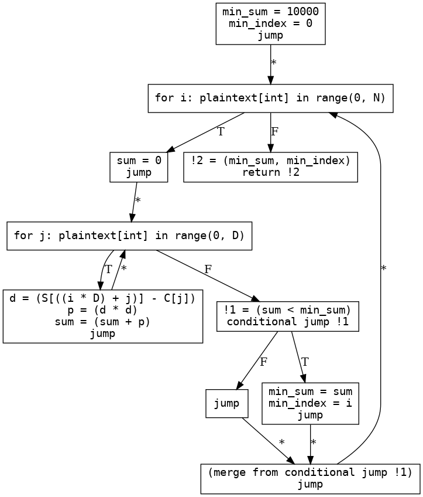
### SSA
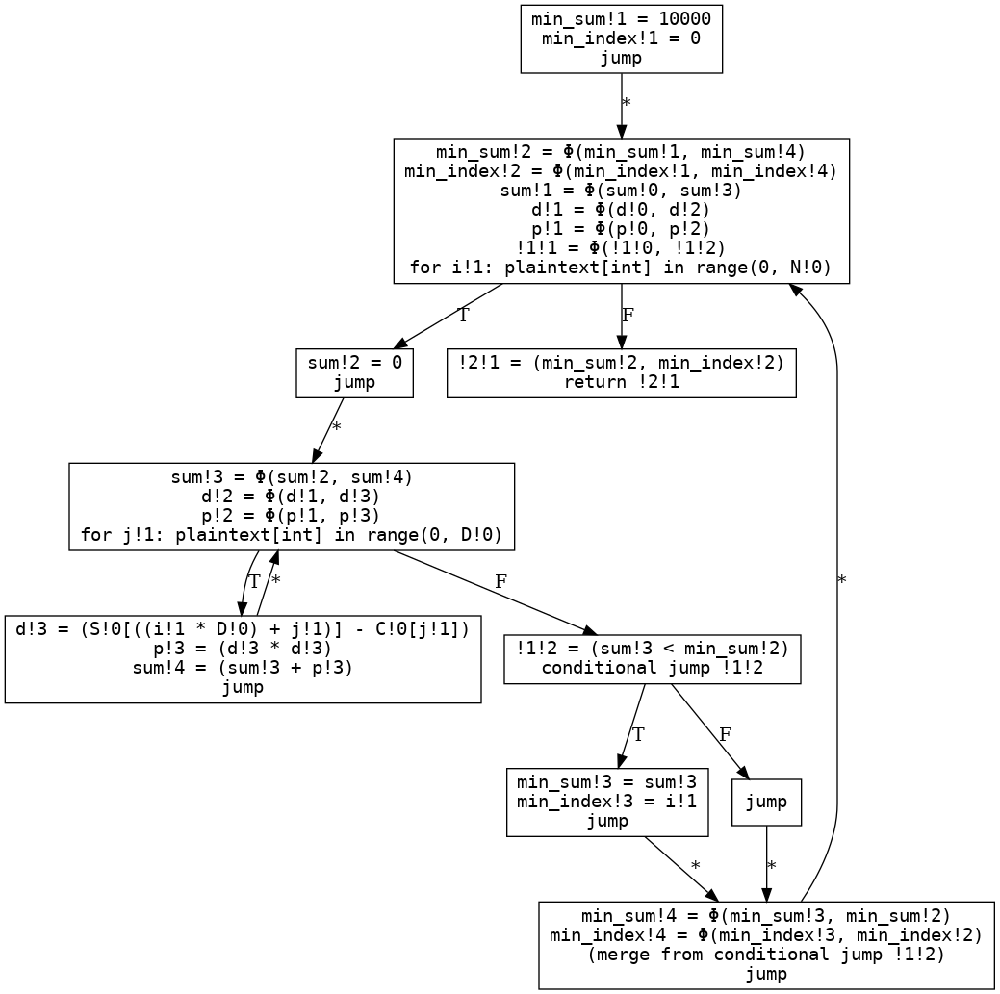
### SSA ϕ→MUX
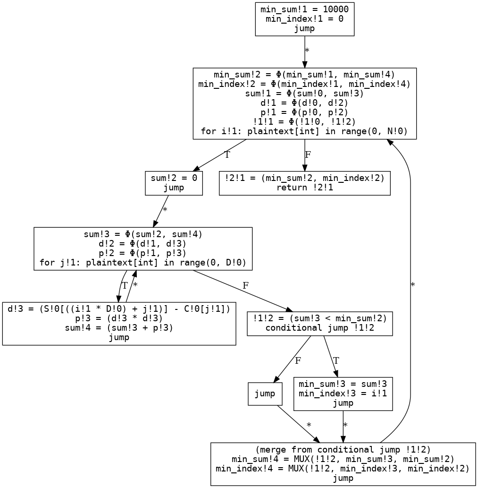
### Dead code elimination
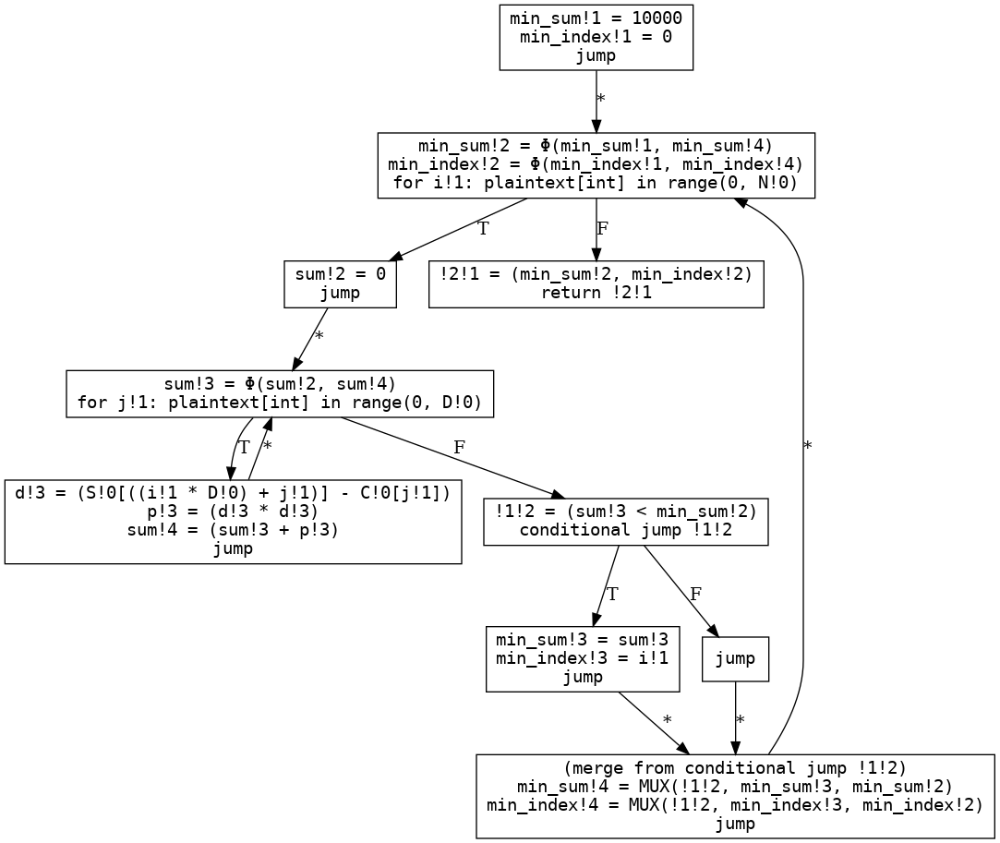
### Linear code with loops
```python
def biometric(C!0: shared[list[int]], D!0: plaintext[int], S!0: shared[list[int]], N!0: plaintext[int]) -> tuple[shared[int], shared[int]]:
    min_sum!1 = 10000
    min_index!1 = 0
    for i!1 in range(0, N!0):
        min_sum!2 = Φ(min_sum!1, min_sum!4)
        min_index!2 = Φ(min_index!1, min_index!4)
        sum!2 = 0
        for j!1 in range(0, D!0):
            sum!3 = Φ(sum!2, sum!4)
            d!3 = (S!0[((i!1 * D!0) + j!1)] - C!0[j!1])
            p!3 = (d!3 * d!3)
            sum!4 = (sum!3 + p!3)
        !1!2 = (sum!3 < min_sum!2)
        min_sum!3 = sum!3
        min_index!3 = i!1
        min_sum!4 = MUX(!1!2, min_sum!3, min_sum!2)
        min_index!4 = MUX(!1!2, min_index!3, min_index!2)
    !2!1 = (min_sum!2, min_index!2)
    return !2!1
```
### Dependency graph

### Removal of infeasible edges
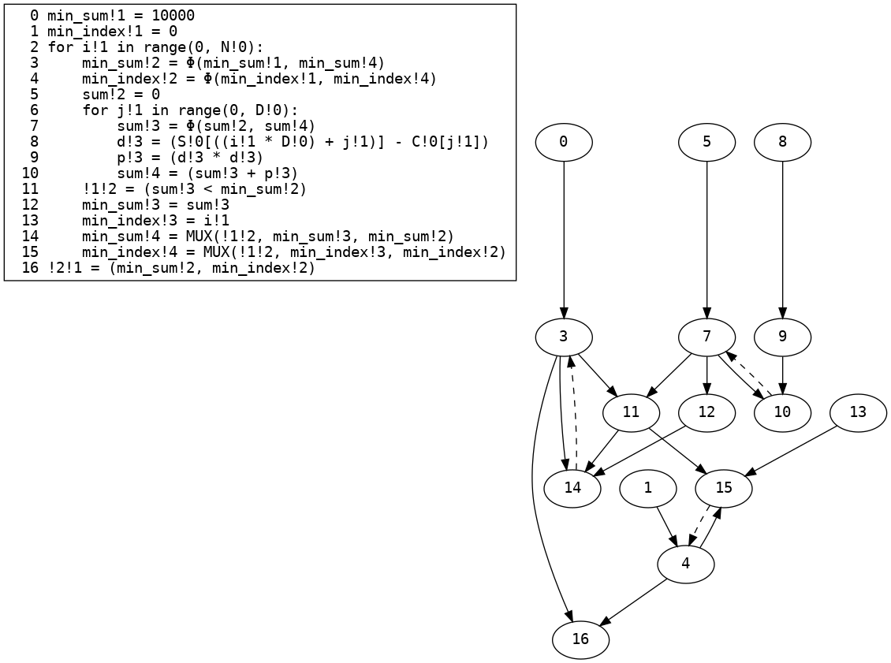
### Array MUX refinement
```python
def biometric(C!0: shared[list[int]], D!0: plaintext[int], S!0: shared[list[int]], N!0: plaintext[int]) -> tuple[shared[int], shared[int]]:
    min_sum!1 = 10000
    min_index!1 = 0
    for i!1 in range(0, N!0):
        min_sum!2 = Φ(min_sum!1, min_sum!4)
        min_index!2 = Φ(min_index!1, min_index!4)
        sum!2 = 0
        for j!1 in range(0, D!0):
            sum!3 = Φ(sum!2, sum!4)
            d!3 = (S!0[((i!1 * D!0) + j!1)] - C!0[j!1])
            p!3 = (d!3 * d!3)
            sum!4 = (sum!3 + p!3)
        !1!2 = (sum!3 < min_sum!2)
        min_sum!3 = sum!3
        min_index!3 = i!1
        min_sum!4 = MUX(!1!2, min_sum!3, min_sum!2)
        min_index!4 = MUX(!1!2, min_index!3, min_index!2)
    !2!1 = (min_sum!2, min_index!2)
    return !2!1
```
### Array MUX refinement (dependence graph)
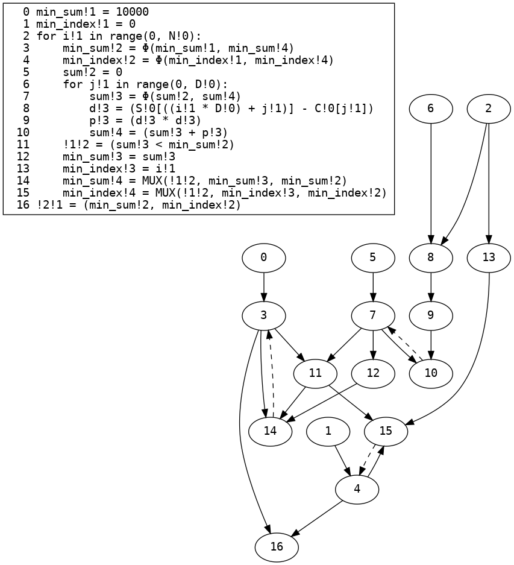
### Type environment
| Variable | Type |
| - | - |
| `C!0` | `shared[list[int]]` |
| `D!0` | `plaintext[int]` |
| `S!0` | `shared[list[int]]` |
| `N!0` | `plaintext[int]` |
| `i!1` | `plaintext[int]` |
| `j!1` | `plaintext[int]` |
| `min_sum!2` | `shared[int]` |
| `min_index!2` | `shared[int]` |
| `!2!1` | `tuple[shared[int], shared[int]]` |
| `!1!2` | `shared[bool]` |
| `min_index!3` | `plaintext[int]` |
| `min_index!4` | `shared[int]` |
| `min_index!1` | `plaintext[int]` |
| `min_sum!3` | `shared[int]` |
| `min_sum!4` | `shared[int]` |
| `min_sum!1` | `plaintext[int]` |
| `sum!3` | `shared[int]` |
| `p!3` | `shared[int]` |
| `sum!4` | `shared[int]` |
| `sum!2` | `plaintext[int]` |
| `d!3` | `shared[int]` |
### Motion code
```cpp
template <encrypto::motion::MpcProtocol Protocol>
std::tuple<encrypto::motion::SecureUnsignedInteger, encrypto::motion::SecureUnsignedInteger> biometric(
    encrypto::motion::PartyPointer &party,
    std::vector<encrypto::motion::SecureUnsignedInteger> C_0,
    std::uint32_t _MPC_PLAINTEXT_D_0,
    std::vector<encrypto::motion::SecureUnsignedInteger> S_0,
    std::uint32_t _MPC_PLAINTEXT_N_0
) {
    // Shared variable declarations
    encrypto::motion::SecureUnsignedInteger D_0;
    encrypto::motion::SecureUnsignedInteger N_0;
    encrypto::motion::SecureUnsignedInteger i_1;
    encrypto::motion::SecureUnsignedInteger j_1;
    encrypto::motion::SecureUnsignedInteger min_sum_2;
    encrypto::motion::SecureUnsignedInteger min_index_2;
    std::tuple<encrypto::motion::SecureUnsignedInteger, encrypto::motion::SecureUnsignedInteger> _2_1;
    encrypto::motion::ShareWrapper _1_2;
    encrypto::motion::SecureUnsignedInteger min_index_3;
    encrypto::motion::SecureUnsignedInteger min_index_4;
    encrypto::motion::SecureUnsignedInteger min_index_1;
    encrypto::motion::SecureUnsignedInteger min_sum_3;
    encrypto::motion::SecureUnsignedInteger min_sum_4;
    encrypto::motion::SecureUnsignedInteger min_sum_1;
    encrypto::motion::SecureUnsignedInteger sum_3;
    encrypto::motion::SecureUnsignedInteger p_3;
    encrypto::motion::SecureUnsignedInteger sum_4;
    encrypto::motion::SecureUnsignedInteger sum_2;
    encrypto::motion::SecureUnsignedInteger d_3;

    // Plaintext variable declarations
    std::uint32_t _MPC_PLAINTEXT_i_1;
    std::uint32_t _MPC_PLAINTEXT_j_1;
    std::tuple<std::uint32_t, std::uint32_t> _MPC_PLAINTEXT__2_1;
    std::uint32_t _MPC_PLAINTEXT_min_index_3;
    std::uint32_t _MPC_PLAINTEXT_min_index_1;
    std::uint32_t _MPC_PLAINTEXT_min_sum_1;
    std::uint32_t _MPC_PLAINTEXT_sum_2;

    // Constant initializations
    encrypto::motion::SecureUnsignedInteger _MPC_CONSTANT_0 = party->In<Protocol>(encrypto::motion::ToInput(std::uint32_t(0)), 0);
    encrypto::motion::SecureUnsignedInteger _MPC_CONSTANT_10000 = party->In<Protocol>(encrypto::motion::ToInput(std::uint32_t(10000)), 0);

    // Plaintext parameter assignments
    D_0 = party->In<Protocol>(encrypto::motion::ToInput(_MPC_PLAINTEXT_D_0), 0);

    N_0 = party->In<Protocol>(encrypto::motion::ToInput(_MPC_PLAINTEXT_N_0), 0);

    // Function body
    min_sum_1 = _MPC_CONSTANT_10000;
    _MPC_PLAINTEXT_min_sum_1 = std::uint32_t(10000);
    min_index_1 = _MPC_CONSTANT_0;
    _MPC_PLAINTEXT_min_index_1 = std::uint32_t(0);

    // Initialize phi values
    min_sum_2 = min_sum_1;
    min_index_2 = min_index_1;
    for (_MPC_PLAINTEXT_i_1 = std::uint32_t(0); _MPC_PLAINTEXT_i_1 < _MPC_PLAINTEXT_N_0; _MPC_PLAINTEXT_i_1++) {
        i_1 = party->In<Protocol>(encrypto::motion::ToInput(_MPC_PLAINTEXT_i_1), 0);
        sum_2 = _MPC_CONSTANT_0;
        _MPC_PLAINTEXT_sum_2 = std::uint32_t(0);

        // Initialize phi values
        sum_3 = sum_2;
        for (_MPC_PLAINTEXT_j_1 = std::uint32_t(0); _MPC_PLAINTEXT_j_1 < _MPC_PLAINTEXT_D_0; _MPC_PLAINTEXT_j_1++) {
            j_1 = party->In<Protocol>(encrypto::motion::ToInput(_MPC_PLAINTEXT_j_1), 0);
            d_3 = (S_0[((_MPC_PLAINTEXT_i_1 * _MPC_PLAINTEXT_D_0) + _MPC_PLAINTEXT_j_1)] - C_0[_MPC_PLAINTEXT_j_1]);
            p_3 = (d_3 * d_3);
            sum_4 = (sum_3 + p_3);

            // Update phi values
            sum_3 = sum_4;
        }

        _1_2 = (min_sum_2 > sum_3);
        min_sum_3 = sum_3;
        min_index_3 = i_1;
        _MPC_PLAINTEXT_min_index_3 = _MPC_PLAINTEXT_i_1;
        min_sum_4 = _1_2.Mux(min_sum_3.Get(), min_sum_2.Get());
        min_index_4 = _1_2.Mux(min_index_3.Get(), min_index_2.Get());

        // Update phi values
        min_sum_2 = min_sum_4;
        min_index_2 = min_index_4;
    }

    _2_1 = std::make_tuple(min_sum_2, min_index_2);

    return _2_1;
}
```
## `biometric_fast`
### Input
```python
from UTIL import shared


def biometric_matching_fast(
    D: int,
    N: int,
    C: shared[list[int]],
    C_sqr_sum: shared[int],
    two_C: shared[list[int]],
    S: shared[list[int]],
    S_sqr_sum: shared[list[int]],
) -> tuple[shared[int], shared[int]]:
    """
    Computes biometric matching

    This version uses some preprocessed data from parties to provide faster biometric matching

    :param int D: the cardinality of a feature vector, Usually small, e.g. 4
    :param int N: number of features in the database e.g. usually 1024, 2048, 4096, etc
    :param list[int] C: query feature vector, we need to find closest match to this vector in the DB, comes from client (Alice)
    :param int C_sqr_sum: sum of squares of elements of `C` e.g. if `C={1, 2, 3, 4}`, then `C_sqr_sum is: 1*1 + 2*2 + 3*3 + 4*4 = 30`
     client passes it pre-processed to to save gates in circuit
    :param list[int] two_C: same as `C` except that each element is multipled by 2, e.g. if `C={1, 2, 3, 4}`, then
     `two_C = {2, 4, 6, 8}`. client passes it preprocessed to save gates
    :param list[int] S: the database of features, it has N * D elements i.e. N features and each feature vector has D elements,
     this comes from server (Bob)
    :param list[int] S_sqr_sum: has N elements, each element is sum of squares of corresponding feature elements e.g. say
     S={{1, 2, 3, 4}, {5, 6, 7, 8}}, then S_sqr_sum={1*1 + 2*2 + 3*3 + 4*4, 5*5 + 6*6 + 7*7 + 8*8} = {30, 174}

    """

    differences: list[int] = []
    for i in range(D):
        differences = differences + [0]

    min_index: int = 0
    min_diff: int = differences[0]
    for i in range(N):
        a_sqr_plus_b_sqr: int = S_sqr_sum[i] + C_sqr_sum
        two_a_b: int = 0

        for j in range(D):
            tmp: int = S[i * D + j] * two_C[j]
            two_a_b = two_a_b + tmp

        this_diff: int = a_sqr_plus_b_sqr - two_a_b
        differences[i] = this_diff

        min_diff = differences[0]
        min_index = 0

        for k in range(N):
            if differences[k] < min_diff:
                min_diff = differences[k]
                min_index = k

    return (min_diff, min_index)


def test_biometric_matching_fast(D, N, C, S):
    """
    just a convenience method for testing, computes the pre-processing data for the actual call
    """
    two_C = [0] * D
    C_sqr_sum = 0
    S_sqr_sum = [0] * N
    for i in range(D):
        two_C[i] = 2 * C[i]
        C_sqr_sum = C_sqr_sum + (C[i] * C[i])

    for i in range(N):
        for j in range(D):
            S_sqr_sum[i] = S_sqr_sum[i] + (S[i * D + j] * S[i * D + j])

    print(biometric_matching__fast(D, N, C, C_sqr_sum, two_C, S, S_sqr_sum))


C = [1, 2, 3, 4]
S = [4, 5, 2, 10, 2, 120, 4, 10, 99, 88, 77, 66, 55, 44, 33, 22]
test_biometric_matching_fast(4, 4, C, S)

```
### Restricted AST
```python
def biometric_matching_fast(D: plaintext[int], N: plaintext[int], C: shared[list[int]], C_sqr_sum: shared[int], two_C: shared[list[int]], S: shared[list[int]], S_sqr_sum: shared[list[int]]) -> tuple[shared[int], shared[int]]:
    differences = []
    for i: plaintext[int] in range(0, D):
        differences = (differences + [0])
    min_index = 0
    min_diff = differences[0]
    for i: plaintext[int] in range(0, N):
        a_sqr_plus_b_sqr = (S_sqr_sum[i] + C_sqr_sum)
        two_a_b = 0
        for j: plaintext[int] in range(0, D):
            tmp = (S[((i * D) + j)] * two_C[j])
            two_a_b = (two_a_b + tmp)
        this_diff = (a_sqr_plus_b_sqr - two_a_b)
        differences[i] = this_diff
        min_diff = differences[0]
        min_index = 0
        for k: plaintext[int] in range(0, N):
            if (differences[k] < min_diff):
                min_diff = differences[k]
                min_index = k
    return (min_diff, min_index)
```
### Three-address code CFG
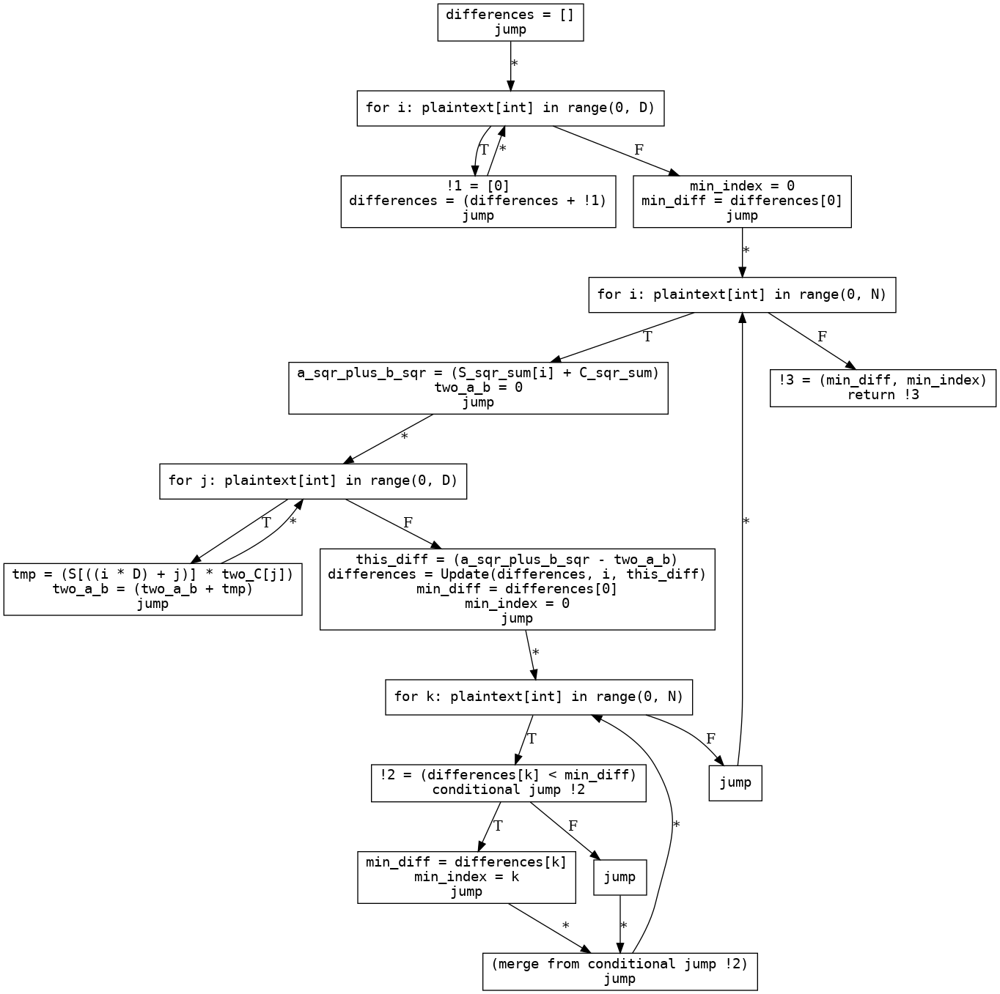
### SSA
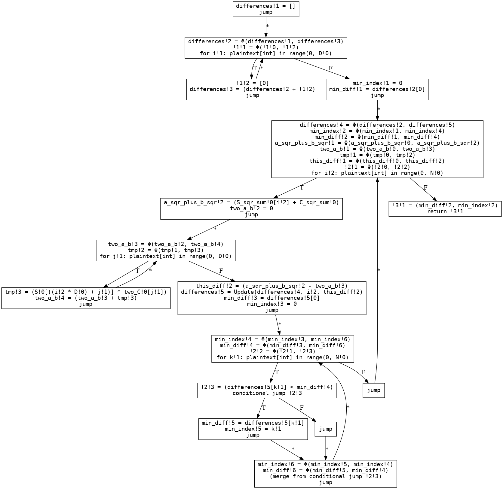
### SSA ϕ→MUX
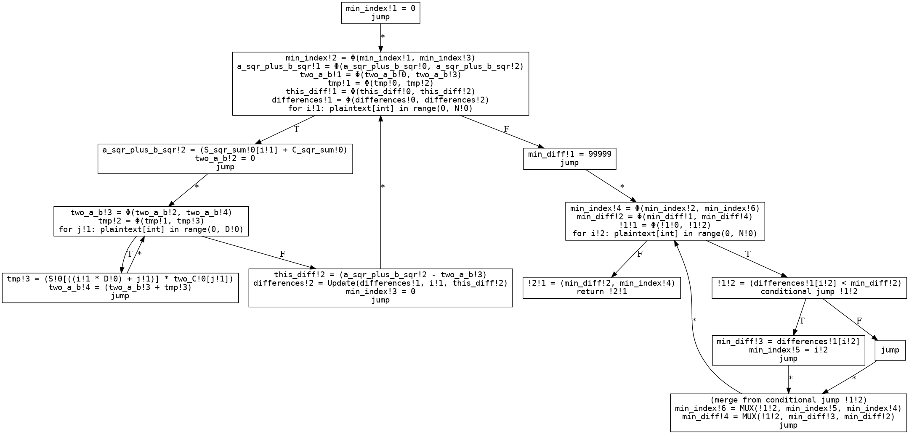
### Dead code elimination
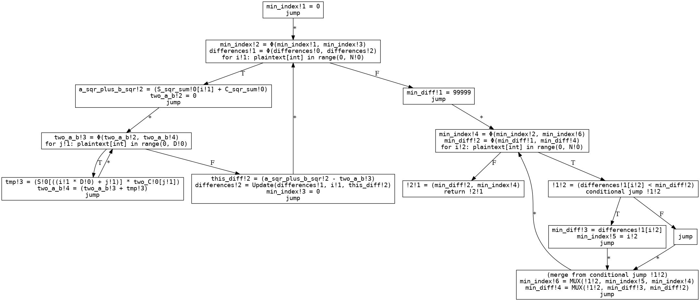
### Linear code with loops
```python
def biometric_matching_fast(D!0: plaintext[int], N!0: plaintext[int], C!0: shared[list[int]], C_sqr_sum!0: shared[int], two_C!0: shared[list[int]], S!0: shared[list[int]], S_sqr_sum!0: shared[list[int]]) -> tuple[shared[int], shared[int]]:
    differences!1 = []
    for i!1 in range(0, D!0):
        differences!2 = Φ(differences!1, differences!3)
        !1!2 = [0]
        differences!3 = (differences!2 + !1!2)
    min_index!1 = 0
    min_diff!1 = differences!2[0]
    for i!2 in range(0, N!0):
        differences!4 = Φ(differences!2, differences!5)
        min_index!2 = Φ(min_index!1, min_index!4)
        min_diff!2 = Φ(min_diff!1, min_diff!4)
        a_sqr_plus_b_sqr!2 = (S_sqr_sum!0[i!2] + C_sqr_sum!0)
        two_a_b!2 = 0
        for j!1 in range(0, D!0):
            two_a_b!3 = Φ(two_a_b!2, two_a_b!4)
            tmp!3 = (S!0[((i!2 * D!0) + j!1)] * two_C!0[j!1])
            two_a_b!4 = (two_a_b!3 + tmp!3)
        this_diff!2 = (a_sqr_plus_b_sqr!2 - two_a_b!3)
        differences!5 = Update(differences!4, i!2, this_diff!2)
        min_diff!3 = differences!5[0]
        min_index!3 = 0
        for k!1 in range(0, N!0):
            min_index!4 = Φ(min_index!3, min_index!6)
            min_diff!4 = Φ(min_diff!3, min_diff!6)
            !2!3 = (differences!5[k!1] < min_diff!4)
            min_diff!5 = differences!5[k!1]
            min_index!5 = k!1
            min_index!6 = MUX(!2!3, min_index!5, min_index!4)
            min_diff!6 = MUX(!2!3, min_diff!5, min_diff!4)
    !3!1 = (min_diff!2, min_index!2)
    return !3!1
```
### Dependency graph

### Removal of infeasible edges
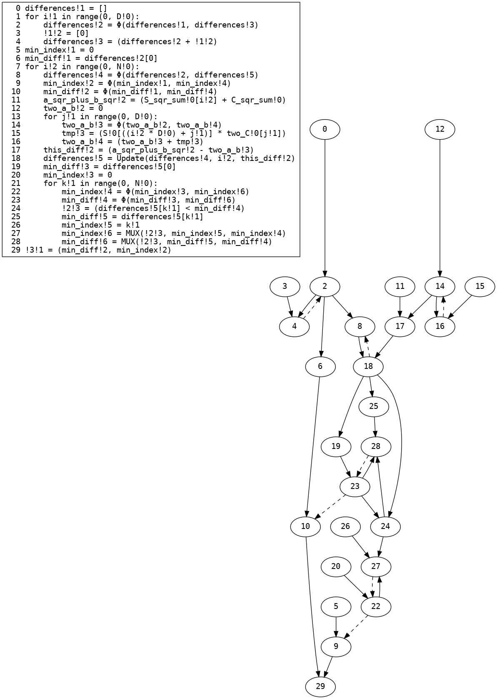
### Array MUX refinement
```python
def biometric_matching_fast(D!0: plaintext[int], N!0: plaintext[int], C!0: shared[list[int]], C_sqr_sum!0: shared[int], two_C!0: shared[list[int]], S!0: shared[list[int]], S_sqr_sum!0: shared[list[int]]) -> tuple[shared[int], shared[int]]:
    differences!1 = []
    for i!1 in range(0, D!0):
        differences!2 = Φ(differences!1, differences!3)
        !1!2 = [0]
        differences!3 = (differences!2 + !1!2)
    min_index!1 = 0
    min_diff!1 = differences!2[0]
    for i!2 in range(0, N!0):
        differences!4 = Φ(differences!2, differences!5)
        min_index!2 = Φ(min_index!1, min_index!4)
        min_diff!2 = Φ(min_diff!1, min_diff!4)
        a_sqr_plus_b_sqr!2 = (S_sqr_sum!0[i!2] + C_sqr_sum!0)
        two_a_b!2 = 0
        for j!1 in range(0, D!0):
            two_a_b!3 = Φ(two_a_b!2, two_a_b!4)
            tmp!3 = (S!0[((i!2 * D!0) + j!1)] * two_C!0[j!1])
            two_a_b!4 = (two_a_b!3 + tmp!3)
        this_diff!2 = (a_sqr_plus_b_sqr!2 - two_a_b!3)
        differences!5 = Update(differences!4, i!2, this_diff!2)
        min_diff!3 = differences!5[0]
        min_index!3 = 0
        for k!1 in range(0, N!0):
            min_index!4 = Φ(min_index!3, min_index!6)
            min_diff!4 = Φ(min_diff!3, min_diff!6)
            !2!3 = (differences!5[k!1] < min_diff!4)
            min_diff!5 = differences!5[k!1]
            min_index!5 = k!1
            min_index!6 = MUX(!2!3, min_index!5, min_index!4)
            min_diff!6 = MUX(!2!3, min_diff!5, min_diff!4)
    !3!1 = (min_diff!2, min_index!2)
    return !3!1
```
### Array MUX refinement (dependence graph)

### Type environment
| Variable | Type |
| - | - |
| `D!0` | `plaintext[int]` |
| `N!0` | `plaintext[int]` |
| `C!0` | `shared[list[int]]` |
| `C_sqr_sum!0` | `shared[int]` |
| `two_C!0` | `shared[list[int]]` |
| `S!0` | `shared[list[int]]` |
| `S_sqr_sum!0` | `shared[list[int]]` |
| `i!1` | `plaintext[int]` |
| `i!2` | `plaintext[int]` |
| `j!1` | `plaintext[int]` |
| `k!1` | `plaintext[int]` |
| `min_diff!2` | `shared[int]` |
| `min_index!2` | `shared[int]` |
| `!3!1` | `tuple[shared[int], shared[int]]` |
| `!2!3` | `shared[bool]` |
| `min_diff!4` | `shared[int]` |
| `min_diff!5` | `shared[int]` |
| `min_diff!6` | `shared[int]` |
| `min_diff!3` | `shared[int]` |
| `differences!5` | `shared[list[int]]` |
| `min_index!4` | `shared[int]` |
| `min_index!5` | `plaintext[int]` |
| `min_index!6` | `shared[int]` |
| `min_index!3` | `plaintext[int]` |
| `min_index!1` | `plaintext[int]` |
| `min_diff!1` | `plaintext[int]` |
| `this_diff!2` | `shared[int]` |
| `differences!4` | `shared[list[int]]` |
| `a_sqr_plus_b_sqr!2` | `shared[int]` |
| `two_a_b!3` | `shared[int]` |
| `differences!2` | `plaintext[list[int]]` |
| `tmp!3` | `shared[int]` |
| `two_a_b!4` | `shared[int]` |
| `two_a_b!2` | `plaintext[int]` |
| `!1!2` | `plaintext[list[int]]` |
| `differences!3` | `plaintext[list[int]]` |
| `differences!1` | `plaintext[list[int]]` |
### Motion code
```cpp
template <encrypto::motion::MpcProtocol Protocol>
std::tuple<encrypto::motion::SecureUnsignedInteger, encrypto::motion::SecureUnsignedInteger> biometric_matching_fast(
    encrypto::motion::PartyPointer &party,
    std::uint32_t _MPC_PLAINTEXT_D_0,
    std::uint32_t _MPC_PLAINTEXT_N_0,
    std::vector<encrypto::motion::SecureUnsignedInteger> C_0,
    encrypto::motion::SecureUnsignedInteger C_sqr_sum_0,
    std::vector<encrypto::motion::SecureUnsignedInteger> two_C_0,
    std::vector<encrypto::motion::SecureUnsignedInteger> S_0,
    std::vector<encrypto::motion::SecureUnsignedInteger> S_sqr_sum_0
) {
    // Shared variable declarations
    encrypto::motion::SecureUnsignedInteger D_0;
    encrypto::motion::SecureUnsignedInteger N_0;
    encrypto::motion::SecureUnsignedInteger i_1;
    encrypto::motion::SecureUnsignedInteger i_2;
    encrypto::motion::SecureUnsignedInteger j_1;
    encrypto::motion::SecureUnsignedInteger k_1;
    encrypto::motion::SecureUnsignedInteger min_diff_2;
    encrypto::motion::SecureUnsignedInteger min_index_2;
    std::tuple<encrypto::motion::SecureUnsignedInteger, encrypto::motion::SecureUnsignedInteger> _3_1;
    encrypto::motion::ShareWrapper _2_3;
    encrypto::motion::SecureUnsignedInteger min_diff_4;
    encrypto::motion::SecureUnsignedInteger min_diff_5;
    encrypto::motion::SecureUnsignedInteger min_diff_6;
    encrypto::motion::SecureUnsignedInteger min_diff_3;
    std::vector<encrypto::motion::SecureUnsignedInteger> differences_5;
    encrypto::motion::SecureUnsignedInteger min_index_4;
    encrypto::motion::SecureUnsignedInteger min_index_5;
    encrypto::motion::SecureUnsignedInteger min_index_6;
    encrypto::motion::SecureUnsignedInteger min_index_3;
    encrypto::motion::SecureUnsignedInteger min_index_1;
    encrypto::motion::SecureUnsignedInteger min_diff_1;
    encrypto::motion::SecureUnsignedInteger this_diff_2;
    std::vector<encrypto::motion::SecureUnsignedInteger> differences_4;
    encrypto::motion::SecureUnsignedInteger a_sqr_plus_b_sqr_2;
    encrypto::motion::SecureUnsignedInteger two_a_b_3;
    std::vector<encrypto::motion::SecureUnsignedInteger> differences_2;
    encrypto::motion::SecureUnsignedInteger tmp_3;
    encrypto::motion::SecureUnsignedInteger two_a_b_4;
    encrypto::motion::SecureUnsignedInteger two_a_b_2;
    std::vector<encrypto::motion::SecureUnsignedInteger> _1_2;
    std::vector<encrypto::motion::SecureUnsignedInteger> differences_3;
    std::vector<encrypto::motion::SecureUnsignedInteger> differences_1;

    // Plaintext variable declarations
    std::uint32_t _MPC_PLAINTEXT_i_1;
    std::uint32_t _MPC_PLAINTEXT_i_2;
    std::uint32_t _MPC_PLAINTEXT_j_1;
    std::uint32_t _MPC_PLAINTEXT_k_1;
    std::tuple<std::uint32_t, std::uint32_t> _MPC_PLAINTEXT__3_1;
    std::uint32_t _MPC_PLAINTEXT_min_index_5;
    std::uint32_t _MPC_PLAINTEXT_min_index_3;
    std::uint32_t _MPC_PLAINTEXT_min_index_1;
    std::uint32_t _MPC_PLAINTEXT_min_diff_1;
    std::vector<std::uint32_t> _MPC_PLAINTEXT_differences_2;
    std::uint32_t _MPC_PLAINTEXT_two_a_b_2;
    std::vector<std::uint32_t> _MPC_PLAINTEXT__1_2;
    std::vector<std::uint32_t> _MPC_PLAINTEXT_differences_3;
    std::vector<std::uint32_t> _MPC_PLAINTEXT_differences_1;

    // Constant initializations
    encrypto::motion::SecureUnsignedInteger _MPC_CONSTANT_0 = party->In<Protocol>(encrypto::motion::ToInput(std::uint32_t(0)), 0);

    // Plaintext parameter assignments
    D_0 = party->In<Protocol>(encrypto::motion::ToInput(_MPC_PLAINTEXT_D_0), 0);

    N_0 = party->In<Protocol>(encrypto::motion::ToInput(_MPC_PLAINTEXT_N_0), 0);

    // Function body
    differences_1 = {};
    _MPC_PLAINTEXT_differences_1 = {};

    // Initialize phi values
    differences_2 = differences_1;
    for (_MPC_PLAINTEXT_i_1 = std::uint32_t(0); _MPC_PLAINTEXT_i_1 < _MPC_PLAINTEXT_D_0; _MPC_PLAINTEXT_i_1++) {
        i_1 = party->In<Protocol>(encrypto::motion::ToInput(_MPC_PLAINTEXT_i_1), 0);
        _1_2 = {_MPC_CONSTANT_0};
        _MPC_PLAINTEXT__1_2 = {std::uint32_t(0)};
        differences_3 = (differences_2 + _1_2);
        _MPC_PLAINTEXT_differences_3 = (_MPC_PLAINTEXT_differences_2 + _MPC_PLAINTEXT__1_2);

        // Update phi values
        differences_2 = differences_3;
    }

    min_index_1 = _MPC_CONSTANT_0;
    _MPC_PLAINTEXT_min_index_1 = std::uint32_t(0);
    min_diff_1 = differences_2[std::uint32_t(0)];
    _MPC_PLAINTEXT_min_diff_1 = _MPC_PLAINTEXT_differences_2[std::uint32_t(0)];

    // Initialize phi values
    differences_4 = differences_2;
    min_index_2 = min_index_1;
    min_diff_2 = min_diff_1;
    for (_MPC_PLAINTEXT_i_2 = std::uint32_t(0); _MPC_PLAINTEXT_i_2 < _MPC_PLAINTEXT_N_0; _MPC_PLAINTEXT_i_2++) {
        i_2 = party->In<Protocol>(encrypto::motion::ToInput(_MPC_PLAINTEXT_i_2), 0);
        a_sqr_plus_b_sqr_2 = (S_sqr_sum_0[_MPC_PLAINTEXT_i_2] + C_sqr_sum_0);
        two_a_b_2 = _MPC_CONSTANT_0;
        _MPC_PLAINTEXT_two_a_b_2 = std::uint32_t(0);

        // Initialize phi values
        two_a_b_3 = two_a_b_2;
        for (_MPC_PLAINTEXT_j_1 = std::uint32_t(0); _MPC_PLAINTEXT_j_1 < _MPC_PLAINTEXT_D_0; _MPC_PLAINTEXT_j_1++) {
            j_1 = party->In<Protocol>(encrypto::motion::ToInput(_MPC_PLAINTEXT_j_1), 0);
            tmp_3 = (S_0[((_MPC_PLAINTEXT_i_2 * _MPC_PLAINTEXT_D_0) + _MPC_PLAINTEXT_j_1)] * two_C_0[_MPC_PLAINTEXT_j_1]);
            two_a_b_4 = (two_a_b_3 + tmp_3);

            // Update phi values
            two_a_b_3 = two_a_b_4;
        }

        this_diff_2 = (a_sqr_plus_b_sqr_2 - two_a_b_3);
        differences_5 = differences_4;
        differences_4[_MPC_PLAINTEXT_i_2] = this_diff_2;
        min_diff_3 = differences_5[std::uint32_t(0)];
        min_index_3 = _MPC_CONSTANT_0;
        _MPC_PLAINTEXT_min_index_3 = std::uint32_t(0);

        // Initialize phi values
        min_index_4 = min_index_3;
        min_diff_4 = min_diff_3;
        for (_MPC_PLAINTEXT_k_1 = std::uint32_t(0); _MPC_PLAINTEXT_k_1 < _MPC_PLAINTEXT_N_0; _MPC_PLAINTEXT_k_1++) {
            k_1 = party->In<Protocol>(encrypto::motion::ToInput(_MPC_PLAINTEXT_k_1), 0);
            _2_3 = (min_diff_4 > differences_5[_MPC_PLAINTEXT_k_1]);
            min_diff_5 = differences_5[_MPC_PLAINTEXT_k_1];
            min_index_5 = k_1;
            _MPC_PLAINTEXT_min_index_5 = _MPC_PLAINTEXT_k_1;
            min_index_6 = _2_3.Mux(min_index_5.Get(), min_index_4.Get());
            min_diff_6 = _2_3.Mux(min_diff_5.Get(), min_diff_4.Get());

            // Update phi values
            min_index_4 = min_index_6;
            min_diff_4 = min_diff_6;
        }


        // Update phi values
        differences_4 = differences_5;
        min_index_2 = min_index_4;
        min_diff_2 = min_diff_4;
    }

    _3_1 = std::make_tuple(min_diff_2, min_index_2);

    return _3_1;
}
```
## `chapterfour_figure_12`
### Input
```python
from UTIL import shared


def chapterfour_figure_12(x: shared[int], y: shared[int]) -> shared[int]:
    z = 0
    if x > 0:
        if y > 0:
            z = 1
        else:
            z = 0
    return z

```
### Restricted AST
```python
def chapterfour_figure_12(x: shared[int], y: shared[int]) -> shared[int]:
    z = 0
    if (x > 0):
        if (y > 0):
            z = 1
        else:
            z = 0
    return z
```
### Three-address code CFG
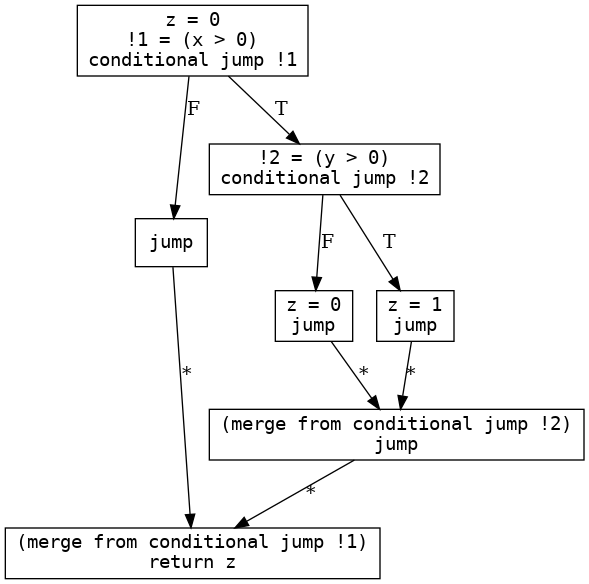
### SSA
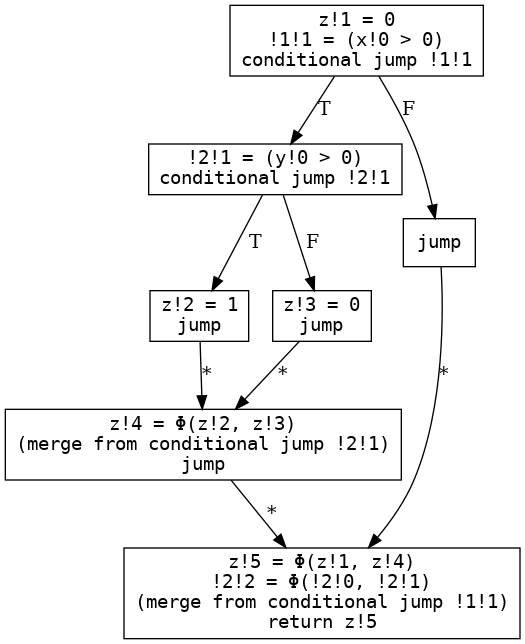
### SSA ϕ→MUX
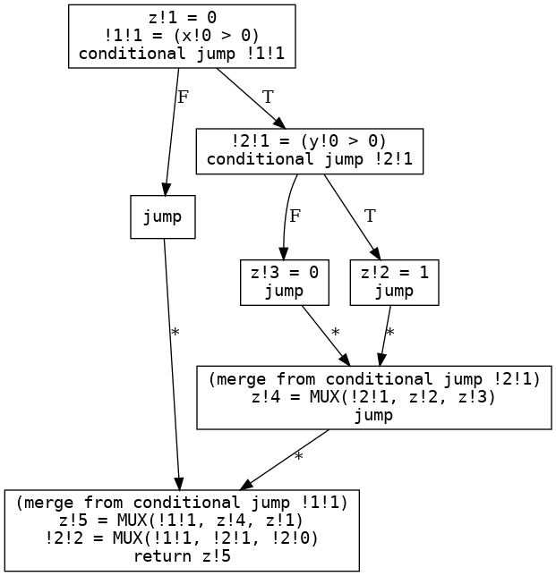
### Dead code elimination
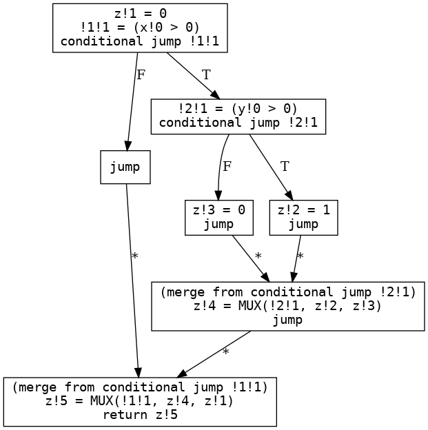
### Linear code with loops
```python
def chapterfour_figure_12(x!0: shared[int], y!0: shared[int]) -> shared[int]:
    z!1 = 0
    !1!1 = (x!0 > 0)
    !2!1 = (y!0 > 0)
    z!3 = 0
    z!2 = 1
    z!4 = MUX(!2!1, z!2, z!3)
    z!5 = MUX(!1!1, z!1, z!4)
    return z!5
```
### Dependency graph

### Removal of infeasible edges

### Array MUX refinement
```python
def chapterfour_figure_12(x!0: shared[int], y!0: shared[int]) -> shared[int]:
    z!1 = 0
    !1!1 = (x!0 > 0)
    !2!1 = (y!0 > 0)
    z!3 = 0
    z!2 = 1
    z!4 = MUX(!2!1, z!2, z!3)
    z!5 = MUX(!1!1, z!1, z!4)
    return z!5
```
### Array MUX refinement (dependence graph)

### Type environment
| Variable | Type |
| - | - |
| `x!0` | `shared[int]` |
| `y!0` | `shared[int]` |
| `!1!1` | `shared[bool]` |
| `z!4` | `shared[int]` |
| `z!1` | `plaintext[int]` |
| `z!5` | `shared[int]` |
| `!2!1` | `shared[bool]` |
| `z!3` | `plaintext[int]` |
| `z!2` | `plaintext[int]` |
### Motion code
```cpp
template <encrypto::motion::MpcProtocol Protocol>
encrypto::motion::SecureUnsignedInteger chapterfour_figure_12(
    encrypto::motion::PartyPointer &party,
    encrypto::motion::SecureUnsignedInteger x_0,
    encrypto::motion::SecureUnsignedInteger y_0
) {
    // Shared variable declarations
    encrypto::motion::ShareWrapper _1_1;
    encrypto::motion::SecureUnsignedInteger z_4;
    encrypto::motion::SecureUnsignedInteger z_1;
    encrypto::motion::SecureUnsignedInteger z_5;
    encrypto::motion::ShareWrapper _2_1;
    encrypto::motion::SecureUnsignedInteger z_3;
    encrypto::motion::SecureUnsignedInteger z_2;

    // Plaintext variable declarations
    std::uint32_t _MPC_PLAINTEXT_z_1;
    std::uint32_t _MPC_PLAINTEXT_z_3;
    std::uint32_t _MPC_PLAINTEXT_z_2;

    // Constant initializations
    encrypto::motion::SecureUnsignedInteger _MPC_CONSTANT_0 = party->In<Protocol>(encrypto::motion::ToInput(std::uint32_t(0)), 0);
    encrypto::motion::SecureUnsignedInteger _MPC_CONSTANT_1 = party->In<Protocol>(encrypto::motion::ToInput(std::uint32_t(1)), 0);

    // Plaintext parameter assignments


    // Function body
    z_1 = _MPC_CONSTANT_0;
    _MPC_PLAINTEXT_z_1 = std::uint32_t(0);
    _1_1 = (x_0 > _MPC_CONSTANT_0);
    _2_1 = (y_0 > _MPC_CONSTANT_0);
    z_3 = _MPC_CONSTANT_0;
    _MPC_PLAINTEXT_z_3 = std::uint32_t(0);
    z_2 = _MPC_CONSTANT_1;
    _MPC_PLAINTEXT_z_2 = std::uint32_t(1);
    z_4 = _2_1.Mux(z_2.Get(), z_3.Get());
    z_5 = _1_1.Mux(z_1.Get(), z_4.Get());

    return z_5;
}
```
## `convex_hull`
### Input
```python
from UTIL import shared


def convex_hull(
    X_coords: shared[list[int]], Y_coords: shared[list[int]], N: int
) -> tuple[shared[list[int]], shared[list[int]]]:
    hull_X: list[int] = []
    hull_Y: list[int] = []

    for i in range(0, N):
        is_hull = True
        p1_X = X_coords[i]
        p1_Y = Y_coords[i]

        if p1_X <= 0 and p1_Y >= 0:
            for j in range(0, N):
                p2_X = X_coords[j]
                p2_Y = Y_coords[j]

                if not (p1_X <= p2_X or p1_Y >= p2_Y):
                    is_hull = False

        if is_hull:
            hull_X = hull_X + [p1_X]
            hull_Y = hull_Y + [p1_Y]

    return (hull_X, hull_Y)

```
### Restricted AST
```python
def convex_hull(X_coords: shared[list[int]], Y_coords: shared[list[int]], N: plaintext[int]) -> tuple[shared[list[int]], shared[list[int]]]:
    hull_X = []
    hull_Y = []
    for i: plaintext[int] in range(0, N):
        is_hull = True
        p1_X = X_coords[i]
        p1_Y = Y_coords[i]
        if ((p1_X <= 0) and (p1_Y >= 0)):
            for j: plaintext[int] in range(0, N):
                p2_X = X_coords[j]
                p2_Y = Y_coords[j]
                if not ((p1_X <= p2_X) or (p1_Y >= p2_Y)):
                    is_hull = False
        if is_hull:
            hull_X = (hull_X + [p1_X])
            hull_Y = (hull_Y + [p1_Y])
    return (hull_X, hull_Y)
```
### Three-address code CFG
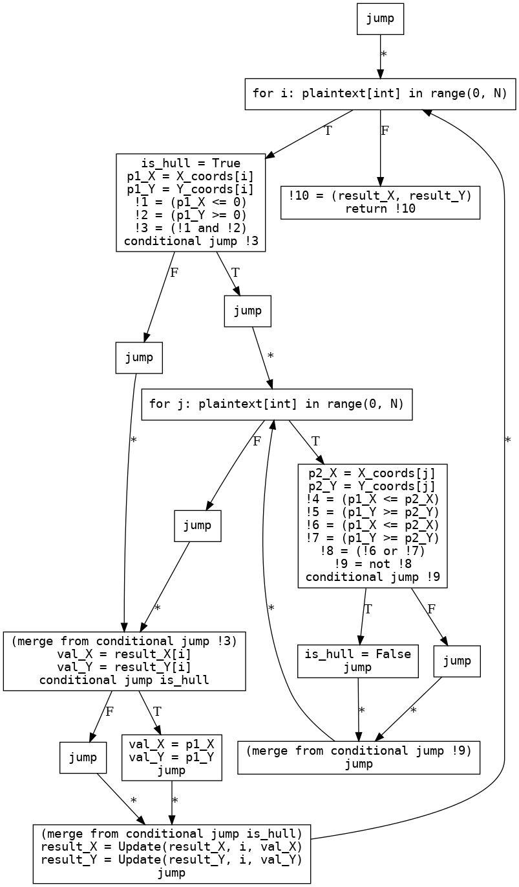
### SSA
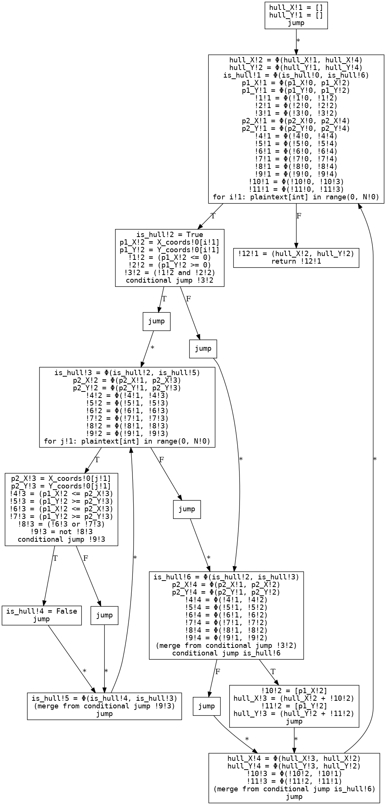
### SSA ϕ→MUX
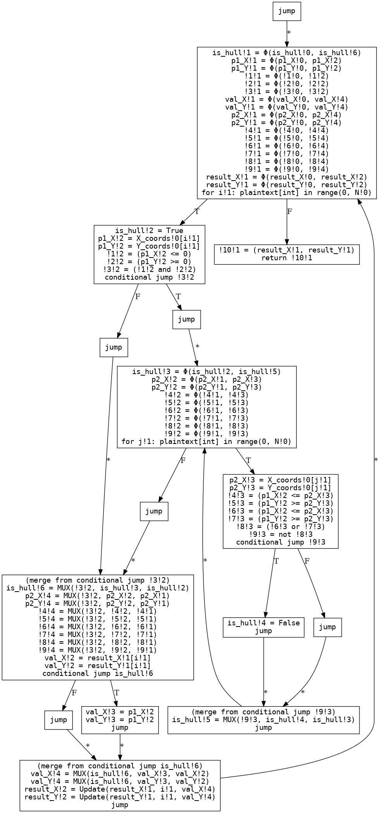
### Dead code elimination
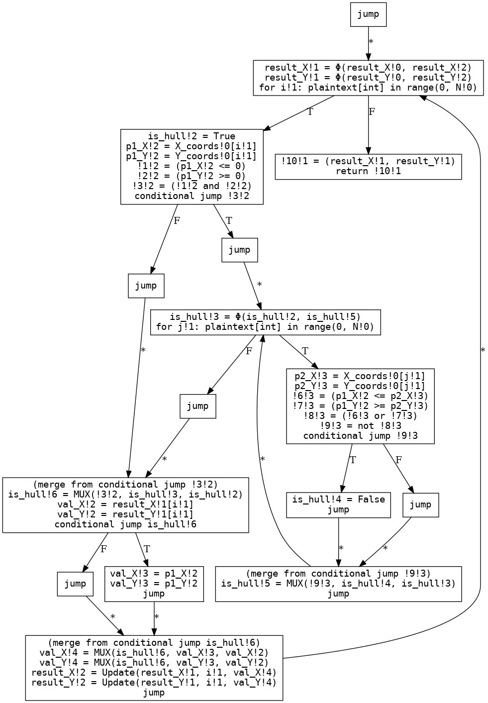
### Linear code with loops
```python
def convex_hull(X_coords!0: shared[list[int]], Y_coords!0: shared[list[int]], N!0: plaintext[int]) -> tuple[shared[list[int]], shared[list[int]]]:
    hull_X!1 = []
    hull_Y!1 = []
    for i!1 in range(0, N!0):
        hull_X!2 = Φ(hull_X!1, hull_X!4)
        hull_Y!2 = Φ(hull_Y!1, hull_Y!4)
        is_hull!2 = True
        p1_X!2 = X_coords!0[i!1]
        p1_Y!2 = Y_coords!0[i!1]
        !1!2 = (p1_X!2 <= 0)
        !2!2 = (p1_Y!2 >= 0)
        !3!2 = (!1!2 and !2!2)
        for j!1 in range(0, N!0):
            is_hull!3 = Φ(is_hull!2, is_hull!5)
            p2_X!3 = X_coords!0[j!1]
            p2_Y!3 = Y_coords!0[j!1]
            !6!3 = (p1_X!2 <= p2_X!3)
            !7!3 = (p1_Y!2 >= p2_Y!3)
            !8!3 = (!6!3 or !7!3)
            !9!3 = not !8!3
            is_hull!4 = False
            is_hull!5 = MUX(!9!3, is_hull!4, is_hull!3)
        is_hull!6 = MUX(!3!2, is_hull!2, is_hull!3)
        !10!2 = [p1_X!2]
        hull_X!3 = (hull_X!2 + !10!2)
        !11!2 = [p1_Y!2]
        hull_Y!3 = (hull_Y!2 + !11!2)
        hull_X!4 = MUX(is_hull!6, hull_X!3, hull_X!2)
        hull_Y!4 = MUX(is_hull!6, hull_Y!3, hull_Y!2)
    !12!1 = (hull_X!2, hull_Y!2)
    return !12!1
```
### Dependency graph
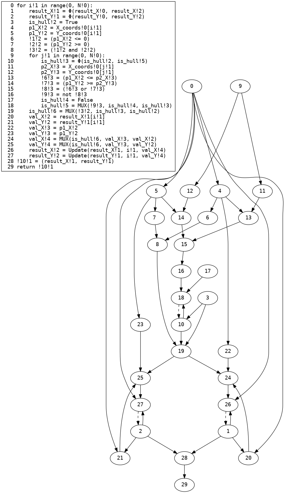
### Removal of infeasible edges
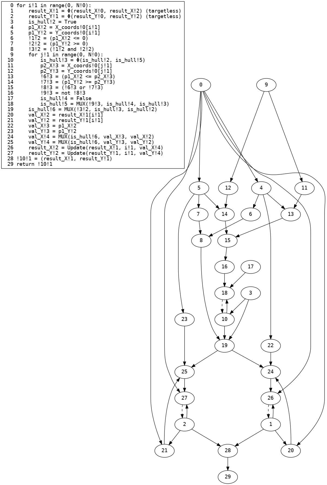
### Array MUX refinement
```python
def convex_hull(X_coords!0: shared[list[int]], Y_coords!0: shared[list[int]], N!0: plaintext[int]) -> tuple[shared[list[int]], shared[list[int]]]:
    hull_X!1 = []
    hull_Y!1 = []
    for i!1 in range(0, N!0):
        hull_X!2 = Φ(hull_X!1, hull_X!4)
        hull_Y!2 = Φ(hull_Y!1, hull_Y!4)
        is_hull!2 = True
        p1_X!2 = X_coords!0[i!1]
        p1_Y!2 = Y_coords!0[i!1]
        !1!2 = (p1_X!2 <= 0)
        !2!2 = (p1_Y!2 >= 0)
        !3!2 = (!1!2 and !2!2)
        for j!1 in range(0, N!0):
            is_hull!3 = Φ(is_hull!2, is_hull!5)
            p2_X!3 = X_coords!0[j!1]
            p2_Y!3 = Y_coords!0[j!1]
            !6!3 = (p1_X!2 <= p2_X!3)
            !7!3 = (p1_Y!2 >= p2_Y!3)
            !8!3 = (!6!3 or !7!3)
            !9!3 = not !8!3
            is_hull!4 = False
            is_hull!5 = MUX(!9!3, is_hull!4, is_hull!3)
        is_hull!6 = MUX(!3!2, is_hull!2, is_hull!3)
        !10!2 = [p1_X!2]
        hull_X!3 = (hull_X!2 + !10!2)
        !11!2 = [p1_Y!2]
        hull_Y!3 = (hull_Y!2 + !11!2)
        hull_X!4 = MUX(is_hull!6, hull_X!3, hull_X!2)
        hull_Y!4 = MUX(is_hull!6, hull_Y!3, hull_Y!2)
    !12!1 = (hull_X!2, hull_Y!2)
    return !12!1
```
### Array MUX refinement (dependence graph)
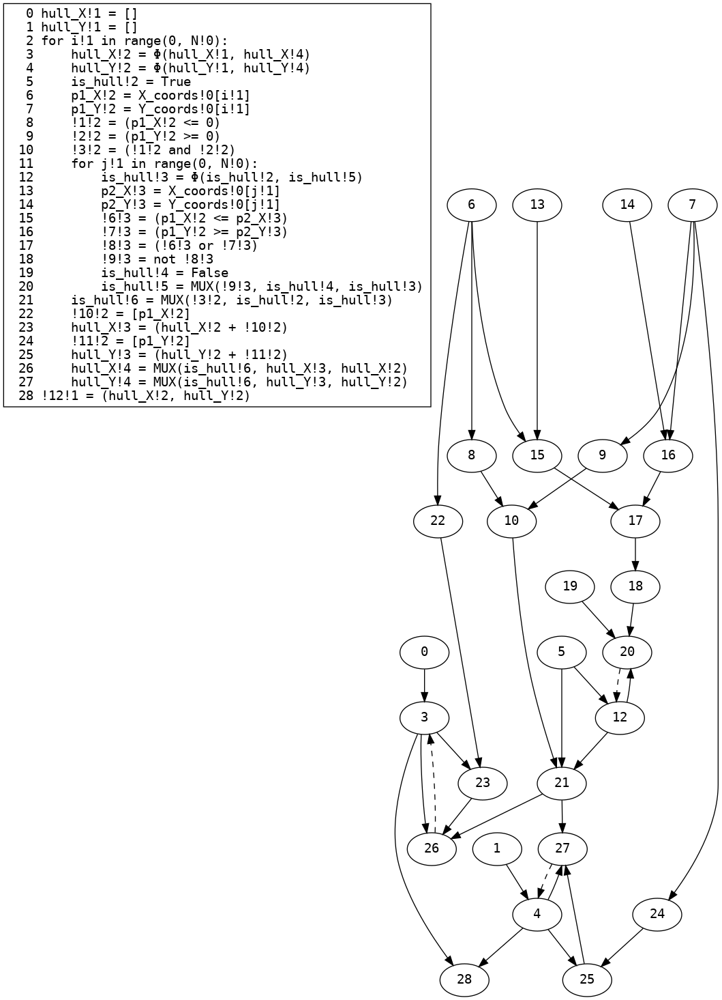
### Type environment
| Variable | Type |
| - | - |
| `X_coords!0` | `shared[list[int]]` |
| `Y_coords!0` | `shared[list[int]]` |
| `N!0` | `plaintext[int]` |
| `i!1` | `plaintext[int]` |
| `j!1` | `plaintext[int]` |
| `hull_X!2` | `shared[list[int]]` |
| `hull_Y!2` | `shared[list[int]]` |
| `!12!1` | `tuple[shared[list[int]], shared[list[int]]]` |
| `is_hull!6` | `shared[bool]` |
| `hull_Y!3` | `shared[list[int]]` |
| `hull_Y!4` | `shared[list[int]]` |
| `hull_Y!1` | `plaintext[list[int]]` |
| `!11!2` | `shared[list[int]]` |
| `hull_X!3` | `shared[list[int]]` |
| `hull_X!4` | `shared[list[int]]` |
| `hull_X!1` | `plaintext[list[int]]` |
| `!10!2` | `shared[list[int]]` |
| `p1_Y!2` | `shared[int]` |
| `p1_X!2` | `shared[int]` |
| `!3!2` | `shared[bool]` |
| `is_hull!3` | `shared[bool]` |
| `is_hull!2` | `plaintext[bool]` |
| `!9!3` | `shared[bool]` |
| `is_hull!4` | `plaintext[bool]` |
| `is_hull!5` | `shared[bool]` |
| `!8!3` | `shared[bool]` |
| `!6!3` | `shared[bool]` |
| `!7!3` | `shared[bool]` |
| `p2_Y!3` | `shared[int]` |
| `p2_X!3` | `shared[int]` |
| `!1!2` | `shared[bool]` |
| `!2!2` | `shared[bool]` |
### Motion code
```cpp
template <encrypto::motion::MpcProtocol Protocol>
std::tuple<std::vector<encrypto::motion::SecureUnsignedInteger>, std::vector<encrypto::motion::SecureUnsignedInteger>> convex_hull(
    encrypto::motion::PartyPointer &party,
    std::vector<encrypto::motion::SecureUnsignedInteger> X_coords_0,
    std::vector<encrypto::motion::SecureUnsignedInteger> Y_coords_0,
    std::uint32_t _MPC_PLAINTEXT_N_0
) {
    // Shared variable declarations
    encrypto::motion::SecureUnsignedInteger N_0;
    encrypto::motion::SecureUnsignedInteger i_1;
    encrypto::motion::SecureUnsignedInteger j_1;
    std::vector<encrypto::motion::SecureUnsignedInteger> hull_X_2;
    std::vector<encrypto::motion::SecureUnsignedInteger> hull_Y_2;
    std::tuple<std::vector<encrypto::motion::SecureUnsignedInteger>, std::vector<encrypto::motion::SecureUnsignedInteger>> _12_1;
    encrypto::motion::ShareWrapper is_hull_6;
    std::vector<encrypto::motion::SecureUnsignedInteger> hull_Y_3;
    std::vector<encrypto::motion::SecureUnsignedInteger> hull_Y_4;
    std::vector<encrypto::motion::SecureUnsignedInteger> hull_Y_1;
    std::vector<encrypto::motion::SecureUnsignedInteger> _11_2;
    std::vector<encrypto::motion::SecureUnsignedInteger> hull_X_3;
    std::vector<encrypto::motion::SecureUnsignedInteger> hull_X_4;
    std::vector<encrypto::motion::SecureUnsignedInteger> hull_X_1;
    std::vector<encrypto::motion::SecureUnsignedInteger> _10_2;
    encrypto::motion::SecureUnsignedInteger p1_Y_2;
    encrypto::motion::SecureUnsignedInteger p1_X_2;
    encrypto::motion::ShareWrapper _3_2;
    encrypto::motion::ShareWrapper is_hull_3;
    encrypto::motion::ShareWrapper is_hull_2;
    encrypto::motion::ShareWrapper _9_3;
    encrypto::motion::ShareWrapper is_hull_4;
    encrypto::motion::ShareWrapper is_hull_5;
    encrypto::motion::ShareWrapper _8_3;
    encrypto::motion::ShareWrapper _6_3;
    encrypto::motion::ShareWrapper _7_3;
    encrypto::motion::SecureUnsignedInteger p2_Y_3;
    encrypto::motion::SecureUnsignedInteger p2_X_3;
    encrypto::motion::ShareWrapper _1_2;
    encrypto::motion::ShareWrapper _2_2;

    // Plaintext variable declarations
    std::uint32_t _MPC_PLAINTEXT_i_1;
    std::uint32_t _MPC_PLAINTEXT_j_1;
    std::tuple<std::vector<std::uint32_t>, std::vector<std::uint32_t>> _MPC_PLAINTEXT__12_1;
    std::vector<std::uint32_t> _MPC_PLAINTEXT_hull_Y_1;
    std::vector<std::uint32_t> _MPC_PLAINTEXT_hull_X_1;
    bool _MPC_PLAINTEXT_is_hull_2;
    bool _MPC_PLAINTEXT_is_hull_4;

    // Constant initializations
    encrypto::motion::ShareWrapper _MPC_CONSTANT_false = party->In<Protocol>(encrypto::motion::BitVector(1, false), 0);
    encrypto::motion::SecureUnsignedInteger _MPC_CONSTANT_0 = party->In<Protocol>(encrypto::motion::ToInput(std::uint32_t(0)), 0);
    encrypto::motion::ShareWrapper _MPC_CONSTANT_true = party->In<Protocol>(encrypto::motion::BitVector(1, true), 0);

    // Plaintext parameter assignments
    N_0 = party->In<Protocol>(encrypto::motion::ToInput(_MPC_PLAINTEXT_N_0), 0);

    // Function body
    hull_X_1 = {};
    _MPC_PLAINTEXT_hull_X_1 = {};
    hull_Y_1 = {};
    _MPC_PLAINTEXT_hull_Y_1 = {};

    // Initialize phi values
    hull_X_2 = hull_X_1;
    hull_Y_2 = hull_Y_1;
    for (_MPC_PLAINTEXT_i_1 = std::uint32_t(0); _MPC_PLAINTEXT_i_1 < _MPC_PLAINTEXT_N_0; _MPC_PLAINTEXT_i_1++) {
        i_1 = party->In<Protocol>(encrypto::motion::ToInput(_MPC_PLAINTEXT_i_1), 0);
        is_hull_2 = _MPC_CONSTANT_true;
        _MPC_PLAINTEXT_is_hull_2 = true;
        p1_X_2 = X_coords_0[_MPC_PLAINTEXT_i_1];
        p1_Y_2 = Y_coords_0[_MPC_PLAINTEXT_i_1];
        _1_2 = ((_MPC_CONSTANT_0 > p1_X_2) | (encrypto::motion::ShareWrapper(p1_X_2.Get()) == encrypto::motion::ShareWrapper(_MPC_CONSTANT_0.Get())));
        _2_2 = ((p1_Y_2 > _MPC_CONSTANT_0) | (encrypto::motion::ShareWrapper(p1_Y_2.Get()) == encrypto::motion::ShareWrapper(_MPC_CONSTANT_0.Get())));
        _3_2 = (encrypto::motion::ShareWrapper(_1_2.Get()) & encrypto::motion::ShareWrapper(_2_2.Get()));

        // Initialize phi values
        is_hull_3 = is_hull_2;
        for (_MPC_PLAINTEXT_j_1 = std::uint32_t(0); _MPC_PLAINTEXT_j_1 < _MPC_PLAINTEXT_N_0; _MPC_PLAINTEXT_j_1++) {
            j_1 = party->In<Protocol>(encrypto::motion::ToInput(_MPC_PLAINTEXT_j_1), 0);
            p2_X_3 = X_coords_0[_MPC_PLAINTEXT_j_1];
            p2_Y_3 = Y_coords_0[_MPC_PLAINTEXT_j_1];
            _6_3 = ((p2_X_3 > p1_X_2) | (encrypto::motion::ShareWrapper(p1_X_2.Get()) == encrypto::motion::ShareWrapper(p2_X_3.Get())));
            _7_3 = ((p1_Y_2 > p2_Y_3) | (encrypto::motion::ShareWrapper(p1_Y_2.Get()) == encrypto::motion::ShareWrapper(p2_Y_3.Get())));
            _8_3 = (encrypto::motion::ShareWrapper(_6_3.Get()) | encrypto::motion::ShareWrapper(_7_3.Get()));
            _9_3 = (~_8_3);
            is_hull_4 = _MPC_CONSTANT_false;
            _MPC_PLAINTEXT_is_hull_4 = false;
            is_hull_5 = _9_3.Mux(is_hull_4.Get(), is_hull_3.Get());

            // Update phi values
            is_hull_3 = is_hull_5;
        }

        is_hull_6 = _3_2.Mux(is_hull_2.Get(), is_hull_3.Get());
        _10_2 = {p1_X_2};
        hull_X_3 = (hull_X_2 + _10_2);
        _11_2 = {p1_Y_2};
        hull_Y_3 = (hull_Y_2 + _11_2);
        hull_X_4 = is_hull_6.Mux(hull_X_3.Get(), hull_X_2.Get());
        hull_Y_4 = is_hull_6.Mux(hull_Y_3.Get(), hull_Y_2.Get());

        // Update phi values
        hull_X_2 = hull_X_4;
        hull_Y_2 = hull_Y_4;
    }

    _12_1 = std::make_tuple(hull_X_2, hull_Y_2);

    return _12_1;
}
```
## `count_102`
### Input
```python
from UTIL import shared


def count_102(Seq: shared[list[int]], N: int, Syms: shared[list[int]]) -> shared[int]:
    """
    Computes the number of instances of regex a(b*)c in a provided sequence.
    Syms is a list of form [a, b, c].
    """
    s0 = False
    c = 0

    for i in range(0, N):
        if s0 and (Seq[i] == Syms[2]):
            c = c + 1

        s0 = (Seq[i] == Syms[1]) or (s0 and (Seq[i] == Syms[0]))

    return c


seq = [1, 0, 2, 1, 0, 0, 2, 1, 2, 2]
print(count_102(seq, 10, [1, 0, 2]))

```
### Restricted AST
```python
def count_102(Seq: shared[list[int]], N: plaintext[int], Syms: shared[list[int]]) -> shared[int]:
    s0 = False
    c = 0
    for i: plaintext[int] in range(0, N):
        if (s0 and (Seq[i] == Syms[2])):
            c = (c + 1)
        s0 = ((Seq[i] == Syms[1]) or (s0 and (Seq[i] == Syms[0])))
    return c
```
### Three-address code CFG
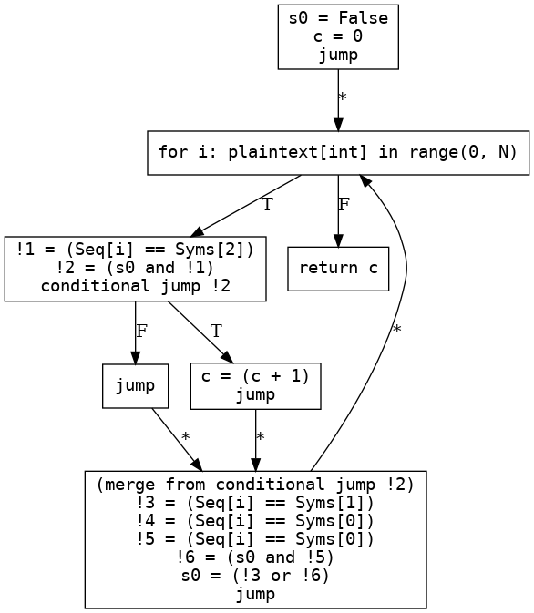
### SSA
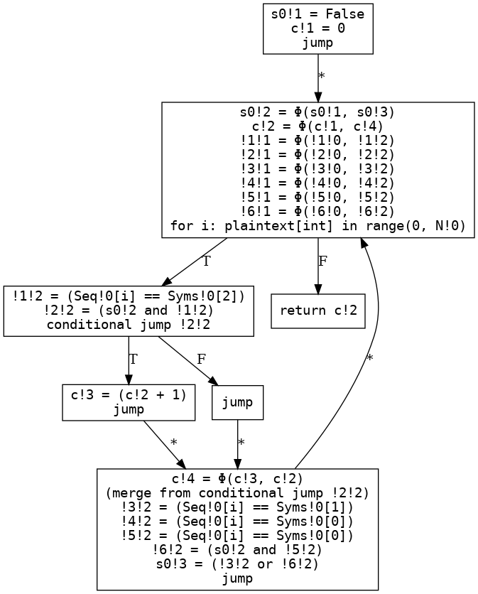
### SSA ϕ→MUX
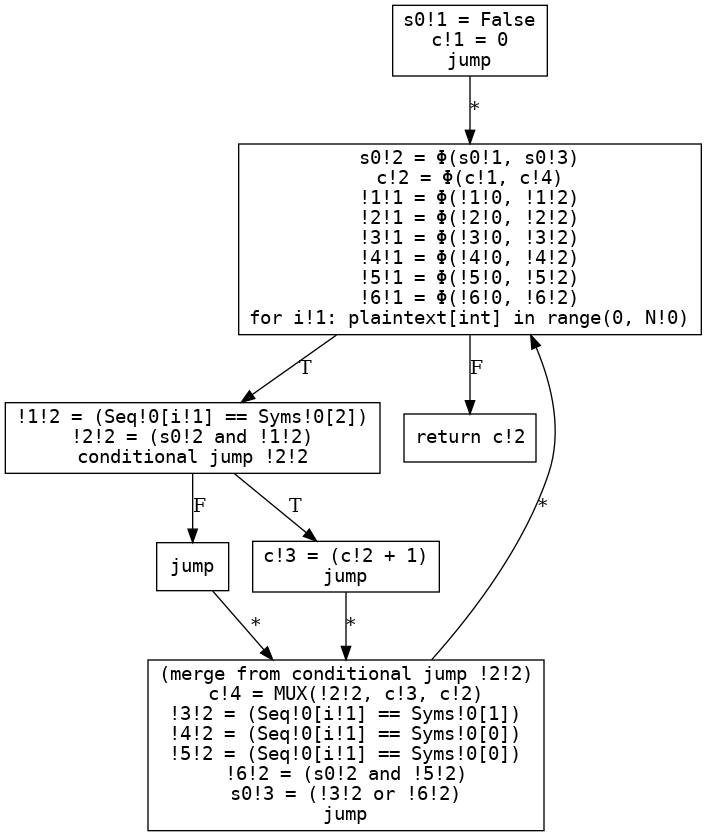
### Dead code elimination
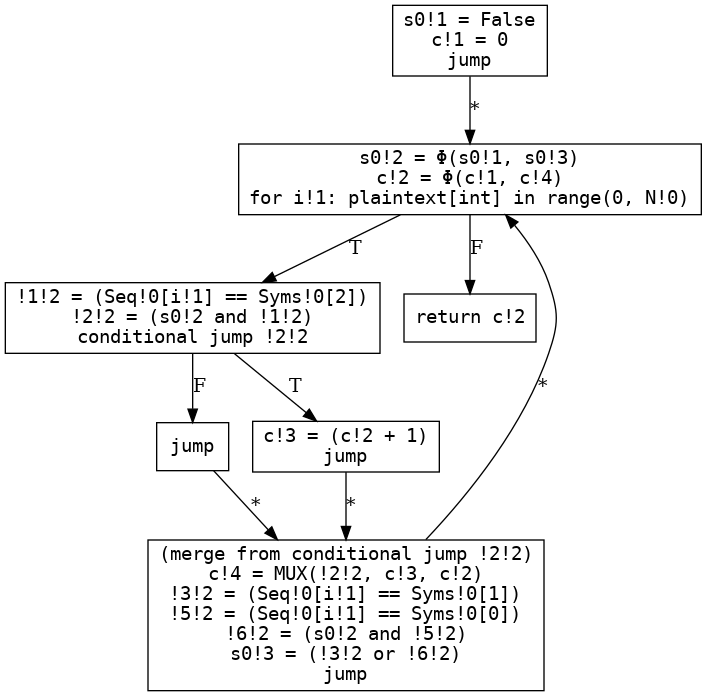
### Linear code with loops
```python
def count_102(Seq!0: shared[list[int]], N!0: plaintext[int], Syms!0: shared[list[int]]) -> shared[int]:
    s0!1 = False
    c!1 = 0
    for i!1 in range(0, N!0):
        s0!2 = Φ(s0!1, s0!3)
        c!2 = Φ(c!1, c!4)
        !1!2 = (Seq!0[i!1] == Syms!0[2])
        !2!2 = (s0!2 and !1!2)
        c!3 = (c!2 + 1)
        c!4 = MUX(!2!2, c!3, c!2)
        !3!2 = (Seq!0[i!1] == Syms!0[1])
        !5!2 = (Seq!0[i!1] == Syms!0[0])
        !6!2 = (s0!2 and !5!2)
        s0!3 = (!3!2 or !6!2)
    return c!2
```
### Dependency graph
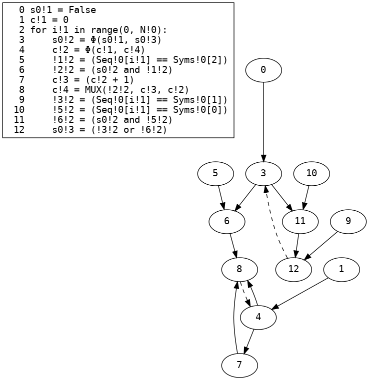
### Removal of infeasible edges

### Array MUX refinement
```python
def count_102(Seq!0: shared[list[int]], N!0: plaintext[int], Syms!0: shared[list[int]]) -> shared[int]:
    s0!1 = False
    c!1 = 0
    for i!1 in range(0, N!0):
        s0!2 = Φ(s0!1, s0!3)
        c!2 = Φ(c!1, c!4)
        !1!2 = (Seq!0[i!1] == Syms!0[2])
        !2!2 = (s0!2 and !1!2)
        c!3 = (c!2 + 1)
        c!4 = MUX(!2!2, c!3, c!2)
        !3!2 = (Seq!0[i!1] == Syms!0[1])
        !5!2 = (Seq!0[i!1] == Syms!0[0])
        !6!2 = (s0!2 and !5!2)
        s0!3 = (!3!2 or !6!2)
    return c!2
```
### Array MUX refinement (dependence graph)
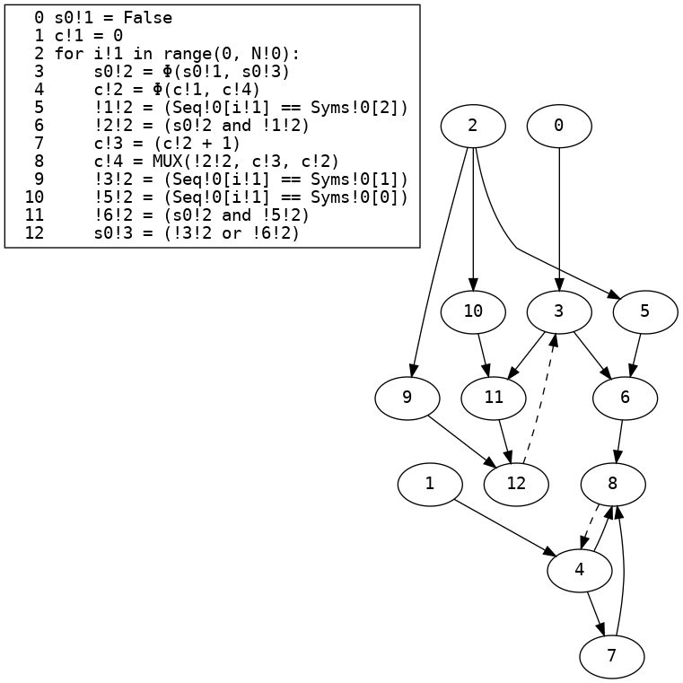
### Type environment
| Variable | Type |
| - | - |
| `Seq!0` | `shared[list[int]]` |
| `N!0` | `plaintext[int]` |
| `Syms!0` | `shared[list[int]]` |
| `i!1` | `plaintext[int]` |
| `!3!2` | `shared[bool]` |
| `!6!2` | `shared[bool]` |
| `s0!3` | `shared[bool]` |
| `s0!1` | `plaintext[bool]` |
| `s0!2` | `shared[bool]` |
| `!5!2` | `shared[bool]` |
| `!1!2` | `shared[bool]` |
| `!2!2` | `shared[bool]` |
| `c!2` | `shared[int]` |
| `c!3` | `shared[int]` |
| `c!4` | `shared[int]` |
| `c!1` | `plaintext[int]` |
### Motion code
```cpp
template <encrypto::motion::MpcProtocol Protocol>
encrypto::motion::SecureUnsignedInteger count_102(
    encrypto::motion::PartyPointer &party,
    std::vector<encrypto::motion::SecureUnsignedInteger> Seq_0,
    std::uint32_t _MPC_PLAINTEXT_N_0,
    std::vector<encrypto::motion::SecureUnsignedInteger> Syms_0
) {
    // Shared variable declarations
    encrypto::motion::SecureUnsignedInteger N_0;
    encrypto::motion::SecureUnsignedInteger i_1;
    encrypto::motion::ShareWrapper _3_2;
    encrypto::motion::ShareWrapper _6_2;
    encrypto::motion::ShareWrapper s0_3;
    encrypto::motion::ShareWrapper s0_1;
    encrypto::motion::ShareWrapper s0_2;
    encrypto::motion::ShareWrapper _5_2;
    encrypto::motion::ShareWrapper _1_2;
    encrypto::motion::ShareWrapper _2_2;
    encrypto::motion::SecureUnsignedInteger c_2;
    encrypto::motion::SecureUnsignedInteger c_3;
    encrypto::motion::SecureUnsignedInteger c_4;
    encrypto::motion::SecureUnsignedInteger c_1;

    // Plaintext variable declarations
    std::uint32_t _MPC_PLAINTEXT_i_1;
    bool _MPC_PLAINTEXT_s0_1;
    std::uint32_t _MPC_PLAINTEXT_c_1;

    // Constant initializations
    encrypto::motion::ShareWrapper _MPC_CONSTANT_false = party->In<Protocol>(encrypto::motion::BitVector(1, false), 0);
    encrypto::motion::SecureUnsignedInteger _MPC_CONSTANT_0 = party->In<Protocol>(encrypto::motion::ToInput(std::uint32_t(0)), 0);
    encrypto::motion::SecureUnsignedInteger _MPC_CONSTANT_1 = party->In<Protocol>(encrypto::motion::ToInput(std::uint32_t(1)), 0);

    // Plaintext parameter assignments
    N_0 = party->In<Protocol>(encrypto::motion::ToInput(_MPC_PLAINTEXT_N_0), 0);

    // Function body
    s0_1 = _MPC_CONSTANT_false;
    _MPC_PLAINTEXT_s0_1 = false;
    c_1 = _MPC_CONSTANT_0;
    _MPC_PLAINTEXT_c_1 = std::uint32_t(0);

    // Initialize phi values
    s0_2 = s0_1;
    c_2 = c_1;
    for (_MPC_PLAINTEXT_i_1 = std::uint32_t(0); _MPC_PLAINTEXT_i_1 < _MPC_PLAINTEXT_N_0; _MPC_PLAINTEXT_i_1++) {
        i_1 = party->In<Protocol>(encrypto::motion::ToInput(_MPC_PLAINTEXT_i_1), 0);
        _1_2 = (encrypto::motion::ShareWrapper(Seq_0[_MPC_PLAINTEXT_i_1].Get()) == encrypto::motion::ShareWrapper(Syms_0[std::uint32_t(2)].Get()));
        _2_2 = (encrypto::motion::ShareWrapper(s0_2.Get()) & encrypto::motion::ShareWrapper(_1_2.Get()));
        c_3 = (c_2 + _MPC_CONSTANT_1);
        c_4 = _2_2.Mux(c_3.Get(), c_2.Get());
        _3_2 = (encrypto::motion::ShareWrapper(Seq_0[_MPC_PLAINTEXT_i_1].Get()) == encrypto::motion::ShareWrapper(Syms_0[std::uint32_t(1)].Get()));
        _5_2 = (encrypto::motion::ShareWrapper(Seq_0[_MPC_PLAINTEXT_i_1].Get()) == encrypto::motion::ShareWrapper(Syms_0[std::uint32_t(0)].Get()));
        _6_2 = (encrypto::motion::ShareWrapper(s0_2.Get()) & encrypto::motion::ShareWrapper(_5_2.Get()));
        s0_3 = (encrypto::motion::ShareWrapper(_3_2.Get()) | encrypto::motion::ShareWrapper(_6_2.Get()));

        // Update phi values
        s0_2 = s0_3;
        c_2 = c_4;
    }


    return c_2;
}
```
## `count_10s`
### Input
```python
from UTIL import shared


def count_10s(Seq: shared[list[int]], N: int, Syms: shared[list[int]]) -> shared[int]:
    """
    Computes the number of instances of regex a(b+) in a provided sequence.
    Syms is a list of form [a, b].
    """
    s0 = False
    s1 = False
    scount = 0

    for i in range(0, N):
        if s1 and (Seq[i] != Syms[0]):
            scount = scount + 1

        s1 = (Seq[i] == Syms[0]) and (s0 or s1)
        s0 = Seq[i] == Syms[1]

    return scount


seq = [1, 0, 0, 1, 1, 0, 2]
print(count_10s(seq, 7, [0, 1]))

```
### Restricted AST
```python
def count_10s(Seq: shared[list[int]], N: plaintext[int], Syms: shared[list[int]]) -> shared[int]:
    s0 = False
    s1 = False
    scount = 0
    for i: plaintext[int] in range(0, N):
        if (s1 and (Seq[i] != Syms[0])):
            scount = (scount + 1)
        s1 = ((Seq[i] == Syms[0]) and (s0 or s1))
        s0 = (Seq[i] == Syms[1])
    return scount
```
### Three-address code CFG
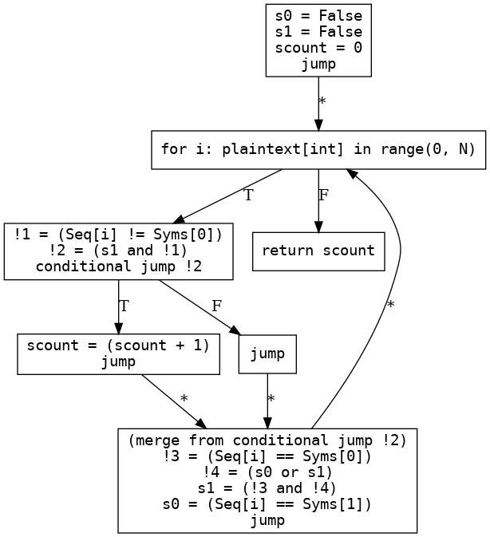
### SSA
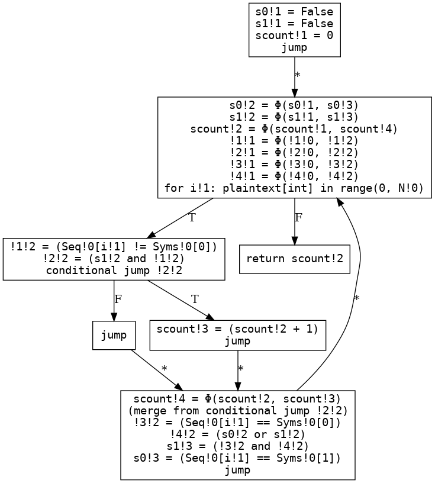
### SSA ϕ→MUX

### Dead code elimination
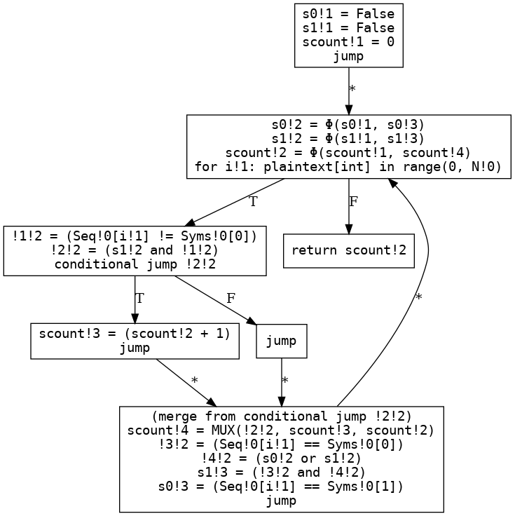
### Linear code with loops
```python
def count_10s(Seq!0: shared[list[int]], N!0: plaintext[int], Syms!0: shared[list[int]]) -> shared[int]:
    s0!1 = False
    s1!1 = False
    scount!1 = 0
    for i!1 in range(0, N!0):
        s0!2 = Φ(s0!1, s0!3)
        s1!2 = Φ(s1!1, s1!3)
        scount!2 = Φ(scount!1, scount!4)
        !1!2 = (Seq!0[i!1] != Syms!0[0])
        !2!2 = (s1!2 and !1!2)
        scount!3 = (scount!2 + 1)
        scount!4 = MUX(!2!2, scount!3, scount!2)
        !3!2 = (Seq!0[i!1] == Syms!0[0])
        !4!2 = (s0!2 or s1!2)
        s1!3 = (!3!2 and !4!2)
        s0!3 = (Seq!0[i!1] == Syms!0[1])
    return scount!2
```
### Dependency graph
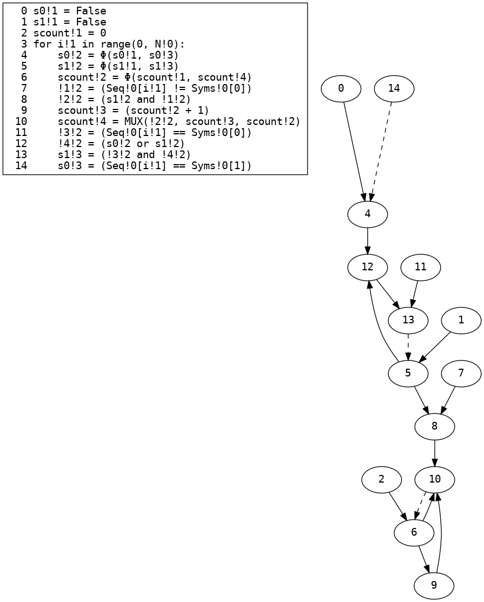
### Removal of infeasible edges

### Array MUX refinement
```python
def count_10s(Seq!0: shared[list[int]], N!0: plaintext[int], Syms!0: shared[list[int]]) -> shared[int]:
    s0!1 = False
    s1!1 = False
    scount!1 = 0
    for i!1 in range(0, N!0):
        s0!2 = Φ(s0!1, s0!3)
        s1!2 = Φ(s1!1, s1!3)
        scount!2 = Φ(scount!1, scount!4)
        !1!2 = (Seq!0[i!1] != Syms!0[0])
        !2!2 = (s1!2 and !1!2)
        scount!3 = (scount!2 + 1)
        scount!4 = MUX(!2!2, scount!3, scount!2)
        !3!2 = (Seq!0[i!1] == Syms!0[0])
        !4!2 = (s0!2 or s1!2)
        s1!3 = (!3!2 and !4!2)
        s0!3 = (Seq!0[i!1] == Syms!0[1])
    return scount!2
```
### Array MUX refinement (dependence graph)
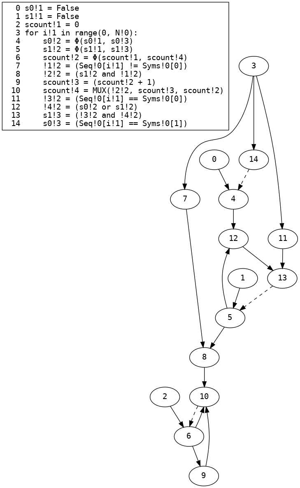
### Type environment
| Variable | Type |
| - | - |
| `Seq!0` | `shared[list[int]]` |
| `N!0` | `plaintext[int]` |
| `Syms!0` | `shared[list[int]]` |
| `i!1` | `plaintext[int]` |
| `s0!3` | `shared[bool]` |
| `s0!1` | `plaintext[bool]` |
| `s0!2` | `shared[bool]` |
| `s1!2` | `shared[bool]` |
| `!4!2` | `shared[bool]` |
| `!3!2` | `shared[bool]` |
| `s1!3` | `shared[bool]` |
| `s1!1` | `plaintext[bool]` |
| `!1!2` | `shared[bool]` |
| `!2!2` | `shared[bool]` |
| `scount!2` | `shared[int]` |
| `scount!3` | `shared[int]` |
| `scount!4` | `shared[int]` |
| `scount!1` | `plaintext[int]` |
### Motion code
```cpp
template <encrypto::motion::MpcProtocol Protocol>
encrypto::motion::SecureUnsignedInteger count_10s(
    encrypto::motion::PartyPointer &party,
    std::vector<encrypto::motion::SecureUnsignedInteger> Seq_0,
    std::uint32_t _MPC_PLAINTEXT_N_0,
    std::vector<encrypto::motion::SecureUnsignedInteger> Syms_0
) {
    // Shared variable declarations
    encrypto::motion::SecureUnsignedInteger N_0;
    encrypto::motion::SecureUnsignedInteger i_1;
    encrypto::motion::ShareWrapper s0_3;
    encrypto::motion::ShareWrapper s0_1;
    encrypto::motion::ShareWrapper s0_2;
    encrypto::motion::ShareWrapper s1_2;
    encrypto::motion::ShareWrapper _4_2;
    encrypto::motion::ShareWrapper _3_2;
    encrypto::motion::ShareWrapper s1_3;
    encrypto::motion::ShareWrapper s1_1;
    encrypto::motion::ShareWrapper _1_2;
    encrypto::motion::ShareWrapper _2_2;
    encrypto::motion::SecureUnsignedInteger scount_2;
    encrypto::motion::SecureUnsignedInteger scount_3;
    encrypto::motion::SecureUnsignedInteger scount_4;
    encrypto::motion::SecureUnsignedInteger scount_1;

    // Plaintext variable declarations
    std::uint32_t _MPC_PLAINTEXT_i_1;
    bool _MPC_PLAINTEXT_s0_1;
    bool _MPC_PLAINTEXT_s1_1;
    std::uint32_t _MPC_PLAINTEXT_scount_1;

    // Constant initializations
    encrypto::motion::ShareWrapper _MPC_CONSTANT_false = party->In<Protocol>(encrypto::motion::BitVector(1, false), 0);
    encrypto::motion::SecureUnsignedInteger _MPC_CONSTANT_0 = party->In<Protocol>(encrypto::motion::ToInput(std::uint32_t(0)), 0);
    encrypto::motion::SecureUnsignedInteger _MPC_CONSTANT_1 = party->In<Protocol>(encrypto::motion::ToInput(std::uint32_t(1)), 0);

    // Plaintext parameter assignments
    N_0 = party->In<Protocol>(encrypto::motion::ToInput(_MPC_PLAINTEXT_N_0), 0);

    // Function body
    s0_1 = _MPC_CONSTANT_false;
    _MPC_PLAINTEXT_s0_1 = false;
    s1_1 = _MPC_CONSTANT_false;
    _MPC_PLAINTEXT_s1_1 = false;
    scount_1 = _MPC_CONSTANT_0;
    _MPC_PLAINTEXT_scount_1 = std::uint32_t(0);

    // Initialize phi values
    s0_2 = s0_1;
    s1_2 = s1_1;
    scount_2 = scount_1;
    for (_MPC_PLAINTEXT_i_1 = std::uint32_t(0); _MPC_PLAINTEXT_i_1 < _MPC_PLAINTEXT_N_0; _MPC_PLAINTEXT_i_1++) {
        i_1 = party->In<Protocol>(encrypto::motion::ToInput(_MPC_PLAINTEXT_i_1), 0);
        _1_2 = (~(encrypto::motion::ShareWrapper(Seq_0[_MPC_PLAINTEXT_i_1].Get()) == encrypto::motion::ShareWrapper(Syms_0[std::uint32_t(0)].Get())));
        _2_2 = (encrypto::motion::ShareWrapper(s1_2.Get()) & encrypto::motion::ShareWrapper(_1_2.Get()));
        scount_3 = (scount_2 + _MPC_CONSTANT_1);
        scount_4 = _2_2.Mux(scount_3.Get(), scount_2.Get());
        _3_2 = (encrypto::motion::ShareWrapper(Seq_0[_MPC_PLAINTEXT_i_1].Get()) == encrypto::motion::ShareWrapper(Syms_0[std::uint32_t(0)].Get()));
        _4_2 = (encrypto::motion::ShareWrapper(s0_2.Get()) | encrypto::motion::ShareWrapper(s1_2.Get()));
        s1_3 = (encrypto::motion::ShareWrapper(_3_2.Get()) & encrypto::motion::ShareWrapper(_4_2.Get()));
        s0_3 = (encrypto::motion::ShareWrapper(Seq_0[_MPC_PLAINTEXT_i_1].Get()) == encrypto::motion::ShareWrapper(Syms_0[std::uint32_t(1)].Get()));

        // Update phi values
        s0_2 = s0_3;
        s1_2 = s1_3;
        scount_2 = scount_4;
    }


    return scount_2;
}
```
## `count_123`
### Input
```python
from UTIL import shared


def count_123(Seq: shared[list[int]], N: int, Syms: shared[list[int]]) -> shared[int]:
    """
    Computes the number of instances of regex a*b*c* in a provided sequence.
    Syms is a list of form [a, b, c].
    """

    s1 = False
    s2 = False
    s3 = False
    c = 0

    for i in range(0, N):
        if Seq[i] == Syms[2] and (s2 or s1):
            c = c + 1
        s2 = (Seq[i] == Syms[1]) and (s1 or s2)
        s1 = Seq[i] == Syms[0]

    return c


seq = [1, 2, 3, 1, 3, 3, 4]
print(count_123(seq, 7, [1, 2, 3]))

```
### Restricted AST
```python
def count_123(Seq: shared[list[int]], N: plaintext[int], Syms: shared[list[int]]) -> shared[int]:
    s1 = False
    s2 = False
    s3 = False
    c = 0
    for i: plaintext[int] in range(0, N):
        if ((Seq[i] == Syms[2]) and (s2 or s1)):
            c = (c + 1)
        s2 = ((Seq[i] == Syms[1]) and (s1 or s2))
        s1 = (Seq[i] == Syms[0])
    return c
```
### Three-address code CFG
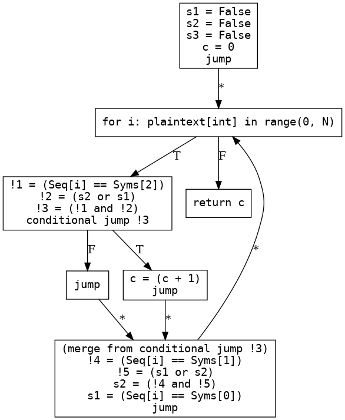
### SSA

### SSA ϕ→MUX
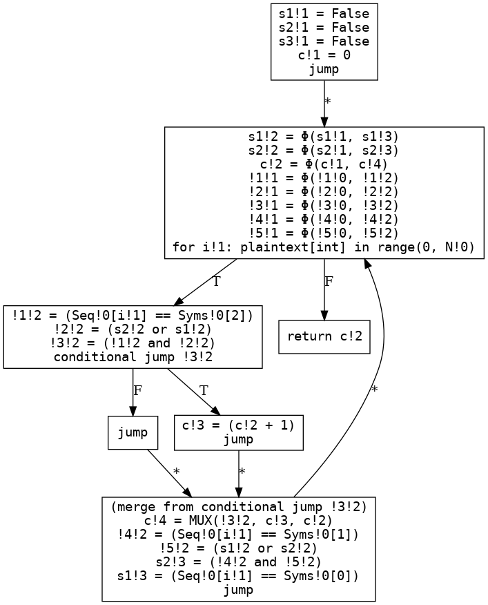
### Dead code elimination
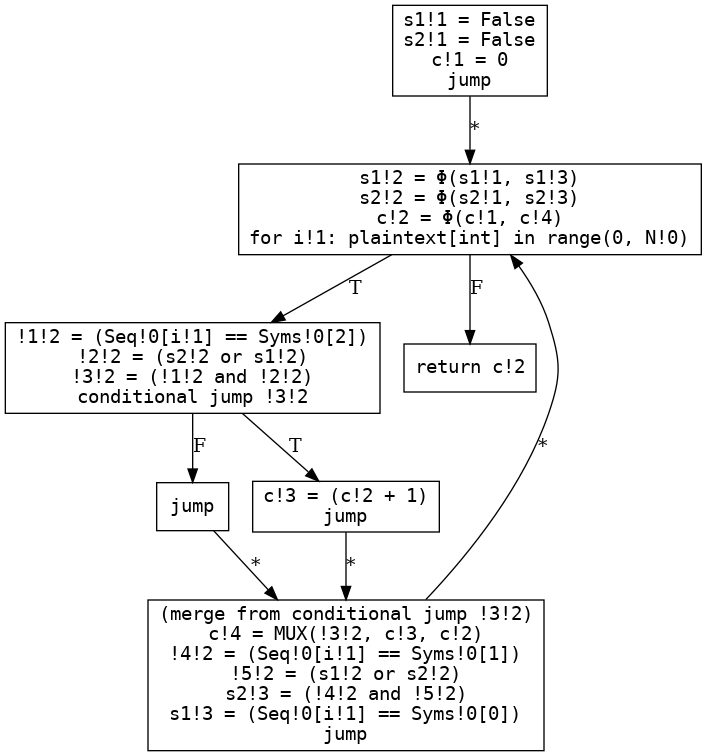
### Linear code with loops
```python
def count_123(Seq!0: shared[list[int]], N!0: plaintext[int], Syms!0: shared[list[int]]) -> shared[int]:
    s1!1 = False
    s2!1 = False
    c!1 = 0
    for i!1 in range(0, N!0):
        s1!2 = Φ(s1!1, s1!3)
        s2!2 = Φ(s2!1, s2!3)
        c!2 = Φ(c!1, c!4)
        !1!2 = (Seq!0[i!1] == Syms!0[2])
        !2!2 = (s2!2 or s1!2)
        !3!2 = (!1!2 and !2!2)
        c!3 = (c!2 + 1)
        c!4 = MUX(!3!2, c!3, c!2)
        !4!2 = (Seq!0[i!1] == Syms!0[1])
        !5!2 = (s1!2 or s2!2)
        s2!3 = (!4!2 and !5!2)
        s1!3 = (Seq!0[i!1] == Syms!0[0])
    return c!2
```
### Dependency graph
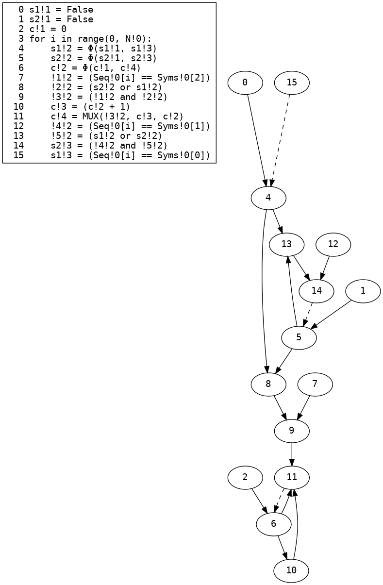
### Removal of infeasible edges
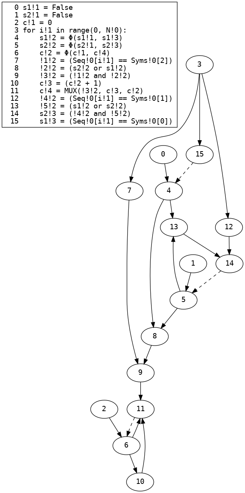
### Array MUX refinement
```python
def count_123(Seq!0: shared[list[int]], N!0: plaintext[int], Syms!0: shared[list[int]]) -> shared[int]:
    s1!1 = False
    s2!1 = False
    c!1 = 0
    for i!1 in range(0, N!0):
        s1!2 = Φ(s1!1, s1!3)
        s2!2 = Φ(s2!1, s2!3)
        c!2 = Φ(c!1, c!4)
        !1!2 = (Seq!0[i!1] == Syms!0[2])
        !2!2 = (s2!2 or s1!2)
        !3!2 = (!1!2 and !2!2)
        c!3 = (c!2 + 1)
        c!4 = MUX(!3!2, c!3, c!2)
        !4!2 = (Seq!0[i!1] == Syms!0[1])
        !5!2 = (s1!2 or s2!2)
        s2!3 = (!4!2 and !5!2)
        s1!3 = (Seq!0[i!1] == Syms!0[0])
    return c!2
```
### Array MUX refinement (dependence graph)
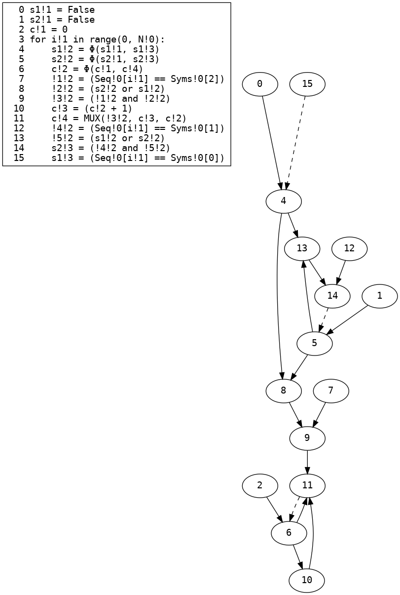
### Type environment
| Variable | Type |
| - | - |
| `Seq!0` | `shared[list[int]]` |
| `N!0` | `plaintext[int]` |
| `Syms!0` | `shared[list[int]]` |
| `i!1` | `plaintext[int]` |
| `s1!3` | `shared[bool]` |
| `s1!1` | `plaintext[bool]` |
| `s1!2` | `shared[bool]` |
| `s2!2` | `shared[bool]` |
| `!5!2` | `shared[bool]` |
| `!4!2` | `shared[bool]` |
| `s2!3` | `shared[bool]` |
| `s2!1` | `plaintext[bool]` |
| `!2!2` | `shared[bool]` |
| `!1!2` | `shared[bool]` |
| `!3!2` | `shared[bool]` |
| `c!2` | `shared[int]` |
| `c!3` | `shared[int]` |
| `c!4` | `shared[int]` |
| `c!1` | `plaintext[int]` |
### Motion code
```cpp
template <encrypto::motion::MpcProtocol Protocol>
encrypto::motion::SecureUnsignedInteger count_123(
    encrypto::motion::PartyPointer &party,
    std::vector<encrypto::motion::SecureUnsignedInteger> Seq_0,
    std::uint32_t _MPC_PLAINTEXT_N_0,
    std::vector<encrypto::motion::SecureUnsignedInteger> Syms_0
) {
    // Shared variable declarations
    encrypto::motion::SecureUnsignedInteger N_0;
    encrypto::motion::SecureUnsignedInteger i_1;
    encrypto::motion::ShareWrapper s1_3;
    encrypto::motion::ShareWrapper s1_1;
    encrypto::motion::ShareWrapper s1_2;
    encrypto::motion::ShareWrapper s2_2;
    encrypto::motion::ShareWrapper _5_2;
    encrypto::motion::ShareWrapper _4_2;
    encrypto::motion::ShareWrapper s2_3;
    encrypto::motion::ShareWrapper s2_1;
    encrypto::motion::ShareWrapper _2_2;
    encrypto::motion::ShareWrapper _1_2;
    encrypto::motion::ShareWrapper _3_2;
    encrypto::motion::SecureUnsignedInteger c_2;
    encrypto::motion::SecureUnsignedInteger c_3;
    encrypto::motion::SecureUnsignedInteger c_4;
    encrypto::motion::SecureUnsignedInteger c_1;

    // Plaintext variable declarations
    std::uint32_t _MPC_PLAINTEXT_i_1;
    bool _MPC_PLAINTEXT_s1_1;
    bool _MPC_PLAINTEXT_s2_1;
    std::uint32_t _MPC_PLAINTEXT_c_1;

    // Constant initializations
    encrypto::motion::ShareWrapper _MPC_CONSTANT_false = party->In<Protocol>(encrypto::motion::BitVector(1, false), 0);
    encrypto::motion::SecureUnsignedInteger _MPC_CONSTANT_0 = party->In<Protocol>(encrypto::motion::ToInput(std::uint32_t(0)), 0);
    encrypto::motion::SecureUnsignedInteger _MPC_CONSTANT_1 = party->In<Protocol>(encrypto::motion::ToInput(std::uint32_t(1)), 0);

    // Plaintext parameter assignments
    N_0 = party->In<Protocol>(encrypto::motion::ToInput(_MPC_PLAINTEXT_N_0), 0);

    // Function body
    s1_1 = _MPC_CONSTANT_false;
    _MPC_PLAINTEXT_s1_1 = false;
    s2_1 = _MPC_CONSTANT_false;
    _MPC_PLAINTEXT_s2_1 = false;
    c_1 = _MPC_CONSTANT_0;
    _MPC_PLAINTEXT_c_1 = std::uint32_t(0);

    // Initialize phi values
    s1_2 = s1_1;
    s2_2 = s2_1;
    c_2 = c_1;
    for (_MPC_PLAINTEXT_i_1 = std::uint32_t(0); _MPC_PLAINTEXT_i_1 < _MPC_PLAINTEXT_N_0; _MPC_PLAINTEXT_i_1++) {
        i_1 = party->In<Protocol>(encrypto::motion::ToInput(_MPC_PLAINTEXT_i_1), 0);
        _1_2 = (encrypto::motion::ShareWrapper(Seq_0[_MPC_PLAINTEXT_i_1].Get()) == encrypto::motion::ShareWrapper(Syms_0[std::uint32_t(2)].Get()));
        _2_2 = (encrypto::motion::ShareWrapper(s2_2.Get()) | encrypto::motion::ShareWrapper(s1_2.Get()));
        _3_2 = (encrypto::motion::ShareWrapper(_1_2.Get()) & encrypto::motion::ShareWrapper(_2_2.Get()));
        c_3 = (c_2 + _MPC_CONSTANT_1);
        c_4 = _3_2.Mux(c_3.Get(), c_2.Get());
        _4_2 = (encrypto::motion::ShareWrapper(Seq_0[_MPC_PLAINTEXT_i_1].Get()) == encrypto::motion::ShareWrapper(Syms_0[std::uint32_t(1)].Get()));
        _5_2 = (encrypto::motion::ShareWrapper(s1_2.Get()) | encrypto::motion::ShareWrapper(s2_2.Get()));
        s2_3 = (encrypto::motion::ShareWrapper(_4_2.Get()) & encrypto::motion::ShareWrapper(_5_2.Get()));
        s1_3 = (encrypto::motion::ShareWrapper(Seq_0[_MPC_PLAINTEXT_i_1].Get()) == encrypto::motion::ShareWrapper(Syms_0[std::uint32_t(0)].Get()));

        // Update phi values
        s1_2 = s1_3;
        s2_2 = s2_3;
        c_2 = c_4;
    }


    return c_2;
}
```
## `histogram`
### Input
```python
from UTIL import shared

# Array A contains a list of integers i in [1,num_bins]
# Array B is a same-size array, contains number of collected ratings for that bin
# E.g., below we have collected 10 1-star ratings, 1 3-star rating, etc., then 2 more 1-star rating etc.
# A = [0,2,1,0,3,4,2,3]
# B = [10,1,5,2,15,0,10,1000]
# We need to sum up num ratings in each bin to compute a histogram
# 1: 12 0-star ratings
# 2: 5 1-star
# 3: 11 2-star
# 4: 1015 3-star
# 5: 0 4-star

# This is very similar to the crosstabs app in MOTION
# But we were first to suggest this as a benchmark :).
# requires: len(A) == len(B) = N
def histogram(
    A: shared[list[int]], B: shared[list[int]], N: int, num_bins: int
) -> shared[list[int]]:
    result: list[int] = []
    # initialize result to 0
    for i in range(num_bins):
        result = result + [0]
    for i in range(num_bins):
        for j in range(N):
            if A[j] == i:
                result[i] = result[i] + B[j]
    return result


A = [0, 2, 1, 0, 3, 4, 2, 3]
B = [10, 1, 5, 2, 15, 0, 10, 1000]
N = 8  # len(A)
print(histogram(A, B, N, 5))

```
### Restricted AST
```python
def histogram(A: shared[list[int]], B: shared[list[int]], N: plaintext[int], num_bins: plaintext[int]) -> shared[list[int]]:
    result = []
    for i: plaintext[int] in range(0, num_bins):
        result = (result + [0])
    for i: plaintext[int] in range(0, num_bins):
        for j: plaintext[int] in range(0, N):
            if (A[j] == i):
                result[i] = (result[i] + B[j])
    return result
```
### Three-address code CFG
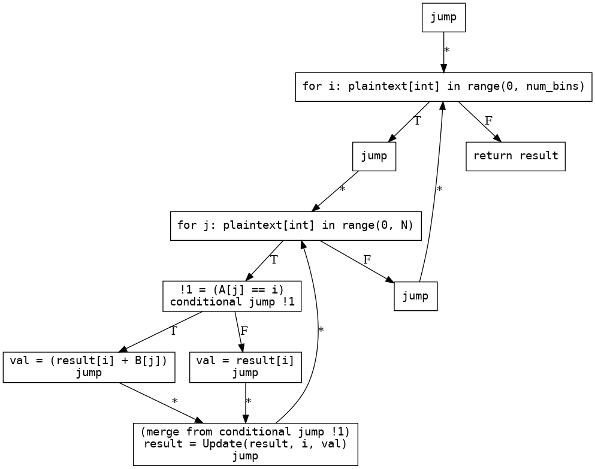
### SSA
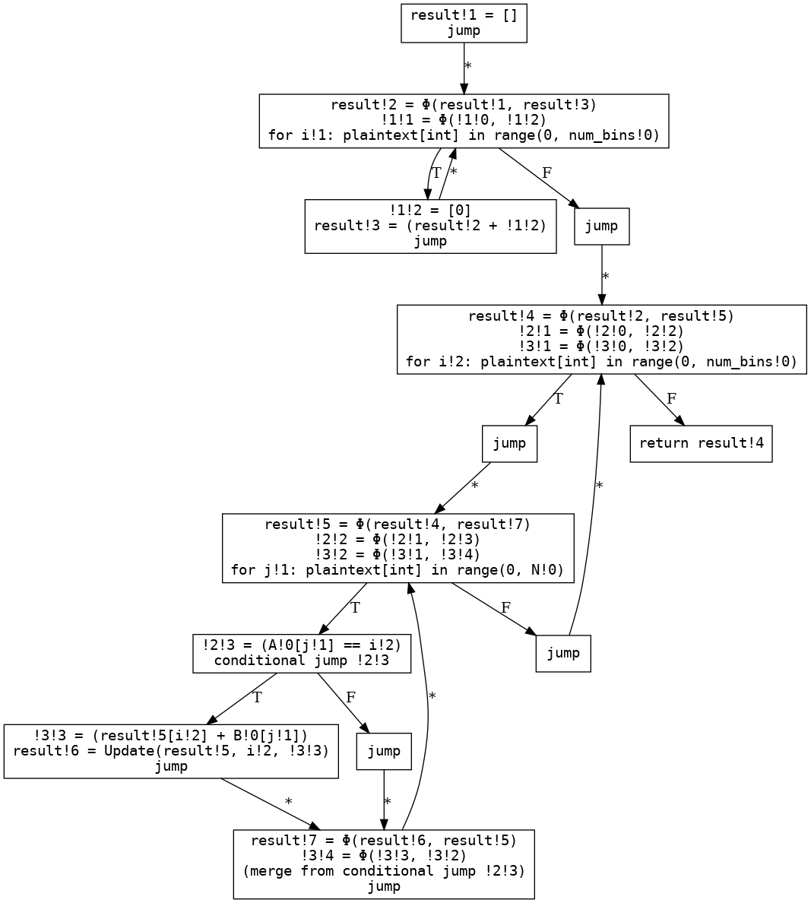
### SSA ϕ→MUX
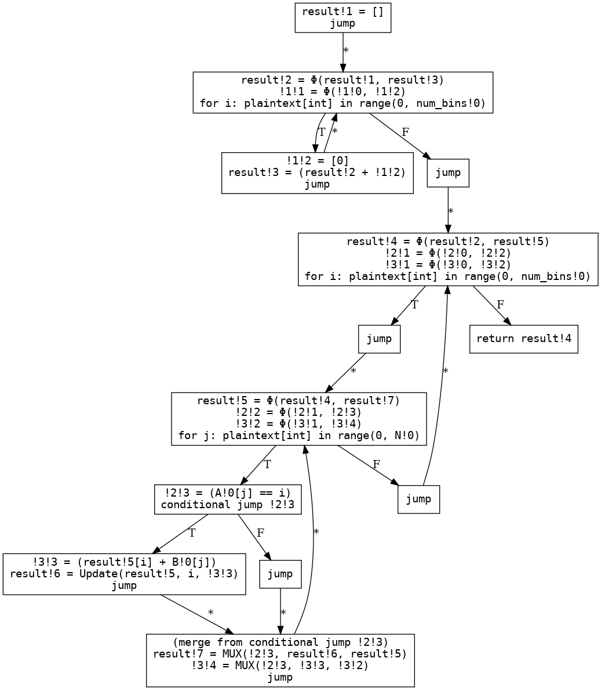
### Dead code elimination
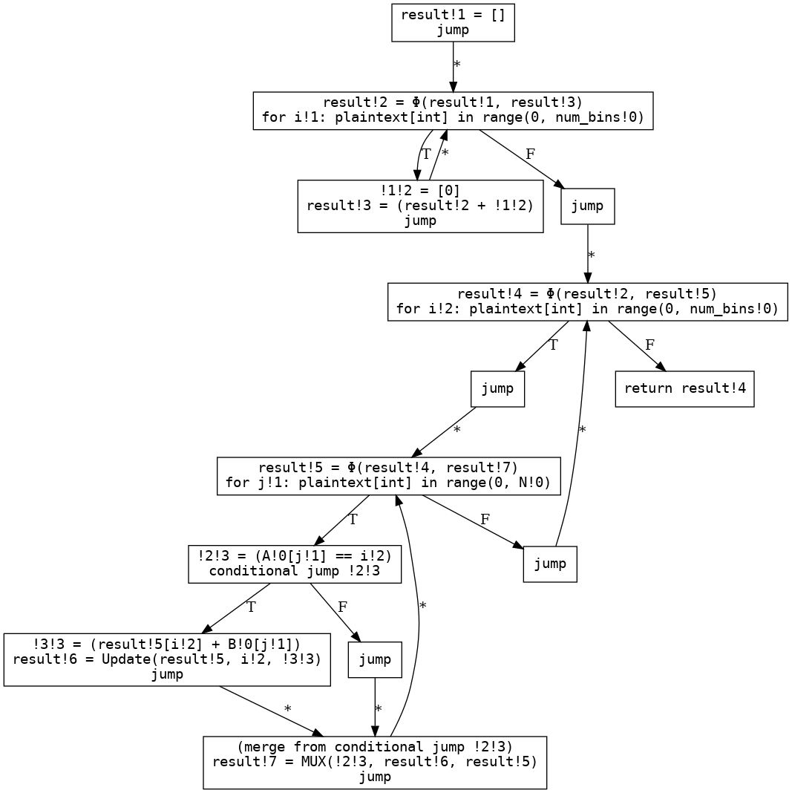
### Linear code with loops
```python
def histogram(A!0: shared[list[int]], B!0: shared[list[int]], N!0: plaintext[int], num_bins!0: plaintext[int]) -> shared[list[int]]:
    result!1 = []
    for i!1 in range(0, num_bins!0):
        result!2 = Φ(result!1, result!3)
        !1!2 = [0]
        result!3 = (result!2 + !1!2)
    for i!2 in range(0, num_bins!0):
        result!4 = Φ(result!2, result!5)
        for j!1 in range(0, N!0):
            result!5 = Φ(result!4, result!7)
            !2!3 = (A!0[j!1] == i!2)
            !3!3 = (result!5[i!2] + B!0[j!1])
            result!6 = Update(result!5, i!2, !3!3)
            result!7 = MUX(!2!3, result!6, result!5)
    return result!4
```
### Dependency graph

### Removal of infeasible edges
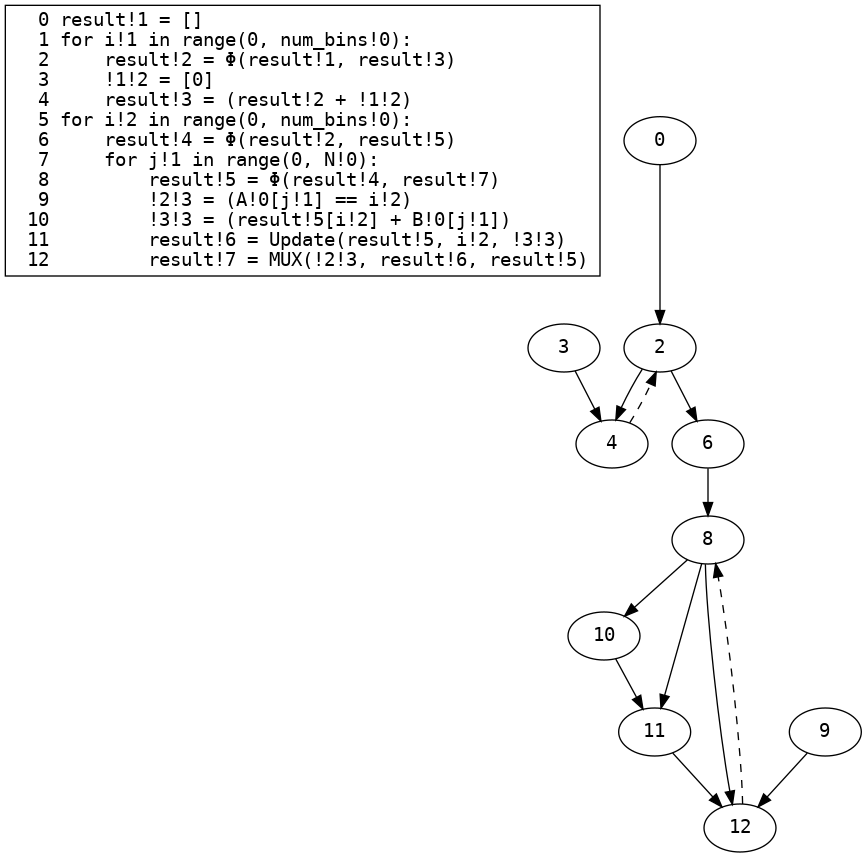
### Array MUX refinement
```python
def histogram(A!0: shared[list[int]], B!0: shared[list[int]], N!0: plaintext[int], num_bins!0: plaintext[int]) -> shared[list[int]]:
    result!1 = []
    for i!1 in range(0, num_bins!0):
        result!2 = Φ(result!1, result!3)
        !1!2 = [0]
        result!3 = (result!2 + !1!2)
    for i!2 in range(0, num_bins!0):
        result!4 = Φ(result!2, result!5)
        for j!1 in range(0, N!0):
            result!5 = Φ(result!4, result!7)
            !2!3 = (A!0[j!1] == i!2)
            !3!3 = (result!5[i!2] + B!0[j!1])
            result!6 = Update(result!5, i!2, !3!3)
            result!7 = MUX(!2!3, result!6, result!5)
    return result!4
```
### Array MUX refinement (dependence graph)
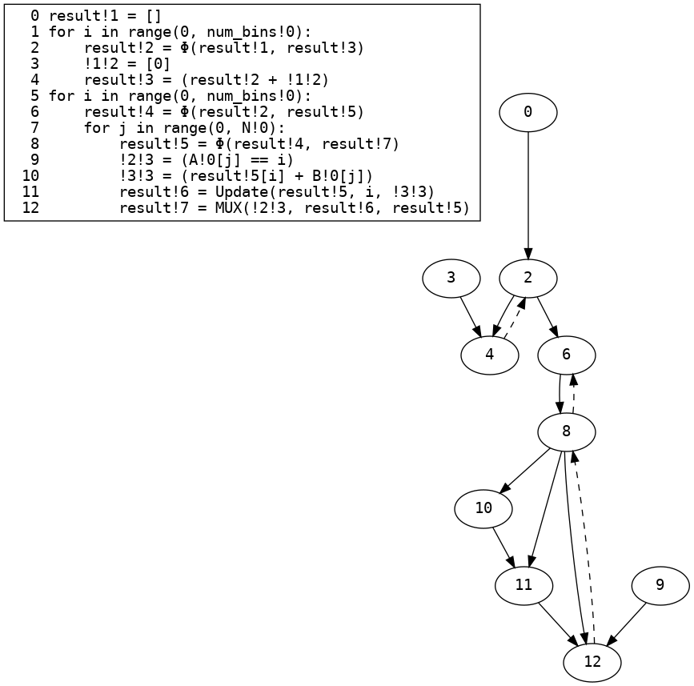
### Type environment
| Variable | Type |
| - | - |
| `A!0` | `shared[list[int]]` |
| `B!0` | `shared[list[int]]` |
| `N!0` | `plaintext[int]` |
| `num_bins!0` | `plaintext[int]` |
| `i!1` | `plaintext[int]` |
| `i!2` | `plaintext[int]` |
| `j!1` | `plaintext[int]` |
| `!2!3` | `shared[bool]` |
| `result!5` | `shared[list[int]]` |
| `result!6` | `shared[list[int]]` |
| `result!7` | `shared[list[int]]` |
| `result!4` | `shared[list[int]]` |
| `!3!3` | `shared[int]` |
| `result!2` | `plaintext[list[int]]` |
| `!1!2` | `plaintext[list[int]]` |
| `result!3` | `plaintext[list[int]]` |
| `result!1` | `plaintext[list[int]]` |
### Motion code
```cpp
template <encrypto::motion::MpcProtocol Protocol>
std::vector<encrypto::motion::SecureUnsignedInteger> histogram(
    encrypto::motion::PartyPointer &party,
    std::vector<encrypto::motion::SecureUnsignedInteger> A_0,
    std::vector<encrypto::motion::SecureUnsignedInteger> B_0,
    std::uint32_t _MPC_PLAINTEXT_N_0,
    std::uint32_t _MPC_PLAINTEXT_num_bins_0
) {
    // Shared variable declarations
    encrypto::motion::SecureUnsignedInteger N_0;
    encrypto::motion::SecureUnsignedInteger num_bins_0;
    encrypto::motion::SecureUnsignedInteger i_1;
    encrypto::motion::SecureUnsignedInteger i_2;
    encrypto::motion::SecureUnsignedInteger j_1;
    encrypto::motion::ShareWrapper _2_3;
    std::vector<encrypto::motion::SecureUnsignedInteger> result_5;
    std::vector<encrypto::motion::SecureUnsignedInteger> result_6;
    std::vector<encrypto::motion::SecureUnsignedInteger> result_7;
    std::vector<encrypto::motion::SecureUnsignedInteger> result_4;
    encrypto::motion::SecureUnsignedInteger _3_3;
    std::vector<encrypto::motion::SecureUnsignedInteger> result_2;
    std::vector<encrypto::motion::SecureUnsignedInteger> _1_2;
    std::vector<encrypto::motion::SecureUnsignedInteger> result_3;
    std::vector<encrypto::motion::SecureUnsignedInteger> result_1;

    // Plaintext variable declarations
    std::uint32_t _MPC_PLAINTEXT_i_1;
    std::uint32_t _MPC_PLAINTEXT_i_2;
    std::uint32_t _MPC_PLAINTEXT_j_1;
    std::vector<std::uint32_t> _MPC_PLAINTEXT_result_2;
    std::vector<std::uint32_t> _MPC_PLAINTEXT__1_2;
    std::vector<std::uint32_t> _MPC_PLAINTEXT_result_3;
    std::vector<std::uint32_t> _MPC_PLAINTEXT_result_1;

    // Constant initializations
    encrypto::motion::SecureUnsignedInteger _MPC_CONSTANT_0 = party->In<Protocol>(encrypto::motion::ToInput(std::uint32_t(0)), 0);

    // Plaintext parameter assignments
    N_0 = party->In<Protocol>(encrypto::motion::ToInput(_MPC_PLAINTEXT_N_0), 0);

    num_bins_0 = party->In<Protocol>(encrypto::motion::ToInput(_MPC_PLAINTEXT_num_bins_0), 0);

    // Function body
    result_1 = {};
    _MPC_PLAINTEXT_result_1 = {};

    // Initialize phi values
    result_2 = result_1;
    for (_MPC_PLAINTEXT_i_1 = std::uint32_t(0); _MPC_PLAINTEXT_i_1 < _MPC_PLAINTEXT_num_bins_0; _MPC_PLAINTEXT_i_1++) {
        i_1 = party->In<Protocol>(encrypto::motion::ToInput(_MPC_PLAINTEXT_i_1), 0);
        _1_2 = {_MPC_CONSTANT_0};
        _MPC_PLAINTEXT__1_2 = {std::uint32_t(0)};
        result_3 = (result_2 + _1_2);
        _MPC_PLAINTEXT_result_3 = (_MPC_PLAINTEXT_result_2 + _MPC_PLAINTEXT__1_2);

        // Update phi values
        result_2 = result_3;
    }


    // Initialize phi values
    result_4 = result_2;
    for (_MPC_PLAINTEXT_i_2 = std::uint32_t(0); _MPC_PLAINTEXT_i_2 < _MPC_PLAINTEXT_num_bins_0; _MPC_PLAINTEXT_i_2++) {
        i_2 = party->In<Protocol>(encrypto::motion::ToInput(_MPC_PLAINTEXT_i_2), 0);

        // Initialize phi values
        result_5 = result_4;
        for (_MPC_PLAINTEXT_j_1 = std::uint32_t(0); _MPC_PLAINTEXT_j_1 < _MPC_PLAINTEXT_N_0; _MPC_PLAINTEXT_j_1++) {
            j_1 = party->In<Protocol>(encrypto::motion::ToInput(_MPC_PLAINTEXT_j_1), 0);
            _2_3 = (encrypto::motion::ShareWrapper(A_0[_MPC_PLAINTEXT_j_1].Get()) == encrypto::motion::ShareWrapper(i_2.Get()));
            _3_3 = (result_5[_MPC_PLAINTEXT_i_2] + B_0[_MPC_PLAINTEXT_j_1]);
            result_6 = result_5;
            result_5[_MPC_PLAINTEXT_i_2] = _3_3;
            result_7 = _2_3.Mux(result_6.Get(), result_5.Get());

            // Update phi values
            result_5 = result_7;
        }


        // Update phi values
        result_4 = result_5;
    }


    return result_4;
}
```
## `infeasible_edges_example`
### Input
```python
def foo(
    A: shared[list[int]],
    B: shared[list[int]],
    C: shared[list[int]],
    D: shared[list[int]],
    N: int,
) -> tuple[shared[list[int]], shared[list[int]], shared[list[int]], shared[list[int]]]:
    for i in range(N):
        A[i] = B[i] + 10
        B[i] = A[i] * D[i - 1]
        C[i] = A[i] * D[i - 1]
        D[i] = B[i] * C[i]
    return (A, B, C, D)

```
### Restricted AST
```python
def foo(A: shared[list[int]], B: shared[list[int]], C: shared[list[int]], D: shared[list[int]], N: plaintext[int]) -> tuple[shared[list[int]], shared[list[int]], shared[list[int]], shared[list[int]]]:
    for i: plaintext[int] in range(0, N):
        A[i] = (B[i] + 10)
        B[i] = (A[i] * D[(i - 1)])
        C[i] = (A[i] * D[(i - 1)])
        D[i] = (B[i] * C[i])
    return (A, B, C, D)
```
### Three-address code CFG

### SSA
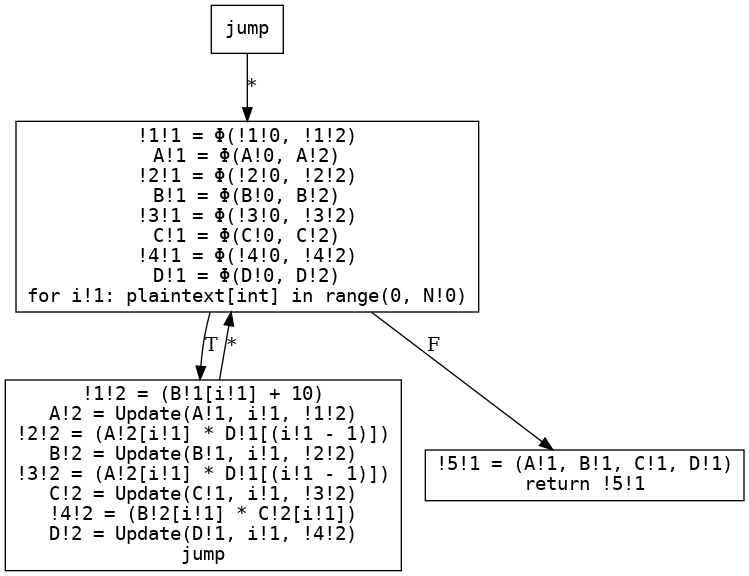
### SSA ϕ→MUX

### Dead code elimination
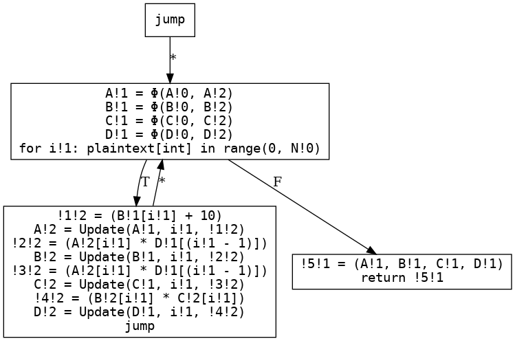
### Linear code with loops
```python
def foo(A!0: shared[list[int]], B!0: shared[list[int]], C!0: shared[list[int]], D!0: shared[list[int]], N!0: plaintext[int]) -> tuple[shared[list[int]], shared[list[int]], shared[list[int]], shared[list[int]]]:
    for i!1 in range(0, N!0):
        A!1 = Φ(A!0, A!2)
        B!1 = Φ(B!0, B!2)
        C!1 = Φ(C!0, C!2)
        D!1 = Φ(D!0, D!2)
        !1!2 = (B!1[i!1] + 10)
        A!2 = Update(A!1, i!1, !1!2)
        !2!2 = (A!2[i!1] * D!1[(i!1 - 1)])
        B!2 = Update(B!1, i!1, !2!2)
        !3!2 = (A!2[i!1] * D!1[(i!1 - 1)])
        C!2 = Update(C!1, i!1, !3!2)
        !4!2 = (B!2[i!1] * C!2[i!1])
        D!2 = Update(D!1, i!1, !4!2)
    !5!1 = (A!1, B!1, C!1, D!1)
    return !5!1
```
### Dependency graph
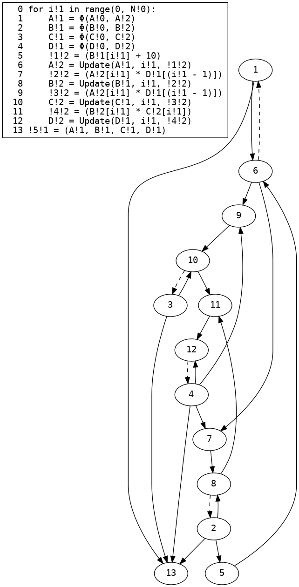
### Removal of infeasible edges
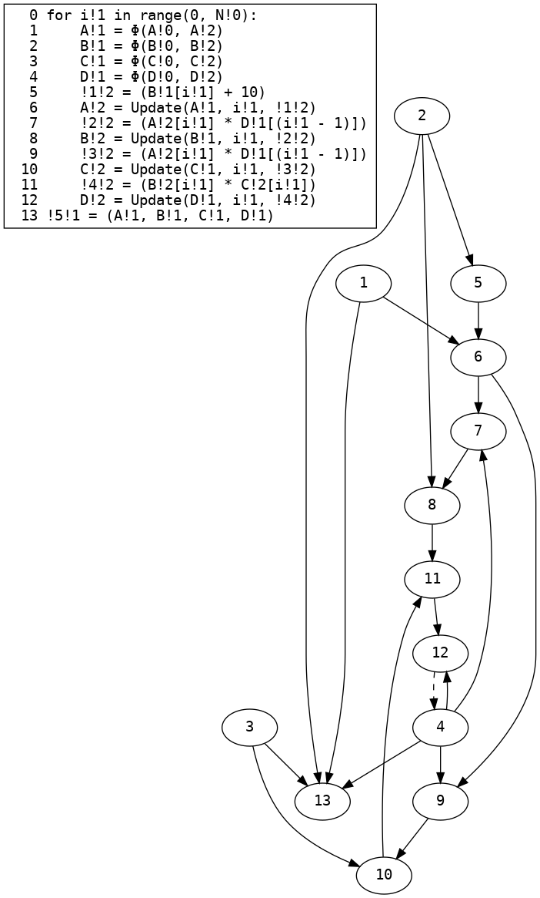
### Array MUX refinement
```python
def foo(A!0: shared[list[int]], B!0: shared[list[int]], C!0: shared[list[int]], D!0: shared[list[int]], N!0: plaintext[int]) -> tuple[shared[list[int]], shared[list[int]], shared[list[int]], shared[list[int]]]:
    for i!1 in range(0, N!0):
        A!1 = Φ(A!0, A!2)
        B!1 = Φ(B!0, B!2)
        C!1 = Φ(C!0, C!2)
        D!1 = Φ(D!0, D!2)
        !1!2 = (B!1[i!1] + 10)
        A!2 = Update(A!1, i!1, !1!2)
        !2!2 = (A!2[i!1] * D!1[(i!1 - 1)])
        B!2 = Update(B!1, i!1, !2!2)
        !3!2 = (A!2[i!1] * D!1[(i!1 - 1)])
        C!2 = Update(C!1, i!1, !3!2)
        !4!2 = (B!2[i!1] * C!2[i!1])
        D!2 = Update(D!1, i!1, !4!2)
    !5!1 = (A!1, B!1, C!1, D!1)
    return !5!1
```
### Array MUX refinement (dependence graph)

### Type environment
| Variable | Type |
| - | - |
| `A!0` | `shared[list[int]]` |
| `B!0` | `shared[list[int]]` |
| `C!0` | `shared[list[int]]` |
| `D!0` | `shared[list[int]]` |
| `N!0` | `plaintext[int]` |
| `i!1` | `plaintext[int]` |
| `A!1` | `shared[list[int]]` |
| `B!1` | `shared[list[int]]` |
| `C!1` | `shared[list[int]]` |
| `D!1` | `shared[list[int]]` |
| `!5!1` | `tuple[shared[list[int]], shared[list[int]], shared[list[int]], shared[list[int]]]` |
| `!4!2` | `shared[int]` |
| `D!2` | `shared[list[int]]` |
| `B!2` | `shared[list[int]]` |
| `C!2` | `shared[list[int]]` |
| `A!2` | `shared[list[int]]` |
| `!3!2` | `shared[int]` |
| `!2!2` | `shared[int]` |
| `!1!2` | `shared[int]` |
### Motion code
```cpp
template <encrypto::motion::MpcProtocol Protocol>
std::tuple<std::vector<encrypto::motion::SecureUnsignedInteger>, std::vector<encrypto::motion::SecureUnsignedInteger>, std::vector<encrypto::motion::SecureUnsignedInteger>, std::vector<encrypto::motion::SecureUnsignedInteger>> foo(
    encrypto::motion::PartyPointer &party,
    std::vector<encrypto::motion::SecureUnsignedInteger> A_0,
    std::vector<encrypto::motion::SecureUnsignedInteger> B_0,
    std::vector<encrypto::motion::SecureUnsignedInteger> C_0,
    std::vector<encrypto::motion::SecureUnsignedInteger> D_0,
    std::uint32_t _MPC_PLAINTEXT_N_0
) {
    // Shared variable declarations
    encrypto::motion::SecureUnsignedInteger N_0;
    encrypto::motion::SecureUnsignedInteger i_1;
    std::vector<encrypto::motion::SecureUnsignedInteger> A_1;
    std::vector<encrypto::motion::SecureUnsignedInteger> B_1;
    std::vector<encrypto::motion::SecureUnsignedInteger> C_1;
    std::vector<encrypto::motion::SecureUnsignedInteger> D_1;
    std::tuple<std::vector<encrypto::motion::SecureUnsignedInteger>, std::vector<encrypto::motion::SecureUnsignedInteger>, std::vector<encrypto::motion::SecureUnsignedInteger>, std::vector<encrypto::motion::SecureUnsignedInteger>> _5_1;
    encrypto::motion::SecureUnsignedInteger _4_2;
    std::vector<encrypto::motion::SecureUnsignedInteger> D_2;
    std::vector<encrypto::motion::SecureUnsignedInteger> B_2;
    std::vector<encrypto::motion::SecureUnsignedInteger> C_2;
    std::vector<encrypto::motion::SecureUnsignedInteger> A_2;
    encrypto::motion::SecureUnsignedInteger _3_2;
    encrypto::motion::SecureUnsignedInteger _2_2;
    encrypto::motion::SecureUnsignedInteger _1_2;

    // Plaintext variable declarations
    std::uint32_t _MPC_PLAINTEXT_i_1;
    std::tuple<std::vector<std::uint32_t>, std::vector<std::uint32_t>, std::vector<std::uint32_t>, std::vector<std::uint32_t>> _MPC_PLAINTEXT__5_1;

    // Constant initializations
    encrypto::motion::SecureUnsignedInteger _MPC_CONSTANT_10 = party->In<Protocol>(encrypto::motion::ToInput(std::uint32_t(10)), 0);

    // Plaintext parameter assignments
    N_0 = party->In<Protocol>(encrypto::motion::ToInput(_MPC_PLAINTEXT_N_0), 0);

    // Function body

    // Initialize phi values
    A_1 = A_0;
    B_1 = B_0;
    C_1 = C_0;
    D_1 = D_0;
    for (_MPC_PLAINTEXT_i_1 = std::uint32_t(0); _MPC_PLAINTEXT_i_1 < _MPC_PLAINTEXT_N_0; _MPC_PLAINTEXT_i_1++) {
        i_1 = party->In<Protocol>(encrypto::motion::ToInput(_MPC_PLAINTEXT_i_1), 0);
        _1_2 = (B_1[_MPC_PLAINTEXT_i_1] + _MPC_CONSTANT_10);
        A_2 = A_1;
        A_1[_MPC_PLAINTEXT_i_1] = _1_2;
        _2_2 = (A_2[_MPC_PLAINTEXT_i_1] * D_1[(_MPC_PLAINTEXT_i_1 - std::uint32_t(1))]);
        B_2 = B_1;
        B_1[_MPC_PLAINTEXT_i_1] = _2_2;
        _3_2 = (A_2[_MPC_PLAINTEXT_i_1] * D_1[(_MPC_PLAINTEXT_i_1 - std::uint32_t(1))]);
        C_2 = C_1;
        C_1[_MPC_PLAINTEXT_i_1] = _3_2;
        _4_2 = (B_2[_MPC_PLAINTEXT_i_1] * C_2[_MPC_PLAINTEXT_i_1]);
        D_2 = D_1;
        D_1[_MPC_PLAINTEXT_i_1] = _4_2;

        // Update phi values
        A_1 = A_2;
        B_1 = B_2;
        C_1 = C_2;
        D_1 = D_2;
    }

    _5_1 = std::make_tuple(A_1, B_1, C_1, D_1);

    return _5_1;
}
```
## `inner_product`
### Input
```python
from UTIL import shared


def inner_product(A: shared[list[int]], B: shared[list[int]], N: int) -> shared[int]:
    sum = 0
    for i in range(0, N):
        temp = A[i] * B[i]
        sum = sum + temp
    return sum


A = [1, 2, 3]
B = [4, 5, 6]
print(inner_product(A, B, 3))

```
### Restricted AST
```python
def inner_product(A: shared[list[int]], B: shared[list[int]], N: plaintext[int]) -> shared[int]:
    sum = 0
    for i: plaintext[int] in range(0, N):
        temp = (A[i] * B[i])
        sum = (sum + temp)
    return sum
```
### Three-address code CFG
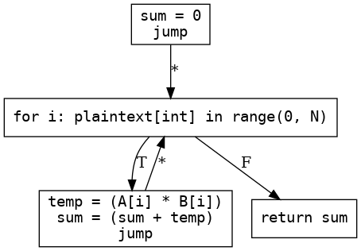
### SSA
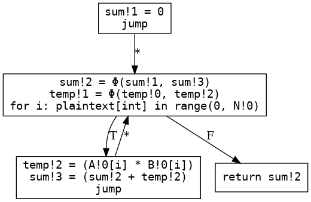
### SSA ϕ→MUX
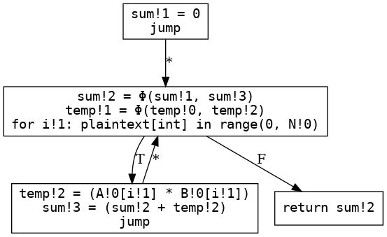
### Dead code elimination
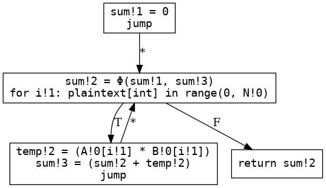
### Linear code with loops
```python
def inner_product(A!0: shared[list[int]], B!0: shared[list[int]], N!0: plaintext[int]) -> shared[int]:
    sum!1 = 0
    for i!1 in range(0, N!0):
        sum!2 = Φ(sum!1, sum!3)
        temp!2 = (A!0[i!1] * B!0[i!1])
        sum!3 = (sum!2 + temp!2)
    return sum!2
```
### Dependency graph
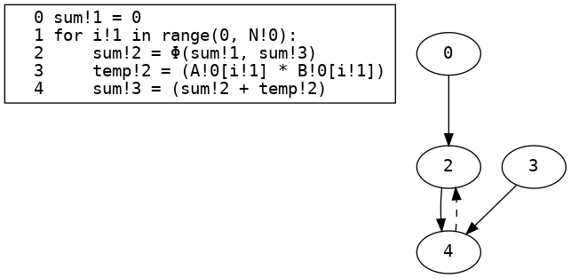
### Removal of infeasible edges

### Array MUX refinement
```python
def inner_product(A!0: shared[list[int]], B!0: shared[list[int]], N!0: plaintext[int]) -> shared[int]:
    sum!1 = 0
    for i!1 in range(0, N!0):
        sum!2 = Φ(sum!1, sum!3)
        temp!2 = (A!0[i!1] * B!0[i!1])
        sum!3 = (sum!2 + temp!2)
    return sum!2
```
### Array MUX refinement (dependence graph)

### Type environment
| Variable | Type |
| - | - |
| `A!0` | `shared[list[int]]` |
| `B!0` | `shared[list[int]]` |
| `N!0` | `plaintext[int]` |
| `i!1` | `plaintext[int]` |
| `sum!2` | `shared[int]` |
| `temp!2` | `shared[int]` |
| `sum!3` | `shared[int]` |
| `sum!1` | `plaintext[int]` |
### Motion code
```cpp
template <encrypto::motion::MpcProtocol Protocol>
encrypto::motion::SecureUnsignedInteger inner_product(
    encrypto::motion::PartyPointer &party,
    std::vector<encrypto::motion::SecureUnsignedInteger> A_0,
    std::vector<encrypto::motion::SecureUnsignedInteger> B_0,
    std::uint32_t _MPC_PLAINTEXT_N_0
) {
    // Shared variable declarations
    encrypto::motion::SecureUnsignedInteger N_0;
    encrypto::motion::SecureUnsignedInteger i_1;
    encrypto::motion::SecureUnsignedInteger sum_2;
    encrypto::motion::SecureUnsignedInteger temp_2;
    encrypto::motion::SecureUnsignedInteger sum_3;
    encrypto::motion::SecureUnsignedInteger sum_1;

    // Plaintext variable declarations
    std::uint32_t _MPC_PLAINTEXT_i_1;
    std::uint32_t _MPC_PLAINTEXT_sum_1;

    // Constant initializations
    encrypto::motion::SecureUnsignedInteger _MPC_CONSTANT_0 = party->In<Protocol>(encrypto::motion::ToInput(std::uint32_t(0)), 0);

    // Plaintext parameter assignments
    N_0 = party->In<Protocol>(encrypto::motion::ToInput(_MPC_PLAINTEXT_N_0), 0);

    // Function body
    sum_1 = _MPC_CONSTANT_0;
    _MPC_PLAINTEXT_sum_1 = std::uint32_t(0);

    // Initialize phi values
    sum_2 = sum_1;
    for (_MPC_PLAINTEXT_i_1 = std::uint32_t(0); _MPC_PLAINTEXT_i_1 < _MPC_PLAINTEXT_N_0; _MPC_PLAINTEXT_i_1++) {
        i_1 = party->In<Protocol>(encrypto::motion::ToInput(_MPC_PLAINTEXT_i_1), 0);
        temp_2 = (A_0[_MPC_PLAINTEXT_i_1] * B_0[_MPC_PLAINTEXT_i_1]);
        sum_3 = (sum_2 + temp_2);

        // Update phi values
        sum_2 = sum_3;
    }


    return sum_2;
}
```
## `longest_102`
### Input
```python
from UTIL import shared


def longest_102(Seq: shared[list[int]], N: int, Syms: shared[list[int]]) -> shared[int]:
    """
    Computes the length of the largest instance of regex a(b*)c in a provided sequence.
    Syms is a list of form [a, b, c].
    """
    s0 = False

    max_len = 0
    length = 0

    for i in range(0, N):
        s1 = s0 and (Seq[i] == Syms[2])
        s0 = (Seq[i] == Syms[1]) or (s0 and (Seq[i] == Syms[0]))

        if s1 or s0:
            length = length + 1
        else:
            length = 0

        if s1 and max_len < length:
            max_len = length

    return max_len


seq = [1, 0, 2, 1, 0, 0, 2, 1, 2, 2]
print(longest_102(seq, 10, [1, 0, 2]))

```
### Restricted AST
```python
def longest_102(Seq: shared[list[int]], N: plaintext[int], Syms: shared[list[int]]) -> shared[int]:
    s0 = False
    max_len = 0
    length = 0
    for i: plaintext[int] in range(0, N):
        s1 = (s0 and (Seq[i] == Syms[2]))
        s0 = ((Seq[i] == Syms[1]) or (s0 and (Seq[i] == Syms[0])))
        if (s1 or s0):
            length = (length + 1)
        else:
            length = 0
        if (s1 and (max_len < length)):
            max_len = length
    return max_len
```
### Three-address code CFG
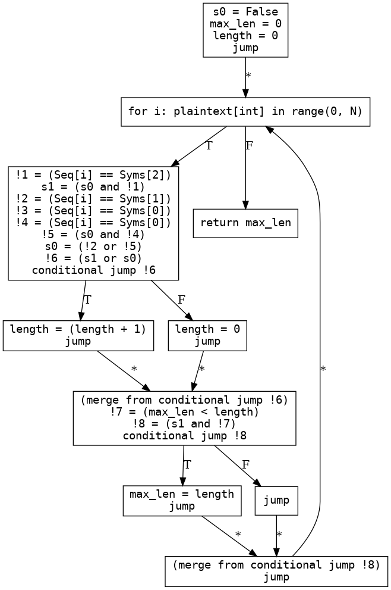
### SSA
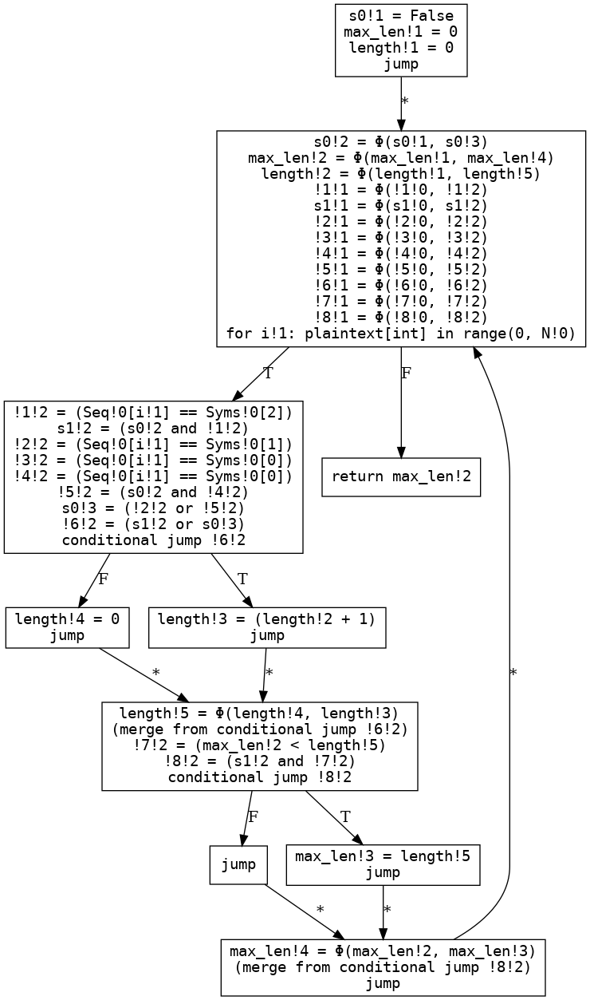
### SSA ϕ→MUX
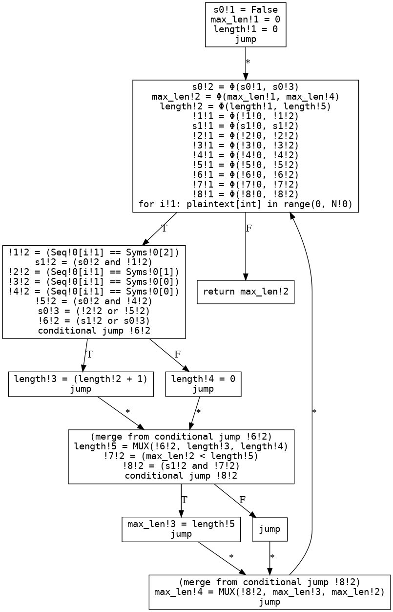
### Dead code elimination
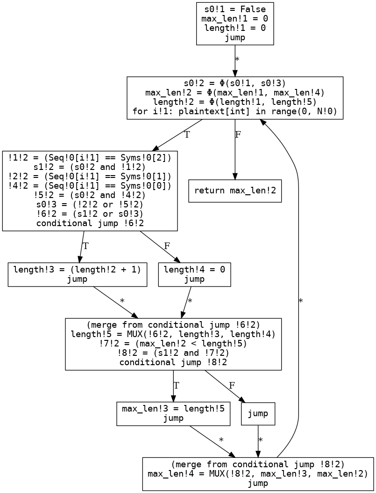
### Linear code with loops
```python
def longest_102(Seq!0: shared[list[int]], N!0: plaintext[int], Syms!0: shared[list[int]]) -> shared[int]:
    s0!1 = False
    max_len!1 = 0
    length!1 = 0
    for i!1 in range(0, N!0):
        s0!2 = Φ(s0!1, s0!3)
        max_len!2 = Φ(max_len!1, max_len!4)
        length!2 = Φ(length!1, length!5)
        !1!2 = (Seq!0[i!1] == Syms!0[2])
        s1!2 = (s0!2 and !1!2)
        !2!2 = (Seq!0[i!1] == Syms!0[1])
        !4!2 = (Seq!0[i!1] == Syms!0[0])
        !5!2 = (s0!2 and !4!2)
        s0!3 = (!2!2 or !5!2)
        !6!2 = (s1!2 or s0!3)
        length!4 = 0
        length!3 = (length!2 + 1)
        length!5 = MUX(!6!2, length!3, length!4)
        !7!2 = (max_len!2 < length!5)
        !8!2 = (s1!2 and !7!2)
        max_len!3 = length!5
        max_len!4 = MUX(!8!2, max_len!3, max_len!2)
    return max_len!2
```
### Dependency graph
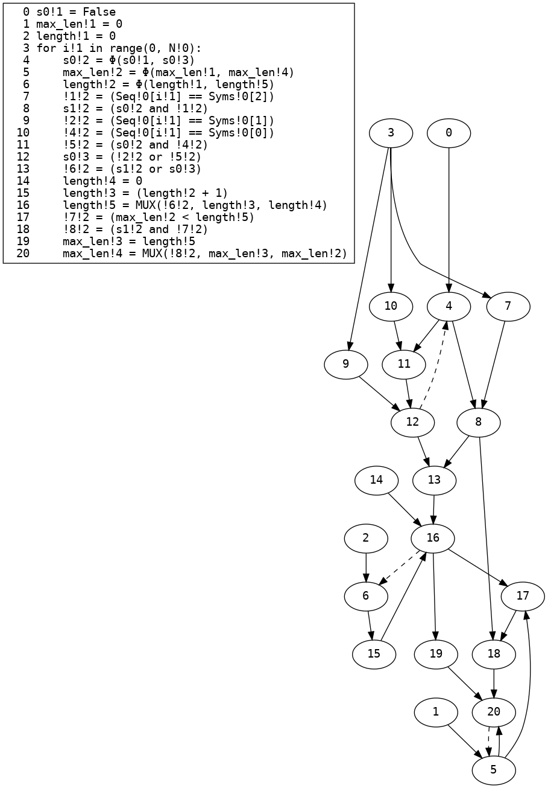
### Removal of infeasible edges

### Array MUX refinement
```python
def longest_102(Seq!0: shared[list[int]], N!0: plaintext[int], Syms!0: shared[list[int]]) -> shared[int]:
    s0!1 = False
    max_len!1 = 0
    length!1 = 0
    for i!1 in range(0, N!0):
        s0!2 = Φ(s0!1, s0!3)
        max_len!2 = Φ(max_len!1, max_len!4)
        length!2 = Φ(length!1, length!5)
        !1!2 = (Seq!0[i!1] == Syms!0[2])
        s1!2 = (s0!2 and !1!2)
        !2!2 = (Seq!0[i!1] == Syms!0[1])
        !4!2 = (Seq!0[i!1] == Syms!0[0])
        !5!2 = (s0!2 and !4!2)
        s0!3 = (!2!2 or !5!2)
        !6!2 = (s1!2 or s0!3)
        length!4 = 0
        length!3 = (length!2 + 1)
        length!5 = MUX(!6!2, length!3, length!4)
        !7!2 = (max_len!2 < length!5)
        !8!2 = (s1!2 and !7!2)
        max_len!3 = length!5
        max_len!4 = MUX(!8!2, max_len!3, max_len!2)
    return max_len!2
```
### Array MUX refinement (dependence graph)
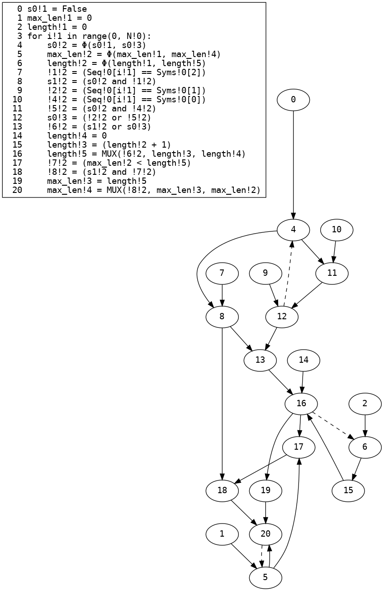
### Type environment
| Variable | Type |
| - | - |
| `Seq!0` | `shared[list[int]]` |
| `N!0` | `plaintext[int]` |
| `Syms!0` | `shared[list[int]]` |
| `i!1` | `plaintext[int]` |
| `!8!2` | `shared[bool]` |
| `max_len!2` | `shared[int]` |
| `max_len!3` | `shared[int]` |
| `max_len!4` | `shared[int]` |
| `max_len!1` | `plaintext[int]` |
| `length!5` | `shared[int]` |
| `!7!2` | `shared[bool]` |
| `s1!2` | `shared[bool]` |
| `!6!2` | `shared[bool]` |
| `length!4` | `plaintext[int]` |
| `length!3` | `shared[int]` |
| `length!1` | `plaintext[int]` |
| `length!2` | `shared[int]` |
| `s0!3` | `shared[bool]` |
| `!2!2` | `shared[bool]` |
| `!5!2` | `shared[bool]` |
| `s0!1` | `plaintext[bool]` |
| `s0!2` | `shared[bool]` |
| `!4!2` | `shared[bool]` |
| `!1!2` | `shared[bool]` |
### Motion code
```cpp
template <encrypto::motion::MpcProtocol Protocol>
encrypto::motion::SecureUnsignedInteger longest_102(
    encrypto::motion::PartyPointer &party,
    std::vector<encrypto::motion::SecureUnsignedInteger> Seq_0,
    std::uint32_t _MPC_PLAINTEXT_N_0,
    std::vector<encrypto::motion::SecureUnsignedInteger> Syms_0
) {
    // Shared variable declarations
    encrypto::motion::SecureUnsignedInteger N_0;
    encrypto::motion::SecureUnsignedInteger i_1;
    encrypto::motion::ShareWrapper _8_2;
    encrypto::motion::SecureUnsignedInteger max_len_2;
    encrypto::motion::SecureUnsignedInteger max_len_3;
    encrypto::motion::SecureUnsignedInteger max_len_4;
    encrypto::motion::SecureUnsignedInteger max_len_1;
    encrypto::motion::SecureUnsignedInteger length_5;
    encrypto::motion::ShareWrapper _7_2;
    encrypto::motion::ShareWrapper s1_2;
    encrypto::motion::ShareWrapper _6_2;
    encrypto::motion::SecureUnsignedInteger length_4;
    encrypto::motion::SecureUnsignedInteger length_3;
    encrypto::motion::SecureUnsignedInteger length_1;
    encrypto::motion::SecureUnsignedInteger length_2;
    encrypto::motion::ShareWrapper s0_3;
    encrypto::motion::ShareWrapper _2_2;
    encrypto::motion::ShareWrapper _5_2;
    encrypto::motion::ShareWrapper s0_1;
    encrypto::motion::ShareWrapper s0_2;
    encrypto::motion::ShareWrapper _4_2;
    encrypto::motion::ShareWrapper _1_2;

    // Plaintext variable declarations
    std::uint32_t _MPC_PLAINTEXT_i_1;
    std::uint32_t _MPC_PLAINTEXT_max_len_1;
    std::uint32_t _MPC_PLAINTEXT_length_4;
    std::uint32_t _MPC_PLAINTEXT_length_1;
    bool _MPC_PLAINTEXT_s0_1;

    // Constant initializations
    encrypto::motion::ShareWrapper _MPC_CONSTANT_false = party->In<Protocol>(encrypto::motion::BitVector(1, false), 0);
    encrypto::motion::SecureUnsignedInteger _MPC_CONSTANT_0 = party->In<Protocol>(encrypto::motion::ToInput(std::uint32_t(0)), 0);
    encrypto::motion::SecureUnsignedInteger _MPC_CONSTANT_1 = party->In<Protocol>(encrypto::motion::ToInput(std::uint32_t(1)), 0);

    // Plaintext parameter assignments
    N_0 = party->In<Protocol>(encrypto::motion::ToInput(_MPC_PLAINTEXT_N_0), 0);

    // Function body
    s0_1 = _MPC_CONSTANT_false;
    _MPC_PLAINTEXT_s0_1 = false;
    max_len_1 = _MPC_CONSTANT_0;
    _MPC_PLAINTEXT_max_len_1 = std::uint32_t(0);
    length_1 = _MPC_CONSTANT_0;
    _MPC_PLAINTEXT_length_1 = std::uint32_t(0);

    // Initialize phi values
    s0_2 = s0_1;
    max_len_2 = max_len_1;
    length_2 = length_1;
    for (_MPC_PLAINTEXT_i_1 = std::uint32_t(0); _MPC_PLAINTEXT_i_1 < _MPC_PLAINTEXT_N_0; _MPC_PLAINTEXT_i_1++) {
        i_1 = party->In<Protocol>(encrypto::motion::ToInput(_MPC_PLAINTEXT_i_1), 0);
        _1_2 = (encrypto::motion::ShareWrapper(Seq_0[_MPC_PLAINTEXT_i_1].Get()) == encrypto::motion::ShareWrapper(Syms_0[std::uint32_t(2)].Get()));
        s1_2 = (encrypto::motion::ShareWrapper(s0_2.Get()) & encrypto::motion::ShareWrapper(_1_2.Get()));
        _2_2 = (encrypto::motion::ShareWrapper(Seq_0[_MPC_PLAINTEXT_i_1].Get()) == encrypto::motion::ShareWrapper(Syms_0[std::uint32_t(1)].Get()));
        _4_2 = (encrypto::motion::ShareWrapper(Seq_0[_MPC_PLAINTEXT_i_1].Get()) == encrypto::motion::ShareWrapper(Syms_0[std::uint32_t(0)].Get()));
        _5_2 = (encrypto::motion::ShareWrapper(s0_2.Get()) & encrypto::motion::ShareWrapper(_4_2.Get()));
        s0_3 = (encrypto::motion::ShareWrapper(_2_2.Get()) | encrypto::motion::ShareWrapper(_5_2.Get()));
        _6_2 = (encrypto::motion::ShareWrapper(s1_2.Get()) | encrypto::motion::ShareWrapper(s0_3.Get()));
        length_4 = _MPC_CONSTANT_0;
        _MPC_PLAINTEXT_length_4 = std::uint32_t(0);
        length_3 = (length_2 + _MPC_CONSTANT_1);
        length_5 = _6_2.Mux(length_3.Get(), length_4.Get());
        _7_2 = (length_5 > max_len_2);
        _8_2 = (encrypto::motion::ShareWrapper(s1_2.Get()) & encrypto::motion::ShareWrapper(_7_2.Get()));
        max_len_3 = length_5;
        max_len_4 = _8_2.Mux(max_len_3.Get(), max_len_2.Get());

        // Update phi values
        s0_2 = s0_3;
        max_len_2 = max_len_4;
        length_2 = length_5;
    }


    return max_len_2;
}
```
## `longest_1s`
### Input
```python
from UTIL import shared


def longest_1s(Seq: shared[list[int]], N: int, Sym: shared[int]) -> shared[int]:
    """
    Computes length of the longest sequence of form (a*).
    Sym is the integer a.
    """

    max_length = 0
    length = 0

    for i in range(1, N):
        if Seq[i] == Sym:
            length = length + 1
        else:
            length = 0

        if length > max_length:
            max_length = length

    return max_length


seq = [0, 0, 1, 1, 1, 1, 0, 1, 0]
print(longest_1s(seq, 9, 1))

```
### Restricted AST
```python
def longest_1s(Seq: shared[list[int]], N: plaintext[int], Sym: shared[int]) -> shared[int]:
    max_length = 0
    length = 0
    for i: plaintext[int] in range(1, N):
        if (Seq[i] == Sym):
            length = (length + 1)
        else:
            length = 0
        if (length > max_length):
            max_length = length
    return max_length
```
### Three-address code CFG

### SSA
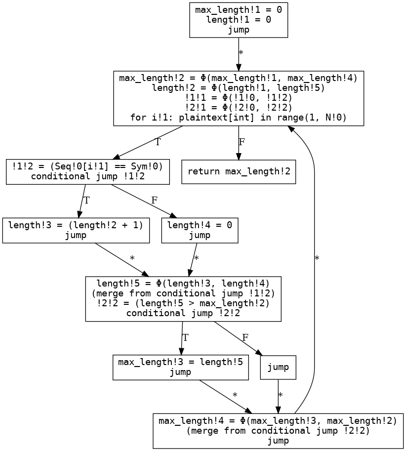
### SSA ϕ→MUX
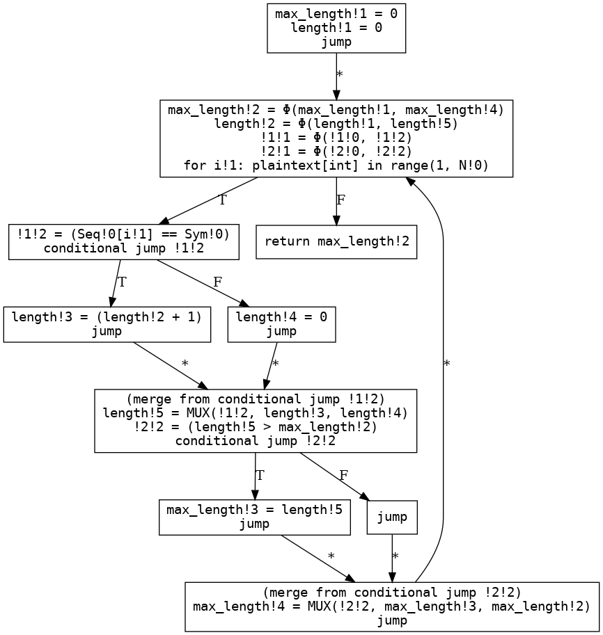
### Dead code elimination
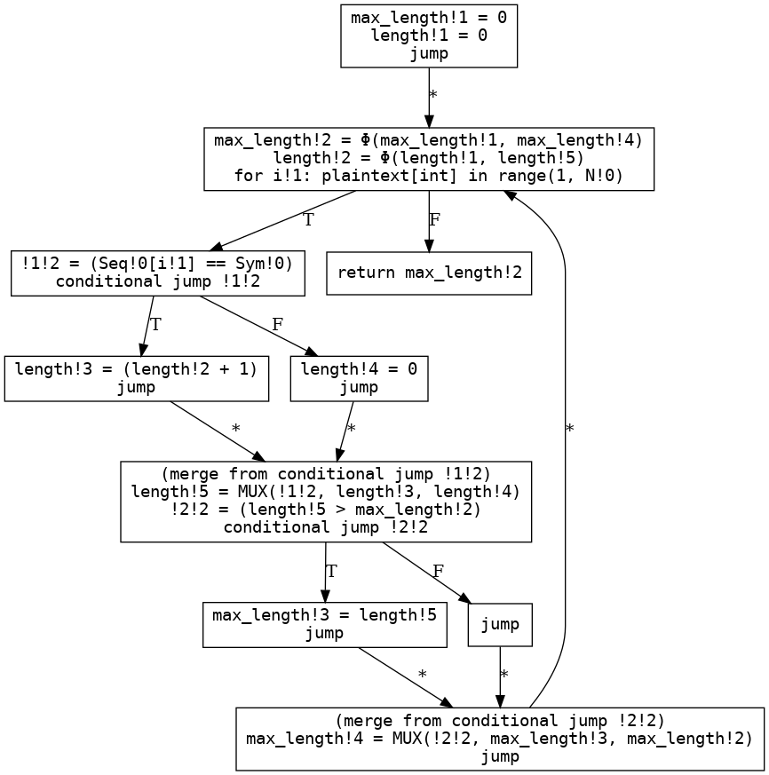
### Linear code with loops
```python
def longest_1s(Seq!0: shared[list[int]], N!0: plaintext[int], Sym!0: shared[int]) -> shared[int]:
    max_length!1 = 0
    length!1 = 0
    for i!1 in range(1, N!0):
        max_length!2 = Φ(max_length!1, max_length!4)
        length!2 = Φ(length!1, length!5)
        !1!2 = (Seq!0[i!1] == Sym!0)
        length!4 = 0
        length!3 = (length!2 + 1)
        length!5 = MUX(!1!2, length!3, length!4)
        !2!2 = (length!5 > max_length!2)
        max_length!3 = length!5
        max_length!4 = MUX(!2!2, max_length!3, max_length!2)
    return max_length!2
```
### Dependency graph
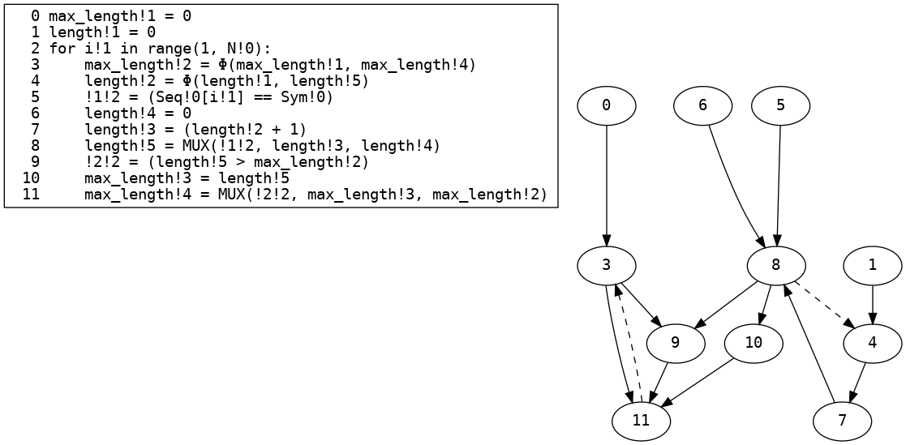
### Removal of infeasible edges
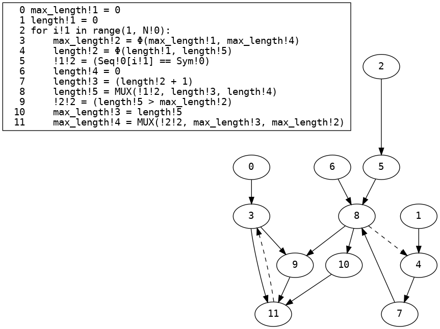
### Array MUX refinement
```python
def longest_1s(Seq!0: shared[list[int]], N!0: plaintext[int], Sym!0: shared[int]) -> shared[int]:
    max_length!1 = 0
    length!1 = 0
    for i!1 in range(1, N!0):
        max_length!2 = Φ(max_length!1, max_length!4)
        length!2 = Φ(length!1, length!5)
        !1!2 = (Seq!0[i!1] == Sym!0)
        length!4 = 0
        length!3 = (length!2 + 1)
        length!5 = MUX(!1!2, length!3, length!4)
        !2!2 = (length!5 > max_length!2)
        max_length!3 = length!5
        max_length!4 = MUX(!2!2, max_length!3, max_length!2)
    return max_length!2
```
### Array MUX refinement (dependence graph)
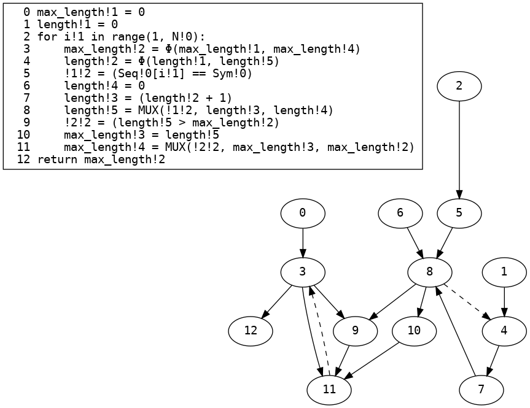
### Type environment
| Variable | Type |
| - | - |
| `Seq!0` | `shared[list[int]]` |
| `N!0` | `plaintext[int]` |
| `Sym!0` | `shared[int]` |
| `i!1` | `plaintext[int]` |
| `!2!2` | `shared[bool]` |
| `max_length!2` | `shared[int]` |
| `max_length!3` | `shared[int]` |
| `max_length!4` | `shared[int]` |
| `max_length!1` | `plaintext[int]` |
| `length!5` | `shared[int]` |
| `!1!2` | `shared[bool]` |
| `length!4` | `plaintext[int]` |
| `length!3` | `shared[int]` |
| `length!1` | `plaintext[int]` |
| `length!2` | `shared[int]` |
### Motion code
```cpp
template <encrypto::motion::MpcProtocol Protocol>
encrypto::motion::SecureUnsignedInteger longest_1s(
    encrypto::motion::PartyPointer &party,
    std::vector<encrypto::motion::SecureUnsignedInteger> Seq_0,
    std::uint32_t _MPC_PLAINTEXT_N_0,
    encrypto::motion::SecureUnsignedInteger Sym_0
) {
    // Shared variable declarations
    encrypto::motion::SecureUnsignedInteger N_0;
    encrypto::motion::SecureUnsignedInteger i_1;
    encrypto::motion::ShareWrapper _2_2;
    encrypto::motion::SecureUnsignedInteger max_length_2;
    encrypto::motion::SecureUnsignedInteger max_length_3;
    encrypto::motion::SecureUnsignedInteger max_length_4;
    encrypto::motion::SecureUnsignedInteger max_length_1;
    encrypto::motion::SecureUnsignedInteger length_5;
    encrypto::motion::ShareWrapper _1_2;
    encrypto::motion::SecureUnsignedInteger length_4;
    encrypto::motion::SecureUnsignedInteger length_3;
    encrypto::motion::SecureUnsignedInteger length_1;
    encrypto::motion::SecureUnsignedInteger length_2;

    // Plaintext variable declarations
    std::uint32_t _MPC_PLAINTEXT_i_1;
    std::uint32_t _MPC_PLAINTEXT_max_length_1;
    std::uint32_t _MPC_PLAINTEXT_length_4;
    std::uint32_t _MPC_PLAINTEXT_length_1;

    // Constant initializations
    encrypto::motion::SecureUnsignedInteger _MPC_CONSTANT_0 = party->In<Protocol>(encrypto::motion::ToInput(std::uint32_t(0)), 0);
    encrypto::motion::SecureUnsignedInteger _MPC_CONSTANT_1 = party->In<Protocol>(encrypto::motion::ToInput(std::uint32_t(1)), 0);

    // Plaintext parameter assignments
    N_0 = party->In<Protocol>(encrypto::motion::ToInput(_MPC_PLAINTEXT_N_0), 0);

    // Function body
    max_length_1 = _MPC_CONSTANT_0;
    _MPC_PLAINTEXT_max_length_1 = std::uint32_t(0);
    length_1 = _MPC_CONSTANT_0;
    _MPC_PLAINTEXT_length_1 = std::uint32_t(0);

    // Initialize phi values
    max_length_2 = max_length_1;
    length_2 = length_1;
    for (_MPC_PLAINTEXT_i_1 = std::uint32_t(1); _MPC_PLAINTEXT_i_1 < _MPC_PLAINTEXT_N_0; _MPC_PLAINTEXT_i_1++) {
        i_1 = party->In<Protocol>(encrypto::motion::ToInput(_MPC_PLAINTEXT_i_1), 0);
        _1_2 = (encrypto::motion::ShareWrapper(Seq_0[_MPC_PLAINTEXT_i_1].Get()) == encrypto::motion::ShareWrapper(Sym_0.Get()));
        length_4 = _MPC_CONSTANT_0;
        _MPC_PLAINTEXT_length_4 = std::uint32_t(0);
        length_3 = (length_2 + _MPC_CONSTANT_1);
        length_5 = _1_2.Mux(length_3.Get(), length_4.Get());
        _2_2 = (length_5 > max_length_2);
        max_length_3 = length_5;
        max_length_4 = _2_2.Mux(max_length_3.Get(), max_length_2.Get());

        // Update phi values
        max_length_2 = max_length_4;
        length_2 = length_5;
    }


    return max_length_2;
}
```
## `longest_even_0`
### Input
```python
from UTIL import shared


def longest_even_0(Seq: shared[list[int]], N: int, Sym: shared[int]) -> shared[int]:
    """
    Computes the length of the longest regex of form (a*) which has an even length
    Sym is the symbol a
    """

    current_length = 0
    max_length = 0

    for i in range(1, N):
        if Seq[i] == Sym:
            current_length = current_length + 1
        else:
            current_length = 0

        tmp_max_len = max_length
        if current_length > max_length:
            tmp_max_len = current_length

        if tmp_max_len & 1 == 0:
            max_length = tmp_max_len

    return max_length

```
### Restricted AST
```python
def longest_even_0(Seq: shared[list[int]], N: plaintext[int], Sym: shared[int]) -> shared[int]:
    current_length = 0
    max_length = 0
    for i: plaintext[int] in range(1, N):
        if (Seq[i] == Sym):
            current_length = (current_length + 1)
        else:
            current_length = 0
        tmp_max_len = max_length
        if (current_length > max_length):
            tmp_max_len = current_length
        if ((tmp_max_len & 1) == 0):
            max_length = tmp_max_len
    return max_length
```
### Three-address code CFG
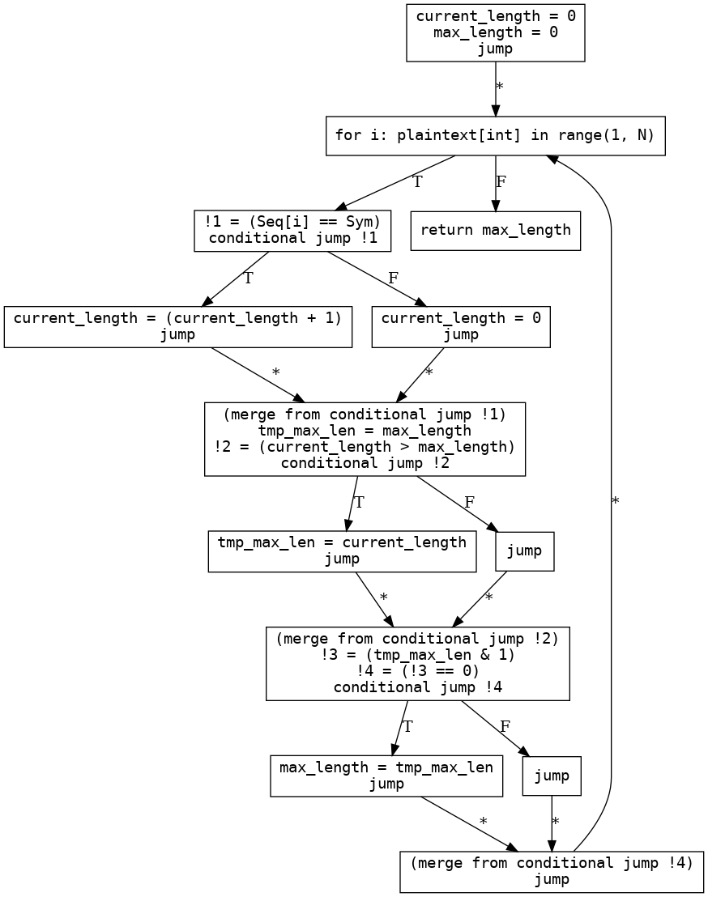
### SSA
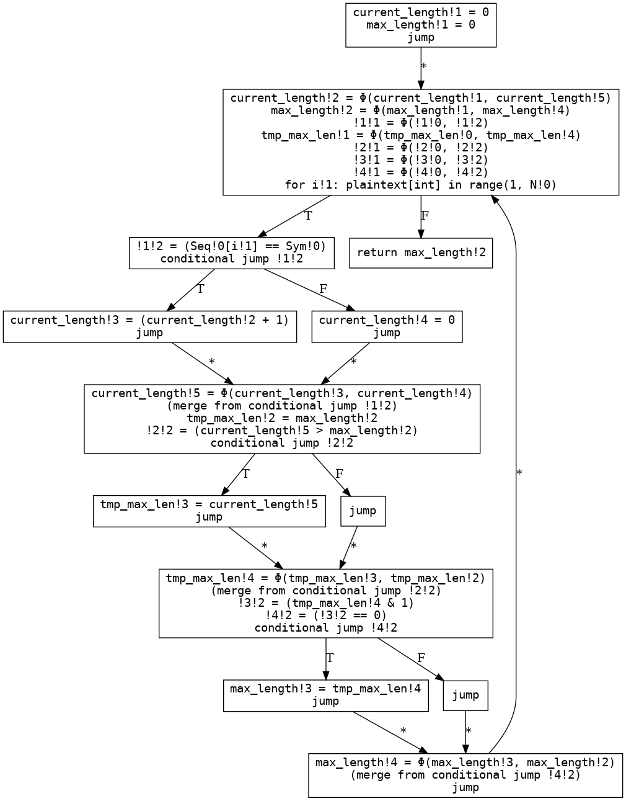
### SSA ϕ→MUX
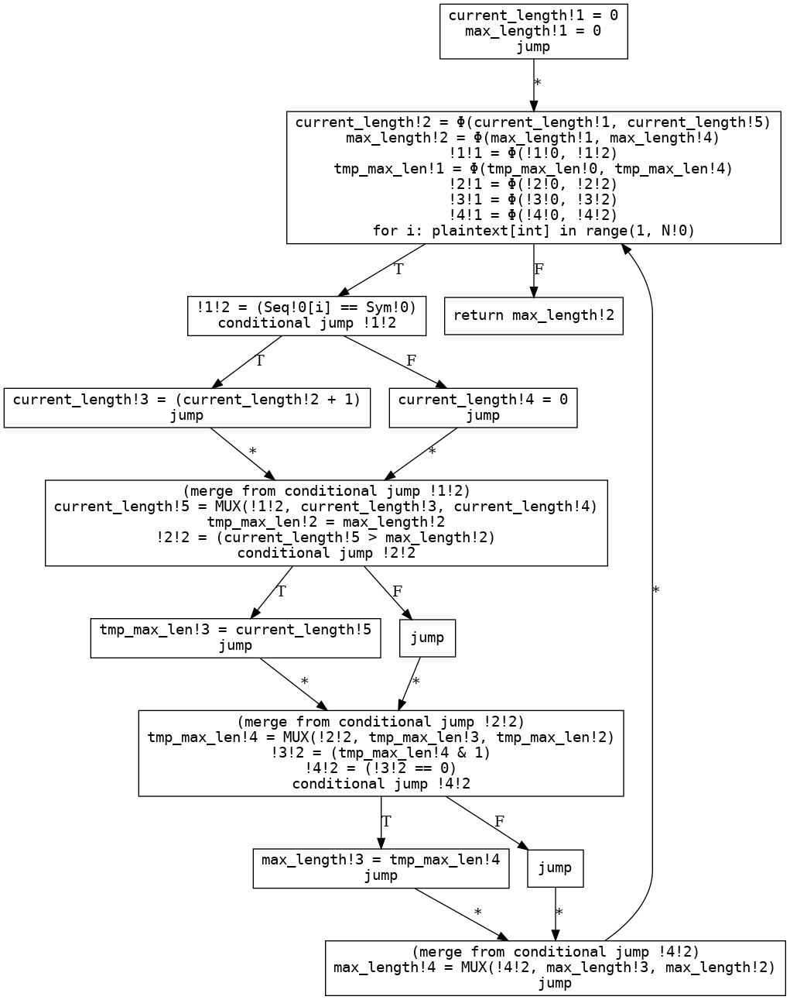
### Dead code elimination
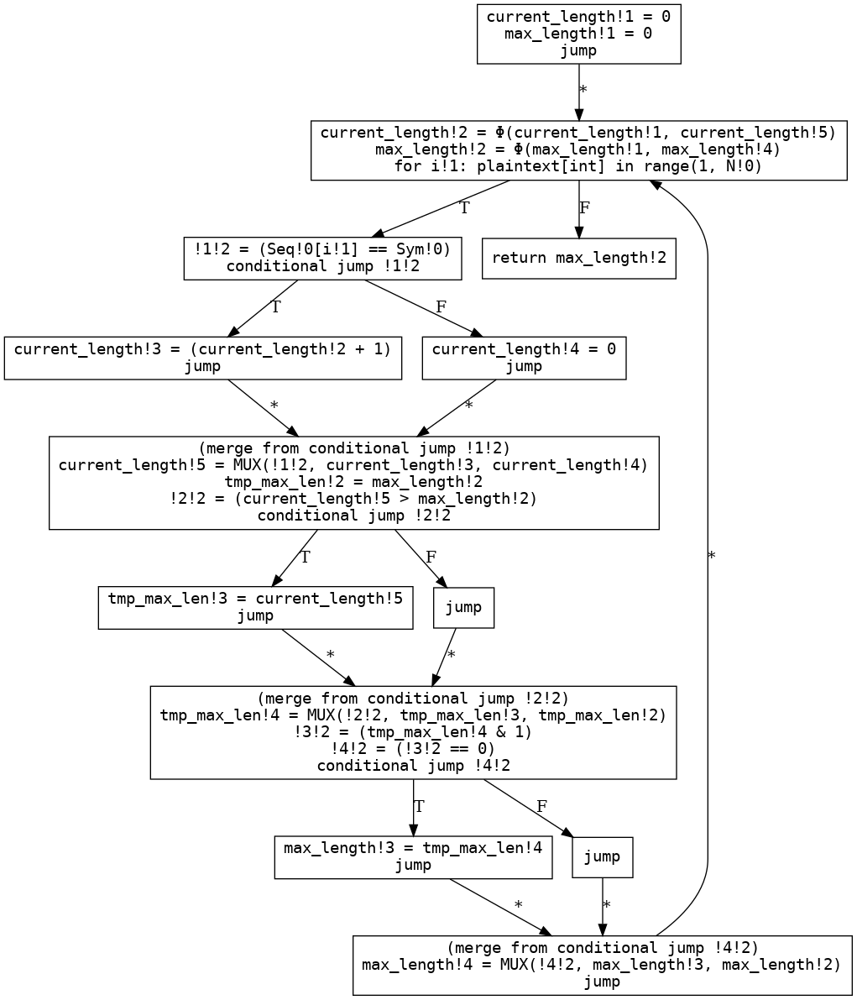
### Linear code with loops
```python
def longest_even_0(Seq!0: shared[list[int]], N!0: plaintext[int], Sym!0: shared[int]) -> shared[int]:
    current_length!1 = 0
    max_length!1 = 0
    for i!1 in range(1, N!0):
        current_length!2 = Φ(current_length!1, current_length!5)
        max_length!2 = Φ(max_length!1, max_length!4)
        !1!2 = (Seq!0[i!1] == Sym!0)
        current_length!4 = 0
        current_length!3 = (current_length!2 + 1)
        current_length!5 = MUX(!1!2, current_length!3, current_length!4)
        tmp_max_len!2 = max_length!2
        !2!2 = (current_length!5 > max_length!2)
        tmp_max_len!3 = current_length!5
        tmp_max_len!4 = MUX(!2!2, tmp_max_len!3, tmp_max_len!2)
        !3!2 = (tmp_max_len!4 & 1)
        !4!2 = (!3!2 == 0)
        max_length!3 = tmp_max_len!4
        max_length!4 = MUX(!4!2, max_length!3, max_length!2)
    return max_length!2
```
### Dependency graph
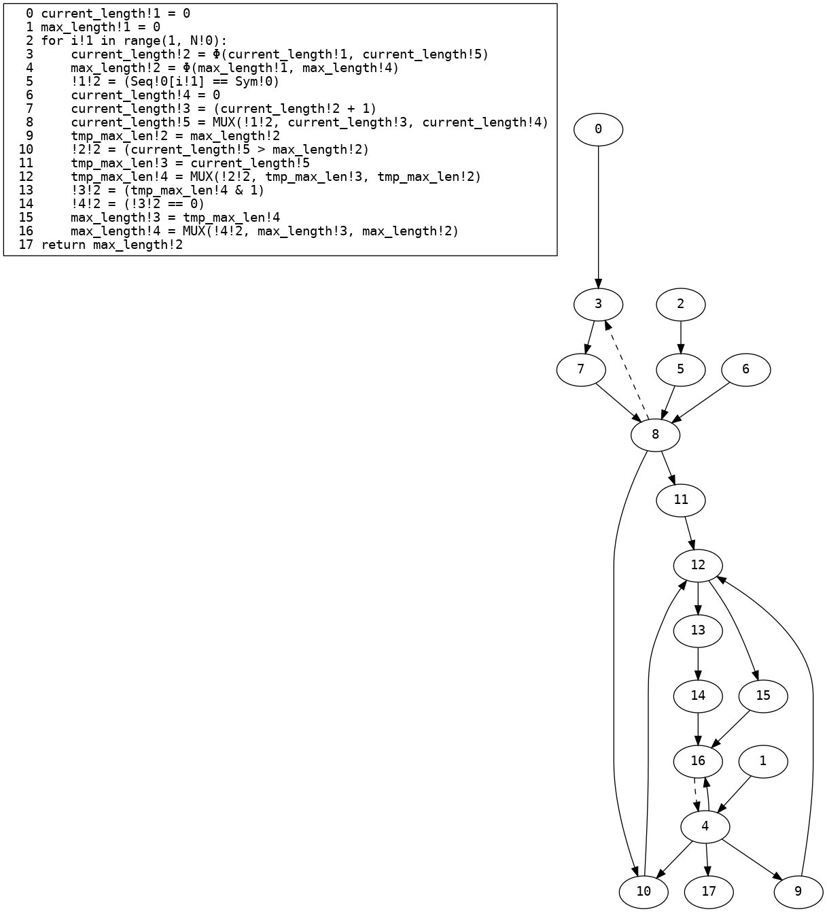
### Removal of infeasible edges

### Array MUX refinement
```python
def longest_even_0(Seq!0: shared[list[int]], N!0: plaintext[int], Sym!0: shared[int]) -> shared[int]:
    current_length!1 = 0
    max_length!1 = 0
    for i!1 in range(1, N!0):
        current_length!2 = Φ(current_length!1, current_length!5)
        max_length!2 = Φ(max_length!1, max_length!4)
        !1!2 = (Seq!0[i!1] == Sym!0)
        current_length!4 = 0
        current_length!3 = (current_length!2 + 1)
        current_length!5 = MUX(!1!2, current_length!3, current_length!4)
        tmp_max_len!2 = max_length!2
        !2!2 = (current_length!5 > max_length!2)
        tmp_max_len!3 = current_length!5
        tmp_max_len!4 = MUX(!2!2, tmp_max_len!3, tmp_max_len!2)
        !3!2 = (tmp_max_len!4 & 1)
        !4!2 = (!3!2 == 0)
        max_length!3 = tmp_max_len!4
        max_length!4 = MUX(!4!2, max_length!3, max_length!2)
    return max_length!2
```
### Array MUX refinement (dependence graph)
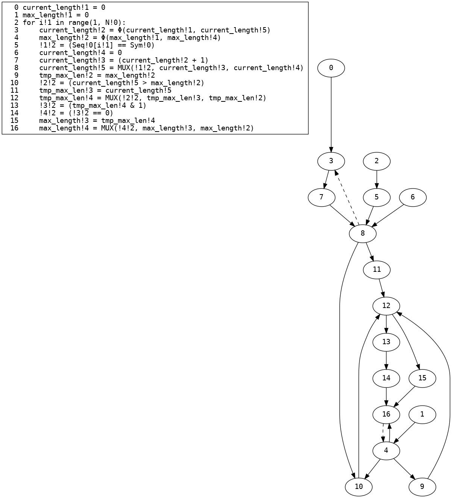
### Type environment
| Variable | Type |
| - | - |
| `Seq!0` | `shared[list[int]]` |
| `N!0` | `plaintext[int]` |
| `Sym!0` | `shared[int]` |
| `i!1` | `plaintext[int]` |
| `!4!2` | `shared[bool]` |
| `max_length!2` | `shared[int]` |
| `max_length!3` | `shared[int]` |
| `max_length!4` | `shared[int]` |
| `max_length!1` | `plaintext[int]` |
| `current_length!5` | `shared[int]` |
| `!2!2` | `shared[bool]` |
| `tmp_max_len!2` | `shared[int]` |
| `tmp_max_len!3` | `shared[int]` |
| `tmp_max_len!4` | `shared[int]` |
| `!3!2` | `shared[int]` |
| `!1!2` | `shared[bool]` |
| `current_length!4` | `plaintext[int]` |
| `current_length!3` | `shared[int]` |
| `current_length!1` | `plaintext[int]` |
| `current_length!2` | `shared[int]` |
### Motion code
```cpp
template <encrypto::motion::MpcProtocol Protocol>
encrypto::motion::SecureUnsignedInteger longest_even_0(
    encrypto::motion::PartyPointer &party,
    std::vector<encrypto::motion::SecureUnsignedInteger> Seq_0,
    std::uint32_t _MPC_PLAINTEXT_N_0,
    encrypto::motion::SecureUnsignedInteger Sym_0
) {
    // Shared variable declarations
    encrypto::motion::SecureUnsignedInteger N_0;
    encrypto::motion::SecureUnsignedInteger i_1;
    encrypto::motion::ShareWrapper _4_2;
    encrypto::motion::SecureUnsignedInteger max_length_2;
    encrypto::motion::SecureUnsignedInteger max_length_3;
    encrypto::motion::SecureUnsignedInteger max_length_4;
    encrypto::motion::SecureUnsignedInteger max_length_1;
    encrypto::motion::SecureUnsignedInteger current_length_5;
    encrypto::motion::ShareWrapper _2_2;
    encrypto::motion::SecureUnsignedInteger tmp_max_len_2;
    encrypto::motion::SecureUnsignedInteger tmp_max_len_3;
    encrypto::motion::SecureUnsignedInteger tmp_max_len_4;
    encrypto::motion::SecureUnsignedInteger _3_2;
    encrypto::motion::ShareWrapper _1_2;
    encrypto::motion::SecureUnsignedInteger current_length_4;
    encrypto::motion::SecureUnsignedInteger current_length_3;
    encrypto::motion::SecureUnsignedInteger current_length_1;
    encrypto::motion::SecureUnsignedInteger current_length_2;

    // Plaintext variable declarations
    std::uint32_t _MPC_PLAINTEXT_i_1;
    std::uint32_t _MPC_PLAINTEXT_max_length_1;
    std::uint32_t _MPC_PLAINTEXT_current_length_4;
    std::uint32_t _MPC_PLAINTEXT_current_length_1;

    // Constant initializations
    encrypto::motion::SecureUnsignedInteger _MPC_CONSTANT_0 = party->In<Protocol>(encrypto::motion::ToInput(std::uint32_t(0)), 0);
    encrypto::motion::SecureUnsignedInteger _MPC_CONSTANT_1 = party->In<Protocol>(encrypto::motion::ToInput(std::uint32_t(1)), 0);

    // Plaintext parameter assignments
    N_0 = party->In<Protocol>(encrypto::motion::ToInput(_MPC_PLAINTEXT_N_0), 0);

    // Function body
    current_length_1 = _MPC_CONSTANT_0;
    _MPC_PLAINTEXT_current_length_1 = std::uint32_t(0);
    max_length_1 = _MPC_CONSTANT_0;
    _MPC_PLAINTEXT_max_length_1 = std::uint32_t(0);

    // Initialize phi values
    current_length_2 = current_length_1;
    max_length_2 = max_length_1;
    for (_MPC_PLAINTEXT_i_1 = std::uint32_t(1); _MPC_PLAINTEXT_i_1 < _MPC_PLAINTEXT_N_0; _MPC_PLAINTEXT_i_1++) {
        i_1 = party->In<Protocol>(encrypto::motion::ToInput(_MPC_PLAINTEXT_i_1), 0);
        _1_2 = (encrypto::motion::ShareWrapper(Seq_0[_MPC_PLAINTEXT_i_1].Get()) == encrypto::motion::ShareWrapper(Sym_0.Get()));
        current_length_4 = _MPC_CONSTANT_0;
        _MPC_PLAINTEXT_current_length_4 = std::uint32_t(0);
        current_length_3 = (current_length_2 + _MPC_CONSTANT_1);
        current_length_5 = _1_2.Mux(current_length_3.Get(), current_length_4.Get());
        tmp_max_len_2 = max_length_2;
        _2_2 = (current_length_5 > max_length_2);
        tmp_max_len_3 = current_length_5;
        tmp_max_len_4 = _2_2.Mux(tmp_max_len_3.Get(), tmp_max_len_2.Get());
        _3_2 = (encrypto::motion::ShareWrapper(tmp_max_len_4.Get()) & encrypto::motion::ShareWrapper(_MPC_CONSTANT_1.Get()));
        _4_2 = (encrypto::motion::ShareWrapper(_3_2.Get()) == encrypto::motion::ShareWrapper(_MPC_CONSTANT_0.Get()));
        max_length_3 = tmp_max_len_4;
        max_length_4 = _4_2.Mux(max_length_3.Get(), max_length_2.Get());

        // Update phi values
        current_length_2 = current_length_5;
        max_length_2 = max_length_4;
    }


    return max_length_2;
}
```
## `longest_odd_10`
### Input
```python
from UTIL import shared


def longest_odd_10(
    Seq: shared[list[int]], N: int, Syms: shared[list[int]]
) -> shared[int]:
    """
    Computes the length of the longest regex of form (ab)* which has an odd length
    Syms is the list [a, b]
    """

    current_length = 0
    max_length = 0

    s2 = False

    for i in range(0, N):
        s1 = s2 and (Seq[i] == Syms[1])

        if s1:
            current_length = current_length + 1
        elif not s2:
            current_length = 0

        if (current_length & 1 == 1) and (current_length > max_length):
            max_length = current_length

        s2 = Seq[i] == Syms[0]

    return max_length

```
### Restricted AST
```python
def longest_odd_10(Seq: shared[list[int]], N: plaintext[int], Syms: shared[list[int]]) -> shared[int]:
    current_length = 0
    max_length = 0
    s2 = False
    for i: plaintext[int] in range(0, N):
        s1 = (s2 and (Seq[i] == Syms[1]))
        if s1:
            current_length = (current_length + 1)
        else:
            if not s2:
                current_length = 0
        if (((current_length & 1) == 1) and (current_length > max_length)):
            max_length = current_length
        s2 = (Seq[i] == Syms[0])
    return max_length
```
### Three-address code CFG
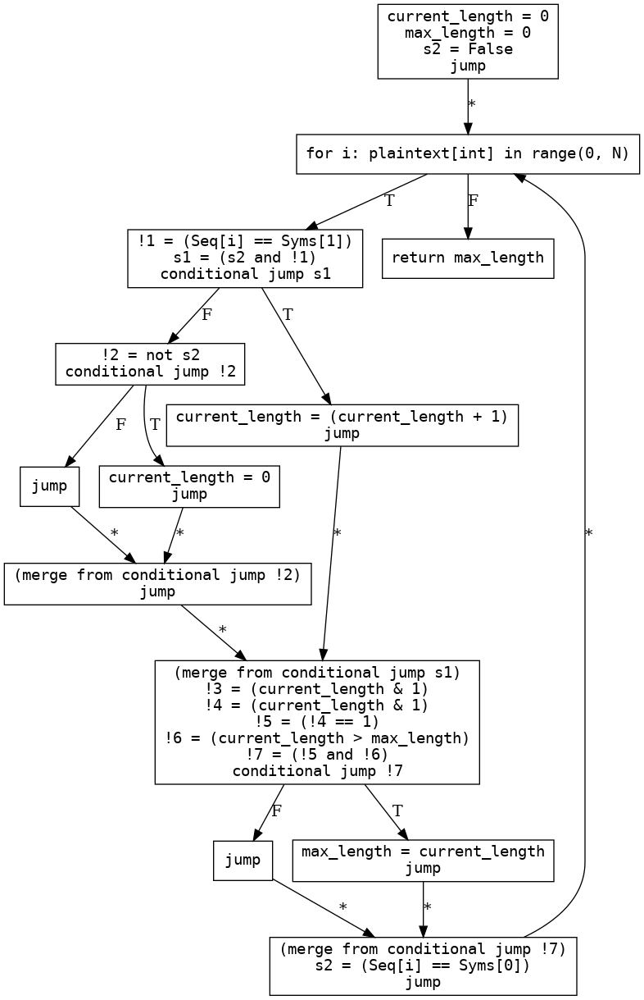
### SSA

### SSA ϕ→MUX

### Dead code elimination
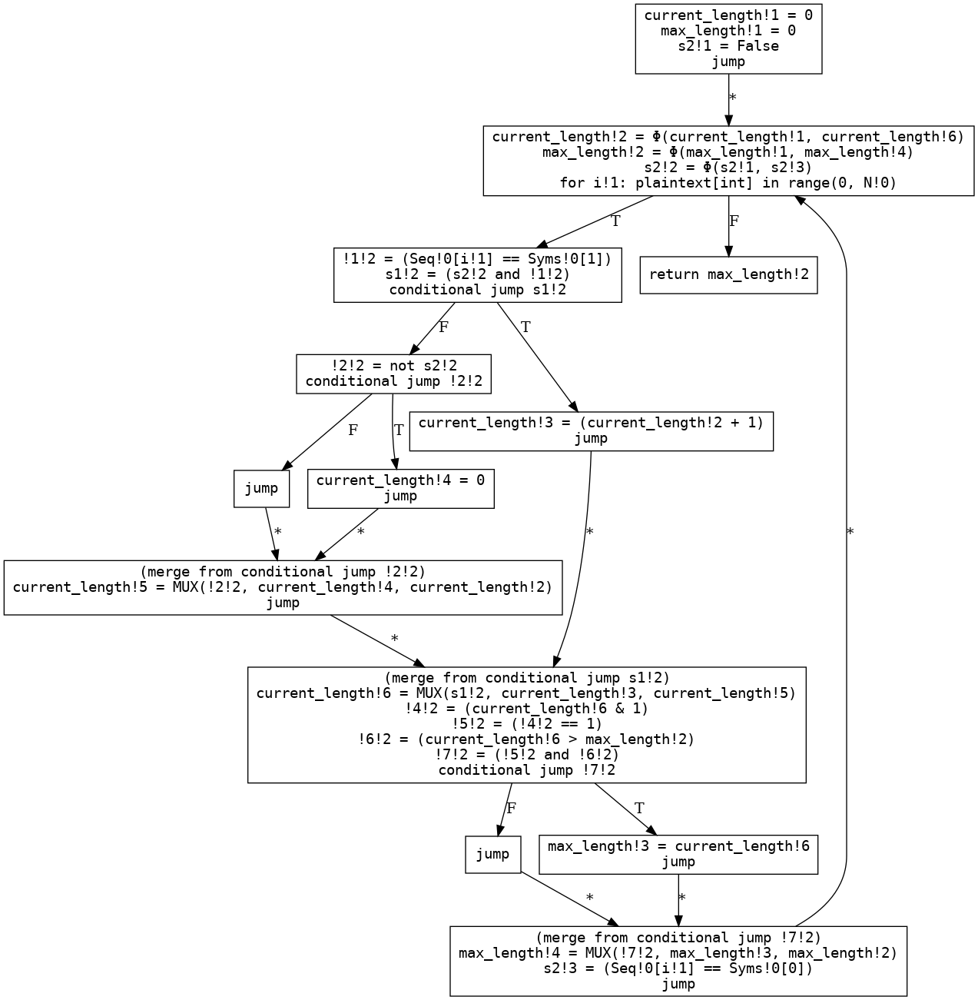
### Linear code with loops
```python
def longest_odd_10(Seq!0: shared[list[int]], N!0: plaintext[int], Syms!0: shared[list[int]]) -> shared[int]:
    current_length!1 = 0
    max_length!1 = 0
    s2!1 = False
    for i!1 in range(0, N!0):
        current_length!2 = Φ(current_length!1, current_length!6)
        max_length!2 = Φ(max_length!1, max_length!4)
        s2!2 = Φ(s2!1, s2!3)
        !1!2 = (Seq!0[i!1] == Syms!0[1])
        s1!2 = (s2!2 and !1!2)
        !2!2 = not s2!2
        current_length!4 = 0
        current_length!5 = MUX(!2!2, current_length!4, current_length!2)
        current_length!3 = (current_length!2 + 1)
        current_length!6 = MUX(s1!2, current_length!3, current_length!5)
        !4!2 = (current_length!6 & 1)
        !5!2 = (!4!2 == 1)
        !6!2 = (current_length!6 > max_length!2)
        !7!2 = (!5!2 and !6!2)
        max_length!3 = current_length!6
        max_length!4 = MUX(!7!2, max_length!3, max_length!2)
        s2!3 = (Seq!0[i!1] == Syms!0[0])
    return max_length!2
```
### Dependency graph
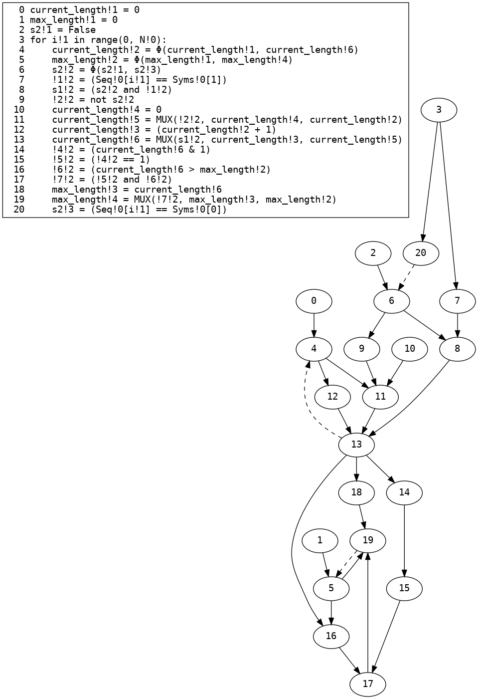
### Removal of infeasible edges
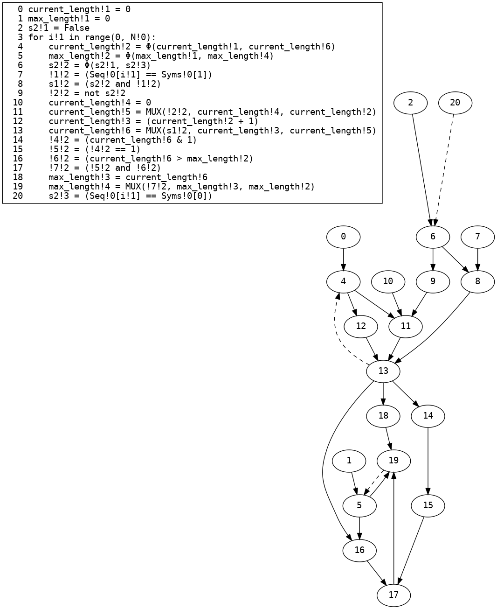
### Array MUX refinement
```python
def longest_odd_10(Seq!0: shared[list[int]], N!0: plaintext[int], Syms!0: shared[list[int]]) -> shared[int]:
    current_length!1 = 0
    max_length!1 = 0
    s2!1 = False
    for i!1 in range(0, N!0):
        current_length!2 = Φ(current_length!1, current_length!6)
        max_length!2 = Φ(max_length!1, max_length!4)
        s2!2 = Φ(s2!1, s2!3)
        !1!2 = (Seq!0[i!1] == Syms!0[1])
        s1!2 = (s2!2 and !1!2)
        !2!2 = not s2!2
        current_length!4 = 0
        current_length!5 = MUX(!2!2, current_length!4, current_length!2)
        current_length!3 = (current_length!2 + 1)
        current_length!6 = MUX(s1!2, current_length!3, current_length!5)
        !4!2 = (current_length!6 & 1)
        !5!2 = (!4!2 == 1)
        !6!2 = (current_length!6 > max_length!2)
        !7!2 = (!5!2 and !6!2)
        max_length!3 = current_length!6
        max_length!4 = MUX(!7!2, max_length!3, max_length!2)
        s2!3 = (Seq!0[i!1] == Syms!0[0])
    return max_length!2
```
### Array MUX refinement (dependence graph)

### Type environment
| Variable | Type |
| - | - |
| `Seq!0` | `shared[list[int]]` |
| `N!0` | `plaintext[int]` |
| `Syms!0` | `shared[list[int]]` |
| `i!1` | `plaintext[int]` |
| `s2!3` | `shared[bool]` |
| `s2!1` | `plaintext[bool]` |
| `s2!2` | `shared[bool]` |
| `!2!2` | `shared[bool]` |
| `current_length!2` | `shared[int]` |
| `current_length!4` | `plaintext[int]` |
| `current_length!5` | `shared[int]` |
| `s1!2` | `shared[bool]` |
| `current_length!3` | `shared[int]` |
| `current_length!6` | `shared[int]` |
| `max_length!3` | `shared[int]` |
| `!7!2` | `shared[bool]` |
| `max_length!2` | `shared[int]` |
| `max_length!4` | `shared[int]` |
| `max_length!1` | `plaintext[int]` |
| `!6!2` | `shared[bool]` |
| `!5!2` | `shared[bool]` |
| `!4!2` | `shared[int]` |
| `current_length!1` | `plaintext[int]` |
| `!1!2` | `shared[bool]` |
### Motion code
```cpp
template <encrypto::motion::MpcProtocol Protocol>
encrypto::motion::SecureUnsignedInteger longest_odd_10(
    encrypto::motion::PartyPointer &party,
    std::vector<encrypto::motion::SecureUnsignedInteger> Seq_0,
    std::uint32_t _MPC_PLAINTEXT_N_0,
    std::vector<encrypto::motion::SecureUnsignedInteger> Syms_0
) {
    // Shared variable declarations
    encrypto::motion::SecureUnsignedInteger N_0;
    encrypto::motion::SecureUnsignedInteger i_1;
    encrypto::motion::ShareWrapper s2_3;
    encrypto::motion::ShareWrapper s2_1;
    encrypto::motion::ShareWrapper s2_2;
    encrypto::motion::ShareWrapper _2_2;
    encrypto::motion::SecureUnsignedInteger current_length_2;
    encrypto::motion::SecureUnsignedInteger current_length_4;
    encrypto::motion::SecureUnsignedInteger current_length_5;
    encrypto::motion::ShareWrapper s1_2;
    encrypto::motion::SecureUnsignedInteger current_length_3;
    encrypto::motion::SecureUnsignedInteger current_length_6;
    encrypto::motion::SecureUnsignedInteger max_length_3;
    encrypto::motion::ShareWrapper _7_2;
    encrypto::motion::SecureUnsignedInteger max_length_2;
    encrypto::motion::SecureUnsignedInteger max_length_4;
    encrypto::motion::SecureUnsignedInteger max_length_1;
    encrypto::motion::ShareWrapper _6_2;
    encrypto::motion::ShareWrapper _5_2;
    encrypto::motion::SecureUnsignedInteger _4_2;
    encrypto::motion::SecureUnsignedInteger current_length_1;
    encrypto::motion::ShareWrapper _1_2;

    // Plaintext variable declarations
    std::uint32_t _MPC_PLAINTEXT_i_1;
    bool _MPC_PLAINTEXT_s2_1;
    std::uint32_t _MPC_PLAINTEXT_current_length_4;
    std::uint32_t _MPC_PLAINTEXT_max_length_1;
    std::uint32_t _MPC_PLAINTEXT_current_length_1;

    // Constant initializations
    encrypto::motion::ShareWrapper _MPC_CONSTANT_false = party->In<Protocol>(encrypto::motion::BitVector(1, false), 0);
    encrypto::motion::SecureUnsignedInteger _MPC_CONSTANT_0 = party->In<Protocol>(encrypto::motion::ToInput(std::uint32_t(0)), 0);
    encrypto::motion::SecureUnsignedInteger _MPC_CONSTANT_1 = party->In<Protocol>(encrypto::motion::ToInput(std::uint32_t(1)), 0);

    // Plaintext parameter assignments
    N_0 = party->In<Protocol>(encrypto::motion::ToInput(_MPC_PLAINTEXT_N_0), 0);

    // Function body
    current_length_1 = _MPC_CONSTANT_0;
    _MPC_PLAINTEXT_current_length_1 = std::uint32_t(0);
    max_length_1 = _MPC_CONSTANT_0;
    _MPC_PLAINTEXT_max_length_1 = std::uint32_t(0);
    s2_1 = _MPC_CONSTANT_false;
    _MPC_PLAINTEXT_s2_1 = false;

    // Initialize phi values
    current_length_2 = current_length_1;
    max_length_2 = max_length_1;
    s2_2 = s2_1;
    for (_MPC_PLAINTEXT_i_1 = std::uint32_t(0); _MPC_PLAINTEXT_i_1 < _MPC_PLAINTEXT_N_0; _MPC_PLAINTEXT_i_1++) {
        i_1 = party->In<Protocol>(encrypto::motion::ToInput(_MPC_PLAINTEXT_i_1), 0);
        _1_2 = (encrypto::motion::ShareWrapper(Seq_0[_MPC_PLAINTEXT_i_1].Get()) == encrypto::motion::ShareWrapper(Syms_0[std::uint32_t(1)].Get()));
        s1_2 = (encrypto::motion::ShareWrapper(s2_2.Get()) & encrypto::motion::ShareWrapper(_1_2.Get()));
        _2_2 = (~s2_2);
        current_length_4 = _MPC_CONSTANT_0;
        _MPC_PLAINTEXT_current_length_4 = std::uint32_t(0);
        current_length_5 = _2_2.Mux(current_length_4.Get(), current_length_2.Get());
        current_length_3 = (current_length_2 + _MPC_CONSTANT_1);
        current_length_6 = s1_2.Mux(current_length_3.Get(), current_length_5.Get());
        _4_2 = (encrypto::motion::ShareWrapper(current_length_6.Get()) & encrypto::motion::ShareWrapper(_MPC_CONSTANT_1.Get()));
        _5_2 = (encrypto::motion::ShareWrapper(_4_2.Get()) == encrypto::motion::ShareWrapper(_MPC_CONSTANT_1.Get()));
        _6_2 = (current_length_6 > max_length_2);
        _7_2 = (encrypto::motion::ShareWrapper(_5_2.Get()) & encrypto::motion::ShareWrapper(_6_2.Get()));
        max_length_3 = current_length_6;
        max_length_4 = _7_2.Mux(max_length_3.Get(), max_length_2.Get());
        s2_3 = (encrypto::motion::ShareWrapper(Seq_0[_MPC_PLAINTEXT_i_1].Get()) == encrypto::motion::ShareWrapper(Syms_0[std::uint32_t(0)].Get()));

        // Update phi values
        current_length_2 = current_length_6;
        max_length_2 = max_length_4;
        s2_2 = s2_3;
    }


    return max_length_2;
}
```
## `max_dist_between_syms`
### Input
```python
from UTIL import shared


def max_dist_between_syms(
    Seq: shared[list[int]], N: int, Sym: shared[int]
) -> shared[int]:
    max_dist = 0
    current_dist = 0
    for i in range(0, N):
        if not (Seq[i] == Sym):
            current_dist = current_dist + 1
        else:
            current_dist = 0

        if current_dist > max_dist:
            max_dist = current_dist
    return max_dist


seq = [1, 2, 1, 1, 2, 3, 4, 1]
print(max_dist_between_syms(seq, 8, 1))

```
### Restricted AST
```python
def max_dist_between_syms(Seq: shared[list[int]], N: plaintext[int], Sym: shared[int]) -> shared[int]:
    max_dist = 0
    current_dist = 0
    for i: plaintext[int] in range(0, N):
        if not (Seq[i] == Sym):
            current_dist = (current_dist + 1)
        else:
            current_dist = 0
        if (current_dist > max_dist):
            max_dist = current_dist
    return max_dist
```
### Three-address code CFG
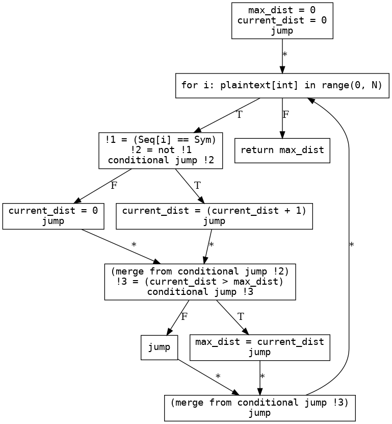
### SSA
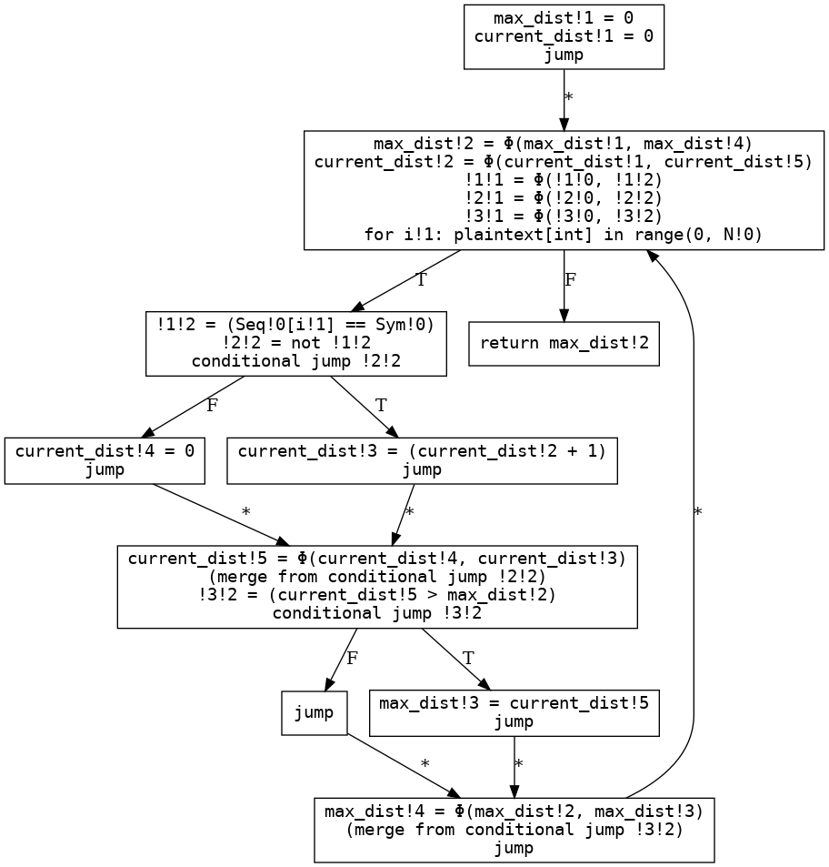
### SSA ϕ→MUX
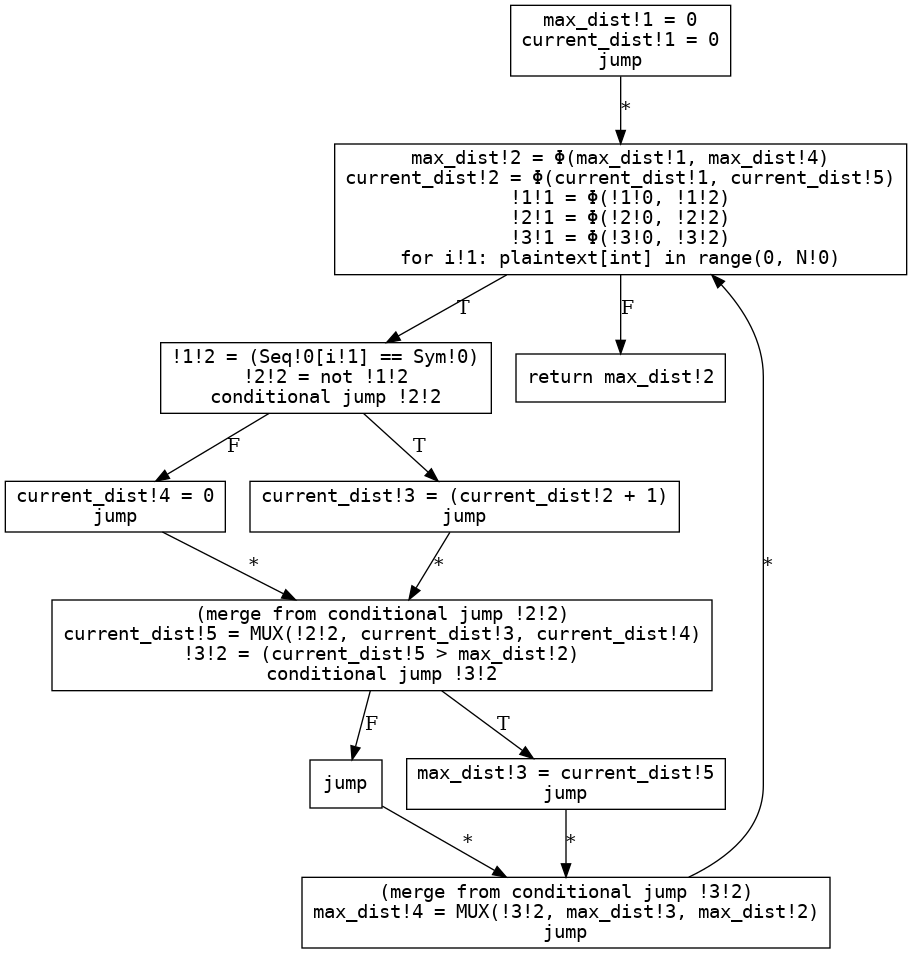
### Dead code elimination
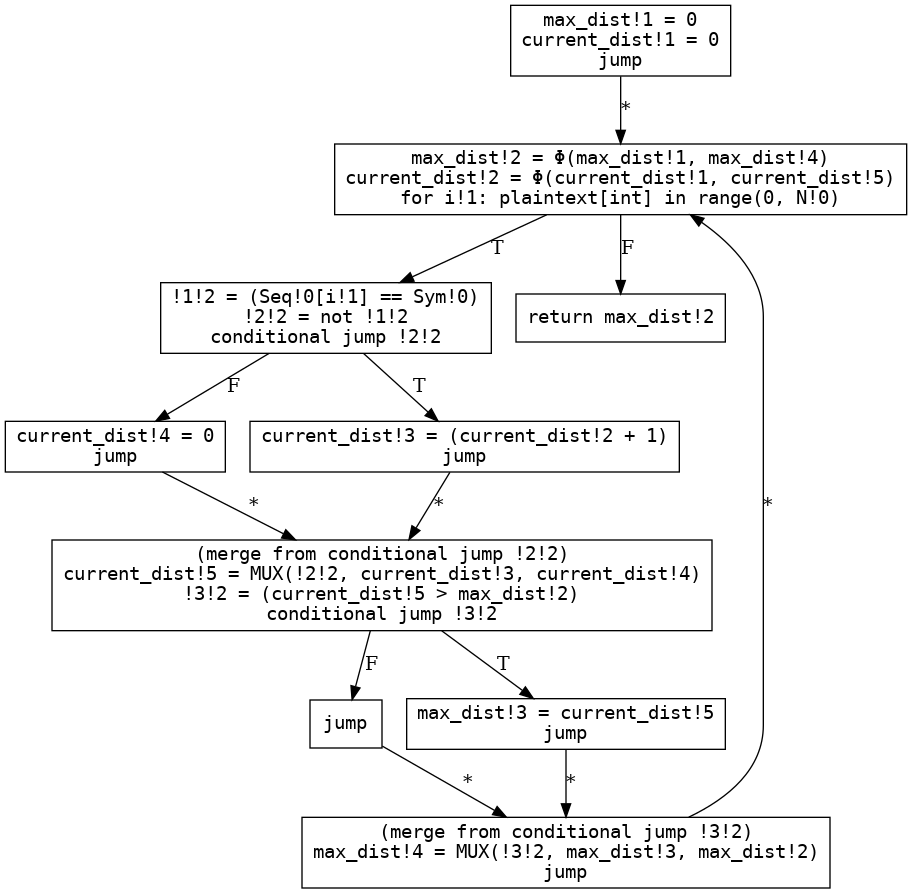
### Linear code with loops
```python
def max_dist_between_syms(Seq!0: shared[list[int]], N!0: plaintext[int], Sym!0: shared[int]) -> shared[int]:
    max_dist!1 = 0
    current_dist!1 = 0
    for i!1 in range(0, N!0):
        max_dist!2 = Φ(max_dist!1, max_dist!4)
        current_dist!2 = Φ(current_dist!1, current_dist!5)
        !1!2 = (Seq!0[i!1] == Sym!0)
        !2!2 = not !1!2
        current_dist!4 = 0
        current_dist!3 = (current_dist!2 + 1)
        current_dist!5 = MUX(!2!2, current_dist!3, current_dist!4)
        !3!2 = (current_dist!5 > max_dist!2)
        max_dist!3 = current_dist!5
        max_dist!4 = MUX(!3!2, max_dist!3, max_dist!2)
    return max_dist!2
```
### Dependency graph
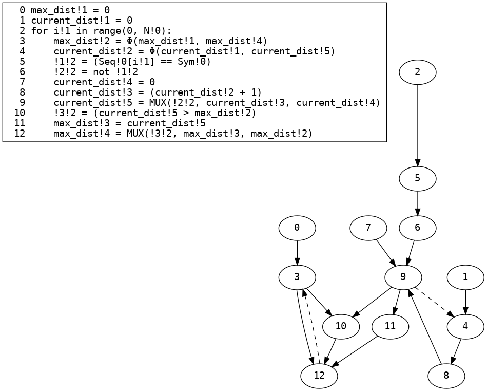
### Removal of infeasible edges
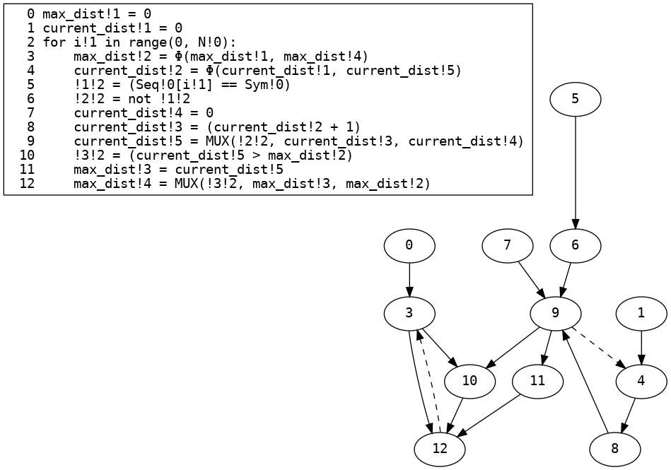
### Array MUX refinement
```python
def max_dist_between_syms(Seq!0: shared[list[int]], N!0: plaintext[int], Sym!0: shared[int]) -> shared[int]:
    max_dist!1 = 0
    current_dist!1 = 0
    for i!1 in range(0, N!0):
        max_dist!2 = Φ(max_dist!1, max_dist!4)
        current_dist!2 = Φ(current_dist!1, current_dist!5)
        !1!2 = (Seq!0[i!1] == Sym!0)
        !2!2 = not !1!2
        current_dist!4 = 0
        current_dist!3 = (current_dist!2 + 1)
        current_dist!5 = MUX(!2!2, current_dist!3, current_dist!4)
        !3!2 = (current_dist!5 > max_dist!2)
        max_dist!3 = current_dist!5
        max_dist!4 = MUX(!3!2, max_dist!3, max_dist!2)
    return max_dist!2
```
### Array MUX refinement (dependence graph)

### Type environment
| Variable | Type |
| - | - |
| `Seq!0` | `shared[list[int]]` |
| `N!0` | `plaintext[int]` |
| `Sym!0` | `shared[int]` |
| `i!1` | `plaintext[int]` |
| `!3!2` | `shared[bool]` |
| `max_dist!2` | `shared[int]` |
| `max_dist!3` | `shared[int]` |
| `max_dist!4` | `shared[int]` |
| `max_dist!1` | `plaintext[int]` |
| `current_dist!5` | `shared[int]` |
| `!2!2` | `shared[bool]` |
| `current_dist!4` | `plaintext[int]` |
| `current_dist!3` | `shared[int]` |
| `current_dist!1` | `plaintext[int]` |
| `current_dist!2` | `shared[int]` |
| `!1!2` | `shared[bool]` |
### Motion code
```cpp
template <encrypto::motion::MpcProtocol Protocol>
encrypto::motion::SecureUnsignedInteger max_dist_between_syms(
    encrypto::motion::PartyPointer &party,
    std::vector<encrypto::motion::SecureUnsignedInteger> Seq_0,
    std::uint32_t _MPC_PLAINTEXT_N_0,
    encrypto::motion::SecureUnsignedInteger Sym_0
) {
    // Shared variable declarations
    encrypto::motion::SecureUnsignedInteger N_0;
    encrypto::motion::SecureUnsignedInteger i_1;
    encrypto::motion::ShareWrapper _3_2;
    encrypto::motion::SecureUnsignedInteger max_dist_2;
    encrypto::motion::SecureUnsignedInteger max_dist_3;
    encrypto::motion::SecureUnsignedInteger max_dist_4;
    encrypto::motion::SecureUnsignedInteger max_dist_1;
    encrypto::motion::SecureUnsignedInteger current_dist_5;
    encrypto::motion::ShareWrapper _2_2;
    encrypto::motion::SecureUnsignedInteger current_dist_4;
    encrypto::motion::SecureUnsignedInteger current_dist_3;
    encrypto::motion::SecureUnsignedInteger current_dist_1;
    encrypto::motion::SecureUnsignedInteger current_dist_2;
    encrypto::motion::ShareWrapper _1_2;

    // Plaintext variable declarations
    std::uint32_t _MPC_PLAINTEXT_i_1;
    std::uint32_t _MPC_PLAINTEXT_max_dist_1;
    std::uint32_t _MPC_PLAINTEXT_current_dist_4;
    std::uint32_t _MPC_PLAINTEXT_current_dist_1;

    // Constant initializations
    encrypto::motion::SecureUnsignedInteger _MPC_CONSTANT_0 = party->In<Protocol>(encrypto::motion::ToInput(std::uint32_t(0)), 0);
    encrypto::motion::SecureUnsignedInteger _MPC_CONSTANT_1 = party->In<Protocol>(encrypto::motion::ToInput(std::uint32_t(1)), 0);

    // Plaintext parameter assignments
    N_0 = party->In<Protocol>(encrypto::motion::ToInput(_MPC_PLAINTEXT_N_0), 0);

    // Function body
    max_dist_1 = _MPC_CONSTANT_0;
    _MPC_PLAINTEXT_max_dist_1 = std::uint32_t(0);
    current_dist_1 = _MPC_CONSTANT_0;
    _MPC_PLAINTEXT_current_dist_1 = std::uint32_t(0);

    // Initialize phi values
    max_dist_2 = max_dist_1;
    current_dist_2 = current_dist_1;
    for (_MPC_PLAINTEXT_i_1 = std::uint32_t(0); _MPC_PLAINTEXT_i_1 < _MPC_PLAINTEXT_N_0; _MPC_PLAINTEXT_i_1++) {
        i_1 = party->In<Protocol>(encrypto::motion::ToInput(_MPC_PLAINTEXT_i_1), 0);
        _1_2 = (encrypto::motion::ShareWrapper(Seq_0[_MPC_PLAINTEXT_i_1].Get()) == encrypto::motion::ShareWrapper(Sym_0.Get()));
        _2_2 = (~_1_2);
        current_dist_4 = _MPC_CONSTANT_0;
        _MPC_PLAINTEXT_current_dist_4 = std::uint32_t(0);
        current_dist_3 = (current_dist_2 + _MPC_CONSTANT_1);
        current_dist_5 = _2_2.Mux(current_dist_3.Get(), current_dist_4.Get());
        _3_2 = (current_dist_5 > max_dist_2);
        max_dist_3 = current_dist_5;
        max_dist_4 = _3_2.Mux(max_dist_3.Get(), max_dist_2.Get());

        // Update phi values
        max_dist_2 = max_dist_4;
        current_dist_2 = current_dist_5;
    }


    return max_dist_2;
}
```
## `max_sum_between_syms`
### Input
```python
from UTIL import shared


def max_sum_between_syms(
    Seq: shared[list[int]], N: int, Sym: shared[int]
) -> shared[int]:
    max_sum = 0
    current_sum = 0
    for i in range(0, N):
        if not (Seq[i] == Sym):
            current_sum = current_sum + Seq[i]
        else:
            current_sum = 0

        if current_sum > max_sum:
            max_sum = current_sum
    return max_sum


seq = [1, 2, 1, 1, 2, 3, 4, 1]
print(max_sum_between_syms(seq, 8, 1))

```
### Restricted AST
```python
def max_sum_between_syms(Seq: shared[list[int]], N: plaintext[int], Sym: shared[int]) -> shared[int]:
    max_sum = 0
    current_sum = 0
    for i: plaintext[int] in range(0, N):
        if not (Seq[i] == Sym):
            current_sum = (current_sum + Seq[i])
        else:
            current_sum = 0
        if (current_sum > max_sum):
            max_sum = current_sum
    return max_sum
```
### Three-address code CFG
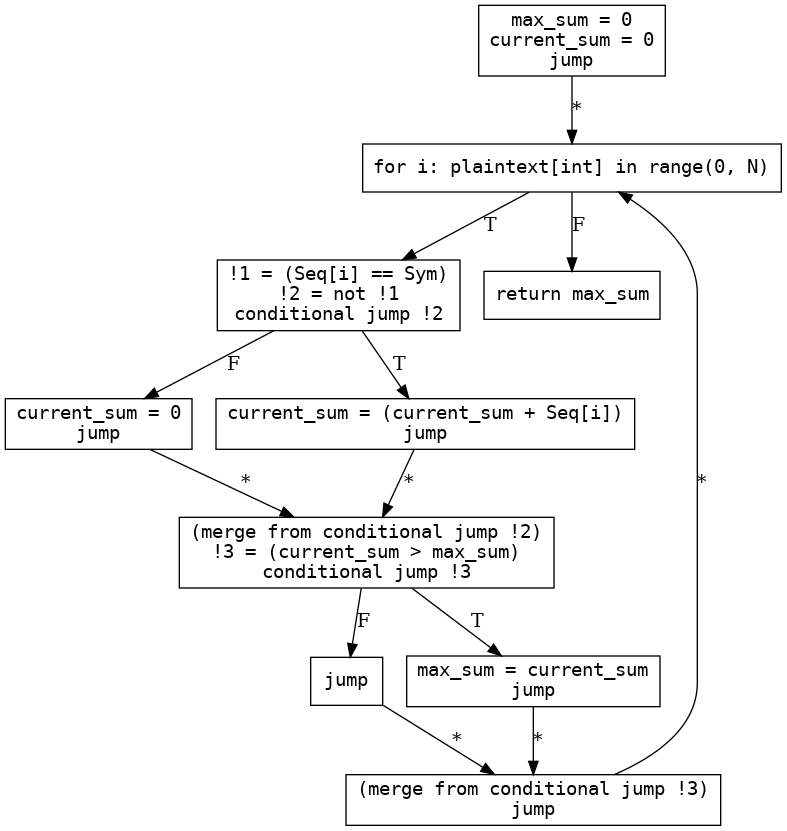
### SSA
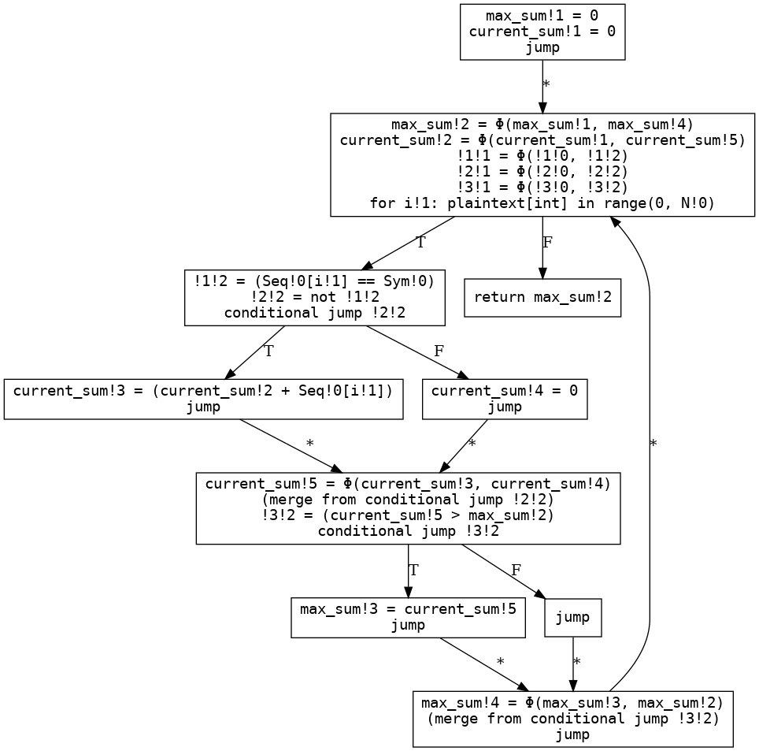
### SSA ϕ→MUX
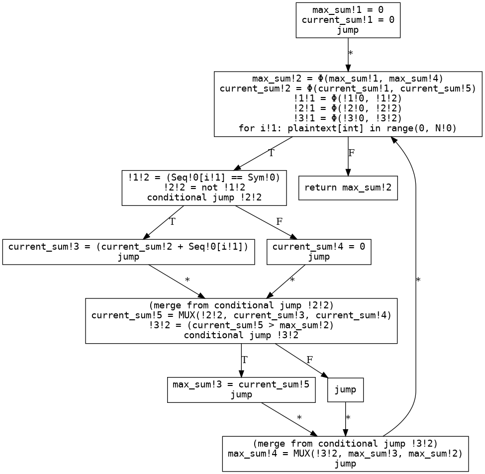
### Dead code elimination
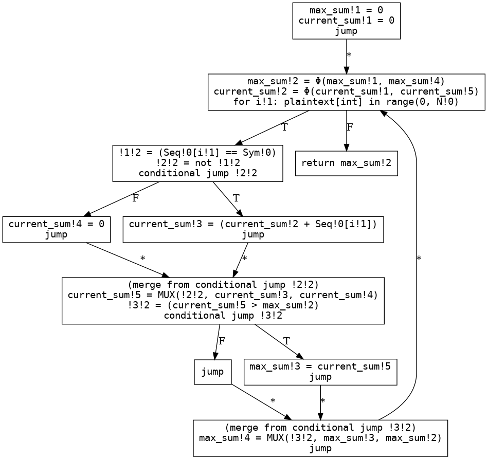
### Linear code with loops
```python
def max_sum_between_syms(Seq!0: shared[list[int]], N!0: plaintext[int], Sym!0: shared[int]) -> shared[int]:
    max_sum!1 = 0
    current_sum!1 = 0
    for i!1 in range(0, N!0):
        max_sum!2 = Φ(max_sum!1, max_sum!4)
        current_sum!2 = Φ(current_sum!1, current_sum!5)
        !1!2 = (Seq!0[i!1] == Sym!0)
        !2!2 = not !1!2
        current_sum!4 = 0
        current_sum!3 = (current_sum!2 + Seq!0[i!1])
        current_sum!5 = MUX(!2!2, current_sum!3, current_sum!4)
        !3!2 = (current_sum!5 > max_sum!2)
        max_sum!3 = current_sum!5
        max_sum!4 = MUX(!3!2, max_sum!3, max_sum!2)
    return max_sum!2
```
### Dependency graph
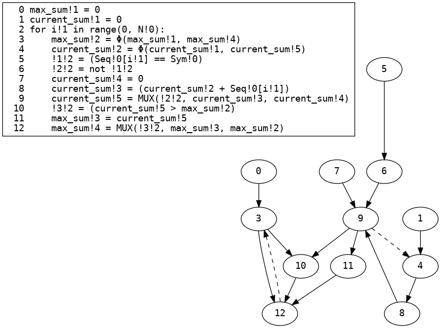
### Removal of infeasible edges
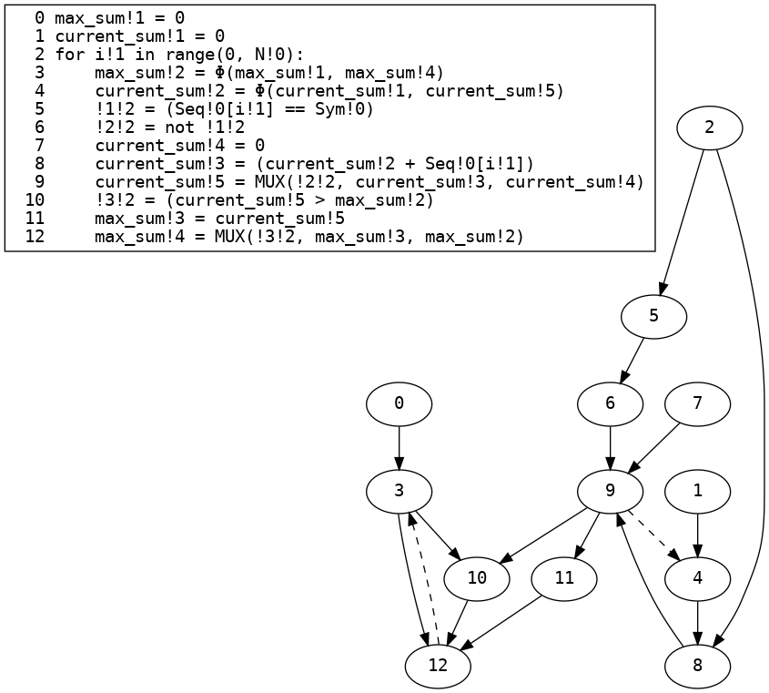
### Array MUX refinement
```python
def max_sum_between_syms(Seq!0: shared[list[int]], N!0: plaintext[int], Sym!0: shared[int]) -> shared[int]:
    max_sum!1 = 0
    current_sum!1 = 0
    for i!1 in range(0, N!0):
        max_sum!2 = Φ(max_sum!1, max_sum!4)
        current_sum!2 = Φ(current_sum!1, current_sum!5)
        !1!2 = (Seq!0[i!1] == Sym!0)
        !2!2 = not !1!2
        current_sum!4 = 0
        current_sum!3 = (current_sum!2 + Seq!0[i!1])
        current_sum!5 = MUX(!2!2, current_sum!3, current_sum!4)
        !3!2 = (current_sum!5 > max_sum!2)
        max_sum!3 = current_sum!5
        max_sum!4 = MUX(!3!2, max_sum!3, max_sum!2)
    return max_sum!2
```
### Array MUX refinement (dependence graph)
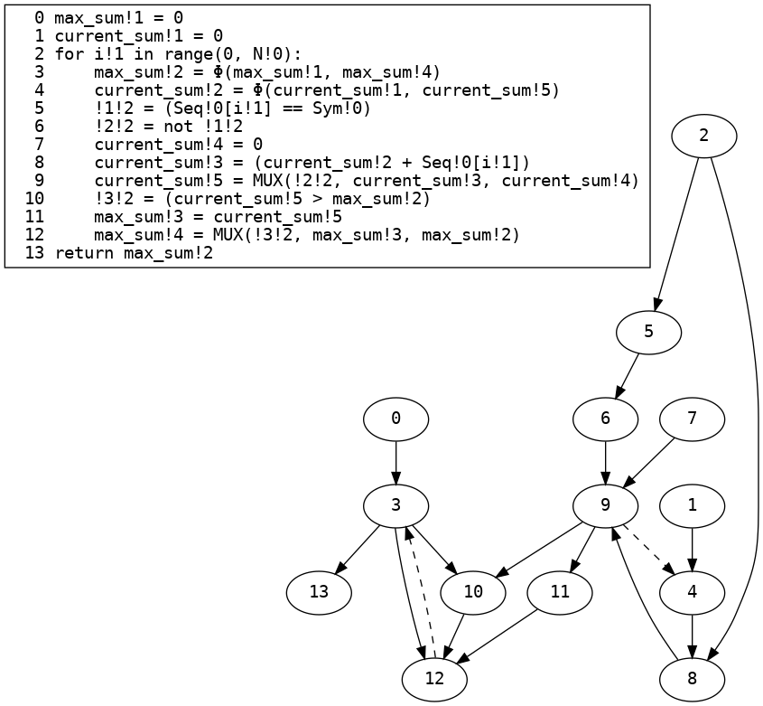
### Type environment
| Variable | Type |
| - | - |
| `Seq!0` | `shared[list[int]]` |
| `N!0` | `plaintext[int]` |
| `Sym!0` | `shared[int]` |
| `i!1` | `plaintext[int]` |
| `!3!2` | `shared[bool]` |
| `max_sum!2` | `shared[int]` |
| `max_sum!3` | `shared[int]` |
| `max_sum!4` | `shared[int]` |
| `max_sum!1` | `plaintext[int]` |
| `current_sum!5` | `shared[int]` |
| `!2!2` | `shared[bool]` |
| `current_sum!4` | `plaintext[int]` |
| `current_sum!3` | `shared[int]` |
| `current_sum!1` | `plaintext[int]` |
| `current_sum!2` | `shared[int]` |
| `!1!2` | `shared[bool]` |
### Motion code
```cpp
template <encrypto::motion::MpcProtocol Protocol>
encrypto::motion::SecureUnsignedInteger max_sum_between_syms(
    encrypto::motion::PartyPointer &party,
    std::vector<encrypto::motion::SecureUnsignedInteger> Seq_0,
    std::uint32_t _MPC_PLAINTEXT_N_0,
    encrypto::motion::SecureUnsignedInteger Sym_0
) {
    // Shared variable declarations
    encrypto::motion::SecureUnsignedInteger N_0;
    encrypto::motion::SecureUnsignedInteger i_1;
    encrypto::motion::ShareWrapper _3_2;
    encrypto::motion::SecureUnsignedInteger max_sum_2;
    encrypto::motion::SecureUnsignedInteger max_sum_3;
    encrypto::motion::SecureUnsignedInteger max_sum_4;
    encrypto::motion::SecureUnsignedInteger max_sum_1;
    encrypto::motion::SecureUnsignedInteger current_sum_5;
    encrypto::motion::ShareWrapper _2_2;
    encrypto::motion::SecureUnsignedInteger current_sum_4;
    encrypto::motion::SecureUnsignedInteger current_sum_3;
    encrypto::motion::SecureUnsignedInteger current_sum_1;
    encrypto::motion::SecureUnsignedInteger current_sum_2;
    encrypto::motion::ShareWrapper _1_2;

    // Plaintext variable declarations
    std::uint32_t _MPC_PLAINTEXT_i_1;
    std::uint32_t _MPC_PLAINTEXT_max_sum_1;
    std::uint32_t _MPC_PLAINTEXT_current_sum_4;
    std::uint32_t _MPC_PLAINTEXT_current_sum_1;

    // Constant initializations
    encrypto::motion::SecureUnsignedInteger _MPC_CONSTANT_0 = party->In<Protocol>(encrypto::motion::ToInput(std::uint32_t(0)), 0);

    // Plaintext parameter assignments
    N_0 = party->In<Protocol>(encrypto::motion::ToInput(_MPC_PLAINTEXT_N_0), 0);

    // Function body
    max_sum_1 = _MPC_CONSTANT_0;
    _MPC_PLAINTEXT_max_sum_1 = std::uint32_t(0);
    current_sum_1 = _MPC_CONSTANT_0;
    _MPC_PLAINTEXT_current_sum_1 = std::uint32_t(0);

    // Initialize phi values
    max_sum_2 = max_sum_1;
    current_sum_2 = current_sum_1;
    for (_MPC_PLAINTEXT_i_1 = std::uint32_t(0); _MPC_PLAINTEXT_i_1 < _MPC_PLAINTEXT_N_0; _MPC_PLAINTEXT_i_1++) {
        i_1 = party->In<Protocol>(encrypto::motion::ToInput(_MPC_PLAINTEXT_i_1), 0);
        _1_2 = (encrypto::motion::ShareWrapper(Seq_0[_MPC_PLAINTEXT_i_1].Get()) == encrypto::motion::ShareWrapper(Sym_0.Get()));
        _2_2 = (~_1_2);
        current_sum_4 = _MPC_CONSTANT_0;
        _MPC_PLAINTEXT_current_sum_4 = std::uint32_t(0);
        current_sum_3 = (current_sum_2 + Seq_0[_MPC_PLAINTEXT_i_1]);
        current_sum_5 = _2_2.Mux(current_sum_3.Get(), current_sum_4.Get());
        _3_2 = (current_sum_5 > max_sum_2);
        max_sum_3 = current_sum_5;
        max_sum_4 = _3_2.Mux(max_sum_3.Get(), max_sum_2.Get());

        // Update phi values
        max_sum_2 = max_sum_4;
        current_sum_2 = current_sum_5;
    }


    return max_sum_2;
}
```
## `minimal_points`
### Input
```python
from UTIL import shared


def minimal_points(
    X_coords: shared[list[int]], Y_coords: shared[list[int]], N: int
) -> tuple[shared[list[int]], shared[list[int]]]:
    min_X: list[int] = []
    min_Y: list[int] = []

    for i in range(0, N):
        bx = False
        for j in range(0, N):
            bx = bx or (X_coords[j] < X_coords[i] and Y_coords[j] < Y_coords[i])
        if not bx:
            min_X = min_X + [X_coords[i]]
            min_Y = min_Y + [Y_coords[i]]

    return (min_X, min_Y)


X_coords = [1, 2, 3]
Y_coords = [4, 5, 6]
print(minimal_points(X_coords, Y_coords, 3))

```
### Restricted AST
```python
def minimal_points(X_coords: shared[list[int]], Y_coords: shared[list[int]], N: plaintext[int]) -> tuple[shared[list[int]], shared[list[int]]]:
    min_X = []
    min_Y = []
    for i: plaintext[int] in range(0, N):
        bx = False
        for j: plaintext[int] in range(0, N):
            bx = (bx or ((X_coords[j] < X_coords[i]) and (Y_coords[j] < Y_coords[i])))
        if not bx:
            min_X = (min_X + [X_coords[i]])
            min_Y = (min_Y + [Y_coords[i]])
    return (min_X, min_Y)
```
### Three-address code CFG
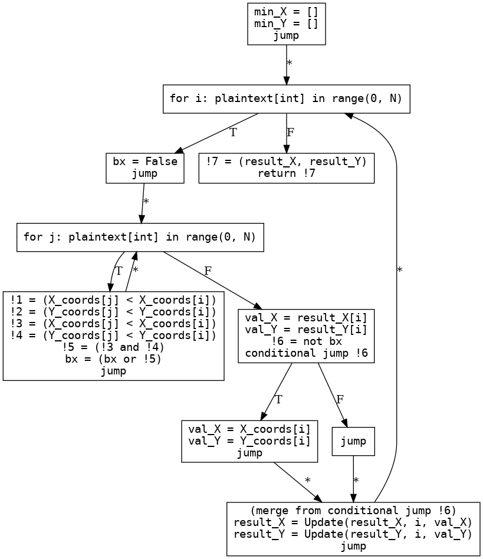
### SSA
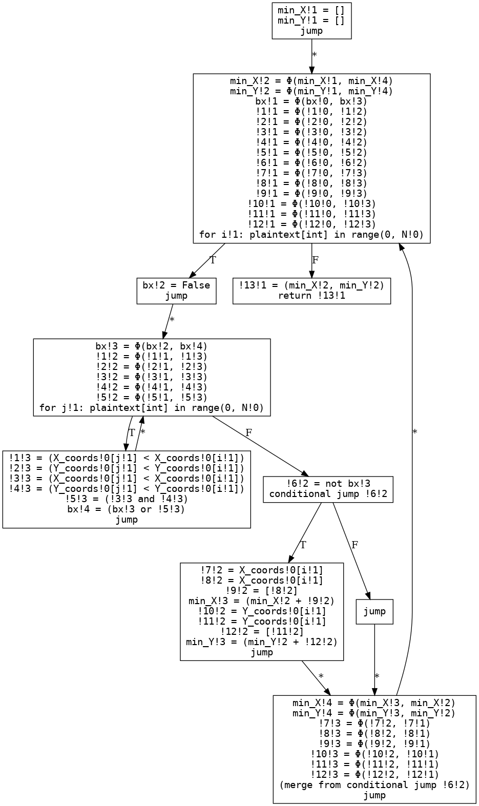
### SSA ϕ→MUX
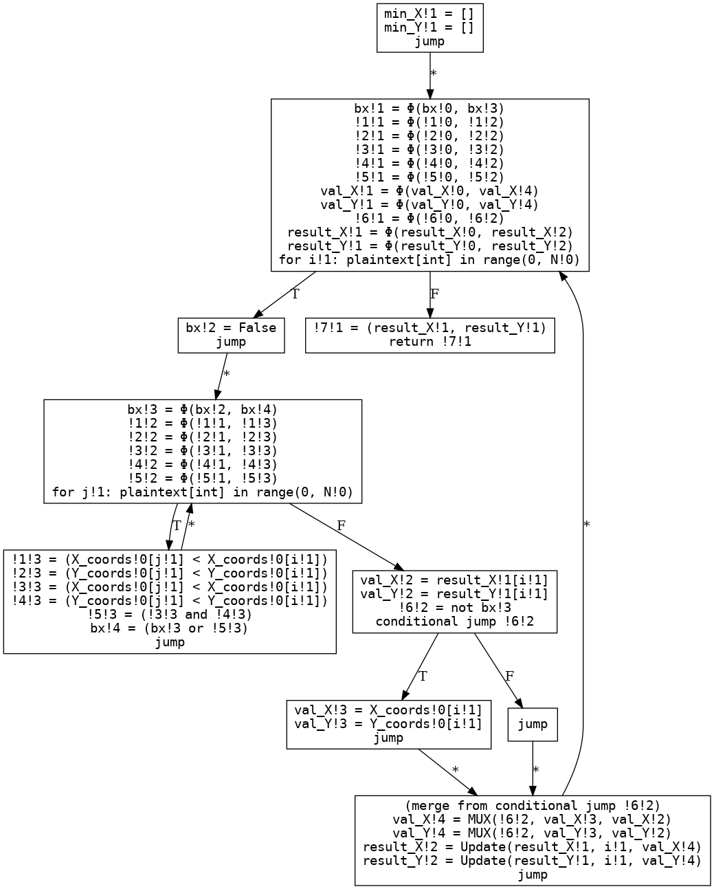
### Dead code elimination
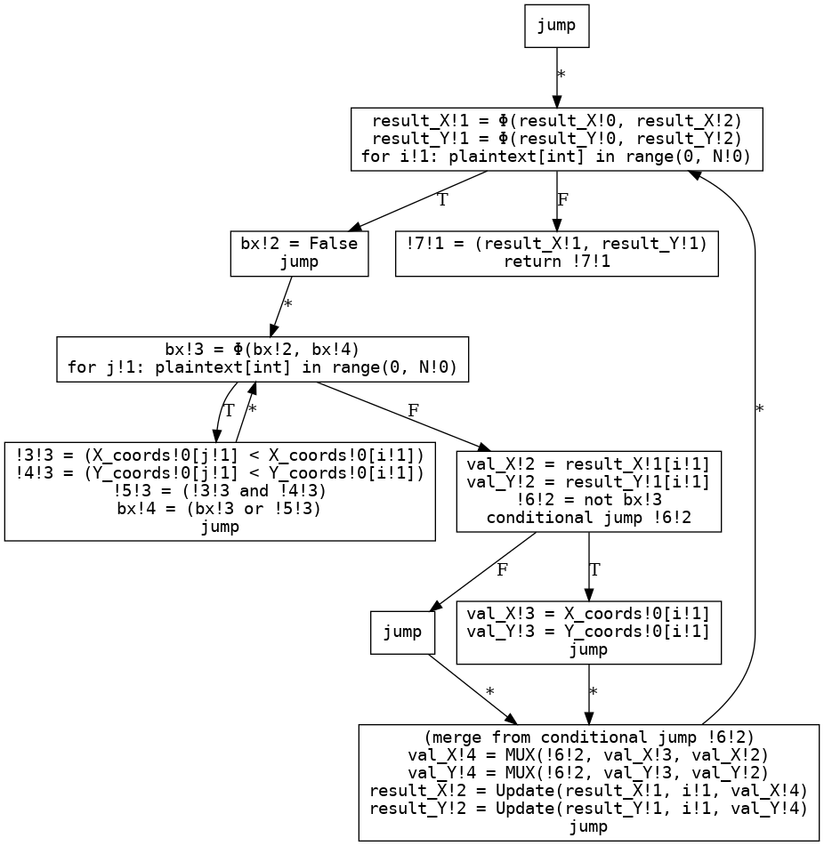
### Linear code with loops
```python
def minimal_points(X_coords!0: shared[list[int]], Y_coords!0: shared[list[int]], N!0: plaintext[int]) -> tuple[shared[list[int]], shared[list[int]]]:
    min_X!1 = []
    min_Y!1 = []
    for i!1 in range(0, N!0):
        min_X!2 = Φ(min_X!1, min_X!4)
        min_Y!2 = Φ(min_Y!1, min_Y!4)
        bx!2 = False
        for j!1 in range(0, N!0):
            bx!3 = Φ(bx!2, bx!4)
            !3!3 = (X_coords!0[j!1] < X_coords!0[i!1])
            !4!3 = (Y_coords!0[j!1] < Y_coords!0[i!1])
            !5!3 = (!3!3 and !4!3)
            bx!4 = (bx!3 or !5!3)
        !6!2 = not bx!3
        !8!2 = X_coords!0[i!1]
        !9!2 = [!8!2]
        min_X!3 = (min_X!2 + !9!2)
        !11!2 = Y_coords!0[i!1]
        !12!2 = [!11!2]
        min_Y!3 = (min_Y!2 + !12!2)
        min_X!4 = MUX(!6!2, min_X!3, min_X!2)
        min_Y!4 = MUX(!6!2, min_Y!3, min_Y!2)
    !13!1 = (min_X!2, min_Y!2)
    return !13!1
```
### Dependency graph
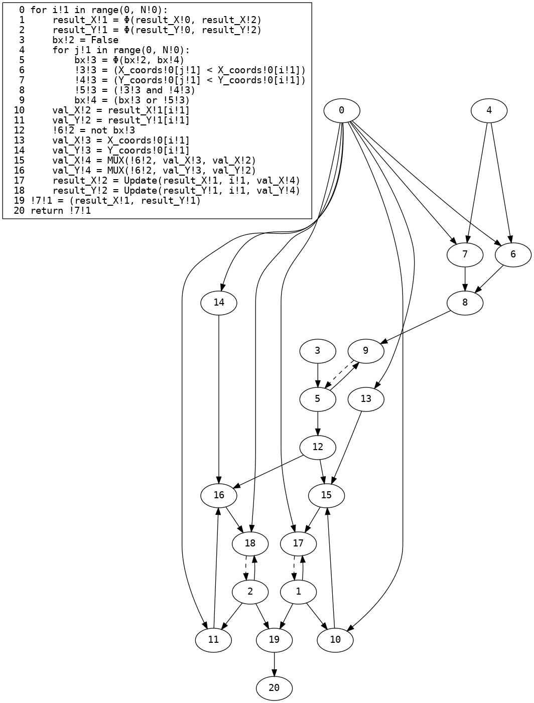
### Removal of infeasible edges
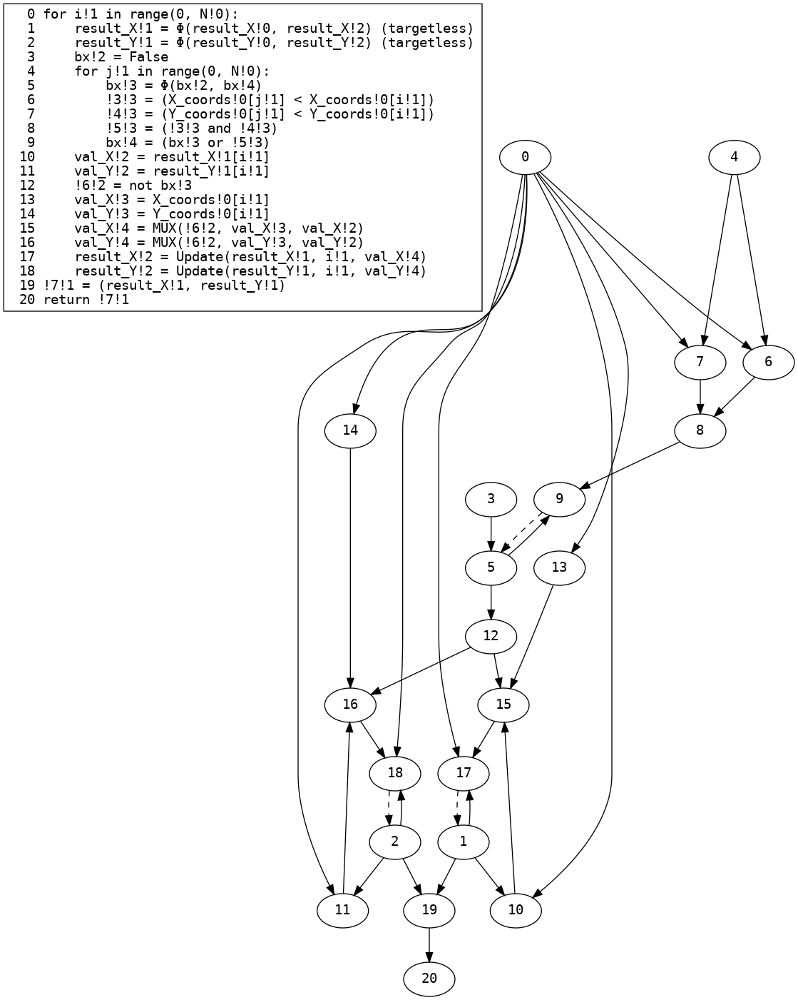
### Array MUX refinement
```python
def minimal_points(X_coords!0: shared[list[int]], Y_coords!0: shared[list[int]], N!0: plaintext[int]) -> tuple[shared[list[int]], shared[list[int]]]:
    min_X!1 = []
    min_Y!1 = []
    for i!1 in range(0, N!0):
        min_X!2 = Φ(min_X!1, min_X!4)
        min_Y!2 = Φ(min_Y!1, min_Y!4)
        bx!2 = False
        for j!1 in range(0, N!0):
            bx!3 = Φ(bx!2, bx!4)
            !3!3 = (X_coords!0[j!1] < X_coords!0[i!1])
            !4!3 = (Y_coords!0[j!1] < Y_coords!0[i!1])
            !5!3 = (!3!3 and !4!3)
            bx!4 = (bx!3 or !5!3)
        !6!2 = not bx!3
        !8!2 = X_coords!0[i!1]
        !9!2 = [!8!2]
        min_X!3 = (min_X!2 + !9!2)
        !11!2 = Y_coords!0[i!1]
        !12!2 = [!11!2]
        min_Y!3 = (min_Y!2 + !12!2)
        min_X!4 = MUX(!6!2, min_X!3, min_X!2)
        min_Y!4 = MUX(!6!2, min_Y!3, min_Y!2)
    !13!1 = (min_X!2, min_Y!2)
    return !13!1
```
### Array MUX refinement (dependence graph)
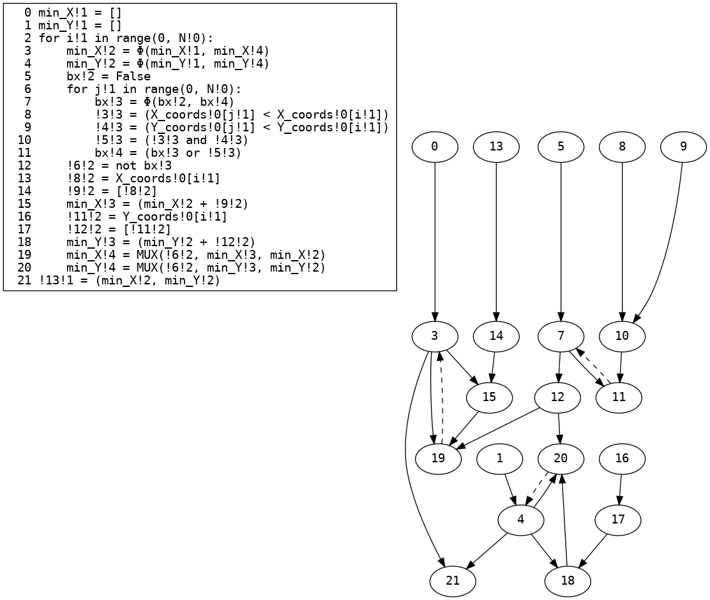
### Type environment
| Variable | Type |
| - | - |
| `X_coords!0` | `shared[list[int]]` |
| `Y_coords!0` | `shared[list[int]]` |
| `N!0` | `plaintext[int]` |
| `i!1` | `plaintext[int]` |
| `j!1` | `plaintext[int]` |
| `min_X!2` | `shared[list[int]]` |
| `min_Y!2` | `shared[list[int]]` |
| `!13!1` | `tuple[shared[list[int]], shared[list[int]]]` |
| `!6!2` | `shared[bool]` |
| `min_Y!3` | `shared[list[int]]` |
| `min_Y!4` | `shared[list[int]]` |
| `min_Y!1` | `plaintext[list[int]]` |
| `!12!2` | `shared[list[int]]` |
| `min_X!3` | `shared[list[int]]` |
| `min_X!4` | `shared[list[int]]` |
| `min_X!1` | `plaintext[list[int]]` |
| `!9!2` | `shared[list[int]]` |
| `!11!2` | `shared[int]` |
| `!8!2` | `shared[int]` |
| `bx!3` | `shared[bool]` |
| `!5!3` | `shared[bool]` |
| `bx!4` | `shared[bool]` |
| `bx!2` | `plaintext[bool]` |
| `!3!3` | `shared[bool]` |
| `!4!3` | `shared[bool]` |
### Motion code
```cpp
template <encrypto::motion::MpcProtocol Protocol>
std::tuple<std::vector<encrypto::motion::SecureUnsignedInteger>, std::vector<encrypto::motion::SecureUnsignedInteger>> minimal_points(
    encrypto::motion::PartyPointer &party,
    std::vector<encrypto::motion::SecureUnsignedInteger> X_coords_0,
    std::vector<encrypto::motion::SecureUnsignedInteger> Y_coords_0,
    std::uint32_t _MPC_PLAINTEXT_N_0
) {
    // Shared variable declarations
    encrypto::motion::SecureUnsignedInteger N_0;
    encrypto::motion::SecureUnsignedInteger i_1;
    encrypto::motion::SecureUnsignedInteger j_1;
    std::vector<encrypto::motion::SecureUnsignedInteger> min_X_2;
    std::vector<encrypto::motion::SecureUnsignedInteger> min_Y_2;
    std::tuple<std::vector<encrypto::motion::SecureUnsignedInteger>, std::vector<encrypto::motion::SecureUnsignedInteger>> _13_1;
    encrypto::motion::ShareWrapper _6_2;
    std::vector<encrypto::motion::SecureUnsignedInteger> min_Y_3;
    std::vector<encrypto::motion::SecureUnsignedInteger> min_Y_4;
    std::vector<encrypto::motion::SecureUnsignedInteger> min_Y_1;
    std::vector<encrypto::motion::SecureUnsignedInteger> _12_2;
    std::vector<encrypto::motion::SecureUnsignedInteger> min_X_3;
    std::vector<encrypto::motion::SecureUnsignedInteger> min_X_4;
    std::vector<encrypto::motion::SecureUnsignedInteger> min_X_1;
    std::vector<encrypto::motion::SecureUnsignedInteger> _9_2;
    encrypto::motion::SecureUnsignedInteger _11_2;
    encrypto::motion::SecureUnsignedInteger _8_2;
    encrypto::motion::ShareWrapper bx_3;
    encrypto::motion::ShareWrapper _5_3;
    encrypto::motion::ShareWrapper bx_4;
    encrypto::motion::ShareWrapper bx_2;
    encrypto::motion::ShareWrapper _3_3;
    encrypto::motion::ShareWrapper _4_3;

    // Plaintext variable declarations
    std::uint32_t _MPC_PLAINTEXT_i_1;
    std::uint32_t _MPC_PLAINTEXT_j_1;
    std::tuple<std::vector<std::uint32_t>, std::vector<std::uint32_t>> _MPC_PLAINTEXT__13_1;
    std::vector<std::uint32_t> _MPC_PLAINTEXT_min_Y_1;
    std::vector<std::uint32_t> _MPC_PLAINTEXT_min_X_1;
    bool _MPC_PLAINTEXT_bx_2;

    // Constant initializations
    encrypto::motion::ShareWrapper _MPC_CONSTANT_false = party->In<Protocol>(encrypto::motion::BitVector(1, false), 0);

    // Plaintext parameter assignments
    N_0 = party->In<Protocol>(encrypto::motion::ToInput(_MPC_PLAINTEXT_N_0), 0);

    // Function body
    min_X_1 = {};
    _MPC_PLAINTEXT_min_X_1 = {};
    min_Y_1 = {};
    _MPC_PLAINTEXT_min_Y_1 = {};

    // Initialize phi values
    min_X_2 = min_X_1;
    min_Y_2 = min_Y_1;
    for (_MPC_PLAINTEXT_i_1 = std::uint32_t(0); _MPC_PLAINTEXT_i_1 < _MPC_PLAINTEXT_N_0; _MPC_PLAINTEXT_i_1++) {
        i_1 = party->In<Protocol>(encrypto::motion::ToInput(_MPC_PLAINTEXT_i_1), 0);
        bx_2 = _MPC_CONSTANT_false;
        _MPC_PLAINTEXT_bx_2 = false;

        // Initialize phi values
        bx_3 = bx_2;
        for (_MPC_PLAINTEXT_j_1 = std::uint32_t(0); _MPC_PLAINTEXT_j_1 < _MPC_PLAINTEXT_N_0; _MPC_PLAINTEXT_j_1++) {
            j_1 = party->In<Protocol>(encrypto::motion::ToInput(_MPC_PLAINTEXT_j_1), 0);
            _3_3 = (X_coords_0[_MPC_PLAINTEXT_i_1] > X_coords_0[_MPC_PLAINTEXT_j_1]);
            _4_3 = (Y_coords_0[_MPC_PLAINTEXT_i_1] > Y_coords_0[_MPC_PLAINTEXT_j_1]);
            _5_3 = (encrypto::motion::ShareWrapper(_3_3.Get()) & encrypto::motion::ShareWrapper(_4_3.Get()));
            bx_4 = (encrypto::motion::ShareWrapper(bx_3.Get()) | encrypto::motion::ShareWrapper(_5_3.Get()));

            // Update phi values
            bx_3 = bx_4;
        }

        _6_2 = (~bx_3);
        _8_2 = X_coords_0[_MPC_PLAINTEXT_i_1];
        _9_2 = {_8_2};
        min_X_3 = (min_X_2 + _9_2);
        _11_2 = Y_coords_0[_MPC_PLAINTEXT_i_1];
        _12_2 = {_11_2};
        min_Y_3 = (min_Y_2 + _12_2);
        min_X_4 = _6_2.Mux(min_X_3.Get(), min_X_2.Get());
        min_Y_4 = _6_2.Mux(min_Y_3.Get(), min_Y_2.Get());

        // Update phi values
        min_X_2 = min_X_4;
        min_Y_2 = min_Y_4;
    }

    _13_1 = std::make_tuple(min_X_2, min_Y_2);

    return _13_1;
}
```
## `psi`
### Input
```python
from UTIL import shared

# returns a list[int] which is the intersection
# of privite sets of integers A and B
# requires: no repetition of elements in either A or B
# requires: len(A) = SA, len(B) = SB
def psi(
    A: shared[list[int]], SA: int, B: shared[list[int]], SB: int
) -> shared[list[int]]:
    dummy: int = 0
    result: list[int] = []
    for i in range(0, SA):
        flag: bool = False
        for j in range(0, SB):
            if A[i] == B[j]:
                flag = True
        val: int = dummy
        if flag:
            val = A[i]
        # overloaded +. This is append actually.
        result = result + [val]
    return result


A = [4, 2, 3, 1, 10]
B = [2, 10, 3, 4, 5, 6, 7]
print(psi(A, 5, B, 7))

```
### Restricted AST
```python
def psi(A: shared[list[int]], SA: plaintext[int], B: shared[list[int]], SB: plaintext[int]) -> shared[list[int]]:
    dummy = 0
    result = []
    for i: plaintext[int] in range(0, SA):
        flag = False
        for j: plaintext[int] in range(0, SB):
            if (A[i] == B[j]):
                flag = True
        val = dummy
        if flag:
            val = A[i]
        result = (result + [val])
    return result
```
### Three-address code CFG
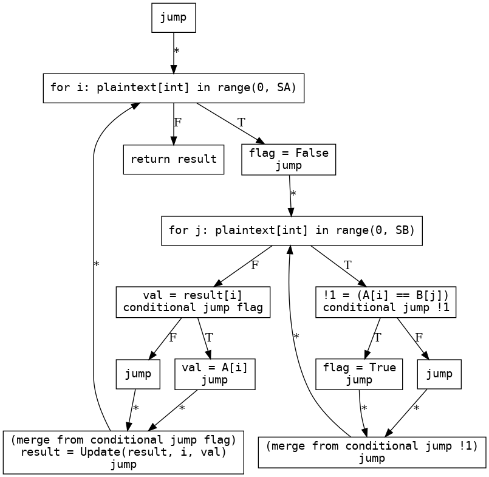
### SSA

### SSA ϕ→MUX
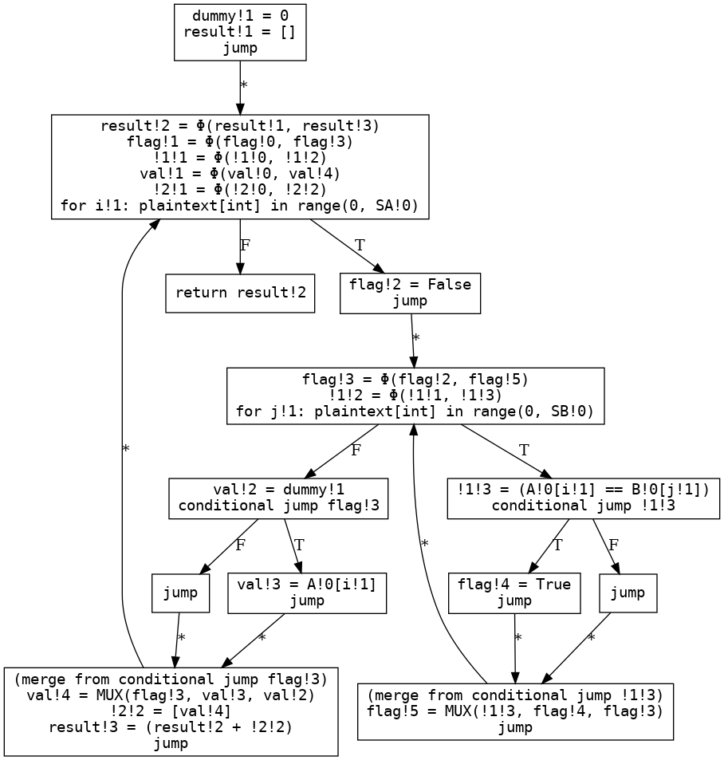
### Dead code elimination
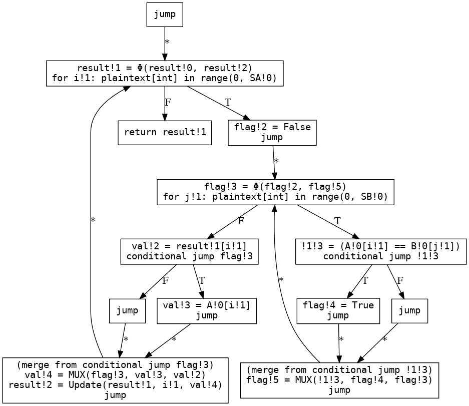
### Linear code with loops
```python
def psi(A!0: shared[list[int]], SA!0: plaintext[int], B!0: shared[list[int]], SB!0: plaintext[int]) -> shared[list[int]]:
    dummy!1 = 0
    result!1 = []
    for i!1 in range(0, SA!0):
        result!2 = Φ(result!1, result!3)
        flag!2 = False
        for j!1 in range(0, SB!0):
            flag!3 = Φ(flag!2, flag!5)
            !1!3 = (A!0[i!1] == B!0[j!1])
            flag!4 = True
            flag!5 = MUX(!1!3, flag!4, flag!3)
        val!2 = dummy!1
        val!3 = A!0[i!1]
        val!4 = MUX(flag!3, val!3, val!2)
        !2!2 = [val!4]
        result!3 = (result!2 + !2!2)
    return result!2
```
### Dependency graph
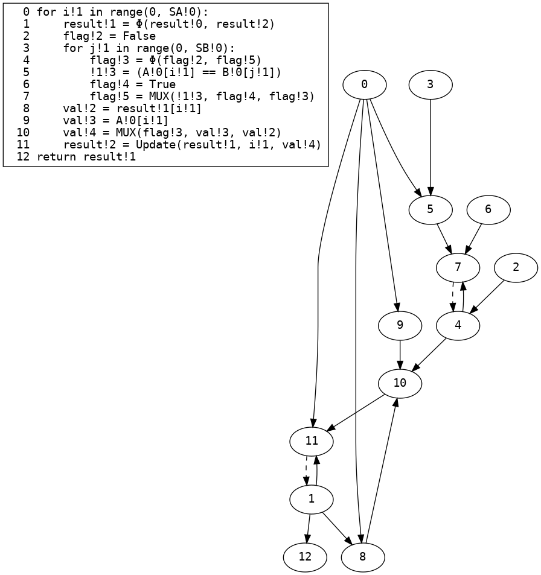
### Removal of infeasible edges
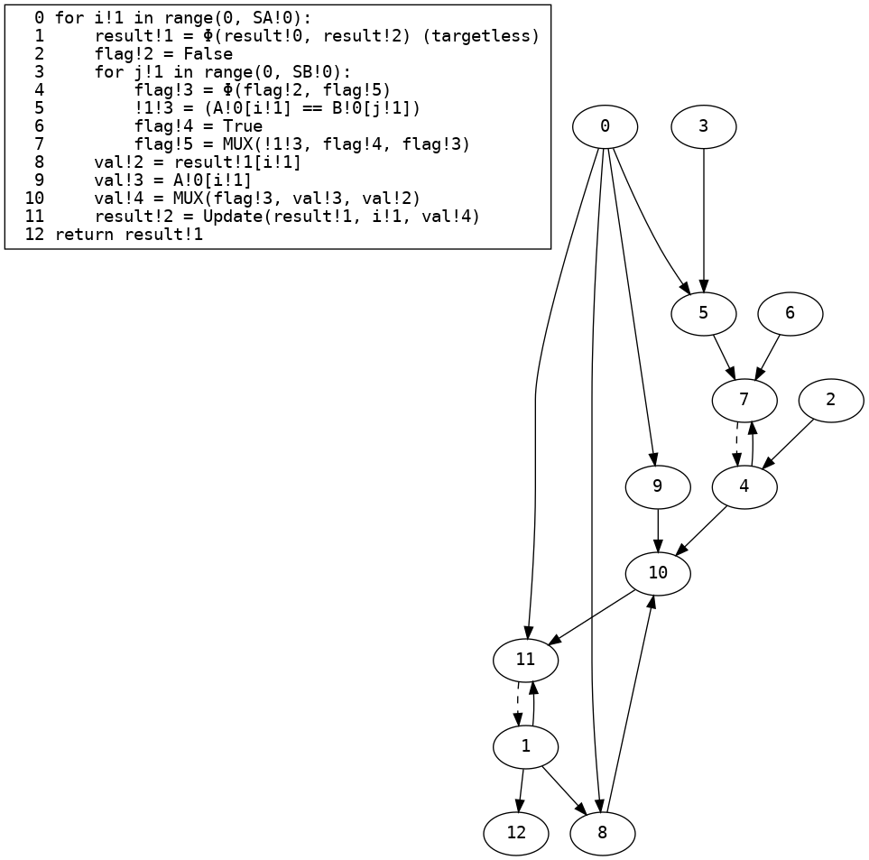
### Array MUX refinement
```python
def psi(A!0: shared[list[int]], SA!0: plaintext[int], B!0: shared[list[int]], SB!0: plaintext[int]) -> shared[list[int]]:
    dummy!1 = 0
    result!1 = []
    for i!1 in range(0, SA!0):
        result!2 = Φ(result!1, result!3)
        flag!2 = False
        for j!1 in range(0, SB!0):
            flag!3 = Φ(flag!2, flag!5)
            !1!3 = (A!0[i!1] == B!0[j!1])
            flag!4 = True
            flag!5 = MUX(!1!3, flag!4, flag!3)
        val!2 = dummy!1
        val!3 = A!0[i!1]
        val!4 = MUX(flag!3, val!3, val!2)
        !2!2 = [val!4]
        result!3 = (result!2 + !2!2)
    return result!2
```
### Array MUX refinement (dependence graph)

### Type environment
| Variable | Type |
| - | - |
| `A!0` | `shared[list[int]]` |
| `SA!0` | `plaintext[int]` |
| `B!0` | `shared[list[int]]` |
| `SB!0` | `plaintext[int]` |
| `i!1` | `plaintext[int]` |
| `j!1` | `plaintext[int]` |
| `result!2` | `shared[list[int]]` |
| `!2!2` | `shared[list[int]]` |
| `result!3` | `shared[list[int]]` |
| `result!1` | `plaintext[list[int]]` |
| `val!4` | `shared[int]` |
| `flag!3` | `shared[bool]` |
| `val!2` | `plaintext[int]` |
| `val!3` | `shared[int]` |
| `dummy!1` | `plaintext[int]` |
| `!1!3` | `shared[bool]` |
| `flag!4` | `plaintext[bool]` |
| `flag!5` | `shared[bool]` |
| `flag!2` | `plaintext[bool]` |
### Motion code
```cpp
template <encrypto::motion::MpcProtocol Protocol>
std::vector<encrypto::motion::SecureUnsignedInteger> psi(
    encrypto::motion::PartyPointer &party,
    std::vector<encrypto::motion::SecureUnsignedInteger> A_0,
    std::uint32_t _MPC_PLAINTEXT_SA_0,
    std::vector<encrypto::motion::SecureUnsignedInteger> B_0,
    std::uint32_t _MPC_PLAINTEXT_SB_0
) {
    // Shared variable declarations
    encrypto::motion::SecureUnsignedInteger SA_0;
    encrypto::motion::SecureUnsignedInteger SB_0;
    encrypto::motion::SecureUnsignedInteger i_1;
    encrypto::motion::SecureUnsignedInteger j_1;
    std::vector<encrypto::motion::SecureUnsignedInteger> result_2;
    std::vector<encrypto::motion::SecureUnsignedInteger> _2_2;
    std::vector<encrypto::motion::SecureUnsignedInteger> result_3;
    std::vector<encrypto::motion::SecureUnsignedInteger> result_1;
    encrypto::motion::SecureUnsignedInteger val_4;
    encrypto::motion::ShareWrapper flag_3;
    encrypto::motion::SecureUnsignedInteger val_2;
    encrypto::motion::SecureUnsignedInteger val_3;
    encrypto::motion::SecureUnsignedInteger dummy_1;
    encrypto::motion::ShareWrapper _1_3;
    encrypto::motion::ShareWrapper flag_4;
    encrypto::motion::ShareWrapper flag_5;
    encrypto::motion::ShareWrapper flag_2;

    // Plaintext variable declarations
    std::uint32_t _MPC_PLAINTEXT_i_1;
    std::uint32_t _MPC_PLAINTEXT_j_1;
    std::vector<std::uint32_t> _MPC_PLAINTEXT_result_1;
    std::uint32_t _MPC_PLAINTEXT_val_2;
    std::uint32_t _MPC_PLAINTEXT_dummy_1;
    bool _MPC_PLAINTEXT_flag_4;
    bool _MPC_PLAINTEXT_flag_2;

    // Constant initializations
    encrypto::motion::ShareWrapper _MPC_CONSTANT_false = party->In<Protocol>(encrypto::motion::BitVector(1, false), 0);
    encrypto::motion::SecureUnsignedInteger _MPC_CONSTANT_0 = party->In<Protocol>(encrypto::motion::ToInput(std::uint32_t(0)), 0);
    encrypto::motion::ShareWrapper _MPC_CONSTANT_true = party->In<Protocol>(encrypto::motion::BitVector(1, true), 0);

    // Plaintext parameter assignments
    SA_0 = party->In<Protocol>(encrypto::motion::ToInput(_MPC_PLAINTEXT_SA_0), 0);

    SB_0 = party->In<Protocol>(encrypto::motion::ToInput(_MPC_PLAINTEXT_SB_0), 0);

    // Function body
    dummy_1 = _MPC_CONSTANT_0;
    _MPC_PLAINTEXT_dummy_1 = std::uint32_t(0);
    result_1 = {};
    _MPC_PLAINTEXT_result_1 = {};

    // Initialize phi values
    result_2 = result_1;
    for (_MPC_PLAINTEXT_i_1 = std::uint32_t(0); _MPC_PLAINTEXT_i_1 < _MPC_PLAINTEXT_SA_0; _MPC_PLAINTEXT_i_1++) {
        i_1 = party->In<Protocol>(encrypto::motion::ToInput(_MPC_PLAINTEXT_i_1), 0);
        flag_2 = _MPC_CONSTANT_false;
        _MPC_PLAINTEXT_flag_2 = false;

        // Initialize phi values
        flag_3 = flag_2;
        for (_MPC_PLAINTEXT_j_1 = std::uint32_t(0); _MPC_PLAINTEXT_j_1 < _MPC_PLAINTEXT_SB_0; _MPC_PLAINTEXT_j_1++) {
            j_1 = party->In<Protocol>(encrypto::motion::ToInput(_MPC_PLAINTEXT_j_1), 0);
            _1_3 = (encrypto::motion::ShareWrapper(A_0[_MPC_PLAINTEXT_i_1].Get()) == encrypto::motion::ShareWrapper(B_0[_MPC_PLAINTEXT_j_1].Get()));
            flag_4 = _MPC_CONSTANT_true;
            _MPC_PLAINTEXT_flag_4 = true;
            flag_5 = _1_3.Mux(flag_4.Get(), flag_3.Get());

            // Update phi values
            flag_3 = flag_5;
        }

        val_2 = dummy_1;
        _MPC_PLAINTEXT_val_2 = _MPC_PLAINTEXT_dummy_1;
        val_3 = A_0[_MPC_PLAINTEXT_i_1];
        val_4 = flag_3.Mux(val_3.Get(), val_2.Get());
        _2_2 = {val_4};
        result_3 = (result_2 + _2_2);

        // Update phi values
        result_2 = result_3;
    }


    return result_2;
}
```
