# Compiler stages with different benchmarks
## `biometric`
### Input
```python
import typing

# Biometric matching
# D is the number of features we are matching. Usually small, e.g., D=4
# N is the size of the database S
# C is the vector of features we are tryign to match.
# S is the (originally two dimentional) database array: S[0,0],S[0,1],..S[0,D-1],S[1,0]... S[N-1,D-1]
def biometric(C: list[int], D, S: list[int], N):
  min_sum: int = 10000
  min_index = -1
  for i in range(N):
    sum = 0
    for j in range(D):
      d = S[i*D+j]-C[j] 
      p = d*d      
      sum = sum + p
    if sum < min_sum:
      min_sum = sum
      min_index = i

  return (min_sum,min_index)

C = [1,2,3,4]
S = [4,5,2,10,2,120,4,10,99,88,77,66,55,44,33,22]
print(biometric(C,4,S,4))

```
### Restricted AST
```python
def biometric(C: shared, D: plaintext, S: shared, N: plaintext):
    min_sum = 10000
    min_index = - 1
    for i: plaintext in range(0, N):
        sum = 0
        for j: plaintext in range(0, D):
            d = (S[((i * D) + j)] - C[j])
            p = (d * d)
            sum = (sum + p)
        if (sum < min_sum):
            min_sum = sum
            min_index = i
    return (min_sum, min_index)
```
### Three-address code CFG

### SSA

### SSA ϕ→MUX

### Dead code elimination
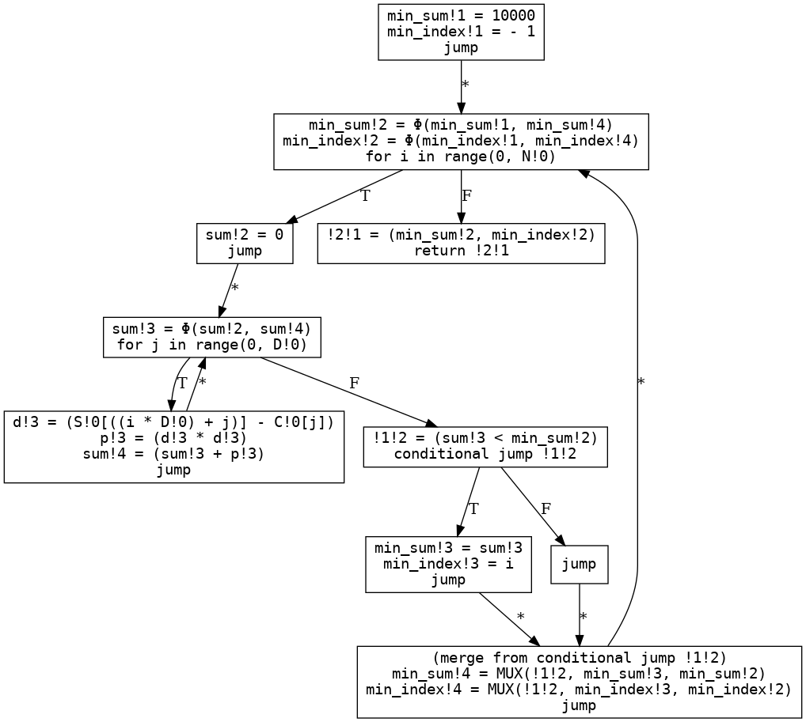
### Linear code with loops
```python
def biometric(C: shared, D: plaintext, S: shared, N: plaintext):
    min_sum!1 = 10000
    min_index!1 = - 1
    for i: plaintext in range(0, N!0):
        min_sum!2 = Φ(min_sum!1, min_sum!4)
        min_index!2 = Φ(min_index!1, min_index!4)
        sum!2 = 0
        for j: plaintext in range(0, D!0):
            sum!3 = Φ(sum!2, sum!4)
            d!3 = (S!0[((i * D!0) + j)] - C!0[j])
            p!3 = (d!3 * d!3)
            sum!4 = (sum!3 + p!3)
        !1!2 = (sum!3 < min_sum!2)
        min_sum!3 = sum!3
        min_index!3 = i
        min_sum!4 = MUX(!1!2, min_sum!3, min_sum!2)
        min_index!4 = MUX(!1!2, min_index!3, min_index!2)
    !2!1 = (min_sum!2, min_index!2)
    return !2!1
```
### Dependency graph
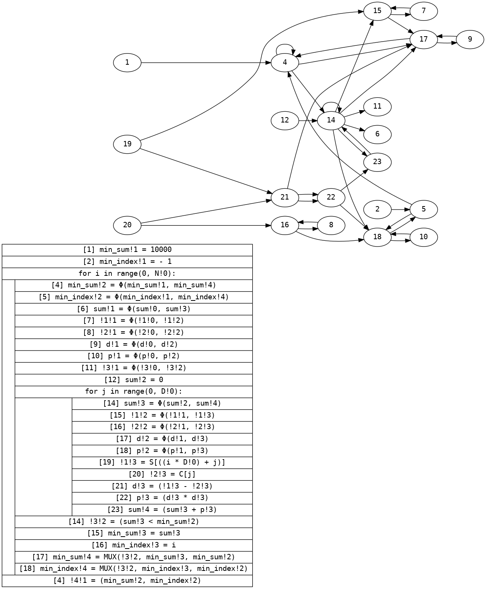
### Removal of infeasible edges
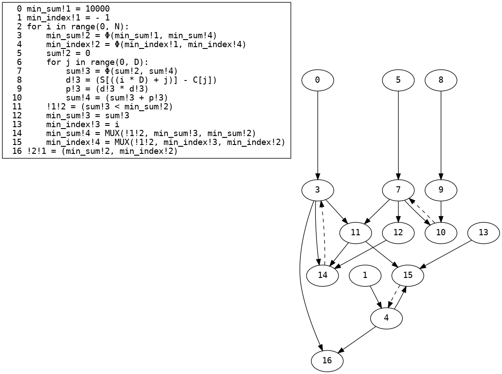
### Typed linear code with loops
```python
def biometric(C: shared, D: plaintext, S: shared, N: plaintext):
    min_sum!1: plaintext = 10000
    min_index!1: plaintext = - 1
    for i: plaintext in range(0, N!0):
        min_sum!2: shared = Φ(min_sum!1, min_sum!4)
        min_index!2: shared = Φ(min_index!1, min_index!4)
        sum!2: plaintext = 0
        for j: plaintext in range(0, D!0):
            sum!3: shared = Φ(sum!2, sum!4)
            d!3: shared = (S!0[((i * D!0) + j)] - C!0[j])
            p!3: shared = (d!3 * d!3)
            sum!4: shared = (sum!3 + p!3)
        !1!2: shared = (sum!3 < min_sum!2)
        min_sum!3: shared = sum!3
        min_index!3: plaintext = i
        min_sum!4: shared = MUX(!1!2, min_sum!3, min_sum!2)
        min_index!4: shared = MUX(!1!2, min_index!3, min_index!2)
    !2!1: shared = (min_sum!2, min_index!2)
    return !2!1
```
## `biometric_fast`
### Input
```python
import typing

def biometric_matching_fast(D, N, C:list[int], C_sqr_sum:int, two_C:list[int], S: List[int], S_sqr_sum: list[int]):
  """
  Computes biometric matching

  This version uses some preprocessed data from parties to provide faster biometric matching

  :param int D: the cardinality of a feature vector, Usually small, e.g. 4
  :param int N: number of features in the database e.g. usually 1024, 2048, 4096, etc
  :param list[int] C: query feature vector, we need to find closest match to this vector in the DB, comes from client (Alice)
  :param int C_sqr_sum: sum of squares of elements of `C` e.g. if `C={1, 2, 3, 4}`, then `C_sqr_sum is: 1*1 + 2*2 + 3*3 + 4*4 = 30`
   client passes it pre-processed to to save gates in circuit
  :param list[int] two_C: same as `C` except that each element is multipled by 2, e.g. if `C={1, 2, 3, 4}`, then 
   `two_C = {2, 4, 6, 8}`. client passes it preprocessed to save gates
  :param list[int] S: the database of features, it has N * D elements i.e. N features and each feature vector has D elements,
   this comes from server (Bob)
  :param list[int] S_sqr_sum: has N elements, each element is sum of squares of corresponding feature elements e.g. say
   S={{1, 2, 3, 4}, {5, 6, 7, 8}}, then S_sqr_sum={1*1 + 2*2 + 3*3 + 4*4, 5*5 + 6*6 + 7*7 + 8*8} = {30, 174}
  
  """ 

  differences: list[int] = [0] * D
  for i in range(N):
    a_sqr_plus_b_sqr: int = S_sqr_sum[i] + C_sqr_sum
    two_a_b: int = 0
    
    for j in range(D):
      tmp: int = S[i*D+j] * two_C[j]
      two_a_b = two_a_b + tmp

    this_diff: int = a_sqr_plus_b_sqr - two_a_b
    differences[i] = this_diff


    min_diff: int = differences[0]
    min_index: int = 0

    for k in range(N):
      if(differences[k] < min_diff):
        min_diff = differences[k]
        min_index = k

  return (min_diff, min_index)


def test_biometric_matching_fast(D, N, C, S):
  """
  just a convenience method for testing, computes the pre-processing data for the actual call
  """
  two_C = [0] * D
  C_sqr_sum = 0
  S_sqr_sum = [0] * N
  for i in range(D):
    two_C[i] = 2 * C[i]
    C_sqr_sum = C_sqr_sum + (C[i] * C[i])

  for i in range(N):
    for j in range(D):
      S_sqr_sum[i] = S_sqr_sum[i] + (S[i*D+j] * S[i*D+j])

  print(biometric_matching__fast(D, N, C, C_sqr_sum, two_C, S, S_sqr_sum))


C = [1,2,3,4]
S = [4,5,2,10,2,120,4,10,99,88,77,66,55,44,33,22]
test_biometric_matching_fast(4, 4, C, S)

```
### Restricted AST
```python
def biometric_matching_fast(D: plaintext, N: plaintext, C: shared, C_sqr_sum: shared, two_C: shared, S: shared, S_sqr_sum: shared):
    differences = ([0] * D)
    for i: plaintext in range(0, N):
        a_sqr_plus_b_sqr = (S_sqr_sum[i] + C_sqr_sum)
        two_a_b = 0
        for j: plaintext in range(0, D):
            tmp = (S[((i * D) + j)] * two_C[j])
            two_a_b = (two_a_b + tmp)
        this_diff = (a_sqr_plus_b_sqr - two_a_b)
        differences[i] = this_diff
        min_diff = differences[0]
        min_index = 0
        for k: plaintext in range(0, N):
            if (differences[k] < min_diff):
                min_diff = differences[k]
                min_index = k
    return (min_diff, min_index)
```
### Three-address code CFG

### SSA

### SSA ϕ→MUX

### Dead code elimination
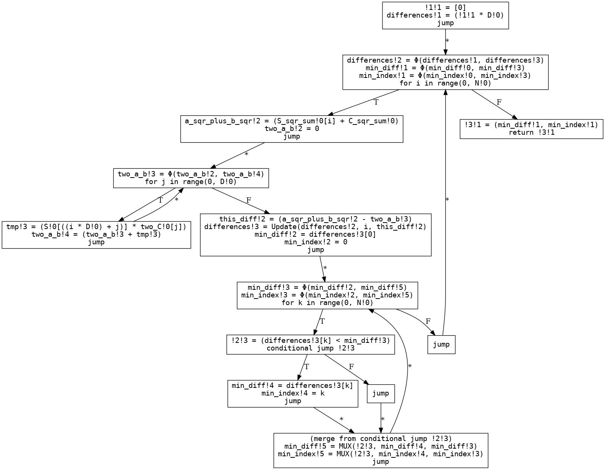
### Linear code with loops
```python
def biometric_matching_fast(D: plaintext, N: plaintext, C: shared, C_sqr_sum: shared, two_C: shared, S: shared, S_sqr_sum: shared):
    !1!1 = [0]
    differences!1 = (!1!1 * D!0)
    for i: plaintext in range(0, N!0):
        differences!2 = Φ(differences!1, differences!3)
        min_diff!1 = Φ(min_diff!0, min_diff!3)
        min_index!1 = Φ(min_index!0, min_index!3)
        a_sqr_plus_b_sqr!2 = (S_sqr_sum!0[i] + C_sqr_sum!0)
        two_a_b!2 = 0
        for j: plaintext in range(0, D!0):
            two_a_b!3 = Φ(two_a_b!2, two_a_b!4)
            tmp!3 = (S!0[((i * D!0) + j)] * two_C!0[j])
            two_a_b!4 = (two_a_b!3 + tmp!3)
        this_diff!2 = (a_sqr_plus_b_sqr!2 - two_a_b!3)
        differences!3 = Update(differences!2, i, this_diff!2)
        min_diff!2 = differences!3[0]
        min_index!2 = 0
        for k: plaintext in range(0, N!0):
            min_diff!3 = Φ(min_diff!2, min_diff!5)
            min_index!3 = Φ(min_index!2, min_index!5)
            !2!3 = (differences!3[k] < min_diff!3)
            min_diff!4 = differences!3[k]
            min_index!4 = k
            min_diff!5 = MUX(!2!3, min_diff!4, min_diff!3)
            min_index!5 = MUX(!2!3, min_index!4, min_index!3)
    !3!1 = (min_diff!1, min_index!1)
    return !3!1
```
### Dependency graph
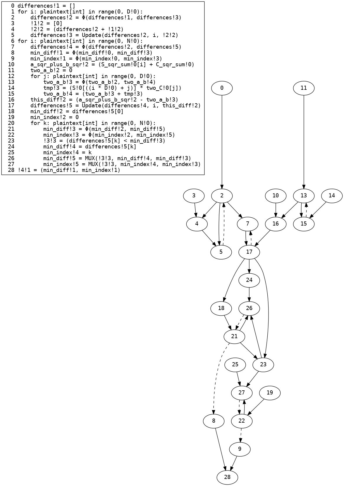
### Removal of infeasible edges
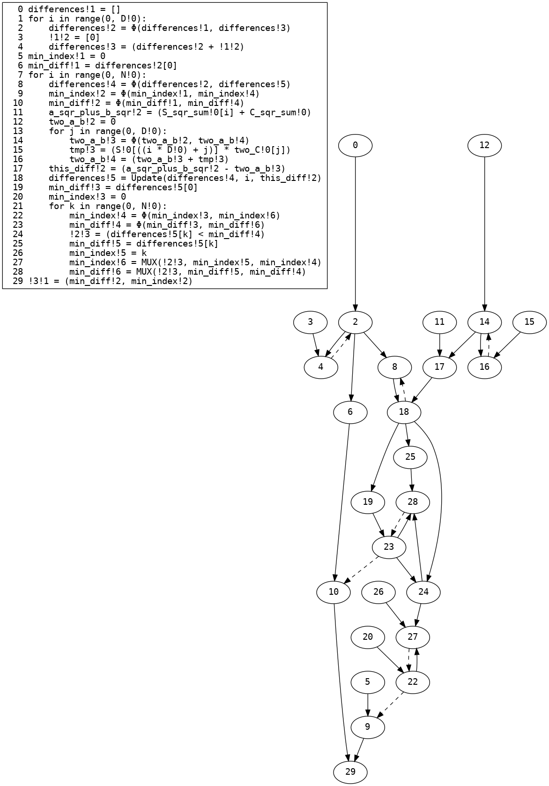
### Typed linear code with loops
```python
def biometric_matching_fast(D: plaintext, N: plaintext, C: shared, C_sqr_sum: shared, two_C: shared, S: shared, S_sqr_sum: shared):
    !1!1: plaintext = [0]
    differences!1: plaintext = (!1!1 * D!0)
    for i: plaintext in range(0, N!0):
        differences!2 = Φ(differences!1, differences!3)
        min_diff!1: shared = Φ(min_diff!0, min_diff!3)
        min_index!1: shared = Φ(min_index!0, min_index!3)
        a_sqr_plus_b_sqr!2: shared = (S_sqr_sum!0[i] + C_sqr_sum!0)
        two_a_b!2: plaintext = 0
        for j: plaintext in range(0, D!0):
            two_a_b!3: shared = Φ(two_a_b!2, two_a_b!4)
            tmp!3: shared = (S!0[((i * D!0) + j)] * two_C!0[j])
            two_a_b!4: shared = (two_a_b!3 + tmp!3)
        this_diff!2: shared = (a_sqr_plus_b_sqr!2 - two_a_b!3)
        differences!3 = Update(differences!2, i, this_diff!2)
        min_diff!2 = differences!3[0]
        min_index!2: plaintext = 0
        for k: plaintext in range(0, N!0):
            min_diff!3: shared = Φ(min_diff!2, min_diff!5)
            min_index!3: shared = Φ(min_index!2, min_index!5)
            !2!3: shared = (differences!3[k] < min_diff!3)
            min_diff!4 = differences!3[k]
            min_index!4: plaintext = k
            min_diff!5: shared = MUX(!2!3, min_diff!4, min_diff!3)
            min_index!5: shared = MUX(!2!3, min_index!4, min_index!3)
    !3!1: shared = (min_diff!1, min_index!1)
    return !3!1
```
## `chapterfour_figure_12`
### Input
```python
def foo(x, y):
    z = 0
    if x > 0:
        if y > 0:
            z = 1
        else:
            z = -1
    return z

```
### Restricted AST
```python
def foo(x: plaintext, y: plaintext):
    z = 0
    if (x > 0):
        if (y > 0):
            z = 1
        else:
            z = - 1
    return z
```
### Three-address code CFG

### SSA

### SSA ϕ→MUX

### Dead code elimination
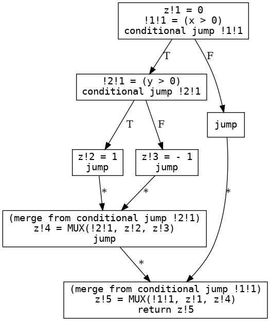
### Linear code with loops
```python
def foo(x: plaintext, y: plaintext):
    z!1 = 0
    !1!1 = (x!0 > 0)
    !2!1 = (y!0 > 0)
    z!3 = - 1
    z!2 = 1
    z!4 = MUX(!2!1, z!2, z!3)
    z!5 = MUX(!1!1, z!1, z!4)
    return z!5
```
### Dependency graph
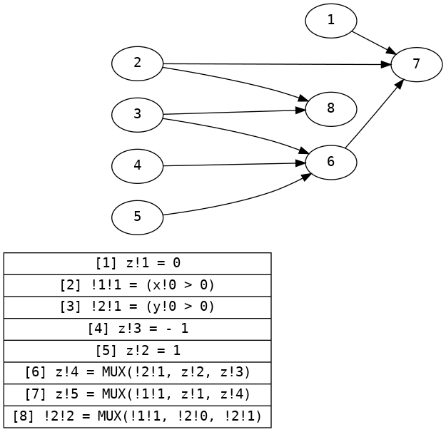
### Removal of infeasible edges
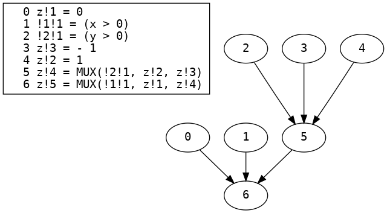
### Typed linear code with loops
```python
def foo(x: plaintext, y: plaintext):
    z!1: plaintext = 0
    !1!1: plaintext = (x!0 > 0)
    !2!1: plaintext = (y!0 > 0)
    z!3: plaintext = - 1
    z!2: plaintext = 1
    z!4: shared = MUX(!2!1, z!2, z!3)
    z!5: shared = MUX(!1!1, z!1, z!4)
    return z!5
```
## `convex_hull`
### Input
```python
def convex_hull(X_coords: list[int], Y_coords: list[int], N):
    hull_X: list[int] = []
    hull_Y: list[int] = []

    for i in range(0, N):
        is_hull = True
        p1_X = X_coords[i]
        p1_Y = Y_coords[i]

        if p1_X <= 0 and p1_Y >= 0:
            for j in range(0, N):
                p2_X = X_coords[j]
                p2_Y = Y_coords[j]

                if not (p1_X <= p2_X or p1_Y >= p2_Y):
                    is_hull = False

        if is_hull:
            hull_X = hull_X + [p1_X]
            hull_Y = hull_Y + [p1_Y]

    return (hull_X, hull_Y)

```
### Restricted AST
```python
def convex_hull(X_coords: shared, Y_coords: shared, N: plaintext):
    hull_X = []
    hull_Y = []
    for i: plaintext in range(0, N):
        is_hull = True
        p1_X = X_coords[i]
        p1_Y = Y_coords[i]
        if ((p1_X <= 0) and (p1_Y >= 0)):
            for j: plaintext in range(0, N):
                p2_X = X_coords[j]
                p2_Y = Y_coords[j]
                if not ((p1_X <= p2_X) or (p1_Y >= p2_Y)):
                    is_hull = False
        if is_hull:
            hull_X = (hull_X + [p1_X])
            hull_Y = (hull_Y + [p1_Y])
    return (hull_X, hull_Y)
```
### Three-address code CFG
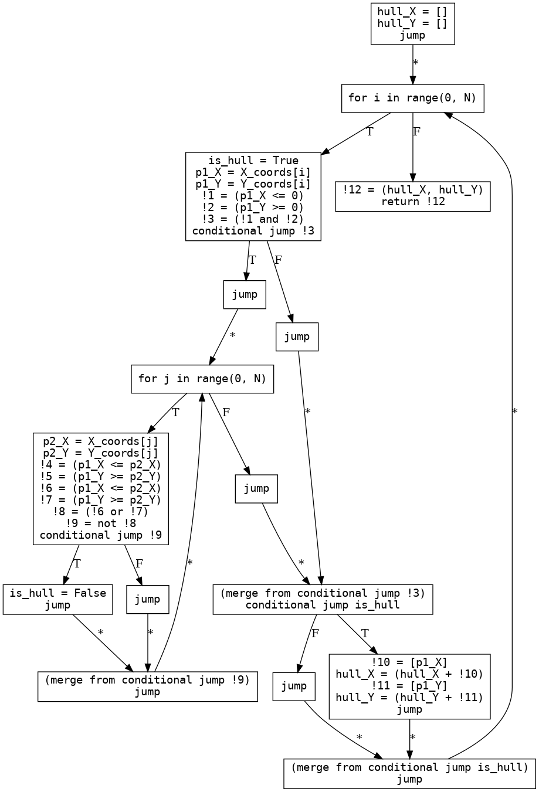
### SSA
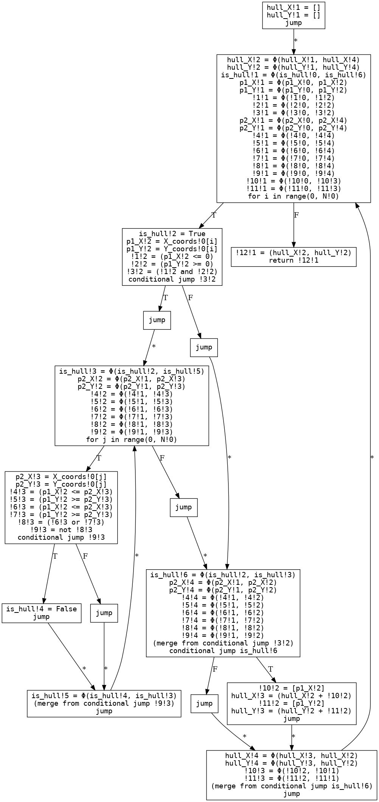
### SSA ϕ→MUX
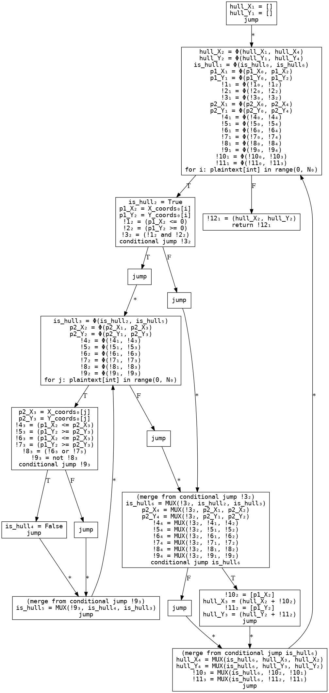
### Dead code elimination
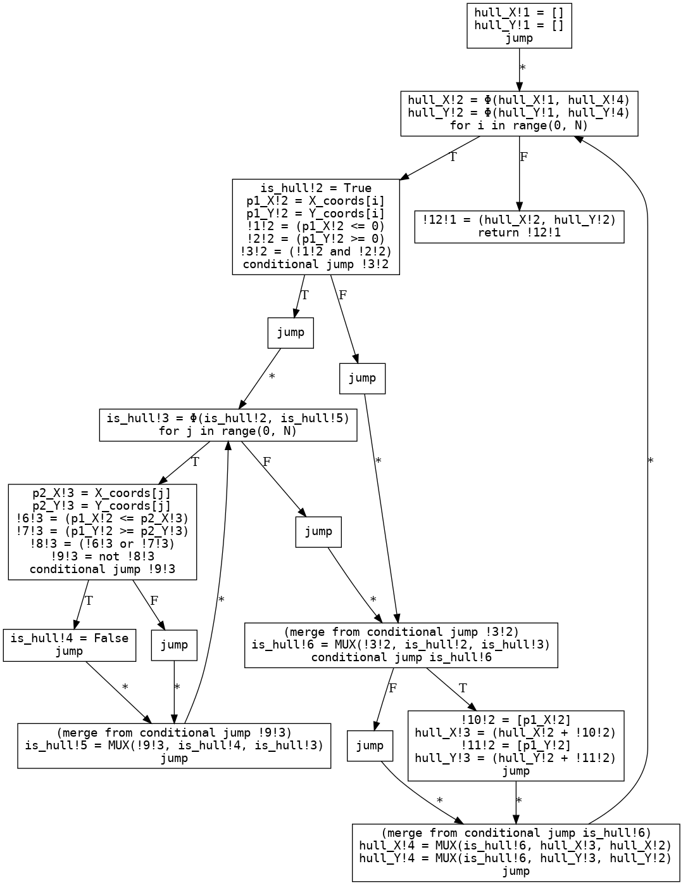
### Linear code with loops
```python
def convex_hull(X_coords: shared, Y_coords: shared, N: plaintext):
    hull_X!1 = []
    hull_Y!1 = []
    for i: plaintext in range(0, N!0):
        hull_X!2 = Φ(hull_X!1, hull_X!4)
        hull_Y!2 = Φ(hull_Y!1, hull_Y!4)
        is_hull!2 = True
        p1_X!2 = X_coords!0[i]
        p1_Y!2 = Y_coords!0[i]
        !1!2 = (p1_X!2 <= 0)
        !2!2 = (p1_Y!2 >= 0)
        !3!2 = (!1!2 and !2!2)
        for j: plaintext in range(0, N!0):
            is_hull!3 = Φ(is_hull!2, is_hull!5)
            p2_X!3 = X_coords!0[j]
            p2_Y!3 = Y_coords!0[j]
            !6!3 = (p1_X!2 <= p2_X!3)
            !7!3 = (p1_Y!2 >= p2_Y!3)
            !8!3 = (!6!3 or !7!3)
            !9!3 = not !8!3
            is_hull!4 = False
            is_hull!5 = MUX(!9!3, is_hull!4, is_hull!3)
        is_hull!6 = MUX(!3!2, is_hull!2, is_hull!3)
        !10!2 = [p1_X!2]
        hull_X!3 = (hull_X!2 + !10!2)
        !11!2 = [p1_Y!2]
        hull_Y!3 = (hull_Y!2 + !11!2)
        hull_X!4 = MUX(is_hull!6, hull_X!3, hull_X!2)
        hull_Y!4 = MUX(is_hull!6, hull_Y!3, hull_Y!2)
    !12!1 = (hull_X!2, hull_Y!2)
    return !12!1
```
### Dependency graph
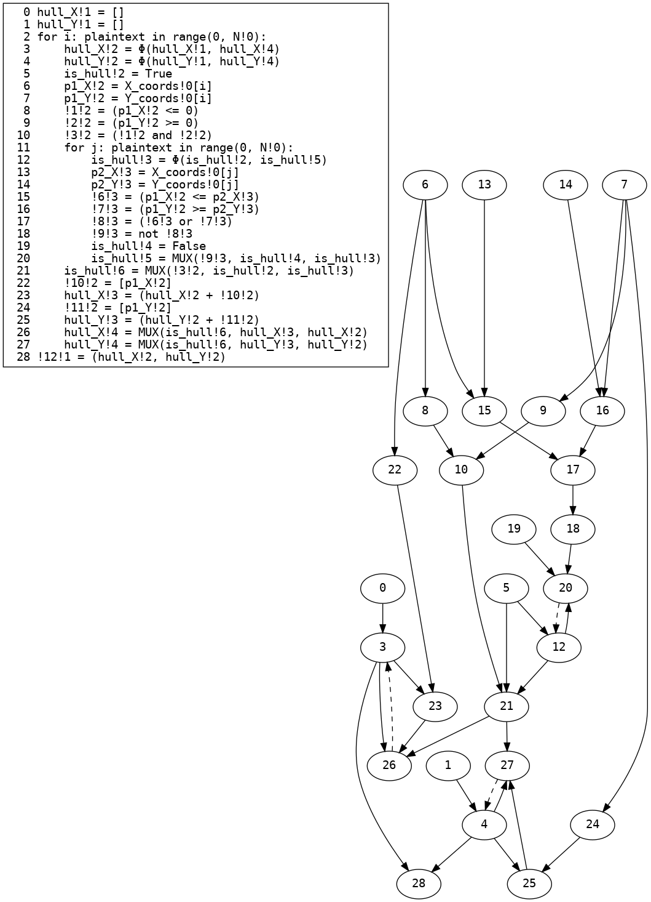
### Removal of infeasible edges
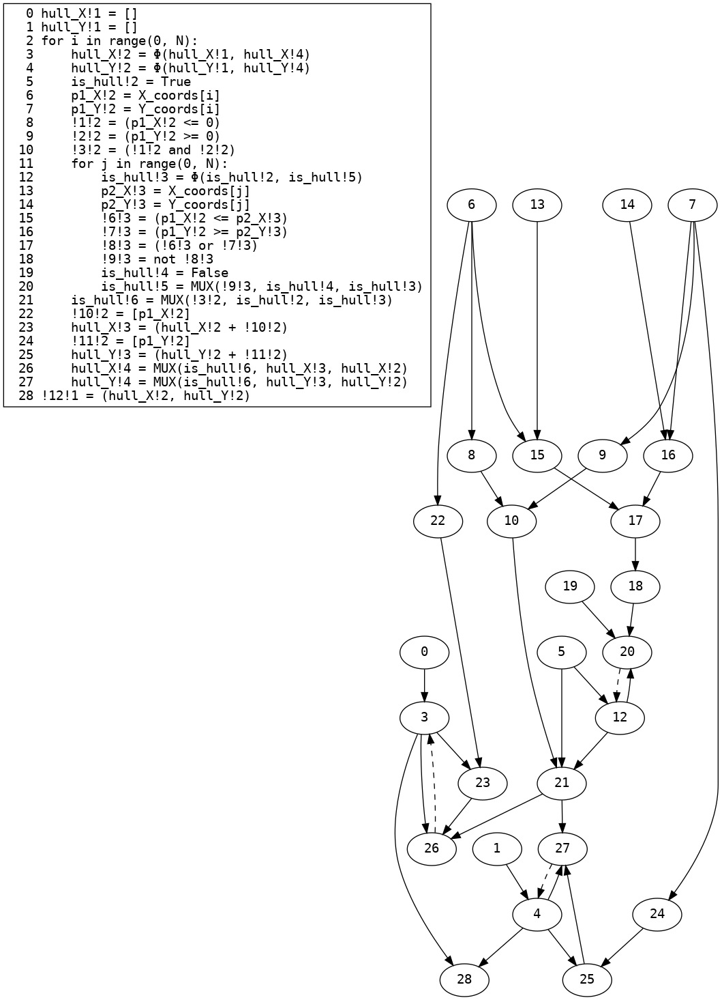
### Typed linear code with loops
```python
def convex_hull(X_coords: shared, Y_coords: shared, N: plaintext):
    hull_X!1: plaintext = []
    hull_Y!1: plaintext = []
    for i: plaintext in range(0, N!0):
        hull_X!2: shared = Φ(hull_X!1, hull_X!4)
        hull_Y!2: shared = Φ(hull_Y!1, hull_Y!4)
        is_hull!2: plaintext = True
        p1_X!2: shared = X_coords!0[i]
        p1_Y!2: shared = Y_coords!0[i]
        !1!2: shared = (p1_X!2 <= 0)
        !2!2: shared = (p1_Y!2 >= 0)
        !3!2: shared = (!1!2 and !2!2)
        for j: plaintext in range(0, N!0):
            is_hull!3: shared = Φ(is_hull!2, is_hull!5)
            p2_X!3: shared = X_coords!0[j]
            p2_Y!3: shared = Y_coords!0[j]
            !6!3: shared = (p1_X!2 <= p2_X!3)
            !7!3: shared = (p1_Y!2 >= p2_Y!3)
            !8!3: shared = (!6!3 or !7!3)
            !9!3: shared = not !8!3
            is_hull!4: plaintext = False
            is_hull!5: shared = MUX(!9!3, is_hull!4, is_hull!3)
        is_hull!6: shared = MUX(!3!2, is_hull!2, is_hull!3)
        !10!2: shared = [p1_X!2]
        hull_X!3: shared = (hull_X!2 + !10!2)
        !11!2: shared = [p1_Y!2]
        hull_Y!3: shared = (hull_Y!2 + !11!2)
        hull_X!4: shared = MUX(is_hull!6, hull_X!3, hull_X!2)
        hull_Y!4: shared = MUX(is_hull!6, hull_Y!3, hull_Y!2)
    !12!1: shared = (hull_X!2, hull_Y!2)
    return !12!1
```
## `count_102`
### Input
```python
def count_102(Seq: list[int], N, Syms: list[int]):
    """
    Computes the number of instances of regex a(b*)c in a provided sequence.
    Syms is a list of form [a, b, c].
    """
    s0 = False
    c = 0

    for i in range(0, N):
        if s0 and (Seq[i] == Syms[2]):
            c = c + 1

        s0 = (Seq[i] == Syms[1]) or (s0 and (Seq[i] == Syms[0]))

    return c


seq = [1, 0, 2, 1, 0, 0, 2, 1, 2, 2]
num_102s = count_102(seq, len(seq), [1, 0, 2])
print(num_102s)

```
### Restricted AST
```python
def count_102(Seq: shared, N: plaintext, Syms: shared):
    s0 = False
    c = 0
    for i: plaintext in range(0, N):
        if (s0 and (Seq[i] == Syms[2])):
            c = (c + 1)
        s0 = ((Seq[i] == Syms[1]) or (s0 and (Seq[i] == Syms[0])))
    return c
```
### Three-address code CFG
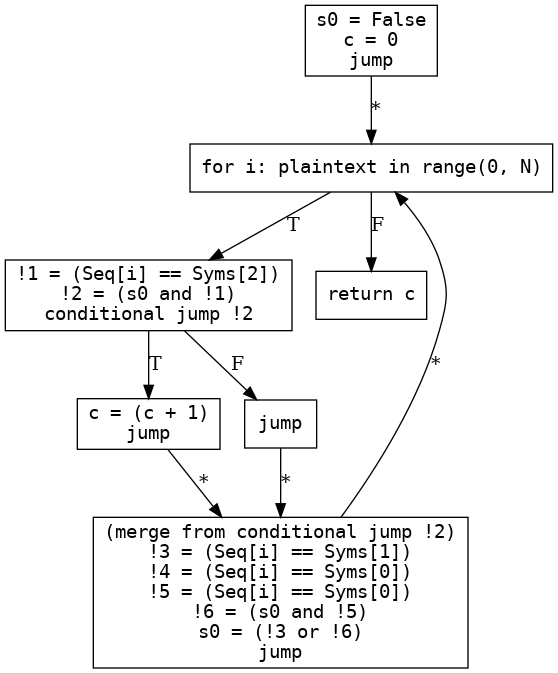
### SSA
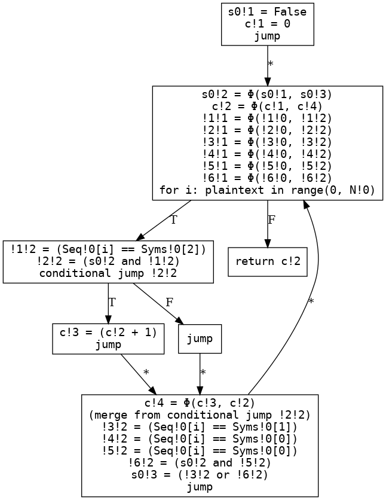
### SSA ϕ→MUX
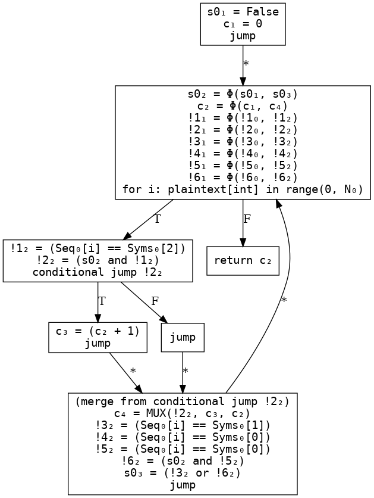
### Dead code elimination
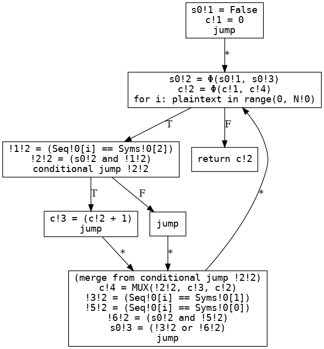
### Linear code with loops
```python
def count_102(Seq: shared, N: plaintext, Syms: shared):
    s0!1 = False
    c!1 = 0
    for i: plaintext in range(0, N!0):
        s0!2 = Φ(s0!1, s0!3)
        c!2 = Φ(c!1, c!4)
        !1!2 = (Seq!0[i] == Syms!0[2])
        !2!2 = (s0!2 and !1!2)
        c!3 = (c!2 + 1)
        c!4 = MUX(!2!2, c!3, c!2)
        !3!2 = (Seq!0[i] == Syms!0[1])
        !5!2 = (Seq!0[i] == Syms!0[0])
        !6!2 = (s0!2 and !5!2)
        s0!3 = (!3!2 or !6!2)
    return c!2
```
### Dependency graph
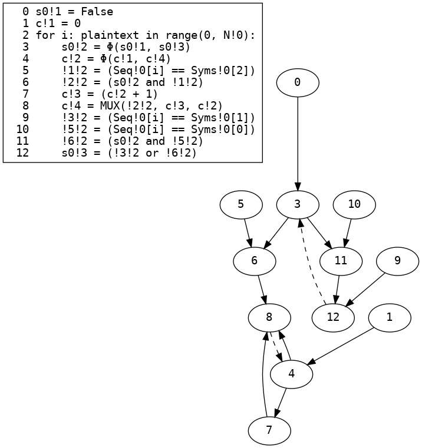
### Removal of infeasible edges
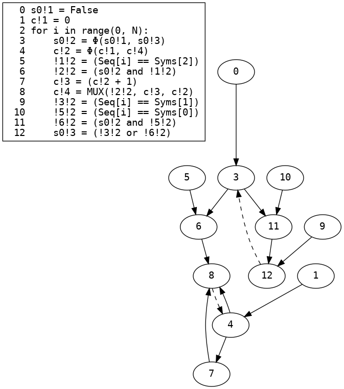
### Typed linear code with loops
```python
def count_102(Seq: shared, N: plaintext, Syms: shared):
    s0!1: plaintext = False
    c!1: plaintext = 0
    for i: plaintext in range(0, N!0):
        s0!2: shared = Φ(s0!1, s0!3)
        c!2: shared = Φ(c!1, c!4)
        !1!2: shared = (Seq!0[i] == Syms!0[2])
        !2!2: shared = (s0!2 and !1!2)
        c!3: shared = (c!2 + 1)
        c!4: shared = MUX(!2!2, c!3, c!2)
        !3!2: shared = (Seq!0[i] == Syms!0[1])
        !5!2: shared = (Seq!0[i] == Syms!0[0])
        !6!2: shared = (s0!2 and !5!2)
        s0!3: shared = (!3!2 or !6!2)
    return c!2
```
## `count_10s`
### Input
```python
def count_10s(Seq: list[int], N, Syms: list[int]):
    """
    Computes the number of instances of regex a(b+) in a provided sequence.
    Syms is a list of form [a, b].
    """
    s0 = False
    s1 = False
    scount = 0

    for i in range(0, N):
        if s1 and (Seq[i] != Syms[0]):
            scount = scount + 1

        s1 = (Seq[i] == Syms[0]) and (s0 or s1)
        s0 = Seq[i] == Syms[1]

    return scount


seq = [1, 0, 0, 1, 1, 0, 2]
num_10s = count_10s(seq, len(seq), [0, 1])
print(num_10s)

```
### Restricted AST
```python
def count_10s(Seq: shared, N: plaintext, Syms: shared):
    s0 = False
    s1 = False
    scount = 0
    for i: plaintext in range(0, N):
        if (s1 and (Seq[i] != Syms[0])):
            scount = (scount + 1)
        s1 = ((Seq[i] == Syms[0]) and (s0 or s1))
        s0 = (Seq[i] == Syms[1])
    return scount
```
### Three-address code CFG
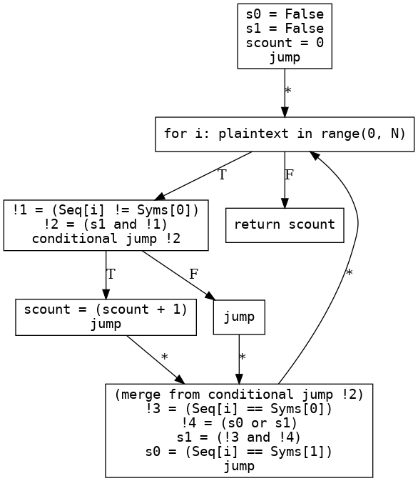
### SSA
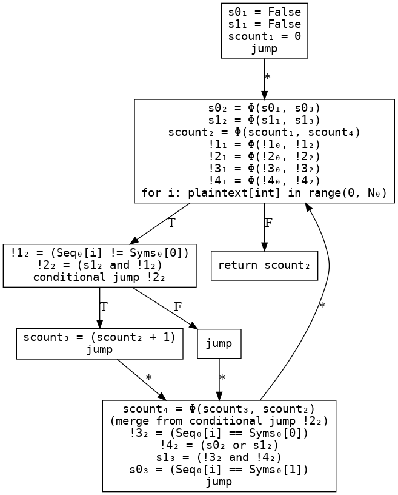
### SSA ϕ→MUX

### Dead code elimination
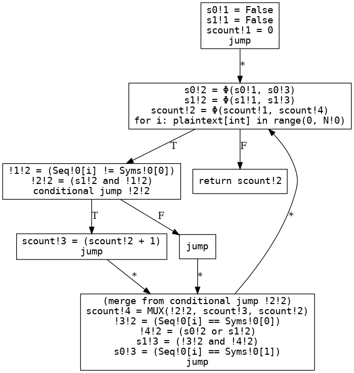
### Linear code with loops
```python
def count_10s(Seq: shared, N: plaintext, Syms: shared):
    s0!1 = False
    s1!1 = False
    scount!1 = 0
    for i: plaintext in range(0, N!0):
        s0!2 = Φ(s0!1, s0!3)
        s1!2 = Φ(s1!1, s1!3)
        scount!2 = Φ(scount!1, scount!4)
        !1!2 = (Seq!0[i] != Syms!0[0])
        !2!2 = (s1!2 and !1!2)
        scount!3 = (scount!2 + 1)
        scount!4 = MUX(!2!2, scount!3, scount!2)
        !3!2 = (Seq!0[i] == Syms!0[0])
        !4!2 = (s0!2 or s1!2)
        s1!3 = (!3!2 and !4!2)
        s0!3 = (Seq!0[i] == Syms!0[1])
    return scount!2
```
### Dependency graph
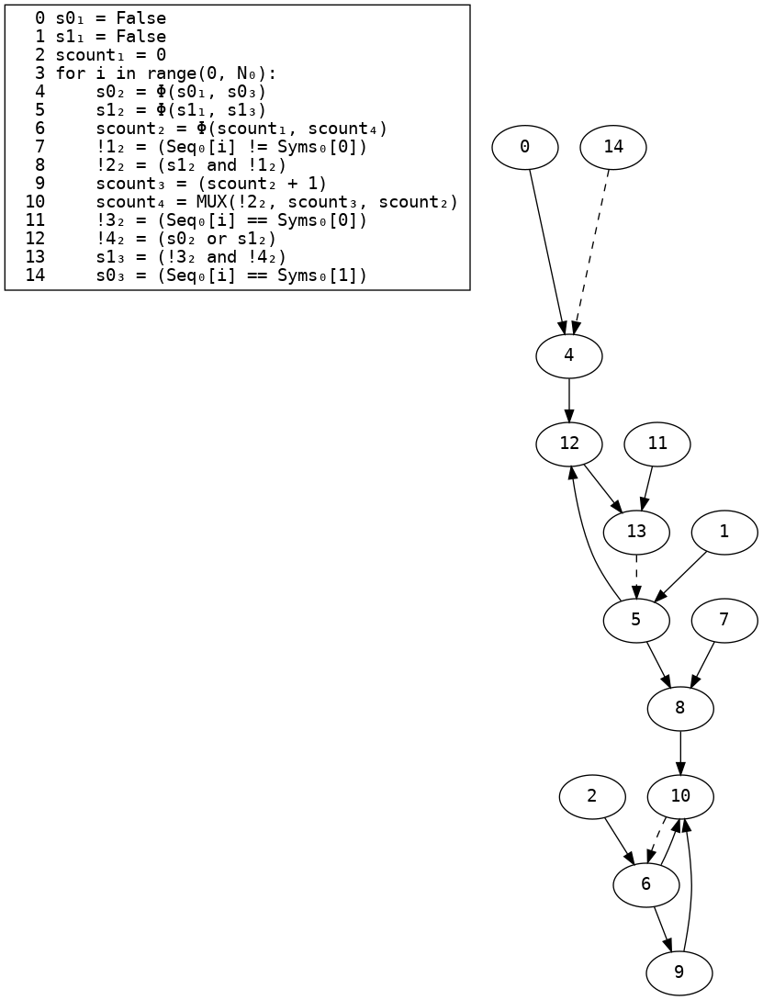
### Removal of infeasible edges
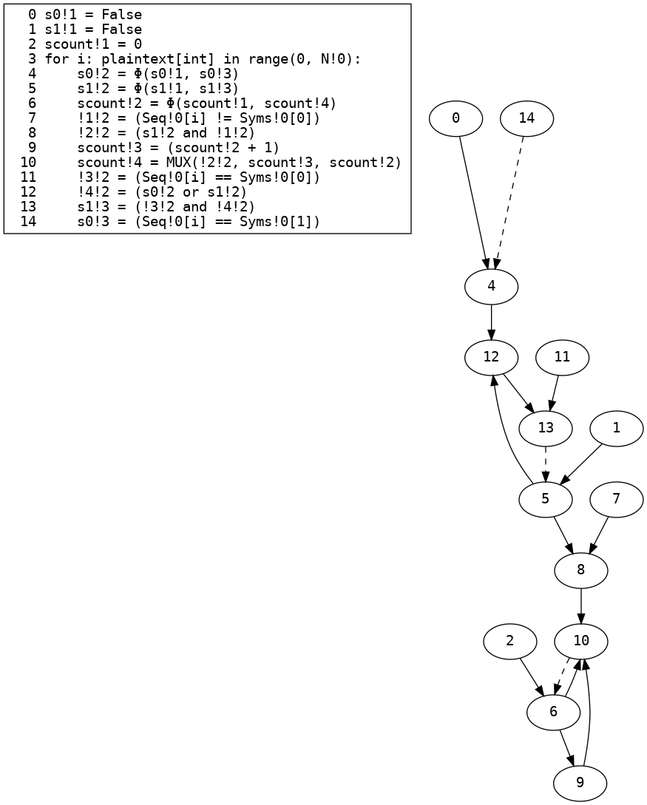
### Typed linear code with loops
```python
def count_10s(Seq: shared, N: plaintext, Syms: shared):
    s0!1: plaintext = False
    s1!1: plaintext = False
    scount!1: plaintext = 0
    for i: plaintext in range(0, N!0):
        s0!2: shared = Φ(s0!1, s0!3)
        s1!2: shared = Φ(s1!1, s1!3)
        scount!2: shared = Φ(scount!1, scount!4)
        !1!2: shared = (Seq!0[i] != Syms!0[0])
        !2!2: shared = (s1!2 and !1!2)
        scount!3: shared = (scount!2 + 1)
        scount!4: shared = MUX(!2!2, scount!3, scount!2)
        !3!2: shared = (Seq!0[i] == Syms!0[0])
        !4!2: shared = (s0!2 or s1!2)
        s1!3: shared = (!3!2 and !4!2)
        s0!3: shared = (Seq!0[i] == Syms!0[1])
    return scount!2
```
## `count_123`
### Input
```python
def count_123(Seq: list[int], N, Syms: list[int]):
    """
    Computes the number of instances of regex a*b*c* in a provided sequence.
    Syms is a list of form [a, b, c].
    """

    s1 = False
    s2 = False
    s3 = False
    c = 0

    for i in range(0, N):
        if Seq[i] == Syms[3] and (s2 or s1):
            c = c + 1
        s2 = (Seq[i] == Syms[2]) and (s1 or s2)
        s1 = Seq[i] == Syms[1]

    return c


seq = [1, 2, 3, 1, 3, 3, 4]
num_123s = count_123(seq, len(seq), [1, 2, 3])
print(num_123s)

```
### Restricted AST
```python
def count_123(Seq: shared, N: plaintext, Syms: shared):
    s1 = False
    s2 = False
    s3 = False
    c = 0
    for i: plaintext in range(0, N):
        if ((Seq[i] == Syms[3]) and (s2 or s1)):
            c = (c + 1)
        s2 = ((Seq[i] == Syms[2]) and (s1 or s2))
        s1 = (Seq[i] == Syms[1])
    return c
```
### Three-address code CFG
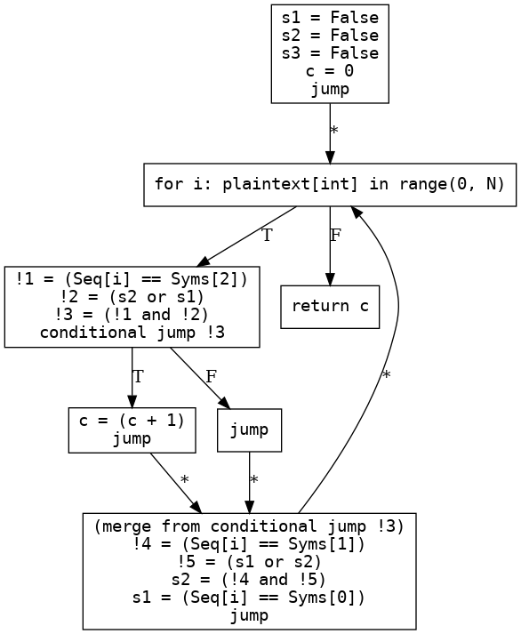
### SSA
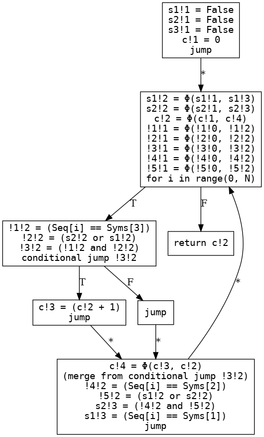
### SSA ϕ→MUX
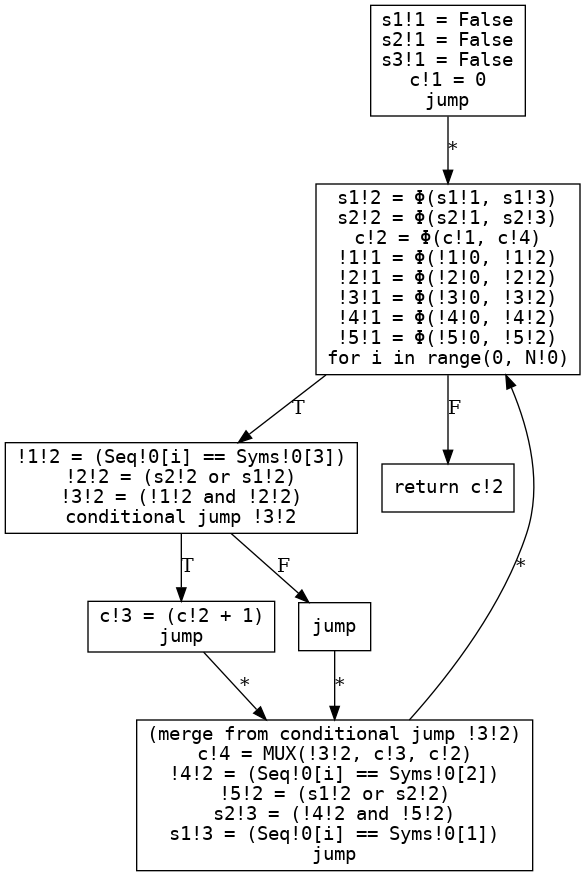
### Dead code elimination
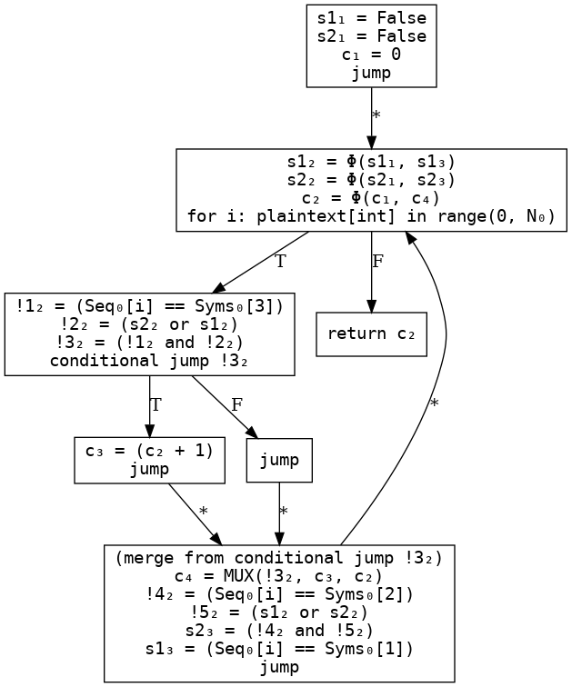
### Linear code with loops
```python
def count_123(Seq: shared, N: plaintext, Syms: shared):
    s1!1 = False
    s2!1 = False
    c!1 = 0
    for i: plaintext in range(0, N!0):
        s1!2 = Φ(s1!1, s1!3)
        s2!2 = Φ(s2!1, s2!3)
        c!2 = Φ(c!1, c!4)
        !1!2 = (Seq!0[i] == Syms!0[3])
        !2!2 = (s2!2 or s1!2)
        !3!2 = (!1!2 and !2!2)
        c!3 = (c!2 + 1)
        c!4 = MUX(!3!2, c!3, c!2)
        !4!2 = (Seq!0[i] == Syms!0[2])
        !5!2 = (s1!2 or s2!2)
        s2!3 = (!4!2 and !5!2)
        s1!3 = (Seq!0[i] == Syms!0[1])
    return c!2
```
### Dependency graph
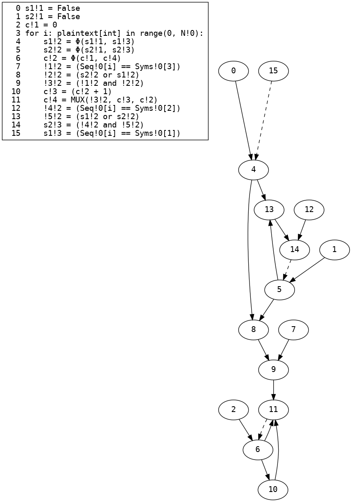
### Removal of infeasible edges
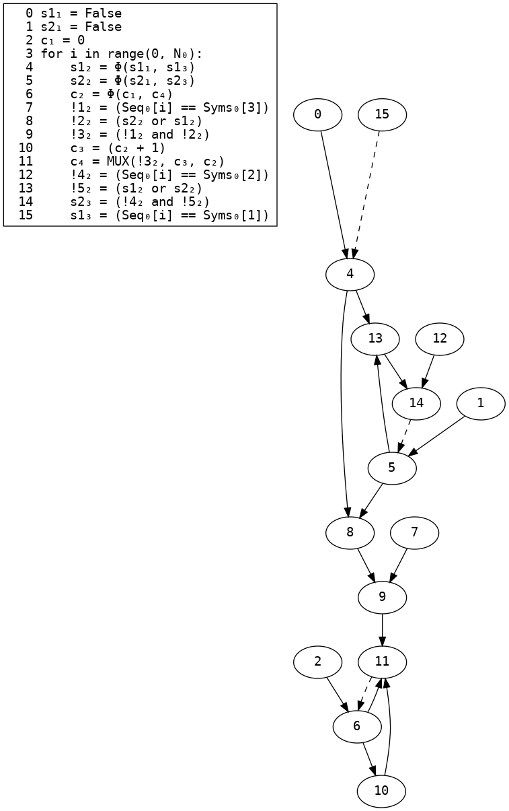
### Typed linear code with loops
```python
def count_123(Seq: shared, N: plaintext, Syms: shared):
    s1!1: plaintext = False
    s2!1: plaintext = False
    c!1: plaintext = 0
    for i: plaintext in range(0, N!0):
        s1!2: shared = Φ(s1!1, s1!3)
        s2!2: shared = Φ(s2!1, s2!3)
        c!2: shared = Φ(c!1, c!4)
        !1!2: shared = (Seq!0[i] == Syms!0[3])
        !2!2: shared = (s2!2 or s1!2)
        !3!2: shared = (!1!2 and !2!2)
        c!3: shared = (c!2 + 1)
        c!4: shared = MUX(!3!2, c!3, c!2)
        !4!2: shared = (Seq!0[i] == Syms!0[2])
        !5!2: shared = (s1!2 or s2!2)
        s2!3: shared = (!4!2 and !5!2)
        s1!3: shared = (Seq!0[i] == Syms!0[1])
    return c!2
```
## `histogram`
### Input
```python
import typing

# Array A contains a list of integers i in [1,num_bins]
# Array B is a same-size array, contains number of collected ratings for that bin
# E.g., below we have collected 10 1-star ratings, 1 3-star rating, etc., then 2 more 1-star rating etc.
# A = [0,2,1,0,3,4,2,3]
# B = [10,1,5,2,15,0,10,1000]
# We need to sum up num ratings in each bin to compute a histogram
# 1: 12 0-star ratings                                            
# 2: 5 1-star
# 3: 11 2-star
# 4: 1015 3-star
# 5: 0 4-star                                                            

# This is very similar to the crosstabs app in MOTION
# But we were first to suggest this as a benchmark :).
# requires: len(A) == len(B) = N
def histogram(A: list[int], B: list[int], N, num_bins):
  result: list[int] = []
  # initialize result to 0
  for i in range(num_bins):
    result = result + [0]
  for i in range(num_bins):
    for j in range(N):
      if A[j] == i:
        result[i] = result[i] + B[j]
  return result

A = A = [0,2,1,0,3,4,2,3]
B = [10,1,5,2,15,0,10,1000]
N = len(A)
result = histogram(A,B,N,5)
print(result)

```
### Restricted AST
```python
def histogram(A: shared, B: shared, N: plaintext, num_bins: plaintext):
    result = []
    for i: plaintext in range(0, num_bins):
        result = (result + [0])
    for i: plaintext in range(0, num_bins):
        for j: plaintext in range(0, N):
            if (A[j] == i):
                result[i] = (result[i] + B[j])
    return result
```
### Three-address code CFG

### SSA

### SSA ϕ→MUX

### Dead code elimination
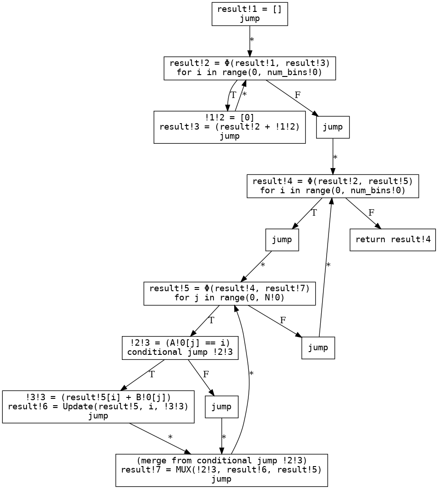
### Linear code with loops
```python
def histogram(A: shared, B: shared, N: plaintext, num_bins: plaintext):
    result!1 = []
    for i: plaintext in range(0, num_bins!0):
        result!2 = Φ(result!1, result!3)
        !1!2 = [0]
        result!3 = (result!2 + !1!2)
    for i: plaintext in range(0, num_bins!0):
        result!4 = Φ(result!2, result!5)
        for j: plaintext in range(0, N!0):
            result!5 = Φ(result!4, result!7)
            !2!3 = (A!0[j] == i)
            !3!3 = (result!5[i] + B!0[j])
            result!6 = Update(result!5, i, !3!3)
            result!7 = MUX(!2!3, result!6, result!5)
    return result!4
```
### Dependency graph
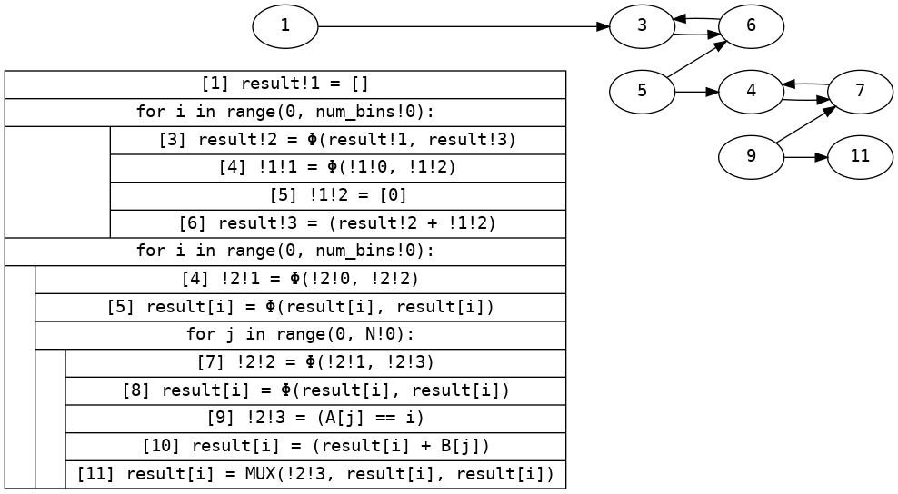
### Removal of infeasible edges

### Typed linear code with loops
```python
def histogram(A: shared, B: shared, N: plaintext, num_bins: plaintext):
    result!1: plaintext = []
    for i: plaintext in range(0, num_bins!0):
        result!2 = Φ(result!1, result!3)
        !1!2: plaintext = [0]
        result!3 = (result!2 + !1!2)
    for i: plaintext in range(0, num_bins!0):
        result!4: shared = Φ(result!2, result!5)
        for j: plaintext in range(0, N!0):
            result!5: shared = Φ(result!4, result!7)
            !2!3: shared = (A!0[j] == i)
            !3!3: shared = (result!5[i] + B!0[j])
            result!6 = Update(result!5, i, !3!3)
            result!7: shared = MUX(!2!3, result!6, result!5)
    return result!4
```
## `infeasible_edges_example`
### Input
```python
def foo(A, B, C, D, N):
    for i in range(N):
        A[i] = B[i] + 10
        B[i] = A[i] * D[i - 1]
        C[i] = A[i] * D[i - 1]
        D[i] = B[i] * C[i]
    return (A, B, C, D)

```
### Restricted AST
```python
def foo(A: plaintext, B: plaintext, C: plaintext, D: plaintext, N: plaintext):
    for i: plaintext in range(0, N):
        A[i] = (B[i] + 10)
        B[i] = (A[i] * D[(i - 1)])
        C[i] = (A[i] * D[(i - 1)])
        D[i] = (B[i] * C[i])
    return (A, B, C, D)
```
### Three-address code CFG
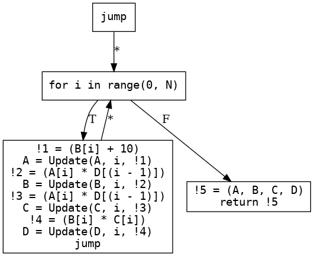
### SSA
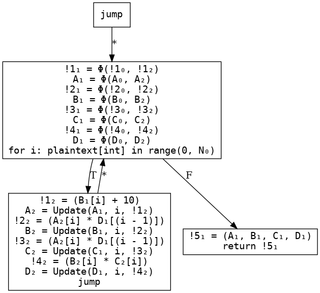
### SSA ϕ→MUX

### Dead code elimination
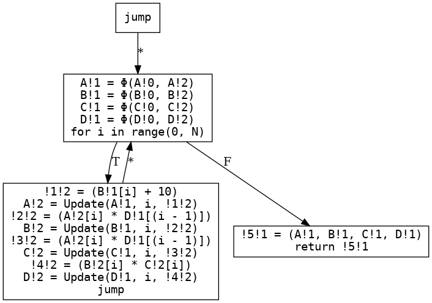
### Linear code with loops
```python
def foo(A: plaintext, B: plaintext, C: plaintext, D: plaintext, N: plaintext):
    for i: plaintext in range(0, N!0):
        A!1 = Φ(A!0, A!2)
        B!1 = Φ(B!0, B!2)
        C!1 = Φ(C!0, C!2)
        D!1 = Φ(D!0, D!2)
        !1!2 = (B!1[i] + 10)
        A!2 = Update(A!1, i, !1!2)
        !2!2 = (A!2[i] * D!1[(i - 1)])
        B!2 = Update(B!1, i, !2!2)
        !3!2 = (A!2[i] * D!1[(i - 1)])
        C!2 = Update(C!1, i, !3!2)
        !4!2 = (B!2[i] * C!2[i])
        D!2 = Update(D!1, i, !4!2)
    !5!1 = (A!1, B!1, C!1, D!1)
    return !5!1
```
### Dependency graph
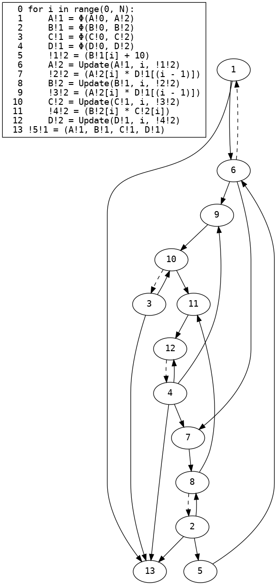
### Removal of infeasible edges
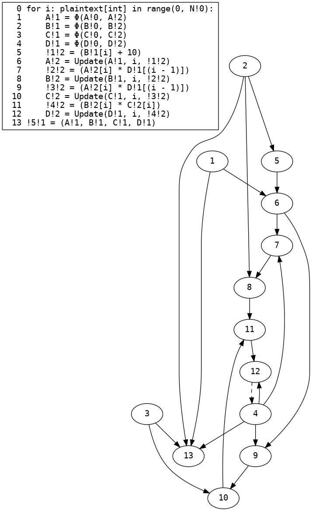
### Typed linear code with loops
```python
def foo(A: plaintext, B: plaintext, C: plaintext, D: plaintext, N: plaintext):
    for i: plaintext in range(0, N!0):
        A!1 = Φ(A!0, A!2)
        B!1 = Φ(B!0, B!2)
        C!1 = Φ(C!0, C!2)
        D!1 = Φ(D!0, D!2)
        !1!2 = (B!1[i] + 10)
        A!2 = Update(A!1, i, !1!2)
        !2!2 = (A!2[i] * D!1[(i - 1)])
        B!2 = Update(B!1, i, !2!2)
        !3!2 = (A!2[i] * D!1[(i - 1)])
        C!2 = Update(C!1, i, !3!2)
        !4!2 = (B!2[i] * C!2[i])
        D!2 = Update(D!1, i, !4!2)
    !5!1 = (A!1, B!1, C!1, D!1)
    return !5!1
```
## `inner_product`
### Input
```python
import typing

def ip(A: list[int], B: list[int], N):
  sum = 0
  for i in range(0,N):
    temp = A[i]*B[i]
    sum = sum + temp
  return sum

A = [1,2,3]
B = [4,5,6]
sum = ip(A,B,3)
print(sum)

```
### Restricted AST
```python
def ip(A: shared, B: shared, N: plaintext):
    sum = 0
    for i: plaintext in range(0, N):
        temp = (A[i] * B[i])
        sum = (sum + temp)
    return sum
```
### Three-address code CFG

### SSA

### SSA ϕ→MUX

### Dead code elimination
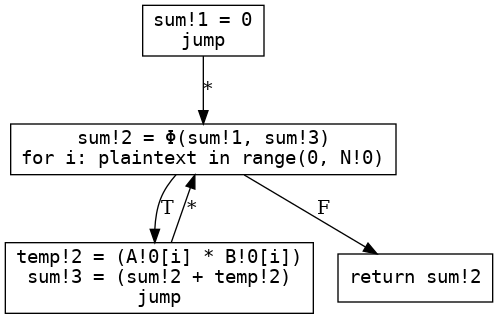
### Linear code with loops
```python
def ip(A: shared, B: shared, N: plaintext):
    sum!1 = 0
    for i: plaintext in range(0, N!0):
        sum!2 = Φ(sum!1, sum!3)
        temp!2 = (A!0[i] * B!0[i])
        sum!3 = (sum!2 + temp!2)
    return sum!2
```
### Dependency graph
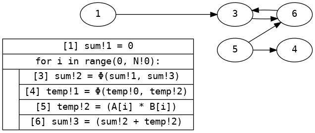
### Removal of infeasible edges

### Typed linear code with loops
```python
def ip(A: shared, B: shared, N: plaintext):
    sum!1: plaintext = 0
    for i: plaintext in range(0, N!0):
        sum!2: shared = Φ(sum!1, sum!3)
        temp!2: shared = (A!0[i] * B!0[i])
        sum!3: shared = (sum!2 + temp!2)
    return sum!2
```
## `longest_102`
### Input
```python
def longest_102(Seq: list[int], N, Syms: list[int]):
    """
    Computes the length of the largest instance of regex a(b*)c in a provided sequence.
    Syms is a list of form [a, b, c].
    """
    s0 = False

    max_len = 0
    length = 0

    for i in range(0, N):
        s1 = s0 and (Seq[i] == Syms[2])
        s0 = (Seq[i] == Syms[1]) or (s0 and (Seq[i] == Syms[0]))

        if s1 or s0:
            length = length + 1
        else:
            length = 0

        if s1 and max_len < length:
            max_len = length

    return max_len


seq = [1, 0, 2, 1, 0, 0, 2, 1, 2, 2]
longest_102_len = longest_102(seq, len(seq), [1, 0, 2])
print(longest_102_len)

```
### Restricted AST
```python
def longest_102(Seq: shared, N: plaintext, Syms: shared):
    s0 = False
    max_len = 0
    length = 0
    for i: plaintext in range(0, N):
        s1 = (s0 and (Seq[i] == Syms[2]))
        s0 = ((Seq[i] == Syms[1]) or (s0 and (Seq[i] == Syms[0])))
        if (s1 or s0):
            length = (length + 1)
        else:
            length = 0
        if (s1 and (max_len < length)):
            max_len = length
    return max_len
```
### Three-address code CFG
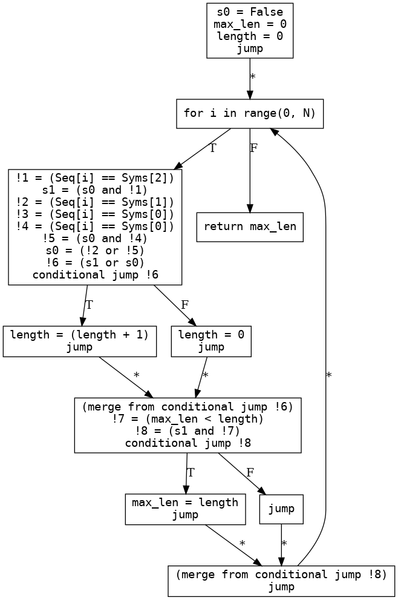
### SSA
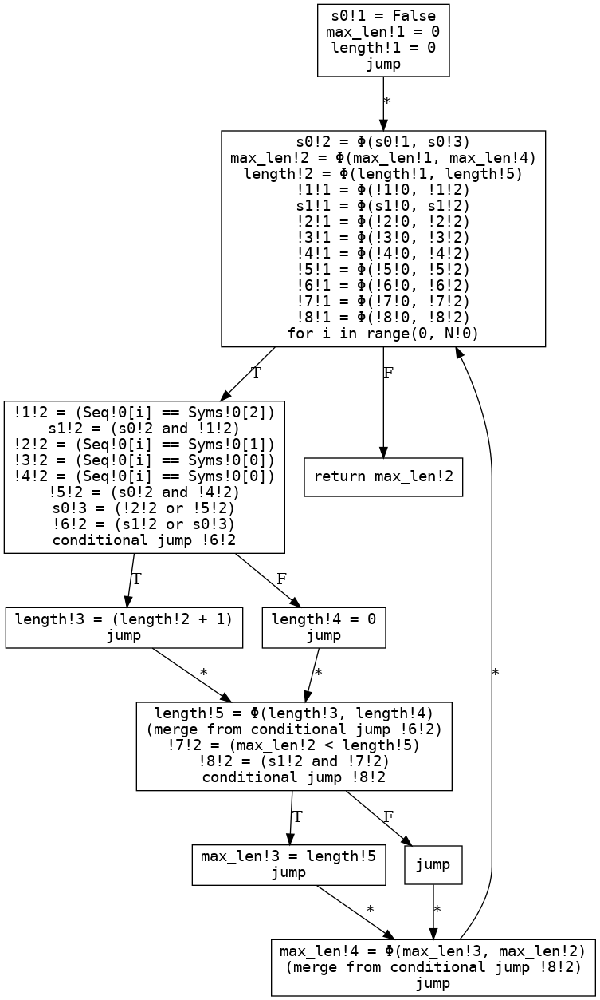
### SSA ϕ→MUX
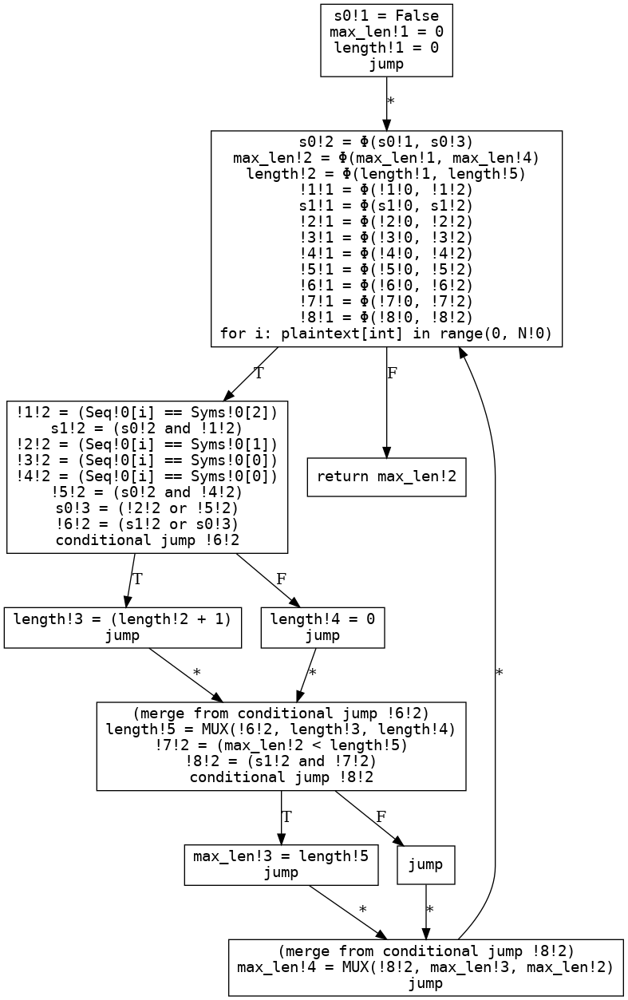
### Dead code elimination
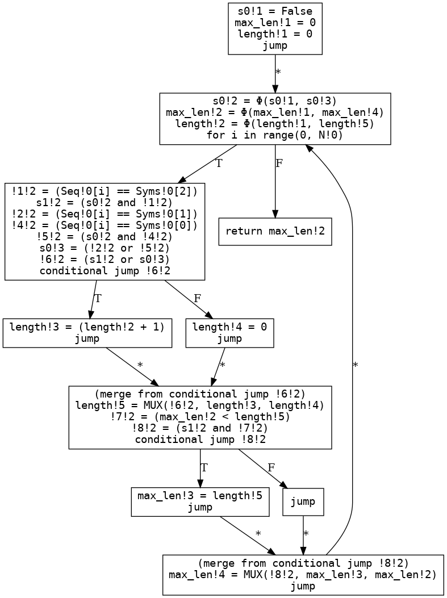
### Linear code with loops
```python
def longest_102(Seq: shared, N: plaintext, Syms: shared):
    s0!1 = False
    max_len!1 = 0
    length!1 = 0
    for i: plaintext in range(0, N!0):
        s0!2 = Φ(s0!1, s0!3)
        max_len!2 = Φ(max_len!1, max_len!4)
        length!2 = Φ(length!1, length!5)
        !1!2 = (Seq!0[i] == Syms!0[2])
        s1!2 = (s0!2 and !1!2)
        !2!2 = (Seq!0[i] == Syms!0[1])
        !4!2 = (Seq!0[i] == Syms!0[0])
        !5!2 = (s0!2 and !4!2)
        s0!3 = (!2!2 or !5!2)
        !6!2 = (s1!2 or s0!3)
        length!4 = 0
        length!3 = (length!2 + 1)
        length!5 = MUX(!6!2, length!3, length!4)
        !7!2 = (max_len!2 < length!5)
        !8!2 = (s1!2 and !7!2)
        max_len!3 = length!5
        max_len!4 = MUX(!8!2, max_len!3, max_len!2)
    return max_len!2
```
### Dependency graph
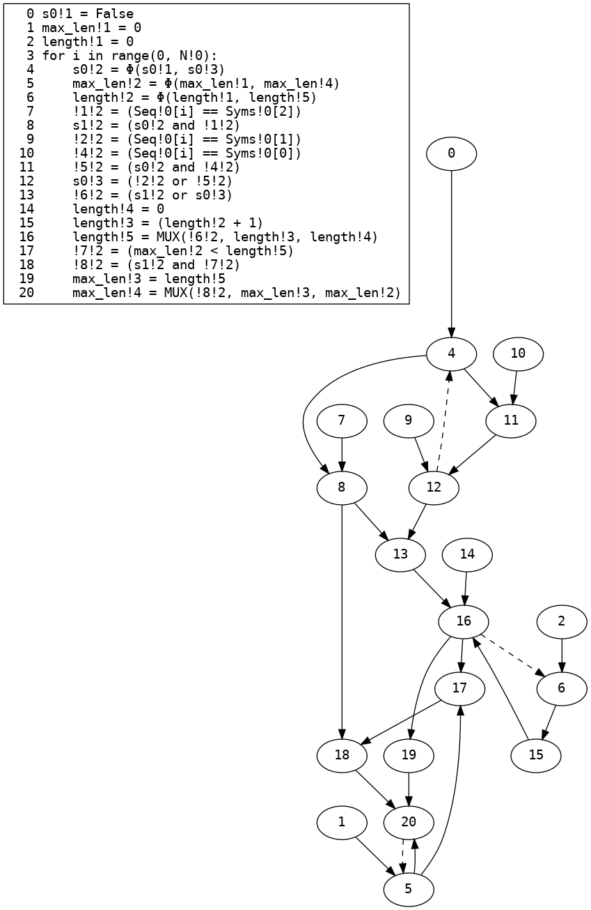
### Removal of infeasible edges
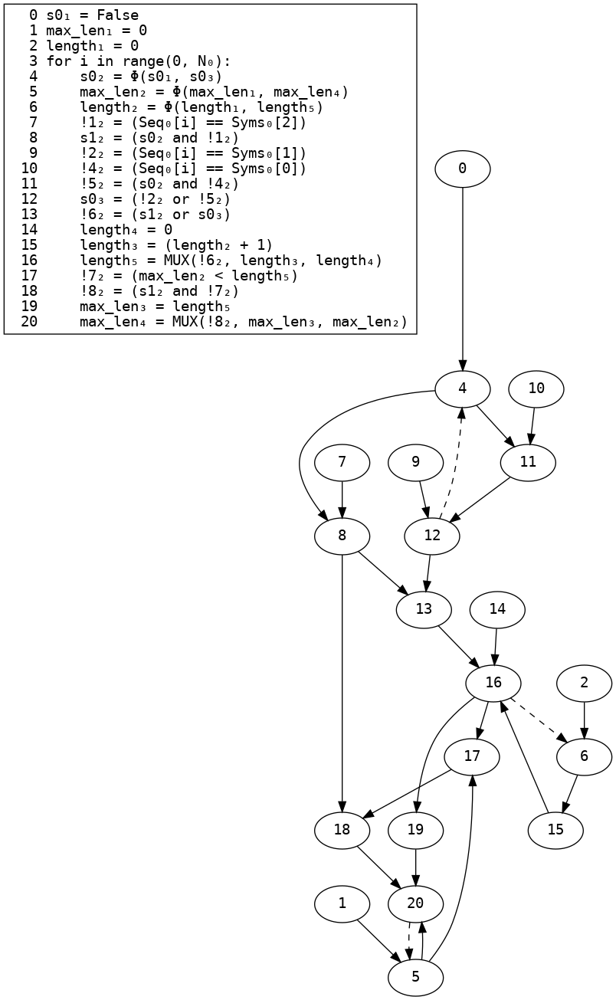
### Typed linear code with loops
```python
def longest_102(Seq: shared, N: plaintext, Syms: shared):
    s0!1: plaintext = False
    max_len!1: plaintext = 0
    length!1: plaintext = 0
    for i: plaintext in range(0, N!0):
        s0!2: shared = Φ(s0!1, s0!3)
        max_len!2: shared = Φ(max_len!1, max_len!4)
        length!2: shared = Φ(length!1, length!5)
        !1!2: shared = (Seq!0[i] == Syms!0[2])
        s1!2: shared = (s0!2 and !1!2)
        !2!2: shared = (Seq!0[i] == Syms!0[1])
        !4!2: shared = (Seq!0[i] == Syms!0[0])
        !5!2: shared = (s0!2 and !4!2)
        s0!3: shared = (!2!2 or !5!2)
        !6!2: shared = (s1!2 or s0!3)
        length!4: plaintext = 0
        length!3: shared = (length!2 + 1)
        length!5: shared = MUX(!6!2, length!3, length!4)
        !7!2: shared = (max_len!2 < length!5)
        !8!2: shared = (s1!2 and !7!2)
        max_len!3: shared = length!5
        max_len!4: shared = MUX(!8!2, max_len!3, max_len!2)
    return max_len!2
```
## `longest_1s`
### Input
```python
def longest_1s(Seq: list[int], N, Sym: int):
    """
    Computes length of the longest sequence of form (a*).
    Sym is the integer a.
    """

    max_length = 0
    length = 0

    for i in range(1, N):
        if Seq[i] == Sym:
            length = length + 1
        else:
            length = 0

        if length > max_length:
            max_length = length

    return max_length


seq = [0, 0, 1, 1, 1, 1, 0, 1, 0]
longest_1s_len = longest_1s(seq, len(seq), 1)
print(longest_1s_len)

```
### Restricted AST
```python
def longest_1s(Seq: shared, N: plaintext, Sym: shared):
    max_length = 0
    length = 0
    for i: plaintext in range(1, N):
        if (Seq[i] == Sym):
            length = (length + 1)
        else:
            length = 0
        if (length > max_length):
            max_length = length
    return max_length
```
### Three-address code CFG
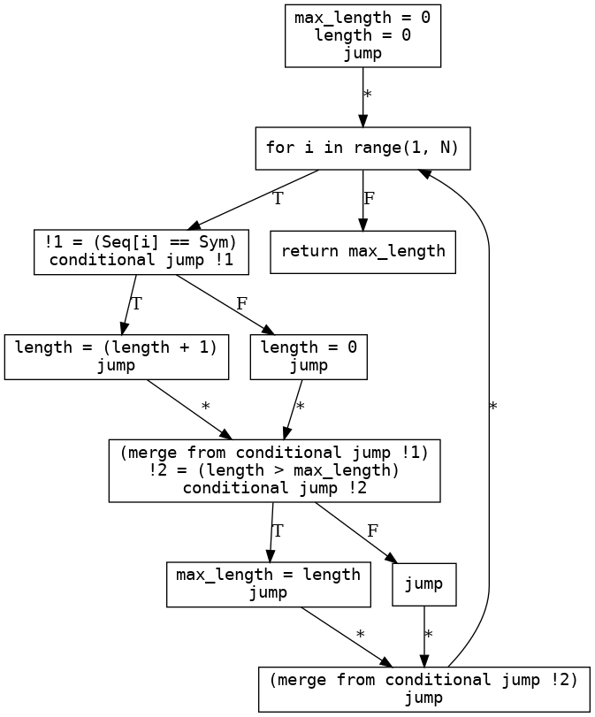
### SSA
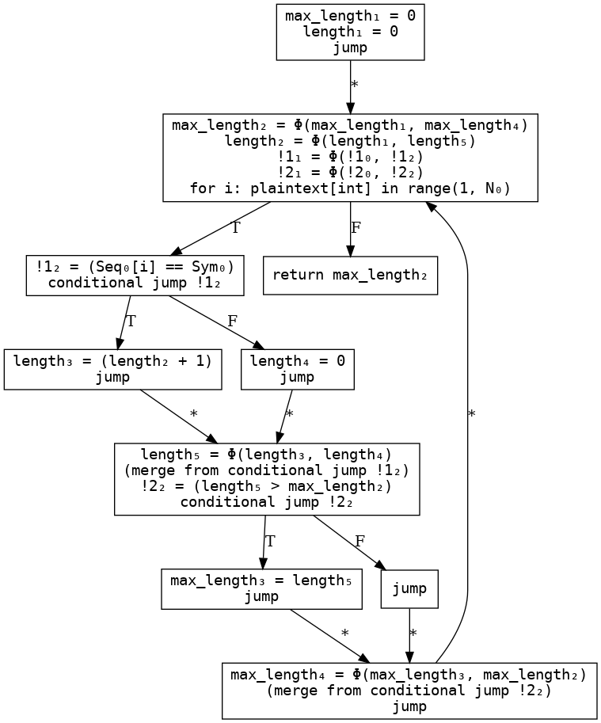
### SSA ϕ→MUX
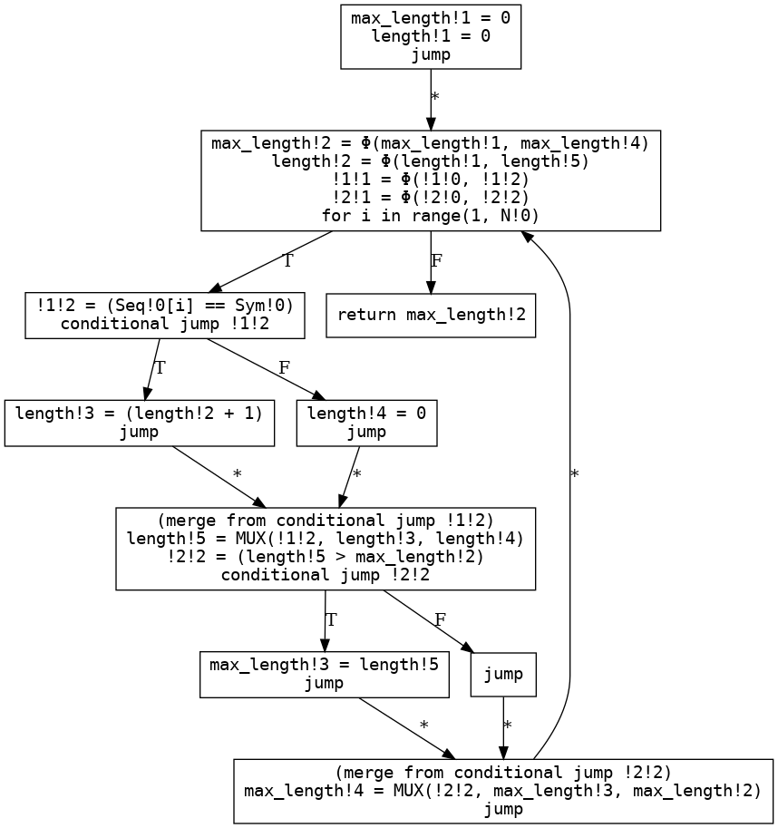
### Dead code elimination
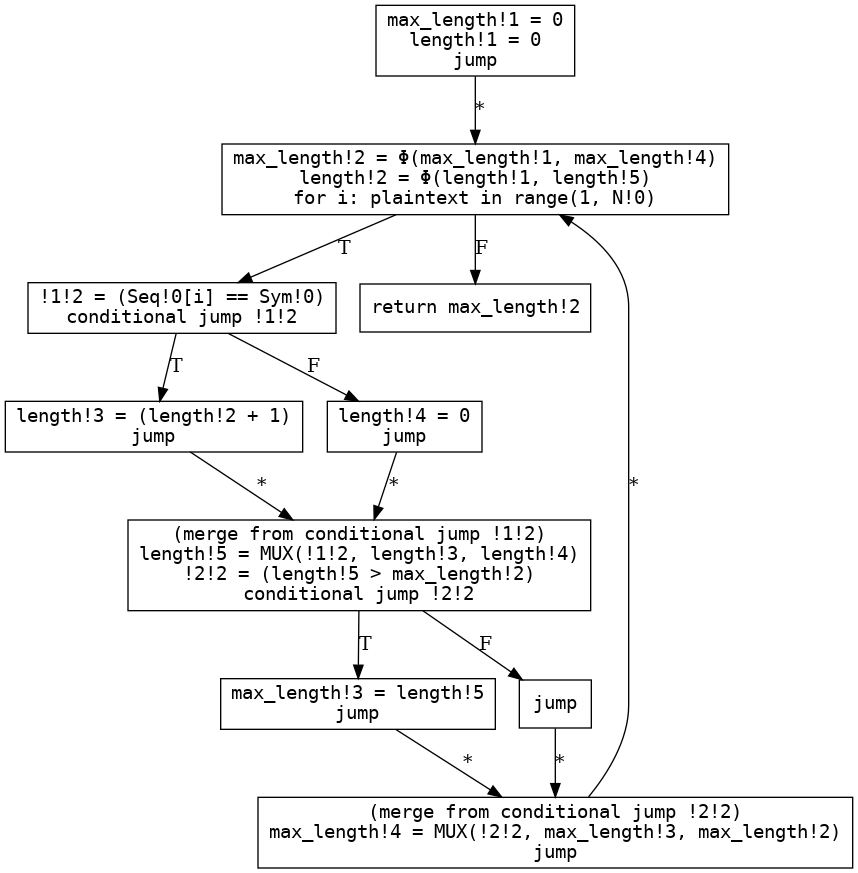
### Linear code with loops
```python
def longest_1s(Seq: shared, N: plaintext, Sym: shared):
    max_length!1 = 0
    length!1 = 0
    for i: plaintext in range(1, N!0):
        max_length!2 = Φ(max_length!1, max_length!4)
        length!2 = Φ(length!1, length!5)
        !1!2 = (Seq!0[i] == Sym!0)
        length!4 = 0
        length!3 = (length!2 + 1)
        length!5 = MUX(!1!2, length!3, length!4)
        !2!2 = (length!5 > max_length!2)
        max_length!3 = length!5
        max_length!4 = MUX(!2!2, max_length!3, max_length!2)
    return max_length!2
```
### Dependency graph
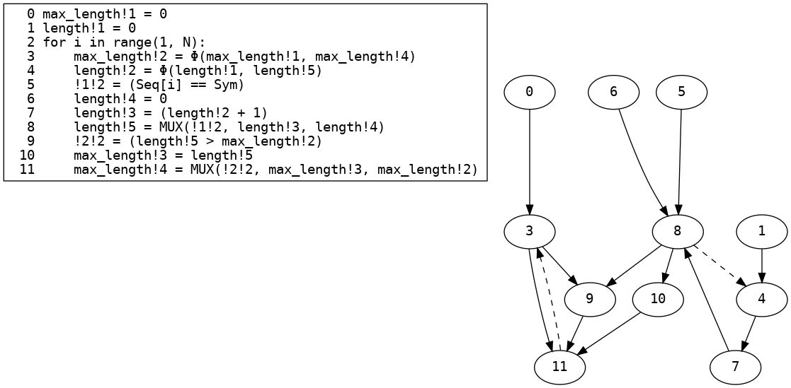
### Removal of infeasible edges
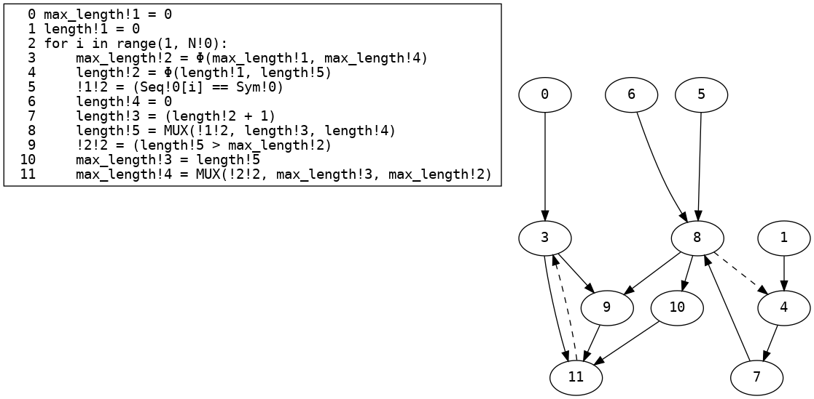
### Typed linear code with loops
```python
def longest_1s(Seq: shared, N: plaintext, Sym: shared):
    max_length!1: plaintext = 0
    length!1: plaintext = 0
    for i: plaintext in range(1, N!0):
        max_length!2: shared = Φ(max_length!1, max_length!4)
        length!2: shared = Φ(length!1, length!5)
        !1!2: shared = (Seq!0[i] == Sym!0)
        length!4: plaintext = 0
        length!3: shared = (length!2 + 1)
        length!5: shared = MUX(!1!2, length!3, length!4)
        !2!2: shared = (length!5 > max_length!2)
        max_length!3: shared = length!5
        max_length!4: shared = MUX(!2!2, max_length!3, max_length!2)
    return max_length!2
```
## `longest_even_0`
### Input
```python
def longest_even_0(Seq: list[int], N, Sym: int):
    """
    Computes the length of the longest regex of form (a*) which has an even length
    Sym is the symbol a
    """

    current_length = 0
    max_length = 0

    for i in range(1, N):
        if Seq[i] == Sym:
            current_length = current_length + 1
        else:
            current_length = 0

        tmp_max_len = max_length
        if current_length > max_length:
            tmp_max_len = current_length

        if tmp_max_len % 2 == 0:
            max_length = tmp_max_len

    return max_length

```
### Restricted AST
```python
def longest_even_0(Seq: shared, N: plaintext, Sym: shared):
    current_length = 0
    max_length = 0
    for i: plaintext in range(1, N):
        if (Seq[i] == Sym):
            current_length = (current_length + 1)
        else:
            current_length = 0
        tmp_max_len = max_length
        if (current_length > max_length):
            tmp_max_len = current_length
        if ((tmp_max_len % 2) == 0):
            max_length = tmp_max_len
    return max_length
```
### Three-address code CFG
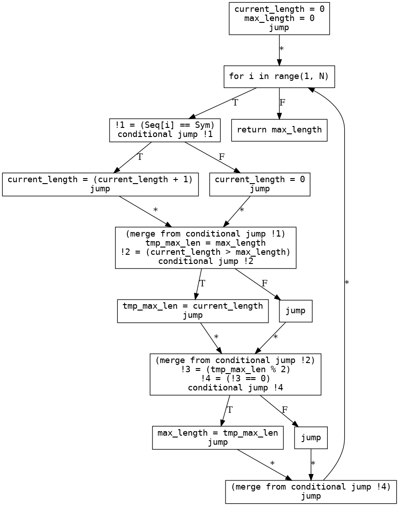
### SSA
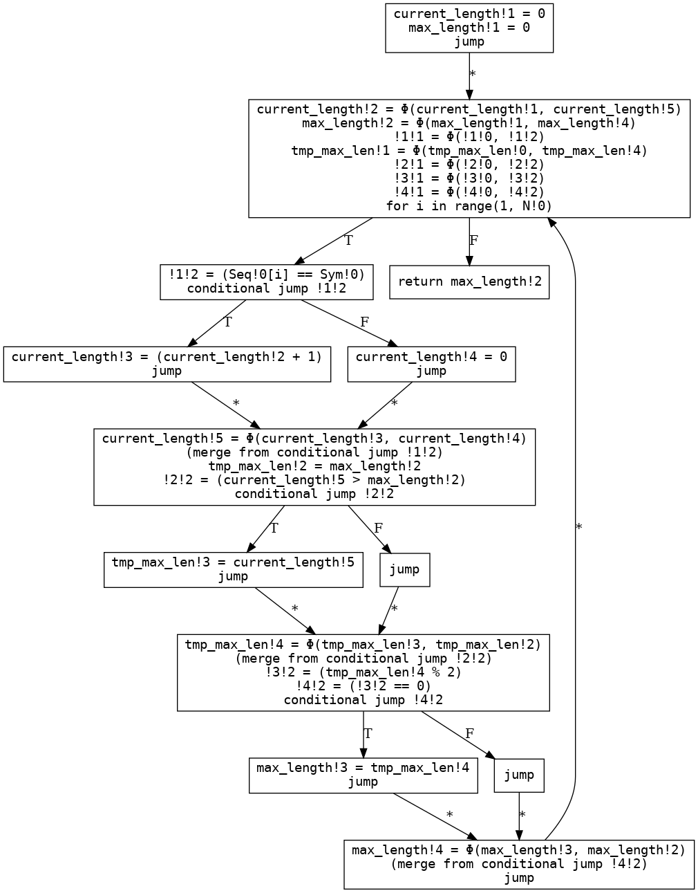
### SSA ϕ→MUX
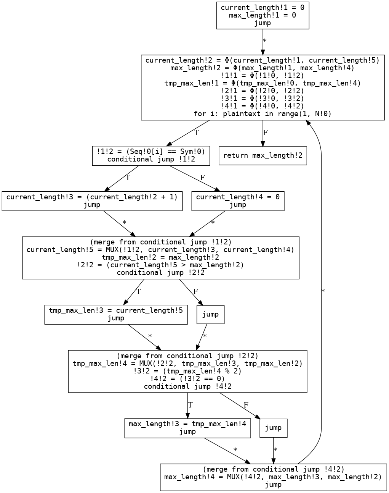
### Dead code elimination
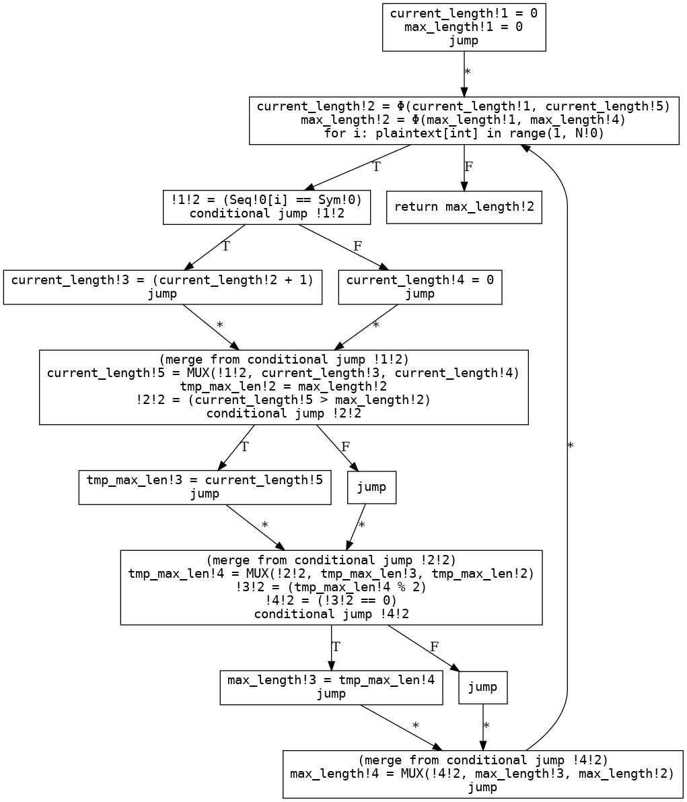
### Linear code with loops
```python
def longest_even_0(Seq: shared, N: plaintext, Sym: shared):
    current_length!1 = 0
    max_length!1 = 0
    for i: plaintext in range(1, N!0):
        current_length!2 = Φ(current_length!1, current_length!5)
        max_length!2 = Φ(max_length!1, max_length!4)
        !1!2 = (Seq!0[i] == Sym!0)
        current_length!4 = 0
        current_length!3 = (current_length!2 + 1)
        current_length!5 = MUX(!1!2, current_length!3, current_length!4)
        tmp_max_len!2 = max_length!2
        !2!2 = (current_length!5 > max_length!2)
        tmp_max_len!3 = current_length!5
        tmp_max_len!4 = MUX(!2!2, tmp_max_len!3, tmp_max_len!2)
        !3!2 = (tmp_max_len!4 % 2)
        !4!2 = (!3!2 == 0)
        max_length!3 = tmp_max_len!4
        max_length!4 = MUX(!4!2, max_length!3, max_length!2)
    return max_length!2
```
### Dependency graph
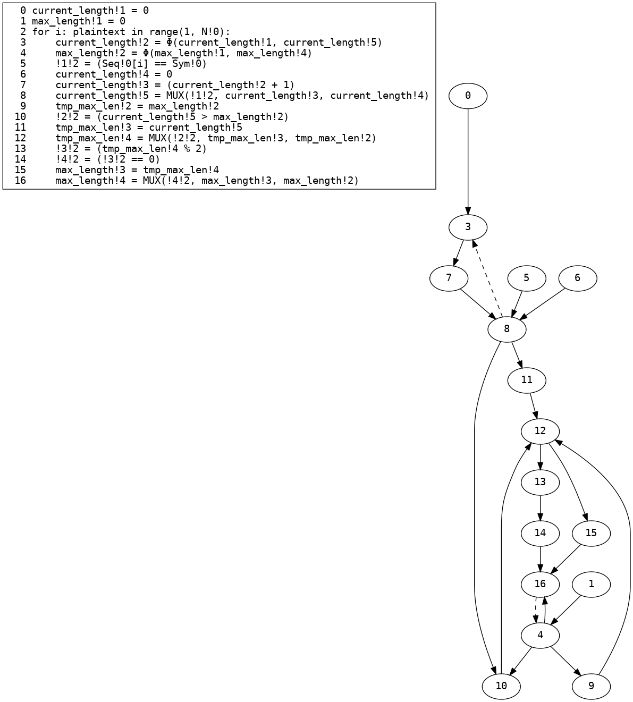
### Removal of infeasible edges
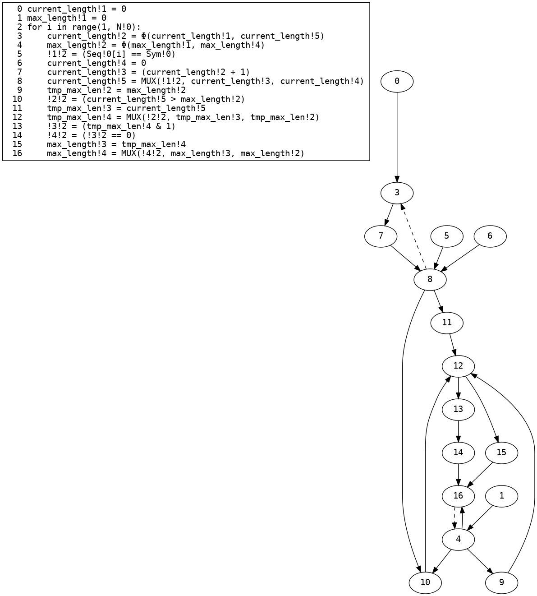
### Typed linear code with loops
```python
def longest_even_0(Seq: shared, N: plaintext, Sym: shared):
    current_length!1: plaintext = 0
    max_length!1: plaintext = 0
    for i: plaintext in range(1, N!0):
        current_length!2: shared = Φ(current_length!1, current_length!5)
        max_length!2: shared = Φ(max_length!1, max_length!4)
        !1!2: shared = (Seq!0[i] == Sym!0)
        current_length!4: plaintext = 0
        current_length!3: shared = (current_length!2 + 1)
        current_length!5: shared = MUX(!1!2, current_length!3, current_length!4)
        tmp_max_len!2: shared = max_length!2
        !2!2: shared = (current_length!5 > max_length!2)
        tmp_max_len!3: shared = current_length!5
        tmp_max_len!4: shared = MUX(!2!2, tmp_max_len!3, tmp_max_len!2)
        !3!2: shared = (tmp_max_len!4 % 2)
        !4!2: shared = (!3!2 == 0)
        max_length!3: shared = tmp_max_len!4
        max_length!4: shared = MUX(!4!2, max_length!3, max_length!2)
    return max_length!2
```
## `longest_odd_10`
### Input
```python
def longest_odd_10(Seq: list[int], N, Syms: list[int]):
    """
    Computes the length of the longest regex of form (ab)* which has an odd length
    Syms is the list [a, b]
    """

    current_length = 0
    max_length = 0

    s2 = False

    for i in range(0, N):
        s1 = s2 and (Seq[i] == Syms[1])

        if s1:
            current_length = current_length + 1
        elif not s2:
            current_length = 0

        if (current_length % 2 == 1) and (current_length > max_length):
            max_length = current_length

        s2 = Seq[i] == Syms[0]

    return max_length

```
### Restricted AST
```python
def longest_odd_10(Seq: shared, N: plaintext, Syms: shared):
    current_length = 0
    max_length = 0
    s2 = False
    for i: plaintext in range(0, N):
        s1 = (s2 and (Seq[i] == Syms[1]))
        if s1:
            current_length = (current_length + 1)
        else:
            if not s2:
                current_length = 0
        if (((current_length % 2) == 1) and (current_length > max_length)):
            max_length = current_length
        s2 = (Seq[i] == Syms[0])
    return max_length
```
### Three-address code CFG
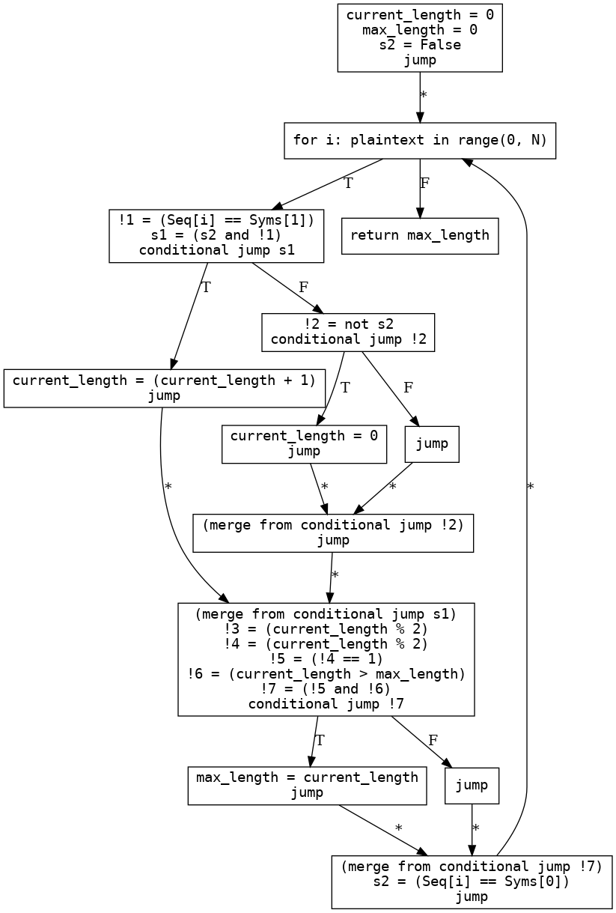
### SSA
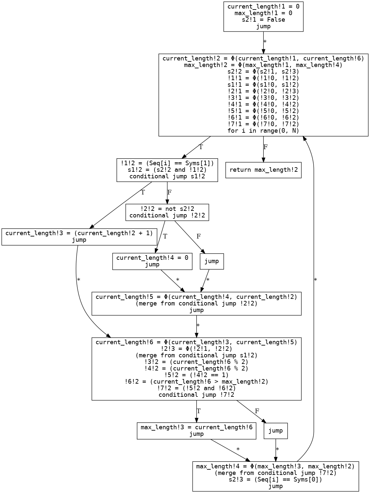
### SSA ϕ→MUX
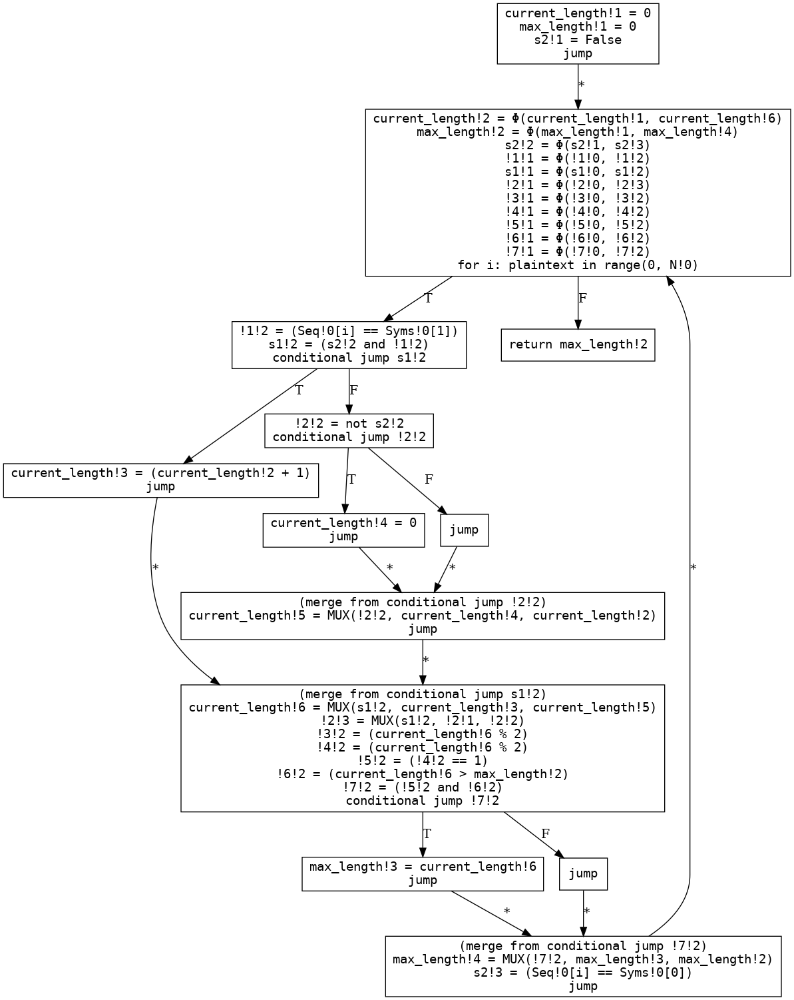
### Dead code elimination
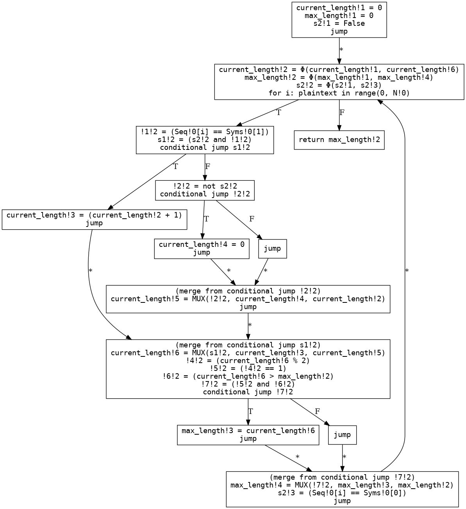
### Linear code with loops
```python
def longest_odd_10(Seq: shared, N: plaintext, Syms: shared):
    current_length!1 = 0
    max_length!1 = 0
    s2!1 = False
    for i: plaintext in range(0, N!0):
        current_length!2 = Φ(current_length!1, current_length!6)
        max_length!2 = Φ(max_length!1, max_length!4)
        s2!2 = Φ(s2!1, s2!3)
        !1!2 = (Seq!0[i] == Syms!0[1])
        s1!2 = (s2!2 and !1!2)
        !2!2 = not s2!2
        current_length!4 = 0
        current_length!5 = MUX(!2!2, current_length!4, current_length!2)
        current_length!3 = (current_length!2 + 1)
        current_length!6 = MUX(s1!2, current_length!3, current_length!5)
        !4!2 = (current_length!6 % 2)
        !5!2 = (!4!2 == 1)
        !6!2 = (current_length!6 > max_length!2)
        !7!2 = (!5!2 and !6!2)
        max_length!3 = current_length!6
        max_length!4 = MUX(!7!2, max_length!3, max_length!2)
        s2!3 = (Seq!0[i] == Syms!0[0])
    return max_length!2
```
### Dependency graph

### Removal of infeasible edges

### Typed linear code with loops
```python
def longest_odd_10(Seq: shared, N: plaintext, Syms: shared):
    current_length!1: plaintext = 0
    max_length!1: plaintext = 0
    s2!1: plaintext = False
    for i: plaintext in range(0, N!0):
        current_length!2: shared = Φ(current_length!1, current_length!6)
        max_length!2: shared = Φ(max_length!1, max_length!4)
        s2!2: shared = Φ(s2!1, s2!3)
        !1!2: shared = (Seq!0[i] == Syms!0[1])
        s1!2: shared = (s2!2 and !1!2)
        !2!2: shared = not s2!2
        current_length!4: plaintext = 0
        current_length!5: shared = MUX(!2!2, current_length!4, current_length!2)
        current_length!3: shared = (current_length!2 + 1)
        current_length!6: shared = MUX(s1!2, current_length!3, current_length!5)
        !4!2: shared = (current_length!6 % 2)
        !5!2: shared = (!4!2 == 1)
        !6!2: shared = (current_length!6 > max_length!2)
        !7!2: shared = (!5!2 and !6!2)
        max_length!3: shared = current_length!6
        max_length!4: shared = MUX(!7!2, max_length!3, max_length!2)
        s2!3: shared = (Seq!0[i] == Syms!0[0])
    return max_length!2
```
## `max_dist_between_syms`
### Input
```python
def max_dist_between_syms(Seq: list[int], N, Sym: int):
    max_dist = 0
    current_dist = 0
    for i in range(0, N):
        if not (Seq[i] == Sym):
            current_dist = current_dist + 1
        else:
            current_dist = 0

        if current_dist > max_dist:
            max_dist = current_dist
    return max_dist


seq = [1, 2, 1, 1, 2, 3, 4, 1]
max_dist = max_dist_between_syms(seq, len(seq), 1)
print(max_dist)

```
### Restricted AST
```python
def max_dist_between_syms(Seq: shared, N: plaintext, Sym: shared):
    max_dist = 0
    current_dist = 0
    for i: plaintext in range(0, N):
        if not (Seq[i] == Sym):
            current_dist = (current_dist + 1)
        else:
            current_dist = 0
        if (current_dist > max_dist):
            max_dist = current_dist
    return max_dist
```
### Three-address code CFG
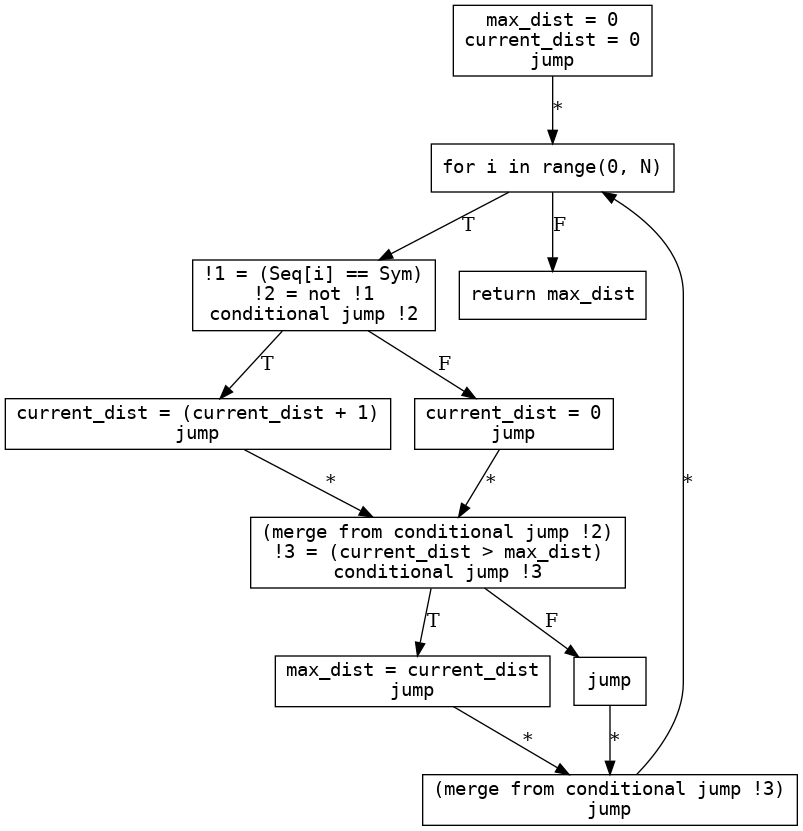
### SSA
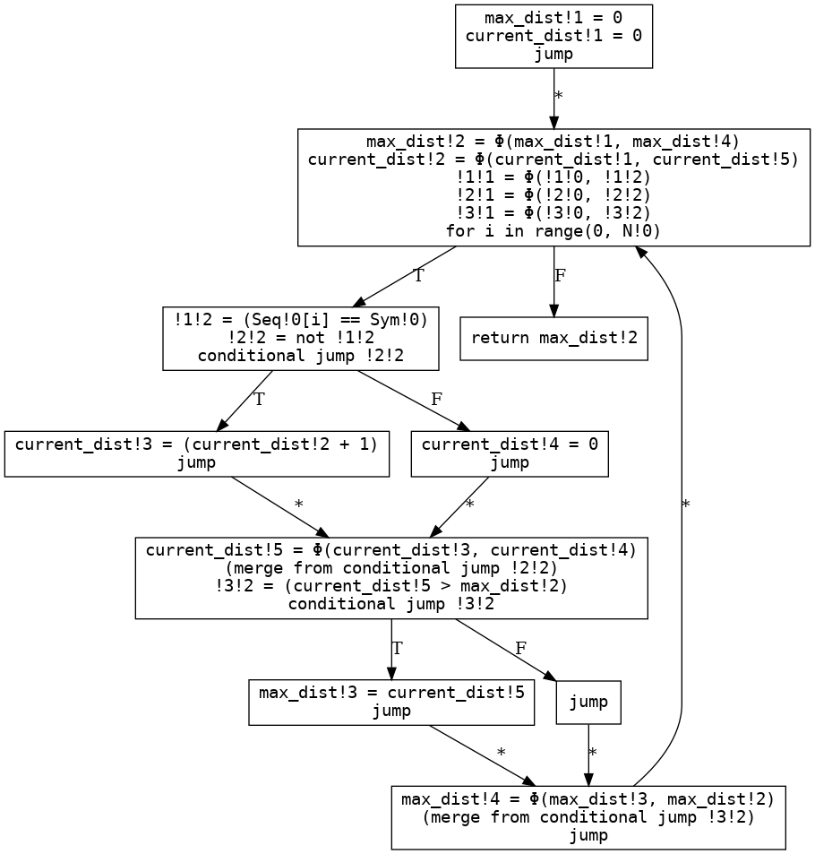
### SSA ϕ→MUX
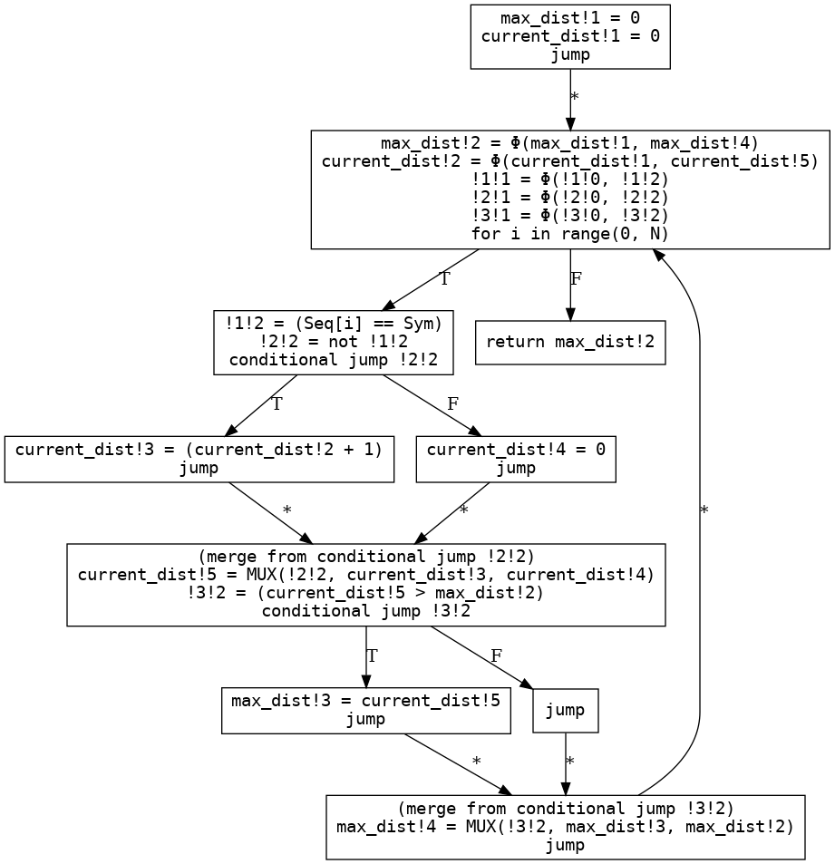
### Dead code elimination
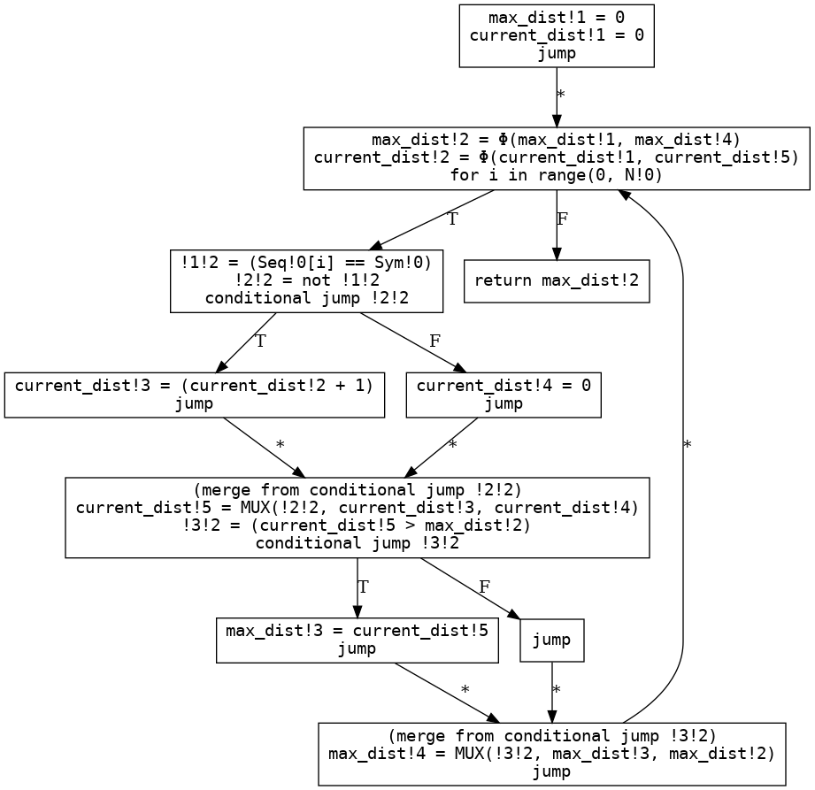
### Linear code with loops
```python
def max_dist_between_syms(Seq: shared, N: plaintext, Sym: shared):
    max_dist!1 = 0
    current_dist!1 = 0
    for i: plaintext in range(0, N!0):
        max_dist!2 = Φ(max_dist!1, max_dist!4)
        current_dist!2 = Φ(current_dist!1, current_dist!5)
        !1!2 = (Seq!0[i] == Sym!0)
        !2!2 = not !1!2
        current_dist!4 = 0
        current_dist!3 = (current_dist!2 + 1)
        current_dist!5 = MUX(!2!2, current_dist!3, current_dist!4)
        !3!2 = (current_dist!5 > max_dist!2)
        max_dist!3 = current_dist!5
        max_dist!4 = MUX(!3!2, max_dist!3, max_dist!2)
    return max_dist!2
```
### Dependency graph
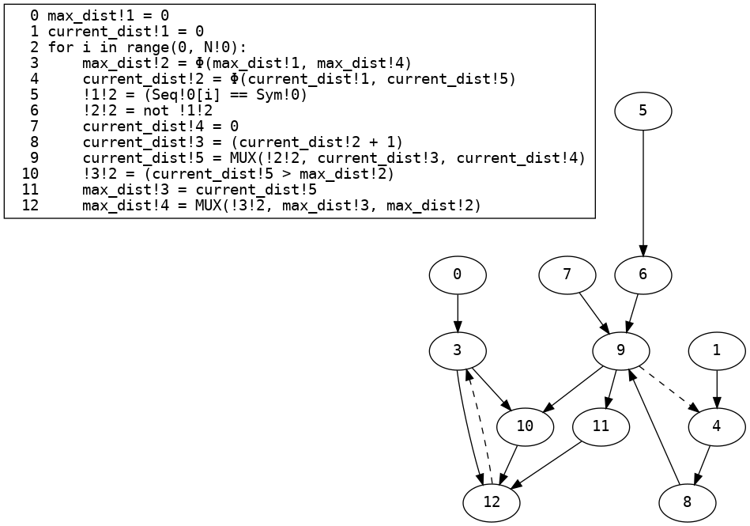
### Removal of infeasible edges
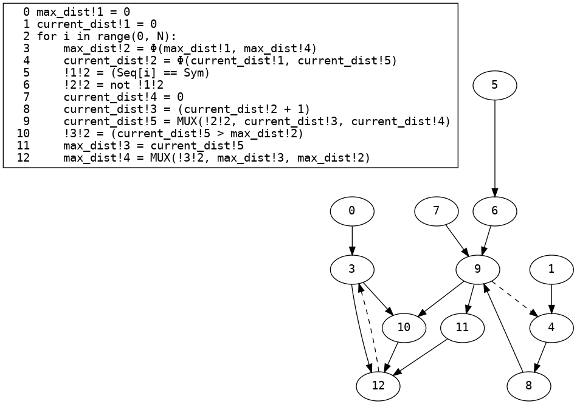
### Typed linear code with loops
```python
def max_dist_between_syms(Seq: shared, N: plaintext, Sym: shared):
    max_dist!1: plaintext = 0
    current_dist!1: plaintext = 0
    for i: plaintext in range(0, N!0):
        max_dist!2: shared = Φ(max_dist!1, max_dist!4)
        current_dist!2: shared = Φ(current_dist!1, current_dist!5)
        !1!2: shared = (Seq!0[i] == Sym!0)
        !2!2: shared = not !1!2
        current_dist!4: plaintext = 0
        current_dist!3: shared = (current_dist!2 + 1)
        current_dist!5: shared = MUX(!2!2, current_dist!3, current_dist!4)
        !3!2: shared = (current_dist!5 > max_dist!2)
        max_dist!3: shared = current_dist!5
        max_dist!4: shared = MUX(!3!2, max_dist!3, max_dist!2)
    return max_dist!2
```
## `max_sum_between_syms`
### Input
```python
def max_sum_between_syms(Seq: list[int], N, Sym: int):
    max_sum = 0
    current_sum = 0
    for i in range(0, N):
        if not (Seq[i] == Sym):
            current_sum = current_sum + Seq[i]
        else:
            current_sum = 0

        if current_sum > max_sum:
            max_sum = current_sum
    return max_sum


seq = [1, 2, 1, 1, 2, 3, 4, 1]
max_sum = max_sum_between_syms(seq, len(seq), 1)
print(max_sum)

```
### Restricted AST
```python
def max_sum_between_syms(Seq: shared, N: plaintext, Sym: shared):
    max_sum = 0
    current_sum = 0
    for i: plaintext in range(0, N):
        if not (Seq[i] == Sym):
            current_sum = (current_sum + Seq[i])
        else:
            current_sum = 0
        if (current_sum > max_sum):
            max_sum = current_sum
    return max_sum
```
### Three-address code CFG
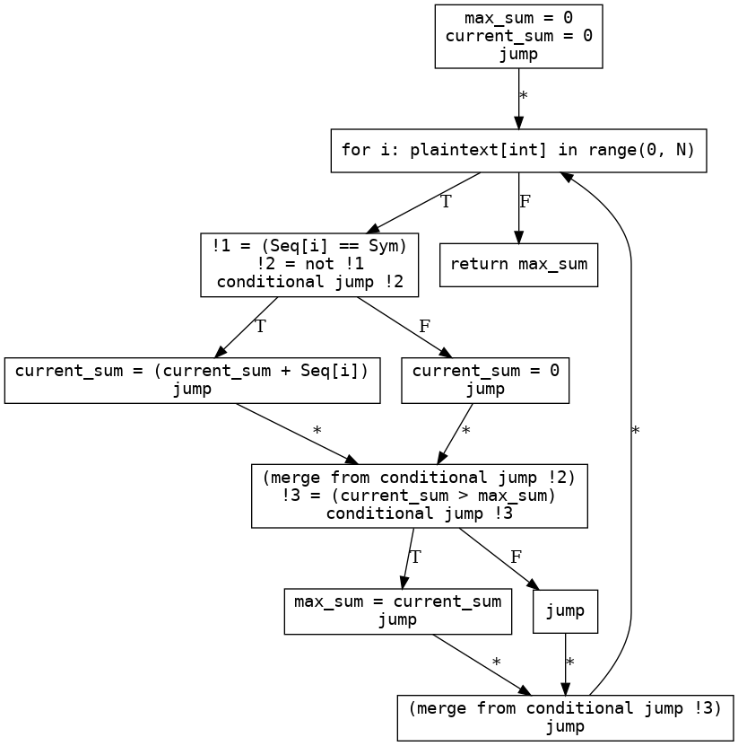
### SSA
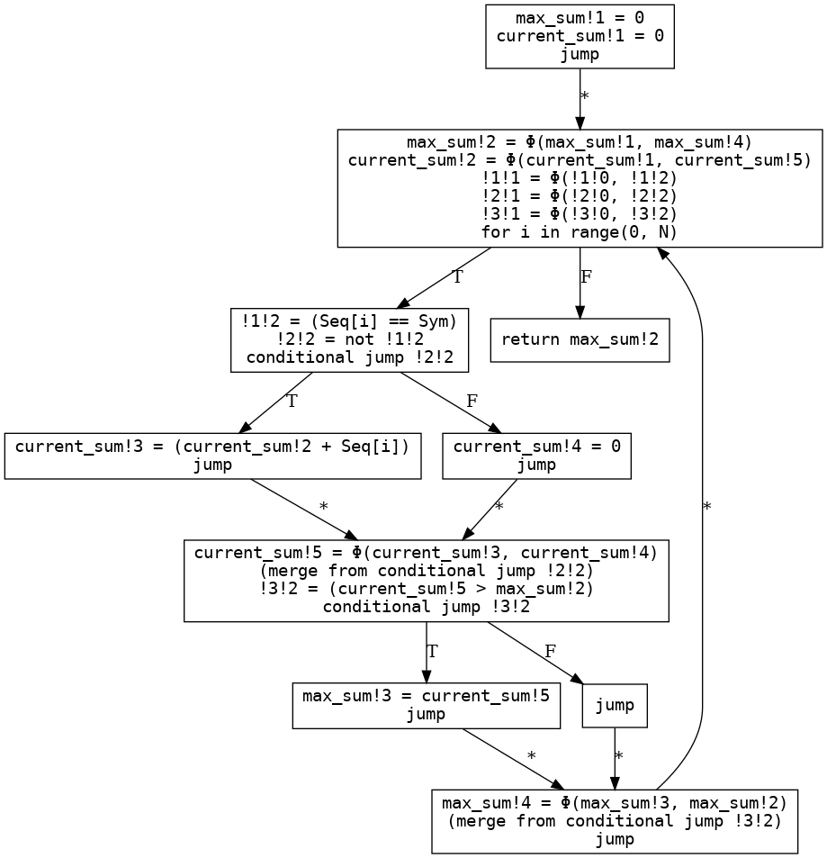
### SSA ϕ→MUX
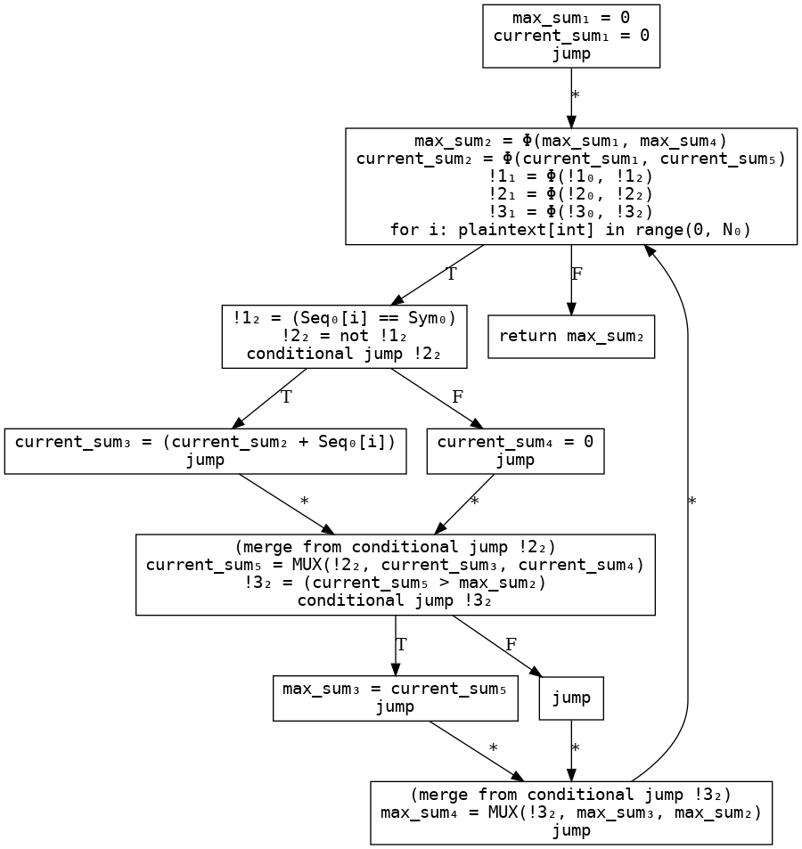
### Dead code elimination
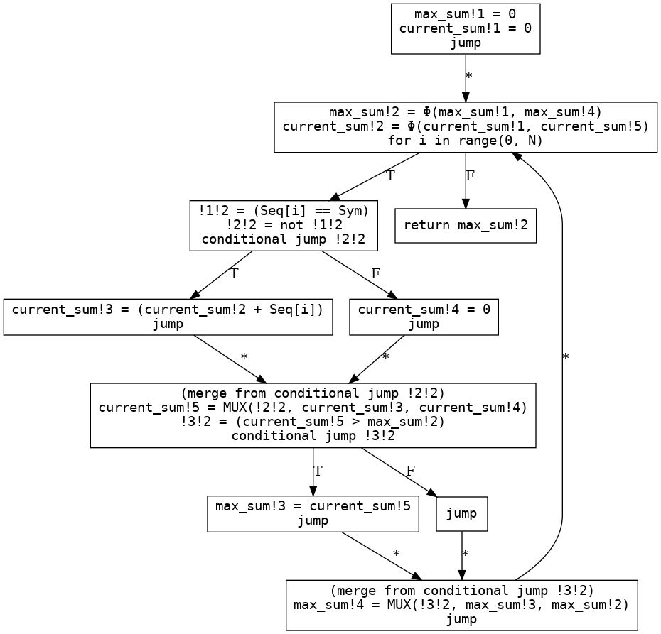
### Linear code with loops
```python
def max_sum_between_syms(Seq: shared, N: plaintext, Sym: shared):
    max_sum!1 = 0
    current_sum!1 = 0
    for i: plaintext in range(0, N!0):
        max_sum!2 = Φ(max_sum!1, max_sum!4)
        current_sum!2 = Φ(current_sum!1, current_sum!5)
        !1!2 = (Seq!0[i] == Sym!0)
        !2!2 = not !1!2
        current_sum!4 = 0
        current_sum!3 = (current_sum!2 + Seq!0[i])
        current_sum!5 = MUX(!2!2, current_sum!3, current_sum!4)
        !3!2 = (current_sum!5 > max_sum!2)
        max_sum!3 = current_sum!5
        max_sum!4 = MUX(!3!2, max_sum!3, max_sum!2)
    return max_sum!2
```
### Dependency graph
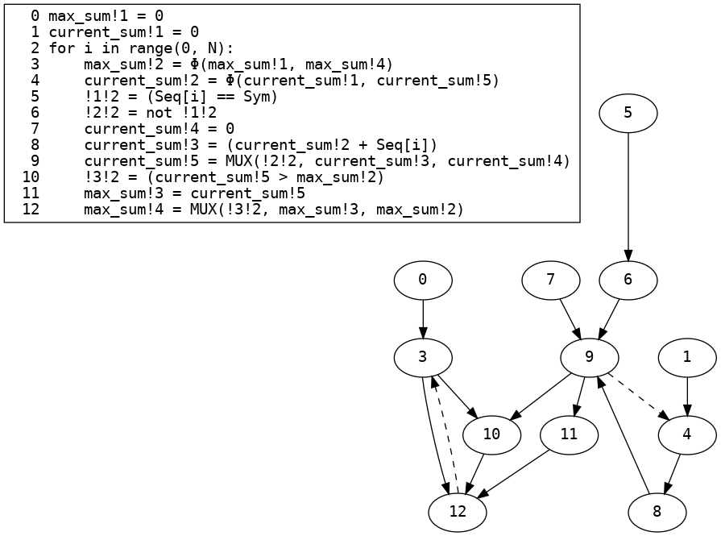
### Removal of infeasible edges
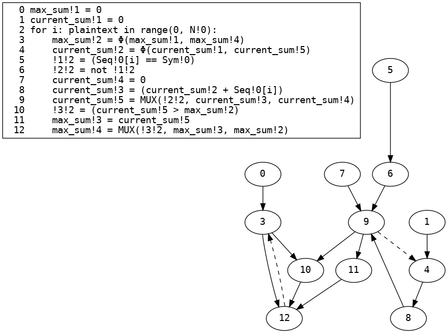
### Typed linear code with loops
```python
def max_sum_between_syms(Seq: shared, N: plaintext, Sym: shared):
    max_sum!1: plaintext = 0
    current_sum!1: plaintext = 0
    for i: plaintext in range(0, N!0):
        max_sum!2: shared = Φ(max_sum!1, max_sum!4)
        current_sum!2: shared = Φ(current_sum!1, current_sum!5)
        !1!2: shared = (Seq!0[i] == Sym!0)
        !2!2: shared = not !1!2
        current_sum!4: plaintext = 0
        current_sum!3: shared = (current_sum!2 + Seq!0[i])
        current_sum!5: shared = MUX(!2!2, current_sum!3, current_sum!4)
        !3!2: shared = (current_sum!5 > max_sum!2)
        max_sum!3: shared = current_sum!5
        max_sum!4: shared = MUX(!3!2, max_sum!3, max_sum!2)
    return max_sum!2
```
## `minimal_points`
### Input
```python
def minimal_points(X_coords: list[int], Y_coords: list[int], N):
    min_X: list[int] = []
    min_Y: list[int] = []

    for i in range(0, N):
        bx = False
        for j in range(0, N):
            bx = bx or (X_coords[j] < X_coords[i] and Y_coords[j] < Y_coords[i])
        if not bx:
            min_X = min_X + [X_coords[i]]
            min_Y = min_Y + [Y_coords[i]]

    return (min_X, min_Y)


X_coords = [1, 2, 3]
Y_coords = [4, 5, 6]
min_x, min_y = minimal_points(X_coords, Y_coords, len(X_coords))
print(min_x)
print(min_y)

```
### Restricted AST
```python
def minimal_points(X_coords: shared, Y_coords: shared, N: plaintext):
    min_X = []
    min_Y = []
    for i: plaintext in range(0, N):
        bx = False
        for j: plaintext in range(0, N):
            bx = (bx or ((X_coords[j] < X_coords[i]) and (Y_coords[j] < Y_coords[i])))
        if not bx:
            min_X = (min_X + [X_coords[i]])
            min_Y = (min_Y + [Y_coords[i]])
    return (min_X, min_Y)
```
### Three-address code CFG
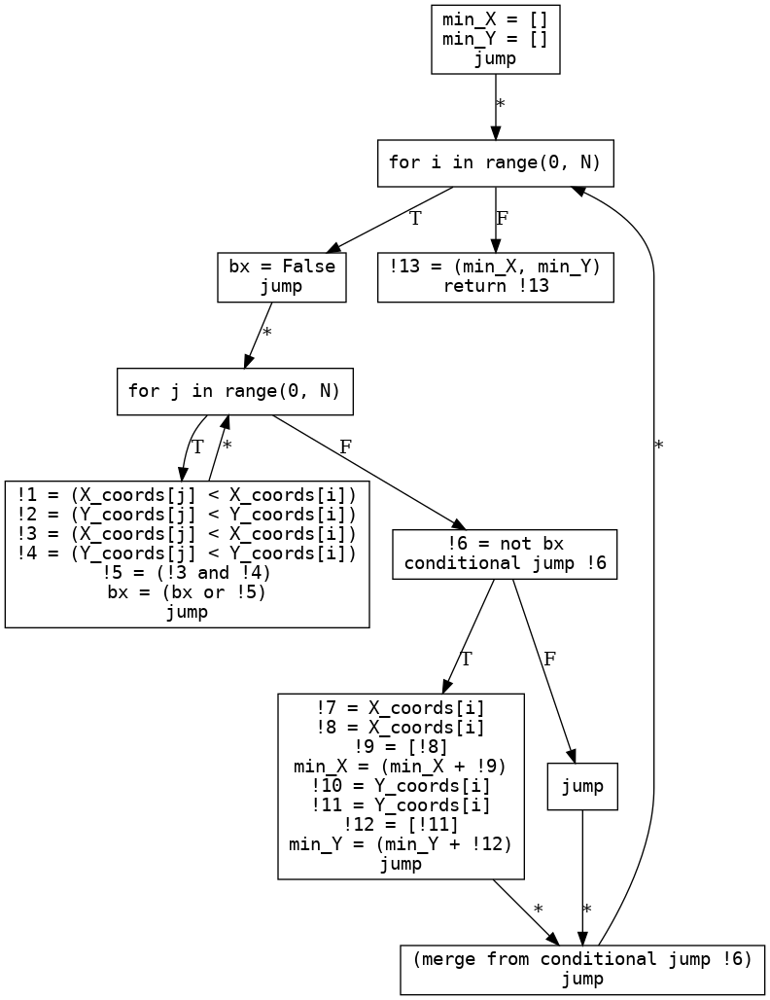
### SSA
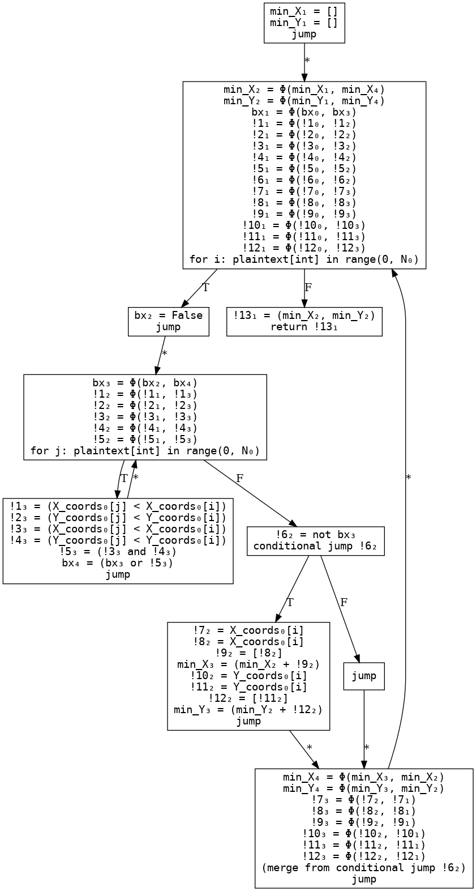
### SSA ϕ→MUX
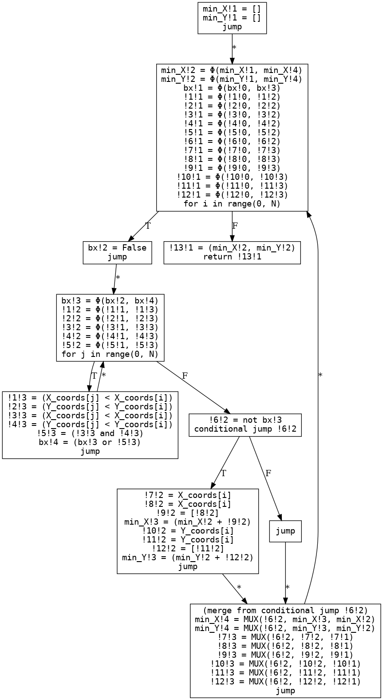
### Dead code elimination
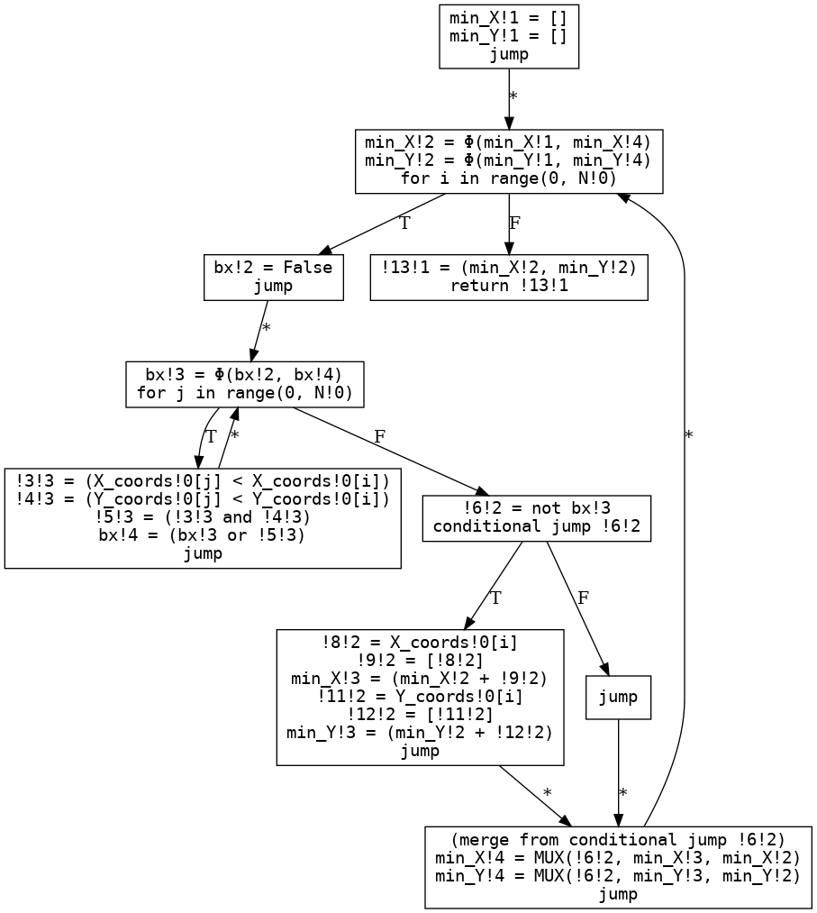
### Linear code with loops
```python
def minimal_points(X_coords: shared, Y_coords: shared, N: plaintext):
    min_X!1 = []
    min_Y!1 = []
    for i: plaintext in range(0, N!0):
        min_X!2 = Φ(min_X!1, min_X!4)
        min_Y!2 = Φ(min_Y!1, min_Y!4)
        bx!2 = False
        for j: plaintext in range(0, N!0):
            bx!3 = Φ(bx!2, bx!4)
            !3!3 = (X_coords!0[j] < X_coords!0[i])
            !4!3 = (Y_coords!0[j] < Y_coords!0[i])
            !5!3 = (!3!3 and !4!3)
            bx!4 = (bx!3 or !5!3)
        !6!2 = not bx!3
        !8!2 = X_coords!0[i]
        !9!2 = [!8!2]
        min_X!3 = (min_X!2 + !9!2)
        !11!2 = Y_coords!0[i]
        !12!2 = [!11!2]
        min_Y!3 = (min_Y!2 + !12!2)
        min_X!4 = MUX(!6!2, min_X!3, min_X!2)
        min_Y!4 = MUX(!6!2, min_Y!3, min_Y!2)
    !13!1 = (min_X!2, min_Y!2)
    return !13!1
```
### Dependency graph
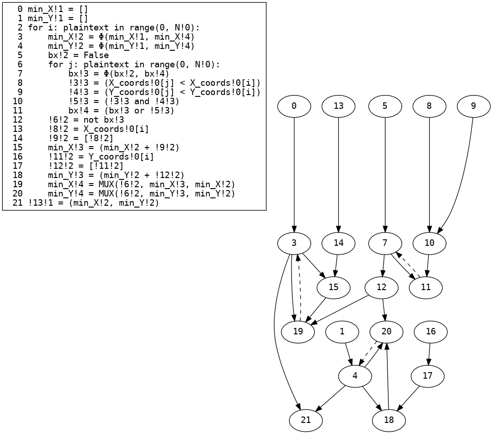
### Removal of infeasible edges

### Typed linear code with loops
```python
def minimal_points(X_coords: shared, Y_coords: shared, N: plaintext):
    min_X!1: plaintext = []
    min_Y!1: plaintext = []
    for i: plaintext in range(0, N!0):
        min_X!2: shared = Φ(min_X!1, min_X!4)
        min_Y!2: shared = Φ(min_Y!1, min_Y!4)
        bx!2: plaintext = False
        for j: plaintext in range(0, N!0):
            bx!3: shared = Φ(bx!2, bx!4)
            !3!3: shared = (X_coords!0[j] < X_coords!0[i])
            !4!3: shared = (Y_coords!0[j] < Y_coords!0[i])
            !5!3: shared = (!3!3 and !4!3)
            bx!4: shared = (bx!3 or !5!3)
        !6!2: shared = not bx!3
        !8!2: shared = X_coords!0[i]
        !9!2: shared = [!8!2]
        min_X!3: shared = (min_X!2 + !9!2)
        !11!2: shared = Y_coords!0[i]
        !12!2: shared = [!11!2]
        min_Y!3: shared = (min_Y!2 + !12!2)
        min_X!4: shared = MUX(!6!2, min_X!3, min_X!2)
        min_Y!4: shared = MUX(!6!2, min_Y!3, min_Y!2)
    !13!1: shared = (min_X!2, min_Y!2)
    return !13!1
```
## `psi`
### Input
```python
import typing

# returns a list[int] which is the intersection 
# of privite sets of integers A and B
# requires: no repetition of elements in either A or B
# requires: len(A) = SA, len(B) = SB
def psi(A: list[int], SA, B: list[int], SB) -> list[int]:
  dummy : int = 0
  result: list[int] = []
  for i in range(0,SA):
    flag : Bool = False
    for j in range(0,SB):
      if A[i] == B[j]:
        flag = True
    val : int = dummy
    if flag:
      val : int = A[i]
    #overloaded +. This is append actually.
    result = result + [val]
  return result

A = [4,2,3,1,10]
B = [2,10,3,4,5,6,7]
intersect = psi(A,5,B,7)
print(intersect)


```
### Restricted AST
```python
def psi(A: shared, SA: plaintext, B: shared, SB: plaintext):
    dummy = 0
    result = []
    for i: plaintext in range(0, SA):
        flag = False
        for j: plaintext in range(0, SB):
            if (A[i] == B[j]):
                flag = True
        val = dummy
        if flag:
            val = A[i]
        result = (result + [val])
    return result
```
### Three-address code CFG

### SSA

### SSA ϕ→MUX

### Dead code elimination
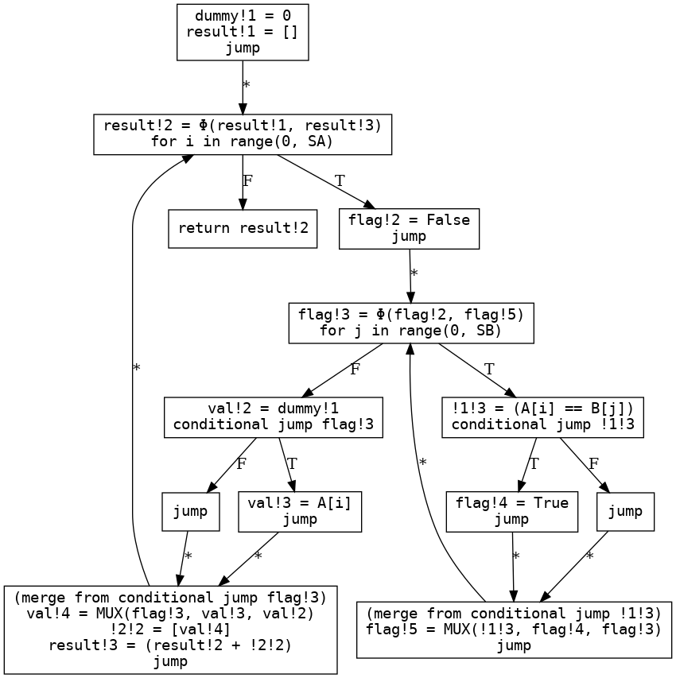
### Linear code with loops
```python
def psi(A: shared, SA: plaintext, B: shared, SB: plaintext):
    dummy!1 = 0
    result!1 = []
    for i: plaintext in range(0, SA!0):
        result!2 = Φ(result!1, result!3)
        flag!2 = False
        for j: plaintext in range(0, SB!0):
            flag!3 = Φ(flag!2, flag!5)
            !1!3 = (A!0[i] == B!0[j])
            flag!4 = True
            flag!5 = MUX(!1!3, flag!4, flag!3)
        val!2 = dummy!1
        val!3 = A!0[i]
        val!4 = MUX(flag!3, val!3, val!2)
        !2!2 = [val!4]
        result!3 = (result!2 + !2!2)
    return result!2
```
### Dependency graph
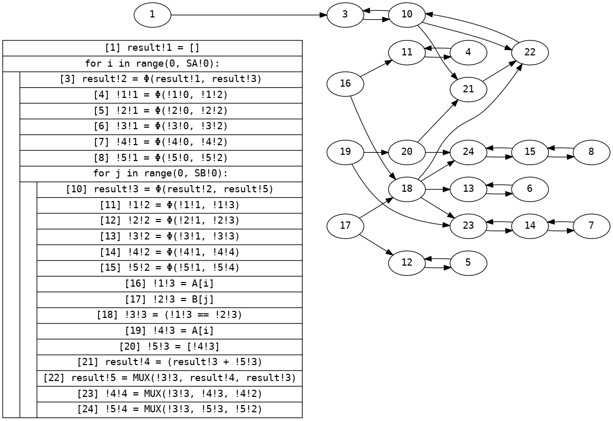
### Removal of infeasible edges
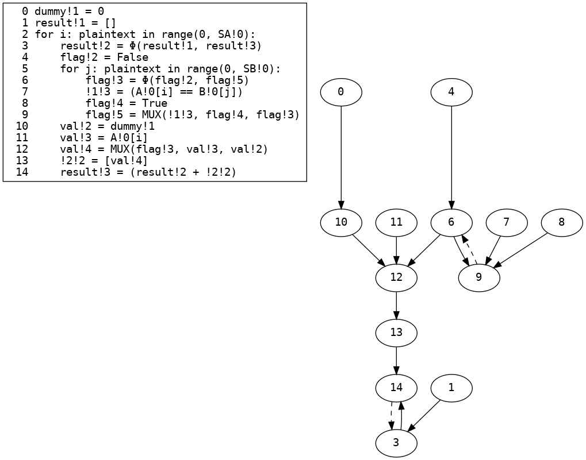
### Typed linear code with loops
```python
def psi(A: shared, SA: plaintext, B: shared, SB: plaintext):
    dummy!1: plaintext = 0
    result!1: plaintext = []
    for i: plaintext in range(0, SA!0):
        result!2: shared = Φ(result!1, result!3)
        flag!2: plaintext = False
        for j: plaintext in range(0, SB!0):
            flag!3: shared = Φ(flag!2, flag!5)
            !1!3: shared = (A!0[i] == B!0[j])
            flag!4: plaintext = True
            flag!5: shared = MUX(!1!3, flag!4, flag!3)
        val!2: plaintext = dummy!1
        val!3: shared = A!0[i]
        val!4: shared = MUX(flag!3, val!3, val!2)
        !2!2: shared = [val!4]
        result!3: shared = (result!2 + !2!2)
    return result!2
```
