# Compiler stages with different benchmarks
## `biometric`
### Input
```python
import typing

# Biometric matching
# D is the number of features we are matching. Usually small, e.g., D=4
# N is the size of the database S
# C is the vector of features we are tryign to match.
# S is the (originally two dimentional) database array: S[0,0],S[0,1],..S[0,D-1],S[1,0]... S[N-1,D-1]
def biometric(C: list[int], D, S: list[int], N):
  min_sum: int = 10000
  min_index = -1
  for i in range(N):
    sum = 0
    for j in range(D):
      d: int = S[i*D+j]-C[j] 
      p: int = d*d      
      sum = sum + p
    if sum < min_sum:
      min_sum = sum
      min_index = i

  return (min_sum,min_index)

C = [1,2,3,4]
S = [4,5,2,10,2,120,4,10,99,88,77,66,55,44,33,22]
print(biometric(C,4,S,4))

```
### Restricted AST
```python
def foo(C, D, S, N):
    min_sum = 10000
    min_index = - 1
    for i in range(0, N):
        sum = 0
        for j in range(0, D):
            d = (S[((i * D) + j)] - C[j])
            p = (d * d)
            sum = (sum + p)
        if (sum < min_sum):
            min_sum = sum
            min_index = i
    return (min_sum, min_index)
```
### Three-address code CFG
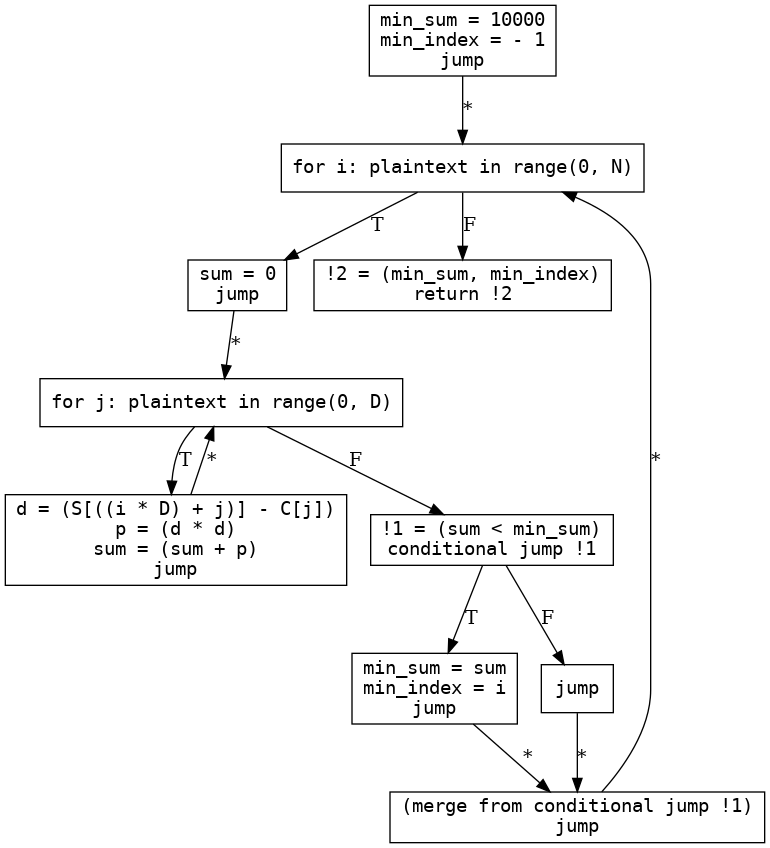
### SSA
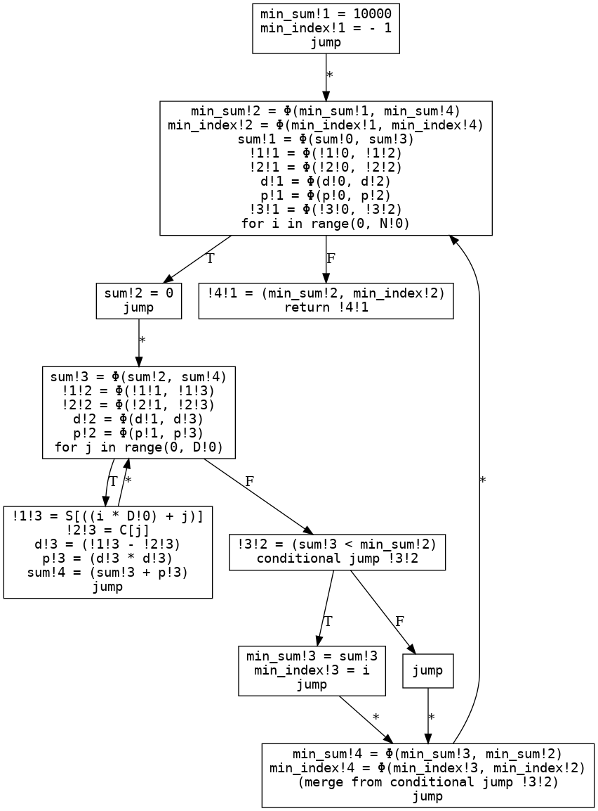
### SSA ϕ→MUX
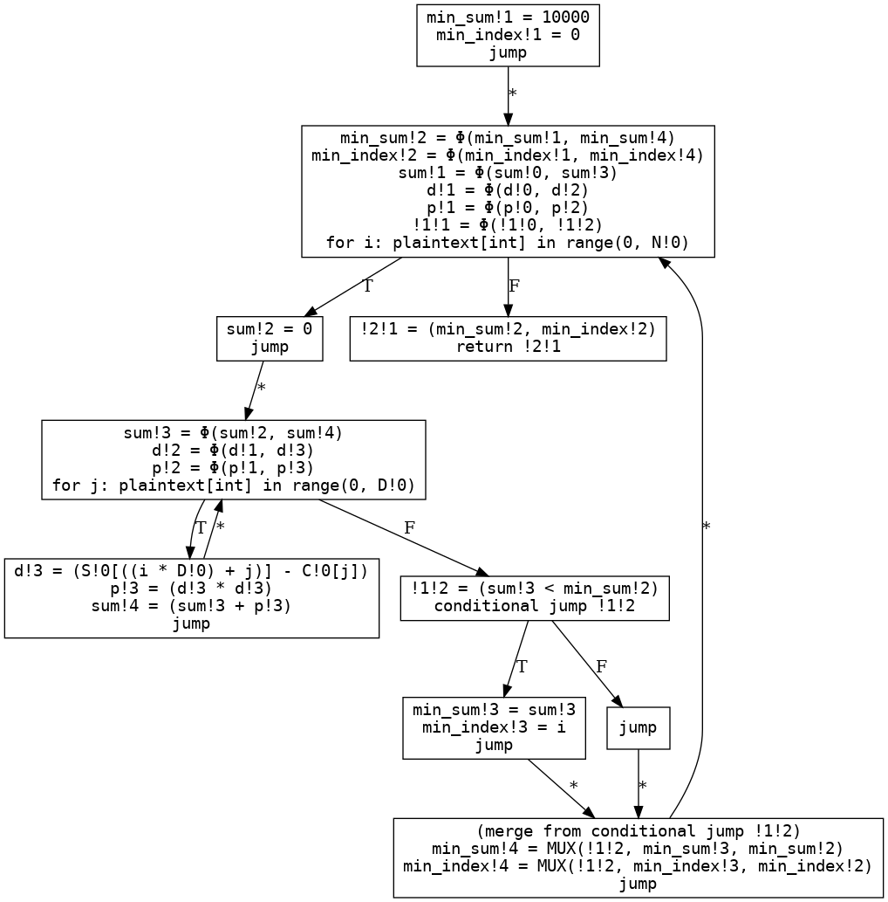
### Linear code with loops
```python
def foo(C, D, S, N):
    min_sum!1 = 10000
    min_index!1 = - 1
    for i in range(0, N!0):
        min_sum!2 = Φ(min_sum!1, min_sum!4)
        min_index!2 = Φ(min_index!1, min_index!4)
        sum!1 = Φ(sum!0, sum!3)
        !1!1 = Φ(!1!0, !1!2)
        !2!1 = Φ(!2!0, !2!2)
        d!1 = Φ(d!0, d!2)
        p!1 = Φ(p!0, p!2)
        !3!1 = Φ(!3!0, !3!2)
        sum!2 = 0
        for j in range(0, D!0):
            sum!3 = Φ(sum!2, sum!4)
            !1!2 = Φ(!1!1, !1!3)
            !2!2 = Φ(!2!1, !2!3)
            d!2 = Φ(d!1, d!3)
            p!2 = Φ(p!1, p!3)
            !1!3 = S[((i * D!0) + j)]
            !2!3 = C[j]
            d!3 = (!1!3 - !2!3)
            p!3 = (d!3 * d!3)
            sum!4 = (sum!3 + p!3)
        !3!2 = (sum!3 < min_sum!2)
        min_sum!3 = sum!3
        min_index!3 = i
        min_sum!4 = MUX(!3!2, min_sum!3, min_sum!2)
        min_index!4 = MUX(!3!2, min_index!3, min_index!2)
    !4!1 = (min_sum!2, min_index!2)
    return !4!1
```
## `biometric_fast`
### Input
```python
import typing

def biometric_matching_fast(D, N, C:list[int], C_sqr_sum:int, two_C:list[int], S: List[int], S_sqr_sum: list[int]):
  """
  Computes biometric matching

  This version uses some preprocessed data from parties to provide faster biometric matching

  :param int D: the cardinality of a feature vector, Usually small, e.g. 4
  :param int N: number of features in the database e.g. usually 1024, 2048, 4096, etc
  :param list[int] C: query feature vector, we need to find closest match to this vector in the DB, comes from client (Alice)
  :param int C_sqr_sum: sum of squares of elements of `C` e.g. if `C={1, 2, 3, 4}`, then `C_sqr_sum is: 1*1 + 2*2 + 3*3 + 4*4 = 30`
   client passes it pre-processed to to save gates in circuit
  :param list[int] two_C: same as `C` except that each element is multipled by 2, e.g. if `C={1, 2, 3, 4}`, then 
   `two_C = {2, 4, 6, 8}`. client passes it preprocessed to save gates
  :param list[int] S: the database of features, it has N * D elements i.e. N features and each feature vector has D elements,
   this comes from server (Bob)
  :param list[int] S_sqr_sum: has N elements, each element is sum of squares of corresponding feature elements e.g. say
   S={{1, 2, 3, 4}, {5, 6, 7, 8}}, then S_sqr_sum={1*1 + 2*2 + 3*3 + 4*4, 5*5 + 6*6 + 7*7 + 8*8} = {30, 174}
  
  """ 

  differences: list[int] = [0] * D
  for i in range(N):
    a_sqr_plus_b_sqr: int = S_sqr_sum[i] + C_sqr_sum
    two_a_b: int = 0
    
    for j in range(D):
      tmp: int = S[i*D+j] * two_C[j]
      two_a_b = two_a_b + tmp

    this_diff: int = a_sqr_plus_b_sqr - two_a_b
    differences[i] = this_diff


    min_diff: int = differences[0]
    min_index: int = 0

    for k in range(N):
      if(differences[k] < min_diff):
        min_diff = differences[k]
        min_index = k

  return (min_diff, min_index)


def test_biometric_matching_fast(D, N, C, S):
  """
  just a convenience method for testing, computes the pre-processing data for the actual call
  """
  two_C = [0] * D
  C_sqr_sum = 0
  S_sqr_sum = [0] * N
  for i in range(D):
    two_C[i] = 2 * C[i]
    C_sqr_sum = C_sqr_sum + (C[i] * C[i])

  for i in range(N):
    for j in range(D):
      S_sqr_sum[i] = S_sqr_sum[i] + (S[i*D+j] * S[i*D+j])

  print(biometric_matching__fast(D, N, C, C_sqr_sum, two_C, S, S_sqr_sum))


C = [1,2,3,4]
S = [4,5,2,10,2,120,4,10,99,88,77,66,55,44,33,22]
test_biometric_matching_fast(4, 4, C, S)

```
### Restricted AST
```python
def foo(D, N, C, C_sqr_sum, two_C, S, S_sqr_sum):
    differences = ([0] * D)
    for i in range(0, N):
        a_sqr_plus_b_sqr = (S_sqr_sum[i] + C_sqr_sum)
        two_a_b = 0
        for j in range(0, D):
            tmp = (S[((i * D) + j)] * two_C[j])
            two_a_b = (two_a_b + tmp)
        this_diff = (a_sqr_plus_b_sqr - two_a_b)
        differences[i] = this_diff
        min_diff = differences[0]
        min_index = 0
        for k in range(0, N):
            if (differences[k] < min_diff):
                min_diff = differences[k]
                min_index = k
    return (min_diff, min_index)
```
### Three-address code CFG
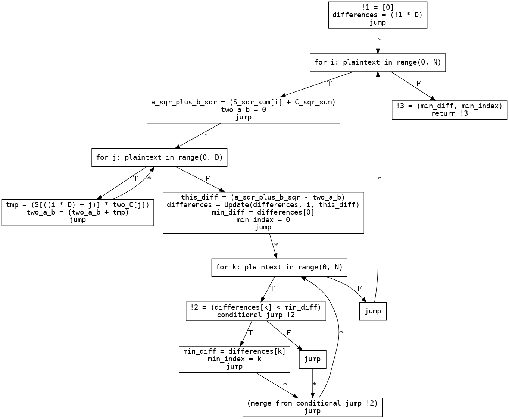
### SSA
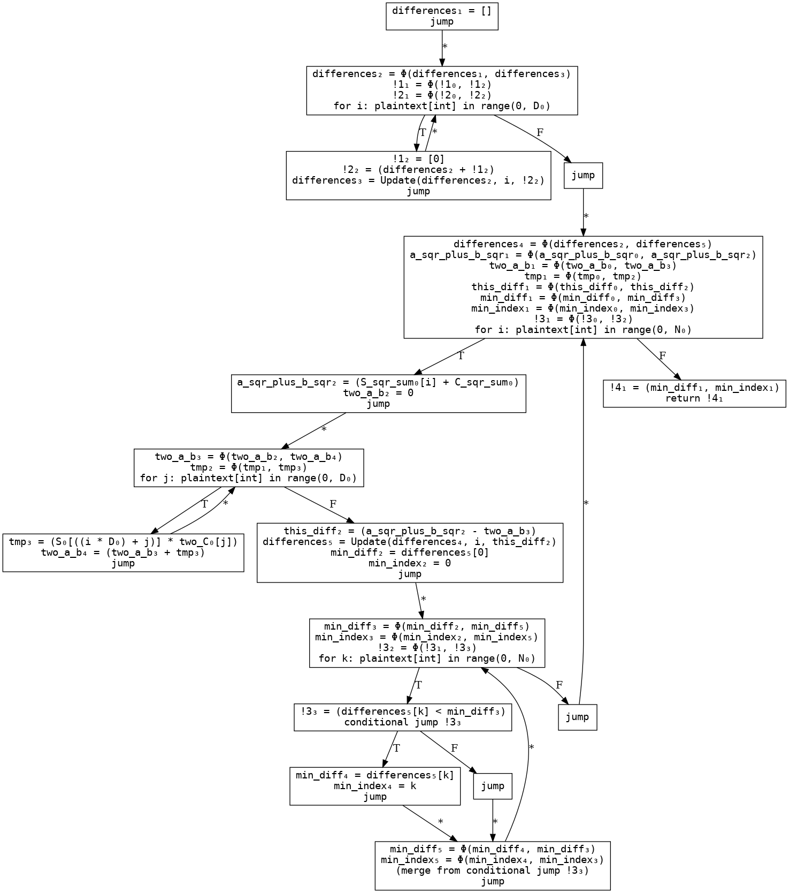
### SSA ϕ→MUX
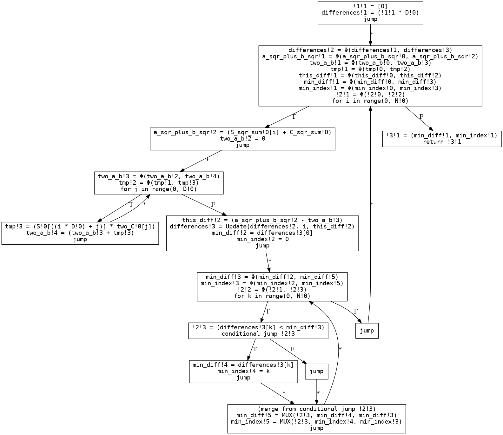
### Linear code with loops
```python
def foo(D, N, C, C_sqr_sum, two_C, S, S_sqr_sum):
    !1!1 = [0]
    differences!1 = (!1!1 * D!0)
    for i in range(0, N!0):
        !2!1 = Φ(!2!0, !2!2)
        a_sqr_plus_b_sqr!1 = Φ(a_sqr_plus_b_sqr!0, a_sqr_plus_b_sqr!2)
        two_a_b!1 = Φ(two_a_b!0, two_a_b!3)
        !3!1 = Φ(!3!0, !3!2)
        !4!1 = Φ(!4!0, !4!2)
        tmp!1 = Φ(tmp!0, tmp!2)
        this_diff!1 = Φ(this_diff!0, this_diff!2)
        differences[i] = Φ(differences[i], differences[i])
        min_diff!1 = Φ(min_diff!0, min_diff!3)
        min_index!1 = Φ(min_index!0, min_index!3)
        !5!1 = Φ(!5!0, !5!2)
        !6!1 = Φ(!6!0, !6!2)
        !2!2 = S_sqr_sum[i]
        a_sqr_plus_b_sqr!2 = (!2!2 + C_sqr_sum!0)
        two_a_b!2 = 0
        for j in range(0, D!0):
            two_a_b!3 = Φ(two_a_b!2, two_a_b!4)
            !3!2 = Φ(!3!1, !3!3)
            !4!2 = Φ(!4!1, !4!3)
            tmp!2 = Φ(tmp!1, tmp!3)
            !3!3 = S[((i * D!0) + j)]
            !4!3 = two_C[j]
            tmp!3 = (!3!3 * !4!3)
            two_a_b!4 = (two_a_b!3 + tmp!3)
        this_diff!2 = (a_sqr_plus_b_sqr!2 - two_a_b!3)
        differences[i] = this_diff!2
        min_diff!2 = differences[0]
        min_index!2 = 0
        for k in range(0, N!0):
            min_diff!3 = Φ(min_diff!2, min_diff!5)
            min_index!3 = Φ(min_index!2, min_index!5)
            !5!2 = Φ(!5!1, !5!3)
            !6!2 = Φ(!6!1, !6!3)
            !5!3 = differences[k]
            !6!3 = (!5!3 < min_diff!3)
            min_diff!4 = differences[k]
            min_index!4 = k
            min_diff!5 = MUX(!6!3, min_diff!4, min_diff!3)
            min_index!5 = MUX(!6!3, min_index!4, min_index!3)
    !7!1 = (min_diff!1, min_index!1)
    return !7!1
```
## `chapterfour_figure_12`
### Input
```python
def foo(x, y):
    z = 0
    if x > 0:
        if y > 0:
            z = 1
        else:
            z = -1
    return z

```
### Restricted AST
```python
def foo(x, y):
    z = 0
    if (x > 0):
        if (y > 0):
            z = 1
        else:
            z = - 1
    return z
```
### Three-address code CFG
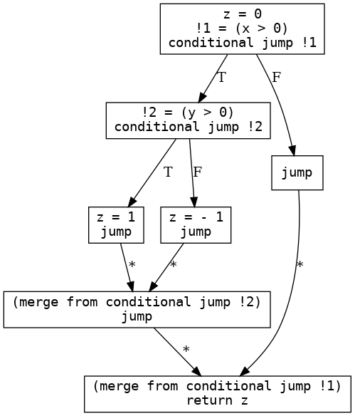
### SSA
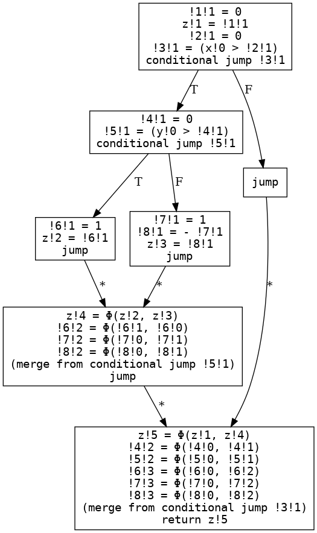
### SSA ϕ→MUX
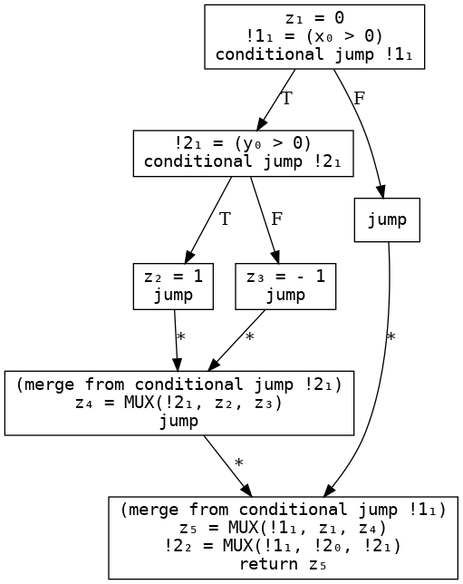
### Linear code with loops
```python
def foo(x, y):
    z!1 = 0
    !1!1 = (x!0 > 0)
    !2!1 = (y!0 > 0)
    z!3 = - 1
    z!2 = 1
    z!4 = MUX(!2!1, z!2, z!3)
    z!5 = MUX(!1!1, z!1, z!4)
    !2!2 = MUX(!1!1, !2!0, !2!1)
    return z!5
```
## `histogram`
### Input
```python
import typing

# Array A contains a list of integers i in [1,num_bins]
# Array B is a same-size array, contains number of collected ratings for that bin
# E.g., below we have collected 10 1-star ratings, 1 3-star rating, etc., then 2 more 1-star rating etc.
# A = [0,2,1,0,3,4,2,3]
# B = [10,1,5,2,15,0,10,1000]
# We need to sum up num ratings in each bin to compute a histogram
# 1: 12 0-star ratings                                            
# 2: 5 1-star
# 3: 11 2-star
# 4: 1015 3-star
# 5: 0 4-star                                                            

# This is very similar to the crosstabs app in MOTION
# But we were first to suggest this as a benchmark :).
# requires: len(A) == len(B) = N
def histogram(A: list[int], B: list[int], N, num_bins):
  result: list[int] = []
  # initialize result to 0
  for i in range(num_bins):
    result = result + [0]
  for i in range(num_bins):
    for j in range(N):
      if A[j] == i:
        result[i] = result[i] + B[j]
  return result

A = A = [0,2,1,0,3,4,2,3]
B = [10,1,5,2,15,0,10,1000]
N = len(A)
result = histogram(A,B,N,5)
print(result)

```
### Restricted AST
```python
def foo(A, B, N, num_bins):
    result = []
    for i in range(0, num_bins):
        result = (result + [0])
    for i in range(0, num_bins):
        for j in range(0, N):
            if (A[j] == i):
                result[i] = (result[i] + B[j])
    return result
```
### Three-address code CFG
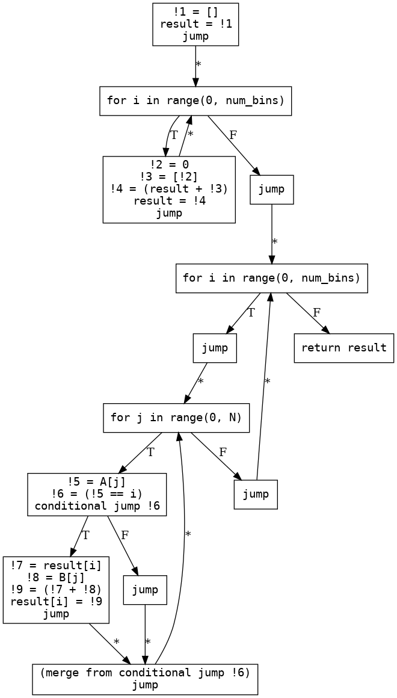
### SSA
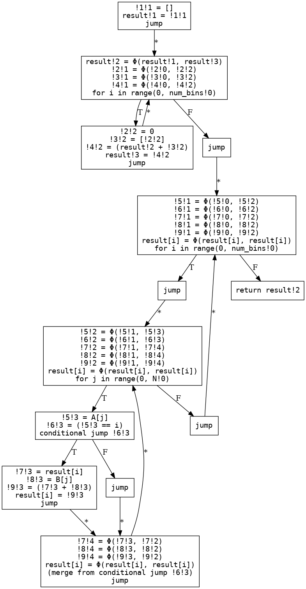
### SSA ϕ→MUX
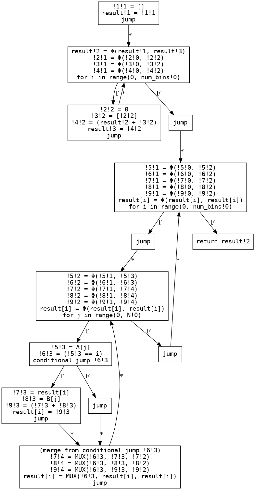
### Linear code with loops
```python
def foo(A, B, N, num_bins):
    result!1 = []
    for i in range(0, num_bins!0):
        result!2 = Φ(result!1, result!3)
        !1!1 = Φ(!1!0, !1!2)
        !1!2 = [0]
        result!3 = (result!2 + !1!2)
    for i in range(0, num_bins!0):
        !2!1 = Φ(!2!0, !2!2)
        !3!1 = Φ(!3!0, !3!2)
        !4!1 = Φ(!4!0, !4!2)
        !5!1 = Φ(!5!0, !5!2)
        result[i] = Φ(result[i], result[i])
        for j in range(0, N!0):
            !2!2 = Φ(!2!1, !2!3)
            !3!2 = Φ(!3!1, !3!3)
            !4!2 = Φ(!4!1, !4!4)
            !5!2 = Φ(!5!1, !5!4)
            result[i] = Φ(result[i], result[i])
            !2!3 = A[j]
            !3!3 = (!2!3 == i)
            !4!3 = result[i]
            !5!3 = B[j]
            result[i] = (!4!3 + !5!3)
            !4!4 = MUX(!3!3, !4!3, !4!2)
            !5!4 = MUX(!3!3, !5!3, !5!2)
            result[i] = MUX(!3!3, result[i], result[i])
    return result!2
```
## `inner_product`
### Input
```python
import typing

def ip(A: list[int], B: list[int], N):
  sum = 0
  for i in range(0,N):
    temp = A[i]*B[i]
    sum = sum + temp
  return sum

A = [1,2,3]
B = [4,5,6]
sum = ip(A,B,3)
print(sum)

```
### Restricted AST
```python
def foo(A, B, N):
    sum = 0
    for i in range(0, N):
        temp = (A[i] * B[i])
        sum = (sum + temp)
    return sum
```
### Three-address code CFG
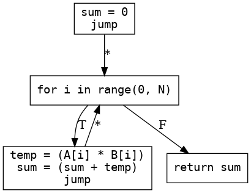
### SSA
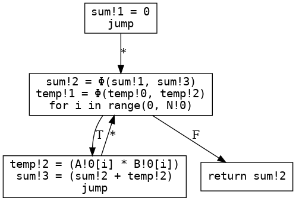
### SSA ϕ→MUX
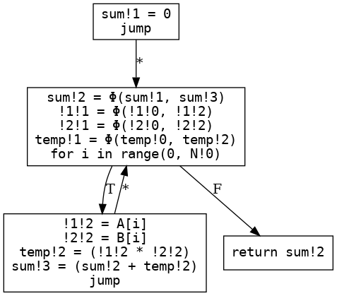
### Linear code with loops
```python
def foo(A, B, N):
    sum!1 = 0
    for i in range(0, N!0):
        sum!2 = Φ(sum!1, sum!3)
        !1!1 = Φ(!1!0, !1!2)
        !2!1 = Φ(!2!0, !2!2)
        temp!1 = Φ(temp!0, temp!2)
        !1!2 = A[i]
        !2!2 = B[i]
        temp!2 = (!1!2 * !2!2)
        sum!3 = (sum!2 + temp!2)
    return sum!2
```
## `psi`
### Input
```python
import typing

# returns a list[int] which is the intersection 
# of privite sets of integers A and B
# requires: no repetition of elements in either A or B
# requires: len(A) = SA, len(B) = SB
def psi(A: list[int], SA, B: list[int], SB) -> list[int]:
  result: list[int] = []
  for i in range(0,SA):
    for j in range(0,SB):
      if A[i] == B[j]:
        #overloaded +. This is append actually.
        result = result + [A[i]]
  return result

A = [1,2,3]
B = [2]
intersect = psi(A,3,B,1)
print(intersect)


```
### Restricted AST
```python
def foo(A, SA, B, SB):
    result = []
    for i in range(0, SA):
        for j in range(0, SB):
            if (A[i] == B[j]):
                result = (result + [A[i]])
    return result
```
### Three-address code CFG
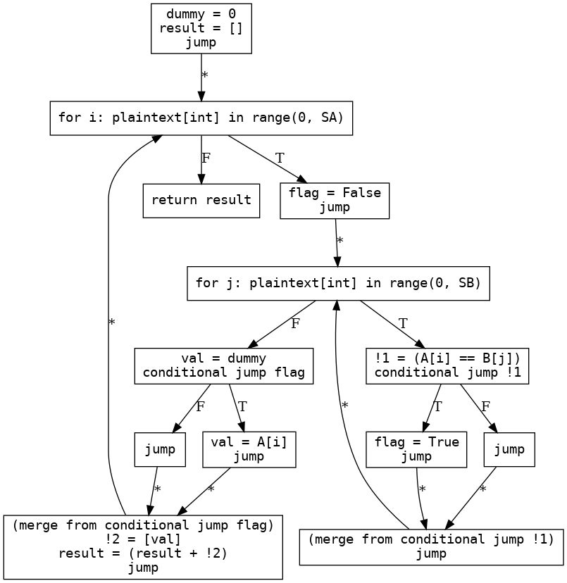
### SSA
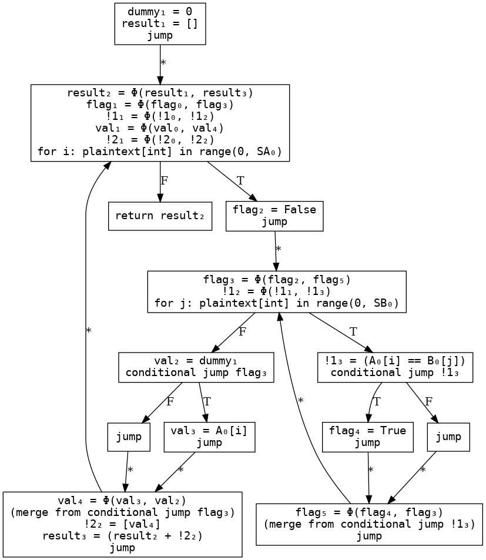
### SSA ϕ→MUX
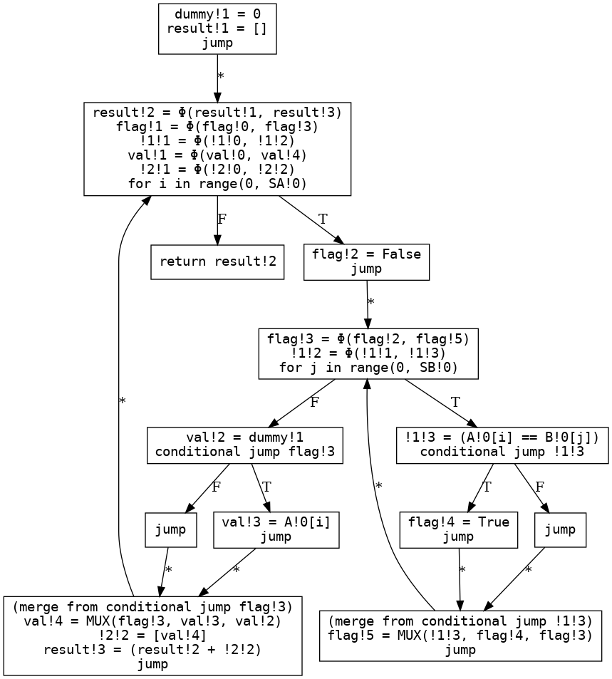
### Linear code with loops
```python
def foo(A, SA, B, SB):
    result!1 = []
    for i in range(0, SA!0):
        result!2 = Φ(result!1, result!3)
        !1!1 = Φ(!1!0, !1!2)
        !2!1 = Φ(!2!0, !2!2)
        !3!1 = Φ(!3!0, !3!2)
        !4!1 = Φ(!4!0, !4!2)
        !5!1 = Φ(!5!0, !5!2)
        for j in range(0, SB!0):
            result!3 = Φ(result!2, result!5)
            !1!2 = Φ(!1!1, !1!3)
            !2!2 = Φ(!2!1, !2!3)
            !3!2 = Φ(!3!1, !3!3)
            !4!2 = Φ(!4!1, !4!4)
            !5!2 = Φ(!5!1, !5!4)
            !1!3 = A[i]
            !2!3 = B[j]
            !3!3 = (!1!3 == !2!3)
            !4!3 = A[i]
            !5!3 = [!4!3]
            result!4 = (result!3 + !5!3)
            result!5 = MUX(!3!3, result!4, result!3)
            !4!4 = MUX(!3!3, !4!3, !4!2)
            !5!4 = MUX(!3!3, !5!3, !5!2)
    return result!2
```
