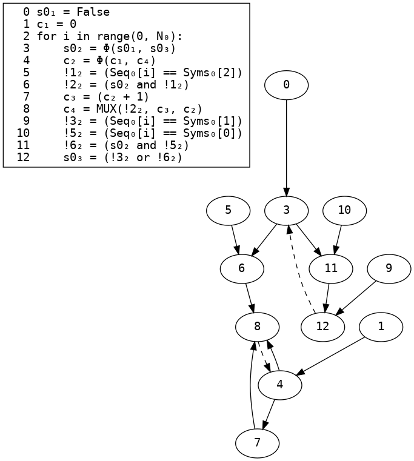
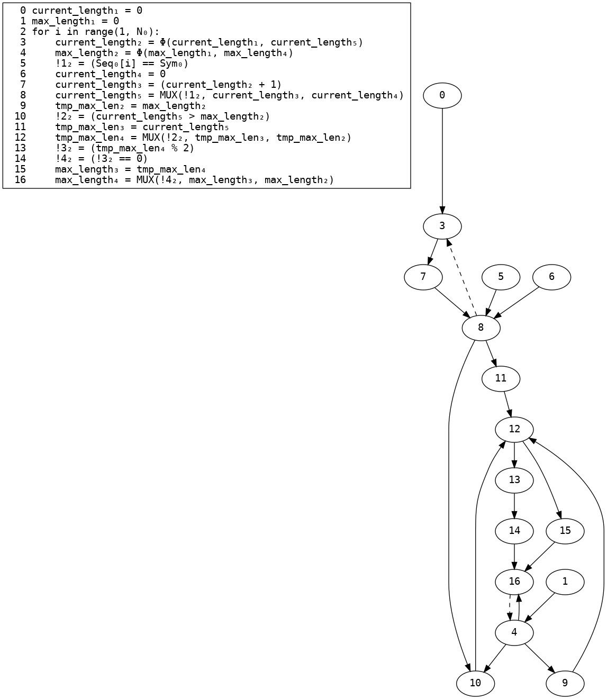
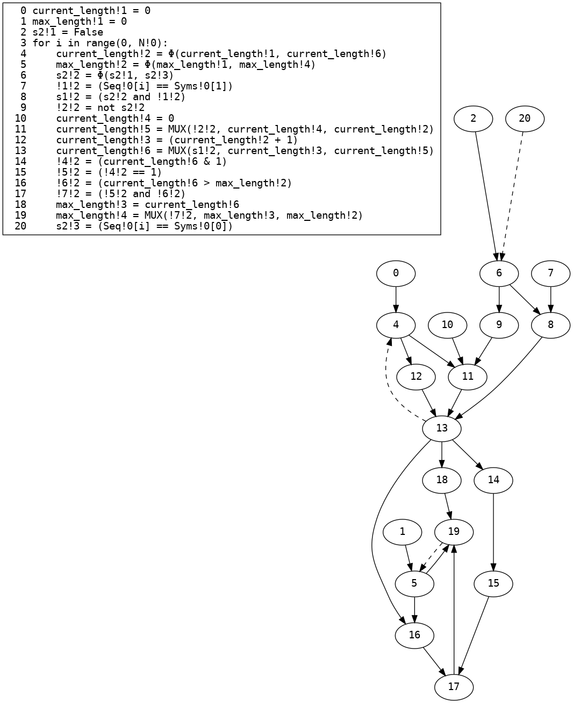
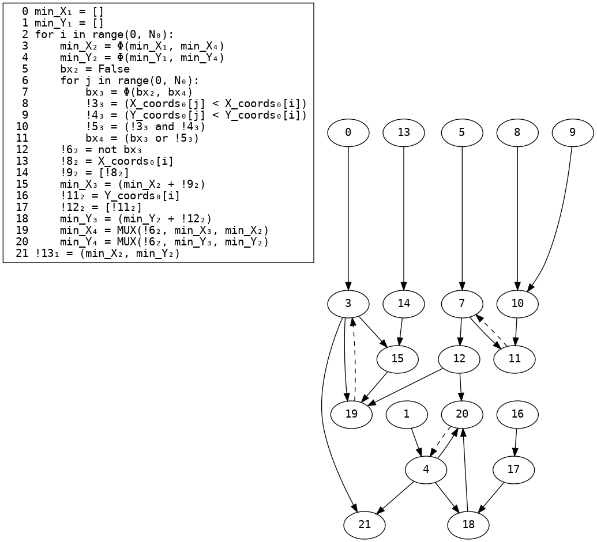
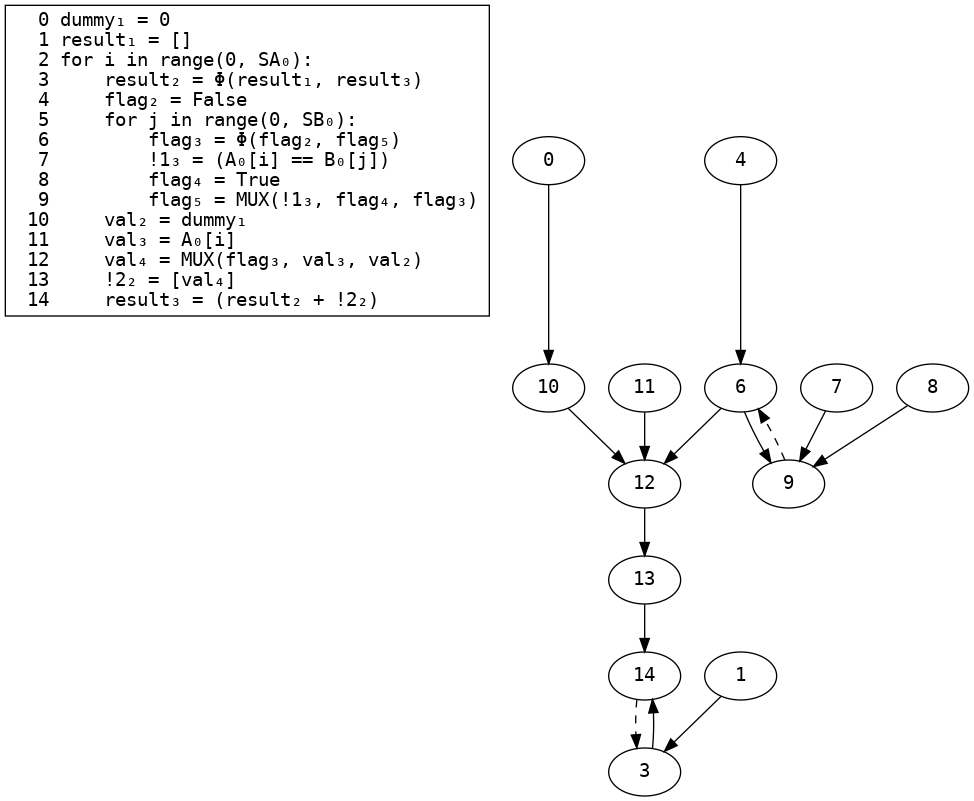

# Compiler stages with different benchmarks
## `biometric`
### Input
```python
import typing

# Biometric matching
# D is the number of features we are matching. Usually small, e.g., D=4
# N is the size of the database S
# C is the vector of features we are tryign to match.
# S is the (originally two dimentional) database array: S[0,0],S[0,1],..S[0,D-1],S[1,0]... S[N-1,D-1]
def biometric(C: list[int], D, S: list[int], N):
  min_sum: int = 10000
  min_index = -1
  for i in range(N):
    sum = 0
    for j in range(D):
      d = S[i*D+j]-C[j] 
      p = d*d      
      sum = sum + p
    if sum < min_sum:
      min_sum = sum
      min_index = i

  return (min_sum,min_index)

C = [1,2,3,4]
S = [4,5,2,10,2,120,4,10,99,88,77,66,55,44,33,22]
print(biometric(C,4,S,4))

```
### Restricted AST
```python
def biometric(C: shared[list[int]], D: plaintext[int], S: shared[list[int]], N: plaintext[int]):
    min_sum = 10000
    min_index = - 1
    for i: plaintext[int] in range(0, N):
        sum = 0
        for j: plaintext[int] in range(0, D):
            d = (S[((i * D) + j)] - C[j])
            p = (d * d)
            sum = (sum + p)
        if (sum < min_sum):
            min_sum = sum
            min_index = i
    return (min_sum, min_index)
```
### Three-address code CFG

### SSA

### SSA ϕ→MUX

### Dead code elimination

### Linear code with loops
```python
def biometric(C: shared[list[int]], D: plaintext[int], S: shared[list[int]], N: plaintext[int]):
    min_sum₁ = 10000
    min_index₁ = - 1
    for i in range(0, N₀):
        min_sum₂ = Φ(min_sum₁, min_sum₄)
        min_index₂ = Φ(min_index₁, min_index₄)
        sum₂ = 0
        for j in range(0, D₀):
            sum₃ = Φ(sum₂, sum₄)
            d₃ = (S₀[((i * D₀) + j)] - C₀[j])
            p₃ = (d₃ * d₃)
            sum₄ = (sum₃ + p₃)
        !1₂ = (sum₃ < min_sum₂)
        min_sum₃ = sum₃
        min_index₃ = i
        min_sum₄ = MUX(!1₂, min_sum₃, min_sum₂)
        min_index₄ = MUX(!1₂, min_index₃, min_index₂)
    !2₁ = (min_sum₂, min_index₂)
    return !2₁
```
### Dependency graph

### Removal of infeasible edges

### Array MUX refinement
```python
def biometric(C: shared[list[int]], D: plaintext[int], S: shared[list[int]], N: plaintext[int]):
    min_sum₁ = 10000
    min_index₁ = - 1
    for i in range(0, N₀):
        min_sum₂ = Φ(min_sum₁, min_sum₄)
        min_index₂ = Φ(min_index₁, min_index₄)
        sum₂ = 0
        for j in range(0, D₀):
            sum₃ = Φ(sum₂, sum₄)
            d₃ = (S₀[((i * D₀) + j)] - C₀[j])
            p₃ = (d₃ * d₃)
            sum₄ = (sum₃ + p₃)
        !1₂ = (sum₃ < min_sum₂)
        min_sum₃ = sum₃
        min_index₃ = i
        min_sum₄ = MUX(!1₂, min_sum₃, min_sum₂)
        min_index₄ = MUX(!1₂, min_index₃, min_index₂)
    !2₁ = (min_sum₂, min_index₂)
    return !2₁
```
### Array MUX refinement (dependence graph)

### Type environment
| Variable | Type |
| - | - |
| `C₀` | `shared[list[int]]` |
| `D₀` | `plaintext[int]` |
| `S₀` | `shared[list[int]]` |
| `N₀` | `plaintext[int]` |
| `i` | `plaintext[int]` |
| `j` | `plaintext[int]` |
| `min_index₃` | `plaintext[int]` |
| `min_index₄` | `shared[int]` |
| `d₃` | `shared[int]` |
| `p₃` | `shared[int]` |
| `sum₄` | `shared[int]` |
| `sum₂` | `plaintext[int]` |
| `min_index₁` | `plaintext[int]` |
| `min_sum₁` | `plaintext[int]` |
## `biometric_fast`
### Input
```python
import typing

def biometric_matching_fast(D, N, C:list[int], C_sqr_sum:int, two_C:list[int], S: list[int], S_sqr_sum: list[int]):
  """
  Computes biometric matching

  This version uses some preprocessed data from parties to provide faster biometric matching

  :param int D: the cardinality of a feature vector, Usually small, e.g. 4
  :param int N: number of features in the database e.g. usually 1024, 2048, 4096, etc
  :param list[int] C: query feature vector, we need to find closest match to this vector in the DB, comes from client (Alice)
  :param int C_sqr_sum: sum of squares of elements of `C` e.g. if `C={1, 2, 3, 4}`, then `C_sqr_sum is: 1*1 + 2*2 + 3*3 + 4*4 = 30`
   client passes it pre-processed to to save gates in circuit
  :param list[int] two_C: same as `C` except that each element is multipled by 2, e.g. if `C={1, 2, 3, 4}`, then
   `two_C = {2, 4, 6, 8}`. client passes it preprocessed to save gates
  :param list[int] S: the database of features, it has N * D elements i.e. N features and each feature vector has D elements,
   this comes from server (Bob)
  :param list[int] S_sqr_sum: has N elements, each element is sum of squares of corresponding feature elements e.g. say
   S={{1, 2, 3, 4}, {5, 6, 7, 8}}, then S_sqr_sum={1*1 + 2*2 + 3*3 + 4*4, 5*5 + 6*6 + 7*7 + 8*8} = {30, 174}

  """

  differences: list[int] = []
  for i in range(D):
    differences[i] = differences + [0]

  for i in range(N):
    a_sqr_plus_b_sqr: int = S_sqr_sum[i] + C_sqr_sum
    two_a_b: int = 0

    for j in range(D):
      tmp: int = S[i*D+j] * two_C[j]
      two_a_b = two_a_b + tmp

    this_diff: int = a_sqr_plus_b_sqr - two_a_b
    differences[i] = this_diff


    min_diff: int = differences[0]
    min_index: int = 0

    for k in range(N):
      if(differences[k] < min_diff):
        min_diff = differences[k]
        min_index = k

  return (min_diff, min_index)


def test_biometric_matching_fast(D, N, C, S):
  """
  just a convenience method for testing, computes the pre-processing data for the actual call
  """
  two_C = [0] * D
  C_sqr_sum = 0
  S_sqr_sum = [0] * N
  for i in range(D):
    two_C[i] = 2 * C[i]
    C_sqr_sum = C_sqr_sum + (C[i] * C[i])

  for i in range(N):
    for j in range(D):
      S_sqr_sum[i] = S_sqr_sum[i] + (S[i*D+j] * S[i*D+j])

  print(biometric_matching__fast(D, N, C, C_sqr_sum, two_C, S, S_sqr_sum))


C = [1,2,3,4]
S = [4,5,2,10,2,120,4,10,99,88,77,66,55,44,33,22]
test_biometric_matching_fast(4, 4, C, S)

```
### Restricted AST
```python
def biometric_matching_fast(D: plaintext[int], N: plaintext[int], C: shared[list[int]], C_sqr_sum: shared[int], two_C: shared[list[int]], S: shared[list[int]], S_sqr_sum: shared[list[int]]):
    differences = []
    for i: plaintext[int] in range(0, D):
        differences[i] = (differences + [0])
    for i: plaintext[int] in range(0, N):
        a_sqr_plus_b_sqr = (S_sqr_sum[i] + C_sqr_sum)
        two_a_b = 0
        for j: plaintext[int] in range(0, D):
            tmp = (S[((i * D) + j)] * two_C[j])
            two_a_b = (two_a_b + tmp)
        this_diff = (a_sqr_plus_b_sqr - two_a_b)
        differences[i] = this_diff
        min_diff = differences[0]
        min_index = 0
        for k: plaintext[int] in range(0, N):
            if (differences[k] < min_diff):
                min_diff = differences[k]
                min_index = k
    return (min_diff, min_index)
```
### Three-address code CFG

### SSA

### SSA ϕ→MUX

### Dead code elimination

### Linear code with loops
```python
def biometric_matching_fast(D: plaintext[int], N: plaintext[int], C: shared[list[int]], C_sqr_sum: shared[int], two_C: shared[list[int]], S: shared[list[int]], S_sqr_sum: shared[list[int]]):
    differences₁ = []
    for i in range(0, D₀):
        differences₂ = Φ(differences₁, differences₃)
        !1₂ = [0]
        !2₂ = (differences₂ + !1₂)
        differences₃ = Update(differences₂, i, !2₂)
    for i in range(0, N₀):
        differences₄ = Φ(differences₂, differences₅)
        min_diff₁ = Φ(min_diff₀, min_diff₃)
        min_index₁ = Φ(min_index₀, min_index₃)
        a_sqr_plus_b_sqr₂ = (S_sqr_sum₀[i] + C_sqr_sum₀)
        two_a_b₂ = 0
        for j in range(0, D₀):
            two_a_b₃ = Φ(two_a_b₂, two_a_b₄)
            tmp₃ = (S₀[((i * D₀) + j)] * two_C₀[j])
            two_a_b₄ = (two_a_b₃ + tmp₃)
        this_diff₂ = (a_sqr_plus_b_sqr₂ - two_a_b₃)
        differences₅ = Update(differences₄, i, this_diff₂)
        min_diff₂ = differences₅[0]
        min_index₂ = 0
        for k in range(0, N₀):
            min_diff₃ = Φ(min_diff₂, min_diff₅)
            min_index₃ = Φ(min_index₂, min_index₅)
            !3₃ = (differences₅[k] < min_diff₃)
            min_diff₄ = differences₅[k]
            min_index₄ = k
            min_diff₅ = MUX(!3₃, min_diff₄, min_diff₃)
            min_index₅ = MUX(!3₃, min_index₄, min_index₃)
    !4₁ = (min_diff₁, min_index₁)
    return !4₁
```
### Dependency graph

### Removal of infeasible edges

### Array MUX refinement
```python
def biometric_matching_fast(D: plaintext[int], N: plaintext[int], C: shared[list[int]], C_sqr_sum: shared[int], two_C: shared[list[int]], S: shared[list[int]], S_sqr_sum: shared[list[int]]):
    differences₁ = []
    for i in range(0, D₀):
        differences₂ = Φ(differences₁, differences₃)
        !1₂ = [0]
        !2₂ = (differences₂ + !1₂)
        differences₃ = Update(differences₂, i, !2₂)
    for i in range(0, N₀):
        differences₄ = Φ(differences₂, differences₅)
        min_diff₁ = Φ(min_diff₀, min_diff₃)
        min_index₁ = Φ(min_index₀, min_index₃)
        a_sqr_plus_b_sqr₂ = (S_sqr_sum₀[i] + C_sqr_sum₀)
        two_a_b₂ = 0
        for j in range(0, D₀):
            two_a_b₃ = Φ(two_a_b₂, two_a_b₄)
            tmp₃ = (S₀[((i * D₀) + j)] * two_C₀[j])
            two_a_b₄ = (two_a_b₃ + tmp₃)
        this_diff₂ = (a_sqr_plus_b_sqr₂ - two_a_b₃)
        differences₅ = Update(differences₄, i, this_diff₂)
        min_diff₂ = differences₅[0]
        min_index₂ = 0
        for k in range(0, N₀):
            min_diff₃ = Φ(min_diff₂, min_diff₅)
            min_index₃ = Φ(min_index₂, min_index₅)
            !3₃ = (differences₅[k] < min_diff₃)
            min_diff₄ = differences₅[k]
            min_index₄ = k
            min_diff₅ = MUX(!3₃, min_diff₄, min_diff₃)
            min_index₅ = MUX(!3₃, min_index₄, min_index₃)
    !4₁ = (min_diff₁, min_index₁)
    return !4₁
```
### Array MUX refinement (dependence graph)

### Type environment
| Variable | Type |
| - | - |
| `D₀` | `plaintext[int]` |
| `N₀` | `plaintext[int]` |
| `C₀` | `shared[list[int]]` |
| `C_sqr_sum₀` | `shared[int]` |
| `two_C₀` | `shared[list[int]]` |
| `S₀` | `shared[list[int]]` |
| `S_sqr_sum₀` | `shared[list[int]]` |
| `i` | `plaintext[int]` |
| `j` | `plaintext[int]` |
| `k` | `plaintext[int]` |
| `min_index₄` | `plaintext[int]` |
| `min_index₅` | `shared[int]` |
| `min_index₂` | `plaintext[int]` |
| `tmp₃` | `shared[int]` |
| `two_a_b₄` | `shared[int]` |
| `two_a_b₂` | `plaintext[int]` |
| `a_sqr_plus_b_sqr₂` | `shared[int]` |
| `this_diff₂` | `shared[int]` |
| `differences₅` | `shared[list[int]]` |
| `min_diff₄` | `shared[int]` |
| `min_diff₅` | `shared[int]` |
| `!3₃` | `shared[int]` |
| `min_diff₂` | `shared[int]` |
| `!1₂` | `plaintext[list[int]]` |
| `differences₁` | `plaintext[list[int]]` |
## `chapterfour_figure_12`
### Input
```python
def foo(x, y):
    z = 0
    if x > 0:
        if y > 0:
            z = 1
        else:
            z = -1
    return z

```
### Restricted AST
```python
def foo(x: plaintext[int], y: plaintext[int]):
    z = 0
    if (x > 0):
        if (y > 0):
            z = 1
        else:
            z = - 1
    return z
```
### Three-address code CFG

### SSA

### SSA ϕ→MUX

### Dead code elimination

### Linear code with loops
```python
def foo(x: plaintext[int], y: plaintext[int]):
    z₁ = 0
    !1₁ = (x₀ > 0)
    !2₁ = (y₀ > 0)
    z₃ = - 1
    z₂ = 1
    z₄ = MUX(!2₁, z₂, z₃)
    z₅ = MUX(!1₁, z₁, z₄)
    return z₅
```
### Dependency graph

### Removal of infeasible edges

### Array MUX refinement
```python
def foo(x: plaintext[int], y: plaintext[int]):
    z₁ = 0
    !1₁ = (x₀ > 0)
    !2₁ = (y₀ > 0)
    z₃ = - 1
    z₂ = 1
    z₄ = MUX(!2₁, z₂, z₃)
    z₅ = MUX(!1₁, z₁, z₄)
    return z₅
```
### Array MUX refinement (dependence graph)

### Type environment
| Variable | Type |
| - | - |
| `x₀` | `plaintext[int]` |
| `y₀` | `plaintext[int]` |
| `z₂` | `plaintext[int]` |
| `z₄` | `shared[int]` |
| `z₅` | `shared[int]` |
| `z₃` | `plaintext[int]` |
| `!2₁` | `plaintext[int]` |
| `!1₁` | `plaintext[int]` |
| `z₁` | `plaintext[int]` |
## `convex_hull`
### Input
```python
def convex_hull(X_coords: list[int], Y_coords: list[int], N):
    hull_X: list[int] = []
    hull_Y: list[int] = []

    for i in range(0, N):
        is_hull = True
        p1_X = X_coords[i]
        p1_Y = Y_coords[i]

        if p1_X <= 0 and p1_Y >= 0:
            for j in range(0, N):
                p2_X = X_coords[j]
                p2_Y = Y_coords[j]

                if not (p1_X <= p2_X or p1_Y >= p2_Y):
                    is_hull = False

        if is_hull:
            hull_X = hull_X + [p1_X]
            hull_Y = hull_Y + [p1_Y]

    return (hull_X, hull_Y)

```
### Restricted AST
```python
def convex_hull(X_coords: shared[list[int]], Y_coords: shared[list[int]], N: plaintext[int]):
    hull_X = []
    hull_Y = []
    for i: plaintext[int] in range(0, N):
        is_hull = True
        p1_X = X_coords[i]
        p1_Y = Y_coords[i]
        if ((p1_X <= 0) and (p1_Y >= 0)):
            for j: plaintext[int] in range(0, N):
                p2_X = X_coords[j]
                p2_Y = Y_coords[j]
                if not ((p1_X <= p2_X) or (p1_Y >= p2_Y)):
                    is_hull = False
        if is_hull:
            hull_X = (hull_X + [p1_X])
            hull_Y = (hull_Y + [p1_Y])
    return (hull_X, hull_Y)
```
### Three-address code CFG

### SSA

### SSA ϕ→MUX

### Dead code elimination

### Linear code with loops
```python
def convex_hull(X_coords: shared[list[int]], Y_coords: shared[list[int]], N: plaintext[int]):
    hull_X₁ = []
    hull_Y₁ = []
    for i in range(0, N₀):
        hull_X₂ = Φ(hull_X₁, hull_X₄)
        hull_Y₂ = Φ(hull_Y₁, hull_Y₄)
        is_hull₂ = True
        p1_X₂ = X_coords₀[i]
        p1_Y₂ = Y_coords₀[i]
        !1₂ = (p1_X₂ <= 0)
        !2₂ = (p1_Y₂ >= 0)
        !3₂ = (!1₂ and !2₂)
        for j in range(0, N₀):
            is_hull₃ = Φ(is_hull₂, is_hull₅)
            p2_X₃ = X_coords₀[j]
            p2_Y₃ = Y_coords₀[j]
            !6₃ = (p1_X₂ <= p2_X₃)
            !7₃ = (p1_Y₂ >= p2_Y₃)
            !8₃ = (!6₃ or !7₃)
            !9₃ = not !8₃
            is_hull₄ = False
            is_hull₅ = MUX(!9₃, is_hull₄, is_hull₃)
        is_hull₆ = MUX(!3₂, is_hull₂, is_hull₃)
        !10₂ = [p1_X₂]
        hull_X₃ = (hull_X₂ + !10₂)
        !11₂ = [p1_Y₂]
        hull_Y₃ = (hull_Y₂ + !11₂)
        hull_X₄ = MUX(is_hull₆, hull_X₃, hull_X₂)
        hull_Y₄ = MUX(is_hull₆, hull_Y₃, hull_Y₂)
    !12₁ = (hull_X₂, hull_Y₂)
    return !12₁
```
### Dependency graph

### Removal of infeasible edges

### Array MUX refinement
```python
def convex_hull(X_coords: shared[list[int]], Y_coords: shared[list[int]], N: plaintext[int]):
    hull_X₁ = []
    hull_Y₁ = []
    for i in range(0, N₀):
        hull_X₂ = Φ(hull_X₁, hull_X₄)
        hull_Y₂ = Φ(hull_Y₁, hull_Y₄)
        is_hull₂ = True
        p1_X₂ = X_coords₀[i]
        p1_Y₂ = Y_coords₀[i]
        !1₂ = (p1_X₂ <= 0)
        !2₂ = (p1_Y₂ >= 0)
        !3₂ = (!1₂ and !2₂)
        for j in range(0, N₀):
            is_hull₃ = Φ(is_hull₂, is_hull₅)
            p2_X₃ = X_coords₀[j]
            p2_Y₃ = Y_coords₀[j]
            !6₃ = (p1_X₂ <= p2_X₃)
            !7₃ = (p1_Y₂ >= p2_Y₃)
            !8₃ = (!6₃ or !7₃)
            !9₃ = not !8₃
            is_hull₄ = False
            is_hull₅ = MUX(!9₃, is_hull₄, is_hull₃)
        is_hull₆ = MUX(!3₂, is_hull₂, is_hull₃)
        !10₂ = [p1_X₂]
        hull_X₃ = (hull_X₂ + !10₂)
        !11₂ = [p1_Y₂]
        hull_Y₃ = (hull_Y₂ + !11₂)
        hull_X₄ = MUX(is_hull₆, hull_X₃, hull_X₂)
        hull_Y₄ = MUX(is_hull₆, hull_Y₃, hull_Y₂)
    !12₁ = (hull_X₂, hull_Y₂)
    return !12₁
```
### Array MUX refinement (dependence graph)

### Type environment
| Variable | Type |
| - | - |
| `X_coords₀` | `shared[list[int]]` |
| `Y_coords₀` | `shared[list[int]]` |
| `N₀` | `plaintext[int]` |
| `i` | `plaintext[int]` |
| `j` | `plaintext[int]` |
| `is_hull₄` | `plaintext[int]` |
| `is_hull₅` | `shared[int]` |
| `p2_Y₃` | `shared[int]` |
| `!7₃` | `shared[int]` |
| `!8₃` | `shared[int]` |
| `!9₃` | `shared[int]` |
| `p2_X₃` | `shared[int]` |
| `!6₃` | `shared[int]` |
| `p1_Y₂` | `shared[int]` |
| `!11₂` | `shared[list[int]]` |
| `hull_Y₃` | `shared[list[int]]` |
| `hull_Y₄` | `shared[list[int]]` |
| `!2₂` | `shared[int]` |
| `!3₂` | `shared[int]` |
| `p1_X₂` | `shared[int]` |
| `!10₂` | `shared[list[int]]` |
| `hull_X₃` | `shared[list[int]]` |
| `hull_X₄` | `shared[list[int]]` |
| `!1₂` | `shared[int]` |
| `is_hull₂` | `plaintext[int]` |
| `is_hull₆` | `shared[int]` |
| `hull_Y₁` | `plaintext[list[int]]` |
| `hull_X₁` | `plaintext[list[int]]` |
## `count_102`
### Input
```python
def count_102(Seq: list[int], N, Syms: list[int]):
    """
    Computes the number of instances of regex a(b*)c in a provided sequence.
    Syms is a list of form [a, b, c].
    """
    s0 = False
    c = 0

    for i in range(0, N):
        if s0 and (Seq[i] == Syms[2]):
            c = c + 1

        s0 = (Seq[i] == Syms[1]) or (s0 and (Seq[i] == Syms[0]))

    return c


seq = [1, 0, 2, 1, 0, 0, 2, 1, 2, 2]
num_102s = count_102(seq, len(seq), [1, 0, 2])
print(num_102s)

```
### Restricted AST
```python
def count_102(Seq: shared[list[int]], N: plaintext[int], Syms: shared[list[int]]):
    s0 = False
    c = 0
    for i: plaintext[int] in range(0, N):
        if (s0 and (Seq[i] == Syms[2])):
            c = (c + 1)
        s0 = ((Seq[i] == Syms[1]) or (s0 and (Seq[i] == Syms[0])))
    return c
```
### Three-address code CFG

### SSA

### SSA ϕ→MUX

### Dead code elimination

### Linear code with loops
```python
def count_102(Seq: shared[list[int]], N: plaintext[int], Syms: shared[list[int]]):
    s0₁ = False
    c₁ = 0
    for i in range(0, N₀):
        s0₂ = Φ(s0₁, s0₃)
        c₂ = Φ(c₁, c₄)
        !1₂ = (Seq₀[i] == Syms₀[2])
        !2₂ = (s0₂ and !1₂)
        c₃ = (c₂ + 1)
        c₄ = MUX(!2₂, c₃, c₂)
        !3₂ = (Seq₀[i] == Syms₀[1])
        !5₂ = (Seq₀[i] == Syms₀[0])
        !6₂ = (s0₂ and !5₂)
        s0₃ = (!3₂ or !6₂)
    return c₂
```
### Dependency graph

### Removal of infeasible edges

### Array MUX refinement
```python
def count_102(Seq: shared[list[int]], N: plaintext[int], Syms: shared[list[int]]):
    s0₁ = False
    c₁ = 0
    for i in range(0, N₀):
        s0₂ = Φ(s0₁, s0₃)
        c₂ = Φ(c₁, c₄)
        !1₂ = (Seq₀[i] == Syms₀[2])
        !2₂ = (s0₂ and !1₂)
        c₃ = (c₂ + 1)
        c₄ = MUX(!2₂, c₃, c₂)
        !3₂ = (Seq₀[i] == Syms₀[1])
        !5₂ = (Seq₀[i] == Syms₀[0])
        !6₂ = (s0₂ and !5₂)
        s0₃ = (!3₂ or !6₂)
    return c₂
```
### Array MUX refinement (dependence graph)

### Type environment
| Variable | Type |
| - | - |
| `Seq₀` | `shared[list[int]]` |
| `N₀` | `plaintext[int]` |
| `Syms₀` | `shared[list[int]]` |
| `i` | `plaintext[int]` |
| `!5₂` | `shared[int]` |
| `!6₂` | `shared[int]` |
| `s0₃` | `shared[int]` |
| `!3₂` | `shared[int]` |
| `!1₂` | `shared[int]` |
| `!2₂` | `shared[int]` |
| `c₁` | `plaintext[int]` |
| `s0₁` | `plaintext[int]` |
## `count_10s`
### Input
```python
def count_10s(Seq: list[int], N, Syms: list[int]):
    """
    Computes the number of instances of regex a(b+) in a provided sequence.
    Syms is a list of form [a, b].
    """
    s0 = False
    s1 = False
    scount = 0

    for i in range(0, N):
        if s1 and (Seq[i] != Syms[0]):
            scount = scount + 1

        s1 = (Seq[i] == Syms[0]) and (s0 or s1)
        s0 = Seq[i] == Syms[1]

    return scount


seq = [1, 0, 0, 1, 1, 0, 2]
num_10s = count_10s(seq, len(seq), [0, 1])
print(num_10s)

```
### Restricted AST
```python
def count_10s(Seq: shared[list[int]], N: plaintext[int], Syms: shared[list[int]]):
    s0 = False
    s1 = False
    scount = 0
    for i: plaintext[int] in range(0, N):
        if (s1 and (Seq[i] != Syms[0])):
            scount = (scount + 1)
        s1 = ((Seq[i] == Syms[0]) and (s0 or s1))
        s0 = (Seq[i] == Syms[1])
    return scount
```
### Three-address code CFG

### SSA

### SSA ϕ→MUX

### Dead code elimination

### Linear code with loops
```python
def count_10s(Seq: shared[list[int]], N: plaintext[int], Syms: shared[list[int]]):
    s0₁ = False
    s1₁ = False
    scount₁ = 0
    for i in range(0, N₀):
        s0₂ = Φ(s0₁, s0₃)
        s1₂ = Φ(s1₁, s1₃)
        scount₂ = Φ(scount₁, scount₄)
        !1₂ = (Seq₀[i] != Syms₀[0])
        !2₂ = (s1₂ and !1₂)
        scount₃ = (scount₂ + 1)
        scount₄ = MUX(!2₂, scount₃, scount₂)
        !3₂ = (Seq₀[i] == Syms₀[0])
        !4₂ = (s0₂ or s1₂)
        s1₃ = (!3₂ and !4₂)
        s0₃ = (Seq₀[i] == Syms₀[1])
    return scount₂
```
### Dependency graph

### Removal of infeasible edges

### Array MUX refinement
```python
def count_10s(Seq: shared[list[int]], N: plaintext[int], Syms: shared[list[int]]):
    s0₁ = False
    s1₁ = False
    scount₁ = 0
    for i in range(0, N₀):
        s0₂ = Φ(s0₁, s0₃)
        s1₂ = Φ(s1₁, s1₃)
        scount₂ = Φ(scount₁, scount₄)
        !1₂ = (Seq₀[i] != Syms₀[0])
        !2₂ = (s1₂ and !1₂)
        scount₃ = (scount₂ + 1)
        scount₄ = MUX(!2₂, scount₃, scount₂)
        !3₂ = (Seq₀[i] == Syms₀[0])
        !4₂ = (s0₂ or s1₂)
        s1₃ = (!3₂ and !4₂)
        s0₃ = (Seq₀[i] == Syms₀[1])
    return scount₂
```
### Array MUX refinement (dependence graph)

### Type environment
| Variable | Type |
| - | - |
| `Seq₀` | `shared[list[int]]` |
| `N₀` | `plaintext[int]` |
| `Syms₀` | `shared[list[int]]` |
| `i` | `plaintext[int]` |
| `s0₃` | `shared[int]` |
| `!3₂` | `shared[int]` |
| `s1₃` | `shared[int]` |
| `!1₂` | `shared[int]` |
| `!2₂` | `shared[int]` |
| `scount₁` | `plaintext[int]` |
| `s1₁` | `plaintext[int]` |
| `s0₁` | `plaintext[int]` |
## `count_123`
### Input
```python
def count_123(Seq: list[int], N, Syms: list[int]):
    """
    Computes the number of instances of regex a*b*c* in a provided sequence.
    Syms is a list of form [a, b, c].
    """

    s1 = False
    s2 = False
    s3 = False
    c = 0

    for i in range(0, N):
        if Seq[i] == Syms[3] and (s2 or s1):
            c = c + 1
        s2 = (Seq[i] == Syms[2]) and (s1 or s2)
        s1 = Seq[i] == Syms[1]

    return c


seq = [1, 2, 3, 1, 3, 3, 4]
num_123s = count_123(seq, len(seq), [1, 2, 3])
print(num_123s)

```
### Restricted AST
```python
def count_123(Seq: shared[list[int]], N: plaintext[int], Syms: shared[list[int]]):
    s1 = False
    s2 = False
    s3 = False
    c = 0
    for i: plaintext[int] in range(0, N):
        if ((Seq[i] == Syms[3]) and (s2 or s1)):
            c = (c + 1)
        s2 = ((Seq[i] == Syms[2]) and (s1 or s2))
        s1 = (Seq[i] == Syms[1])
    return c
```
### Three-address code CFG

### SSA

### SSA ϕ→MUX

### Dead code elimination

### Linear code with loops
```python
def count_123(Seq: shared[list[int]], N: plaintext[int], Syms: shared[list[int]]):
    s1₁ = False
    s2₁ = False
    c₁ = 0
    for i in range(0, N₀):
        s1₂ = Φ(s1₁, s1₃)
        s2₂ = Φ(s2₁, s2₃)
        c₂ = Φ(c₁, c₄)
        !1₂ = (Seq₀[i] == Syms₀[3])
        !2₂ = (s2₂ or s1₂)
        !3₂ = (!1₂ and !2₂)
        c₃ = (c₂ + 1)
        c₄ = MUX(!3₂, c₃, c₂)
        !4₂ = (Seq₀[i] == Syms₀[2])
        !5₂ = (s1₂ or s2₂)
        s2₃ = (!4₂ and !5₂)
        s1₃ = (Seq₀[i] == Syms₀[1])
    return c₂
```
### Dependency graph

### Removal of infeasible edges

### Array MUX refinement
```python
def count_123(Seq: shared[list[int]], N: plaintext[int], Syms: shared[list[int]]):
    s1₁ = False
    s2₁ = False
    c₁ = 0
    for i in range(0, N₀):
        s1₂ = Φ(s1₁, s1₃)
        s2₂ = Φ(s2₁, s2₃)
        c₂ = Φ(c₁, c₄)
        !1₂ = (Seq₀[i] == Syms₀[3])
        !2₂ = (s2₂ or s1₂)
        !3₂ = (!1₂ and !2₂)
        c₃ = (c₂ + 1)
        c₄ = MUX(!3₂, c₃, c₂)
        !4₂ = (Seq₀[i] == Syms₀[2])
        !5₂ = (s1₂ or s2₂)
        s2₃ = (!4₂ and !5₂)
        s1₃ = (Seq₀[i] == Syms₀[1])
    return c₂
```
### Array MUX refinement (dependence graph)

### Type environment
| Variable | Type |
| - | - |
| `Seq₀` | `shared[list[int]]` |
| `N₀` | `plaintext[int]` |
| `Syms₀` | `shared[list[int]]` |
| `i` | `plaintext[int]` |
| `s1₃` | `shared[int]` |
| `!4₂` | `shared[int]` |
| `s2₃` | `shared[int]` |
| `!1₂` | `shared[int]` |
| `!3₂` | `shared[int]` |
| `c₁` | `plaintext[int]` |
| `s2₁` | `plaintext[int]` |
| `s1₁` | `plaintext[int]` |
## `histogram`
### Input
```python
import typing

# Array A contains a list of integers i in [1,num_bins]
# Array B is a same-size array, contains number of collected ratings for that bin
# E.g., below we have collected 10 1-star ratings, 1 3-star rating, etc., then 2 more 1-star rating etc.
# A = [0,2,1,0,3,4,2,3]
# B = [10,1,5,2,15,0,10,1000]
# We need to sum up num ratings in each bin to compute a histogram
# 1: 12 0-star ratings                                            
# 2: 5 1-star
# 3: 11 2-star
# 4: 1015 3-star
# 5: 0 4-star                                                            

# This is very similar to the crosstabs app in MOTION
# But we were first to suggest this as a benchmark :).
# requires: len(A) == len(B) = N
def histogram(A: list[int], B: list[int], N, num_bins):
  result: list[int] = []
  # initialize result to 0
  for i in range(num_bins):
    result = result + [0]
  for i in range(num_bins):
    for j in range(N):
      if A[j] == i:
        result[i] = result[i] + B[j]
  return result

A = A = [0,2,1,0,3,4,2,3]
B = [10,1,5,2,15,0,10,1000]
N = len(A)
result = histogram(A,B,N,5)
print(result)

```
### Restricted AST
```python
def histogram(A: shared[list[int]], B: shared[list[int]], N: plaintext[int], num_bins: plaintext[int]):
    result = []
    for i: plaintext[int] in range(0, num_bins):
        result = (result + [0])
    for i: plaintext[int] in range(0, num_bins):
        for j: plaintext[int] in range(0, N):
            if (A[j] == i):
                result[i] = (result[i] + B[j])
    return result
```
### Three-address code CFG

### SSA

### SSA ϕ→MUX

### Dead code elimination

### Linear code with loops
```python
def histogram(A: shared[list[int]], B: shared[list[int]], N: plaintext[int], num_bins: plaintext[int]):
    result₁ = []
    for i in range(0, num_bins₀):
        result₂ = Φ(result₁, result₃)
        !1₂ = [0]
        result₃ = (result₂ + !1₂)
    for i in range(0, num_bins₀):
        result₄ = Φ(result₂, result₅)
        for j in range(0, N₀):
            result₅ = Φ(result₄, result₇)
            !2₃ = (A₀[j] == i)
            !3₃ = (result₅[i] + B₀[j])
            result₆ = Update(result₅, i, !3₃)
            result₇ = MUX(!2₃, result₆, result₅)
    return result₄
```
### Dependency graph

### Removal of infeasible edges

### Array MUX refinement
```python
def histogram(A: shared[list[int]], B: shared[list[int]], N: plaintext[int], num_bins: plaintext[int]):
    result₁ = []
    for i in range(0, num_bins₀):
        result₂ = Φ(result₁, result₃)
        !1₂ = [0]
        result₃ = (result₂ + !1₂)
    for i in range(0, num_bins₀):
        result₄ = Φ(result₂, result₅)
        for j in range(0, N₀):
            result₅ = Φ(result₄, result₇)
            !2₃ = (A₀[j] == i)
            !3₃ = (result₅[i] + B₀[j])
            result₆ = Update(result₅, i, !3₃)
            result₇ = MUX(!2₃, result₆, result₅)
    return result₄
```
### Array MUX refinement (dependence graph)

### Type environment
| Variable | Type |
| - | - |
| `A₀` | `shared[list[int]]` |
| `B₀` | `shared[list[int]]` |
| `N₀` | `plaintext[int]` |
| `num_bins₀` | `plaintext[int]` |
| `i` | `plaintext[int]` |
| `j` | `plaintext[int]` |
| `!3₃` | `shared[int]` |
| `result₆` | `shared[list[int]]` |
| `result₇` | `shared[list[int]]` |
| `!2₃` | `shared[int]` |
| `!1₂` | `plaintext[list[int]]` |
| `result₁` | `plaintext[list[int]]` |
## `infeasible_edges_example`
### Input
```python
def foo(A, B, C, D, N):
    for i in range(N):
        A[i] = B[i] + 10
        B[i] = A[i] * D[i - 1]
        C[i] = A[i] * D[i - 1]
        D[i] = B[i] * C[i]
    return (A, B, C, D)

```
### Restricted AST
```python
def foo(A: plaintext[int], B: plaintext[int], C: plaintext[int], D: plaintext[int], N: plaintext[int]):
    for i: plaintext[int] in range(0, N):
        A[i] = (B[i] + 10)
        B[i] = (A[i] * D[(i - 1)])
        C[i] = (A[i] * D[(i - 1)])
        D[i] = (B[i] * C[i])
    return (A, B, C, D)
```
### Three-address code CFG

### SSA

### SSA ϕ→MUX

### Dead code elimination

### Linear code with loops
```python
def foo(A: plaintext[int], B: plaintext[int], C: plaintext[int], D: plaintext[int], N: plaintext[int]):
    for i in range(0, N₀):
        A₁ = Φ(A₀, A₂)
        B₁ = Φ(B₀, B₂)
        C₁ = Φ(C₀, C₂)
        D₁ = Φ(D₀, D₂)
        !1₂ = (B₁[i] + 10)
        A₂ = Update(A₁, i, !1₂)
        !2₂ = (A₂[i] * D₁[(i - 1)])
        B₂ = Update(B₁, i, !2₂)
        !3₂ = (A₂[i] * D₁[(i - 1)])
        C₂ = Update(C₁, i, !3₂)
        !4₂ = (B₂[i] * C₂[i])
        D₂ = Update(D₁, i, !4₂)
    !5₁ = (A₁, B₁, C₁, D₁)
    return !5₁
```
### Dependency graph

### Removal of infeasible edges

### Array MUX refinement
```python
def foo(A: plaintext[int], B: plaintext[int], C: plaintext[int], D: plaintext[int], N: plaintext[int]):
    for i in range(0, N₀):
        A₁ = Φ(A₀, A₂)
        B₁ = Φ(B₀, B₂)
        C₁ = Φ(C₀, C₂)
        D₁ = Φ(D₀, D₂)
        !1₂ = (B₁[i] + 10)
        A₂ = Update(A₁, i, !1₂)
        !2₂ = (A₂[i] * D₁[(i - 1)])
        B₂ = Update(B₁, i, !2₂)
        !3₂ = (A₂[i] * D₁[(i - 1)])
        C₂ = Update(C₁, i, !3₂)
        !4₂ = (B₂[i] * C₂[i])
        D₂ = Update(D₁, i, !4₂)
    !5₁ = (A₁, B₁, C₁, D₁)
    return !5₁
```
### Array MUX refinement (dependence graph)

### Type environment
| Variable | Type |
| - | - |
| `A₀` | `plaintext[int]` |
| `B₀` | `plaintext[int]` |
| `C₀` | `plaintext[int]` |
| `D₀` | `plaintext[int]` |
| `N₀` | `plaintext[int]` |
| `i` | `plaintext[int]` |
## `inner_product`
### Input
```python
import typing

def ip(A: list[int], B: list[int], N):
  sum = 0
  for i in range(0,N):
    temp = A[i]*B[i]
    sum = sum + temp
  return sum

A = [1,2,3]
B = [4,5,6]
sum = ip(A,B,3)
print(sum)

```
### Restricted AST
```python
def ip(A: shared[list[int]], B: shared[list[int]], N: plaintext[int]):
    sum = 0
    for i: plaintext[int] in range(0, N):
        temp = (A[i] * B[i])
        sum = (sum + temp)
    return sum
```
### Three-address code CFG

### SSA

### SSA ϕ→MUX

### Dead code elimination

### Linear code with loops
```python
def ip(A: shared[list[int]], B: shared[list[int]], N: plaintext[int]):
    sum₁ = 0
    for i in range(0, N₀):
        sum₂ = Φ(sum₁, sum₃)
        temp₂ = (A₀[i] * B₀[i])
        sum₃ = (sum₂ + temp₂)
    return sum₂
```
### Dependency graph

### Removal of infeasible edges

### Array MUX refinement
```python
def ip(A: shared[list[int]], B: shared[list[int]], N: plaintext[int]):
    sum₁ = 0
    for i in range(0, N₀):
        sum₂ = Φ(sum₁, sum₃)
        temp₂ = (A₀[i] * B₀[i])
        sum₃ = (sum₂ + temp₂)
    return sum₂
```
### Array MUX refinement (dependence graph)

### Type environment
| Variable | Type |
| - | - |
| `A₀` | `shared[list[int]]` |
| `B₀` | `shared[list[int]]` |
| `N₀` | `plaintext[int]` |
| `i` | `plaintext[int]` |
| `temp₂` | `shared[int]` |
| `sum₃` | `shared[int]` |
| `sum₁` | `plaintext[int]` |
## `longest_102`
### Input
```python
def longest_102(Seq: list[int], N, Syms: list[int]):
    """
    Computes the length of the largest instance of regex a(b*)c in a provided sequence.
    Syms is a list of form [a, b, c].
    """
    s0 = False

    max_len = 0
    length = 0

    for i in range(0, N):
        s1 = s0 and (Seq[i] == Syms[2])
        s0 = (Seq[i] == Syms[1]) or (s0 and (Seq[i] == Syms[0]))

        if s1 or s0:
            length = length + 1
        else:
            length = 0

        if s1 and max_len < length:
            max_len = length

    return max_len


seq = [1, 0, 2, 1, 0, 0, 2, 1, 2, 2]
longest_102_len = longest_102(seq, len(seq), [1, 0, 2])
print(longest_102_len)

```
### Restricted AST
```python
def longest_102(Seq: shared[list[int]], N: plaintext[int], Syms: shared[list[int]]):
    s0 = False
    max_len = 0
    length = 0
    for i: plaintext[int] in range(0, N):
        s1 = (s0 and (Seq[i] == Syms[2]))
        s0 = ((Seq[i] == Syms[1]) or (s0 and (Seq[i] == Syms[0])))
        if (s1 or s0):
            length = (length + 1)
        else:
            length = 0
        if (s1 and (max_len < length)):
            max_len = length
    return max_len
```
### Three-address code CFG

### SSA

### SSA ϕ→MUX

### Dead code elimination

### Linear code with loops
```python
def longest_102(Seq: shared[list[int]], N: plaintext[int], Syms: shared[list[int]]):
    s0₁ = False
    max_len₁ = 0
    length₁ = 0
    for i in range(0, N₀):
        s0₂ = Φ(s0₁, s0₃)
        max_len₂ = Φ(max_len₁, max_len₄)
        length₂ = Φ(length₁, length₅)
        !1₂ = (Seq₀[i] == Syms₀[2])
        s1₂ = (s0₂ and !1₂)
        !2₂ = (Seq₀[i] == Syms₀[1])
        !4₂ = (Seq₀[i] == Syms₀[0])
        !5₂ = (s0₂ and !4₂)
        s0₃ = (!2₂ or !5₂)
        !6₂ = (s1₂ or s0₃)
        length₄ = 0
        length₃ = (length₂ + 1)
        length₅ = MUX(!6₂, length₃, length₄)
        !7₂ = (max_len₂ < length₅)
        !8₂ = (s1₂ and !7₂)
        max_len₃ = length₅
        max_len₄ = MUX(!8₂, max_len₃, max_len₂)
    return max_len₂
```
### Dependency graph

### Removal of infeasible edges

### Array MUX refinement
```python
def longest_102(Seq: shared[list[int]], N: plaintext[int], Syms: shared[list[int]]):
    s0₁ = False
    max_len₁ = 0
    length₁ = 0
    for i in range(0, N₀):
        s0₂ = Φ(s0₁, s0₃)
        max_len₂ = Φ(max_len₁, max_len₄)
        length₂ = Φ(length₁, length₅)
        !1₂ = (Seq₀[i] == Syms₀[2])
        s1₂ = (s0₂ and !1₂)
        !2₂ = (Seq₀[i] == Syms₀[1])
        !4₂ = (Seq₀[i] == Syms₀[0])
        !5₂ = (s0₂ and !4₂)
        s0₃ = (!2₂ or !5₂)
        !6₂ = (s1₂ or s0₃)
        length₄ = 0
        length₃ = (length₂ + 1)
        length₅ = MUX(!6₂, length₃, length₄)
        !7₂ = (max_len₂ < length₅)
        !8₂ = (s1₂ and !7₂)
        max_len₃ = length₅
        max_len₄ = MUX(!8₂, max_len₃, max_len₂)
    return max_len₂
```
### Array MUX refinement (dependence graph)

### Type environment
| Variable | Type |
| - | - |
| `Seq₀` | `shared[list[int]]` |
| `N₀` | `plaintext[int]` |
| `Syms₀` | `shared[list[int]]` |
| `i` | `plaintext[int]` |
| `length₄` | `plaintext[int]` |
| `length₅` | `shared[int]` |
| `max_len₃` | `shared[int]` |
| `max_len₄` | `shared[int]` |
| `!7₂` | `shared[int]` |
| `!8₂` | `shared[int]` |
| `!4₂` | `shared[int]` |
| `!5₂` | `shared[int]` |
| `s0₃` | `shared[int]` |
| `!6₂` | `shared[int]` |
| `!2₂` | `shared[int]` |
| `!1₂` | `shared[int]` |
| `s1₂` | `shared[int]` |
| `length₁` | `plaintext[int]` |
| `max_len₁` | `plaintext[int]` |
| `s0₁` | `plaintext[int]` |
## `longest_1s`
### Input
```python
def longest_1s(Seq: list[int], N, Sym: int):
    """
    Computes length of the longest sequence of form (a*).
    Sym is the integer a.
    """

    max_length = 0
    length = 0

    for i in range(1, N):
        if Seq[i] == Sym:
            length = length + 1
        else:
            length = 0

        if length > max_length:
            max_length = length

    return max_length


seq = [0, 0, 1, 1, 1, 1, 0, 1, 0]
longest_1s_len = longest_1s(seq, len(seq), 1)
print(longest_1s_len)

```
### Restricted AST
```python
def longest_1s(Seq: shared[list[int]], N: plaintext[int], Sym: shared[int]):
    max_length = 0
    length = 0
    for i: plaintext[int] in range(1, N):
        if (Seq[i] == Sym):
            length = (length + 1)
        else:
            length = 0
        if (length > max_length):
            max_length = length
    return max_length
```
### Three-address code CFG

### SSA

### SSA ϕ→MUX

### Dead code elimination

### Linear code with loops
```python
def longest_1s(Seq: shared[list[int]], N: plaintext[int], Sym: shared[int]):
    max_length₁ = 0
    length₁ = 0
    for i in range(1, N₀):
        max_length₂ = Φ(max_length₁, max_length₄)
        length₂ = Φ(length₁, length₅)
        !1₂ = (Seq₀[i] == Sym₀)
        length₄ = 0
        length₃ = (length₂ + 1)
        length₅ = MUX(!1₂, length₃, length₄)
        !2₂ = (length₅ > max_length₂)
        max_length₃ = length₅
        max_length₄ = MUX(!2₂, max_length₃, max_length₂)
    return max_length₂
```
### Dependency graph

### Removal of infeasible edges

### Array MUX refinement
```python
def longest_1s(Seq: shared[list[int]], N: plaintext[int], Sym: shared[int]):
    max_length₁ = 0
    length₁ = 0
    for i in range(1, N₀):
        max_length₂ = Φ(max_length₁, max_length₄)
        length₂ = Φ(length₁, length₅)
        !1₂ = (Seq₀[i] == Sym₀)
        length₄ = 0
        length₃ = (length₂ + 1)
        length₅ = MUX(!1₂, length₃, length₄)
        !2₂ = (length₅ > max_length₂)
        max_length₃ = length₅
        max_length₄ = MUX(!2₂, max_length₃, max_length₂)
    return max_length₂
```
### Array MUX refinement (dependence graph)

### Type environment
| Variable | Type |
| - | - |
| `Seq₀` | `shared[list[int]]` |
| `N₀` | `plaintext[int]` |
| `Sym₀` | `shared[int]` |
| `i` | `plaintext[int]` |
| `length₄` | `plaintext[int]` |
| `length₅` | `shared[int]` |
| `max_length₃` | `shared[int]` |
| `max_length₄` | `shared[int]` |
| `!2₂` | `shared[int]` |
| `!1₂` | `shared[int]` |
| `length₁` | `plaintext[int]` |
| `max_length₁` | `plaintext[int]` |
## `longest_even_0`
### Input
```python
def longest_even_0(Seq: list[int], N, Sym: int):
    """
    Computes the length of the longest regex of form (a*) which has an even length
    Sym is the symbol a
    """

    current_length = 0
    max_length = 0

    for i in range(1, N):
        if Seq[i] == Sym:
            current_length = current_length + 1
        else:
            current_length = 0

        tmp_max_len = max_length
        if current_length > max_length:
            tmp_max_len = current_length

        if tmp_max_len % 2 == 0:
            max_length = tmp_max_len

    return max_length

```
### Restricted AST
```python
def longest_even_0(Seq: shared[list[int]], N: plaintext[int], Sym: shared[int]):
    current_length = 0
    max_length = 0
    for i: plaintext[int] in range(1, N):
        if (Seq[i] == Sym):
            current_length = (current_length + 1)
        else:
            current_length = 0
        tmp_max_len = max_length
        if (current_length > max_length):
            tmp_max_len = current_length
        if ((tmp_max_len % 2) == 0):
            max_length = tmp_max_len
    return max_length
```
### Three-address code CFG

### SSA

### SSA ϕ→MUX

### Dead code elimination

### Linear code with loops
```python
def longest_even_0(Seq: shared[list[int]], N: plaintext[int], Sym: shared[int]):
    current_length₁ = 0
    max_length₁ = 0
    for i in range(1, N₀):
        current_length₂ = Φ(current_length₁, current_length₅)
        max_length₂ = Φ(max_length₁, max_length₄)
        !1₂ = (Seq₀[i] == Sym₀)
        current_length₄ = 0
        current_length₃ = (current_length₂ + 1)
        current_length₅ = MUX(!1₂, current_length₃, current_length₄)
        tmp_max_len₂ = max_length₂
        !2₂ = (current_length₅ > max_length₂)
        tmp_max_len₃ = current_length₅
        tmp_max_len₄ = MUX(!2₂, tmp_max_len₃, tmp_max_len₂)
        !3₂ = (tmp_max_len₄ % 2)
        !4₂ = (!3₂ == 0)
        max_length₃ = tmp_max_len₄
        max_length₄ = MUX(!4₂, max_length₃, max_length₂)
    return max_length₂
```
### Dependency graph

### Removal of infeasible edges

### Array MUX refinement
```python
def longest_even_0(Seq: shared[list[int]], N: plaintext[int], Sym: shared[int]):
    current_length₁ = 0
    max_length₁ = 0
    for i in range(1, N₀):
        current_length₂ = Φ(current_length₁, current_length₅)
        max_length₂ = Φ(max_length₁, max_length₄)
        !1₂ = (Seq₀[i] == Sym₀)
        current_length₄ = 0
        current_length₃ = (current_length₂ + 1)
        current_length₅ = MUX(!1₂, current_length₃, current_length₄)
        tmp_max_len₂ = max_length₂
        !2₂ = (current_length₅ > max_length₂)
        tmp_max_len₃ = current_length₅
        tmp_max_len₄ = MUX(!2₂, tmp_max_len₃, tmp_max_len₂)
        !3₂ = (tmp_max_len₄ % 2)
        !4₂ = (!3₂ == 0)
        max_length₃ = tmp_max_len₄
        max_length₄ = MUX(!4₂, max_length₃, max_length₂)
    return max_length₂
```
### Array MUX refinement (dependence graph)

### Type environment
| Variable | Type |
| - | - |
| `Seq₀` | `shared[list[int]]` |
| `N₀` | `plaintext[int]` |
| `Sym₀` | `shared[int]` |
| `i` | `plaintext[int]` |
| `current_length₄` | `plaintext[int]` |
| `current_length₅` | `shared[int]` |
| `tmp_max_len₃` | `shared[int]` |
| `tmp_max_len₄` | `shared[int]` |
| `max_length₃` | `shared[int]` |
| `max_length₄` | `shared[int]` |
| `!3₂` | `shared[int]` |
| `!4₂` | `shared[int]` |
| `!2₂` | `shared[int]` |
| `!1₂` | `shared[int]` |
| `max_length₁` | `plaintext[int]` |
| `current_length₁` | `plaintext[int]` |
## `longest_odd_10`
### Input
```python
def longest_odd_10(Seq: list[int], N, Syms: list[int]):
    """
    Computes the length of the longest regex of form (ab)* which has an odd length
    Syms is the list [a, b]
    """

    current_length = 0
    max_length = 0

    s2 = False

    for i in range(0, N):
        s1 = s2 and (Seq[i] == Syms[1])

        if s1:
            current_length = current_length + 1
        elif not s2:
            current_length = 0

        if (current_length % 2 == 1) and (current_length > max_length):
            max_length = current_length

        s2 = Seq[i] == Syms[0]

    return max_length

```
### Restricted AST
```python
def longest_odd_10(Seq: shared[list[int]], N: plaintext[int], Syms: shared[list[int]]):
    current_length = 0
    max_length = 0
    s2 = False
    for i: plaintext[int] in range(0, N):
        s1 = (s2 and (Seq[i] == Syms[1]))
        if s1:
            current_length = (current_length + 1)
        else:
            if not s2:
                current_length = 0
        if (((current_length % 2) == 1) and (current_length > max_length)):
            max_length = current_length
        s2 = (Seq[i] == Syms[0])
    return max_length
```
### Three-address code CFG

### SSA

### SSA ϕ→MUX

### Dead code elimination

### Linear code with loops
```python
def longest_odd_10(Seq: shared[list[int]], N: plaintext[int], Syms: shared[list[int]]):
    current_length₁ = 0
    max_length₁ = 0
    s2₁ = False
    for i in range(0, N₀):
        current_length₂ = Φ(current_length₁, current_length₆)
        max_length₂ = Φ(max_length₁, max_length₄)
        s2₂ = Φ(s2₁, s2₃)
        !1₂ = (Seq₀[i] == Syms₀[1])
        s1₂ = (s2₂ and !1₂)
        !2₂ = not s2₂
        current_length₄ = 0
        current_length₅ = MUX(!2₂, current_length₄, current_length₂)
        current_length₃ = (current_length₂ + 1)
        current_length₆ = MUX(s1₂, current_length₃, current_length₅)
        !4₂ = (current_length₆ % 2)
        !5₂ = (!4₂ == 1)
        !6₂ = (current_length₆ > max_length₂)
        !7₂ = (!5₂ and !6₂)
        max_length₃ = current_length₆
        max_length₄ = MUX(!7₂, max_length₃, max_length₂)
        s2₃ = (Seq₀[i] == Syms₀[0])
    return max_length₂
```
### Dependency graph

### Removal of infeasible edges

### Array MUX refinement
```python
def longest_odd_10(Seq: shared[list[int]], N: plaintext[int], Syms: shared[list[int]]):
    current_length₁ = 0
    max_length₁ = 0
    s2₁ = False
    for i in range(0, N₀):
        current_length₂ = Φ(current_length₁, current_length₆)
        max_length₂ = Φ(max_length₁, max_length₄)
        s2₂ = Φ(s2₁, s2₃)
        !1₂ = (Seq₀[i] == Syms₀[1])
        s1₂ = (s2₂ and !1₂)
        !2₂ = not s2₂
        current_length₄ = 0
        current_length₅ = MUX(!2₂, current_length₄, current_length₂)
        current_length₃ = (current_length₂ + 1)
        current_length₆ = MUX(s1₂, current_length₃, current_length₅)
        !4₂ = (current_length₆ % 2)
        !5₂ = (!4₂ == 1)
        !6₂ = (current_length₆ > max_length₂)
        !7₂ = (!5₂ and !6₂)
        max_length₃ = current_length₆
        max_length₄ = MUX(!7₂, max_length₃, max_length₂)
        s2₃ = (Seq₀[i] == Syms₀[0])
    return max_length₂
```
### Array MUX refinement (dependence graph)

### Type environment
| Variable | Type |
| - | - |
| `Seq₀` | `shared[list[int]]` |
| `N₀` | `plaintext[int]` |
| `Syms₀` | `shared[list[int]]` |
| `i` | `plaintext[int]` |
| `s2₃` | `shared[int]` |
| `current_length₄` | `plaintext[int]` |
| `current_length₅` | `shared[int]` |
| `current_length₆` | `shared[int]` |
| `max_length₃` | `shared[int]` |
| `max_length₄` | `shared[int]` |
| `!6₂` | `shared[int]` |
| `!7₂` | `shared[int]` |
| `!4₂` | `shared[int]` |
| `!5₂` | `shared[int]` |
| `!1₂` | `shared[int]` |
| `s1₂` | `shared[int]` |
| `s2₁` | `plaintext[int]` |
| `max_length₁` | `plaintext[int]` |
| `current_length₁` | `plaintext[int]` |
## `max_dist_between_syms`
### Input
```python
def max_dist_between_syms(Seq: list[int], N, Sym: int):
    max_dist = 0
    current_dist = 0
    for i in range(0, N):
        if not (Seq[i] == Sym):
            current_dist = current_dist + 1
        else:
            current_dist = 0

        if current_dist > max_dist:
            max_dist = current_dist
    return max_dist


seq = [1, 2, 1, 1, 2, 3, 4, 1]
max_dist = max_dist_between_syms(seq, len(seq), 1)
print(max_dist)

```
### Restricted AST
```python
def max_dist_between_syms(Seq: shared[list[int]], N: plaintext[int], Sym: shared[int]):
    max_dist = 0
    current_dist = 0
    for i: plaintext[int] in range(0, N):
        if not (Seq[i] == Sym):
            current_dist = (current_dist + 1)
        else:
            current_dist = 0
        if (current_dist > max_dist):
            max_dist = current_dist
    return max_dist
```
### Three-address code CFG

### SSA

### SSA ϕ→MUX

### Dead code elimination

### Linear code with loops
```python
def max_dist_between_syms(Seq: shared[list[int]], N: plaintext[int], Sym: shared[int]):
    max_dist₁ = 0
    current_dist₁ = 0
    for i in range(0, N₀):
        max_dist₂ = Φ(max_dist₁, max_dist₄)
        current_dist₂ = Φ(current_dist₁, current_dist₅)
        !1₂ = (Seq₀[i] == Sym₀)
        !2₂ = not !1₂
        current_dist₄ = 0
        current_dist₃ = (current_dist₂ + 1)
        current_dist₅ = MUX(!2₂, current_dist₃, current_dist₄)
        !3₂ = (current_dist₅ > max_dist₂)
        max_dist₃ = current_dist₅
        max_dist₄ = MUX(!3₂, max_dist₃, max_dist₂)
    return max_dist₂
```
### Dependency graph

### Removal of infeasible edges

### Array MUX refinement
```python
def max_dist_between_syms(Seq: shared[list[int]], N: plaintext[int], Sym: shared[int]):
    max_dist₁ = 0
    current_dist₁ = 0
    for i in range(0, N₀):
        max_dist₂ = Φ(max_dist₁, max_dist₄)
        current_dist₂ = Φ(current_dist₁, current_dist₅)
        !1₂ = (Seq₀[i] == Sym₀)
        !2₂ = not !1₂
        current_dist₄ = 0
        current_dist₃ = (current_dist₂ + 1)
        current_dist₅ = MUX(!2₂, current_dist₃, current_dist₄)
        !3₂ = (current_dist₅ > max_dist₂)
        max_dist₃ = current_dist₅
        max_dist₄ = MUX(!3₂, max_dist₃, max_dist₂)
    return max_dist₂
```
### Array MUX refinement (dependence graph)

### Type environment
| Variable | Type |
| - | - |
| `Seq₀` | `shared[list[int]]` |
| `N₀` | `plaintext[int]` |
| `Sym₀` | `shared[int]` |
| `i` | `plaintext[int]` |
| `current_dist₄` | `plaintext[int]` |
| `current_dist₅` | `shared[int]` |
| `max_dist₃` | `shared[int]` |
| `max_dist₄` | `shared[int]` |
| `!3₂` | `shared[int]` |
| `!1₂` | `shared[int]` |
| `!2₂` | `shared[int]` |
| `current_dist₁` | `plaintext[int]` |
| `max_dist₁` | `plaintext[int]` |
## `max_sum_between_syms`
### Input
```python
def max_sum_between_syms(Seq: list[int], N, Sym: int):
    max_sum = 0
    current_sum = 0
    for i in range(0, N):
        if not (Seq[i] == Sym):
            current_sum = current_sum + Seq[i]
        else:
            current_sum = 0

        if current_sum > max_sum:
            max_sum = current_sum
    return max_sum


seq = [1, 2, 1, 1, 2, 3, 4, 1]
max_sum = max_sum_between_syms(seq, len(seq), 1)
print(max_sum)

```
### Restricted AST
```python
def max_sum_between_syms(Seq: shared[list[int]], N: plaintext[int], Sym: shared[int]):
    max_sum = 0
    current_sum = 0
    for i: plaintext[int] in range(0, N):
        if not (Seq[i] == Sym):
            current_sum = (current_sum + Seq[i])
        else:
            current_sum = 0
        if (current_sum > max_sum):
            max_sum = current_sum
    return max_sum
```
### Three-address code CFG

### SSA

### SSA ϕ→MUX

### Dead code elimination

### Linear code with loops
```python
def max_sum_between_syms(Seq: shared[list[int]], N: plaintext[int], Sym: shared[int]):
    max_sum₁ = 0
    current_sum₁ = 0
    for i in range(0, N₀):
        max_sum₂ = Φ(max_sum₁, max_sum₄)
        current_sum₂ = Φ(current_sum₁, current_sum₅)
        !1₂ = (Seq₀[i] == Sym₀)
        !2₂ = not !1₂
        current_sum₄ = 0
        current_sum₃ = (current_sum₂ + Seq₀[i])
        current_sum₅ = MUX(!2₂, current_sum₃, current_sum₄)
        !3₂ = (current_sum₅ > max_sum₂)
        max_sum₃ = current_sum₅
        max_sum₄ = MUX(!3₂, max_sum₃, max_sum₂)
    return max_sum₂
```
### Dependency graph

### Removal of infeasible edges

### Array MUX refinement
```python
def max_sum_between_syms(Seq: shared[list[int]], N: plaintext[int], Sym: shared[int]):
    max_sum₁ = 0
    current_sum₁ = 0
    for i in range(0, N₀):
        max_sum₂ = Φ(max_sum₁, max_sum₄)
        current_sum₂ = Φ(current_sum₁, current_sum₅)
        !1₂ = (Seq₀[i] == Sym₀)
        !2₂ = not !1₂
        current_sum₄ = 0
        current_sum₃ = (current_sum₂ + Seq₀[i])
        current_sum₅ = MUX(!2₂, current_sum₃, current_sum₄)
        !3₂ = (current_sum₅ > max_sum₂)
        max_sum₃ = current_sum₅
        max_sum₄ = MUX(!3₂, max_sum₃, max_sum₂)
    return max_sum₂
```
### Array MUX refinement (dependence graph)

### Type environment
| Variable | Type |
| - | - |
| `Seq₀` | `shared[list[int]]` |
| `N₀` | `plaintext[int]` |
| `Sym₀` | `shared[int]` |
| `i` | `plaintext[int]` |
| `current_sum₃` | `shared[int]` |
| `current_sum₅` | `shared[int]` |
| `max_sum₃` | `shared[int]` |
| `max_sum₄` | `shared[int]` |
| `!3₂` | `shared[int]` |
| `current_sum₄` | `plaintext[int]` |
| `!1₂` | `shared[int]` |
| `!2₂` | `shared[int]` |
| `current_sum₁` | `plaintext[int]` |
| `max_sum₁` | `plaintext[int]` |
## `minimal_points`
### Input
```python
def minimal_points(X_coords: list[int], Y_coords: list[int], N):
    min_X: list[int] = []
    min_Y: list[int] = []

    for i in range(0, N):
        bx = False
        for j in range(0, N):
            bx = bx or (X_coords[j] < X_coords[i] and Y_coords[j] < Y_coords[i])
        if not bx:
            min_X = min_X + [X_coords[i]]
            min_Y = min_Y + [Y_coords[i]]

    return (min_X, min_Y)


X_coords = [1, 2, 3]
Y_coords = [4, 5, 6]
min_x, min_y = minimal_points(X_coords, Y_coords, len(X_coords))
print(min_x)
print(min_y)

```
### Restricted AST
```python
def minimal_points(X_coords: shared[list[int]], Y_coords: shared[list[int]], N: plaintext[int]):
    min_X = []
    min_Y = []
    for i: plaintext[int] in range(0, N):
        bx = False
        for j: plaintext[int] in range(0, N):
            bx = (bx or ((X_coords[j] < X_coords[i]) and (Y_coords[j] < Y_coords[i])))
        if not bx:
            min_X = (min_X + [X_coords[i]])
            min_Y = (min_Y + [Y_coords[i]])
    return (min_X, min_Y)
```
### Three-address code CFG

### SSA

### SSA ϕ→MUX

### Dead code elimination

### Linear code with loops
```python
def minimal_points(X_coords: shared[list[int]], Y_coords: shared[list[int]], N: plaintext[int]):
    min_X₁ = []
    min_Y₁ = []
    for i in range(0, N₀):
        min_X₂ = Φ(min_X₁, min_X₄)
        min_Y₂ = Φ(min_Y₁, min_Y₄)
        bx₂ = False
        for j in range(0, N₀):
            bx₃ = Φ(bx₂, bx₄)
            !3₃ = (X_coords₀[j] < X_coords₀[i])
            !4₃ = (Y_coords₀[j] < Y_coords₀[i])
            !5₃ = (!3₃ and !4₃)
            bx₄ = (bx₃ or !5₃)
        !6₂ = not bx₃
        !8₂ = X_coords₀[i]
        !9₂ = [!8₂]
        min_X₃ = (min_X₂ + !9₂)
        !11₂ = Y_coords₀[i]
        !12₂ = [!11₂]
        min_Y₃ = (min_Y₂ + !12₂)
        min_X₄ = MUX(!6₂, min_X₃, min_X₂)
        min_Y₄ = MUX(!6₂, min_Y₃, min_Y₂)
    !13₁ = (min_X₂, min_Y₂)
    return !13₁
```
### Dependency graph

### Removal of infeasible edges

### Array MUX refinement
```python
def minimal_points(X_coords: shared[list[int]], Y_coords: shared[list[int]], N: plaintext[int]):
    min_X₁ = []
    min_Y₁ = []
    for i in range(0, N₀):
        min_X₂ = Φ(min_X₁, min_X₄)
        min_Y₂ = Φ(min_Y₁, min_Y₄)
        bx₂ = False
        for j in range(0, N₀):
            bx₃ = Φ(bx₂, bx₄)
            !3₃ = (X_coords₀[j] < X_coords₀[i])
            !4₃ = (Y_coords₀[j] < Y_coords₀[i])
            !5₃ = (!3₃ and !4₃)
            bx₄ = (bx₃ or !5₃)
        !6₂ = not bx₃
        !8₂ = X_coords₀[i]
        !9₂ = [!8₂]
        min_X₃ = (min_X₂ + !9₂)
        !11₂ = Y_coords₀[i]
        !12₂ = [!11₂]
        min_Y₃ = (min_Y₂ + !12₂)
        min_X₄ = MUX(!6₂, min_X₃, min_X₂)
        min_Y₄ = MUX(!6₂, min_Y₃, min_Y₂)
    !13₁ = (min_X₂, min_Y₂)
    return !13₁
```
### Array MUX refinement (dependence graph)

### Type environment
| Variable | Type |
| - | - |
| `X_coords₀` | `shared[list[int]]` |
| `Y_coords₀` | `shared[list[int]]` |
| `N₀` | `plaintext[int]` |
| `i` | `plaintext[int]` |
| `j` | `plaintext[int]` |
| `!11₂` | `shared[int]` |
| `!12₂` | `shared[list[int]]` |
| `min_Y₃` | `shared[list[int]]` |
| `min_Y₄` | `shared[list[int]]` |
| `!8₂` | `shared[int]` |
| `!9₂` | `shared[list[int]]` |
| `min_X₃` | `shared[list[int]]` |
| `min_X₄` | `shared[list[int]]` |
| `!4₃` | `shared[int]` |
| `!5₃` | `shared[int]` |
| `bx₄` | `shared[int]` |
| `!3₃` | `shared[int]` |
| `bx₂` | `plaintext[int]` |
| `min_Y₁` | `plaintext[list[int]]` |
| `min_X₁` | `plaintext[list[int]]` |
## `psi`
### Input
```python
import typing

# returns a list[int] which is the intersection 
# of privite sets of integers A and B
# requires: no repetition of elements in either A or B
# requires: len(A) = SA, len(B) = SB
def psi(A: list[int], SA, B: list[int], SB) -> list[int]:
  dummy : int = 0
  result: list[int] = []
  for i in range(0,SA):
    flag : Bool = False
    for j in range(0,SB):
      if A[i] == B[j]:
        flag = True
    val : int = dummy
    if flag:
      val : int = A[i]
    #overloaded +. This is append actually.
    result = result + [val]
  return result

A = [4,2,3,1,10]
B = [2,10,3,4,5,6,7]
intersect = psi(A,5,B,7)
print(intersect)


```
### Restricted AST
```python
def psi(A: shared[list[int]], SA: plaintext[int], B: shared[list[int]], SB: plaintext[int]):
    dummy = 0
    result = []
    for i: plaintext[int] in range(0, SA):
        flag = False
        for j: plaintext[int] in range(0, SB):
            if (A[i] == B[j]):
                flag = True
        val = dummy
        if flag:
            val = A[i]
        result = (result + [val])
    return result
```
### Three-address code CFG

### SSA

### SSA ϕ→MUX

### Dead code elimination

### Linear code with loops
```python
def psi(A: shared[list[int]], SA: plaintext[int], B: shared[list[int]], SB: plaintext[int]):
    dummy₁ = 0
    result₁ = []
    for i in range(0, SA₀):
        result₂ = Φ(result₁, result₃)
        flag₂ = False
        for j in range(0, SB₀):
            flag₃ = Φ(flag₂, flag₅)
            !1₃ = (A₀[i] == B₀[j])
            flag₄ = True
            flag₅ = MUX(!1₃, flag₄, flag₃)
        val₂ = dummy₁
        val₃ = A₀[i]
        val₄ = MUX(flag₃, val₃, val₂)
        !2₂ = [val₄]
        result₃ = (result₂ + !2₂)
    return result₂
```
### Dependency graph

### Removal of infeasible edges

### Array MUX refinement
```python
def psi(A: shared[list[int]], SA: plaintext[int], B: shared[list[int]], SB: plaintext[int]):
    dummy₁ = 0
    result₁ = []
    for i in range(0, SA₀):
        result₂ = Φ(result₁, result₃)
        flag₂ = False
        for j in range(0, SB₀):
            flag₃ = Φ(flag₂, flag₅)
            !1₃ = (A₀[i] == B₀[j])
            flag₄ = True
            flag₅ = MUX(!1₃, flag₄, flag₃)
        val₂ = dummy₁
        val₃ = A₀[i]
        val₄ = MUX(flag₃, val₃, val₂)
        !2₂ = [val₄]
        result₃ = (result₂ + !2₂)
    return result₂
```
### Array MUX refinement (dependence graph)

### Type environment
| Variable | Type |
| - | - |
| `A₀` | `shared[list[int]]` |
| `SA₀` | `plaintext[int]` |
| `B₀` | `shared[list[int]]` |
| `SB₀` | `plaintext[int]` |
| `i` | `plaintext[int]` |
| `j` | `plaintext[int]` |
| `val₃` | `shared[int]` |
| `val₄` | `shared[int]` |
| `!2₂` | `shared[list[int]]` |
| `result₃` | `shared[list[int]]` |
| `flag₄` | `plaintext[int]` |
| `flag₅` | `shared[int]` |
| `!1₃` | `shared[int]` |
| `flag₂` | `plaintext[int]` |
| `result₁` | `plaintext[list[int]]` |
| `dummy₁` | `plaintext[int]` |
| `val₂` | `plaintext[int]` |
