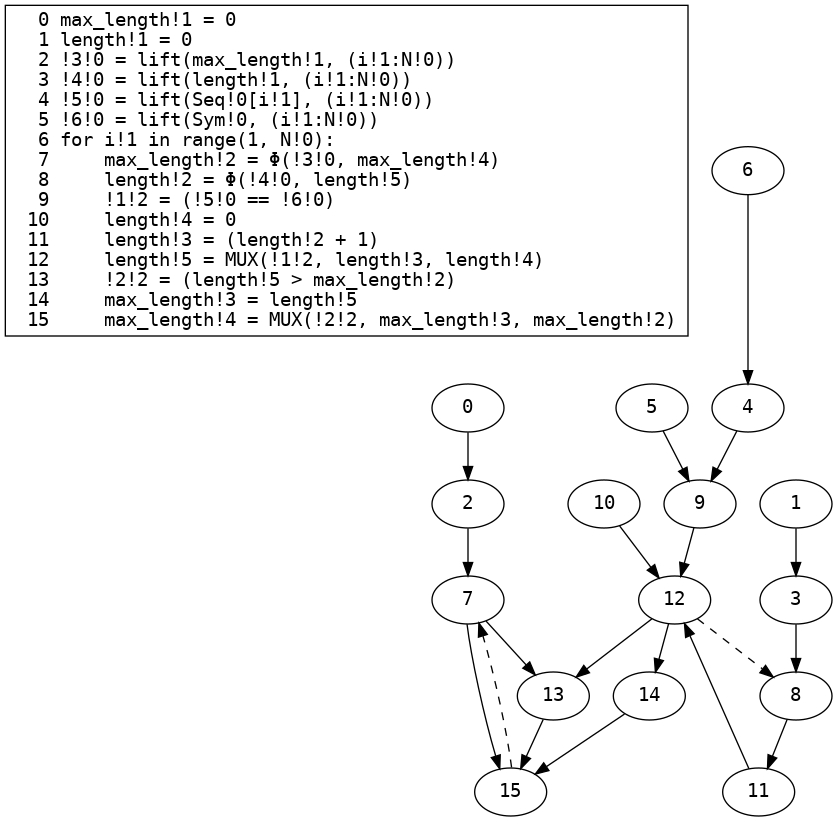
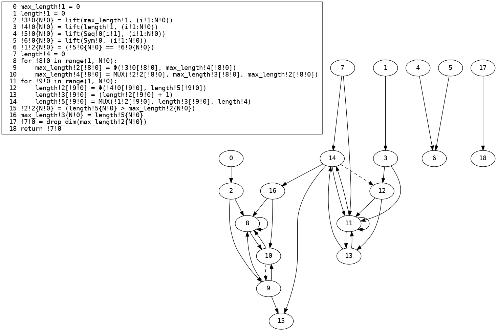
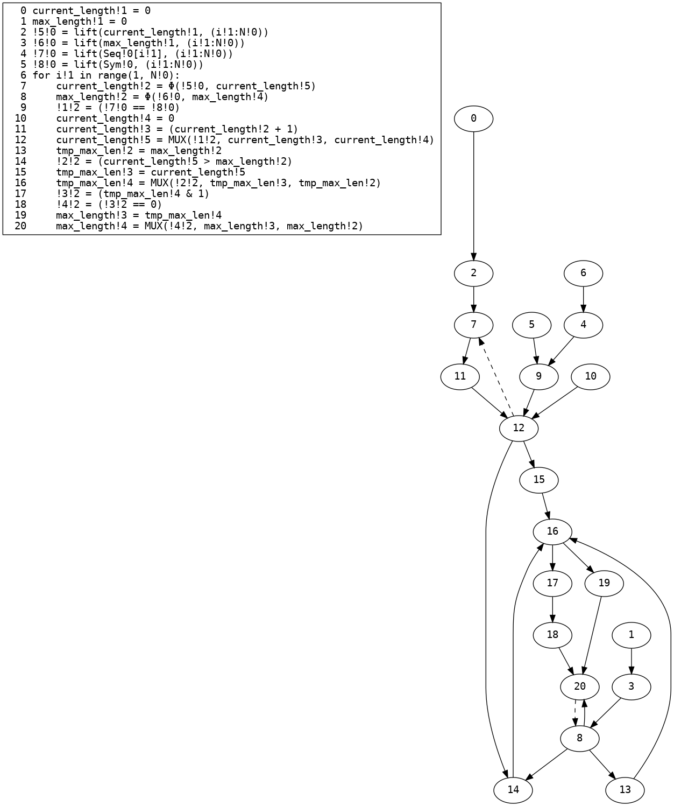
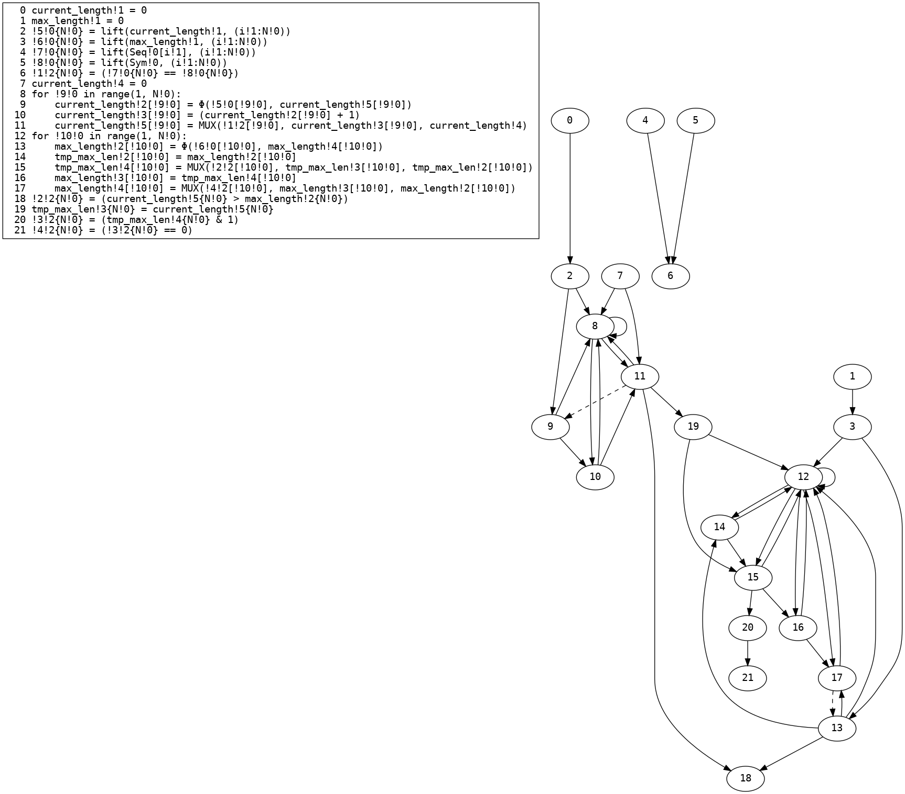

# [View the current version of the paper here](paper_SIMD.pdf)
# Compiler stages with different benchmarks
## `biometric`
### Input
```python
from UTIL import shared

# Biometric matching
# D is the number of features we are matching. Usually small, e.g., D=4
# N is the size of the database S
# C is the vector of features we are tryign to match.
# S is the (originally two dimentional) database array: S[0,0],S[0,1],..S[0,D-1],S[1,0]... S[N-1,D-1]
def biometric(
    C: shared[list[int]], D: int, S: shared[list[int]], N: int
) -> tuple[shared[int], shared[int]]:
    min_sum: int = 10000
    min_index = 0  # -1 (compiler doesn't support negative constants)
    for i in range(N):
        sum = 0
        for j in range(D):
            d = S[i * D + j] - C[j]
            p = d * d
            sum = sum + p
        if sum < min_sum:
            min_sum = sum
            min_index = i

    return (min_sum, min_index)


C = [1, 2, 3, 4]
S = [4, 5, 2, 10, 2, 120, 4, 10, 99, 88, 77, 66, 55, 44, 33, 22]
print(biometric(C, 4, S, 4))

```
### Restricted AST
```python
def biometric(C: shared[list[int; ?]], D: plaintext[int], S: shared[list[int; ?]], N: plaintext[int]) -> tuple[shared[int], shared[int]]:
    min_sum = 10000
    min_index = 0
    for i: plaintext[int] in range(0, N):
        sum = 0
        for j: plaintext[int] in range(0, D):
            d = (S[((i * D) + j)] - C[j])
            p = (d * d)
            sum = (sum + p)
        if (sum < min_sum):
            min_sum = sum
            min_index = i
    return (min_sum, min_index)
```
### Three-address code CFG

### SSA

### SSA ϕ→MUX

### Dead code elimination

### Linear code with loops
```python
def biometric(C!0: shared[list[int; ?]], D!0: plaintext[int], S!0: shared[list[int; ?]], N!0: plaintext[int]) -> tuple[shared[int], shared[int]]:
    min_sum!1 = 10000
    min_index!1 = 0
    for i!1 in range(0, N!0):
        min_sum!2 = Φ(min_sum!1, min_sum!4)
        min_index!2 = Φ(min_index!1, min_index!4)
        sum!2 = 0
        for j!1 in range(0, D!0):
            sum!3 = Φ(sum!2, sum!4)
            d!3 = (S!0[((i!1 * D!0) + j!1)] - C!0[j!1])
            p!3 = (d!3 * d!3)
            sum!4 = (sum!3 + p!3)
        !1!2 = (sum!3 < min_sum!2)
        min_sum!3 = sum!3
        min_index!3 = i!1
        min_sum!4 = MUX(!1!2, min_sum!3, min_sum!2)
        min_index!4 = MUX(!1!2, min_index!3, min_index!2)
    !2!1 = (min_sum!2, min_index!2)
    return !2!1

```
### Dependency graph

### Removal of infeasible edges

### Array MUX refinement
```python
def biometric(C!0: shared[list[int; ?]], D!0: plaintext[int], S!0: shared[list[int; ?]], N!0: plaintext[int]) -> tuple[shared[int], shared[int]]:
    min_sum!1 = 10000
    min_index!1 = 0
    for i!1 in range(0, N!0):
        min_sum!2 = Φ(min_sum!1, min_sum!4)
        min_index!2 = Φ(min_index!1, min_index!4)
        sum!2 = 0
        for j!1 in range(0, D!0):
            sum!3 = Φ(sum!2, sum!4)
            d!3 = (S!0[((i!1 * D!0) + j!1)] - C!0[j!1])
            p!3 = (d!3 * d!3)
            sum!4 = (sum!3 + p!3)
        !1!2 = (sum!3 < min_sum!2)
        min_sum!3 = sum!3
        min_index!3 = i!1
        min_sum!4 = MUX(!1!2, min_sum!3, min_sum!2)
        min_index!4 = MUX(!1!2, min_index!3, min_index!2)
    !2!1 = (min_sum!2, min_index!2)
    return !2!1

```
### Array MUX refinement (dependence graph)

### Basic Vectorization Phase 1
```python
def biometric(C!0: shared[list[int; ?]], D!0: plaintext[int], S!0: shared[list[int; ?]], N!0: plaintext[int]) -> tuple[shared[int], shared[int]]:
    min_sum!1 = 10000
    min_index!1 = 0
    !3!0 = lift(min_sum!1, (i!1:N!0))
    !4!0 = lift(min_index!1, (i!1:N!0))
    for i!1 in range(0, N!0):
        min_sum!2 = Φ(!3!0, min_sum!4)
        min_index!2 = Φ(!4!0, min_index!4)
        sum!2 = 0
        !5!0 = lift(sum!2, (i!1:N!0, j!1:D!0))
        !6!0 = lift(S!0[((i!1 * D!0) + j!1)], (i!1:N!0, j!1:D!0))
        !7!0 = lift(C!0[j!1], (i!1:N!0, j!1:D!0))
        for j!1 in range(0, D!0):
            sum!3 = Φ(!5!0, sum!4)
            d!3 = (!6!0 - !7!0)
            p!3 = (d!3 * d!3)
            sum!4 = (sum!3 + p!3)
        !8!0 = drop_dim(sum!3)
        !1!2 = (!8!0 < min_sum!2)
        !9!0 = drop_dim(sum!3)
        min_sum!3 = !9!0
        min_index!3 = i!1
        min_sum!4 = MUX(!1!2, min_sum!3, min_sum!2)
        min_index!4 = MUX(!1!2, min_index!3, min_index!2)
    !10!0 = drop_dim(min_sum!2)
    !11!0 = drop_dim(min_index!2)
    !2!1 = (!10!0, !11!0)
    return !2!1

```
### Basic Vectorization Phase 1 (dependence graph)

### Type Environment After Basic Vectorization Phase 1
| Variable | Type |
| - | - |
| `C!0` | `shared[list[int; ?]]` |
| `D!0` | `plaintext[int]` |
| `S!0` | `shared[list[int; ?]]` |
| `N!0` | `plaintext[int]` |
| `i!1` | `plaintext[int]` |
| `j!1` | `plaintext[int]` |
| `!10!0` | `shared[int]` |
| `!11!0` | `shared[int]` |
| `!2!1` | `tuple[shared[int], shared[int]]` |
| `min_index!2` | `shared[list[int; (i!1:N!0)]]` |
| `min_sum!2` | `shared[list[int; (i!1:N!0)]]` |
| `!1!2` | `shared[list[bool; (i!1:N!0)]]` |
| `min_index!3` | `plaintext[int]` |
| `min_index!4` | `shared[list[int; (i!1:N!0)]]` |
| `!4!0` | `plaintext[list[int; (i!1:N!0)]]` |
| `min_sum!3` | `shared[list[int; (i!1:N!0)]]` |
| `min_sum!4` | `shared[list[int; (i!1:N!0)]]` |
| `!3!0` | `plaintext[list[int; (i!1:N!0)]]` |
| `!8!0` | `shared[list[int; (i!1:N!0)]]` |
| `!9!0` | `shared[list[int; (i!1:N!0)]]` |
| `sum!3` | `shared[list[list[int; (i!1:N!0)]; (j!1:D!0)]]` |
| `p!3` | `shared[list[list[int; (i!1:N!0)]; (j!1:D!0)]]` |
| `sum!4` | `shared[list[list[int; (i!1:N!0)]; (j!1:D!0)]]` |
| `!5!0` | `plaintext[list[list[int; (i!1:N!0)]; (j!1:D!0)]]` |
| `d!3` | `shared[list[list[int; (i!1:N!0)]; (j!1:D!0)]]` |
| `!6!0` | `shared[list[list[int; (i!1:N!0)]; (j!1:D!0)]]` |
| `!7!0` | `shared[list[list[int; (i!1:N!0)]; (j!1:D!0)]]` |
| `sum!2` | `plaintext[int]` |
| `min_index!1` | `plaintext[int]` |
| `min_sum!1` | `plaintext[int]` |
### Typed Basic Vectorization Phase 1
```python
def biometric(C!0: shared[list[int; ?]], D!0: plaintext[int], S!0: shared[list[int; ?]], N!0: plaintext[int]) -> tuple[shared[int], shared[int]]:
    min_sum!1 = 10000
    min_index!1 = 0
    !3!0{N!0} = lift(min_sum!1, (i!1:N!0))
    !4!0{N!0} = lift(min_index!1, (i!1:N!0))
    for i!1 in range(0, N!0):
        min_sum!2{N!0} = Φ(!3!0{N!0}, min_sum!4{N!0})
        min_index!2{N!0} = Φ(!4!0{N!0}, min_index!4{N!0})
        sum!2 = 0
        !5!0{N!0, D!0} = lift(sum!2, (i!1:N!0, j!1:D!0))
        !6!0{N!0, D!0} = lift(S!0[((i!1 * D!0) + j!1)], (i!1:N!0, j!1:D!0))
        !7!0{N!0, D!0} = lift(C!0[j!1], (i!1:N!0, j!1:D!0))
        for j!1 in range(0, D!0):
            sum!3{N!0, D!0} = Φ(!5!0{N!0, D!0}, sum!4{N!0, D!0})
            d!3{N!0, D!0} = (!6!0{N!0, D!0} - !7!0{N!0, D!0})
            p!3{N!0, D!0} = (d!3{N!0, D!0} * d!3{N!0, D!0})
            sum!4{N!0, D!0} = (sum!3{N!0, D!0} + p!3{N!0, D!0})
        !8!0{N!0} = drop_dim(sum!3{N!0, D!0})
        !1!2{N!0} = (!8!0{N!0} < min_sum!2{N!0})
        !9!0{N!0} = drop_dim(sum!3{N!0, D!0})
        min_sum!3{N!0} = !9!0{N!0}
        min_index!3 = i!1
        min_sum!4{N!0} = MUX(!1!2{N!0}, min_sum!3{N!0}, min_sum!2{N!0})
        min_index!4{N!0} = MUX(!1!2{N!0}, min_index!3, min_index!2{N!0})
    !10!0 = drop_dim(min_sum!2{N!0})
    !11!0 = drop_dim(min_index!2{N!0})
    !2!1 = (!10!0, !11!0)
    return !2!1

```
### Basic Vectorization Phase 2
```python
def biometric(C!0: shared[list[int; ?]], D!0: plaintext[int], S!0: shared[list[int; ?]], N!0: plaintext[int]) -> tuple[shared[int], shared[int]]:
    min_sum!1 = 10000
    min_index!1 = 0
    !3!0{N!0} = lift(min_sum!1, (i!1:N!0))
    !4!0{N!0} = lift(min_index!1, (i!1:N!0))
    sum!2 = 0
    !5!0{N!0, D!0} = lift(sum!2, (i!1:N!0, j!1:D!0))
    !6!0{N!0, D!0} = lift(S!0[((i!1 * D!0) + j!1)], (i!1:N!0, j!1:D!0))
    !7!0{N!0, D!0} = lift(C!0[j!1], (i!1:N!0, j!1:D!0))
    d!3{N!0, D!0} = (!6!0{N!0, D!0} - !7!0{N!0, D!0})
    p!3{N!0, D!0} = (d!3{N!0, D!0} * d!3{N!0, D!0})
    for !12!0 in range(0, D!0):
        sum!3{N!0}[!12!0] = Φ(!5!0{N!0}[!12!0], sum!4{N!0}[!12!0])
        sum!4{N!0}[!12!0] = (sum!3{N!0}[!12!0] + p!3{N!0}[!12!0])
    !8!0{N!0} = drop_dim(sum!3{N!0, D!0})
    for !13!0 in range(0, N!0):
        min_sum!2[!13!0] = Φ(!3!0[!13!0], min_sum!4[!13!0])
        min_sum!4[!13!0] = MUX(!1!2[!13!0], min_sum!3[!13!0], min_sum!2[!13!0])
    !1!2{N!0} = (!8!0{N!0} < min_sum!2{N!0})
    !9!0{N!0} = drop_dim(sum!3{N!0, D!0})
    min_sum!3{N!0} = !9!0{N!0}
    !14!0 = lift(i!1, (i!1:N!0))
    for !15!0 in range(0, N!0):
        min_index!2[!15!0] = Φ(!4!0[!15!0], min_index!4[!15!0])
        min_index!4[!15!0] = MUX(!1!2[!15!0], !14!0[i!1], min_index!2[!15!0])
    !10!0 = drop_dim(min_sum!2{N!0})
    !11!0 = drop_dim(min_index!2{N!0})
    !2!1 = (!10!0, !11!0)
    return !2!1

```
### Type Environment After Basic Vectorization Phase 2
| Variable | Type |
| - | - |
| `C!0` | `shared[list[int; ?]]` |
| `D!0` | `plaintext[int]` |
| `S!0` | `shared[list[int; ?]]` |
| `N!0` | `plaintext[int]` |
| `i!1` | `plaintext[int]` |
| `j!1` | `plaintext[int]` |
| `!10!0` | `shared[int]` |
| `!11!0` | `shared[int]` |
| `!2!1` | `tuple[shared[int], shared[int]]` |
| `min_index!2` | `shared[list[int; (i!1:N!0)]]` |
| `min_sum!2` | `shared[list[int; (i!1:N!0)]]` |
| `!1!2` | `shared[list[bool; (i!1:N!0)]]` |
| `min_index!3` | `plaintext[int]` |
| `min_index!4` | `shared[list[int; (i!1:N!0)]]` |
| `!4!0` | `plaintext[list[int; (i!1:N!0)]]` |
| `min_sum!3` | `shared[list[int; (i!1:N!0)]]` |
| `min_sum!4` | `shared[list[int; (i!1:N!0)]]` |
| `!3!0` | `plaintext[list[int; (i!1:N!0)]]` |
| `!8!0` | `shared[list[int; (i!1:N!0)]]` |
| `!9!0` | `shared[list[int; (i!1:N!0)]]` |
| `sum!3` | `shared[list[list[int; (i!1:N!0)]; (j!1:D!0)]]` |
| `p!3` | `shared[list[list[int; (i!1:N!0)]; (j!1:D!0)]]` |
| `sum!4` | `shared[list[list[int; (i!1:N!0)]; (j!1:D!0)]]` |
| `!5!0` | `plaintext[list[list[int; (i!1:N!0)]; (j!1:D!0)]]` |
| `d!3` | `shared[list[list[int; (i!1:N!0)]; (j!1:D!0)]]` |
| `!6!0` | `shared[list[list[int; (i!1:N!0)]; (j!1:D!0)]]` |
| `!7!0` | `shared[list[list[int; (i!1:N!0)]; (j!1:D!0)]]` |
| `sum!2` | `plaintext[int]` |
| `min_index!1` | `plaintext[int]` |
| `min_sum!1` | `plaintext[int]` |
| `!12!0` | `plaintext[int]` |
| `!13!0` | `plaintext[int]` |
| `!14!0` | `plaintext[list[int; (i!1:N!0)]]` |
| `!15!0` | `plaintext[int]` |
### Basic Vectorization Phase 2 (dependence graph)

### Motion code
```cpp
template <encrypto::motion::MpcProtocol Protocol>
std::tuple<encrypto::motion::SecureUnsignedInteger, encrypto::motion::SecureUnsignedInteger> biometric(
    encrypto::motion::PartyPointer &party,
    std::vector<encrypto::motion::SecureUnsignedInteger> C_0,
    std::uint32_t _MPC_PLAINTEXT_D_0,
    std::vector<encrypto::motion::SecureUnsignedInteger> S_0,
    std::uint32_t _MPC_PLAINTEXT_N_0
) {
    // Shared variable declarations
    std::vector<encrypto::motion::ShareWrapper> _1_2;
    encrypto::motion::SecureUnsignedInteger _10_0;
    encrypto::motion::SecureUnsignedInteger _11_0;
    encrypto::motion::SecureUnsignedInteger _12_0;
    encrypto::motion::SecureUnsignedInteger _13_0;
    std::vector<encrypto::motion::SecureUnsignedInteger> _14_0;
    encrypto::motion::SecureUnsignedInteger _15_0;
    std::tuple<encrypto::motion::SecureUnsignedInteger, encrypto::motion::SecureUnsignedInteger> _2_1;
    std::vector<encrypto::motion::SecureUnsignedInteger> _3_0;
    std::vector<encrypto::motion::SecureUnsignedInteger> _4_0;
    std::vector<encrypto::motion::SecureUnsignedInteger> _5_0;
    std::vector<encrypto::motion::SecureUnsignedInteger> _6_0;
    std::vector<encrypto::motion::SecureUnsignedInteger> _7_0;
    std::vector<encrypto::motion::SecureUnsignedInteger> _8_0;
    std::vector<encrypto::motion::SecureUnsignedInteger> _9_0;
    encrypto::motion::SecureUnsignedInteger D_0;
    encrypto::motion::SecureUnsignedInteger N_0;
    std::vector<encrypto::motion::SecureUnsignedInteger> d_3;
    encrypto::motion::SecureUnsignedInteger i_1;
    encrypto::motion::SecureUnsignedInteger j_1;
    encrypto::motion::SecureUnsignedInteger min_index_1;
    std::vector<encrypto::motion::SecureUnsignedInteger> min_index_2;
    encrypto::motion::SecureUnsignedInteger min_index_3;
    std::vector<encrypto::motion::SecureUnsignedInteger> min_index_4;
    encrypto::motion::SecureUnsignedInteger min_sum_1;
    std::vector<encrypto::motion::SecureUnsignedInteger> min_sum_2;
    std::vector<encrypto::motion::SecureUnsignedInteger> min_sum_3;
    std::vector<encrypto::motion::SecureUnsignedInteger> min_sum_4;
    std::vector<encrypto::motion::SecureUnsignedInteger> p_3;
    encrypto::motion::SecureUnsignedInteger sum_2;
    std::vector<encrypto::motion::SecureUnsignedInteger> sum_3;
    std::vector<encrypto::motion::SecureUnsignedInteger> sum_4;

    // Plaintext variable declarations
    std::uint32_t _MPC_PLAINTEXT__12_0;
    std::uint32_t _MPC_PLAINTEXT__13_0;
    std::vector<std::uint32_t> _MPC_PLAINTEXT__14_0;
    std::uint32_t _MPC_PLAINTEXT__15_0;
    std::tuple<std::uint32_t, std::uint32_t> _MPC_PLAINTEXT__2_1;
    std::vector<std::uint32_t> _MPC_PLAINTEXT__3_0;
    std::vector<std::uint32_t> _MPC_PLAINTEXT__4_0;
    std::vector<std::uint32_t> _MPC_PLAINTEXT__5_0;
    std::uint32_t _MPC_PLAINTEXT_i_1;
    std::uint32_t _MPC_PLAINTEXT_j_1;
    std::uint32_t _MPC_PLAINTEXT_min_index_1;
    std::uint32_t _MPC_PLAINTEXT_min_index_3;
    std::uint32_t _MPC_PLAINTEXT_min_sum_1;
    std::uint32_t _MPC_PLAINTEXT_sum_2;

    // Constant initializations
    encrypto::motion::SecureUnsignedInteger _MPC_CONSTANT_0 = party->In<Protocol>(encrypto::motion::ToInput(std::uint32_t(0)), 0);
    encrypto::motion::SecureUnsignedInteger _MPC_CONSTANT_10000 = party->In<Protocol>(encrypto::motion::ToInput(std::uint32_t(10000)), 0);

    // Plaintext parameter assignments
    D_0 = party->In<Protocol>(encrypto::motion::ToInput(_MPC_PLAINTEXT_D_0), 0);

    N_0 = party->In<Protocol>(encrypto::motion::ToInput(_MPC_PLAINTEXT_N_0), 0);

    // Function body
    min_sum_1 = _MPC_CONSTANT_10000;
    _MPC_PLAINTEXT_min_sum_1 = std::uint32_t(10000);
    min_index_1 = _MPC_CONSTANT_0;
    _MPC_PLAINTEXT_min_index_1 = std::uint32_t(0);
    vectorized_assign(_3_0, {_MPC_PLAINTEXT_N_0}, {true}, {_MPC_PLAINTEXT_i_1}, lift([&](const auto &indices){return _MPC_PLAINTEXT_min_sum_1;}, , {_MPC_PLAINTEXT_N_0}));
    vectorized_assign(_4_0, {_MPC_PLAINTEXT_N_0}, {true}, {_MPC_PLAINTEXT_i_1}, lift([&](const auto &indices){return _MPC_PLAINTEXT_min_index_1;}, , {_MPC_PLAINTEXT_N_0}));
    sum_2 = _MPC_CONSTANT_0;
    _MPC_PLAINTEXT_sum_2 = std::uint32_t(0);
    vectorized_assign(_5_0, {_MPC_PLAINTEXT_N_0, _MPC_PLAINTEXT_D_0}, {true, true}, {_MPC_PLAINTEXT_i_1, _MPC_PLAINTEXT_j_1}, lift([&](const auto &indices){return _MPC_PLAINTEXT_sum_2;}, , {_MPC_PLAINTEXT_N_0, _MPC_PLAINTEXT_D_0}));
    vectorized_assign(_6_0, {_MPC_PLAINTEXT_N_0, _MPC_PLAINTEXT_D_0}, {true, true}, {_MPC_PLAINTEXT_i_1, _MPC_PLAINTEXT_j_1}, lift([&](const auto &indices){return _MPC_PLAINTEXT_S_0[((indices[0] * _MPC_PLAINTEXT_D_0) + indices[1])];}, , {_MPC_PLAINTEXT_N_0, _MPC_PLAINTEXT_D_0}));
    vectorized_assign(_7_0, {_MPC_PLAINTEXT_N_0, _MPC_PLAINTEXT_D_0}, {true, true}, {_MPC_PLAINTEXT_i_1, _MPC_PLAINTEXT_j_1}, lift([&](const auto &indices){return _MPC_PLAINTEXT_C_0[indices[1]];}, , {_MPC_PLAINTEXT_N_0, _MPC_PLAINTEXT_D_0}));
    vectorized_assign(d_3, {_MPC_PLAINTEXT_N_0, _MPC_PLAINTEXT_D_0}, {true, true}, {_MPC_PLAINTEXT_i_1, _MPC_PLAINTEXT_j_1}, (vectorized_access(_6_0, {_MPC_PLAINTEXT_N_0, _MPC_PLAINTEXT_D_0}, {true, true}, {_MPC_PLAINTEXT_i_1, _MPC_PLAINTEXT_j_1}) - vectorized_access(_7_0, {_MPC_PLAINTEXT_N_0, _MPC_PLAINTEXT_D_0}, {true, true}, {_MPC_PLAINTEXT_i_1, _MPC_PLAINTEXT_j_1})));
    vectorized_assign(p_3, {_MPC_PLAINTEXT_N_0, _MPC_PLAINTEXT_D_0}, {true, true}, {_MPC_PLAINTEXT_i_1, _MPC_PLAINTEXT_j_1}, (vectorized_access(d_3, {_MPC_PLAINTEXT_N_0, _MPC_PLAINTEXT_D_0}, {true, true}, {_MPC_PLAINTEXT_i_1, _MPC_PLAINTEXT_j_1}) * vectorized_access(d_3, {_MPC_PLAINTEXT_N_0, _MPC_PLAINTEXT_D_0}, {true, true}, {_MPC_PLAINTEXT_i_1, _MPC_PLAINTEXT_j_1})));

    // Initialize phi values
    vectorized_assign(sum_3, {_MPC_PLAINTEXT_N_0, _MPC_PLAINTEXT_D_0}, {true, false}, {_MPC_PLAINTEXT_i_1, _MPC_PLAINTEXT__12_0}, vectorized_access(_5_0, {_MPC_PLAINTEXT_N_0, _MPC_PLAINTEXT_D_0}, {true, false}, {_MPC_PLAINTEXT_i_1, _MPC_PLAINTEXT__12_0}));
    for (_MPC_PLAINTEXT__12_0 = std::uint32_t(0); _MPC_PLAINTEXT__12_0 < _MPC_PLAINTEXT_D_0; _MPC_PLAINTEXT__12_0++) {
        _12_0 = party->In<Protocol>(encrypto::motion::ToInput(_MPC_PLAINTEXT__12_0), 0);
        vectorized_assign(sum_4, {_MPC_PLAINTEXT_N_0, _MPC_PLAINTEXT_D_0}, {true, false}, {_MPC_PLAINTEXT_i_1, _MPC_PLAINTEXT__12_0}, (vectorized_access(sum_3, {_MPC_PLAINTEXT_N_0, _MPC_PLAINTEXT_D_0}, {true, false}, {_MPC_PLAINTEXT_i_1, _MPC_PLAINTEXT__12_0}) + vectorized_access(p_3, {_MPC_PLAINTEXT_N_0, _MPC_PLAINTEXT_D_0}, {true, false}, {_MPC_PLAINTEXT_i_1, _MPC_PLAINTEXT__12_0})));

        // Update phi values
        vectorized_assign(sum_3, {_MPC_PLAINTEXT_N_0, _MPC_PLAINTEXT_D_0}, {true, false}, {_MPC_PLAINTEXT_i_1, _MPC_PLAINTEXT__12_0}, vectorized_access(sum_4, {_MPC_PLAINTEXT_N_0, _MPC_PLAINTEXT_D_0}, {true, false}, {_MPC_PLAINTEXT_i_1, _MPC_PLAINTEXT__12_0}));
    }

    vectorized_assign(_8_0, {_MPC_PLAINTEXT_N_0}, {true}, {_MPC_PLAINTEXT_i_1}, drop_dim(sum_3, {_MPC_PLAINTEXT_N_0, _MPC_PLAINTEXT_D_0}));

    // Initialize phi values
    vectorized_assign(min_sum_2, {_MPC_PLAINTEXT_N_0}, {false}, {_MPC_PLAINTEXT__13_0}, vectorized_access(_3_0, {_MPC_PLAINTEXT_N_0}, {false}, {_MPC_PLAINTEXT__13_0}));
    for (_MPC_PLAINTEXT__13_0 = std::uint32_t(0); _MPC_PLAINTEXT__13_0 < _MPC_PLAINTEXT_N_0; _MPC_PLAINTEXT__13_0++) {
        _13_0 = party->In<Protocol>(encrypto::motion::ToInput(_MPC_PLAINTEXT__13_0), 0);
        vectorized_assign(min_sum_4, {_MPC_PLAINTEXT_N_0}, {false}, {_MPC_PLAINTEXT__13_0}, vectorized_access(_1_2, {_MPC_PLAINTEXT_N_0}, {false}, {_MPC_PLAINTEXT__13_0}).Mux(vectorized_access(min_sum_3, {_MPC_PLAINTEXT_N_0}, {false}, {_MPC_PLAINTEXT__13_0}).Get(), vectorized_access(min_sum_2, {_MPC_PLAINTEXT_N_0}, {false}, {_MPC_PLAINTEXT__13_0}).Get()));

        // Update phi values
        vectorized_assign(min_sum_2, {_MPC_PLAINTEXT_N_0}, {false}, {_MPC_PLAINTEXT__13_0}, vectorized_access(min_sum_4, {_MPC_PLAINTEXT_N_0}, {false}, {_MPC_PLAINTEXT__13_0}));
    }

    vectorized_assign(_1_2, {_MPC_PLAINTEXT_N_0}, {true}, {_MPC_PLAINTEXT_i_1}, (vectorized_access(min_sum_2, {_MPC_PLAINTEXT_N_0}, {true}, {_MPC_PLAINTEXT_i_1}) > vectorized_access(_8_0, {_MPC_PLAINTEXT_N_0}, {true}, {_MPC_PLAINTEXT_i_1})));
    vectorized_assign(_9_0, {_MPC_PLAINTEXT_N_0}, {true}, {_MPC_PLAINTEXT_i_1}, drop_dim(sum_3, {_MPC_PLAINTEXT_N_0, _MPC_PLAINTEXT_D_0}));
    vectorized_assign(min_sum_3, {_MPC_PLAINTEXT_N_0}, {true}, {_MPC_PLAINTEXT_i_1}, vectorized_access(_9_0, {_MPC_PLAINTEXT_N_0}, {true}, {_MPC_PLAINTEXT_i_1}));
    _14_0 = lift([&](const auto &indices){return indices[0];}, , {_MPC_PLAINTEXT_N_0});
    _MPC_PLAINTEXT__14_0 = lift([&](const auto &indices){return indices[0];}, , {_MPC_PLAINTEXT_N_0});

    // Initialize phi values
    vectorized_assign(min_index_2, {_MPC_PLAINTEXT_N_0}, {false}, {_MPC_PLAINTEXT__15_0}, vectorized_access(_4_0, {_MPC_PLAINTEXT_N_0}, {false}, {_MPC_PLAINTEXT__15_0}));
    for (_MPC_PLAINTEXT__15_0 = std::uint32_t(0); _MPC_PLAINTEXT__15_0 < _MPC_PLAINTEXT_N_0; _MPC_PLAINTEXT__15_0++) {
        _15_0 = party->In<Protocol>(encrypto::motion::ToInput(_MPC_PLAINTEXT__15_0), 0);
        vectorized_assign(min_index_4, {_MPC_PLAINTEXT_N_0}, {false}, {_MPC_PLAINTEXT__15_0}, vectorized_access(_1_2, {_MPC_PLAINTEXT_N_0}, {false}, {_MPC_PLAINTEXT__15_0}).Mux(vectorized_access(_14_0, {_MPC_PLAINTEXT_N_0}, {false}, {_MPC_PLAINTEXT_i_1}).Get(), vectorized_access(min_index_2, {_MPC_PLAINTEXT_N_0}, {false}, {_MPC_PLAINTEXT__15_0}).Get()));

        // Update phi values
        vectorized_assign(min_index_2, {_MPC_PLAINTEXT_N_0}, {false}, {_MPC_PLAINTEXT__15_0}, vectorized_access(min_index_4, {_MPC_PLAINTEXT_N_0}, {false}, {_MPC_PLAINTEXT__15_0}));
    }

    _10_0 = drop_dim(min_sum_2, {_MPC_PLAINTEXT_N_0});
    _11_0 = drop_dim(min_index_2, {_MPC_PLAINTEXT_N_0});
    _2_1 = std::make_tuple(_10_0, _11_0);
    return _2_1;

}
```
## `chapterfour_figure_12`
### Input
```python
from UTIL import shared


def chapterfour_figure_12(x: shared[int], y: shared[int]) -> shared[int]:
    z = 0
    if x > 0:
        if y > 0:
            z = 1
        else:
            z = 0
    return z

```
### Restricted AST
```python
def chapterfour_figure_12(x: shared[int], y: shared[int]) -> shared[int]:
    z = 0
    if (x > 0):
        if (y > 0):
            z = 1
        else:
            z = 0
    return z
```
### Three-address code CFG

### SSA

### SSA ϕ→MUX

### Dead code elimination

### Linear code with loops
```python
def chapterfour_figure_12(x!0: shared[int], y!0: shared[int]) -> shared[int]:
    z!1 = 0
    !1!1 = (x!0 > 0)
    !2!1 = (y!0 > 0)
    z!3 = 0
    z!2 = 1
    z!4 = MUX(!2!1, z!2, z!3)
    z!5 = MUX(!1!1, z!1, z!4)
    return z!5

```
### Dependency graph

### Removal of infeasible edges

### Array MUX refinement
```python
def chapterfour_figure_12(x!0: shared[int], y!0: shared[int]) -> shared[int]:
    z!1 = 0
    !1!1 = (x!0 > 0)
    !2!1 = (y!0 > 0)
    z!3 = 0
    z!2 = 1
    z!4 = MUX(!2!1, z!2, z!3)
    z!5 = MUX(!1!1, z!1, z!4)
    return z!5

```
### Array MUX refinement (dependence graph)

### Basic Vectorization Phase 1
```python
def chapterfour_figure_12(x!0: shared[int], y!0: shared[int]) -> shared[int]:
    z!1 = 0
    !1!1 = (x!0 > 0)
    !2!1 = (y!0 > 0)
    z!3 = 0
    z!2 = 1
    z!4 = MUX(!2!1, z!2, z!3)
    z!5 = MUX(!1!1, z!1, z!4)
    return z!5

```
### Basic Vectorization Phase 1 (dependence graph)

### Type Environment After Basic Vectorization Phase 1
| Variable | Type |
| - | - |
| `x!0` | `shared[int]` |
| `y!0` | `shared[int]` |
| `!1!1` | `shared[bool]` |
| `z!4` | `shared[int]` |
| `z!1` | `plaintext[int]` |
| `z!5` | `shared[int]` |
| `!2!1` | `shared[bool]` |
| `z!3` | `plaintext[int]` |
| `z!2` | `plaintext[int]` |
### Typed Basic Vectorization Phase 1
```python
def chapterfour_figure_12(x!0: shared[int], y!0: shared[int]) -> shared[int]:
    z!1 = 0
    !1!1 = (x!0 > 0)
    !2!1 = (y!0 > 0)
    z!3 = 0
    z!2 = 1
    z!4 = MUX(!2!1, z!2, z!3)
    z!5 = MUX(!1!1, z!1, z!4)
    return z!5

```
### Basic Vectorization Phase 2
```python
def chapterfour_figure_12(x!0: shared[int], y!0: shared[int]) -> shared[int]:
    z!1 = 0
    !1!1 = (x!0 > 0)
    !2!1 = (y!0 > 0)
    z!3 = 0
    z!2 = 1
    z!4 = MUX(!2!1, z!2, z!3)
    z!5 = MUX(!1!1, z!1, z!4)
    return z!5

```
### Type Environment After Basic Vectorization Phase 2
| Variable | Type |
| - | - |
| `x!0` | `shared[int]` |
| `y!0` | `shared[int]` |
| `!1!1` | `shared[bool]` |
| `z!4` | `shared[int]` |
| `z!1` | `plaintext[int]` |
| `z!5` | `shared[int]` |
| `!2!1` | `shared[bool]` |
| `z!3` | `plaintext[int]` |
| `z!2` | `plaintext[int]` |
### Basic Vectorization Phase 2 (dependence graph)

### Motion code
```cpp
template <encrypto::motion::MpcProtocol Protocol>
encrypto::motion::SecureUnsignedInteger chapterfour_figure_12(
    encrypto::motion::PartyPointer &party,
    encrypto::motion::SecureUnsignedInteger x_0,
    encrypto::motion::SecureUnsignedInteger y_0
) {
    // Shared variable declarations
    encrypto::motion::ShareWrapper _1_1;
    encrypto::motion::ShareWrapper _2_1;
    encrypto::motion::SecureUnsignedInteger z_1;
    encrypto::motion::SecureUnsignedInteger z_2;
    encrypto::motion::SecureUnsignedInteger z_3;
    encrypto::motion::SecureUnsignedInteger z_4;
    encrypto::motion::SecureUnsignedInteger z_5;

    // Plaintext variable declarations
    std::uint32_t _MPC_PLAINTEXT_z_1;
    std::uint32_t _MPC_PLAINTEXT_z_2;
    std::uint32_t _MPC_PLAINTEXT_z_3;

    // Constant initializations
    encrypto::motion::SecureUnsignedInteger _MPC_CONSTANT_0 = party->In<Protocol>(encrypto::motion::ToInput(std::uint32_t(0)), 0);
    encrypto::motion::SecureUnsignedInteger _MPC_CONSTANT_1 = party->In<Protocol>(encrypto::motion::ToInput(std::uint32_t(1)), 0);

    // Plaintext parameter assignments


    // Function body
    z_1 = _MPC_CONSTANT_0;
    _MPC_PLAINTEXT_z_1 = std::uint32_t(0);
    _1_1 = (x_0 > _MPC_CONSTANT_0);
    _2_1 = (y_0 > _MPC_CONSTANT_0);
    z_3 = _MPC_CONSTANT_0;
    _MPC_PLAINTEXT_z_3 = std::uint32_t(0);
    z_2 = _MPC_CONSTANT_1;
    _MPC_PLAINTEXT_z_2 = std::uint32_t(1);
    z_4 = _2_1.Mux(z_2.Get(), z_3.Get());
    z_5 = _1_1.Mux(z_1.Get(), z_4.Get());
    return z_5;

}
```
## `count_102`
### Input
```python
from UTIL import shared


def count_102(Seq: shared[list[int]], N: int, Syms: shared[list[int]]) -> shared[int]:
    """
    Computes the number of instances of regex a(b*)c in a provided sequence.
    Syms is a list of form [a, b, c].
    """
    s0 = False
    c = 0

    for i in range(0, N):
        if s0 and (Seq[i] == Syms[2]):
            c = c + 1

        s0 = (Seq[i] == Syms[1]) or (s0 and (Seq[i] == Syms[0]))

    return c


seq = [1, 0, 2, 1, 0, 0, 2, 1, 2, 2]
print(count_102(seq, 10, [1, 0, 2]))

```
### Restricted AST
```python
def count_102(Seq: shared[list[int; ?]], N: plaintext[int], Syms: shared[list[int; ?]]) -> shared[int]:
    s0 = False
    c = 0
    for i: plaintext[int] in range(0, N):
        if (s0 and (Seq[i] == Syms[2])):
            c = (c + 1)
        s0 = ((Seq[i] == Syms[1]) or (s0 and (Seq[i] == Syms[0])))
    return c
```
### Three-address code CFG

### SSA

### SSA ϕ→MUX

### Dead code elimination

### Linear code with loops
```python
def count_102(Seq!0: shared[list[int; ?]], N!0: plaintext[int], Syms!0: shared[list[int; ?]]) -> shared[int]:
    s0!1 = False
    c!1 = 0
    for i!1 in range(0, N!0):
        s0!2 = Φ(s0!1, s0!3)
        c!2 = Φ(c!1, c!4)
        !1!2 = (Seq!0[i!1] == Syms!0[2])
        !2!2 = (s0!2 and !1!2)
        c!3 = (c!2 + 1)
        c!4 = MUX(!2!2, c!3, c!2)
        !3!2 = (Seq!0[i!1] == Syms!0[1])
        !5!2 = (Seq!0[i!1] == Syms!0[0])
        !6!2 = (s0!2 and !5!2)
        s0!3 = (!3!2 or !6!2)
    return c!2

```
### Dependency graph

### Removal of infeasible edges

### Array MUX refinement
```python
def count_102(Seq!0: shared[list[int; ?]], N!0: plaintext[int], Syms!0: shared[list[int; ?]]) -> shared[int]:
    s0!1 = False
    c!1 = 0
    for i!1 in range(0, N!0):
        s0!2 = Φ(s0!1, s0!3)
        c!2 = Φ(c!1, c!4)
        !1!2 = (Seq!0[i!1] == Syms!0[2])
        !2!2 = (s0!2 and !1!2)
        c!3 = (c!2 + 1)
        c!4 = MUX(!2!2, c!3, c!2)
        !3!2 = (Seq!0[i!1] == Syms!0[1])
        !5!2 = (Seq!0[i!1] == Syms!0[0])
        !6!2 = (s0!2 and !5!2)
        s0!3 = (!3!2 or !6!2)
    return c!2

```
### Array MUX refinement (dependence graph)

### Basic Vectorization Phase 1
```python
def count_102(Seq!0: shared[list[int; ?]], N!0: plaintext[int], Syms!0: shared[list[int; ?]]) -> shared[int]:
    s0!1 = False
    c!1 = 0
    !7!0 = lift(s0!1, (i!1:N!0))
    !8!0 = lift(c!1, (i!1:N!0))
    !9!0 = lift(Seq!0[i!1], (i!1:N!0))
    !10!0 = lift(Syms!0[2], (i!1:N!0))
    !11!0 = lift(Seq!0[i!1], (i!1:N!0))
    !12!0 = lift(Syms!0[1], (i!1:N!0))
    !13!0 = lift(Seq!0[i!1], (i!1:N!0))
    !14!0 = lift(Syms!0[0], (i!1:N!0))
    for i!1 in range(0, N!0):
        s0!2 = Φ(!7!0, s0!3)
        c!2 = Φ(!8!0, c!4)
        !1!2 = (!9!0 == !10!0)
        !2!2 = (s0!2 and !1!2)
        c!3 = (c!2 + 1)
        c!4 = MUX(!2!2, c!3, c!2)
        !3!2 = (!11!0 == !12!0)
        !5!2 = (!13!0 == !14!0)
        !6!2 = (s0!2 and !5!2)
        s0!3 = (!3!2 or !6!2)
    !15!0 = drop_dim(c!2)
    return !15!0

```
### Basic Vectorization Phase 1 (dependence graph)

### Type Environment After Basic Vectorization Phase 1
| Variable | Type |
| - | - |
| `Seq!0` | `shared[list[int; ?]]` |
| `N!0` | `plaintext[int]` |
| `Syms!0` | `shared[list[int; ?]]` |
| `i!1` | `plaintext[int]` |
| `c!2` | `shared[list[int; (i!1:N!0)]]` |
| `!15!0` | `shared[int]` |
| `!3!2` | `shared[list[bool; (i!1:N!0)]]` |
| `!6!2` | `shared[list[bool; (i!1:N!0)]]` |
| `s0!3` | `shared[list[bool; (i!1:N!0)]]` |
| `!7!0` | `plaintext[list[bool; (i!1:N!0)]]` |
| `s0!2` | `shared[list[bool; (i!1:N!0)]]` |
| `!5!2` | `shared[list[bool; (i!1:N!0)]]` |
| `!1!2` | `shared[list[bool; (i!1:N!0)]]` |
| `!2!2` | `shared[list[bool; (i!1:N!0)]]` |
| `c!3` | `shared[list[int; (i!1:N!0)]]` |
| `c!4` | `shared[list[int; (i!1:N!0)]]` |
| `!8!0` | `plaintext[list[int; (i!1:N!0)]]` |
| `!13!0` | `shared[list[int; (i!1:N!0)]]` |
| `!14!0` | `shared[list[int; (i!1:N!0)]]` |
| `!11!0` | `shared[list[int; (i!1:N!0)]]` |
| `!12!0` | `shared[list[int; (i!1:N!0)]]` |
| `!9!0` | `shared[list[int; (i!1:N!0)]]` |
| `!10!0` | `shared[list[int; (i!1:N!0)]]` |
| `c!1` | `plaintext[int]` |
| `s0!1` | `plaintext[bool]` |
### Typed Basic Vectorization Phase 1
```python
def count_102(Seq!0: shared[list[int; ?]], N!0: plaintext[int], Syms!0: shared[list[int; ?]]) -> shared[int]:
    s0!1 = False
    c!1 = 0
    !7!0{N!0} = lift(s0!1, (i!1:N!0))
    !8!0{N!0} = lift(c!1, (i!1:N!0))
    !9!0{N!0} = lift(Seq!0[i!1], (i!1:N!0))
    !10!0{N!0} = lift(Syms!0[2], (i!1:N!0))
    !11!0{N!0} = lift(Seq!0[i!1], (i!1:N!0))
    !12!0{N!0} = lift(Syms!0[1], (i!1:N!0))
    !13!0{N!0} = lift(Seq!0[i!1], (i!1:N!0))
    !14!0{N!0} = lift(Syms!0[0], (i!1:N!0))
    for i!1 in range(0, N!0):
        s0!2{N!0} = Φ(!7!0{N!0}, s0!3{N!0})
        c!2{N!0} = Φ(!8!0{N!0}, c!4{N!0})
        !1!2{N!0} = (!9!0{N!0} == !10!0{N!0})
        !2!2{N!0} = (s0!2{N!0} and !1!2{N!0})
        c!3{N!0} = (c!2{N!0} + 1)
        c!4{N!0} = MUX(!2!2{N!0}, c!3{N!0}, c!2{N!0})
        !3!2{N!0} = (!11!0{N!0} == !12!0{N!0})
        !5!2{N!0} = (!13!0{N!0} == !14!0{N!0})
        !6!2{N!0} = (s0!2{N!0} and !5!2{N!0})
        s0!3{N!0} = (!3!2{N!0} or !6!2{N!0})
    !15!0 = drop_dim(c!2{N!0})
    return !15!0

```
### Basic Vectorization Phase 2
```python
def count_102(Seq!0: shared[list[int; ?]], N!0: plaintext[int], Syms!0: shared[list[int; ?]]) -> shared[int]:
    s0!1 = False
    c!1 = 0
    !7!0{N!0} = lift(s0!1, (i!1:N!0))
    !8!0{N!0} = lift(c!1, (i!1:N!0))
    !9!0{N!0} = lift(Seq!0[i!1], (i!1:N!0))
    !10!0{N!0} = lift(Syms!0[2], (i!1:N!0))
    !11!0{N!0} = lift(Seq!0[i!1], (i!1:N!0))
    !12!0{N!0} = lift(Syms!0[1], (i!1:N!0))
    !13!0{N!0} = lift(Seq!0[i!1], (i!1:N!0))
    !14!0{N!0} = lift(Syms!0[0], (i!1:N!0))
    !1!2{N!0} = (!9!0{N!0} == !10!0{N!0})
    for !16!0 in range(0, N!0):
        s0!2[!16!0] = Φ(!7!0[!16!0], s0!3[!16!0])
        !6!2[!16!0] = (s0!2[!16!0] and !5!2[!16!0])
        s0!3[!16!0] = (!3!2[!16!0] or !6!2[!16!0])
    !2!2{N!0} = (s0!2{N!0} and !1!2{N!0})
    !3!2{N!0} = (!11!0{N!0} == !12!0{N!0})
    !5!2{N!0} = (!13!0{N!0} == !14!0{N!0})
    for !17!0 in range(0, N!0):
        c!2[!17!0] = Φ(!8!0[!17!0], c!4[!17!0])
        c!3[!17!0] = (c!2[!17!0] + 1)
        c!4[!17!0] = MUX(!2!2[!17!0], c!3[!17!0], c!2[!17!0])
    !15!0 = drop_dim(c!2{N!0})
    return !15!0

```
### Type Environment After Basic Vectorization Phase 2
| Variable | Type |
| - | - |
| `Seq!0` | `shared[list[int; ?]]` |
| `N!0` | `plaintext[int]` |
| `Syms!0` | `shared[list[int; ?]]` |
| `i!1` | `plaintext[int]` |
| `c!2` | `shared[list[int; (i!1:N!0)]]` |
| `!15!0` | `shared[int]` |
| `!3!2` | `shared[list[bool; (i!1:N!0)]]` |
| `!6!2` | `shared[list[bool; (i!1:N!0)]]` |
| `s0!3` | `shared[list[bool; (i!1:N!0)]]` |
| `!7!0` | `plaintext[list[bool; (i!1:N!0)]]` |
| `s0!2` | `shared[list[bool; (i!1:N!0)]]` |
| `!5!2` | `shared[list[bool; (i!1:N!0)]]` |
| `!1!2` | `shared[list[bool; (i!1:N!0)]]` |
| `!2!2` | `shared[list[bool; (i!1:N!0)]]` |
| `c!3` | `shared[list[int; (i!1:N!0)]]` |
| `c!4` | `shared[list[int; (i!1:N!0)]]` |
| `!8!0` | `plaintext[list[int; (i!1:N!0)]]` |
| `!13!0` | `shared[list[int; (i!1:N!0)]]` |
| `!14!0` | `shared[list[int; (i!1:N!0)]]` |
| `!11!0` | `shared[list[int; (i!1:N!0)]]` |
| `!12!0` | `shared[list[int; (i!1:N!0)]]` |
| `!9!0` | `shared[list[int; (i!1:N!0)]]` |
| `!10!0` | `shared[list[int; (i!1:N!0)]]` |
| `c!1` | `plaintext[int]` |
| `s0!1` | `plaintext[bool]` |
| `!16!0` | `plaintext[int]` |
| `!17!0` | `plaintext[int]` |
### Basic Vectorization Phase 2 (dependence graph)

### Motion code
```cpp
template <encrypto::motion::MpcProtocol Protocol>
encrypto::motion::SecureUnsignedInteger count_102(
    encrypto::motion::PartyPointer &party,
    std::vector<encrypto::motion::SecureUnsignedInteger> Seq_0,
    std::uint32_t _MPC_PLAINTEXT_N_0,
    std::vector<encrypto::motion::SecureUnsignedInteger> Syms_0
) {
    // Shared variable declarations
    std::vector<encrypto::motion::ShareWrapper> _1_2;
    std::vector<encrypto::motion::SecureUnsignedInteger> _10_0;
    std::vector<encrypto::motion::SecureUnsignedInteger> _11_0;
    std::vector<encrypto::motion::SecureUnsignedInteger> _12_0;
    std::vector<encrypto::motion::SecureUnsignedInteger> _13_0;
    std::vector<encrypto::motion::SecureUnsignedInteger> _14_0;
    encrypto::motion::SecureUnsignedInteger _15_0;
    encrypto::motion::SecureUnsignedInteger _16_0;
    encrypto::motion::SecureUnsignedInteger _17_0;
    std::vector<encrypto::motion::ShareWrapper> _2_2;
    std::vector<encrypto::motion::ShareWrapper> _3_2;
    std::vector<encrypto::motion::ShareWrapper> _5_2;
    std::vector<encrypto::motion::ShareWrapper> _6_2;
    std::vector<encrypto::motion::ShareWrapper> _7_0;
    std::vector<encrypto::motion::SecureUnsignedInteger> _8_0;
    std::vector<encrypto::motion::SecureUnsignedInteger> _9_0;
    encrypto::motion::SecureUnsignedInteger N_0;
    encrypto::motion::SecureUnsignedInteger c_1;
    std::vector<encrypto::motion::SecureUnsignedInteger> c_2;
    std::vector<encrypto::motion::SecureUnsignedInteger> c_3;
    std::vector<encrypto::motion::SecureUnsignedInteger> c_4;
    encrypto::motion::SecureUnsignedInteger i_1;
    encrypto::motion::ShareWrapper s0_1;
    std::vector<encrypto::motion::ShareWrapper> s0_2;
    std::vector<encrypto::motion::ShareWrapper> s0_3;

    // Plaintext variable declarations
    std::uint32_t _MPC_PLAINTEXT__16_0;
    std::uint32_t _MPC_PLAINTEXT__17_0;
    std::vector<bool> _MPC_PLAINTEXT__7_0;
    std::vector<std::uint32_t> _MPC_PLAINTEXT__8_0;
    std::uint32_t _MPC_PLAINTEXT_c_1;
    std::uint32_t _MPC_PLAINTEXT_i_1;
    bool _MPC_PLAINTEXT_s0_1;

    // Constant initializations
    encrypto::motion::SecureUnsignedInteger _MPC_CONSTANT_0 = party->In<Protocol>(encrypto::motion::ToInput(std::uint32_t(0)), 0);
    encrypto::motion::SecureUnsignedInteger _MPC_CONSTANT_1 = party->In<Protocol>(encrypto::motion::ToInput(std::uint32_t(1)), 0);
    encrypto::motion::ShareWrapper _MPC_CONSTANT_false = party->In<Protocol>(encrypto::motion::BitVector(1, false), 0);

    // Plaintext parameter assignments
    N_0 = party->In<Protocol>(encrypto::motion::ToInput(_MPC_PLAINTEXT_N_0), 0);

    // Function body
    s0_1 = _MPC_CONSTANT_false;
    _MPC_PLAINTEXT_s0_1 = false;
    c_1 = _MPC_CONSTANT_0;
    _MPC_PLAINTEXT_c_1 = std::uint32_t(0);
    vectorized_assign(_7_0, {_MPC_PLAINTEXT_N_0}, {true}, {_MPC_PLAINTEXT_i_1}, lift([&](const auto &indices){return _MPC_PLAINTEXT_s0_1;}, , {_MPC_PLAINTEXT_N_0}));
    vectorized_assign(_8_0, {_MPC_PLAINTEXT_N_0}, {true}, {_MPC_PLAINTEXT_i_1}, lift([&](const auto &indices){return _MPC_PLAINTEXT_c_1;}, , {_MPC_PLAINTEXT_N_0}));
    vectorized_assign(_9_0, {_MPC_PLAINTEXT_N_0}, {true}, {_MPC_PLAINTEXT_i_1}, lift([&](const auto &indices){return _MPC_PLAINTEXT_Seq_0[indices[0]];}, , {_MPC_PLAINTEXT_N_0}));
    vectorized_assign(_10_0, {_MPC_PLAINTEXT_N_0}, {true}, {_MPC_PLAINTEXT_i_1}, lift([&](const auto &indices){return _MPC_PLAINTEXT_Syms_0[std::size_t(2)];}, , {_MPC_PLAINTEXT_N_0}));
    vectorized_assign(_11_0, {_MPC_PLAINTEXT_N_0}, {true}, {_MPC_PLAINTEXT_i_1}, lift([&](const auto &indices){return _MPC_PLAINTEXT_Seq_0[indices[0]];}, , {_MPC_PLAINTEXT_N_0}));
    vectorized_assign(_12_0, {_MPC_PLAINTEXT_N_0}, {true}, {_MPC_PLAINTEXT_i_1}, lift([&](const auto &indices){return _MPC_PLAINTEXT_Syms_0[std::size_t(1)];}, , {_MPC_PLAINTEXT_N_0}));
    vectorized_assign(_13_0, {_MPC_PLAINTEXT_N_0}, {true}, {_MPC_PLAINTEXT_i_1}, lift([&](const auto &indices){return _MPC_PLAINTEXT_Seq_0[indices[0]];}, , {_MPC_PLAINTEXT_N_0}));
    vectorized_assign(_14_0, {_MPC_PLAINTEXT_N_0}, {true}, {_MPC_PLAINTEXT_i_1}, lift([&](const auto &indices){return _MPC_PLAINTEXT_Syms_0[std::size_t(0)];}, , {_MPC_PLAINTEXT_N_0}));
    vectorized_assign(_1_2, {_MPC_PLAINTEXT_N_0}, {true}, {_MPC_PLAINTEXT_i_1}, (encrypto::motion::ShareWrapper(vectorized_access(_9_0, {_MPC_PLAINTEXT_N_0}, {true}, {_MPC_PLAINTEXT_i_1}).Get()) == encrypto::motion::ShareWrapper(vectorized_access(_10_0, {_MPC_PLAINTEXT_N_0}, {true}, {_MPC_PLAINTEXT_i_1}).Get())));

    // Initialize phi values
    vectorized_assign(s0_2, {_MPC_PLAINTEXT_N_0}, {false}, {_MPC_PLAINTEXT__16_0}, vectorized_access(_7_0, {_MPC_PLAINTEXT_N_0}, {false}, {_MPC_PLAINTEXT__16_0}));
    for (_MPC_PLAINTEXT__16_0 = std::uint32_t(0); _MPC_PLAINTEXT__16_0 < _MPC_PLAINTEXT_N_0; _MPC_PLAINTEXT__16_0++) {
        _16_0 = party->In<Protocol>(encrypto::motion::ToInput(_MPC_PLAINTEXT__16_0), 0);
        vectorized_assign(_6_2, {_MPC_PLAINTEXT_N_0}, {false}, {_MPC_PLAINTEXT__16_0}, (encrypto::motion::ShareWrapper(vectorized_access(s0_2, {_MPC_PLAINTEXT_N_0}, {false}, {_MPC_PLAINTEXT__16_0}).Get()) & encrypto::motion::ShareWrapper(vectorized_access(_5_2, {_MPC_PLAINTEXT_N_0}, {false}, {_MPC_PLAINTEXT__16_0}).Get())));
        vectorized_assign(s0_3, {_MPC_PLAINTEXT_N_0}, {false}, {_MPC_PLAINTEXT__16_0}, (encrypto::motion::ShareWrapper(vectorized_access(_3_2, {_MPC_PLAINTEXT_N_0}, {false}, {_MPC_PLAINTEXT__16_0}).Get()) | encrypto::motion::ShareWrapper(vectorized_access(_6_2, {_MPC_PLAINTEXT_N_0}, {false}, {_MPC_PLAINTEXT__16_0}).Get())));

        // Update phi values
        vectorized_assign(s0_2, {_MPC_PLAINTEXT_N_0}, {false}, {_MPC_PLAINTEXT__16_0}, vectorized_access(s0_3, {_MPC_PLAINTEXT_N_0}, {false}, {_MPC_PLAINTEXT__16_0}));
    }

    vectorized_assign(_2_2, {_MPC_PLAINTEXT_N_0}, {true}, {_MPC_PLAINTEXT_i_1}, (encrypto::motion::ShareWrapper(vectorized_access(s0_2, {_MPC_PLAINTEXT_N_0}, {true}, {_MPC_PLAINTEXT_i_1}).Get()) & encrypto::motion::ShareWrapper(vectorized_access(_1_2, {_MPC_PLAINTEXT_N_0}, {true}, {_MPC_PLAINTEXT_i_1}).Get())));
    vectorized_assign(_3_2, {_MPC_PLAINTEXT_N_0}, {true}, {_MPC_PLAINTEXT_i_1}, (encrypto::motion::ShareWrapper(vectorized_access(_11_0, {_MPC_PLAINTEXT_N_0}, {true}, {_MPC_PLAINTEXT_i_1}).Get()) == encrypto::motion::ShareWrapper(vectorized_access(_12_0, {_MPC_PLAINTEXT_N_0}, {true}, {_MPC_PLAINTEXT_i_1}).Get())));
    vectorized_assign(_5_2, {_MPC_PLAINTEXT_N_0}, {true}, {_MPC_PLAINTEXT_i_1}, (encrypto::motion::ShareWrapper(vectorized_access(_13_0, {_MPC_PLAINTEXT_N_0}, {true}, {_MPC_PLAINTEXT_i_1}).Get()) == encrypto::motion::ShareWrapper(vectorized_access(_14_0, {_MPC_PLAINTEXT_N_0}, {true}, {_MPC_PLAINTEXT_i_1}).Get())));

    // Initialize phi values
    vectorized_assign(c_2, {_MPC_PLAINTEXT_N_0}, {false}, {_MPC_PLAINTEXT__17_0}, vectorized_access(_8_0, {_MPC_PLAINTEXT_N_0}, {false}, {_MPC_PLAINTEXT__17_0}));
    for (_MPC_PLAINTEXT__17_0 = std::uint32_t(0); _MPC_PLAINTEXT__17_0 < _MPC_PLAINTEXT_N_0; _MPC_PLAINTEXT__17_0++) {
        _17_0 = party->In<Protocol>(encrypto::motion::ToInput(_MPC_PLAINTEXT__17_0), 0);
        vectorized_assign(c_3, {_MPC_PLAINTEXT_N_0}, {false}, {_MPC_PLAINTEXT__17_0}, (vectorized_access(c_2, {_MPC_PLAINTEXT_N_0}, {false}, {_MPC_PLAINTEXT__17_0}) + _MPC_CONSTANT_1));
        vectorized_assign(c_4, {_MPC_PLAINTEXT_N_0}, {false}, {_MPC_PLAINTEXT__17_0}, vectorized_access(_2_2, {_MPC_PLAINTEXT_N_0}, {false}, {_MPC_PLAINTEXT__17_0}).Mux(vectorized_access(c_3, {_MPC_PLAINTEXT_N_0}, {false}, {_MPC_PLAINTEXT__17_0}).Get(), vectorized_access(c_2, {_MPC_PLAINTEXT_N_0}, {false}, {_MPC_PLAINTEXT__17_0}).Get()));

        // Update phi values
        vectorized_assign(c_2, {_MPC_PLAINTEXT_N_0}, {false}, {_MPC_PLAINTEXT__17_0}, vectorized_access(c_4, {_MPC_PLAINTEXT_N_0}, {false}, {_MPC_PLAINTEXT__17_0}));
    }

    _15_0 = drop_dim(c_2, {_MPC_PLAINTEXT_N_0});
    return _15_0;

}
```
## `count_10s`
### Input
```python
from UTIL import shared


def count_10s(Seq: shared[list[int]], N: int, Syms: shared[list[int]]) -> shared[int]:
    """
    Computes the number of instances of regex a(b+) in a provided sequence.
    Syms is a list of form [a, b].
    """
    s0 = False
    s1 = False
    scount = 0

    for i in range(0, N):
        if s1 and (Seq[i] != Syms[0]):
            scount = scount + 1

        s1 = (Seq[i] == Syms[0]) and (s0 or s1)
        s0 = Seq[i] == Syms[1]

    return scount


seq = [1, 0, 0, 1, 1, 0, 2]
print(count_10s(seq, 7, [0, 1]))

```
### Restricted AST
```python
def count_10s(Seq: shared[list[int; ?]], N: plaintext[int], Syms: shared[list[int; ?]]) -> shared[int]:
    s0 = False
    s1 = False
    scount = 0
    for i: plaintext[int] in range(0, N):
        if (s1 and (Seq[i] != Syms[0])):
            scount = (scount + 1)
        s1 = ((Seq[i] == Syms[0]) and (s0 or s1))
        s0 = (Seq[i] == Syms[1])
    return scount
```
### Three-address code CFG

### SSA

### SSA ϕ→MUX

### Dead code elimination

### Linear code with loops
```python
def count_10s(Seq!0: shared[list[int; ?]], N!0: plaintext[int], Syms!0: shared[list[int; ?]]) -> shared[int]:
    s0!1 = False
    s1!1 = False
    scount!1 = 0
    for i!1 in range(0, N!0):
        s0!2 = Φ(s0!1, s0!3)
        s1!2 = Φ(s1!1, s1!3)
        scount!2 = Φ(scount!1, scount!4)
        !1!2 = (Seq!0[i!1] != Syms!0[0])
        !2!2 = (s1!2 and !1!2)
        scount!3 = (scount!2 + 1)
        scount!4 = MUX(!2!2, scount!3, scount!2)
        !3!2 = (Seq!0[i!1] == Syms!0[0])
        !4!2 = (s0!2 or s1!2)
        s1!3 = (!3!2 and !4!2)
        s0!3 = (Seq!0[i!1] == Syms!0[1])
    return scount!2

```
### Dependency graph

### Removal of infeasible edges

### Array MUX refinement
```python
def count_10s(Seq!0: shared[list[int; ?]], N!0: plaintext[int], Syms!0: shared[list[int; ?]]) -> shared[int]:
    s0!1 = False
    s1!1 = False
    scount!1 = 0
    for i!1 in range(0, N!0):
        s0!2 = Φ(s0!1, s0!3)
        s1!2 = Φ(s1!1, s1!3)
        scount!2 = Φ(scount!1, scount!4)
        !1!2 = (Seq!0[i!1] != Syms!0[0])
        !2!2 = (s1!2 and !1!2)
        scount!3 = (scount!2 + 1)
        scount!4 = MUX(!2!2, scount!3, scount!2)
        !3!2 = (Seq!0[i!1] == Syms!0[0])
        !4!2 = (s0!2 or s1!2)
        s1!3 = (!3!2 and !4!2)
        s0!3 = (Seq!0[i!1] == Syms!0[1])
    return scount!2

```
### Array MUX refinement (dependence graph)

### Basic Vectorization Phase 1
```python
def count_10s(Seq!0: shared[list[int; ?]], N!0: plaintext[int], Syms!0: shared[list[int; ?]]) -> shared[int]:
    s0!1 = False
    s1!1 = False
    scount!1 = 0
    !5!0 = lift(s0!1, (i!1:N!0))
    !6!0 = lift(s1!1, (i!1:N!0))
    !7!0 = lift(scount!1, (i!1:N!0))
    !8!0 = lift(Seq!0[i!1], (i!1:N!0))
    !9!0 = lift(Syms!0[0], (i!1:N!0))
    !10!0 = lift(Seq!0[i!1], (i!1:N!0))
    !11!0 = lift(Syms!0[0], (i!1:N!0))
    !12!0 = lift(Seq!0[i!1], (i!1:N!0))
    !13!0 = lift(Syms!0[1], (i!1:N!0))
    for i!1 in range(0, N!0):
        s0!2 = Φ(!5!0, s0!3)
        s1!2 = Φ(!6!0, s1!3)
        scount!2 = Φ(!7!0, scount!4)
        !1!2 = (!8!0 != !9!0)
        !2!2 = (s1!2 and !1!2)
        scount!3 = (scount!2 + 1)
        scount!4 = MUX(!2!2, scount!3, scount!2)
        !3!2 = (!10!0 == !11!0)
        !4!2 = (s0!2 or s1!2)
        s1!3 = (!3!2 and !4!2)
        s0!3 = (!12!0 == !13!0)
    !14!0 = drop_dim(scount!2)
    return !14!0

```
### Basic Vectorization Phase 1 (dependence graph)

### Type Environment After Basic Vectorization Phase 1
| Variable | Type |
| - | - |
| `Seq!0` | `shared[list[int; ?]]` |
| `N!0` | `plaintext[int]` |
| `Syms!0` | `shared[list[int; ?]]` |
| `i!1` | `plaintext[int]` |
| `scount!2` | `shared[list[int; (i!1:N!0)]]` |
| `!14!0` | `shared[int]` |
| `!12!0` | `shared[list[int; (i!1:N!0)]]` |
| `!13!0` | `shared[list[int; (i!1:N!0)]]` |
| `s0!3` | `shared[list[bool; (i!1:N!0)]]` |
| `!5!0` | `plaintext[list[bool; (i!1:N!0)]]` |
| `s0!2` | `shared[list[bool; (i!1:N!0)]]` |
| `s1!2` | `shared[list[bool; (i!1:N!0)]]` |
| `!4!2` | `shared[list[bool; (i!1:N!0)]]` |
| `!3!2` | `shared[list[bool; (i!1:N!0)]]` |
| `s1!3` | `shared[list[bool; (i!1:N!0)]]` |
| `!6!0` | `plaintext[list[bool; (i!1:N!0)]]` |
| `!1!2` | `shared[list[bool; (i!1:N!0)]]` |
| `!2!2` | `shared[list[bool; (i!1:N!0)]]` |
| `scount!3` | `shared[list[int; (i!1:N!0)]]` |
| `scount!4` | `shared[list[int; (i!1:N!0)]]` |
| `!7!0` | `plaintext[list[int; (i!1:N!0)]]` |
| `!10!0` | `shared[list[int; (i!1:N!0)]]` |
| `!11!0` | `shared[list[int; (i!1:N!0)]]` |
| `!8!0` | `shared[list[int; (i!1:N!0)]]` |
| `!9!0` | `shared[list[int; (i!1:N!0)]]` |
| `scount!1` | `plaintext[int]` |
| `s1!1` | `plaintext[bool]` |
| `s0!1` | `plaintext[bool]` |
### Typed Basic Vectorization Phase 1
```python
def count_10s(Seq!0: shared[list[int; ?]], N!0: plaintext[int], Syms!0: shared[list[int; ?]]) -> shared[int]:
    s0!1 = False
    s1!1 = False
    scount!1 = 0
    !5!0{N!0} = lift(s0!1, (i!1:N!0))
    !6!0{N!0} = lift(s1!1, (i!1:N!0))
    !7!0{N!0} = lift(scount!1, (i!1:N!0))
    !8!0{N!0} = lift(Seq!0[i!1], (i!1:N!0))
    !9!0{N!0} = lift(Syms!0[0], (i!1:N!0))
    !10!0{N!0} = lift(Seq!0[i!1], (i!1:N!0))
    !11!0{N!0} = lift(Syms!0[0], (i!1:N!0))
    !12!0{N!0} = lift(Seq!0[i!1], (i!1:N!0))
    !13!0{N!0} = lift(Syms!0[1], (i!1:N!0))
    for i!1 in range(0, N!0):
        s0!2{N!0} = Φ(!5!0{N!0}, s0!3{N!0})
        s1!2{N!0} = Φ(!6!0{N!0}, s1!3{N!0})
        scount!2{N!0} = Φ(!7!0{N!0}, scount!4{N!0})
        !1!2{N!0} = (!8!0{N!0} != !9!0{N!0})
        !2!2{N!0} = (s1!2{N!0} and !1!2{N!0})
        scount!3{N!0} = (scount!2{N!0} + 1)
        scount!4{N!0} = MUX(!2!2{N!0}, scount!3{N!0}, scount!2{N!0})
        !3!2{N!0} = (!10!0{N!0} == !11!0{N!0})
        !4!2{N!0} = (s0!2{N!0} or s1!2{N!0})
        s1!3{N!0} = (!3!2{N!0} and !4!2{N!0})
        s0!3{N!0} = (!12!0{N!0} == !13!0{N!0})
    !14!0 = drop_dim(scount!2{N!0})
    return !14!0

```
### Basic Vectorization Phase 2
```python
def count_10s(Seq!0: shared[list[int; ?]], N!0: plaintext[int], Syms!0: shared[list[int; ?]]) -> shared[int]:
    s0!1 = False
    s1!1 = False
    scount!1 = 0
    !5!0{N!0} = lift(s0!1, (i!1:N!0))
    !6!0{N!0} = lift(s1!1, (i!1:N!0))
    !7!0{N!0} = lift(scount!1, (i!1:N!0))
    !8!0{N!0} = lift(Seq!0[i!1], (i!1:N!0))
    !9!0{N!0} = lift(Syms!0[0], (i!1:N!0))
    !10!0{N!0} = lift(Seq!0[i!1], (i!1:N!0))
    !11!0{N!0} = lift(Syms!0[0], (i!1:N!0))
    !12!0{N!0} = lift(Seq!0[i!1], (i!1:N!0))
    !13!0{N!0} = lift(Syms!0[1], (i!1:N!0))
    !1!2{N!0} = (!8!0{N!0} != !9!0{N!0})
    for !15!0 in range(0, N!0):
        s0!2[!15!0] = Φ(!5!0[!15!0], s0!3[!15!0])
    for !16!0 in range(0, N!0):
        s1!2[!16!0] = Φ(!6!0[!16!0], s1!3[!16!0])
        !4!2[!16!0] = (s0!2[!16!0] or s1!2[!16!0])
        s1!3[!16!0] = (!3!2[!16!0] and !4!2[!16!0])
    !2!2{N!0} = (s1!2{N!0} and !1!2{N!0})
    !3!2{N!0} = (!10!0{N!0} == !11!0{N!0})
    s0!3{N!0} = (!12!0{N!0} == !13!0{N!0})
    for !17!0 in range(0, N!0):
        scount!2[!17!0] = Φ(!7!0[!17!0], scount!4[!17!0])
        scount!3[!17!0] = (scount!2[!17!0] + 1)
        scount!4[!17!0] = MUX(!2!2[!17!0], scount!3[!17!0], scount!2[!17!0])
    !14!0 = drop_dim(scount!2{N!0})
    return !14!0

```
### Type Environment After Basic Vectorization Phase 2
| Variable | Type |
| - | - |
| `Seq!0` | `shared[list[int; ?]]` |
| `N!0` | `plaintext[int]` |
| `Syms!0` | `shared[list[int; ?]]` |
| `i!1` | `plaintext[int]` |
| `scount!2` | `shared[list[int; (i!1:N!0)]]` |
| `!14!0` | `shared[int]` |
| `!12!0` | `shared[list[int; (i!1:N!0)]]` |
| `!13!0` | `shared[list[int; (i!1:N!0)]]` |
| `s0!3` | `shared[list[bool; (i!1:N!0)]]` |
| `!5!0` | `plaintext[list[bool; (i!1:N!0)]]` |
| `s0!2` | `shared[list[bool; (i!1:N!0)]]` |
| `s1!2` | `shared[list[bool; (i!1:N!0)]]` |
| `!4!2` | `shared[list[bool; (i!1:N!0)]]` |
| `!3!2` | `shared[list[bool; (i!1:N!0)]]` |
| `s1!3` | `shared[list[bool; (i!1:N!0)]]` |
| `!6!0` | `plaintext[list[bool; (i!1:N!0)]]` |
| `!1!2` | `shared[list[bool; (i!1:N!0)]]` |
| `!2!2` | `shared[list[bool; (i!1:N!0)]]` |
| `scount!3` | `shared[list[int; (i!1:N!0)]]` |
| `scount!4` | `shared[list[int; (i!1:N!0)]]` |
| `!7!0` | `plaintext[list[int; (i!1:N!0)]]` |
| `!10!0` | `shared[list[int; (i!1:N!0)]]` |
| `!11!0` | `shared[list[int; (i!1:N!0)]]` |
| `!8!0` | `shared[list[int; (i!1:N!0)]]` |
| `!9!0` | `shared[list[int; (i!1:N!0)]]` |
| `scount!1` | `plaintext[int]` |
| `s1!1` | `plaintext[bool]` |
| `s0!1` | `plaintext[bool]` |
| `!15!0` | `plaintext[int]` |
| `!16!0` | `plaintext[int]` |
| `!17!0` | `plaintext[int]` |
### Basic Vectorization Phase 2 (dependence graph)

### Motion code
```cpp
template <encrypto::motion::MpcProtocol Protocol>
encrypto::motion::SecureUnsignedInteger count_10s(
    encrypto::motion::PartyPointer &party,
    std::vector<encrypto::motion::SecureUnsignedInteger> Seq_0,
    std::uint32_t _MPC_PLAINTEXT_N_0,
    std::vector<encrypto::motion::SecureUnsignedInteger> Syms_0
) {
    // Shared variable declarations
    std::vector<encrypto::motion::ShareWrapper> _1_2;
    std::vector<encrypto::motion::SecureUnsignedInteger> _10_0;
    std::vector<encrypto::motion::SecureUnsignedInteger> _11_0;
    std::vector<encrypto::motion::SecureUnsignedInteger> _12_0;
    std::vector<encrypto::motion::SecureUnsignedInteger> _13_0;
    encrypto::motion::SecureUnsignedInteger _14_0;
    encrypto::motion::SecureUnsignedInteger _15_0;
    encrypto::motion::SecureUnsignedInteger _16_0;
    encrypto::motion::SecureUnsignedInteger _17_0;
    std::vector<encrypto::motion::ShareWrapper> _2_2;
    std::vector<encrypto::motion::ShareWrapper> _3_2;
    std::vector<encrypto::motion::ShareWrapper> _4_2;
    std::vector<encrypto::motion::ShareWrapper> _5_0;
    std::vector<encrypto::motion::ShareWrapper> _6_0;
    std::vector<encrypto::motion::SecureUnsignedInteger> _7_0;
    std::vector<encrypto::motion::SecureUnsignedInteger> _8_0;
    std::vector<encrypto::motion::SecureUnsignedInteger> _9_0;
    encrypto::motion::SecureUnsignedInteger N_0;
    encrypto::motion::SecureUnsignedInteger i_1;
    encrypto::motion::ShareWrapper s0_1;
    std::vector<encrypto::motion::ShareWrapper> s0_2;
    std::vector<encrypto::motion::ShareWrapper> s0_3;
    encrypto::motion::ShareWrapper s1_1;
    std::vector<encrypto::motion::ShareWrapper> s1_2;
    std::vector<encrypto::motion::ShareWrapper> s1_3;
    encrypto::motion::SecureUnsignedInteger scount_1;
    std::vector<encrypto::motion::SecureUnsignedInteger> scount_2;
    std::vector<encrypto::motion::SecureUnsignedInteger> scount_3;
    std::vector<encrypto::motion::SecureUnsignedInteger> scount_4;

    // Plaintext variable declarations
    std::uint32_t _MPC_PLAINTEXT__15_0;
    std::uint32_t _MPC_PLAINTEXT__16_0;
    std::uint32_t _MPC_PLAINTEXT__17_0;
    std::vector<bool> _MPC_PLAINTEXT__5_0;
    std::vector<bool> _MPC_PLAINTEXT__6_0;
    std::vector<std::uint32_t> _MPC_PLAINTEXT__7_0;
    std::uint32_t _MPC_PLAINTEXT_i_1;
    bool _MPC_PLAINTEXT_s0_1;
    bool _MPC_PLAINTEXT_s1_1;
    std::uint32_t _MPC_PLAINTEXT_scount_1;

    // Constant initializations
    encrypto::motion::SecureUnsignedInteger _MPC_CONSTANT_0 = party->In<Protocol>(encrypto::motion::ToInput(std::uint32_t(0)), 0);
    encrypto::motion::SecureUnsignedInteger _MPC_CONSTANT_1 = party->In<Protocol>(encrypto::motion::ToInput(std::uint32_t(1)), 0);
    encrypto::motion::ShareWrapper _MPC_CONSTANT_false = party->In<Protocol>(encrypto::motion::BitVector(1, false), 0);

    // Plaintext parameter assignments
    N_0 = party->In<Protocol>(encrypto::motion::ToInput(_MPC_PLAINTEXT_N_0), 0);

    // Function body
    s0_1 = _MPC_CONSTANT_false;
    _MPC_PLAINTEXT_s0_1 = false;
    s1_1 = _MPC_CONSTANT_false;
    _MPC_PLAINTEXT_s1_1 = false;
    scount_1 = _MPC_CONSTANT_0;
    _MPC_PLAINTEXT_scount_1 = std::uint32_t(0);
    vectorized_assign(_5_0, {_MPC_PLAINTEXT_N_0}, {true}, {_MPC_PLAINTEXT_i_1}, lift([&](const auto &indices){return _MPC_PLAINTEXT_s0_1;}, , {_MPC_PLAINTEXT_N_0}));
    vectorized_assign(_6_0, {_MPC_PLAINTEXT_N_0}, {true}, {_MPC_PLAINTEXT_i_1}, lift([&](const auto &indices){return _MPC_PLAINTEXT_s1_1;}, , {_MPC_PLAINTEXT_N_0}));
    vectorized_assign(_7_0, {_MPC_PLAINTEXT_N_0}, {true}, {_MPC_PLAINTEXT_i_1}, lift([&](const auto &indices){return _MPC_PLAINTEXT_scount_1;}, , {_MPC_PLAINTEXT_N_0}));
    vectorized_assign(_8_0, {_MPC_PLAINTEXT_N_0}, {true}, {_MPC_PLAINTEXT_i_1}, lift([&](const auto &indices){return _MPC_PLAINTEXT_Seq_0[indices[0]];}, , {_MPC_PLAINTEXT_N_0}));
    vectorized_assign(_9_0, {_MPC_PLAINTEXT_N_0}, {true}, {_MPC_PLAINTEXT_i_1}, lift([&](const auto &indices){return _MPC_PLAINTEXT_Syms_0[std::size_t(0)];}, , {_MPC_PLAINTEXT_N_0}));
    vectorized_assign(_10_0, {_MPC_PLAINTEXT_N_0}, {true}, {_MPC_PLAINTEXT_i_1}, lift([&](const auto &indices){return _MPC_PLAINTEXT_Seq_0[indices[0]];}, , {_MPC_PLAINTEXT_N_0}));
    vectorized_assign(_11_0, {_MPC_PLAINTEXT_N_0}, {true}, {_MPC_PLAINTEXT_i_1}, lift([&](const auto &indices){return _MPC_PLAINTEXT_Syms_0[std::size_t(0)];}, , {_MPC_PLAINTEXT_N_0}));
    vectorized_assign(_12_0, {_MPC_PLAINTEXT_N_0}, {true}, {_MPC_PLAINTEXT_i_1}, lift([&](const auto &indices){return _MPC_PLAINTEXT_Seq_0[indices[0]];}, , {_MPC_PLAINTEXT_N_0}));
    vectorized_assign(_13_0, {_MPC_PLAINTEXT_N_0}, {true}, {_MPC_PLAINTEXT_i_1}, lift([&](const auto &indices){return _MPC_PLAINTEXT_Syms_0[std::size_t(1)];}, , {_MPC_PLAINTEXT_N_0}));
    vectorized_assign(_1_2, {_MPC_PLAINTEXT_N_0}, {true}, {_MPC_PLAINTEXT_i_1}, (~(encrypto::motion::ShareWrapper(vectorized_access(_8_0, {_MPC_PLAINTEXT_N_0}, {true}, {_MPC_PLAINTEXT_i_1}).Get()) == encrypto::motion::ShareWrapper(vectorized_access(_9_0, {_MPC_PLAINTEXT_N_0}, {true}, {_MPC_PLAINTEXT_i_1}).Get()))));

    // Initialize phi values
    vectorized_assign(s0_2, {_MPC_PLAINTEXT_N_0}, {false}, {_MPC_PLAINTEXT__15_0}, vectorized_access(_5_0, {_MPC_PLAINTEXT_N_0}, {false}, {_MPC_PLAINTEXT__15_0}));
    for (_MPC_PLAINTEXT__15_0 = std::uint32_t(0); _MPC_PLAINTEXT__15_0 < _MPC_PLAINTEXT_N_0; _MPC_PLAINTEXT__15_0++) {
        _15_0 = party->In<Protocol>(encrypto::motion::ToInput(_MPC_PLAINTEXT__15_0), 0);


        // Update phi values
        vectorized_assign(s0_2, {_MPC_PLAINTEXT_N_0}, {false}, {_MPC_PLAINTEXT__15_0}, vectorized_access(s0_3, {_MPC_PLAINTEXT_N_0}, {false}, {_MPC_PLAINTEXT__15_0}));
    }


    // Initialize phi values
    vectorized_assign(s1_2, {_MPC_PLAINTEXT_N_0}, {false}, {_MPC_PLAINTEXT__16_0}, vectorized_access(_6_0, {_MPC_PLAINTEXT_N_0}, {false}, {_MPC_PLAINTEXT__16_0}));
    for (_MPC_PLAINTEXT__16_0 = std::uint32_t(0); _MPC_PLAINTEXT__16_0 < _MPC_PLAINTEXT_N_0; _MPC_PLAINTEXT__16_0++) {
        _16_0 = party->In<Protocol>(encrypto::motion::ToInput(_MPC_PLAINTEXT__16_0), 0);
        vectorized_assign(_4_2, {_MPC_PLAINTEXT_N_0}, {false}, {_MPC_PLAINTEXT__16_0}, (encrypto::motion::ShareWrapper(vectorized_access(s0_2, {_MPC_PLAINTEXT_N_0}, {false}, {_MPC_PLAINTEXT__16_0}).Get()) | encrypto::motion::ShareWrapper(vectorized_access(s1_2, {_MPC_PLAINTEXT_N_0}, {false}, {_MPC_PLAINTEXT__16_0}).Get())));
        vectorized_assign(s1_3, {_MPC_PLAINTEXT_N_0}, {false}, {_MPC_PLAINTEXT__16_0}, (encrypto::motion::ShareWrapper(vectorized_access(_3_2, {_MPC_PLAINTEXT_N_0}, {false}, {_MPC_PLAINTEXT__16_0}).Get()) & encrypto::motion::ShareWrapper(vectorized_access(_4_2, {_MPC_PLAINTEXT_N_0}, {false}, {_MPC_PLAINTEXT__16_0}).Get())));

        // Update phi values
        vectorized_assign(s1_2, {_MPC_PLAINTEXT_N_0}, {false}, {_MPC_PLAINTEXT__16_0}, vectorized_access(s1_3, {_MPC_PLAINTEXT_N_0}, {false}, {_MPC_PLAINTEXT__16_0}));
    }

    vectorized_assign(_2_2, {_MPC_PLAINTEXT_N_0}, {true}, {_MPC_PLAINTEXT_i_1}, (encrypto::motion::ShareWrapper(vectorized_access(s1_2, {_MPC_PLAINTEXT_N_0}, {true}, {_MPC_PLAINTEXT_i_1}).Get()) & encrypto::motion::ShareWrapper(vectorized_access(_1_2, {_MPC_PLAINTEXT_N_0}, {true}, {_MPC_PLAINTEXT_i_1}).Get())));
    vectorized_assign(_3_2, {_MPC_PLAINTEXT_N_0}, {true}, {_MPC_PLAINTEXT_i_1}, (encrypto::motion::ShareWrapper(vectorized_access(_10_0, {_MPC_PLAINTEXT_N_0}, {true}, {_MPC_PLAINTEXT_i_1}).Get()) == encrypto::motion::ShareWrapper(vectorized_access(_11_0, {_MPC_PLAINTEXT_N_0}, {true}, {_MPC_PLAINTEXT_i_1}).Get())));
    vectorized_assign(s0_3, {_MPC_PLAINTEXT_N_0}, {true}, {_MPC_PLAINTEXT_i_1}, (encrypto::motion::ShareWrapper(vectorized_access(_12_0, {_MPC_PLAINTEXT_N_0}, {true}, {_MPC_PLAINTEXT_i_1}).Get()) == encrypto::motion::ShareWrapper(vectorized_access(_13_0, {_MPC_PLAINTEXT_N_0}, {true}, {_MPC_PLAINTEXT_i_1}).Get())));

    // Initialize phi values
    vectorized_assign(scount_2, {_MPC_PLAINTEXT_N_0}, {false}, {_MPC_PLAINTEXT__17_0}, vectorized_access(_7_0, {_MPC_PLAINTEXT_N_0}, {false}, {_MPC_PLAINTEXT__17_0}));
    for (_MPC_PLAINTEXT__17_0 = std::uint32_t(0); _MPC_PLAINTEXT__17_0 < _MPC_PLAINTEXT_N_0; _MPC_PLAINTEXT__17_0++) {
        _17_0 = party->In<Protocol>(encrypto::motion::ToInput(_MPC_PLAINTEXT__17_0), 0);
        vectorized_assign(scount_3, {_MPC_PLAINTEXT_N_0}, {false}, {_MPC_PLAINTEXT__17_0}, (vectorized_access(scount_2, {_MPC_PLAINTEXT_N_0}, {false}, {_MPC_PLAINTEXT__17_0}) + _MPC_CONSTANT_1));
        vectorized_assign(scount_4, {_MPC_PLAINTEXT_N_0}, {false}, {_MPC_PLAINTEXT__17_0}, vectorized_access(_2_2, {_MPC_PLAINTEXT_N_0}, {false}, {_MPC_PLAINTEXT__17_0}).Mux(vectorized_access(scount_3, {_MPC_PLAINTEXT_N_0}, {false}, {_MPC_PLAINTEXT__17_0}).Get(), vectorized_access(scount_2, {_MPC_PLAINTEXT_N_0}, {false}, {_MPC_PLAINTEXT__17_0}).Get()));

        // Update phi values
        vectorized_assign(scount_2, {_MPC_PLAINTEXT_N_0}, {false}, {_MPC_PLAINTEXT__17_0}, vectorized_access(scount_4, {_MPC_PLAINTEXT_N_0}, {false}, {_MPC_PLAINTEXT__17_0}));
    }

    _14_0 = drop_dim(scount_2, {_MPC_PLAINTEXT_N_0});
    return _14_0;

}
```
## `count_123`
### Input
```python
from UTIL import shared


def count_123(Seq: shared[list[int]], N: int, Syms: shared[list[int]]) -> shared[int]:
    """
    Computes the number of instances of regex a*b*c* in a provided sequence.
    Syms is a list of form [a, b, c].
    """

    s1 = False
    s2 = False
    s3 = False
    c = 0

    for i in range(0, N):
        if Seq[i] == Syms[2] and (s2 or s1):
            c = c + 1
        s2 = (Seq[i] == Syms[1]) and (s1 or s2)
        s1 = Seq[i] == Syms[0]

    return c


seq = [1, 2, 3, 1, 3, 3, 4]
print(count_123(seq, 7, [1, 2, 3]))

```
### Restricted AST
```python
def count_123(Seq: shared[list[int; ?]], N: plaintext[int], Syms: shared[list[int; ?]]) -> shared[int]:
    s1 = False
    s2 = False
    s3 = False
    c = 0
    for i: plaintext[int] in range(0, N):
        if ((Seq[i] == Syms[2]) and (s2 or s1)):
            c = (c + 1)
        s2 = ((Seq[i] == Syms[1]) and (s1 or s2))
        s1 = (Seq[i] == Syms[0])
    return c
```
### Three-address code CFG

### SSA

### SSA ϕ→MUX

### Dead code elimination

### Linear code with loops
```python
def count_123(Seq!0: shared[list[int; ?]], N!0: plaintext[int], Syms!0: shared[list[int; ?]]) -> shared[int]:
    s1!1 = False
    s2!1 = False
    c!1 = 0
    for i!1 in range(0, N!0):
        s1!2 = Φ(s1!1, s1!3)
        s2!2 = Φ(s2!1, s2!3)
        c!2 = Φ(c!1, c!4)
        !1!2 = (Seq!0[i!1] == Syms!0[2])
        !2!2 = (s2!2 or s1!2)
        !3!2 = (!1!2 and !2!2)
        c!3 = (c!2 + 1)
        c!4 = MUX(!3!2, c!3, c!2)
        !4!2 = (Seq!0[i!1] == Syms!0[1])
        !5!2 = (s1!2 or s2!2)
        s2!3 = (!4!2 and !5!2)
        s1!3 = (Seq!0[i!1] == Syms!0[0])
    return c!2

```
### Dependency graph

### Removal of infeasible edges

### Array MUX refinement
```python
def count_123(Seq!0: shared[list[int; ?]], N!0: plaintext[int], Syms!0: shared[list[int; ?]]) -> shared[int]:
    s1!1 = False
    s2!1 = False
    c!1 = 0
    for i!1 in range(0, N!0):
        s1!2 = Φ(s1!1, s1!3)
        s2!2 = Φ(s2!1, s2!3)
        c!2 = Φ(c!1, c!4)
        !1!2 = (Seq!0[i!1] == Syms!0[2])
        !2!2 = (s2!2 or s1!2)
        !3!2 = (!1!2 and !2!2)
        c!3 = (c!2 + 1)
        c!4 = MUX(!3!2, c!3, c!2)
        !4!2 = (Seq!0[i!1] == Syms!0[1])
        !5!2 = (s1!2 or s2!2)
        s2!3 = (!4!2 and !5!2)
        s1!3 = (Seq!0[i!1] == Syms!0[0])
    return c!2

```
### Array MUX refinement (dependence graph)

### Basic Vectorization Phase 1
```python
def count_123(Seq!0: shared[list[int; ?]], N!0: plaintext[int], Syms!0: shared[list[int; ?]]) -> shared[int]:
    s1!1 = False
    s2!1 = False
    c!1 = 0
    !6!0 = lift(s1!1, (i!1:N!0))
    !7!0 = lift(s2!1, (i!1:N!0))
    !8!0 = lift(c!1, (i!1:N!0))
    !9!0 = lift(Seq!0[i!1], (i!1:N!0))
    !10!0 = lift(Syms!0[2], (i!1:N!0))
    !11!0 = lift(Seq!0[i!1], (i!1:N!0))
    !12!0 = lift(Syms!0[1], (i!1:N!0))
    !13!0 = lift(Seq!0[i!1], (i!1:N!0))
    !14!0 = lift(Syms!0[0], (i!1:N!0))
    for i!1 in range(0, N!0):
        s1!2 = Φ(!6!0, s1!3)
        s2!2 = Φ(!7!0, s2!3)
        c!2 = Φ(!8!0, c!4)
        !1!2 = (!9!0 == !10!0)
        !2!2 = (s2!2 or s1!2)
        !3!2 = (!1!2 and !2!2)
        c!3 = (c!2 + 1)
        c!4 = MUX(!3!2, c!3, c!2)
        !4!2 = (!11!0 == !12!0)
        !5!2 = (s1!2 or s2!2)
        s2!3 = (!4!2 and !5!2)
        s1!3 = (!13!0 == !14!0)
    !15!0 = drop_dim(c!2)
    return !15!0

```
### Basic Vectorization Phase 1 (dependence graph)

### Type Environment After Basic Vectorization Phase 1
| Variable | Type |
| - | - |
| `Seq!0` | `shared[list[int; ?]]` |
| `N!0` | `plaintext[int]` |
| `Syms!0` | `shared[list[int; ?]]` |
| `i!1` | `plaintext[int]` |
| `c!2` | `shared[list[int; (i!1:N!0)]]` |
| `!15!0` | `shared[int]` |
| `!13!0` | `shared[list[int; (i!1:N!0)]]` |
| `!14!0` | `shared[list[int; (i!1:N!0)]]` |
| `s1!3` | `shared[list[bool; (i!1:N!0)]]` |
| `!6!0` | `plaintext[list[bool; (i!1:N!0)]]` |
| `s1!2` | `shared[list[bool; (i!1:N!0)]]` |
| `s2!2` | `shared[list[bool; (i!1:N!0)]]` |
| `!5!2` | `shared[list[bool; (i!1:N!0)]]` |
| `!4!2` | `shared[list[bool; (i!1:N!0)]]` |
| `s2!3` | `shared[list[bool; (i!1:N!0)]]` |
| `!7!0` | `plaintext[list[bool; (i!1:N!0)]]` |
| `!2!2` | `shared[list[bool; (i!1:N!0)]]` |
| `!1!2` | `shared[list[bool; (i!1:N!0)]]` |
| `!3!2` | `shared[list[bool; (i!1:N!0)]]` |
| `c!3` | `shared[list[int; (i!1:N!0)]]` |
| `c!4` | `shared[list[int; (i!1:N!0)]]` |
| `!8!0` | `plaintext[list[int; (i!1:N!0)]]` |
| `!11!0` | `shared[list[int; (i!1:N!0)]]` |
| `!12!0` | `shared[list[int; (i!1:N!0)]]` |
| `!9!0` | `shared[list[int; (i!1:N!0)]]` |
| `!10!0` | `shared[list[int; (i!1:N!0)]]` |
| `c!1` | `plaintext[int]` |
| `s2!1` | `plaintext[bool]` |
| `s1!1` | `plaintext[bool]` |
### Typed Basic Vectorization Phase 1
```python
def count_123(Seq!0: shared[list[int; ?]], N!0: plaintext[int], Syms!0: shared[list[int; ?]]) -> shared[int]:
    s1!1 = False
    s2!1 = False
    c!1 = 0
    !6!0{N!0} = lift(s1!1, (i!1:N!0))
    !7!0{N!0} = lift(s2!1, (i!1:N!0))
    !8!0{N!0} = lift(c!1, (i!1:N!0))
    !9!0{N!0} = lift(Seq!0[i!1], (i!1:N!0))
    !10!0{N!0} = lift(Syms!0[2], (i!1:N!0))
    !11!0{N!0} = lift(Seq!0[i!1], (i!1:N!0))
    !12!0{N!0} = lift(Syms!0[1], (i!1:N!0))
    !13!0{N!0} = lift(Seq!0[i!1], (i!1:N!0))
    !14!0{N!0} = lift(Syms!0[0], (i!1:N!0))
    for i!1 in range(0, N!0):
        s1!2{N!0} = Φ(!6!0{N!0}, s1!3{N!0})
        s2!2{N!0} = Φ(!7!0{N!0}, s2!3{N!0})
        c!2{N!0} = Φ(!8!0{N!0}, c!4{N!0})
        !1!2{N!0} = (!9!0{N!0} == !10!0{N!0})
        !2!2{N!0} = (s2!2{N!0} or s1!2{N!0})
        !3!2{N!0} = (!1!2{N!0} and !2!2{N!0})
        c!3{N!0} = (c!2{N!0} + 1)
        c!4{N!0} = MUX(!3!2{N!0}, c!3{N!0}, c!2{N!0})
        !4!2{N!0} = (!11!0{N!0} == !12!0{N!0})
        !5!2{N!0} = (s1!2{N!0} or s2!2{N!0})
        s2!3{N!0} = (!4!2{N!0} and !5!2{N!0})
        s1!3{N!0} = (!13!0{N!0} == !14!0{N!0})
    !15!0 = drop_dim(c!2{N!0})
    return !15!0

```
### Basic Vectorization Phase 2
```python
def count_123(Seq!0: shared[list[int; ?]], N!0: plaintext[int], Syms!0: shared[list[int; ?]]) -> shared[int]:
    s1!1 = False
    s2!1 = False
    c!1 = 0
    !6!0{N!0} = lift(s1!1, (i!1:N!0))
    !7!0{N!0} = lift(s2!1, (i!1:N!0))
    !8!0{N!0} = lift(c!1, (i!1:N!0))
    !9!0{N!0} = lift(Seq!0[i!1], (i!1:N!0))
    !10!0{N!0} = lift(Syms!0[2], (i!1:N!0))
    !11!0{N!0} = lift(Seq!0[i!1], (i!1:N!0))
    !12!0{N!0} = lift(Syms!0[1], (i!1:N!0))
    !13!0{N!0} = lift(Seq!0[i!1], (i!1:N!0))
    !14!0{N!0} = lift(Syms!0[0], (i!1:N!0))
    !1!2{N!0} = (!9!0{N!0} == !10!0{N!0})
    for !16!0 in range(0, N!0):
        s1!2[!16!0] = Φ(!6!0[!16!0], s1!3[!16!0])
    for !17!0 in range(0, N!0):
        s2!2[!17!0] = Φ(!7!0[!17!0], s2!3[!17!0])
        !5!2[!17!0] = (s1!2[!17!0] or s2!2[!17!0])
        s2!3[!17!0] = (!4!2[!17!0] and !5!2[!17!0])
    !2!2{N!0} = (s2!2{N!0} or s1!2{N!0})
    !3!2{N!0} = (!1!2{N!0} and !2!2{N!0})
    !4!2{N!0} = (!11!0{N!0} == !12!0{N!0})
    s1!3{N!0} = (!13!0{N!0} == !14!0{N!0})
    for !18!0 in range(0, N!0):
        c!2[!18!0] = Φ(!8!0[!18!0], c!4[!18!0])
        c!3[!18!0] = (c!2[!18!0] + 1)
        c!4[!18!0] = MUX(!3!2[!18!0], c!3[!18!0], c!2[!18!0])
    !15!0 = drop_dim(c!2{N!0})
    return !15!0

```
### Type Environment After Basic Vectorization Phase 2
| Variable | Type |
| - | - |
| `Seq!0` | `shared[list[int; ?]]` |
| `N!0` | `plaintext[int]` |
| `Syms!0` | `shared[list[int; ?]]` |
| `i!1` | `plaintext[int]` |
| `c!2` | `shared[list[int; (i!1:N!0)]]` |
| `!15!0` | `shared[int]` |
| `!13!0` | `shared[list[int; (i!1:N!0)]]` |
| `!14!0` | `shared[list[int; (i!1:N!0)]]` |
| `s1!3` | `shared[list[bool; (i!1:N!0)]]` |
| `!6!0` | `plaintext[list[bool; (i!1:N!0)]]` |
| `s1!2` | `shared[list[bool; (i!1:N!0)]]` |
| `s2!2` | `shared[list[bool; (i!1:N!0)]]` |
| `!5!2` | `shared[list[bool; (i!1:N!0)]]` |
| `!4!2` | `shared[list[bool; (i!1:N!0)]]` |
| `s2!3` | `shared[list[bool; (i!1:N!0)]]` |
| `!7!0` | `plaintext[list[bool; (i!1:N!0)]]` |
| `!2!2` | `shared[list[bool; (i!1:N!0)]]` |
| `!1!2` | `shared[list[bool; (i!1:N!0)]]` |
| `!3!2` | `shared[list[bool; (i!1:N!0)]]` |
| `c!3` | `shared[list[int; (i!1:N!0)]]` |
| `c!4` | `shared[list[int; (i!1:N!0)]]` |
| `!8!0` | `plaintext[list[int; (i!1:N!0)]]` |
| `!11!0` | `shared[list[int; (i!1:N!0)]]` |
| `!12!0` | `shared[list[int; (i!1:N!0)]]` |
| `!9!0` | `shared[list[int; (i!1:N!0)]]` |
| `!10!0` | `shared[list[int; (i!1:N!0)]]` |
| `c!1` | `plaintext[int]` |
| `s2!1` | `plaintext[bool]` |
| `s1!1` | `plaintext[bool]` |
| `!16!0` | `plaintext[int]` |
| `!17!0` | `plaintext[int]` |
| `!18!0` | `plaintext[int]` |
### Basic Vectorization Phase 2 (dependence graph)

### Motion code
```cpp
template <encrypto::motion::MpcProtocol Protocol>
encrypto::motion::SecureUnsignedInteger count_123(
    encrypto::motion::PartyPointer &party,
    std::vector<encrypto::motion::SecureUnsignedInteger> Seq_0,
    std::uint32_t _MPC_PLAINTEXT_N_0,
    std::vector<encrypto::motion::SecureUnsignedInteger> Syms_0
) {
    // Shared variable declarations
    std::vector<encrypto::motion::ShareWrapper> _1_2;
    std::vector<encrypto::motion::SecureUnsignedInteger> _10_0;
    std::vector<encrypto::motion::SecureUnsignedInteger> _11_0;
    std::vector<encrypto::motion::SecureUnsignedInteger> _12_0;
    std::vector<encrypto::motion::SecureUnsignedInteger> _13_0;
    std::vector<encrypto::motion::SecureUnsignedInteger> _14_0;
    encrypto::motion::SecureUnsignedInteger _15_0;
    encrypto::motion::SecureUnsignedInteger _16_0;
    encrypto::motion::SecureUnsignedInteger _17_0;
    encrypto::motion::SecureUnsignedInteger _18_0;
    std::vector<encrypto::motion::ShareWrapper> _2_2;
    std::vector<encrypto::motion::ShareWrapper> _3_2;
    std::vector<encrypto::motion::ShareWrapper> _4_2;
    std::vector<encrypto::motion::ShareWrapper> _5_2;
    std::vector<encrypto::motion::ShareWrapper> _6_0;
    std::vector<encrypto::motion::ShareWrapper> _7_0;
    std::vector<encrypto::motion::SecureUnsignedInteger> _8_0;
    std::vector<encrypto::motion::SecureUnsignedInteger> _9_0;
    encrypto::motion::SecureUnsignedInteger N_0;
    encrypto::motion::SecureUnsignedInteger c_1;
    std::vector<encrypto::motion::SecureUnsignedInteger> c_2;
    std::vector<encrypto::motion::SecureUnsignedInteger> c_3;
    std::vector<encrypto::motion::SecureUnsignedInteger> c_4;
    encrypto::motion::SecureUnsignedInteger i_1;
    encrypto::motion::ShareWrapper s1_1;
    std::vector<encrypto::motion::ShareWrapper> s1_2;
    std::vector<encrypto::motion::ShareWrapper> s1_3;
    encrypto::motion::ShareWrapper s2_1;
    std::vector<encrypto::motion::ShareWrapper> s2_2;
    std::vector<encrypto::motion::ShareWrapper> s2_3;

    // Plaintext variable declarations
    std::uint32_t _MPC_PLAINTEXT__16_0;
    std::uint32_t _MPC_PLAINTEXT__17_0;
    std::uint32_t _MPC_PLAINTEXT__18_0;
    std::vector<bool> _MPC_PLAINTEXT__6_0;
    std::vector<bool> _MPC_PLAINTEXT__7_0;
    std::vector<std::uint32_t> _MPC_PLAINTEXT__8_0;
    std::uint32_t _MPC_PLAINTEXT_c_1;
    std::uint32_t _MPC_PLAINTEXT_i_1;
    bool _MPC_PLAINTEXT_s1_1;
    bool _MPC_PLAINTEXT_s2_1;

    // Constant initializations
    encrypto::motion::SecureUnsignedInteger _MPC_CONSTANT_0 = party->In<Protocol>(encrypto::motion::ToInput(std::uint32_t(0)), 0);
    encrypto::motion::SecureUnsignedInteger _MPC_CONSTANT_1 = party->In<Protocol>(encrypto::motion::ToInput(std::uint32_t(1)), 0);
    encrypto::motion::ShareWrapper _MPC_CONSTANT_false = party->In<Protocol>(encrypto::motion::BitVector(1, false), 0);

    // Plaintext parameter assignments
    N_0 = party->In<Protocol>(encrypto::motion::ToInput(_MPC_PLAINTEXT_N_0), 0);

    // Function body
    s1_1 = _MPC_CONSTANT_false;
    _MPC_PLAINTEXT_s1_1 = false;
    s2_1 = _MPC_CONSTANT_false;
    _MPC_PLAINTEXT_s2_1 = false;
    c_1 = _MPC_CONSTANT_0;
    _MPC_PLAINTEXT_c_1 = std::uint32_t(0);
    vectorized_assign(_6_0, {_MPC_PLAINTEXT_N_0}, {true}, {_MPC_PLAINTEXT_i_1}, lift([&](const auto &indices){return _MPC_PLAINTEXT_s1_1;}, , {_MPC_PLAINTEXT_N_0}));
    vectorized_assign(_7_0, {_MPC_PLAINTEXT_N_0}, {true}, {_MPC_PLAINTEXT_i_1}, lift([&](const auto &indices){return _MPC_PLAINTEXT_s2_1;}, , {_MPC_PLAINTEXT_N_0}));
    vectorized_assign(_8_0, {_MPC_PLAINTEXT_N_0}, {true}, {_MPC_PLAINTEXT_i_1}, lift([&](const auto &indices){return _MPC_PLAINTEXT_c_1;}, , {_MPC_PLAINTEXT_N_0}));
    vectorized_assign(_9_0, {_MPC_PLAINTEXT_N_0}, {true}, {_MPC_PLAINTEXT_i_1}, lift([&](const auto &indices){return _MPC_PLAINTEXT_Seq_0[indices[0]];}, , {_MPC_PLAINTEXT_N_0}));
    vectorized_assign(_10_0, {_MPC_PLAINTEXT_N_0}, {true}, {_MPC_PLAINTEXT_i_1}, lift([&](const auto &indices){return _MPC_PLAINTEXT_Syms_0[std::size_t(2)];}, , {_MPC_PLAINTEXT_N_0}));
    vectorized_assign(_11_0, {_MPC_PLAINTEXT_N_0}, {true}, {_MPC_PLAINTEXT_i_1}, lift([&](const auto &indices){return _MPC_PLAINTEXT_Seq_0[indices[0]];}, , {_MPC_PLAINTEXT_N_0}));
    vectorized_assign(_12_0, {_MPC_PLAINTEXT_N_0}, {true}, {_MPC_PLAINTEXT_i_1}, lift([&](const auto &indices){return _MPC_PLAINTEXT_Syms_0[std::size_t(1)];}, , {_MPC_PLAINTEXT_N_0}));
    vectorized_assign(_13_0, {_MPC_PLAINTEXT_N_0}, {true}, {_MPC_PLAINTEXT_i_1}, lift([&](const auto &indices){return _MPC_PLAINTEXT_Seq_0[indices[0]];}, , {_MPC_PLAINTEXT_N_0}));
    vectorized_assign(_14_0, {_MPC_PLAINTEXT_N_0}, {true}, {_MPC_PLAINTEXT_i_1}, lift([&](const auto &indices){return _MPC_PLAINTEXT_Syms_0[std::size_t(0)];}, , {_MPC_PLAINTEXT_N_0}));
    vectorized_assign(_1_2, {_MPC_PLAINTEXT_N_0}, {true}, {_MPC_PLAINTEXT_i_1}, (encrypto::motion::ShareWrapper(vectorized_access(_9_0, {_MPC_PLAINTEXT_N_0}, {true}, {_MPC_PLAINTEXT_i_1}).Get()) == encrypto::motion::ShareWrapper(vectorized_access(_10_0, {_MPC_PLAINTEXT_N_0}, {true}, {_MPC_PLAINTEXT_i_1}).Get())));

    // Initialize phi values
    vectorized_assign(s1_2, {_MPC_PLAINTEXT_N_0}, {false}, {_MPC_PLAINTEXT__16_0}, vectorized_access(_6_0, {_MPC_PLAINTEXT_N_0}, {false}, {_MPC_PLAINTEXT__16_0}));
    for (_MPC_PLAINTEXT__16_0 = std::uint32_t(0); _MPC_PLAINTEXT__16_0 < _MPC_PLAINTEXT_N_0; _MPC_PLAINTEXT__16_0++) {
        _16_0 = party->In<Protocol>(encrypto::motion::ToInput(_MPC_PLAINTEXT__16_0), 0);


        // Update phi values
        vectorized_assign(s1_2, {_MPC_PLAINTEXT_N_0}, {false}, {_MPC_PLAINTEXT__16_0}, vectorized_access(s1_3, {_MPC_PLAINTEXT_N_0}, {false}, {_MPC_PLAINTEXT__16_0}));
    }


    // Initialize phi values
    vectorized_assign(s2_2, {_MPC_PLAINTEXT_N_0}, {false}, {_MPC_PLAINTEXT__17_0}, vectorized_access(_7_0, {_MPC_PLAINTEXT_N_0}, {false}, {_MPC_PLAINTEXT__17_0}));
    for (_MPC_PLAINTEXT__17_0 = std::uint32_t(0); _MPC_PLAINTEXT__17_0 < _MPC_PLAINTEXT_N_0; _MPC_PLAINTEXT__17_0++) {
        _17_0 = party->In<Protocol>(encrypto::motion::ToInput(_MPC_PLAINTEXT__17_0), 0);
        vectorized_assign(_5_2, {_MPC_PLAINTEXT_N_0}, {false}, {_MPC_PLAINTEXT__17_0}, (encrypto::motion::ShareWrapper(vectorized_access(s1_2, {_MPC_PLAINTEXT_N_0}, {false}, {_MPC_PLAINTEXT__17_0}).Get()) | encrypto::motion::ShareWrapper(vectorized_access(s2_2, {_MPC_PLAINTEXT_N_0}, {false}, {_MPC_PLAINTEXT__17_0}).Get())));
        vectorized_assign(s2_3, {_MPC_PLAINTEXT_N_0}, {false}, {_MPC_PLAINTEXT__17_0}, (encrypto::motion::ShareWrapper(vectorized_access(_4_2, {_MPC_PLAINTEXT_N_0}, {false}, {_MPC_PLAINTEXT__17_0}).Get()) & encrypto::motion::ShareWrapper(vectorized_access(_5_2, {_MPC_PLAINTEXT_N_0}, {false}, {_MPC_PLAINTEXT__17_0}).Get())));

        // Update phi values
        vectorized_assign(s2_2, {_MPC_PLAINTEXT_N_0}, {false}, {_MPC_PLAINTEXT__17_0}, vectorized_access(s2_3, {_MPC_PLAINTEXT_N_0}, {false}, {_MPC_PLAINTEXT__17_0}));
    }

    vectorized_assign(_2_2, {_MPC_PLAINTEXT_N_0}, {true}, {_MPC_PLAINTEXT_i_1}, (encrypto::motion::ShareWrapper(vectorized_access(s2_2, {_MPC_PLAINTEXT_N_0}, {true}, {_MPC_PLAINTEXT_i_1}).Get()) | encrypto::motion::ShareWrapper(vectorized_access(s1_2, {_MPC_PLAINTEXT_N_0}, {true}, {_MPC_PLAINTEXT_i_1}).Get())));
    vectorized_assign(_3_2, {_MPC_PLAINTEXT_N_0}, {true}, {_MPC_PLAINTEXT_i_1}, (encrypto::motion::ShareWrapper(vectorized_access(_1_2, {_MPC_PLAINTEXT_N_0}, {true}, {_MPC_PLAINTEXT_i_1}).Get()) & encrypto::motion::ShareWrapper(vectorized_access(_2_2, {_MPC_PLAINTEXT_N_0}, {true}, {_MPC_PLAINTEXT_i_1}).Get())));
    vectorized_assign(_4_2, {_MPC_PLAINTEXT_N_0}, {true}, {_MPC_PLAINTEXT_i_1}, (encrypto::motion::ShareWrapper(vectorized_access(_11_0, {_MPC_PLAINTEXT_N_0}, {true}, {_MPC_PLAINTEXT_i_1}).Get()) == encrypto::motion::ShareWrapper(vectorized_access(_12_0, {_MPC_PLAINTEXT_N_0}, {true}, {_MPC_PLAINTEXT_i_1}).Get())));
    vectorized_assign(s1_3, {_MPC_PLAINTEXT_N_0}, {true}, {_MPC_PLAINTEXT_i_1}, (encrypto::motion::ShareWrapper(vectorized_access(_13_0, {_MPC_PLAINTEXT_N_0}, {true}, {_MPC_PLAINTEXT_i_1}).Get()) == encrypto::motion::ShareWrapper(vectorized_access(_14_0, {_MPC_PLAINTEXT_N_0}, {true}, {_MPC_PLAINTEXT_i_1}).Get())));

    // Initialize phi values
    vectorized_assign(c_2, {_MPC_PLAINTEXT_N_0}, {false}, {_MPC_PLAINTEXT__18_0}, vectorized_access(_8_0, {_MPC_PLAINTEXT_N_0}, {false}, {_MPC_PLAINTEXT__18_0}));
    for (_MPC_PLAINTEXT__18_0 = std::uint32_t(0); _MPC_PLAINTEXT__18_0 < _MPC_PLAINTEXT_N_0; _MPC_PLAINTEXT__18_0++) {
        _18_0 = party->In<Protocol>(encrypto::motion::ToInput(_MPC_PLAINTEXT__18_0), 0);
        vectorized_assign(c_3, {_MPC_PLAINTEXT_N_0}, {false}, {_MPC_PLAINTEXT__18_0}, (vectorized_access(c_2, {_MPC_PLAINTEXT_N_0}, {false}, {_MPC_PLAINTEXT__18_0}) + _MPC_CONSTANT_1));
        vectorized_assign(c_4, {_MPC_PLAINTEXT_N_0}, {false}, {_MPC_PLAINTEXT__18_0}, vectorized_access(_3_2, {_MPC_PLAINTEXT_N_0}, {false}, {_MPC_PLAINTEXT__18_0}).Mux(vectorized_access(c_3, {_MPC_PLAINTEXT_N_0}, {false}, {_MPC_PLAINTEXT__18_0}).Get(), vectorized_access(c_2, {_MPC_PLAINTEXT_N_0}, {false}, {_MPC_PLAINTEXT__18_0}).Get()));

        // Update phi values
        vectorized_assign(c_2, {_MPC_PLAINTEXT_N_0}, {false}, {_MPC_PLAINTEXT__18_0}, vectorized_access(c_4, {_MPC_PLAINTEXT_N_0}, {false}, {_MPC_PLAINTEXT__18_0}));
    }

    _15_0 = drop_dim(c_2, {_MPC_PLAINTEXT_N_0});
    return _15_0;

}
```
## `inner_product`
### Input
```python
from UTIL import shared


def inner_product(A: shared[list[int]], B: shared[list[int]], N: int) -> shared[int]:
    sum = 0
    for i in range(0, N):
        temp = A[i] * B[i]
        sum = sum + temp
    return sum


A = [1, 2, 3]
B = [4, 5, 6]
print(inner_product(A, B, 3))

```
### Restricted AST
```python
def inner_product(A: shared[list[int; ?]], B: shared[list[int; ?]], N: plaintext[int]) -> shared[int]:
    sum = 0
    for i: plaintext[int] in range(0, N):
        temp = (A[i] * B[i])
        sum = (sum + temp)
    return sum
```
### Three-address code CFG

### SSA

### SSA ϕ→MUX

### Dead code elimination

### Linear code with loops
```python
def inner_product(A!0: shared[list[int; ?]], B!0: shared[list[int; ?]], N!0: plaintext[int]) -> shared[int]:
    sum!1 = 0
    for i!1 in range(0, N!0):
        sum!2 = Φ(sum!1, sum!3)
        temp!2 = (A!0[i!1] * B!0[i!1])
        sum!3 = (sum!2 + temp!2)
    return sum!2

```
### Dependency graph

### Removal of infeasible edges

### Array MUX refinement
```python
def inner_product(A!0: shared[list[int; ?]], B!0: shared[list[int; ?]], N!0: plaintext[int]) -> shared[int]:
    sum!1 = 0
    for i!1 in range(0, N!0):
        sum!2 = Φ(sum!1, sum!3)
        temp!2 = (A!0[i!1] * B!0[i!1])
        sum!3 = (sum!2 + temp!2)
    return sum!2

```
### Array MUX refinement (dependence graph)

### Basic Vectorization Phase 1
```python
def inner_product(A!0: shared[list[int; ?]], B!0: shared[list[int; ?]], N!0: plaintext[int]) -> shared[int]:
    sum!1 = 0
    !1!0 = lift(sum!1, (i!1:N!0))
    !2!0 = lift(A!0[i!1], (i!1:N!0))
    !3!0 = lift(B!0[i!1], (i!1:N!0))
    for i!1 in range(0, N!0):
        sum!2 = Φ(!1!0, sum!3)
        temp!2 = (!2!0 * !3!0)
        sum!3 = (sum!2 + temp!2)
    !4!0 = drop_dim(sum!2)
    return !4!0

```
### Basic Vectorization Phase 1 (dependence graph)

### Type Environment After Basic Vectorization Phase 1
| Variable | Type |
| - | - |
| `A!0` | `shared[list[int; ?]]` |
| `B!0` | `shared[list[int; ?]]` |
| `N!0` | `plaintext[int]` |
| `i!1` | `plaintext[int]` |
| `sum!2` | `shared[list[int; (i!1:N!0)]]` |
| `!4!0` | `shared[int]` |
| `temp!2` | `shared[list[int; (i!1:N!0)]]` |
| `sum!3` | `shared[list[int; (i!1:N!0)]]` |
| `!1!0` | `plaintext[list[int; (i!1:N!0)]]` |
| `!2!0` | `shared[list[int; (i!1:N!0)]]` |
| `!3!0` | `shared[list[int; (i!1:N!0)]]` |
| `sum!1` | `plaintext[int]` |
### Typed Basic Vectorization Phase 1
```python
def inner_product(A!0: shared[list[int; ?]], B!0: shared[list[int; ?]], N!0: plaintext[int]) -> shared[int]:
    sum!1 = 0
    !1!0{N!0} = lift(sum!1, (i!1:N!0))
    !2!0{N!0} = lift(A!0[i!1], (i!1:N!0))
    !3!0{N!0} = lift(B!0[i!1], (i!1:N!0))
    for i!1 in range(0, N!0):
        sum!2{N!0} = Φ(!1!0{N!0}, sum!3{N!0})
        temp!2{N!0} = (!2!0{N!0} * !3!0{N!0})
        sum!3{N!0} = (sum!2{N!0} + temp!2{N!0})
    !4!0 = drop_dim(sum!2{N!0})
    return !4!0

```
### Basic Vectorization Phase 2
```python
def inner_product(A!0: shared[list[int; ?]], B!0: shared[list[int; ?]], N!0: plaintext[int]) -> shared[int]:
    sum!1 = 0
    !1!0{N!0} = lift(sum!1, (i!1:N!0))
    !2!0{N!0} = lift(A!0[i!1], (i!1:N!0))
    !3!0{N!0} = lift(B!0[i!1], (i!1:N!0))
    temp!2{N!0} = (!2!0{N!0} * !3!0{N!0})
    for !5!0 in range(0, N!0):
        sum!2[!5!0] = Φ(!1!0[!5!0], sum!3[!5!0])
        sum!3[!5!0] = (sum!2[!5!0] + temp!2[!5!0])
    !4!0 = drop_dim(sum!2{N!0})
    return !4!0

```
### Type Environment After Basic Vectorization Phase 2
| Variable | Type |
| - | - |
| `A!0` | `shared[list[int; ?]]` |
| `B!0` | `shared[list[int; ?]]` |
| `N!0` | `plaintext[int]` |
| `i!1` | `plaintext[int]` |
| `sum!2` | `shared[list[int; (i!1:N!0)]]` |
| `!4!0` | `shared[int]` |
| `temp!2` | `shared[list[int; (i!1:N!0)]]` |
| `sum!3` | `shared[list[int; (i!1:N!0)]]` |
| `!1!0` | `plaintext[list[int; (i!1:N!0)]]` |
| `!2!0` | `shared[list[int; (i!1:N!0)]]` |
| `!3!0` | `shared[list[int; (i!1:N!0)]]` |
| `sum!1` | `plaintext[int]` |
| `!5!0` | `plaintext[int]` |
### Basic Vectorization Phase 2 (dependence graph)

### Motion code
```cpp
template <encrypto::motion::MpcProtocol Protocol>
encrypto::motion::SecureUnsignedInteger inner_product(
    encrypto::motion::PartyPointer &party,
    std::vector<encrypto::motion::SecureUnsignedInteger> A_0,
    std::vector<encrypto::motion::SecureUnsignedInteger> B_0,
    std::uint32_t _MPC_PLAINTEXT_N_0
) {
    // Shared variable declarations
    std::vector<encrypto::motion::SecureUnsignedInteger> _1_0;
    std::vector<encrypto::motion::SecureUnsignedInteger> _2_0;
    std::vector<encrypto::motion::SecureUnsignedInteger> _3_0;
    encrypto::motion::SecureUnsignedInteger _4_0;
    encrypto::motion::SecureUnsignedInteger _5_0;
    encrypto::motion::SecureUnsignedInteger N_0;
    encrypto::motion::SecureUnsignedInteger i_1;
    encrypto::motion::SecureUnsignedInteger sum_1;
    std::vector<encrypto::motion::SecureUnsignedInteger> sum_2;
    std::vector<encrypto::motion::SecureUnsignedInteger> sum_3;
    std::vector<encrypto::motion::SecureUnsignedInteger> temp_2;

    // Plaintext variable declarations
    std::vector<std::uint32_t> _MPC_PLAINTEXT__1_0;
    std::uint32_t _MPC_PLAINTEXT__5_0;
    std::uint32_t _MPC_PLAINTEXT_i_1;
    std::uint32_t _MPC_PLAINTEXT_sum_1;

    // Constant initializations
    encrypto::motion::SecureUnsignedInteger _MPC_CONSTANT_0 = party->In<Protocol>(encrypto::motion::ToInput(std::uint32_t(0)), 0);

    // Plaintext parameter assignments
    N_0 = party->In<Protocol>(encrypto::motion::ToInput(_MPC_PLAINTEXT_N_0), 0);

    // Function body
    sum_1 = _MPC_CONSTANT_0;
    _MPC_PLAINTEXT_sum_1 = std::uint32_t(0);
    vectorized_assign(_1_0, {_MPC_PLAINTEXT_N_0}, {true}, {_MPC_PLAINTEXT_i_1}, lift([&](const auto &indices){return _MPC_PLAINTEXT_sum_1;}, , {_MPC_PLAINTEXT_N_0}));
    vectorized_assign(_2_0, {_MPC_PLAINTEXT_N_0}, {true}, {_MPC_PLAINTEXT_i_1}, lift([&](const auto &indices){return _MPC_PLAINTEXT_A_0[indices[0]];}, , {_MPC_PLAINTEXT_N_0}));
    vectorized_assign(_3_0, {_MPC_PLAINTEXT_N_0}, {true}, {_MPC_PLAINTEXT_i_1}, lift([&](const auto &indices){return _MPC_PLAINTEXT_B_0[indices[0]];}, , {_MPC_PLAINTEXT_N_0}));
    vectorized_assign(temp_2, {_MPC_PLAINTEXT_N_0}, {true}, {_MPC_PLAINTEXT_i_1}, (vectorized_access(_2_0, {_MPC_PLAINTEXT_N_0}, {true}, {_MPC_PLAINTEXT_i_1}) * vectorized_access(_3_0, {_MPC_PLAINTEXT_N_0}, {true}, {_MPC_PLAINTEXT_i_1})));

    // Initialize phi values
    vectorized_assign(sum_2, {_MPC_PLAINTEXT_N_0}, {false}, {_MPC_PLAINTEXT__5_0}, vectorized_access(_1_0, {_MPC_PLAINTEXT_N_0}, {false}, {_MPC_PLAINTEXT__5_0}));
    for (_MPC_PLAINTEXT__5_0 = std::uint32_t(0); _MPC_PLAINTEXT__5_0 < _MPC_PLAINTEXT_N_0; _MPC_PLAINTEXT__5_0++) {
        _5_0 = party->In<Protocol>(encrypto::motion::ToInput(_MPC_PLAINTEXT__5_0), 0);
        vectorized_assign(sum_3, {_MPC_PLAINTEXT_N_0}, {false}, {_MPC_PLAINTEXT__5_0}, (vectorized_access(sum_2, {_MPC_PLAINTEXT_N_0}, {false}, {_MPC_PLAINTEXT__5_0}) + vectorized_access(temp_2, {_MPC_PLAINTEXT_N_0}, {false}, {_MPC_PLAINTEXT__5_0})));

        // Update phi values
        vectorized_assign(sum_2, {_MPC_PLAINTEXT_N_0}, {false}, {_MPC_PLAINTEXT__5_0}, vectorized_access(sum_3, {_MPC_PLAINTEXT_N_0}, {false}, {_MPC_PLAINTEXT__5_0}));
    }

    _4_0 = drop_dim(sum_2, {_MPC_PLAINTEXT_N_0});
    return _4_0;

}
```
## `longest_102`
### Input
```python
from UTIL import shared


def longest_102(Seq: shared[list[int]], N: int, Syms: shared[list[int]]) -> shared[int]:
    """
    Computes the length of the largest instance of regex a(b*)c in a provided sequence.
    Syms is a list of form [a, b, c].
    """
    s0 = False

    max_len = 0
    length = 0

    for i in range(0, N):
        s1 = s0 and (Seq[i] == Syms[2])
        s0 = (Seq[i] == Syms[1]) or (s0 and (Seq[i] == Syms[0]))

        if s1 or s0:
            length = length + 1
        else:
            length = 0

        if s1 and max_len < length:
            max_len = length

    return max_len


seq = [1, 0, 2, 1, 0, 0, 2, 1, 2, 2]
print(longest_102(seq, 10, [1, 0, 2]))

```
### Restricted AST
```python
def longest_102(Seq: shared[list[int; ?]], N: plaintext[int], Syms: shared[list[int; ?]]) -> shared[int]:
    s0 = False
    max_len = 0
    length = 0
    for i: plaintext[int] in range(0, N):
        s1 = (s0 and (Seq[i] == Syms[2]))
        s0 = ((Seq[i] == Syms[1]) or (s0 and (Seq[i] == Syms[0])))
        if (s1 or s0):
            length = (length + 1)
        else:
            length = 0
        if (s1 and (max_len < length)):
            max_len = length
    return max_len
```
### Three-address code CFG

### SSA

### SSA ϕ→MUX

### Dead code elimination

### Linear code with loops
```python
def longest_102(Seq!0: shared[list[int; ?]], N!0: plaintext[int], Syms!0: shared[list[int; ?]]) -> shared[int]:
    s0!1 = False
    max_len!1 = 0
    length!1 = 0
    for i!1 in range(0, N!0):
        s0!2 = Φ(s0!1, s0!3)
        max_len!2 = Φ(max_len!1, max_len!4)
        length!2 = Φ(length!1, length!5)
        !1!2 = (Seq!0[i!1] == Syms!0[2])
        s1!2 = (s0!2 and !1!2)
        !2!2 = (Seq!0[i!1] == Syms!0[1])
        !4!2 = (Seq!0[i!1] == Syms!0[0])
        !5!2 = (s0!2 and !4!2)
        s0!3 = (!2!2 or !5!2)
        !6!2 = (s1!2 or s0!3)
        length!4 = 0
        length!3 = (length!2 + 1)
        length!5 = MUX(!6!2, length!3, length!4)
        !7!2 = (max_len!2 < length!5)
        !8!2 = (s1!2 and !7!2)
        max_len!3 = length!5
        max_len!4 = MUX(!8!2, max_len!3, max_len!2)
    return max_len!2

```
### Dependency graph

### Removal of infeasible edges

### Array MUX refinement
```python
def longest_102(Seq!0: shared[list[int; ?]], N!0: plaintext[int], Syms!0: shared[list[int; ?]]) -> shared[int]:
    s0!1 = False
    max_len!1 = 0
    length!1 = 0
    for i!1 in range(0, N!0):
        s0!2 = Φ(s0!1, s0!3)
        max_len!2 = Φ(max_len!1, max_len!4)
        length!2 = Φ(length!1, length!5)
        !1!2 = (Seq!0[i!1] == Syms!0[2])
        s1!2 = (s0!2 and !1!2)
        !2!2 = (Seq!0[i!1] == Syms!0[1])
        !4!2 = (Seq!0[i!1] == Syms!0[0])
        !5!2 = (s0!2 and !4!2)
        s0!3 = (!2!2 or !5!2)
        !6!2 = (s1!2 or s0!3)
        length!4 = 0
        length!3 = (length!2 + 1)
        length!5 = MUX(!6!2, length!3, length!4)
        !7!2 = (max_len!2 < length!5)
        !8!2 = (s1!2 and !7!2)
        max_len!3 = length!5
        max_len!4 = MUX(!8!2, max_len!3, max_len!2)
    return max_len!2

```
### Array MUX refinement (dependence graph)

### Basic Vectorization Phase 1
```python
def longest_102(Seq!0: shared[list[int; ?]], N!0: plaintext[int], Syms!0: shared[list[int; ?]]) -> shared[int]:
    s0!1 = False
    max_len!1 = 0
    length!1 = 0
    !9!0 = lift(s0!1, (i!1:N!0))
    !10!0 = lift(max_len!1, (i!1:N!0))
    !11!0 = lift(length!1, (i!1:N!0))
    !12!0 = lift(Seq!0[i!1], (i!1:N!0))
    !13!0 = lift(Syms!0[2], (i!1:N!0))
    !14!0 = lift(Seq!0[i!1], (i!1:N!0))
    !15!0 = lift(Syms!0[1], (i!1:N!0))
    !16!0 = lift(Seq!0[i!1], (i!1:N!0))
    !17!0 = lift(Syms!0[0], (i!1:N!0))
    for i!1 in range(0, N!0):
        s0!2 = Φ(!9!0, s0!3)
        max_len!2 = Φ(!10!0, max_len!4)
        length!2 = Φ(!11!0, length!5)
        !1!2 = (!12!0 == !13!0)
        s1!2 = (s0!2 and !1!2)
        !2!2 = (!14!0 == !15!0)
        !4!2 = (!16!0 == !17!0)
        !5!2 = (s0!2 and !4!2)
        s0!3 = (!2!2 or !5!2)
        !6!2 = (s1!2 or s0!3)
        length!4 = 0
        length!3 = (length!2 + 1)
        length!5 = MUX(!6!2, length!3, length!4)
        !7!2 = (max_len!2 < length!5)
        !8!2 = (s1!2 and !7!2)
        max_len!3 = length!5
        max_len!4 = MUX(!8!2, max_len!3, max_len!2)
    !18!0 = drop_dim(max_len!2)
    return !18!0

```
### Basic Vectorization Phase 1 (dependence graph)

### Type Environment After Basic Vectorization Phase 1
| Variable | Type |
| - | - |
| `Seq!0` | `shared[list[int; ?]]` |
| `N!0` | `plaintext[int]` |
| `Syms!0` | `shared[list[int; ?]]` |
| `i!1` | `plaintext[int]` |
| `max_len!2` | `shared[list[int; (i!1:N!0)]]` |
| `!18!0` | `shared[int]` |
| `!8!2` | `shared[list[bool; (i!1:N!0)]]` |
| `max_len!3` | `shared[list[int; (i!1:N!0)]]` |
| `max_len!4` | `shared[list[int; (i!1:N!0)]]` |
| `!10!0` | `plaintext[list[int; (i!1:N!0)]]` |
| `length!5` | `shared[list[int; (i!1:N!0)]]` |
| `!7!2` | `shared[list[bool; (i!1:N!0)]]` |
| `s1!2` | `shared[list[bool; (i!1:N!0)]]` |
| `!6!2` | `shared[list[bool; (i!1:N!0)]]` |
| `length!4` | `plaintext[int]` |
| `length!3` | `shared[list[int; (i!1:N!0)]]` |
| `!11!0` | `plaintext[list[int; (i!1:N!0)]]` |
| `length!2` | `shared[list[int; (i!1:N!0)]]` |
| `s0!3` | `shared[list[bool; (i!1:N!0)]]` |
| `!2!2` | `shared[list[bool; (i!1:N!0)]]` |
| `!5!2` | `shared[list[bool; (i!1:N!0)]]` |
| `!9!0` | `plaintext[list[bool; (i!1:N!0)]]` |
| `s0!2` | `shared[list[bool; (i!1:N!0)]]` |
| `!4!2` | `shared[list[bool; (i!1:N!0)]]` |
| `!1!2` | `shared[list[bool; (i!1:N!0)]]` |
| `!16!0` | `shared[list[int; (i!1:N!0)]]` |
| `!17!0` | `shared[list[int; (i!1:N!0)]]` |
| `!14!0` | `shared[list[int; (i!1:N!0)]]` |
| `!15!0` | `shared[list[int; (i!1:N!0)]]` |
| `!12!0` | `shared[list[int; (i!1:N!0)]]` |
| `!13!0` | `shared[list[int; (i!1:N!0)]]` |
| `length!1` | `plaintext[int]` |
| `max_len!1` | `plaintext[int]` |
| `s0!1` | `plaintext[bool]` |
### Typed Basic Vectorization Phase 1
```python
def longest_102(Seq!0: shared[list[int; ?]], N!0: plaintext[int], Syms!0: shared[list[int; ?]]) -> shared[int]:
    s0!1 = False
    max_len!1 = 0
    length!1 = 0
    !9!0{N!0} = lift(s0!1, (i!1:N!0))
    !10!0{N!0} = lift(max_len!1, (i!1:N!0))
    !11!0{N!0} = lift(length!1, (i!1:N!0))
    !12!0{N!0} = lift(Seq!0[i!1], (i!1:N!0))
    !13!0{N!0} = lift(Syms!0[2], (i!1:N!0))
    !14!0{N!0} = lift(Seq!0[i!1], (i!1:N!0))
    !15!0{N!0} = lift(Syms!0[1], (i!1:N!0))
    !16!0{N!0} = lift(Seq!0[i!1], (i!1:N!0))
    !17!0{N!0} = lift(Syms!0[0], (i!1:N!0))
    for i!1 in range(0, N!0):
        s0!2{N!0} = Φ(!9!0{N!0}, s0!3{N!0})
        max_len!2{N!0} = Φ(!10!0{N!0}, max_len!4{N!0})
        length!2{N!0} = Φ(!11!0{N!0}, length!5{N!0})
        !1!2{N!0} = (!12!0{N!0} == !13!0{N!0})
        s1!2{N!0} = (s0!2{N!0} and !1!2{N!0})
        !2!2{N!0} = (!14!0{N!0} == !15!0{N!0})
        !4!2{N!0} = (!16!0{N!0} == !17!0{N!0})
        !5!2{N!0} = (s0!2{N!0} and !4!2{N!0})
        s0!3{N!0} = (!2!2{N!0} or !5!2{N!0})
        !6!2{N!0} = (s1!2{N!0} or s0!3{N!0})
        length!4 = 0
        length!3{N!0} = (length!2{N!0} + 1)
        length!5{N!0} = MUX(!6!2{N!0}, length!3{N!0}, length!4)
        !7!2{N!0} = (max_len!2{N!0} < length!5{N!0})
        !8!2{N!0} = (s1!2{N!0} and !7!2{N!0})
        max_len!3{N!0} = length!5{N!0}
        max_len!4{N!0} = MUX(!8!2{N!0}, max_len!3{N!0}, max_len!2{N!0})
    !18!0 = drop_dim(max_len!2{N!0})
    return !18!0

```
### Basic Vectorization Phase 2
```python
def longest_102(Seq!0: shared[list[int; ?]], N!0: plaintext[int], Syms!0: shared[list[int; ?]]) -> shared[int]:
    s0!1 = False
    max_len!1 = 0
    length!1 = 0
    !9!0{N!0} = lift(s0!1, (i!1:N!0))
    !10!0{N!0} = lift(max_len!1, (i!1:N!0))
    !11!0{N!0} = lift(length!1, (i!1:N!0))
    !12!0{N!0} = lift(Seq!0[i!1], (i!1:N!0))
    !13!0{N!0} = lift(Syms!0[2], (i!1:N!0))
    !14!0{N!0} = lift(Seq!0[i!1], (i!1:N!0))
    !15!0{N!0} = lift(Syms!0[1], (i!1:N!0))
    !16!0{N!0} = lift(Seq!0[i!1], (i!1:N!0))
    !17!0{N!0} = lift(Syms!0[0], (i!1:N!0))
    !1!2{N!0} = (!12!0{N!0} == !13!0{N!0})
    for !19!0 in range(0, N!0):
        s0!2[!19!0] = Φ(!9!0[!19!0], s0!3[!19!0])
        !5!2[!19!0] = (s0!2[!19!0] and !4!2[!19!0])
        s0!3[!19!0] = (!2!2[!19!0] or !5!2[!19!0])
    s1!2{N!0} = (s0!2{N!0} and !1!2{N!0})
    !2!2{N!0} = (!14!0{N!0} == !15!0{N!0})
    !4!2{N!0} = (!16!0{N!0} == !17!0{N!0})
    !6!2{N!0} = (s1!2{N!0} or s0!3{N!0})
    length!4 = 0
    for !20!0 in range(0, N!0):
        max_len!2[!20!0] = Φ(!10!0[!20!0], max_len!4[!20!0])
        max_len!4[!20!0] = MUX(!8!2[!20!0], max_len!3[!20!0], max_len!2[!20!0])
    for !21!0 in range(0, N!0):
        length!2[!21!0] = Φ(!11!0[!21!0], length!5[!21!0])
        length!3[!21!0] = (length!2[!21!0] + 1)
        length!5[!21!0] = MUX(!6!2[!21!0], length!3[!21!0], length!4)
    !7!2{N!0} = (max_len!2{N!0} < length!5{N!0})
    !8!2{N!0} = (s1!2{N!0} and !7!2{N!0})
    max_len!3{N!0} = length!5{N!0}
    !18!0 = drop_dim(max_len!2{N!0})
    return !18!0

```
### Type Environment After Basic Vectorization Phase 2
| Variable | Type |
| - | - |
| `Seq!0` | `shared[list[int; ?]]` |
| `N!0` | `plaintext[int]` |
| `Syms!0` | `shared[list[int; ?]]` |
| `i!1` | `plaintext[int]` |
| `max_len!2` | `shared[list[int; (i!1:N!0)]]` |
| `!18!0` | `shared[int]` |
| `!8!2` | `shared[list[bool; (i!1:N!0)]]` |
| `max_len!3` | `shared[list[int; (i!1:N!0)]]` |
| `max_len!4` | `shared[list[int; (i!1:N!0)]]` |
| `!10!0` | `plaintext[list[int; (i!1:N!0)]]` |
| `length!5` | `shared[list[int; (i!1:N!0)]]` |
| `!7!2` | `shared[list[bool; (i!1:N!0)]]` |
| `s1!2` | `shared[list[bool; (i!1:N!0)]]` |
| `!6!2` | `shared[list[bool; (i!1:N!0)]]` |
| `length!4` | `plaintext[int]` |
| `length!3` | `shared[list[int; (i!1:N!0)]]` |
| `!11!0` | `plaintext[list[int; (i!1:N!0)]]` |
| `length!2` | `shared[list[int; (i!1:N!0)]]` |
| `s0!3` | `shared[list[bool; (i!1:N!0)]]` |
| `!2!2` | `shared[list[bool; (i!1:N!0)]]` |
| `!5!2` | `shared[list[bool; (i!1:N!0)]]` |
| `!9!0` | `plaintext[list[bool; (i!1:N!0)]]` |
| `s0!2` | `shared[list[bool; (i!1:N!0)]]` |
| `!4!2` | `shared[list[bool; (i!1:N!0)]]` |
| `!1!2` | `shared[list[bool; (i!1:N!0)]]` |
| `!16!0` | `shared[list[int; (i!1:N!0)]]` |
| `!17!0` | `shared[list[int; (i!1:N!0)]]` |
| `!14!0` | `shared[list[int; (i!1:N!0)]]` |
| `!15!0` | `shared[list[int; (i!1:N!0)]]` |
| `!12!0` | `shared[list[int; (i!1:N!0)]]` |
| `!13!0` | `shared[list[int; (i!1:N!0)]]` |
| `length!1` | `plaintext[int]` |
| `max_len!1` | `plaintext[int]` |
| `s0!1` | `plaintext[bool]` |
| `!19!0` | `plaintext[int]` |
| `!20!0` | `plaintext[int]` |
| `!21!0` | `plaintext[int]` |
### Basic Vectorization Phase 2 (dependence graph)

### Motion code
```cpp
template <encrypto::motion::MpcProtocol Protocol>
encrypto::motion::SecureUnsignedInteger longest_102(
    encrypto::motion::PartyPointer &party,
    std::vector<encrypto::motion::SecureUnsignedInteger> Seq_0,
    std::uint32_t _MPC_PLAINTEXT_N_0,
    std::vector<encrypto::motion::SecureUnsignedInteger> Syms_0
) {
    // Shared variable declarations
    std::vector<encrypto::motion::ShareWrapper> _1_2;
    std::vector<encrypto::motion::SecureUnsignedInteger> _10_0;
    std::vector<encrypto::motion::SecureUnsignedInteger> _11_0;
    std::vector<encrypto::motion::SecureUnsignedInteger> _12_0;
    std::vector<encrypto::motion::SecureUnsignedInteger> _13_0;
    std::vector<encrypto::motion::SecureUnsignedInteger> _14_0;
    std::vector<encrypto::motion::SecureUnsignedInteger> _15_0;
    std::vector<encrypto::motion::SecureUnsignedInteger> _16_0;
    std::vector<encrypto::motion::SecureUnsignedInteger> _17_0;
    encrypto::motion::SecureUnsignedInteger _18_0;
    encrypto::motion::SecureUnsignedInteger _19_0;
    std::vector<encrypto::motion::ShareWrapper> _2_2;
    encrypto::motion::SecureUnsignedInteger _20_0;
    encrypto::motion::SecureUnsignedInteger _21_0;
    std::vector<encrypto::motion::ShareWrapper> _4_2;
    std::vector<encrypto::motion::ShareWrapper> _5_2;
    std::vector<encrypto::motion::ShareWrapper> _6_2;
    std::vector<encrypto::motion::ShareWrapper> _7_2;
    std::vector<encrypto::motion::ShareWrapper> _8_2;
    std::vector<encrypto::motion::ShareWrapper> _9_0;
    encrypto::motion::SecureUnsignedInteger N_0;
    encrypto::motion::SecureUnsignedInteger i_1;
    encrypto::motion::SecureUnsignedInteger length_1;
    std::vector<encrypto::motion::SecureUnsignedInteger> length_2;
    std::vector<encrypto::motion::SecureUnsignedInteger> length_3;
    encrypto::motion::SecureUnsignedInteger length_4;
    std::vector<encrypto::motion::SecureUnsignedInteger> length_5;
    encrypto::motion::SecureUnsignedInteger max_len_1;
    std::vector<encrypto::motion::SecureUnsignedInteger> max_len_2;
    std::vector<encrypto::motion::SecureUnsignedInteger> max_len_3;
    std::vector<encrypto::motion::SecureUnsignedInteger> max_len_4;
    encrypto::motion::ShareWrapper s0_1;
    std::vector<encrypto::motion::ShareWrapper> s0_2;
    std::vector<encrypto::motion::ShareWrapper> s0_3;
    std::vector<encrypto::motion::ShareWrapper> s1_2;

    // Plaintext variable declarations
    std::vector<std::uint32_t> _MPC_PLAINTEXT__10_0;
    std::vector<std::uint32_t> _MPC_PLAINTEXT__11_0;
    std::uint32_t _MPC_PLAINTEXT__19_0;
    std::uint32_t _MPC_PLAINTEXT__20_0;
    std::uint32_t _MPC_PLAINTEXT__21_0;
    std::vector<bool> _MPC_PLAINTEXT__9_0;
    std::uint32_t _MPC_PLAINTEXT_i_1;
    std::uint32_t _MPC_PLAINTEXT_length_1;
    std::uint32_t _MPC_PLAINTEXT_length_4;
    std::uint32_t _MPC_PLAINTEXT_max_len_1;
    bool _MPC_PLAINTEXT_s0_1;

    // Constant initializations
    encrypto::motion::SecureUnsignedInteger _MPC_CONSTANT_0 = party->In<Protocol>(encrypto::motion::ToInput(std::uint32_t(0)), 0);
    encrypto::motion::SecureUnsignedInteger _MPC_CONSTANT_1 = party->In<Protocol>(encrypto::motion::ToInput(std::uint32_t(1)), 0);
    encrypto::motion::ShareWrapper _MPC_CONSTANT_false = party->In<Protocol>(encrypto::motion::BitVector(1, false), 0);

    // Plaintext parameter assignments
    N_0 = party->In<Protocol>(encrypto::motion::ToInput(_MPC_PLAINTEXT_N_0), 0);

    // Function body
    s0_1 = _MPC_CONSTANT_false;
    _MPC_PLAINTEXT_s0_1 = false;
    max_len_1 = _MPC_CONSTANT_0;
    _MPC_PLAINTEXT_max_len_1 = std::uint32_t(0);
    length_1 = _MPC_CONSTANT_0;
    _MPC_PLAINTEXT_length_1 = std::uint32_t(0);
    vectorized_assign(_9_0, {_MPC_PLAINTEXT_N_0}, {true}, {_MPC_PLAINTEXT_i_1}, lift([&](const auto &indices){return _MPC_PLAINTEXT_s0_1;}, , {_MPC_PLAINTEXT_N_0}));
    vectorized_assign(_10_0, {_MPC_PLAINTEXT_N_0}, {true}, {_MPC_PLAINTEXT_i_1}, lift([&](const auto &indices){return _MPC_PLAINTEXT_max_len_1;}, , {_MPC_PLAINTEXT_N_0}));
    vectorized_assign(_11_0, {_MPC_PLAINTEXT_N_0}, {true}, {_MPC_PLAINTEXT_i_1}, lift([&](const auto &indices){return _MPC_PLAINTEXT_length_1;}, , {_MPC_PLAINTEXT_N_0}));
    vectorized_assign(_12_0, {_MPC_PLAINTEXT_N_0}, {true}, {_MPC_PLAINTEXT_i_1}, lift([&](const auto &indices){return _MPC_PLAINTEXT_Seq_0[indices[0]];}, , {_MPC_PLAINTEXT_N_0}));
    vectorized_assign(_13_0, {_MPC_PLAINTEXT_N_0}, {true}, {_MPC_PLAINTEXT_i_1}, lift([&](const auto &indices){return _MPC_PLAINTEXT_Syms_0[std::size_t(2)];}, , {_MPC_PLAINTEXT_N_0}));
    vectorized_assign(_14_0, {_MPC_PLAINTEXT_N_0}, {true}, {_MPC_PLAINTEXT_i_1}, lift([&](const auto &indices){return _MPC_PLAINTEXT_Seq_0[indices[0]];}, , {_MPC_PLAINTEXT_N_0}));
    vectorized_assign(_15_0, {_MPC_PLAINTEXT_N_0}, {true}, {_MPC_PLAINTEXT_i_1}, lift([&](const auto &indices){return _MPC_PLAINTEXT_Syms_0[std::size_t(1)];}, , {_MPC_PLAINTEXT_N_0}));
    vectorized_assign(_16_0, {_MPC_PLAINTEXT_N_0}, {true}, {_MPC_PLAINTEXT_i_1}, lift([&](const auto &indices){return _MPC_PLAINTEXT_Seq_0[indices[0]];}, , {_MPC_PLAINTEXT_N_0}));
    vectorized_assign(_17_0, {_MPC_PLAINTEXT_N_0}, {true}, {_MPC_PLAINTEXT_i_1}, lift([&](const auto &indices){return _MPC_PLAINTEXT_Syms_0[std::size_t(0)];}, , {_MPC_PLAINTEXT_N_0}));
    vectorized_assign(_1_2, {_MPC_PLAINTEXT_N_0}, {true}, {_MPC_PLAINTEXT_i_1}, (encrypto::motion::ShareWrapper(vectorized_access(_12_0, {_MPC_PLAINTEXT_N_0}, {true}, {_MPC_PLAINTEXT_i_1}).Get()) == encrypto::motion::ShareWrapper(vectorized_access(_13_0, {_MPC_PLAINTEXT_N_0}, {true}, {_MPC_PLAINTEXT_i_1}).Get())));

    // Initialize phi values
    vectorized_assign(s0_2, {_MPC_PLAINTEXT_N_0}, {false}, {_MPC_PLAINTEXT__19_0}, vectorized_access(_9_0, {_MPC_PLAINTEXT_N_0}, {false}, {_MPC_PLAINTEXT__19_0}));
    for (_MPC_PLAINTEXT__19_0 = std::uint32_t(0); _MPC_PLAINTEXT__19_0 < _MPC_PLAINTEXT_N_0; _MPC_PLAINTEXT__19_0++) {
        _19_0 = party->In<Protocol>(encrypto::motion::ToInput(_MPC_PLAINTEXT__19_0), 0);
        vectorized_assign(_5_2, {_MPC_PLAINTEXT_N_0}, {false}, {_MPC_PLAINTEXT__19_0}, (encrypto::motion::ShareWrapper(vectorized_access(s0_2, {_MPC_PLAINTEXT_N_0}, {false}, {_MPC_PLAINTEXT__19_0}).Get()) & encrypto::motion::ShareWrapper(vectorized_access(_4_2, {_MPC_PLAINTEXT_N_0}, {false}, {_MPC_PLAINTEXT__19_0}).Get())));
        vectorized_assign(s0_3, {_MPC_PLAINTEXT_N_0}, {false}, {_MPC_PLAINTEXT__19_0}, (encrypto::motion::ShareWrapper(vectorized_access(_2_2, {_MPC_PLAINTEXT_N_0}, {false}, {_MPC_PLAINTEXT__19_0}).Get()) | encrypto::motion::ShareWrapper(vectorized_access(_5_2, {_MPC_PLAINTEXT_N_0}, {false}, {_MPC_PLAINTEXT__19_0}).Get())));

        // Update phi values
        vectorized_assign(s0_2, {_MPC_PLAINTEXT_N_0}, {false}, {_MPC_PLAINTEXT__19_0}, vectorized_access(s0_3, {_MPC_PLAINTEXT_N_0}, {false}, {_MPC_PLAINTEXT__19_0}));
    }

    vectorized_assign(s1_2, {_MPC_PLAINTEXT_N_0}, {true}, {_MPC_PLAINTEXT_i_1}, (encrypto::motion::ShareWrapper(vectorized_access(s0_2, {_MPC_PLAINTEXT_N_0}, {true}, {_MPC_PLAINTEXT_i_1}).Get()) & encrypto::motion::ShareWrapper(vectorized_access(_1_2, {_MPC_PLAINTEXT_N_0}, {true}, {_MPC_PLAINTEXT_i_1}).Get())));
    vectorized_assign(_2_2, {_MPC_PLAINTEXT_N_0}, {true}, {_MPC_PLAINTEXT_i_1}, (encrypto::motion::ShareWrapper(vectorized_access(_14_0, {_MPC_PLAINTEXT_N_0}, {true}, {_MPC_PLAINTEXT_i_1}).Get()) == encrypto::motion::ShareWrapper(vectorized_access(_15_0, {_MPC_PLAINTEXT_N_0}, {true}, {_MPC_PLAINTEXT_i_1}).Get())));
    vectorized_assign(_4_2, {_MPC_PLAINTEXT_N_0}, {true}, {_MPC_PLAINTEXT_i_1}, (encrypto::motion::ShareWrapper(vectorized_access(_16_0, {_MPC_PLAINTEXT_N_0}, {true}, {_MPC_PLAINTEXT_i_1}).Get()) == encrypto::motion::ShareWrapper(vectorized_access(_17_0, {_MPC_PLAINTEXT_N_0}, {true}, {_MPC_PLAINTEXT_i_1}).Get())));
    vectorized_assign(_6_2, {_MPC_PLAINTEXT_N_0}, {true}, {_MPC_PLAINTEXT_i_1}, (encrypto::motion::ShareWrapper(vectorized_access(s1_2, {_MPC_PLAINTEXT_N_0}, {true}, {_MPC_PLAINTEXT_i_1}).Get()) | encrypto::motion::ShareWrapper(vectorized_access(s0_3, {_MPC_PLAINTEXT_N_0}, {true}, {_MPC_PLAINTEXT_i_1}).Get())));
    length_4 = _MPC_CONSTANT_0;
    _MPC_PLAINTEXT_length_4 = std::uint32_t(0);

    // Initialize phi values
    vectorized_assign(max_len_2, {_MPC_PLAINTEXT_N_0}, {false}, {_MPC_PLAINTEXT__20_0}, vectorized_access(_10_0, {_MPC_PLAINTEXT_N_0}, {false}, {_MPC_PLAINTEXT__20_0}));
    for (_MPC_PLAINTEXT__20_0 = std::uint32_t(0); _MPC_PLAINTEXT__20_0 < _MPC_PLAINTEXT_N_0; _MPC_PLAINTEXT__20_0++) {
        _20_0 = party->In<Protocol>(encrypto::motion::ToInput(_MPC_PLAINTEXT__20_0), 0);
        vectorized_assign(max_len_4, {_MPC_PLAINTEXT_N_0}, {false}, {_MPC_PLAINTEXT__20_0}, vectorized_access(_8_2, {_MPC_PLAINTEXT_N_0}, {false}, {_MPC_PLAINTEXT__20_0}).Mux(vectorized_access(max_len_3, {_MPC_PLAINTEXT_N_0}, {false}, {_MPC_PLAINTEXT__20_0}).Get(), vectorized_access(max_len_2, {_MPC_PLAINTEXT_N_0}, {false}, {_MPC_PLAINTEXT__20_0}).Get()));

        // Update phi values
        vectorized_assign(max_len_2, {_MPC_PLAINTEXT_N_0}, {false}, {_MPC_PLAINTEXT__20_0}, vectorized_access(max_len_4, {_MPC_PLAINTEXT_N_0}, {false}, {_MPC_PLAINTEXT__20_0}));
    }


    // Initialize phi values
    vectorized_assign(length_2, {_MPC_PLAINTEXT_N_0}, {false}, {_MPC_PLAINTEXT__21_0}, vectorized_access(_11_0, {_MPC_PLAINTEXT_N_0}, {false}, {_MPC_PLAINTEXT__21_0}));
    for (_MPC_PLAINTEXT__21_0 = std::uint32_t(0); _MPC_PLAINTEXT__21_0 < _MPC_PLAINTEXT_N_0; _MPC_PLAINTEXT__21_0++) {
        _21_0 = party->In<Protocol>(encrypto::motion::ToInput(_MPC_PLAINTEXT__21_0), 0);
        vectorized_assign(length_3, {_MPC_PLAINTEXT_N_0}, {false}, {_MPC_PLAINTEXT__21_0}, (vectorized_access(length_2, {_MPC_PLAINTEXT_N_0}, {false}, {_MPC_PLAINTEXT__21_0}) + _MPC_CONSTANT_1));
        vectorized_assign(length_5, {_MPC_PLAINTEXT_N_0}, {false}, {_MPC_PLAINTEXT__21_0}, vectorized_access(_6_2, {_MPC_PLAINTEXT_N_0}, {false}, {_MPC_PLAINTEXT__21_0}).Mux(vectorized_access(length_3, {_MPC_PLAINTEXT_N_0}, {false}, {_MPC_PLAINTEXT__21_0}).Get(), length_4.Get()));

        // Update phi values
        vectorized_assign(length_2, {_MPC_PLAINTEXT_N_0}, {false}, {_MPC_PLAINTEXT__21_0}, vectorized_access(length_5, {_MPC_PLAINTEXT_N_0}, {false}, {_MPC_PLAINTEXT__21_0}));
    }

    vectorized_assign(_7_2, {_MPC_PLAINTEXT_N_0}, {true}, {_MPC_PLAINTEXT_i_1}, (vectorized_access(length_5, {_MPC_PLAINTEXT_N_0}, {true}, {_MPC_PLAINTEXT_i_1}) > vectorized_access(max_len_2, {_MPC_PLAINTEXT_N_0}, {true}, {_MPC_PLAINTEXT_i_1})));
    vectorized_assign(_8_2, {_MPC_PLAINTEXT_N_0}, {true}, {_MPC_PLAINTEXT_i_1}, (encrypto::motion::ShareWrapper(vectorized_access(s1_2, {_MPC_PLAINTEXT_N_0}, {true}, {_MPC_PLAINTEXT_i_1}).Get()) & encrypto::motion::ShareWrapper(vectorized_access(_7_2, {_MPC_PLAINTEXT_N_0}, {true}, {_MPC_PLAINTEXT_i_1}).Get())));
    vectorized_assign(max_len_3, {_MPC_PLAINTEXT_N_0}, {true}, {_MPC_PLAINTEXT_i_1}, vectorized_access(length_5, {_MPC_PLAINTEXT_N_0}, {true}, {_MPC_PLAINTEXT_i_1}));
    _18_0 = drop_dim(max_len_2, {_MPC_PLAINTEXT_N_0});
    return _18_0;

}
```
## `longest_1s`
### Input
```python
from UTIL import shared


def longest_1s(Seq: shared[list[int]], N: int, Sym: shared[int]) -> shared[int]:
    """
    Computes length of the longest sequence of form (a*).
    Sym is the integer a.
    """

    max_length = 0
    length = 0

    for i in range(1, N):
        if Seq[i] == Sym:
            length = length + 1
        else:
            length = 0

        if length > max_length:
            max_length = length

    return max_length


seq = [0, 0, 1, 1, 1, 1, 0, 1, 0]
print(longest_1s(seq, 9, 1))

```
### Restricted AST
```python
def longest_1s(Seq: shared[list[int; ?]], N: plaintext[int], Sym: shared[int]) -> shared[int]:
    max_length = 0
    length = 0
    for i: plaintext[int] in range(1, N):
        if (Seq[i] == Sym):
            length = (length + 1)
        else:
            length = 0
        if (length > max_length):
            max_length = length
    return max_length
```
### Three-address code CFG

### SSA

### SSA ϕ→MUX

### Dead code elimination

### Linear code with loops
```python
def longest_1s(Seq!0: shared[list[int; ?]], N!0: plaintext[int], Sym!0: shared[int]) -> shared[int]:
    max_length!1 = 0
    length!1 = 0
    for i!1 in range(1, N!0):
        max_length!2 = Φ(max_length!1, max_length!4)
        length!2 = Φ(length!1, length!5)
        !1!2 = (Seq!0[i!1] == Sym!0)
        length!4 = 0
        length!3 = (length!2 + 1)
        length!5 = MUX(!1!2, length!3, length!4)
        !2!2 = (length!5 > max_length!2)
        max_length!3 = length!5
        max_length!4 = MUX(!2!2, max_length!3, max_length!2)
    return max_length!2

```
### Dependency graph

### Removal of infeasible edges

### Array MUX refinement
```python
def longest_1s(Seq!0: shared[list[int; ?]], N!0: plaintext[int], Sym!0: shared[int]) -> shared[int]:
    max_length!1 = 0
    length!1 = 0
    for i!1 in range(1, N!0):
        max_length!2 = Φ(max_length!1, max_length!4)
        length!2 = Φ(length!1, length!5)
        !1!2 = (Seq!0[i!1] == Sym!0)
        length!4 = 0
        length!3 = (length!2 + 1)
        length!5 = MUX(!1!2, length!3, length!4)
        !2!2 = (length!5 > max_length!2)
        max_length!3 = length!5
        max_length!4 = MUX(!2!2, max_length!3, max_length!2)
    return max_length!2

```
### Array MUX refinement (dependence graph)

### Basic Vectorization Phase 1
```python
def longest_1s(Seq!0: shared[list[int; ?]], N!0: plaintext[int], Sym!0: shared[int]) -> shared[int]:
    max_length!1 = 0
    length!1 = 0
    !3!0 = lift(max_length!1, (i!1:N!0))
    !4!0 = lift(length!1, (i!1:N!0))
    !5!0 = lift(Seq!0[i!1], (i!1:N!0))
    !6!0 = lift(Sym!0, (i!1:N!0))
    for i!1 in range(1, N!0):
        max_length!2 = Φ(!3!0, max_length!4)
        length!2 = Φ(!4!0, length!5)
        !1!2 = (!5!0 == !6!0)
        length!4 = 0
        length!3 = (length!2 + 1)
        length!5 = MUX(!1!2, length!3, length!4)
        !2!2 = (length!5 > max_length!2)
        max_length!3 = length!5
        max_length!4 = MUX(!2!2, max_length!3, max_length!2)
    !7!0 = drop_dim(max_length!2)
    return !7!0

```
### Basic Vectorization Phase 1 (dependence graph)

### Type Environment After Basic Vectorization Phase 1
| Variable | Type |
| - | - |
| `Seq!0` | `shared[list[int; ?]]` |
| `N!0` | `plaintext[int]` |
| `Sym!0` | `shared[int]` |
| `i!1` | `plaintext[int]` |
| `max_length!2` | `shared[list[int; (i!1:N!0)]]` |
| `!7!0` | `shared[int]` |
| `!2!2` | `shared[list[bool; (i!1:N!0)]]` |
| `max_length!3` | `shared[list[int; (i!1:N!0)]]` |
| `max_length!4` | `shared[list[int; (i!1:N!0)]]` |
| `!3!0` | `plaintext[list[int; (i!1:N!0)]]` |
| `length!5` | `shared[list[int; (i!1:N!0)]]` |
| `!1!2` | `shared[list[bool; (i!1:N!0)]]` |
| `length!4` | `plaintext[int]` |
| `length!3` | `shared[list[int; (i!1:N!0)]]` |
| `!4!0` | `plaintext[list[int; (i!1:N!0)]]` |
| `length!2` | `shared[list[int; (i!1:N!0)]]` |
| `!5!0` | `shared[list[int; (i!1:N!0)]]` |
| `!6!0` | `shared[list[int; (i!1:N!0)]]` |
| `length!1` | `plaintext[int]` |
| `max_length!1` | `plaintext[int]` |
### Typed Basic Vectorization Phase 1
```python
def longest_1s(Seq!0: shared[list[int; ?]], N!0: plaintext[int], Sym!0: shared[int]) -> shared[int]:
    max_length!1 = 0
    length!1 = 0
    !3!0{N!0} = lift(max_length!1, (i!1:N!0))
    !4!0{N!0} = lift(length!1, (i!1:N!0))
    !5!0{N!0} = lift(Seq!0[i!1], (i!1:N!0))
    !6!0{N!0} = lift(Sym!0, (i!1:N!0))
    for i!1 in range(1, N!0):
        max_length!2{N!0} = Φ(!3!0{N!0}, max_length!4{N!0})
        length!2{N!0} = Φ(!4!0{N!0}, length!5{N!0})
        !1!2{N!0} = (!5!0{N!0} == !6!0{N!0})
        length!4 = 0
        length!3{N!0} = (length!2{N!0} + 1)
        length!5{N!0} = MUX(!1!2{N!0}, length!3{N!0}, length!4)
        !2!2{N!0} = (length!5{N!0} > max_length!2{N!0})
        max_length!3{N!0} = length!5{N!0}
        max_length!4{N!0} = MUX(!2!2{N!0}, max_length!3{N!0}, max_length!2{N!0})
    !7!0 = drop_dim(max_length!2{N!0})
    return !7!0

```
### Basic Vectorization Phase 2
```python
def longest_1s(Seq!0: shared[list[int; ?]], N!0: plaintext[int], Sym!0: shared[int]) -> shared[int]:
    max_length!1 = 0
    length!1 = 0
    !3!0{N!0} = lift(max_length!1, (i!1:N!0))
    !4!0{N!0} = lift(length!1, (i!1:N!0))
    !5!0{N!0} = lift(Seq!0[i!1], (i!1:N!0))
    !6!0{N!0} = lift(Sym!0, (i!1:N!0))
    !1!2{N!0} = (!5!0{N!0} == !6!0{N!0})
    length!4 = 0
    for !8!0 in range(1, N!0):
        max_length!2[!8!0] = Φ(!3!0[!8!0], max_length!4[!8!0])
        max_length!4[!8!0] = MUX(!2!2[!8!0], max_length!3[!8!0], max_length!2[!8!0])
    for !9!0 in range(1, N!0):
        length!2[!9!0] = Φ(!4!0[!9!0], length!5[!9!0])
        length!3[!9!0] = (length!2[!9!0] + 1)
        length!5[!9!0] = MUX(!1!2[!9!0], length!3[!9!0], length!4)
    !2!2{N!0} = (length!5{N!0} > max_length!2{N!0})
    max_length!3{N!0} = length!5{N!0}
    !7!0 = drop_dim(max_length!2{N!0})
    return !7!0

```
### Type Environment After Basic Vectorization Phase 2
| Variable | Type |
| - | - |
| `Seq!0` | `shared[list[int; ?]]` |
| `N!0` | `plaintext[int]` |
| `Sym!0` | `shared[int]` |
| `i!1` | `plaintext[int]` |
| `max_length!2` | `shared[list[int; (i!1:N!0)]]` |
| `!7!0` | `shared[int]` |
| `!2!2` | `shared[list[bool; (i!1:N!0)]]` |
| `max_length!3` | `shared[list[int; (i!1:N!0)]]` |
| `max_length!4` | `shared[list[int; (i!1:N!0)]]` |
| `!3!0` | `plaintext[list[int; (i!1:N!0)]]` |
| `length!5` | `shared[list[int; (i!1:N!0)]]` |
| `!1!2` | `shared[list[bool; (i!1:N!0)]]` |
| `length!4` | `plaintext[int]` |
| `length!3` | `shared[list[int; (i!1:N!0)]]` |
| `!4!0` | `plaintext[list[int; (i!1:N!0)]]` |
| `length!2` | `shared[list[int; (i!1:N!0)]]` |
| `!5!0` | `shared[list[int; (i!1:N!0)]]` |
| `!6!0` | `shared[list[int; (i!1:N!0)]]` |
| `length!1` | `plaintext[int]` |
| `max_length!1` | `plaintext[int]` |
| `!8!0` | `plaintext[int]` |
| `!9!0` | `plaintext[int]` |
### Basic Vectorization Phase 2 (dependence graph)

### Motion code
```cpp
template <encrypto::motion::MpcProtocol Protocol>
encrypto::motion::SecureUnsignedInteger longest_1s(
    encrypto::motion::PartyPointer &party,
    std::vector<encrypto::motion::SecureUnsignedInteger> Seq_0,
    std::uint32_t _MPC_PLAINTEXT_N_0,
    encrypto::motion::SecureUnsignedInteger Sym_0
) {
    // Shared variable declarations
    std::vector<encrypto::motion::ShareWrapper> _1_2;
    std::vector<encrypto::motion::ShareWrapper> _2_2;
    std::vector<encrypto::motion::SecureUnsignedInteger> _3_0;
    std::vector<encrypto::motion::SecureUnsignedInteger> _4_0;
    std::vector<encrypto::motion::SecureUnsignedInteger> _5_0;
    std::vector<encrypto::motion::SecureUnsignedInteger> _6_0;
    encrypto::motion::SecureUnsignedInteger _7_0;
    encrypto::motion::SecureUnsignedInteger _8_0;
    encrypto::motion::SecureUnsignedInteger _9_0;
    encrypto::motion::SecureUnsignedInteger N_0;
    encrypto::motion::SecureUnsignedInteger i_1;
    encrypto::motion::SecureUnsignedInteger length_1;
    std::vector<encrypto::motion::SecureUnsignedInteger> length_2;
    std::vector<encrypto::motion::SecureUnsignedInteger> length_3;
    encrypto::motion::SecureUnsignedInteger length_4;
    std::vector<encrypto::motion::SecureUnsignedInteger> length_5;
    encrypto::motion::SecureUnsignedInteger max_length_1;
    std::vector<encrypto::motion::SecureUnsignedInteger> max_length_2;
    std::vector<encrypto::motion::SecureUnsignedInteger> max_length_3;
    std::vector<encrypto::motion::SecureUnsignedInteger> max_length_4;

    // Plaintext variable declarations
    std::vector<std::uint32_t> _MPC_PLAINTEXT__3_0;
    std::vector<std::uint32_t> _MPC_PLAINTEXT__4_0;
    std::uint32_t _MPC_PLAINTEXT__8_0;
    std::uint32_t _MPC_PLAINTEXT__9_0;
    std::uint32_t _MPC_PLAINTEXT_i_1;
    std::uint32_t _MPC_PLAINTEXT_length_1;
    std::uint32_t _MPC_PLAINTEXT_length_4;
    std::uint32_t _MPC_PLAINTEXT_max_length_1;

    // Constant initializations
    encrypto::motion::SecureUnsignedInteger _MPC_CONSTANT_0 = party->In<Protocol>(encrypto::motion::ToInput(std::uint32_t(0)), 0);
    encrypto::motion::SecureUnsignedInteger _MPC_CONSTANT_1 = party->In<Protocol>(encrypto::motion::ToInput(std::uint32_t(1)), 0);

    // Plaintext parameter assignments
    N_0 = party->In<Protocol>(encrypto::motion::ToInput(_MPC_PLAINTEXT_N_0), 0);

    // Function body
    max_length_1 = _MPC_CONSTANT_0;
    _MPC_PLAINTEXT_max_length_1 = std::uint32_t(0);
    length_1 = _MPC_CONSTANT_0;
    _MPC_PLAINTEXT_length_1 = std::uint32_t(0);
    vectorized_assign(_3_0, {_MPC_PLAINTEXT_N_0}, {true}, {_MPC_PLAINTEXT_i_1}, lift([&](const auto &indices){return _MPC_PLAINTEXT_max_length_1;}, , {_MPC_PLAINTEXT_N_0}));
    vectorized_assign(_4_0, {_MPC_PLAINTEXT_N_0}, {true}, {_MPC_PLAINTEXT_i_1}, lift([&](const auto &indices){return _MPC_PLAINTEXT_length_1;}, , {_MPC_PLAINTEXT_N_0}));
    vectorized_assign(_5_0, {_MPC_PLAINTEXT_N_0}, {true}, {_MPC_PLAINTEXT_i_1}, lift([&](const auto &indices){return _MPC_PLAINTEXT_Seq_0[indices[0]];}, , {_MPC_PLAINTEXT_N_0}));
    vectorized_assign(_6_0, {_MPC_PLAINTEXT_N_0}, {true}, {_MPC_PLAINTEXT_i_1}, lift([&](const auto &indices){return _MPC_PLAINTEXT_Sym_0;}, , {_MPC_PLAINTEXT_N_0}));
    vectorized_assign(_1_2, {_MPC_PLAINTEXT_N_0}, {true}, {_MPC_PLAINTEXT_i_1}, (encrypto::motion::ShareWrapper(vectorized_access(_5_0, {_MPC_PLAINTEXT_N_0}, {true}, {_MPC_PLAINTEXT_i_1}).Get()) == encrypto::motion::ShareWrapper(vectorized_access(_6_0, {_MPC_PLAINTEXT_N_0}, {true}, {_MPC_PLAINTEXT_i_1}).Get())));
    length_4 = _MPC_CONSTANT_0;
    _MPC_PLAINTEXT_length_4 = std::uint32_t(0);

    // Initialize phi values
    vectorized_assign(max_length_2, {_MPC_PLAINTEXT_N_0}, {false}, {_MPC_PLAINTEXT__8_0}, vectorized_access(_3_0, {_MPC_PLAINTEXT_N_0}, {false}, {_MPC_PLAINTEXT__8_0}));
    for (_MPC_PLAINTEXT__8_0 = std::uint32_t(1); _MPC_PLAINTEXT__8_0 < _MPC_PLAINTEXT_N_0; _MPC_PLAINTEXT__8_0++) {
        _8_0 = party->In<Protocol>(encrypto::motion::ToInput(_MPC_PLAINTEXT__8_0), 0);
        vectorized_assign(max_length_4, {_MPC_PLAINTEXT_N_0}, {false}, {_MPC_PLAINTEXT__8_0}, vectorized_access(_2_2, {_MPC_PLAINTEXT_N_0}, {false}, {_MPC_PLAINTEXT__8_0}).Mux(vectorized_access(max_length_3, {_MPC_PLAINTEXT_N_0}, {false}, {_MPC_PLAINTEXT__8_0}).Get(), vectorized_access(max_length_2, {_MPC_PLAINTEXT_N_0}, {false}, {_MPC_PLAINTEXT__8_0}).Get()));

        // Update phi values
        vectorized_assign(max_length_2, {_MPC_PLAINTEXT_N_0}, {false}, {_MPC_PLAINTEXT__8_0}, vectorized_access(max_length_4, {_MPC_PLAINTEXT_N_0}, {false}, {_MPC_PLAINTEXT__8_0}));
    }


    // Initialize phi values
    vectorized_assign(length_2, {_MPC_PLAINTEXT_N_0}, {false}, {_MPC_PLAINTEXT__9_0}, vectorized_access(_4_0, {_MPC_PLAINTEXT_N_0}, {false}, {_MPC_PLAINTEXT__9_0}));
    for (_MPC_PLAINTEXT__9_0 = std::uint32_t(1); _MPC_PLAINTEXT__9_0 < _MPC_PLAINTEXT_N_0; _MPC_PLAINTEXT__9_0++) {
        _9_0 = party->In<Protocol>(encrypto::motion::ToInput(_MPC_PLAINTEXT__9_0), 0);
        vectorized_assign(length_3, {_MPC_PLAINTEXT_N_0}, {false}, {_MPC_PLAINTEXT__9_0}, (vectorized_access(length_2, {_MPC_PLAINTEXT_N_0}, {false}, {_MPC_PLAINTEXT__9_0}) + _MPC_CONSTANT_1));
        vectorized_assign(length_5, {_MPC_PLAINTEXT_N_0}, {false}, {_MPC_PLAINTEXT__9_0}, vectorized_access(_1_2, {_MPC_PLAINTEXT_N_0}, {false}, {_MPC_PLAINTEXT__9_0}).Mux(vectorized_access(length_3, {_MPC_PLAINTEXT_N_0}, {false}, {_MPC_PLAINTEXT__9_0}).Get(), length_4.Get()));

        // Update phi values
        vectorized_assign(length_2, {_MPC_PLAINTEXT_N_0}, {false}, {_MPC_PLAINTEXT__9_0}, vectorized_access(length_5, {_MPC_PLAINTEXT_N_0}, {false}, {_MPC_PLAINTEXT__9_0}));
    }

    vectorized_assign(_2_2, {_MPC_PLAINTEXT_N_0}, {true}, {_MPC_PLAINTEXT_i_1}, (vectorized_access(length_5, {_MPC_PLAINTEXT_N_0}, {true}, {_MPC_PLAINTEXT_i_1}) > vectorized_access(max_length_2, {_MPC_PLAINTEXT_N_0}, {true}, {_MPC_PLAINTEXT_i_1})));
    vectorized_assign(max_length_3, {_MPC_PLAINTEXT_N_0}, {true}, {_MPC_PLAINTEXT_i_1}, vectorized_access(length_5, {_MPC_PLAINTEXT_N_0}, {true}, {_MPC_PLAINTEXT_i_1}));
    _7_0 = drop_dim(max_length_2, {_MPC_PLAINTEXT_N_0});
    return _7_0;

}
```
## `longest_even_0`
### Input
```python
from UTIL import shared


def longest_even_0(Seq: shared[list[int]], N: int, Sym: shared[int]) -> shared[int]:
    """
    Computes the length of the longest regex of form (a*) which has an even length
    Sym is the symbol a
    """

    current_length = 0
    max_length = 0

    for i in range(1, N):
        if Seq[i] == Sym:
            current_length = current_length + 1
        else:
            current_length = 0

        tmp_max_len = max_length
        if current_length > max_length:
            tmp_max_len = current_length

        if tmp_max_len & 1 == 0:
            max_length = tmp_max_len

    return max_length

```
### Restricted AST
```python
def longest_even_0(Seq: shared[list[int; ?]], N: plaintext[int], Sym: shared[int]) -> shared[int]:
    current_length = 0
    max_length = 0
    for i: plaintext[int] in range(1, N):
        if (Seq[i] == Sym):
            current_length = (current_length + 1)
        else:
            current_length = 0
        tmp_max_len = max_length
        if (current_length > max_length):
            tmp_max_len = current_length
        if ((tmp_max_len & 1) == 0):
            max_length = tmp_max_len
    return max_length
```
### Three-address code CFG

### SSA

### SSA ϕ→MUX

### Dead code elimination

### Linear code with loops
```python
def longest_even_0(Seq!0: shared[list[int; ?]], N!0: plaintext[int], Sym!0: shared[int]) -> shared[int]:
    current_length!1 = 0
    max_length!1 = 0
    for i!1 in range(1, N!0):
        current_length!2 = Φ(current_length!1, current_length!5)
        max_length!2 = Φ(max_length!1, max_length!4)
        !1!2 = (Seq!0[i!1] == Sym!0)
        current_length!4 = 0
        current_length!3 = (current_length!2 + 1)
        current_length!5 = MUX(!1!2, current_length!3, current_length!4)
        tmp_max_len!2 = max_length!2
        !2!2 = (current_length!5 > max_length!2)
        tmp_max_len!3 = current_length!5
        tmp_max_len!4 = MUX(!2!2, tmp_max_len!3, tmp_max_len!2)
        !3!2 = (tmp_max_len!4 & 1)
        !4!2 = (!3!2 == 0)
        max_length!3 = tmp_max_len!4
        max_length!4 = MUX(!4!2, max_length!3, max_length!2)
    return max_length!2

```
### Dependency graph

### Removal of infeasible edges

### Array MUX refinement
```python
def longest_even_0(Seq!0: shared[list[int; ?]], N!0: plaintext[int], Sym!0: shared[int]) -> shared[int]:
    current_length!1 = 0
    max_length!1 = 0
    for i!1 in range(1, N!0):
        current_length!2 = Φ(current_length!1, current_length!5)
        max_length!2 = Φ(max_length!1, max_length!4)
        !1!2 = (Seq!0[i!1] == Sym!0)
        current_length!4 = 0
        current_length!3 = (current_length!2 + 1)
        current_length!5 = MUX(!1!2, current_length!3, current_length!4)
        tmp_max_len!2 = max_length!2
        !2!2 = (current_length!5 > max_length!2)
        tmp_max_len!3 = current_length!5
        tmp_max_len!4 = MUX(!2!2, tmp_max_len!3, tmp_max_len!2)
        !3!2 = (tmp_max_len!4 & 1)
        !4!2 = (!3!2 == 0)
        max_length!3 = tmp_max_len!4
        max_length!4 = MUX(!4!2, max_length!3, max_length!2)
    return max_length!2

```
### Array MUX refinement (dependence graph)

### Basic Vectorization Phase 1
```python
def longest_even_0(Seq!0: shared[list[int; ?]], N!0: plaintext[int], Sym!0: shared[int]) -> shared[int]:
    current_length!1 = 0
    max_length!1 = 0
    !5!0 = lift(current_length!1, (i!1:N!0))
    !6!0 = lift(max_length!1, (i!1:N!0))
    !7!0 = lift(Seq!0[i!1], (i!1:N!0))
    !8!0 = lift(Sym!0, (i!1:N!0))
    for i!1 in range(1, N!0):
        current_length!2 = Φ(!5!0, current_length!5)
        max_length!2 = Φ(!6!0, max_length!4)
        !1!2 = (!7!0 == !8!0)
        current_length!4 = 0
        current_length!3 = (current_length!2 + 1)
        current_length!5 = MUX(!1!2, current_length!3, current_length!4)
        tmp_max_len!2 = max_length!2
        !2!2 = (current_length!5 > max_length!2)
        tmp_max_len!3 = current_length!5
        tmp_max_len!4 = MUX(!2!2, tmp_max_len!3, tmp_max_len!2)
        !3!2 = (tmp_max_len!4 & 1)
        !4!2 = (!3!2 == 0)
        max_length!3 = tmp_max_len!4
        max_length!4 = MUX(!4!2, max_length!3, max_length!2)
    !9!0 = drop_dim(max_length!2)
    return !9!0

```
### Basic Vectorization Phase 1 (dependence graph)

### Type Environment After Basic Vectorization Phase 1
| Variable | Type |
| - | - |
| `Seq!0` | `shared[list[int; ?]]` |
| `N!0` | `plaintext[int]` |
| `Sym!0` | `shared[int]` |
| `i!1` | `plaintext[int]` |
| `max_length!2` | `shared[list[int; (i!1:N!0)]]` |
| `!9!0` | `shared[int]` |
| `!4!2` | `shared[list[bool; (i!1:N!0)]]` |
| `max_length!3` | `shared[list[int; (i!1:N!0)]]` |
| `max_length!4` | `shared[list[int; (i!1:N!0)]]` |
| `!6!0` | `plaintext[list[int; (i!1:N!0)]]` |
| `current_length!5` | `shared[list[int; (i!1:N!0)]]` |
| `!2!2` | `shared[list[bool; (i!1:N!0)]]` |
| `tmp_max_len!2` | `shared[list[int; (i!1:N!0)]]` |
| `tmp_max_len!3` | `shared[list[int; (i!1:N!0)]]` |
| `tmp_max_len!4` | `shared[list[int; (i!1:N!0)]]` |
| `!3!2` | `shared[list[int; (i!1:N!0)]]` |
| `!1!2` | `shared[list[bool; (i!1:N!0)]]` |
| `current_length!4` | `plaintext[int]` |
| `current_length!3` | `shared[list[int; (i!1:N!0)]]` |
| `!5!0` | `plaintext[list[int; (i!1:N!0)]]` |
| `current_length!2` | `shared[list[int; (i!1:N!0)]]` |
| `!7!0` | `shared[list[int; (i!1:N!0)]]` |
| `!8!0` | `shared[list[int; (i!1:N!0)]]` |
| `max_length!1` | `plaintext[int]` |
| `current_length!1` | `plaintext[int]` |
### Typed Basic Vectorization Phase 1
```python
def longest_even_0(Seq!0: shared[list[int; ?]], N!0: plaintext[int], Sym!0: shared[int]) -> shared[int]:
    current_length!1 = 0
    max_length!1 = 0
    !5!0{N!0} = lift(current_length!1, (i!1:N!0))
    !6!0{N!0} = lift(max_length!1, (i!1:N!0))
    !7!0{N!0} = lift(Seq!0[i!1], (i!1:N!0))
    !8!0{N!0} = lift(Sym!0, (i!1:N!0))
    for i!1 in range(1, N!0):
        current_length!2{N!0} = Φ(!5!0{N!0}, current_length!5{N!0})
        max_length!2{N!0} = Φ(!6!0{N!0}, max_length!4{N!0})
        !1!2{N!0} = (!7!0{N!0} == !8!0{N!0})
        current_length!4 = 0
        current_length!3{N!0} = (current_length!2{N!0} + 1)
        current_length!5{N!0} = MUX(!1!2{N!0}, current_length!3{N!0}, current_length!4)
        tmp_max_len!2{N!0} = max_length!2{N!0}
        !2!2{N!0} = (current_length!5{N!0} > max_length!2{N!0})
        tmp_max_len!3{N!0} = current_length!5{N!0}
        tmp_max_len!4{N!0} = MUX(!2!2{N!0}, tmp_max_len!3{N!0}, tmp_max_len!2{N!0})
        !3!2{N!0} = (tmp_max_len!4{N!0} & 1)
        !4!2{N!0} = (!3!2{N!0} == 0)
        max_length!3{N!0} = tmp_max_len!4{N!0}
        max_length!4{N!0} = MUX(!4!2{N!0}, max_length!3{N!0}, max_length!2{N!0})
    !9!0 = drop_dim(max_length!2{N!0})
    return !9!0

```
### Basic Vectorization Phase 2
```python
def longest_even_0(Seq!0: shared[list[int; ?]], N!0: plaintext[int], Sym!0: shared[int]) -> shared[int]:
    current_length!1 = 0
    max_length!1 = 0
    !5!0{N!0} = lift(current_length!1, (i!1:N!0))
    !6!0{N!0} = lift(max_length!1, (i!1:N!0))
    !7!0{N!0} = lift(Seq!0[i!1], (i!1:N!0))
    !8!0{N!0} = lift(Sym!0, (i!1:N!0))
    !1!2{N!0} = (!7!0{N!0} == !8!0{N!0})
    current_length!4 = 0
    for !10!0 in range(1, N!0):
        current_length!2[!10!0] = Φ(!5!0[!10!0], current_length!5[!10!0])
        current_length!3[!10!0] = (current_length!2[!10!0] + 1)
        current_length!5[!10!0] = MUX(!1!2[!10!0], current_length!3[!10!0], current_length!4)
    for !11!0 in range(1, N!0):
        max_length!2[!11!0] = Φ(!6!0[!11!0], max_length!4[!11!0])
        tmp_max_len!2[!11!0] = max_length!2[!11!0]
        tmp_max_len!4[!11!0] = MUX(!2!2[!11!0], tmp_max_len!3[!11!0], tmp_max_len!2[!11!0])
        max_length!3[!11!0] = tmp_max_len!4[!11!0]
        max_length!4[!11!0] = MUX(!4!2[!11!0], max_length!3[!11!0], max_length!2[!11!0])
    !2!2{N!0} = (current_length!5{N!0} > max_length!2{N!0})
    tmp_max_len!3{N!0} = current_length!5{N!0}
    !3!2{N!0} = (tmp_max_len!4{N!0} & 1)
    !4!2{N!0} = (!3!2{N!0} == 0)
    !9!0 = drop_dim(max_length!2{N!0})
    return !9!0

```
### Type Environment After Basic Vectorization Phase 2
| Variable | Type |
| - | - |
| `Seq!0` | `shared[list[int; ?]]` |
| `N!0` | `plaintext[int]` |
| `Sym!0` | `shared[int]` |
| `i!1` | `plaintext[int]` |
| `max_length!2` | `shared[list[int; (i!1:N!0)]]` |
| `!9!0` | `shared[int]` |
| `!4!2` | `shared[list[bool; (i!1:N!0)]]` |
| `max_length!3` | `shared[list[int; (i!1:N!0)]]` |
| `max_length!4` | `shared[list[int; (i!1:N!0)]]` |
| `!6!0` | `plaintext[list[int; (i!1:N!0)]]` |
| `current_length!5` | `shared[list[int; (i!1:N!0)]]` |
| `!2!2` | `shared[list[bool; (i!1:N!0)]]` |
| `tmp_max_len!2` | `shared[list[int; (i!1:N!0)]]` |
| `tmp_max_len!3` | `shared[list[int; (i!1:N!0)]]` |
| `tmp_max_len!4` | `shared[list[int; (i!1:N!0)]]` |
| `!3!2` | `shared[list[int; (i!1:N!0)]]` |
| `!1!2` | `shared[list[bool; (i!1:N!0)]]` |
| `current_length!4` | `plaintext[int]` |
| `current_length!3` | `shared[list[int; (i!1:N!0)]]` |
| `!5!0` | `plaintext[list[int; (i!1:N!0)]]` |
| `current_length!2` | `shared[list[int; (i!1:N!0)]]` |
| `!7!0` | `shared[list[int; (i!1:N!0)]]` |
| `!8!0` | `shared[list[int; (i!1:N!0)]]` |
| `max_length!1` | `plaintext[int]` |
| `current_length!1` | `plaintext[int]` |
| `!10!0` | `plaintext[int]` |
| `!11!0` | `plaintext[int]` |
### Basic Vectorization Phase 2 (dependence graph)

### Motion code
```cpp
template <encrypto::motion::MpcProtocol Protocol>
encrypto::motion::SecureUnsignedInteger longest_even_0(
    encrypto::motion::PartyPointer &party,
    std::vector<encrypto::motion::SecureUnsignedInteger> Seq_0,
    std::uint32_t _MPC_PLAINTEXT_N_0,
    encrypto::motion::SecureUnsignedInteger Sym_0
) {
    // Shared variable declarations
    std::vector<encrypto::motion::ShareWrapper> _1_2;
    encrypto::motion::SecureUnsignedInteger _10_0;
    encrypto::motion::SecureUnsignedInteger _11_0;
    std::vector<encrypto::motion::ShareWrapper> _2_2;
    std::vector<encrypto::motion::SecureUnsignedInteger> _3_2;
    std::vector<encrypto::motion::ShareWrapper> _4_2;
    std::vector<encrypto::motion::SecureUnsignedInteger> _5_0;
    std::vector<encrypto::motion::SecureUnsignedInteger> _6_0;
    std::vector<encrypto::motion::SecureUnsignedInteger> _7_0;
    std::vector<encrypto::motion::SecureUnsignedInteger> _8_0;
    encrypto::motion::SecureUnsignedInteger _9_0;
    encrypto::motion::SecureUnsignedInteger N_0;
    encrypto::motion::SecureUnsignedInteger current_length_1;
    std::vector<encrypto::motion::SecureUnsignedInteger> current_length_2;
    std::vector<encrypto::motion::SecureUnsignedInteger> current_length_3;
    encrypto::motion::SecureUnsignedInteger current_length_4;
    std::vector<encrypto::motion::SecureUnsignedInteger> current_length_5;
    encrypto::motion::SecureUnsignedInteger i_1;
    encrypto::motion::SecureUnsignedInteger max_length_1;
    std::vector<encrypto::motion::SecureUnsignedInteger> max_length_2;
    std::vector<encrypto::motion::SecureUnsignedInteger> max_length_3;
    std::vector<encrypto::motion::SecureUnsignedInteger> max_length_4;
    std::vector<encrypto::motion::SecureUnsignedInteger> tmp_max_len_2;
    std::vector<encrypto::motion::SecureUnsignedInteger> tmp_max_len_3;
    std::vector<encrypto::motion::SecureUnsignedInteger> tmp_max_len_4;

    // Plaintext variable declarations
    std::uint32_t _MPC_PLAINTEXT__10_0;
    std::uint32_t _MPC_PLAINTEXT__11_0;
    std::vector<std::uint32_t> _MPC_PLAINTEXT__5_0;
    std::vector<std::uint32_t> _MPC_PLAINTEXT__6_0;
    std::uint32_t _MPC_PLAINTEXT_current_length_1;
    std::uint32_t _MPC_PLAINTEXT_current_length_4;
    std::uint32_t _MPC_PLAINTEXT_i_1;
    std::uint32_t _MPC_PLAINTEXT_max_length_1;

    // Constant initializations
    encrypto::motion::SecureUnsignedInteger _MPC_CONSTANT_0 = party->In<Protocol>(encrypto::motion::ToInput(std::uint32_t(0)), 0);
    encrypto::motion::SecureUnsignedInteger _MPC_CONSTANT_1 = party->In<Protocol>(encrypto::motion::ToInput(std::uint32_t(1)), 0);

    // Plaintext parameter assignments
    N_0 = party->In<Protocol>(encrypto::motion::ToInput(_MPC_PLAINTEXT_N_0), 0);

    // Function body
    current_length_1 = _MPC_CONSTANT_0;
    _MPC_PLAINTEXT_current_length_1 = std::uint32_t(0);
    max_length_1 = _MPC_CONSTANT_0;
    _MPC_PLAINTEXT_max_length_1 = std::uint32_t(0);
    vectorized_assign(_5_0, {_MPC_PLAINTEXT_N_0}, {true}, {_MPC_PLAINTEXT_i_1}, lift([&](const auto &indices){return _MPC_PLAINTEXT_current_length_1;}, , {_MPC_PLAINTEXT_N_0}));
    vectorized_assign(_6_0, {_MPC_PLAINTEXT_N_0}, {true}, {_MPC_PLAINTEXT_i_1}, lift([&](const auto &indices){return _MPC_PLAINTEXT_max_length_1;}, , {_MPC_PLAINTEXT_N_0}));
    vectorized_assign(_7_0, {_MPC_PLAINTEXT_N_0}, {true}, {_MPC_PLAINTEXT_i_1}, lift([&](const auto &indices){return _MPC_PLAINTEXT_Seq_0[indices[0]];}, , {_MPC_PLAINTEXT_N_0}));
    vectorized_assign(_8_0, {_MPC_PLAINTEXT_N_0}, {true}, {_MPC_PLAINTEXT_i_1}, lift([&](const auto &indices){return _MPC_PLAINTEXT_Sym_0;}, , {_MPC_PLAINTEXT_N_0}));
    vectorized_assign(_1_2, {_MPC_PLAINTEXT_N_0}, {true}, {_MPC_PLAINTEXT_i_1}, (encrypto::motion::ShareWrapper(vectorized_access(_7_0, {_MPC_PLAINTEXT_N_0}, {true}, {_MPC_PLAINTEXT_i_1}).Get()) == encrypto::motion::ShareWrapper(vectorized_access(_8_0, {_MPC_PLAINTEXT_N_0}, {true}, {_MPC_PLAINTEXT_i_1}).Get())));
    current_length_4 = _MPC_CONSTANT_0;
    _MPC_PLAINTEXT_current_length_4 = std::uint32_t(0);

    // Initialize phi values
    vectorized_assign(current_length_2, {_MPC_PLAINTEXT_N_0}, {false}, {_MPC_PLAINTEXT__10_0}, vectorized_access(_5_0, {_MPC_PLAINTEXT_N_0}, {false}, {_MPC_PLAINTEXT__10_0}));
    for (_MPC_PLAINTEXT__10_0 = std::uint32_t(1); _MPC_PLAINTEXT__10_0 < _MPC_PLAINTEXT_N_0; _MPC_PLAINTEXT__10_0++) {
        _10_0 = party->In<Protocol>(encrypto::motion::ToInput(_MPC_PLAINTEXT__10_0), 0);
        vectorized_assign(current_length_3, {_MPC_PLAINTEXT_N_0}, {false}, {_MPC_PLAINTEXT__10_0}, (vectorized_access(current_length_2, {_MPC_PLAINTEXT_N_0}, {false}, {_MPC_PLAINTEXT__10_0}) + _MPC_CONSTANT_1));
        vectorized_assign(current_length_5, {_MPC_PLAINTEXT_N_0}, {false}, {_MPC_PLAINTEXT__10_0}, vectorized_access(_1_2, {_MPC_PLAINTEXT_N_0}, {false}, {_MPC_PLAINTEXT__10_0}).Mux(vectorized_access(current_length_3, {_MPC_PLAINTEXT_N_0}, {false}, {_MPC_PLAINTEXT__10_0}).Get(), current_length_4.Get()));

        // Update phi values
        vectorized_assign(current_length_2, {_MPC_PLAINTEXT_N_0}, {false}, {_MPC_PLAINTEXT__10_0}, vectorized_access(current_length_5, {_MPC_PLAINTEXT_N_0}, {false}, {_MPC_PLAINTEXT__10_0}));
    }


    // Initialize phi values
    vectorized_assign(max_length_2, {_MPC_PLAINTEXT_N_0}, {false}, {_MPC_PLAINTEXT__11_0}, vectorized_access(_6_0, {_MPC_PLAINTEXT_N_0}, {false}, {_MPC_PLAINTEXT__11_0}));
    for (_MPC_PLAINTEXT__11_0 = std::uint32_t(1); _MPC_PLAINTEXT__11_0 < _MPC_PLAINTEXT_N_0; _MPC_PLAINTEXT__11_0++) {
        _11_0 = party->In<Protocol>(encrypto::motion::ToInput(_MPC_PLAINTEXT__11_0), 0);
        vectorized_assign(tmp_max_len_2, {_MPC_PLAINTEXT_N_0}, {false}, {_MPC_PLAINTEXT__11_0}, vectorized_access(max_length_2, {_MPC_PLAINTEXT_N_0}, {false}, {_MPC_PLAINTEXT__11_0}));
        vectorized_assign(tmp_max_len_4, {_MPC_PLAINTEXT_N_0}, {false}, {_MPC_PLAINTEXT__11_0}, vectorized_access(_2_2, {_MPC_PLAINTEXT_N_0}, {false}, {_MPC_PLAINTEXT__11_0}).Mux(vectorized_access(tmp_max_len_3, {_MPC_PLAINTEXT_N_0}, {false}, {_MPC_PLAINTEXT__11_0}).Get(), vectorized_access(tmp_max_len_2, {_MPC_PLAINTEXT_N_0}, {false}, {_MPC_PLAINTEXT__11_0}).Get()));
        vectorized_assign(max_length_3, {_MPC_PLAINTEXT_N_0}, {false}, {_MPC_PLAINTEXT__11_0}, vectorized_access(tmp_max_len_4, {_MPC_PLAINTEXT_N_0}, {false}, {_MPC_PLAINTEXT__11_0}));
        vectorized_assign(max_length_4, {_MPC_PLAINTEXT_N_0}, {false}, {_MPC_PLAINTEXT__11_0}, vectorized_access(_4_2, {_MPC_PLAINTEXT_N_0}, {false}, {_MPC_PLAINTEXT__11_0}).Mux(vectorized_access(max_length_3, {_MPC_PLAINTEXT_N_0}, {false}, {_MPC_PLAINTEXT__11_0}).Get(), vectorized_access(max_length_2, {_MPC_PLAINTEXT_N_0}, {false}, {_MPC_PLAINTEXT__11_0}).Get()));

        // Update phi values
        vectorized_assign(max_length_2, {_MPC_PLAINTEXT_N_0}, {false}, {_MPC_PLAINTEXT__11_0}, vectorized_access(max_length_4, {_MPC_PLAINTEXT_N_0}, {false}, {_MPC_PLAINTEXT__11_0}));
    }

    vectorized_assign(_2_2, {_MPC_PLAINTEXT_N_0}, {true}, {_MPC_PLAINTEXT_i_1}, (vectorized_access(current_length_5, {_MPC_PLAINTEXT_N_0}, {true}, {_MPC_PLAINTEXT_i_1}) > vectorized_access(max_length_2, {_MPC_PLAINTEXT_N_0}, {true}, {_MPC_PLAINTEXT_i_1})));
    vectorized_assign(tmp_max_len_3, {_MPC_PLAINTEXT_N_0}, {true}, {_MPC_PLAINTEXT_i_1}, vectorized_access(current_length_5, {_MPC_PLAINTEXT_N_0}, {true}, {_MPC_PLAINTEXT_i_1}));
    vectorized_assign(_3_2, {_MPC_PLAINTEXT_N_0}, {true}, {_MPC_PLAINTEXT_i_1}, (encrypto::motion::ShareWrapper(vectorized_access(tmp_max_len_4, {_MPC_PLAINTEXT_N_0}, {true}, {_MPC_PLAINTEXT_i_1}).Get()) & encrypto::motion::ShareWrapper(_MPC_CONSTANT_1.Get())));
    vectorized_assign(_4_2, {_MPC_PLAINTEXT_N_0}, {true}, {_MPC_PLAINTEXT_i_1}, (encrypto::motion::ShareWrapper(vectorized_access(_3_2, {_MPC_PLAINTEXT_N_0}, {true}, {_MPC_PLAINTEXT_i_1}).Get()) == encrypto::motion::ShareWrapper(_MPC_CONSTANT_0.Get())));
    _9_0 = drop_dim(max_length_2, {_MPC_PLAINTEXT_N_0});
    return _9_0;

}
```
## `longest_odd_10`
### Input
```python
from UTIL import shared


def longest_odd_10(
    Seq: shared[list[int]], N: int, Syms: shared[list[int]]
) -> shared[int]:
    """
    Computes the length of the longest regex of form (ab)* which has an odd length
    Syms is the list [a, b]
    """

    current_length = 0
    max_length = 0

    s2 = False

    for i in range(0, N):
        s1 = s2 and (Seq[i] == Syms[1])

        if s1:
            current_length = current_length + 1
        elif not s2:
            current_length = 0

        if (current_length & 1 == 1) and (current_length > max_length):
            max_length = current_length

        s2 = Seq[i] == Syms[0]

    return max_length

```
### Restricted AST
```python
def longest_odd_10(Seq: shared[list[int; ?]], N: plaintext[int], Syms: shared[list[int; ?]]) -> shared[int]:
    current_length = 0
    max_length = 0
    s2 = False
    for i: plaintext[int] in range(0, N):
        s1 = (s2 and (Seq[i] == Syms[1]))
        if s1:
            current_length = (current_length + 1)
        else:
            if not s2:
                current_length = 0
        if (((current_length & 1) == 1) and (current_length > max_length)):
            max_length = current_length
        s2 = (Seq[i] == Syms[0])
    return max_length
```
### Three-address code CFG

### SSA

### SSA ϕ→MUX

### Dead code elimination

### Linear code with loops
```python
def longest_odd_10(Seq!0: shared[list[int; ?]], N!0: plaintext[int], Syms!0: shared[list[int; ?]]) -> shared[int]:
    current_length!1 = 0
    max_length!1 = 0
    s2!1 = False
    for i!1 in range(0, N!0):
        current_length!2 = Φ(current_length!1, current_length!6)
        max_length!2 = Φ(max_length!1, max_length!4)
        s2!2 = Φ(s2!1, s2!3)
        !1!2 = (Seq!0[i!1] == Syms!0[1])
        s1!2 = (s2!2 and !1!2)
        !2!2 = not s2!2
        current_length!4 = 0
        current_length!5 = MUX(!2!2, current_length!4, current_length!2)
        current_length!3 = (current_length!2 + 1)
        current_length!6 = MUX(s1!2, current_length!3, current_length!5)
        !4!2 = (current_length!6 & 1)
        !5!2 = (!4!2 == 1)
        !6!2 = (current_length!6 > max_length!2)
        !7!2 = (!5!2 and !6!2)
        max_length!3 = current_length!6
        max_length!4 = MUX(!7!2, max_length!3, max_length!2)
        s2!3 = (Seq!0[i!1] == Syms!0[0])
    return max_length!2

```
### Dependency graph

### Removal of infeasible edges

### Array MUX refinement
```python
def longest_odd_10(Seq!0: shared[list[int; ?]], N!0: plaintext[int], Syms!0: shared[list[int; ?]]) -> shared[int]:
    current_length!1 = 0
    max_length!1 = 0
    s2!1 = False
    for i!1 in range(0, N!0):
        current_length!2 = Φ(current_length!1, current_length!6)
        max_length!2 = Φ(max_length!1, max_length!4)
        s2!2 = Φ(s2!1, s2!3)
        !1!2 = (Seq!0[i!1] == Syms!0[1])
        s1!2 = (s2!2 and !1!2)
        !2!2 = not s2!2
        current_length!4 = 0
        current_length!5 = MUX(!2!2, current_length!4, current_length!2)
        current_length!3 = (current_length!2 + 1)
        current_length!6 = MUX(s1!2, current_length!3, current_length!5)
        !4!2 = (current_length!6 & 1)
        !5!2 = (!4!2 == 1)
        !6!2 = (current_length!6 > max_length!2)
        !7!2 = (!5!2 and !6!2)
        max_length!3 = current_length!6
        max_length!4 = MUX(!7!2, max_length!3, max_length!2)
        s2!3 = (Seq!0[i!1] == Syms!0[0])
    return max_length!2

```
### Array MUX refinement (dependence graph)

### Basic Vectorization Phase 1
```python
def longest_odd_10(Seq!0: shared[list[int; ?]], N!0: plaintext[int], Syms!0: shared[list[int; ?]]) -> shared[int]:
    current_length!1 = 0
    max_length!1 = 0
    s2!1 = False
    !8!0 = lift(current_length!1, (i!1:N!0))
    !9!0 = lift(max_length!1, (i!1:N!0))
    !10!0 = lift(s2!1, (i!1:N!0))
    !11!0 = lift(Seq!0[i!1], (i!1:N!0))
    !12!0 = lift(Syms!0[1], (i!1:N!0))
    !13!0 = lift(Seq!0[i!1], (i!1:N!0))
    !14!0 = lift(Syms!0[0], (i!1:N!0))
    for i!1 in range(0, N!0):
        current_length!2 = Φ(!8!0, current_length!6)
        max_length!2 = Φ(!9!0, max_length!4)
        s2!2 = Φ(!10!0, s2!3)
        !1!2 = (!11!0 == !12!0)
        s1!2 = (s2!2 and !1!2)
        !2!2 = not s2!2
        current_length!4 = 0
        current_length!5 = MUX(!2!2, current_length!4, current_length!2)
        current_length!3 = (current_length!2 + 1)
        current_length!6 = MUX(s1!2, current_length!3, current_length!5)
        !4!2 = (current_length!6 & 1)
        !5!2 = (!4!2 == 1)
        !6!2 = (current_length!6 > max_length!2)
        !7!2 = (!5!2 and !6!2)
        max_length!3 = current_length!6
        max_length!4 = MUX(!7!2, max_length!3, max_length!2)
        s2!3 = (!13!0 == !14!0)
    !15!0 = drop_dim(max_length!2)
    return !15!0

```
### Basic Vectorization Phase 1 (dependence graph)

### Type Environment After Basic Vectorization Phase 1
| Variable | Type |
| - | - |
| `Seq!0` | `shared[list[int; ?]]` |
| `N!0` | `plaintext[int]` |
| `Syms!0` | `shared[list[int; ?]]` |
| `i!1` | `plaintext[int]` |
| `max_length!2` | `shared[list[int; (i!1:N!0)]]` |
| `!15!0` | `shared[int]` |
| `!13!0` | `shared[list[int; (i!1:N!0)]]` |
| `!14!0` | `shared[list[int; (i!1:N!0)]]` |
| `s2!3` | `shared[list[bool; (i!1:N!0)]]` |
| `!10!0` | `plaintext[list[bool; (i!1:N!0)]]` |
| `s2!2` | `shared[list[bool; (i!1:N!0)]]` |
| `!2!2` | `shared[list[bool; (i!1:N!0)]]` |
| `current_length!2` | `shared[list[int; (i!1:N!0)]]` |
| `current_length!4` | `plaintext[int]` |
| `current_length!5` | `shared[list[int; (i!1:N!0)]]` |
| `s1!2` | `shared[list[bool; (i!1:N!0)]]` |
| `current_length!3` | `shared[list[int; (i!1:N!0)]]` |
| `current_length!6` | `shared[list[int; (i!1:N!0)]]` |
| `max_length!3` | `shared[list[int; (i!1:N!0)]]` |
| `!7!2` | `shared[list[bool; (i!1:N!0)]]` |
| `max_length!4` | `shared[list[int; (i!1:N!0)]]` |
| `!9!0` | `plaintext[list[int; (i!1:N!0)]]` |
| `!6!2` | `shared[list[bool; (i!1:N!0)]]` |
| `!5!2` | `shared[list[bool; (i!1:N!0)]]` |
| `!4!2` | `shared[list[int; (i!1:N!0)]]` |
| `!8!0` | `plaintext[list[int; (i!1:N!0)]]` |
| `!1!2` | `shared[list[bool; (i!1:N!0)]]` |
| `!11!0` | `shared[list[int; (i!1:N!0)]]` |
| `!12!0` | `shared[list[int; (i!1:N!0)]]` |
| `s2!1` | `plaintext[bool]` |
| `max_length!1` | `plaintext[int]` |
| `current_length!1` | `plaintext[int]` |
### Typed Basic Vectorization Phase 1
```python
def longest_odd_10(Seq!0: shared[list[int; ?]], N!0: plaintext[int], Syms!0: shared[list[int; ?]]) -> shared[int]:
    current_length!1 = 0
    max_length!1 = 0
    s2!1 = False
    !8!0{N!0} = lift(current_length!1, (i!1:N!0))
    !9!0{N!0} = lift(max_length!1, (i!1:N!0))
    !10!0{N!0} = lift(s2!1, (i!1:N!0))
    !11!0{N!0} = lift(Seq!0[i!1], (i!1:N!0))
    !12!0{N!0} = lift(Syms!0[1], (i!1:N!0))
    !13!0{N!0} = lift(Seq!0[i!1], (i!1:N!0))
    !14!0{N!0} = lift(Syms!0[0], (i!1:N!0))
    for i!1 in range(0, N!0):
        current_length!2{N!0} = Φ(!8!0{N!0}, current_length!6{N!0})
        max_length!2{N!0} = Φ(!9!0{N!0}, max_length!4{N!0})
        s2!2{N!0} = Φ(!10!0{N!0}, s2!3{N!0})
        !1!2{N!0} = (!11!0{N!0} == !12!0{N!0})
        s1!2{N!0} = (s2!2{N!0} and !1!2{N!0})
        !2!2{N!0} = not s2!2{N!0}
        current_length!4 = 0
        current_length!5{N!0} = MUX(!2!2{N!0}, current_length!4, current_length!2{N!0})
        current_length!3{N!0} = (current_length!2{N!0} + 1)
        current_length!6{N!0} = MUX(s1!2{N!0}, current_length!3{N!0}, current_length!5{N!0})
        !4!2{N!0} = (current_length!6{N!0} & 1)
        !5!2{N!0} = (!4!2{N!0} == 1)
        !6!2{N!0} = (current_length!6{N!0} > max_length!2{N!0})
        !7!2{N!0} = (!5!2{N!0} and !6!2{N!0})
        max_length!3{N!0} = current_length!6{N!0}
        max_length!4{N!0} = MUX(!7!2{N!0}, max_length!3{N!0}, max_length!2{N!0})
        s2!3{N!0} = (!13!0{N!0} == !14!0{N!0})
    !15!0 = drop_dim(max_length!2{N!0})
    return !15!0

```
### Basic Vectorization Phase 2
```python
def longest_odd_10(Seq!0: shared[list[int; ?]], N!0: plaintext[int], Syms!0: shared[list[int; ?]]) -> shared[int]:
    current_length!1 = 0
    max_length!1 = 0
    s2!1 = False
    !8!0{N!0} = lift(current_length!1, (i!1:N!0))
    !9!0{N!0} = lift(max_length!1, (i!1:N!0))
    !10!0{N!0} = lift(s2!1, (i!1:N!0))
    !11!0{N!0} = lift(Seq!0[i!1], (i!1:N!0))
    !12!0{N!0} = lift(Syms!0[1], (i!1:N!0))
    !13!0{N!0} = lift(Seq!0[i!1], (i!1:N!0))
    !14!0{N!0} = lift(Syms!0[0], (i!1:N!0))
    !1!2{N!0} = (!11!0{N!0} == !12!0{N!0})
    for !16!0 in range(0, N!0):
        s2!2[!16!0] = Φ(!10!0[!16!0], s2!3[!16!0])
    s1!2{N!0} = (s2!2{N!0} and !1!2{N!0})
    !2!2{N!0} = not s2!2{N!0}
    current_length!4 = 0
    for !17!0 in range(0, N!0):
        current_length!2[!17!0] = Φ(!8!0[!17!0], current_length!6[!17!0])
        current_length!5[!17!0] = MUX(!2!2[!17!0], current_length!4, current_length!2[!17!0])
        current_length!3[!17!0] = (current_length!2[!17!0] + 1)
        current_length!6[!17!0] = MUX(s1!2[!17!0], current_length!3[!17!0], current_length!5[!17!0])
    !4!2{N!0} = (current_length!6{N!0} & 1)
    !5!2{N!0} = (!4!2{N!0} == 1)
    for !18!0 in range(0, N!0):
        max_length!2[!18!0] = Φ(!9!0[!18!0], max_length!4[!18!0])
        max_length!4[!18!0] = MUX(!7!2[!18!0], max_length!3[!18!0], max_length!2[!18!0])
    !6!2{N!0} = (current_length!6{N!0} > max_length!2{N!0})
    !7!2{N!0} = (!5!2{N!0} and !6!2{N!0})
    max_length!3{N!0} = current_length!6{N!0}
    s2!3{N!0} = (!13!0{N!0} == !14!0{N!0})
    !15!0 = drop_dim(max_length!2{N!0})
    return !15!0

```
### Type Environment After Basic Vectorization Phase 2
| Variable | Type |
| - | - |
| `Seq!0` | `shared[list[int; ?]]` |
| `N!0` | `plaintext[int]` |
| `Syms!0` | `shared[list[int; ?]]` |
| `i!1` | `plaintext[int]` |
| `max_length!2` | `shared[list[int; (i!1:N!0)]]` |
| `!15!0` | `shared[int]` |
| `!13!0` | `shared[list[int; (i!1:N!0)]]` |
| `!14!0` | `shared[list[int; (i!1:N!0)]]` |
| `s2!3` | `shared[list[bool; (i!1:N!0)]]` |
| `!10!0` | `plaintext[list[bool; (i!1:N!0)]]` |
| `s2!2` | `shared[list[bool; (i!1:N!0)]]` |
| `!2!2` | `shared[list[bool; (i!1:N!0)]]` |
| `current_length!2` | `shared[list[int; (i!1:N!0)]]` |
| `current_length!4` | `plaintext[int]` |
| `current_length!5` | `shared[list[int; (i!1:N!0)]]` |
| `s1!2` | `shared[list[bool; (i!1:N!0)]]` |
| `current_length!3` | `shared[list[int; (i!1:N!0)]]` |
| `current_length!6` | `shared[list[int; (i!1:N!0)]]` |
| `max_length!3` | `shared[list[int; (i!1:N!0)]]` |
| `!7!2` | `shared[list[bool; (i!1:N!0)]]` |
| `max_length!4` | `shared[list[int; (i!1:N!0)]]` |
| `!9!0` | `plaintext[list[int; (i!1:N!0)]]` |
| `!6!2` | `shared[list[bool; (i!1:N!0)]]` |
| `!5!2` | `shared[list[bool; (i!1:N!0)]]` |
| `!4!2` | `shared[list[int; (i!1:N!0)]]` |
| `!8!0` | `plaintext[list[int; (i!1:N!0)]]` |
| `!1!2` | `shared[list[bool; (i!1:N!0)]]` |
| `!11!0` | `shared[list[int; (i!1:N!0)]]` |
| `!12!0` | `shared[list[int; (i!1:N!0)]]` |
| `s2!1` | `plaintext[bool]` |
| `max_length!1` | `plaintext[int]` |
| `current_length!1` | `plaintext[int]` |
| `!16!0` | `plaintext[int]` |
| `!17!0` | `plaintext[int]` |
| `!18!0` | `plaintext[int]` |
### Basic Vectorization Phase 2 (dependence graph)

### Motion code
```cpp
template <encrypto::motion::MpcProtocol Protocol>
encrypto::motion::SecureUnsignedInteger longest_odd_10(
    encrypto::motion::PartyPointer &party,
    std::vector<encrypto::motion::SecureUnsignedInteger> Seq_0,
    std::uint32_t _MPC_PLAINTEXT_N_0,
    std::vector<encrypto::motion::SecureUnsignedInteger> Syms_0
) {
    // Shared variable declarations
    std::vector<encrypto::motion::ShareWrapper> _1_2;
    std::vector<encrypto::motion::ShareWrapper> _10_0;
    std::vector<encrypto::motion::SecureUnsignedInteger> _11_0;
    std::vector<encrypto::motion::SecureUnsignedInteger> _12_0;
    std::vector<encrypto::motion::SecureUnsignedInteger> _13_0;
    std::vector<encrypto::motion::SecureUnsignedInteger> _14_0;
    encrypto::motion::SecureUnsignedInteger _15_0;
    encrypto::motion::SecureUnsignedInteger _16_0;
    encrypto::motion::SecureUnsignedInteger _17_0;
    encrypto::motion::SecureUnsignedInteger _18_0;
    std::vector<encrypto::motion::ShareWrapper> _2_2;
    std::vector<encrypto::motion::SecureUnsignedInteger> _4_2;
    std::vector<encrypto::motion::ShareWrapper> _5_2;
    std::vector<encrypto::motion::ShareWrapper> _6_2;
    std::vector<encrypto::motion::ShareWrapper> _7_2;
    std::vector<encrypto::motion::SecureUnsignedInteger> _8_0;
    std::vector<encrypto::motion::SecureUnsignedInteger> _9_0;
    encrypto::motion::SecureUnsignedInteger N_0;
    encrypto::motion::SecureUnsignedInteger current_length_1;
    std::vector<encrypto::motion::SecureUnsignedInteger> current_length_2;
    std::vector<encrypto::motion::SecureUnsignedInteger> current_length_3;
    encrypto::motion::SecureUnsignedInteger current_length_4;
    std::vector<encrypto::motion::SecureUnsignedInteger> current_length_5;
    std::vector<encrypto::motion::SecureUnsignedInteger> current_length_6;
    encrypto::motion::SecureUnsignedInteger i_1;
    encrypto::motion::SecureUnsignedInteger max_length_1;
    std::vector<encrypto::motion::SecureUnsignedInteger> max_length_2;
    std::vector<encrypto::motion::SecureUnsignedInteger> max_length_3;
    std::vector<encrypto::motion::SecureUnsignedInteger> max_length_4;
    std::vector<encrypto::motion::ShareWrapper> s1_2;
    encrypto::motion::ShareWrapper s2_1;
    std::vector<encrypto::motion::ShareWrapper> s2_2;
    std::vector<encrypto::motion::ShareWrapper> s2_3;

    // Plaintext variable declarations
    std::vector<bool> _MPC_PLAINTEXT__10_0;
    std::uint32_t _MPC_PLAINTEXT__16_0;
    std::uint32_t _MPC_PLAINTEXT__17_0;
    std::uint32_t _MPC_PLAINTEXT__18_0;
    std::vector<std::uint32_t> _MPC_PLAINTEXT__8_0;
    std::vector<std::uint32_t> _MPC_PLAINTEXT__9_0;
    std::uint32_t _MPC_PLAINTEXT_current_length_1;
    std::uint32_t _MPC_PLAINTEXT_current_length_4;
    std::uint32_t _MPC_PLAINTEXT_i_1;
    std::uint32_t _MPC_PLAINTEXT_max_length_1;
    bool _MPC_PLAINTEXT_s2_1;

    // Constant initializations
    encrypto::motion::SecureUnsignedInteger _MPC_CONSTANT_0 = party->In<Protocol>(encrypto::motion::ToInput(std::uint32_t(0)), 0);
    encrypto::motion::SecureUnsignedInteger _MPC_CONSTANT_1 = party->In<Protocol>(encrypto::motion::ToInput(std::uint32_t(1)), 0);
    encrypto::motion::ShareWrapper _MPC_CONSTANT_false = party->In<Protocol>(encrypto::motion::BitVector(1, false), 0);

    // Plaintext parameter assignments
    N_0 = party->In<Protocol>(encrypto::motion::ToInput(_MPC_PLAINTEXT_N_0), 0);

    // Function body
    current_length_1 = _MPC_CONSTANT_0;
    _MPC_PLAINTEXT_current_length_1 = std::uint32_t(0);
    max_length_1 = _MPC_CONSTANT_0;
    _MPC_PLAINTEXT_max_length_1 = std::uint32_t(0);
    s2_1 = _MPC_CONSTANT_false;
    _MPC_PLAINTEXT_s2_1 = false;
    vectorized_assign(_8_0, {_MPC_PLAINTEXT_N_0}, {true}, {_MPC_PLAINTEXT_i_1}, lift([&](const auto &indices){return _MPC_PLAINTEXT_current_length_1;}, , {_MPC_PLAINTEXT_N_0}));
    vectorized_assign(_9_0, {_MPC_PLAINTEXT_N_0}, {true}, {_MPC_PLAINTEXT_i_1}, lift([&](const auto &indices){return _MPC_PLAINTEXT_max_length_1;}, , {_MPC_PLAINTEXT_N_0}));
    vectorized_assign(_10_0, {_MPC_PLAINTEXT_N_0}, {true}, {_MPC_PLAINTEXT_i_1}, lift([&](const auto &indices){return _MPC_PLAINTEXT_s2_1;}, , {_MPC_PLAINTEXT_N_0}));
    vectorized_assign(_11_0, {_MPC_PLAINTEXT_N_0}, {true}, {_MPC_PLAINTEXT_i_1}, lift([&](const auto &indices){return _MPC_PLAINTEXT_Seq_0[indices[0]];}, , {_MPC_PLAINTEXT_N_0}));
    vectorized_assign(_12_0, {_MPC_PLAINTEXT_N_0}, {true}, {_MPC_PLAINTEXT_i_1}, lift([&](const auto &indices){return _MPC_PLAINTEXT_Syms_0[std::size_t(1)];}, , {_MPC_PLAINTEXT_N_0}));
    vectorized_assign(_13_0, {_MPC_PLAINTEXT_N_0}, {true}, {_MPC_PLAINTEXT_i_1}, lift([&](const auto &indices){return _MPC_PLAINTEXT_Seq_0[indices[0]];}, , {_MPC_PLAINTEXT_N_0}));
    vectorized_assign(_14_0, {_MPC_PLAINTEXT_N_0}, {true}, {_MPC_PLAINTEXT_i_1}, lift([&](const auto &indices){return _MPC_PLAINTEXT_Syms_0[std::size_t(0)];}, , {_MPC_PLAINTEXT_N_0}));
    vectorized_assign(_1_2, {_MPC_PLAINTEXT_N_0}, {true}, {_MPC_PLAINTEXT_i_1}, (encrypto::motion::ShareWrapper(vectorized_access(_11_0, {_MPC_PLAINTEXT_N_0}, {true}, {_MPC_PLAINTEXT_i_1}).Get()) == encrypto::motion::ShareWrapper(vectorized_access(_12_0, {_MPC_PLAINTEXT_N_0}, {true}, {_MPC_PLAINTEXT_i_1}).Get())));

    // Initialize phi values
    vectorized_assign(s2_2, {_MPC_PLAINTEXT_N_0}, {false}, {_MPC_PLAINTEXT__16_0}, vectorized_access(_10_0, {_MPC_PLAINTEXT_N_0}, {false}, {_MPC_PLAINTEXT__16_0}));
    for (_MPC_PLAINTEXT__16_0 = std::uint32_t(0); _MPC_PLAINTEXT__16_0 < _MPC_PLAINTEXT_N_0; _MPC_PLAINTEXT__16_0++) {
        _16_0 = party->In<Protocol>(encrypto::motion::ToInput(_MPC_PLAINTEXT__16_0), 0);


        // Update phi values
        vectorized_assign(s2_2, {_MPC_PLAINTEXT_N_0}, {false}, {_MPC_PLAINTEXT__16_0}, vectorized_access(s2_3, {_MPC_PLAINTEXT_N_0}, {false}, {_MPC_PLAINTEXT__16_0}));
    }

    vectorized_assign(s1_2, {_MPC_PLAINTEXT_N_0}, {true}, {_MPC_PLAINTEXT_i_1}, (encrypto::motion::ShareWrapper(vectorized_access(s2_2, {_MPC_PLAINTEXT_N_0}, {true}, {_MPC_PLAINTEXT_i_1}).Get()) & encrypto::motion::ShareWrapper(vectorized_access(_1_2, {_MPC_PLAINTEXT_N_0}, {true}, {_MPC_PLAINTEXT_i_1}).Get())));
    vectorized_assign(_2_2, {_MPC_PLAINTEXT_N_0}, {true}, {_MPC_PLAINTEXT_i_1}, (~vectorized_access(s2_2, {_MPC_PLAINTEXT_N_0}, {true}, {_MPC_PLAINTEXT_i_1})));
    current_length_4 = _MPC_CONSTANT_0;
    _MPC_PLAINTEXT_current_length_4 = std::uint32_t(0);

    // Initialize phi values
    vectorized_assign(current_length_2, {_MPC_PLAINTEXT_N_0}, {false}, {_MPC_PLAINTEXT__17_0}, vectorized_access(_8_0, {_MPC_PLAINTEXT_N_0}, {false}, {_MPC_PLAINTEXT__17_0}));
    for (_MPC_PLAINTEXT__17_0 = std::uint32_t(0); _MPC_PLAINTEXT__17_0 < _MPC_PLAINTEXT_N_0; _MPC_PLAINTEXT__17_0++) {
        _17_0 = party->In<Protocol>(encrypto::motion::ToInput(_MPC_PLAINTEXT__17_0), 0);
        vectorized_assign(current_length_5, {_MPC_PLAINTEXT_N_0}, {false}, {_MPC_PLAINTEXT__17_0}, vectorized_access(_2_2, {_MPC_PLAINTEXT_N_0}, {false}, {_MPC_PLAINTEXT__17_0}).Mux(current_length_4.Get(), vectorized_access(current_length_2, {_MPC_PLAINTEXT_N_0}, {false}, {_MPC_PLAINTEXT__17_0}).Get()));
        vectorized_assign(current_length_3, {_MPC_PLAINTEXT_N_0}, {false}, {_MPC_PLAINTEXT__17_0}, (vectorized_access(current_length_2, {_MPC_PLAINTEXT_N_0}, {false}, {_MPC_PLAINTEXT__17_0}) + _MPC_CONSTANT_1));
        vectorized_assign(current_length_6, {_MPC_PLAINTEXT_N_0}, {false}, {_MPC_PLAINTEXT__17_0}, vectorized_access(s1_2, {_MPC_PLAINTEXT_N_0}, {false}, {_MPC_PLAINTEXT__17_0}).Mux(vectorized_access(current_length_3, {_MPC_PLAINTEXT_N_0}, {false}, {_MPC_PLAINTEXT__17_0}).Get(), vectorized_access(current_length_5, {_MPC_PLAINTEXT_N_0}, {false}, {_MPC_PLAINTEXT__17_0}).Get()));

        // Update phi values
        vectorized_assign(current_length_2, {_MPC_PLAINTEXT_N_0}, {false}, {_MPC_PLAINTEXT__17_0}, vectorized_access(current_length_6, {_MPC_PLAINTEXT_N_0}, {false}, {_MPC_PLAINTEXT__17_0}));
    }

    vectorized_assign(_4_2, {_MPC_PLAINTEXT_N_0}, {true}, {_MPC_PLAINTEXT_i_1}, (encrypto::motion::ShareWrapper(vectorized_access(current_length_6, {_MPC_PLAINTEXT_N_0}, {true}, {_MPC_PLAINTEXT_i_1}).Get()) & encrypto::motion::ShareWrapper(_MPC_CONSTANT_1.Get())));
    vectorized_assign(_5_2, {_MPC_PLAINTEXT_N_0}, {true}, {_MPC_PLAINTEXT_i_1}, (encrypto::motion::ShareWrapper(vectorized_access(_4_2, {_MPC_PLAINTEXT_N_0}, {true}, {_MPC_PLAINTEXT_i_1}).Get()) == encrypto::motion::ShareWrapper(_MPC_CONSTANT_1.Get())));

    // Initialize phi values
    vectorized_assign(max_length_2, {_MPC_PLAINTEXT_N_0}, {false}, {_MPC_PLAINTEXT__18_0}, vectorized_access(_9_0, {_MPC_PLAINTEXT_N_0}, {false}, {_MPC_PLAINTEXT__18_0}));
    for (_MPC_PLAINTEXT__18_0 = std::uint32_t(0); _MPC_PLAINTEXT__18_0 < _MPC_PLAINTEXT_N_0; _MPC_PLAINTEXT__18_0++) {
        _18_0 = party->In<Protocol>(encrypto::motion::ToInput(_MPC_PLAINTEXT__18_0), 0);
        vectorized_assign(max_length_4, {_MPC_PLAINTEXT_N_0}, {false}, {_MPC_PLAINTEXT__18_0}, vectorized_access(_7_2, {_MPC_PLAINTEXT_N_0}, {false}, {_MPC_PLAINTEXT__18_0}).Mux(vectorized_access(max_length_3, {_MPC_PLAINTEXT_N_0}, {false}, {_MPC_PLAINTEXT__18_0}).Get(), vectorized_access(max_length_2, {_MPC_PLAINTEXT_N_0}, {false}, {_MPC_PLAINTEXT__18_0}).Get()));

        // Update phi values
        vectorized_assign(max_length_2, {_MPC_PLAINTEXT_N_0}, {false}, {_MPC_PLAINTEXT__18_0}, vectorized_access(max_length_4, {_MPC_PLAINTEXT_N_0}, {false}, {_MPC_PLAINTEXT__18_0}));
    }

    vectorized_assign(_6_2, {_MPC_PLAINTEXT_N_0}, {true}, {_MPC_PLAINTEXT_i_1}, (vectorized_access(current_length_6, {_MPC_PLAINTEXT_N_0}, {true}, {_MPC_PLAINTEXT_i_1}) > vectorized_access(max_length_2, {_MPC_PLAINTEXT_N_0}, {true}, {_MPC_PLAINTEXT_i_1})));
    vectorized_assign(_7_2, {_MPC_PLAINTEXT_N_0}, {true}, {_MPC_PLAINTEXT_i_1}, (encrypto::motion::ShareWrapper(vectorized_access(_5_2, {_MPC_PLAINTEXT_N_0}, {true}, {_MPC_PLAINTEXT_i_1}).Get()) & encrypto::motion::ShareWrapper(vectorized_access(_6_2, {_MPC_PLAINTEXT_N_0}, {true}, {_MPC_PLAINTEXT_i_1}).Get())));
    vectorized_assign(max_length_3, {_MPC_PLAINTEXT_N_0}, {true}, {_MPC_PLAINTEXT_i_1}, vectorized_access(current_length_6, {_MPC_PLAINTEXT_N_0}, {true}, {_MPC_PLAINTEXT_i_1}));
    vectorized_assign(s2_3, {_MPC_PLAINTEXT_N_0}, {true}, {_MPC_PLAINTEXT_i_1}, (encrypto::motion::ShareWrapper(vectorized_access(_13_0, {_MPC_PLAINTEXT_N_0}, {true}, {_MPC_PLAINTEXT_i_1}).Get()) == encrypto::motion::ShareWrapper(vectorized_access(_14_0, {_MPC_PLAINTEXT_N_0}, {true}, {_MPC_PLAINTEXT_i_1}).Get())));
    _15_0 = drop_dim(max_length_2, {_MPC_PLAINTEXT_N_0});
    return _15_0;

}
```
## `max_dist_between_syms`
### Input
```python
from UTIL import shared


def max_dist_between_syms(
    Seq: shared[list[int]], N: int, Sym: shared[int]
) -> shared[int]:
    max_dist = 0
    current_dist = 0
    for i in range(0, N):
        if not (Seq[i] == Sym):
            current_dist = current_dist + 1
        else:
            current_dist = 0

        if current_dist > max_dist:
            max_dist = current_dist
    return max_dist


seq = [1, 2, 1, 1, 2, 3, 4, 1]
print(max_dist_between_syms(seq, 8, 1))

```
### Restricted AST
```python
def max_dist_between_syms(Seq: shared[list[int; ?]], N: plaintext[int], Sym: shared[int]) -> shared[int]:
    max_dist = 0
    current_dist = 0
    for i: plaintext[int] in range(0, N):
        if not (Seq[i] == Sym):
            current_dist = (current_dist + 1)
        else:
            current_dist = 0
        if (current_dist > max_dist):
            max_dist = current_dist
    return max_dist
```
### Three-address code CFG

### SSA

### SSA ϕ→MUX

### Dead code elimination

### Linear code with loops
```python
def max_dist_between_syms(Seq!0: shared[list[int; ?]], N!0: plaintext[int], Sym!0: shared[int]) -> shared[int]:
    max_dist!1 = 0
    current_dist!1 = 0
    for i!1 in range(0, N!0):
        max_dist!2 = Φ(max_dist!1, max_dist!4)
        current_dist!2 = Φ(current_dist!1, current_dist!5)
        !1!2 = (Seq!0[i!1] == Sym!0)
        !2!2 = not !1!2
        current_dist!4 = 0
        current_dist!3 = (current_dist!2 + 1)
        current_dist!5 = MUX(!2!2, current_dist!3, current_dist!4)
        !3!2 = (current_dist!5 > max_dist!2)
        max_dist!3 = current_dist!5
        max_dist!4 = MUX(!3!2, max_dist!3, max_dist!2)
    return max_dist!2

```
### Dependency graph

### Removal of infeasible edges

### Array MUX refinement
```python
def max_dist_between_syms(Seq!0: shared[list[int; ?]], N!0: plaintext[int], Sym!0: shared[int]) -> shared[int]:
    max_dist!1 = 0
    current_dist!1 = 0
    for i!1 in range(0, N!0):
        max_dist!2 = Φ(max_dist!1, max_dist!4)
        current_dist!2 = Φ(current_dist!1, current_dist!5)
        !1!2 = (Seq!0[i!1] == Sym!0)
        !2!2 = not !1!2
        current_dist!4 = 0
        current_dist!3 = (current_dist!2 + 1)
        current_dist!5 = MUX(!2!2, current_dist!3, current_dist!4)
        !3!2 = (current_dist!5 > max_dist!2)
        max_dist!3 = current_dist!5
        max_dist!4 = MUX(!3!2, max_dist!3, max_dist!2)
    return max_dist!2

```
### Array MUX refinement (dependence graph)

### Basic Vectorization Phase 1
```python
def max_dist_between_syms(Seq!0: shared[list[int; ?]], N!0: plaintext[int], Sym!0: shared[int]) -> shared[int]:
    max_dist!1 = 0
    current_dist!1 = 0
    !4!0 = lift(max_dist!1, (i!1:N!0))
    !5!0 = lift(current_dist!1, (i!1:N!0))
    !6!0 = lift(Seq!0[i!1], (i!1:N!0))
    !7!0 = lift(Sym!0, (i!1:N!0))
    for i!1 in range(0, N!0):
        max_dist!2 = Φ(!4!0, max_dist!4)
        current_dist!2 = Φ(!5!0, current_dist!5)
        !1!2 = (!6!0 == !7!0)
        !2!2 = not !1!2
        current_dist!4 = 0
        current_dist!3 = (current_dist!2 + 1)
        current_dist!5 = MUX(!2!2, current_dist!3, current_dist!4)
        !3!2 = (current_dist!5 > max_dist!2)
        max_dist!3 = current_dist!5
        max_dist!4 = MUX(!3!2, max_dist!3, max_dist!2)
    !8!0 = drop_dim(max_dist!2)
    return !8!0

```
### Basic Vectorization Phase 1 (dependence graph)

### Type Environment After Basic Vectorization Phase 1
| Variable | Type |
| - | - |
| `Seq!0` | `shared[list[int; ?]]` |
| `N!0` | `plaintext[int]` |
| `Sym!0` | `shared[int]` |
| `i!1` | `plaintext[int]` |
| `max_dist!2` | `shared[list[int; (i!1:N!0)]]` |
| `!8!0` | `shared[int]` |
| `!3!2` | `shared[list[bool; (i!1:N!0)]]` |
| `max_dist!3` | `shared[list[int; (i!1:N!0)]]` |
| `max_dist!4` | `shared[list[int; (i!1:N!0)]]` |
| `!4!0` | `plaintext[list[int; (i!1:N!0)]]` |
| `current_dist!5` | `shared[list[int; (i!1:N!0)]]` |
| `!2!2` | `shared[list[bool; (i!1:N!0)]]` |
| `current_dist!4` | `plaintext[int]` |
| `current_dist!3` | `shared[list[int; (i!1:N!0)]]` |
| `!5!0` | `plaintext[list[int; (i!1:N!0)]]` |
| `current_dist!2` | `shared[list[int; (i!1:N!0)]]` |
| `!1!2` | `shared[list[bool; (i!1:N!0)]]` |
| `!6!0` | `shared[list[int; (i!1:N!0)]]` |
| `!7!0` | `shared[list[int; (i!1:N!0)]]` |
| `current_dist!1` | `plaintext[int]` |
| `max_dist!1` | `plaintext[int]` |
### Typed Basic Vectorization Phase 1
```python
def max_dist_between_syms(Seq!0: shared[list[int; ?]], N!0: plaintext[int], Sym!0: shared[int]) -> shared[int]:
    max_dist!1 = 0
    current_dist!1 = 0
    !4!0{N!0} = lift(max_dist!1, (i!1:N!0))
    !5!0{N!0} = lift(current_dist!1, (i!1:N!0))
    !6!0{N!0} = lift(Seq!0[i!1], (i!1:N!0))
    !7!0{N!0} = lift(Sym!0, (i!1:N!0))
    for i!1 in range(0, N!0):
        max_dist!2{N!0} = Φ(!4!0{N!0}, max_dist!4{N!0})
        current_dist!2{N!0} = Φ(!5!0{N!0}, current_dist!5{N!0})
        !1!2{N!0} = (!6!0{N!0} == !7!0{N!0})
        !2!2{N!0} = not !1!2{N!0}
        current_dist!4 = 0
        current_dist!3{N!0} = (current_dist!2{N!0} + 1)
        current_dist!5{N!0} = MUX(!2!2{N!0}, current_dist!3{N!0}, current_dist!4)
        !3!2{N!0} = (current_dist!5{N!0} > max_dist!2{N!0})
        max_dist!3{N!0} = current_dist!5{N!0}
        max_dist!4{N!0} = MUX(!3!2{N!0}, max_dist!3{N!0}, max_dist!2{N!0})
    !8!0 = drop_dim(max_dist!2{N!0})
    return !8!0

```
### Basic Vectorization Phase 2
```python
def max_dist_between_syms(Seq!0: shared[list[int; ?]], N!0: plaintext[int], Sym!0: shared[int]) -> shared[int]:
    max_dist!1 = 0
    current_dist!1 = 0
    !4!0{N!0} = lift(max_dist!1, (i!1:N!0))
    !5!0{N!0} = lift(current_dist!1, (i!1:N!0))
    !6!0{N!0} = lift(Seq!0[i!1], (i!1:N!0))
    !7!0{N!0} = lift(Sym!0, (i!1:N!0))
    !1!2{N!0} = (!6!0{N!0} == !7!0{N!0})
    !2!2{N!0} = not !1!2{N!0}
    current_dist!4 = 0
    for !9!0 in range(0, N!0):
        max_dist!2[!9!0] = Φ(!4!0[!9!0], max_dist!4[!9!0])
        max_dist!4[!9!0] = MUX(!3!2[!9!0], max_dist!3[!9!0], max_dist!2[!9!0])
    for !10!0 in range(0, N!0):
        current_dist!2[!10!0] = Φ(!5!0[!10!0], current_dist!5[!10!0])
        current_dist!3[!10!0] = (current_dist!2[!10!0] + 1)
        current_dist!5[!10!0] = MUX(!2!2[!10!0], current_dist!3[!10!0], current_dist!4)
    !3!2{N!0} = (current_dist!5{N!0} > max_dist!2{N!0})
    max_dist!3{N!0} = current_dist!5{N!0}
    !8!0 = drop_dim(max_dist!2{N!0})
    return !8!0

```
### Type Environment After Basic Vectorization Phase 2
| Variable | Type |
| - | - |
| `Seq!0` | `shared[list[int; ?]]` |
| `N!0` | `plaintext[int]` |
| `Sym!0` | `shared[int]` |
| `i!1` | `plaintext[int]` |
| `max_dist!2` | `shared[list[int; (i!1:N!0)]]` |
| `!8!0` | `shared[int]` |
| `!3!2` | `shared[list[bool; (i!1:N!0)]]` |
| `max_dist!3` | `shared[list[int; (i!1:N!0)]]` |
| `max_dist!4` | `shared[list[int; (i!1:N!0)]]` |
| `!4!0` | `plaintext[list[int; (i!1:N!0)]]` |
| `current_dist!5` | `shared[list[int; (i!1:N!0)]]` |
| `!2!2` | `shared[list[bool; (i!1:N!0)]]` |
| `current_dist!4` | `plaintext[int]` |
| `current_dist!3` | `shared[list[int; (i!1:N!0)]]` |
| `!5!0` | `plaintext[list[int; (i!1:N!0)]]` |
| `current_dist!2` | `shared[list[int; (i!1:N!0)]]` |
| `!1!2` | `shared[list[bool; (i!1:N!0)]]` |
| `!6!0` | `shared[list[int; (i!1:N!0)]]` |
| `!7!0` | `shared[list[int; (i!1:N!0)]]` |
| `current_dist!1` | `plaintext[int]` |
| `max_dist!1` | `plaintext[int]` |
| `!9!0` | `plaintext[int]` |
| `!10!0` | `plaintext[int]` |
### Basic Vectorization Phase 2 (dependence graph)

### Motion code
```cpp
template <encrypto::motion::MpcProtocol Protocol>
encrypto::motion::SecureUnsignedInteger max_dist_between_syms(
    encrypto::motion::PartyPointer &party,
    std::vector<encrypto::motion::SecureUnsignedInteger> Seq_0,
    std::uint32_t _MPC_PLAINTEXT_N_0,
    encrypto::motion::SecureUnsignedInteger Sym_0
) {
    // Shared variable declarations
    std::vector<encrypto::motion::ShareWrapper> _1_2;
    encrypto::motion::SecureUnsignedInteger _10_0;
    std::vector<encrypto::motion::ShareWrapper> _2_2;
    std::vector<encrypto::motion::ShareWrapper> _3_2;
    std::vector<encrypto::motion::SecureUnsignedInteger> _4_0;
    std::vector<encrypto::motion::SecureUnsignedInteger> _5_0;
    std::vector<encrypto::motion::SecureUnsignedInteger> _6_0;
    std::vector<encrypto::motion::SecureUnsignedInteger> _7_0;
    encrypto::motion::SecureUnsignedInteger _8_0;
    encrypto::motion::SecureUnsignedInteger _9_0;
    encrypto::motion::SecureUnsignedInteger N_0;
    encrypto::motion::SecureUnsignedInteger current_dist_1;
    std::vector<encrypto::motion::SecureUnsignedInteger> current_dist_2;
    std::vector<encrypto::motion::SecureUnsignedInteger> current_dist_3;
    encrypto::motion::SecureUnsignedInteger current_dist_4;
    std::vector<encrypto::motion::SecureUnsignedInteger> current_dist_5;
    encrypto::motion::SecureUnsignedInteger i_1;
    encrypto::motion::SecureUnsignedInteger max_dist_1;
    std::vector<encrypto::motion::SecureUnsignedInteger> max_dist_2;
    std::vector<encrypto::motion::SecureUnsignedInteger> max_dist_3;
    std::vector<encrypto::motion::SecureUnsignedInteger> max_dist_4;

    // Plaintext variable declarations
    std::uint32_t _MPC_PLAINTEXT__10_0;
    std::vector<std::uint32_t> _MPC_PLAINTEXT__4_0;
    std::vector<std::uint32_t> _MPC_PLAINTEXT__5_0;
    std::uint32_t _MPC_PLAINTEXT__9_0;
    std::uint32_t _MPC_PLAINTEXT_current_dist_1;
    std::uint32_t _MPC_PLAINTEXT_current_dist_4;
    std::uint32_t _MPC_PLAINTEXT_i_1;
    std::uint32_t _MPC_PLAINTEXT_max_dist_1;

    // Constant initializations
    encrypto::motion::SecureUnsignedInteger _MPC_CONSTANT_0 = party->In<Protocol>(encrypto::motion::ToInput(std::uint32_t(0)), 0);
    encrypto::motion::SecureUnsignedInteger _MPC_CONSTANT_1 = party->In<Protocol>(encrypto::motion::ToInput(std::uint32_t(1)), 0);

    // Plaintext parameter assignments
    N_0 = party->In<Protocol>(encrypto::motion::ToInput(_MPC_PLAINTEXT_N_0), 0);

    // Function body
    max_dist_1 = _MPC_CONSTANT_0;
    _MPC_PLAINTEXT_max_dist_1 = std::uint32_t(0);
    current_dist_1 = _MPC_CONSTANT_0;
    _MPC_PLAINTEXT_current_dist_1 = std::uint32_t(0);
    vectorized_assign(_4_0, {_MPC_PLAINTEXT_N_0}, {true}, {_MPC_PLAINTEXT_i_1}, lift([&](const auto &indices){return _MPC_PLAINTEXT_max_dist_1;}, , {_MPC_PLAINTEXT_N_0}));
    vectorized_assign(_5_0, {_MPC_PLAINTEXT_N_0}, {true}, {_MPC_PLAINTEXT_i_1}, lift([&](const auto &indices){return _MPC_PLAINTEXT_current_dist_1;}, , {_MPC_PLAINTEXT_N_0}));
    vectorized_assign(_6_0, {_MPC_PLAINTEXT_N_0}, {true}, {_MPC_PLAINTEXT_i_1}, lift([&](const auto &indices){return _MPC_PLAINTEXT_Seq_0[indices[0]];}, , {_MPC_PLAINTEXT_N_0}));
    vectorized_assign(_7_0, {_MPC_PLAINTEXT_N_0}, {true}, {_MPC_PLAINTEXT_i_1}, lift([&](const auto &indices){return _MPC_PLAINTEXT_Sym_0;}, , {_MPC_PLAINTEXT_N_0}));
    vectorized_assign(_1_2, {_MPC_PLAINTEXT_N_0}, {true}, {_MPC_PLAINTEXT_i_1}, (encrypto::motion::ShareWrapper(vectorized_access(_6_0, {_MPC_PLAINTEXT_N_0}, {true}, {_MPC_PLAINTEXT_i_1}).Get()) == encrypto::motion::ShareWrapper(vectorized_access(_7_0, {_MPC_PLAINTEXT_N_0}, {true}, {_MPC_PLAINTEXT_i_1}).Get())));
    vectorized_assign(_2_2, {_MPC_PLAINTEXT_N_0}, {true}, {_MPC_PLAINTEXT_i_1}, (~vectorized_access(_1_2, {_MPC_PLAINTEXT_N_0}, {true}, {_MPC_PLAINTEXT_i_1})));
    current_dist_4 = _MPC_CONSTANT_0;
    _MPC_PLAINTEXT_current_dist_4 = std::uint32_t(0);

    // Initialize phi values
    vectorized_assign(max_dist_2, {_MPC_PLAINTEXT_N_0}, {false}, {_MPC_PLAINTEXT__9_0}, vectorized_access(_4_0, {_MPC_PLAINTEXT_N_0}, {false}, {_MPC_PLAINTEXT__9_0}));
    for (_MPC_PLAINTEXT__9_0 = std::uint32_t(0); _MPC_PLAINTEXT__9_0 < _MPC_PLAINTEXT_N_0; _MPC_PLAINTEXT__9_0++) {
        _9_0 = party->In<Protocol>(encrypto::motion::ToInput(_MPC_PLAINTEXT__9_0), 0);
        vectorized_assign(max_dist_4, {_MPC_PLAINTEXT_N_0}, {false}, {_MPC_PLAINTEXT__9_0}, vectorized_access(_3_2, {_MPC_PLAINTEXT_N_0}, {false}, {_MPC_PLAINTEXT__9_0}).Mux(vectorized_access(max_dist_3, {_MPC_PLAINTEXT_N_0}, {false}, {_MPC_PLAINTEXT__9_0}).Get(), vectorized_access(max_dist_2, {_MPC_PLAINTEXT_N_0}, {false}, {_MPC_PLAINTEXT__9_0}).Get()));

        // Update phi values
        vectorized_assign(max_dist_2, {_MPC_PLAINTEXT_N_0}, {false}, {_MPC_PLAINTEXT__9_0}, vectorized_access(max_dist_4, {_MPC_PLAINTEXT_N_0}, {false}, {_MPC_PLAINTEXT__9_0}));
    }


    // Initialize phi values
    vectorized_assign(current_dist_2, {_MPC_PLAINTEXT_N_0}, {false}, {_MPC_PLAINTEXT__10_0}, vectorized_access(_5_0, {_MPC_PLAINTEXT_N_0}, {false}, {_MPC_PLAINTEXT__10_0}));
    for (_MPC_PLAINTEXT__10_0 = std::uint32_t(0); _MPC_PLAINTEXT__10_0 < _MPC_PLAINTEXT_N_0; _MPC_PLAINTEXT__10_0++) {
        _10_0 = party->In<Protocol>(encrypto::motion::ToInput(_MPC_PLAINTEXT__10_0), 0);
        vectorized_assign(current_dist_3, {_MPC_PLAINTEXT_N_0}, {false}, {_MPC_PLAINTEXT__10_0}, (vectorized_access(current_dist_2, {_MPC_PLAINTEXT_N_0}, {false}, {_MPC_PLAINTEXT__10_0}) + _MPC_CONSTANT_1));
        vectorized_assign(current_dist_5, {_MPC_PLAINTEXT_N_0}, {false}, {_MPC_PLAINTEXT__10_0}, vectorized_access(_2_2, {_MPC_PLAINTEXT_N_0}, {false}, {_MPC_PLAINTEXT__10_0}).Mux(vectorized_access(current_dist_3, {_MPC_PLAINTEXT_N_0}, {false}, {_MPC_PLAINTEXT__10_0}).Get(), current_dist_4.Get()));

        // Update phi values
        vectorized_assign(current_dist_2, {_MPC_PLAINTEXT_N_0}, {false}, {_MPC_PLAINTEXT__10_0}, vectorized_access(current_dist_5, {_MPC_PLAINTEXT_N_0}, {false}, {_MPC_PLAINTEXT__10_0}));
    }

    vectorized_assign(_3_2, {_MPC_PLAINTEXT_N_0}, {true}, {_MPC_PLAINTEXT_i_1}, (vectorized_access(current_dist_5, {_MPC_PLAINTEXT_N_0}, {true}, {_MPC_PLAINTEXT_i_1}) > vectorized_access(max_dist_2, {_MPC_PLAINTEXT_N_0}, {true}, {_MPC_PLAINTEXT_i_1})));
    vectorized_assign(max_dist_3, {_MPC_PLAINTEXT_N_0}, {true}, {_MPC_PLAINTEXT_i_1}, vectorized_access(current_dist_5, {_MPC_PLAINTEXT_N_0}, {true}, {_MPC_PLAINTEXT_i_1}));
    _8_0 = drop_dim(max_dist_2, {_MPC_PLAINTEXT_N_0});
    return _8_0;

}
```
## `max_sum_between_syms`
### Input
```python
from UTIL import shared


def max_sum_between_syms(
    Seq: shared[list[int]], N: int, Sym: shared[int]
) -> shared[int]:
    max_sum = 0
    current_sum = 0
    for i in range(0, N):
        if not (Seq[i] == Sym):
            current_sum = current_sum + Seq[i]
        else:
            current_sum = 0

        if current_sum > max_sum:
            max_sum = current_sum
    return max_sum


seq = [1, 2, 1, 1, 2, 3, 4, 1]
print(max_sum_between_syms(seq, 8, 1))

```
### Restricted AST
```python
def max_sum_between_syms(Seq: shared[list[int; ?]], N: plaintext[int], Sym: shared[int]) -> shared[int]:
    max_sum = 0
    current_sum = 0
    for i: plaintext[int] in range(0, N):
        if not (Seq[i] == Sym):
            current_sum = (current_sum + Seq[i])
        else:
            current_sum = 0
        if (current_sum > max_sum):
            max_sum = current_sum
    return max_sum
```
### Three-address code CFG

### SSA

### SSA ϕ→MUX

### Dead code elimination

### Linear code with loops
```python
def max_sum_between_syms(Seq!0: shared[list[int; ?]], N!0: plaintext[int], Sym!0: shared[int]) -> shared[int]:
    max_sum!1 = 0
    current_sum!1 = 0
    for i!1 in range(0, N!0):
        max_sum!2 = Φ(max_sum!1, max_sum!4)
        current_sum!2 = Φ(current_sum!1, current_sum!5)
        !1!2 = (Seq!0[i!1] == Sym!0)
        !2!2 = not !1!2
        current_sum!4 = 0
        current_sum!3 = (current_sum!2 + Seq!0[i!1])
        current_sum!5 = MUX(!2!2, current_sum!3, current_sum!4)
        !3!2 = (current_sum!5 > max_sum!2)
        max_sum!3 = current_sum!5
        max_sum!4 = MUX(!3!2, max_sum!3, max_sum!2)
    return max_sum!2

```
### Dependency graph

### Removal of infeasible edges

### Array MUX refinement
```python
def max_sum_between_syms(Seq!0: shared[list[int; ?]], N!0: plaintext[int], Sym!0: shared[int]) -> shared[int]:
    max_sum!1 = 0
    current_sum!1 = 0
    for i!1 in range(0, N!0):
        max_sum!2 = Φ(max_sum!1, max_sum!4)
        current_sum!2 = Φ(current_sum!1, current_sum!5)
        !1!2 = (Seq!0[i!1] == Sym!0)
        !2!2 = not !1!2
        current_sum!4 = 0
        current_sum!3 = (current_sum!2 + Seq!0[i!1])
        current_sum!5 = MUX(!2!2, current_sum!3, current_sum!4)
        !3!2 = (current_sum!5 > max_sum!2)
        max_sum!3 = current_sum!5
        max_sum!4 = MUX(!3!2, max_sum!3, max_sum!2)
    return max_sum!2

```
### Array MUX refinement (dependence graph)

### Basic Vectorization Phase 1
```python
def max_sum_between_syms(Seq!0: shared[list[int; ?]], N!0: plaintext[int], Sym!0: shared[int]) -> shared[int]:
    max_sum!1 = 0
    current_sum!1 = 0
    !4!0 = lift(max_sum!1, (i!1:N!0))
    !5!0 = lift(current_sum!1, (i!1:N!0))
    !6!0 = lift(Seq!0[i!1], (i!1:N!0))
    !7!0 = lift(Sym!0, (i!1:N!0))
    !8!0 = lift(Seq!0[i!1], (i!1:N!0))
    for i!1 in range(0, N!0):
        max_sum!2 = Φ(!4!0, max_sum!4)
        current_sum!2 = Φ(!5!0, current_sum!5)
        !1!2 = (!6!0 == !7!0)
        !2!2 = not !1!2
        current_sum!4 = 0
        current_sum!3 = (current_sum!2 + !8!0)
        current_sum!5 = MUX(!2!2, current_sum!3, current_sum!4)
        !3!2 = (current_sum!5 > max_sum!2)
        max_sum!3 = current_sum!5
        max_sum!4 = MUX(!3!2, max_sum!3, max_sum!2)
    !9!0 = drop_dim(max_sum!2)
    return !9!0

```
### Basic Vectorization Phase 1 (dependence graph)

### Type Environment After Basic Vectorization Phase 1
| Variable | Type |
| - | - |
| `Seq!0` | `shared[list[int; ?]]` |
| `N!0` | `plaintext[int]` |
| `Sym!0` | `shared[int]` |
| `i!1` | `plaintext[int]` |
| `max_sum!2` | `shared[list[int; (i!1:N!0)]]` |
| `!9!0` | `shared[int]` |
| `!3!2` | `shared[list[bool; (i!1:N!0)]]` |
| `max_sum!3` | `shared[list[int; (i!1:N!0)]]` |
| `max_sum!4` | `shared[list[int; (i!1:N!0)]]` |
| `!4!0` | `plaintext[list[int; (i!1:N!0)]]` |
| `current_sum!5` | `shared[list[int; (i!1:N!0)]]` |
| `!2!2` | `shared[list[bool; (i!1:N!0)]]` |
| `current_sum!4` | `plaintext[int]` |
| `current_sum!3` | `shared[list[int; (i!1:N!0)]]` |
| `!5!0` | `plaintext[list[int; (i!1:N!0)]]` |
| `current_sum!2` | `shared[list[int; (i!1:N!0)]]` |
| `!8!0` | `shared[list[int; (i!1:N!0)]]` |
| `!1!2` | `shared[list[bool; (i!1:N!0)]]` |
| `!6!0` | `shared[list[int; (i!1:N!0)]]` |
| `!7!0` | `shared[list[int; (i!1:N!0)]]` |
| `current_sum!1` | `plaintext[int]` |
| `max_sum!1` | `plaintext[int]` |
### Typed Basic Vectorization Phase 1
```python
def max_sum_between_syms(Seq!0: shared[list[int; ?]], N!0: plaintext[int], Sym!0: shared[int]) -> shared[int]:
    max_sum!1 = 0
    current_sum!1 = 0
    !4!0{N!0} = lift(max_sum!1, (i!1:N!0))
    !5!0{N!0} = lift(current_sum!1, (i!1:N!0))
    !6!0{N!0} = lift(Seq!0[i!1], (i!1:N!0))
    !7!0{N!0} = lift(Sym!0, (i!1:N!0))
    !8!0{N!0} = lift(Seq!0[i!1], (i!1:N!0))
    for i!1 in range(0, N!0):
        max_sum!2{N!0} = Φ(!4!0{N!0}, max_sum!4{N!0})
        current_sum!2{N!0} = Φ(!5!0{N!0}, current_sum!5{N!0})
        !1!2{N!0} = (!6!0{N!0} == !7!0{N!0})
        !2!2{N!0} = not !1!2{N!0}
        current_sum!4 = 0
        current_sum!3{N!0} = (current_sum!2{N!0} + !8!0{N!0})
        current_sum!5{N!0} = MUX(!2!2{N!0}, current_sum!3{N!0}, current_sum!4)
        !3!2{N!0} = (current_sum!5{N!0} > max_sum!2{N!0})
        max_sum!3{N!0} = current_sum!5{N!0}
        max_sum!4{N!0} = MUX(!3!2{N!0}, max_sum!3{N!0}, max_sum!2{N!0})
    !9!0 = drop_dim(max_sum!2{N!0})
    return !9!0

```
### Basic Vectorization Phase 2
```python
def max_sum_between_syms(Seq!0: shared[list[int; ?]], N!0: plaintext[int], Sym!0: shared[int]) -> shared[int]:
    max_sum!1 = 0
    current_sum!1 = 0
    !4!0{N!0} = lift(max_sum!1, (i!1:N!0))
    !5!0{N!0} = lift(current_sum!1, (i!1:N!0))
    !6!0{N!0} = lift(Seq!0[i!1], (i!1:N!0))
    !7!0{N!0} = lift(Sym!0, (i!1:N!0))
    !8!0{N!0} = lift(Seq!0[i!1], (i!1:N!0))
    !1!2{N!0} = (!6!0{N!0} == !7!0{N!0})
    !2!2{N!0} = not !1!2{N!0}
    current_sum!4 = 0
    for !10!0 in range(0, N!0):
        max_sum!2[!10!0] = Φ(!4!0[!10!0], max_sum!4[!10!0])
        max_sum!4[!10!0] = MUX(!3!2[!10!0], max_sum!3[!10!0], max_sum!2[!10!0])
    for !11!0 in range(0, N!0):
        current_sum!2[!11!0] = Φ(!5!0[!11!0], current_sum!5[!11!0])
        current_sum!3[!11!0] = (current_sum!2[!11!0] + !8!0[!11!0])
        current_sum!5[!11!0] = MUX(!2!2[!11!0], current_sum!3[!11!0], current_sum!4)
    !3!2{N!0} = (current_sum!5{N!0} > max_sum!2{N!0})
    max_sum!3{N!0} = current_sum!5{N!0}
    !9!0 = drop_dim(max_sum!2{N!0})
    return !9!0

```
### Type Environment After Basic Vectorization Phase 2
| Variable | Type |
| - | - |
| `Seq!0` | `shared[list[int; ?]]` |
| `N!0` | `plaintext[int]` |
| `Sym!0` | `shared[int]` |
| `i!1` | `plaintext[int]` |
| `max_sum!2` | `shared[list[int; (i!1:N!0)]]` |
| `!9!0` | `shared[int]` |
| `!3!2` | `shared[list[bool; (i!1:N!0)]]` |
| `max_sum!3` | `shared[list[int; (i!1:N!0)]]` |
| `max_sum!4` | `shared[list[int; (i!1:N!0)]]` |
| `!4!0` | `plaintext[list[int; (i!1:N!0)]]` |
| `current_sum!5` | `shared[list[int; (i!1:N!0)]]` |
| `!2!2` | `shared[list[bool; (i!1:N!0)]]` |
| `current_sum!4` | `plaintext[int]` |
| `current_sum!3` | `shared[list[int; (i!1:N!0)]]` |
| `!5!0` | `plaintext[list[int; (i!1:N!0)]]` |
| `current_sum!2` | `shared[list[int; (i!1:N!0)]]` |
| `!8!0` | `shared[list[int; (i!1:N!0)]]` |
| `!1!2` | `shared[list[bool; (i!1:N!0)]]` |
| `!6!0` | `shared[list[int; (i!1:N!0)]]` |
| `!7!0` | `shared[list[int; (i!1:N!0)]]` |
| `current_sum!1` | `plaintext[int]` |
| `max_sum!1` | `plaintext[int]` |
| `!10!0` | `plaintext[int]` |
| `!11!0` | `plaintext[int]` |
### Basic Vectorization Phase 2 (dependence graph)

### Motion code
```cpp
template <encrypto::motion::MpcProtocol Protocol>
encrypto::motion::SecureUnsignedInteger max_sum_between_syms(
    encrypto::motion::PartyPointer &party,
    std::vector<encrypto::motion::SecureUnsignedInteger> Seq_0,
    std::uint32_t _MPC_PLAINTEXT_N_0,
    encrypto::motion::SecureUnsignedInteger Sym_0
) {
    // Shared variable declarations
    std::vector<encrypto::motion::ShareWrapper> _1_2;
    encrypto::motion::SecureUnsignedInteger _10_0;
    encrypto::motion::SecureUnsignedInteger _11_0;
    std::vector<encrypto::motion::ShareWrapper> _2_2;
    std::vector<encrypto::motion::ShareWrapper> _3_2;
    std::vector<encrypto::motion::SecureUnsignedInteger> _4_0;
    std::vector<encrypto::motion::SecureUnsignedInteger> _5_0;
    std::vector<encrypto::motion::SecureUnsignedInteger> _6_0;
    std::vector<encrypto::motion::SecureUnsignedInteger> _7_0;
    std::vector<encrypto::motion::SecureUnsignedInteger> _8_0;
    encrypto::motion::SecureUnsignedInteger _9_0;
    encrypto::motion::SecureUnsignedInteger N_0;
    encrypto::motion::SecureUnsignedInteger current_sum_1;
    std::vector<encrypto::motion::SecureUnsignedInteger> current_sum_2;
    std::vector<encrypto::motion::SecureUnsignedInteger> current_sum_3;
    encrypto::motion::SecureUnsignedInteger current_sum_4;
    std::vector<encrypto::motion::SecureUnsignedInteger> current_sum_5;
    encrypto::motion::SecureUnsignedInteger i_1;
    encrypto::motion::SecureUnsignedInteger max_sum_1;
    std::vector<encrypto::motion::SecureUnsignedInteger> max_sum_2;
    std::vector<encrypto::motion::SecureUnsignedInteger> max_sum_3;
    std::vector<encrypto::motion::SecureUnsignedInteger> max_sum_4;

    // Plaintext variable declarations
    std::uint32_t _MPC_PLAINTEXT__10_0;
    std::uint32_t _MPC_PLAINTEXT__11_0;
    std::vector<std::uint32_t> _MPC_PLAINTEXT__4_0;
    std::vector<std::uint32_t> _MPC_PLAINTEXT__5_0;
    std::uint32_t _MPC_PLAINTEXT_current_sum_1;
    std::uint32_t _MPC_PLAINTEXT_current_sum_4;
    std::uint32_t _MPC_PLAINTEXT_i_1;
    std::uint32_t _MPC_PLAINTEXT_max_sum_1;

    // Constant initializations
    encrypto::motion::SecureUnsignedInteger _MPC_CONSTANT_0 = party->In<Protocol>(encrypto::motion::ToInput(std::uint32_t(0)), 0);

    // Plaintext parameter assignments
    N_0 = party->In<Protocol>(encrypto::motion::ToInput(_MPC_PLAINTEXT_N_0), 0);

    // Function body
    max_sum_1 = _MPC_CONSTANT_0;
    _MPC_PLAINTEXT_max_sum_1 = std::uint32_t(0);
    current_sum_1 = _MPC_CONSTANT_0;
    _MPC_PLAINTEXT_current_sum_1 = std::uint32_t(0);
    vectorized_assign(_4_0, {_MPC_PLAINTEXT_N_0}, {true}, {_MPC_PLAINTEXT_i_1}, lift([&](const auto &indices){return _MPC_PLAINTEXT_max_sum_1;}, , {_MPC_PLAINTEXT_N_0}));
    vectorized_assign(_5_0, {_MPC_PLAINTEXT_N_0}, {true}, {_MPC_PLAINTEXT_i_1}, lift([&](const auto &indices){return _MPC_PLAINTEXT_current_sum_1;}, , {_MPC_PLAINTEXT_N_0}));
    vectorized_assign(_6_0, {_MPC_PLAINTEXT_N_0}, {true}, {_MPC_PLAINTEXT_i_1}, lift([&](const auto &indices){return _MPC_PLAINTEXT_Seq_0[indices[0]];}, , {_MPC_PLAINTEXT_N_0}));
    vectorized_assign(_7_0, {_MPC_PLAINTEXT_N_0}, {true}, {_MPC_PLAINTEXT_i_1}, lift([&](const auto &indices){return _MPC_PLAINTEXT_Sym_0;}, , {_MPC_PLAINTEXT_N_0}));
    vectorized_assign(_8_0, {_MPC_PLAINTEXT_N_0}, {true}, {_MPC_PLAINTEXT_i_1}, lift([&](const auto &indices){return _MPC_PLAINTEXT_Seq_0[indices[0]];}, , {_MPC_PLAINTEXT_N_0}));
    vectorized_assign(_1_2, {_MPC_PLAINTEXT_N_0}, {true}, {_MPC_PLAINTEXT_i_1}, (encrypto::motion::ShareWrapper(vectorized_access(_6_0, {_MPC_PLAINTEXT_N_0}, {true}, {_MPC_PLAINTEXT_i_1}).Get()) == encrypto::motion::ShareWrapper(vectorized_access(_7_0, {_MPC_PLAINTEXT_N_0}, {true}, {_MPC_PLAINTEXT_i_1}).Get())));
    vectorized_assign(_2_2, {_MPC_PLAINTEXT_N_0}, {true}, {_MPC_PLAINTEXT_i_1}, (~vectorized_access(_1_2, {_MPC_PLAINTEXT_N_0}, {true}, {_MPC_PLAINTEXT_i_1})));
    current_sum_4 = _MPC_CONSTANT_0;
    _MPC_PLAINTEXT_current_sum_4 = std::uint32_t(0);

    // Initialize phi values
    vectorized_assign(max_sum_2, {_MPC_PLAINTEXT_N_0}, {false}, {_MPC_PLAINTEXT__10_0}, vectorized_access(_4_0, {_MPC_PLAINTEXT_N_0}, {false}, {_MPC_PLAINTEXT__10_0}));
    for (_MPC_PLAINTEXT__10_0 = std::uint32_t(0); _MPC_PLAINTEXT__10_0 < _MPC_PLAINTEXT_N_0; _MPC_PLAINTEXT__10_0++) {
        _10_0 = party->In<Protocol>(encrypto::motion::ToInput(_MPC_PLAINTEXT__10_0), 0);
        vectorized_assign(max_sum_4, {_MPC_PLAINTEXT_N_0}, {false}, {_MPC_PLAINTEXT__10_0}, vectorized_access(_3_2, {_MPC_PLAINTEXT_N_0}, {false}, {_MPC_PLAINTEXT__10_0}).Mux(vectorized_access(max_sum_3, {_MPC_PLAINTEXT_N_0}, {false}, {_MPC_PLAINTEXT__10_0}).Get(), vectorized_access(max_sum_2, {_MPC_PLAINTEXT_N_0}, {false}, {_MPC_PLAINTEXT__10_0}).Get()));

        // Update phi values
        vectorized_assign(max_sum_2, {_MPC_PLAINTEXT_N_0}, {false}, {_MPC_PLAINTEXT__10_0}, vectorized_access(max_sum_4, {_MPC_PLAINTEXT_N_0}, {false}, {_MPC_PLAINTEXT__10_0}));
    }


    // Initialize phi values
    vectorized_assign(current_sum_2, {_MPC_PLAINTEXT_N_0}, {false}, {_MPC_PLAINTEXT__11_0}, vectorized_access(_5_0, {_MPC_PLAINTEXT_N_0}, {false}, {_MPC_PLAINTEXT__11_0}));
    for (_MPC_PLAINTEXT__11_0 = std::uint32_t(0); _MPC_PLAINTEXT__11_0 < _MPC_PLAINTEXT_N_0; _MPC_PLAINTEXT__11_0++) {
        _11_0 = party->In<Protocol>(encrypto::motion::ToInput(_MPC_PLAINTEXT__11_0), 0);
        vectorized_assign(current_sum_3, {_MPC_PLAINTEXT_N_0}, {false}, {_MPC_PLAINTEXT__11_0}, (vectorized_access(current_sum_2, {_MPC_PLAINTEXT_N_0}, {false}, {_MPC_PLAINTEXT__11_0}) + vectorized_access(_8_0, {_MPC_PLAINTEXT_N_0}, {false}, {_MPC_PLAINTEXT__11_0})));
        vectorized_assign(current_sum_5, {_MPC_PLAINTEXT_N_0}, {false}, {_MPC_PLAINTEXT__11_0}, vectorized_access(_2_2, {_MPC_PLAINTEXT_N_0}, {false}, {_MPC_PLAINTEXT__11_0}).Mux(vectorized_access(current_sum_3, {_MPC_PLAINTEXT_N_0}, {false}, {_MPC_PLAINTEXT__11_0}).Get(), current_sum_4.Get()));

        // Update phi values
        vectorized_assign(current_sum_2, {_MPC_PLAINTEXT_N_0}, {false}, {_MPC_PLAINTEXT__11_0}, vectorized_access(current_sum_5, {_MPC_PLAINTEXT_N_0}, {false}, {_MPC_PLAINTEXT__11_0}));
    }

    vectorized_assign(_3_2, {_MPC_PLAINTEXT_N_0}, {true}, {_MPC_PLAINTEXT_i_1}, (vectorized_access(current_sum_5, {_MPC_PLAINTEXT_N_0}, {true}, {_MPC_PLAINTEXT_i_1}) > vectorized_access(max_sum_2, {_MPC_PLAINTEXT_N_0}, {true}, {_MPC_PLAINTEXT_i_1})));
    vectorized_assign(max_sum_3, {_MPC_PLAINTEXT_N_0}, {true}, {_MPC_PLAINTEXT_i_1}, vectorized_access(current_sum_5, {_MPC_PLAINTEXT_N_0}, {true}, {_MPC_PLAINTEXT_i_1}));
    _9_0 = drop_dim(max_sum_2, {_MPC_PLAINTEXT_N_0});
    return _9_0;

}
```
