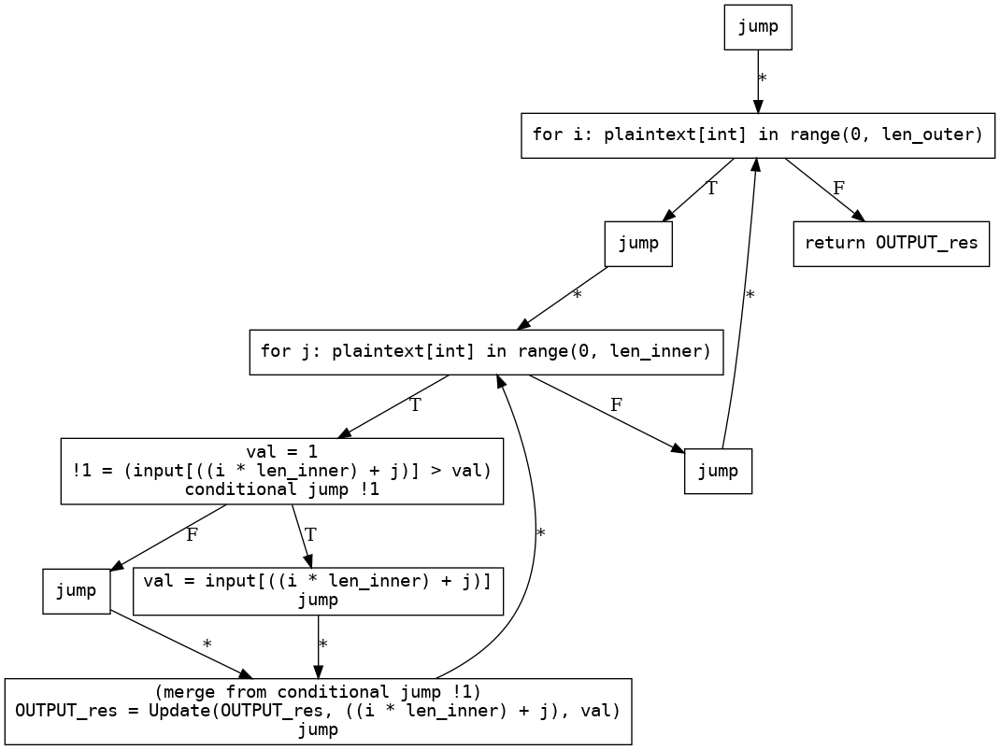
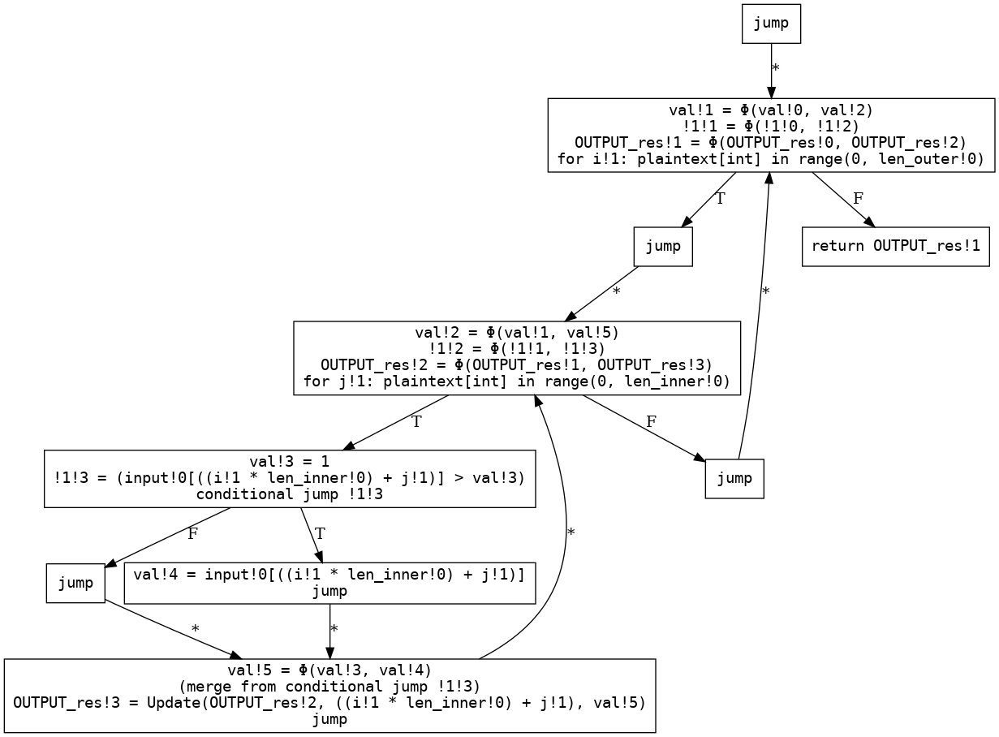
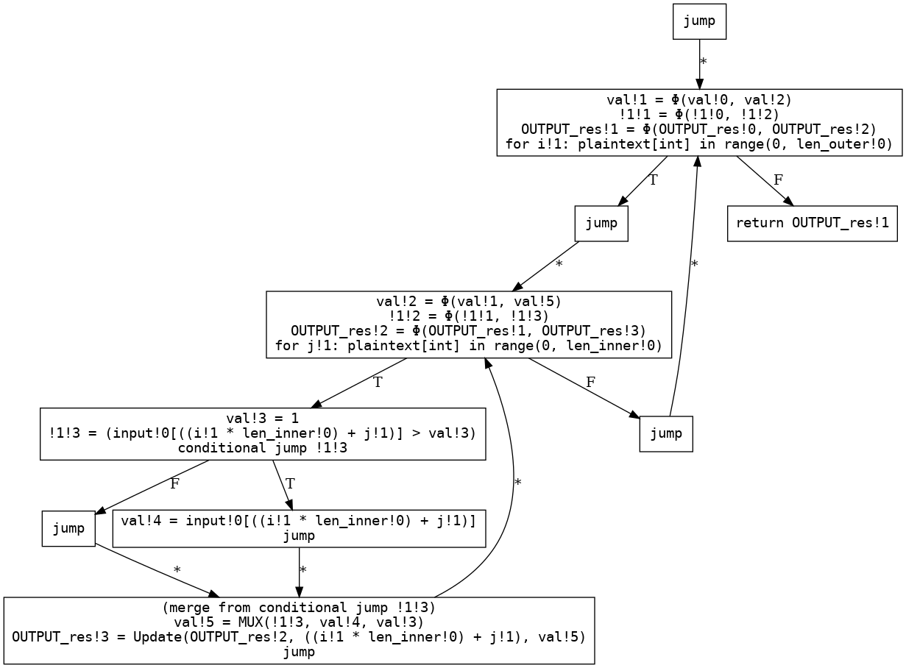
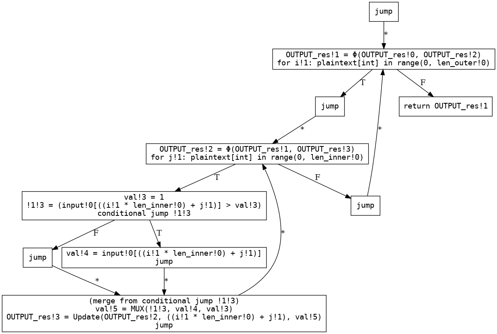
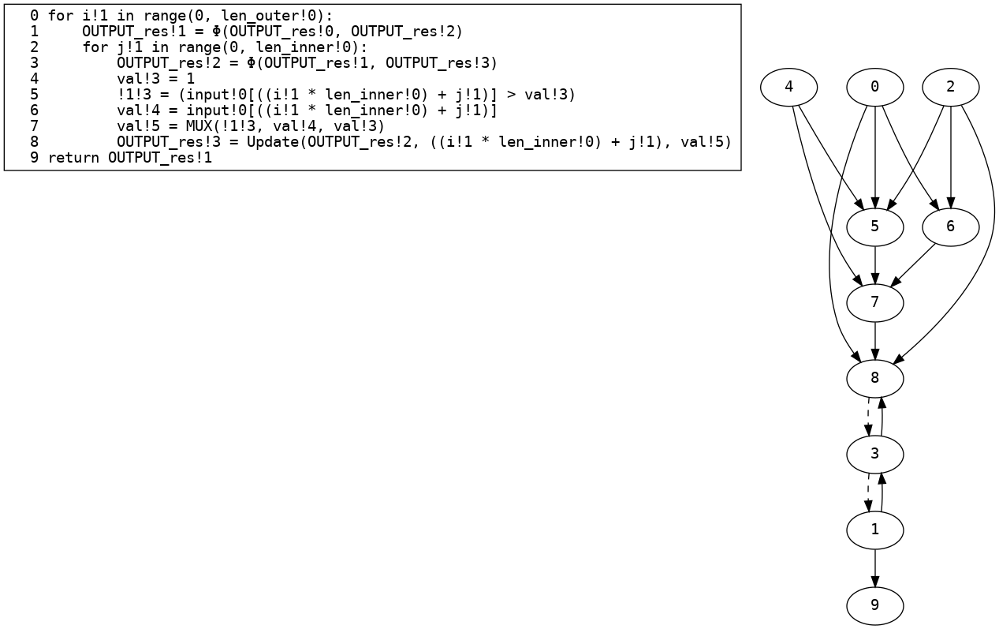
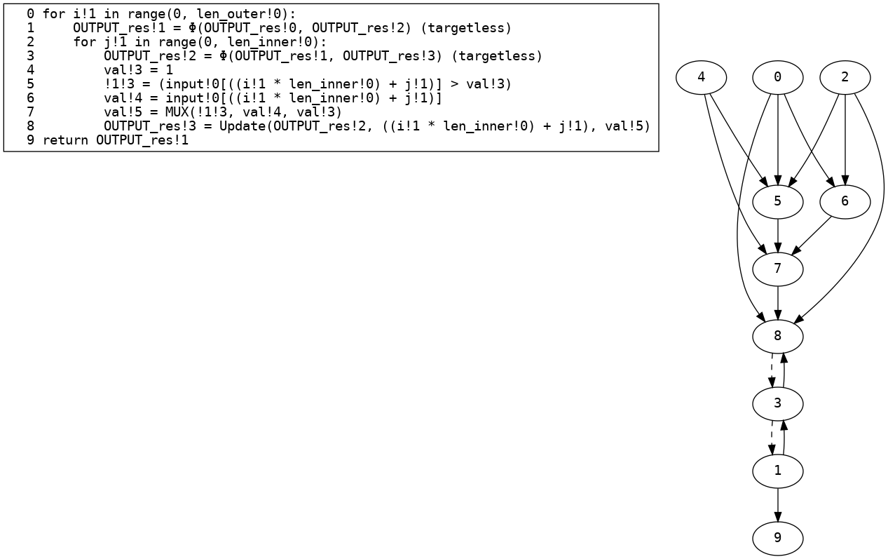
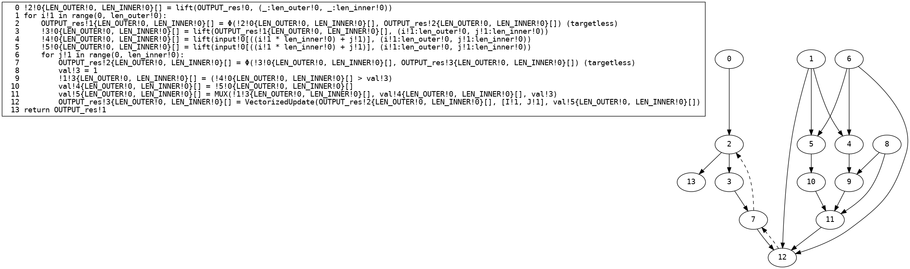
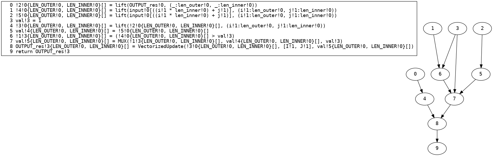

## [View the current version of the paper here](paper_SIMD.pdf)
## Benchmark Data

### BooleanGmw
| Benchmark | Total # Gates | # SIMD gates | # Non-SIMD gates | # messages sent (party 0) | Sent size (party 0) | # messages received (party 0) | Received Size (party 0) | Runtime | Circuit Generation Time |
| - | - | - | - | - | - | - | - | - | - |
|biometric|5465|4522|915|4945|0.814 MiB |4945|0.814 MiB |2117.858 ms |487.0 ms |
|biometric (Non-Vectorized)|58586|0|58558|47071|4.671 MiB |47071|4.671 MiB |12608.557 ms |5469.0 ms |
|biometric_fast|5782|4824|917|5263|0.824 MiB |5263|0.824 MiB |2571.425 ms |494.0 ms |
|biometric_fast (Non-Vectorized)|55783|0|55742|44527|4.418 MiB |44527|4.418 MiB |12498.939 ms |4506.0 ms |
|chapterfour_figure_12|449|0|445|750|0.071 MiB |750|0.071 MiB |245.159 ms |41.0 ms |
|chapterfour_figure_12 (Non-Vectorized)|449|0|445|750|0.071 MiB |750|0.071 MiB |209.908 ms |40.0 ms |
|convex_hull|1150|1073|61|1379|0.174 MiB |1379|0.174 MiB |470.654 ms |104.0 ms |
|convex_hull (Non-Vectorized)|6280|0|6264|6263|0.621 MiB |6263|0.621 MiB |1731.959 ms |571.0 ms |
|count_102|3202|105|3080|3818|0.388 MiB |3818|0.388 MiB |1927.728 ms |313.0 ms |
|count_102 (Non-Vectorized)|4088|0|4071|5510|0.543 MiB |5510|0.543 MiB |2506.075 ms |450.0 ms |
|count_10s|2278|106|2159|2846|0.287 MiB |2846|0.287 MiB |1448.074 ms |234.0 ms |
|count_10s (Non-Vectorized)|2870|0|2857|3974|0.391 MiB |3974|0.391 MiB |1542.722 ms |320.0 ms |
|count_123|2285|110|2161|2848|0.288 MiB |2848|0.288 MiB |1420.509 ms |216.0 ms |
|count_123 (Non-Vectorized)|2892|0|2878|3988|0.392 MiB |3988|0.392 MiB |1616.814 ms |335.0 ms |
|cryptonets_max_pooling|823|678|41|949|0.181 MiB |949|0.181 MiB |474.119 ms |88.0 ms |
|cryptonets_max_pooling (Non-Vectorized)|13444|0|13340|11209|1.117 MiB |11209|1.117 MiB |3022.971 ms |1106.0 ms |
|db_cross_join_trivial|7894|48|7520|14484|1.519 MiB |14484|1.519 MiB |3793.821 ms |1142.0 ms |
|db_cross_join_trivial (Non-Vectorized)|10601|0|10275|19664|1.978 MiB |19664|1.978 MiB |4613.968 ms |1429.0 ms |
|db_variance|16266|3308|12940|13644|1.49 MiB |13644|1.49 MiB |10671.443 ms |1314.0 ms |
|db_variance (Non-Vectorized)|39375|0|39357|31522|3.126 MiB |31522|3.126 MiB |13918.475 ms |3190.0 ms |
|histogram|2644|2500|81|3016|0.396 MiB |3016|0.396 MiB |1572.767 ms |282.0 ms |
|histogram (Non-Vectorized)|13468|0|13405|15674|1.553 MiB |15674|1.553 MiB |5299.526 ms |1344.0 ms |
|inner_product|3885|2970|907|3580|0.387 MiB |3580|0.387 MiB |1329.994 ms |337.0 ms |
|inner_product (Non-Vectorized)|9816|0|9808|8052|0.796 MiB |8052|0.796 MiB |2878.6 ms |811.0 ms |
|longest_102|5441|111|5313|5640|0.568 MiB |5640|0.568 MiB |3241.349 ms |502.0 ms |
|longest_102 (Non-Vectorized)|6358|0|6341|7350|0.725 MiB |7350|0.725 MiB |3017.916 ms |654.0 ms |
|longest_odd_10|4346|110|4222|4612|0.468 MiB |4612|0.468 MiB |2913.347 ms |402.0 ms |
|longest_odd_10 (Non-Vectorized)|5039|0|5025|5942|0.598 MiB |5942|0.598 MiB |2388.168 ms |542.0 ms |
|max_dist_between_syms|4248|38|4198|4452|0.441 MiB |4452|0.441 MiB |2809.096 ms |373.0 ms |
|max_dist_between_syms (Non-Vectorized)|4477|0|4465|4886|0.481 MiB |4886|0.481 MiB |2268.239 ms |443.0 ms |
|max_sum_between_syms|4247|38|4198|4452|0.441 MiB |4452|0.441 MiB |2790.72 ms |396.0 ms |
|max_sum_between_syms (Non-Vectorized)|4476|0|4465|4886|0.481 MiB |4886|0.481 MiB |2299.956 ms |405.0 ms |
|minimal_points|526|477|35|763|0.097 MiB |763|0.097 MiB |246.522 ms |41.0 ms |
|minimal_points (Non-Vectorized)|4052|0|4038|3647|0.361 MiB |3647|0.361 MiB |940.942 ms |352.0 ms |
|mnist_relu|838|227|208|769|0.47 MiB |769|0.47 MiB |317.399 ms |101.0 ms |
|mnist_relu (Non-Vectorized)|45003|0|44600|36589|3.736 MiB |36589|3.736 MiB |9185.39 ms |3822.0 ms |
|psi|124|61|42|472|0.063 MiB |472|0.063 MiB |216.444 ms |11.0 ms |
|psi (Non-Vectorized)|1221|0|1200|2644|0.26 MiB |2644|0.26 MiB |729.498 ms |150.0 ms |

### Bmr
| Benchmark | Total # Gates | # SIMD gates | # Non-SIMD gates | # messages sent (party 0) | Sent size (party 0) | # messages received (party 0) | Received Size (party 0) | Runtime | Circuit Generation Time |
| - | - | - | - | - | - | - | - | - | - |
|biometric|4488|3641|819|7841|4.52 MiB |7845|4.521 MiB |667.67 ms |553.0 ms |
|biometric (Non-Vectorized)|51450|0|51422|86501|9.914 MiB |86505|9.914 MiB |6239.25 ms |6417.0 ms |
|biometric_fast|4658|3796|821|8017|4.481 MiB |8018|4.481 MiB |680.314 ms |561.0 ms |
|biometric_fast (Non-Vectorized)|49847|0|49806|85282|9.779 MiB |85283|9.779 MiB |4960.906 ms |5210.0 ms |
|chapterfour_figure_12|397|0|393|973|0.106 MiB |971|0.106 MiB |42.73 ms |39.0 ms |
|chapterfour_figure_12 (Non-Vectorized)|397|0|393|973|0.106 MiB |971|0.106 MiB |57.676 ms |40.0 ms |
|convex_hull|1050|973|61|1987|0.555 MiB |1983|0.555 MiB |143.004 ms |126.0 ms |
|convex_hull (Non-Vectorized)|5644|0|5628|8993|1.036 MiB |8989|1.036 MiB |581.678 ms |610.0 ms |
|count_102|1752|105|1630|3829|0.643 MiB |3818|0.642 MiB |215.268 ms |235.0 ms |
|count_102 (Non-Vectorized)|2638|0|2621|8059|0.933 MiB |8048|0.932 MiB |268.253 ms |389.0 ms |
|count_10s|1263|106|1144|2940|0.471 MiB |2931|0.471 MiB |144.521 ms |178.0 ms |
|count_10s (Non-Vectorized)|1855|0|1842|5760|0.665 MiB |5751|0.664 MiB |195.432 ms |272.0 ms |
|count_123|1270|110|1146|2946|0.473 MiB |2938|0.473 MiB |166.1 ms |150.0 ms |
|count_123 (Non-Vectorized)|1877|0|1863|5796|0.669 MiB |5788|0.668 MiB |202.473 ms |276.0 ms |
|cryptonets_max_pooling|745|600|41|1462|1.051 MiB |1398|1.047 MiB |201.989 ms |104.0 ms |
|cryptonets_max_pooling (Non-Vectorized)|11884|0|11780|17935|2.181 MiB |17871|2.177 MiB |1784.042 ms |1216.0 ms |
|db_cross_join_trivial|7902|56|7520|36650|7.062 MiB |36344|7.041 MiB |1472.294 ms |1816.0 ms |
|db_cross_join_trivial (Non-Vectorized)|11201|0|10875|86304|10.464 MiB |85998|10.443 MiB |1346.095 ms |3711.0 ms |
|db_variance|13351|3015|10318|20696|4.007 MiB |20694|4.007 MiB |1799.323 ms |1365.0 ms |
|db_variance (Non-Vectorized)|34409|0|34391|56536|6.468 MiB |56534|6.467 MiB |3713.22 ms |3561.0 ms |
|histogram|1484|1340|81|2937|1.105 MiB |2890|1.101 MiB |318.207 ms |229.0 ms |
|histogram (Non-Vectorized)|7668|0|7605|18070|2.143 MiB |18023|2.14 MiB |1089.549 ms |1017.0 ms |
|inner_product|3300|2826|466|5831|1.116 MiB |5829|1.116 MiB |408.243 ms |369.0 ms |
|inner_product (Non-Vectorized)|8943|0|8935|15761|1.798 MiB |15759|1.797 MiB |1027.802 ms |1006.0 ms |
|longest_102|3731|111|3603|6774|0.997 MiB |6763|0.996 MiB |581.864 ms |439.0 ms |
|longest_102 (Non-Vectorized)|4648|0|4631|11049|1.29 MiB |11038|1.289 MiB |626.3 ms |660.0 ms |
|longest_odd_10|2994|110|2870|6669|0.996 MiB |6659|0.996 MiB |369.804 ms |387.0 ms |
|longest_odd_10 (Non-Vectorized)|3687|0|3673|10862|1.284 MiB |10852|1.284 MiB |472.435 ms |550.0 ms |
|max_dist_between_syms|2880|38|2830|5150|0.657 MiB |5140|0.656 MiB |401.125 ms |319.0 ms |
|max_dist_between_syms (Non-Vectorized)|3109|0|3097|6235|0.732 MiB |6225|0.731 MiB |361.632 ms |372.0 ms |
|max_sum_between_syms|2879|38|2830|5148|0.656 MiB |5139|0.656 MiB |361.46 ms |313.0 ms |
|max_sum_between_syms (Non-Vectorized)|3108|0|3097|6233|0.731 MiB |6224|0.73 MiB |385.804 ms |381.0 ms |
|minimal_points|474|425|35|1013|0.267 MiB |1011|0.267 MiB |117.847 ms |54.0 ms |
|minimal_points (Non-Vectorized)|3560|0|3546|4159|0.483 MiB |4157|0.483 MiB |468.659 ms |319.0 ms |
|mnist_relu|812|201|208|1482|3.365 MiB |1479|3.365 MiB |476.93 ms |178.0 ms |
|mnist_relu (Non-Vectorized)|39803|0|39400|58993|7.307 MiB |58990|7.307 MiB |5196.866 ms |3999.0 ms |
|psi|140|77|42|746|0.365 MiB |739|0.365 MiB |68.806 ms |25.0 ms |
|psi (Non-Vectorized)|1301|0|1280|6672|0.771 MiB |6665|0.771 MiB |194.252 ms |279.0 ms |

## Compiler stages with different benchmarks
### `biometric`
#### Input
```python
from UTIL import shared

# Biometric matching
# D is the number of features we are matching. Usually small, e.g., D=4
# N is the size of the database S
# C is the vector of features we are tryign to match.
# S is the (originally two dimentional) database array: S[0,0],S[0,1],..S[0,D-1],S[1,0]... S[N-1,D-1]
def biometric(
    C: shared[list[int]], D: int, S: shared[list[int]], N: int
) -> tuple[shared[int], shared[int]]:
    min_sum: int = 10000
    min_index = 0  # -1 (compiler doesn't support negative constants)
    for i in range(N):
        sum = 0
        for j in range(D):
            d = S[i * D + j] - C[j]
            p = d * d
            sum = sum + p
        if sum < min_sum:
            min_sum = sum
            min_index = i

    return (min_sum, min_index)


C = [1, 2, 3, 4]
S = [4, 5, 2, 10, 2, 120, 4, 10, 99, 88, 77, 66, 55, 44, 33, 22]
print(biometric(C, 4, S, 4))

```
#### Restricted AST
```python
def biometric(C: shared[list[int; ?]], D: plaintext[int], S: shared[list[int; ?]], N: plaintext[int]) -> tuple[shared[int], shared[int]]:
    min_sum = 10000
    min_index = 0
    for i: plaintext[int] in range(0, N):
        sum = 0
        for j: plaintext[int] in range(0, D):
            d = (S[((i * D) + j)] - C[j])
            p = (d * d)
            sum = (sum + p)
        if (sum < min_sum):
            min_sum = sum
            min_index = i
    return (min_sum, min_index)
```
#### Three-address code CFG

#### SSA

#### SSA ϕ→MUX

#### Dead code elimination

#### Linear code with loops
```python
def biometric(C!0: shared[list[int; ?]], D!0: plaintext[int], S!0: shared[list[int; ?]], N!0: plaintext[int]) -> tuple[shared[int], shared[int]]:
    min_sum!1 = 10000
    min_index!1 = 0
    for i!1 in range(0, N!0):
        min_sum!2 = Φ(min_sum!1, min_sum!4)
        min_index!2 = Φ(min_index!1, min_index!4)
        sum!2 = 0
        for j!1 in range(0, D!0):
            sum!3 = Φ(sum!2, sum!4)
            d!3 = (S!0[((i!1 * D!0) + j!1)] - C!0[j!1])
            p!3 = (d!3 * d!3)
            sum!4 = (sum!3 + p!3)
        !1!2 = (sum!3 < min_sum!2)
        min_sum!3 = sum!3
        min_index!3 = i!1
        min_sum!4 = MUX(!1!2, min_sum!3, min_sum!2)
        min_index!4 = MUX(!1!2, min_index!3, min_index!2)
    !2!1 = (min_sum!2, min_index!2)
    return !2!1
```
#### Dependency graph

#### Removal of infeasible edges

#### Type Environment Before Vectorization
| Variable | Type |
| - | - |
| `C!0` | `shared[list[int; ?]]` |
| `D!0` | `plaintext[int]` |
| `S!0` | `shared[list[int; ?]]` |
| `N!0` | `plaintext[int]` |
| `i!1` | `plaintext[int]` |
| `j!1` | `plaintext[int]` |
| `!2!1` | `tuple[shared[int], shared[int]]` |
| `min_index!4` | `shared[int]` |
| `min_index!2` | `shared[int]` |
| `min_sum!4` | `shared[int]` |
| `min_sum!2` | `shared[int]` |
| `!1!2` | `shared[bool]` |
| `min_index!3` | `plaintext[int]` |
| `min_sum!3` | `shared[int]` |
| `sum!4` | `shared[int]` |
| `sum!3` | `shared[int]` |
| `p!3` | `shared[int]` |
| `d!3` | `shared[int]` |
| `sum!2` | `plaintext[int]` |
| `min_index!1` | `plaintext[int]` |
| `min_sum!1` | `plaintext[int]` |
#### Basic Vectorization Phase 1
```python
def biometric(C!0: shared[list[int; ?]], D!0: plaintext[int], S!0: shared[list[int; ?]], N!0: plaintext[int]) -> tuple[shared[int], shared[int]]:
    min_sum!1 = 10000
    min_index!1 = 0
    !3!0{N!0}[] = lift(min_sum!1, (i!1:N!0))
    !4!0{N!0}[] = lift(min_index!1, (i!1:N!0))
    for i!1 in range(0, N!0):
        min_sum!2{N!0}[] = Φ(!3!0{N!0}[], min_sum!4{N!0}[])
        min_index!2{N!0}[] = Φ(!4!0{N!0}[], min_index!4{N!0}[])
        sum!2 = 0
        !5!0{N!0, D!0}[] = lift(sum!2, (i!1:N!0, j!1:D!0))
        !6!0{N!0, D!0}[] = lift(S!0[((i!1 * D!0) + j!1)], (i!1:N!0, j!1:D!0))
        !7!0{N!0, D!0}[] = lift(C!0[j!1], (i!1:N!0, j!1:D!0))
        for j!1 in range(0, D!0):
            sum!3{N!0, D!0}[] = Φ(!5!0{N!0, D!0}[], sum!4{N!0, D!0}[])
            d!3{N!0, D!0}[] = (!6!0{N!0, D!0}[] - !7!0{N!0, D!0}[])
            p!3{N!0, D!0}[] = (d!3{N!0, D!0}[] * d!3{N!0, D!0}[])
            sum!4{N!0, D!0}[] = (sum!3{N!0, D!0}[] + p!3{N!0, D!0}[])
        !8!0{N!0}[] = drop_dim(sum!4{N!0, D!0}[])
        !1!2{N!0}[] = (!8!0{N!0}[] < min_sum!2{N!0}[])
        !9!0{N!0}[] = drop_dim(sum!4{N!0, D!0}[])
        min_sum!3{N!0}[] = !9!0{N!0}[]
        min_index!3 = i!1
        min_sum!4{N!0}[] = MUX(!1!2{N!0}[], min_sum!3{N!0}[], min_sum!2{N!0}[])
        min_index!4{N!0}[] = MUX(!1!2{N!0}[], min_index!3, min_index!2{N!0}[])
    !10!0 = drop_dim(min_sum!4{N!0}[])
    !11!0 = drop_dim(min_index!4{N!0}[])
    !2!1 = (!10!0, !11!0)
    return !2!1
```
#### Basic Vectorization Phase 1 (dependence graph)

#### Basic Vectorization Phase 2
```python
def biometric(C!0: shared[list[int; ?]], D!0: plaintext[int], S!0: shared[list[int; ?]], N!0: plaintext[int]) -> tuple[shared[int], shared[int]]:
    min_sum!1 = 10000
    min_index!1 = 0
    sum!2 = 0
    !6!0{N!0, D!0}[] = lift(S!0[((i!1 * D!0) + j!1)], (i!1:N!0, j!1:D!0))
    !7!0{N!0, D!0}[] = lift(C!0[j!1], (i!1:N!0, j!1:D!0))
    !13!0{N!0}[] = lift(i!1, (i!1:N!0))
    !3!0{N!0}[] = lift(min_sum!1, (i!1:N!0))
    !4!0{N!0}[] = lift(min_index!1, (i!1:N!0))
    !5!0{N!0, D!0}[] = lift(sum!2, (i!1:N!0, j!1:D!0))
    d!3{N!0, D!0}[] = (!6!0{N!0, D!0}[] - !7!0{N!0, D!0}[])
    p!3{N!0, D!0}[] = (d!3{N!0, D!0}[] * d!3{N!0, D!0}[])
    for !12!0 in range(0, D!0): (monolithic)
        sum!3{N!0}[!12!0] = Φ(!5!0{N!0}[!12!0], sum!4{N!0}[(!12!0 - 1)])
        sum!4{N!0}[!12!0] = (sum!3{N!0}[!12!0] + p!3{N!0}[!12!0])
    !8!0{N!0}[] = drop_dim(sum!4{N!0, D!0}[])
    !9!0{N!0}[] = drop_dim(sum!4{N!0, D!0}[])
    min_sum!3{N!0}[] = !9!0{N!0}[]
    for !14!0 in range(0, N!0): (monolithic)
        min_sum!2{}[!14!0] = Φ(!3!0{}[!14!0], min_sum!4{}[(!14!0 - 1)])
        !1!2{}[!14!0] = (!8!0{}[!14!0] < min_sum!2{}[!14!0])
        min_sum!4{}[!14!0] = MUX(!1!2{}[!14!0], min_sum!3{}[!14!0], min_sum!2{}[!14!0])
    for !15!0 in range(0, N!0): (monolithic)
        min_index!2{}[!15!0] = Φ(!4!0{}[!15!0], min_index!4{}[(!15!0 - 1)])
        min_index!4{}[!15!0] = MUX(!1!2{}[!15!0], !13!0{}[!15!0], min_index!2{}[!15!0])
    !10!0 = drop_dim(min_sum!4{N!0}[])
    !11!0 = drop_dim(min_index!4{N!0}[])
    !2!1 = (!10!0, !11!0)
    return !2!1
```
#### Basic Vectorization Phase 2 (dependence graph)

#### Type Environment After Vectorization
| Variable | Type |
| - | - |
| `C!0` | `shared[list[int; ?]]` |
| `D!0` | `plaintext[int]` |
| `S!0` | `shared[list[int; ?]]` |
| `N!0` | `plaintext[int]` |
| `!12!0` | `plaintext[int]` |
| `!14!0` | `plaintext[int]` |
| `!15!0` | `plaintext[int]` |
| `!2!1` | `tuple[shared[int], shared[int]]` |
| `!11!0` | `shared[int]` |
| `!10!0` | `shared[int]` |
| `min_index!4` | `shared[list[int; (N!0)]]` |
| `min_index!2` | `shared[list[int; (N!0)]]` |
| `min_sum!4` | `shared[list[int; (N!0)]]` |
| `min_sum!2` | `shared[list[int; (N!0)]]` |
| `!1!2` | `shared[list[bool; (N!0)]]` |
| `min_sum!3` | `shared[list[int; (N!0)]]` |
| `!9!0` | `shared[list[int; (N!0)]]` |
| `!8!0` | `shared[list[int; (N!0)]]` |
| `sum!4` | `shared[list[list[int; (N!0)]; (D!0)]]` |
| `sum!3` | `shared[list[list[int; (N!0)]; (D!0)]]` |
| `p!3` | `shared[list[list[int; (N!0)]; (D!0)]]` |
| `d!3` | `shared[list[list[int; (N!0)]; (D!0)]]` |
| `!5!0` | `shared[list[list[int; (N!0)]; (D!0)]]` |
| `!4!0` | `shared[list[int; (N!0)]]` |
| `!3!0` | `shared[list[int; (N!0)]]` |
| `!13!0` | `shared[list[int; (N!0)]]` |
| `!7!0` | `shared[list[list[int; (N!0)]; (D!0)]]` |
| `!6!0` | `shared[list[list[int; (N!0)]; (D!0)]]` |
| `sum!2` | `plaintext[int]` |
| `min_index!1` | `plaintext[int]` |
| `min_sum!1` | `plaintext[int]` |
#### Motion code
```cpp
template <encrypto::motion::MpcProtocol Protocol>
std::tuple<encrypto::motion::SecureUnsignedInteger, encrypto::motion::SecureUnsignedInteger> biometric(
    encrypto::motion::PartyPointer &party,
    std::vector<encrypto::motion::SecureUnsignedInteger> C_0,
    std::uint32_t _MPC_PLAINTEXT_D_0,
    std::vector<encrypto::motion::SecureUnsignedInteger> S_0,
    std::uint32_t _MPC_PLAINTEXT_N_0
) {
    // Shared variable declarations
    std::vector<encrypto::motion::ShareWrapper> _1_2((_MPC_PLAINTEXT_N_0));
    encrypto::motion::SecureUnsignedInteger _10_0;
    encrypto::motion::SecureUnsignedInteger _11_0;
    encrypto::motion::SecureUnsignedInteger _12_0;
    std::vector<encrypto::motion::SecureUnsignedInteger> _13_0((_MPC_PLAINTEXT_N_0));
    encrypto::motion::SecureUnsignedInteger _14_0;
    encrypto::motion::SecureUnsignedInteger _15_0;
    std::tuple<encrypto::motion::SecureUnsignedInteger, encrypto::motion::SecureUnsignedInteger> _2_1;
    std::vector<encrypto::motion::SecureUnsignedInteger> _3_0((_MPC_PLAINTEXT_N_0));
    std::vector<encrypto::motion::SecureUnsignedInteger> _4_0((_MPC_PLAINTEXT_N_0));
    std::vector<encrypto::motion::SecureUnsignedInteger> _5_0((_MPC_PLAINTEXT_N_0) * (_MPC_PLAINTEXT_D_0));
    std::vector<encrypto::motion::SecureUnsignedInteger> _6_0((_MPC_PLAINTEXT_N_0) * (_MPC_PLAINTEXT_D_0));
    std::vector<encrypto::motion::SecureUnsignedInteger> _7_0((_MPC_PLAINTEXT_N_0) * (_MPC_PLAINTEXT_D_0));
    std::vector<encrypto::motion::SecureUnsignedInteger> _8_0((_MPC_PLAINTEXT_N_0));
    std::vector<encrypto::motion::SecureUnsignedInteger> _9_0((_MPC_PLAINTEXT_N_0));
    encrypto::motion::SecureUnsignedInteger D_0;
    encrypto::motion::SecureUnsignedInteger N_0;
    std::vector<encrypto::motion::SecureUnsignedInteger> d_3((_MPC_PLAINTEXT_N_0) * (_MPC_PLAINTEXT_D_0));
    encrypto::motion::SecureUnsignedInteger min_index_1;
    std::vector<encrypto::motion::SecureUnsignedInteger> min_index_2((_MPC_PLAINTEXT_N_0));
    std::vector<encrypto::motion::SecureUnsignedInteger> min_index_4((_MPC_PLAINTEXT_N_0));
    encrypto::motion::SecureUnsignedInteger min_sum_1;
    std::vector<encrypto::motion::SecureUnsignedInteger> min_sum_2((_MPC_PLAINTEXT_N_0));
    std::vector<encrypto::motion::SecureUnsignedInteger> min_sum_3((_MPC_PLAINTEXT_N_0));
    std::vector<encrypto::motion::SecureUnsignedInteger> min_sum_4((_MPC_PLAINTEXT_N_0));
    std::vector<encrypto::motion::SecureUnsignedInteger> p_3((_MPC_PLAINTEXT_N_0) * (_MPC_PLAINTEXT_D_0));
    encrypto::motion::SecureUnsignedInteger sum_2;
    std::vector<encrypto::motion::SecureUnsignedInteger> sum_3((_MPC_PLAINTEXT_N_0) * (_MPC_PLAINTEXT_D_0));
    std::vector<encrypto::motion::SecureUnsignedInteger> sum_4((_MPC_PLAINTEXT_N_0) * (_MPC_PLAINTEXT_D_0));

    // Plaintext variable declarations
    std::uint32_t _MPC_PLAINTEXT__12_0;
    std::uint32_t _MPC_PLAINTEXT__14_0;
    std::uint32_t _MPC_PLAINTEXT__15_0;
    std::tuple<std::uint32_t, std::uint32_t> _MPC_PLAINTEXT__2_1;
    std::uint32_t _MPC_PLAINTEXT_min_index_1;
    std::uint32_t _MPC_PLAINTEXT_min_sum_1;
    std::uint32_t _MPC_PLAINTEXT_sum_2;

    // Constant initializations
    encrypto::motion::SecureUnsignedInteger _MPC_CONSTANT_0 = party->In<Protocol>(encrypto::motion::ToInput(std::uint32_t(0)), 0);
    encrypto::motion::SecureUnsignedInteger _MPC_CONSTANT_10000 = party->In<Protocol>(encrypto::motion::ToInput(std::uint32_t(10000)), 0);

    // Plaintext parameter assignments
    D_0 = party->In<Protocol>(encrypto::motion::ToInput(_MPC_PLAINTEXT_D_0), 0);
    N_0 = party->In<Protocol>(encrypto::motion::ToInput(_MPC_PLAINTEXT_N_0), 0);

    // Function body
    min_sum_1 = _MPC_CONSTANT_10000;
    _MPC_PLAINTEXT_min_sum_1 = std::uint32_t(10000);
    min_index_1 = _MPC_CONSTANT_0;
    _MPC_PLAINTEXT_min_index_1 = std::uint32_t(0);
    sum_2 = _MPC_CONSTANT_0;
    _MPC_PLAINTEXT_sum_2 = std::uint32_t(0);
    vectorized_assign(_6_0, {_MPC_PLAINTEXT_N_0, _MPC_PLAINTEXT_D_0}, {true, true}, {}, lift(std::function([&](const std::vector<std::uint32_t> &indices){return S_0[((indices[0] * _MPC_PLAINTEXT_D_0) + indices[1])];}), {_MPC_PLAINTEXT_N_0, _MPC_PLAINTEXT_D_0}));
    vectorized_assign(_7_0, {_MPC_PLAINTEXT_N_0, _MPC_PLAINTEXT_D_0}, {true, true}, {}, lift(std::function([&](const std::vector<std::uint32_t> &indices){return C_0[indices[1]];}), {_MPC_PLAINTEXT_N_0, _MPC_PLAINTEXT_D_0}));
    vectorized_assign(_13_0, {_MPC_PLAINTEXT_N_0}, {true}, {}, lift(std::function([&](const std::vector<std::uint32_t> &indices){return encrypto::motion::SecureUnsignedInteger(party->In<Protocol>(encrypto::motion::ToInput(indices[0]), 0));}), {_MPC_PLAINTEXT_N_0}));
    vectorized_assign(_3_0, {_MPC_PLAINTEXT_N_0}, {true}, {}, lift(std::function([&](const std::vector<std::uint32_t> &indices){return min_sum_1;}), {_MPC_PLAINTEXT_N_0}));
    vectorized_assign(_4_0, {_MPC_PLAINTEXT_N_0}, {true}, {}, lift(std::function([&](const std::vector<std::uint32_t> &indices){return min_index_1;}), {_MPC_PLAINTEXT_N_0}));
    vectorized_assign(_5_0, {_MPC_PLAINTEXT_N_0, _MPC_PLAINTEXT_D_0}, {true, true}, {}, lift(std::function([&](const std::vector<std::uint32_t> &indices){return sum_2;}), {_MPC_PLAINTEXT_N_0, _MPC_PLAINTEXT_D_0}));
    vectorized_assign(d_3, {_MPC_PLAINTEXT_N_0, _MPC_PLAINTEXT_D_0}, {true, true}, {}, (vectorized_access(_6_0, {_MPC_PLAINTEXT_N_0, _MPC_PLAINTEXT_D_0}, {true, true}, {}) - vectorized_access(_7_0, {_MPC_PLAINTEXT_N_0, _MPC_PLAINTEXT_D_0}, {true, true}, {})));
    vectorized_assign(p_3, {_MPC_PLAINTEXT_N_0, _MPC_PLAINTEXT_D_0}, {true, true}, {}, (vectorized_access(d_3, {_MPC_PLAINTEXT_N_0, _MPC_PLAINTEXT_D_0}, {true, true}, {}) * vectorized_access(d_3, {_MPC_PLAINTEXT_N_0, _MPC_PLAINTEXT_D_0}, {true, true}, {})));

    // Initialize loop counter
    _MPC_PLAINTEXT__12_0 = std::uint32_t(0);
    // Initialize phi values
    vectorized_assign(sum_3, {_MPC_PLAINTEXT_N_0, _MPC_PLAINTEXT_D_0}, {true, false}, {_MPC_PLAINTEXT__12_0}, vectorized_access(_5_0, {_MPC_PLAINTEXT_N_0, _MPC_PLAINTEXT_D_0}, {true, false}, {_MPC_PLAINTEXT__12_0}));
    for (; _MPC_PLAINTEXT__12_0 < _MPC_PLAINTEXT_D_0; _MPC_PLAINTEXT__12_0++) {
        // Update phi values
        if (_MPC_PLAINTEXT__12_0 != std::uint32_t(0)) {
            vectorized_assign(sum_3, {_MPC_PLAINTEXT_N_0, _MPC_PLAINTEXT_D_0}, {true, false}, {_MPC_PLAINTEXT__12_0}, vectorized_access(sum_4, {_MPC_PLAINTEXT_N_0, _MPC_PLAINTEXT_D_0}, {true, false}, {(_MPC_PLAINTEXT__12_0 - std::uint32_t(1))}));
        }

        vectorized_assign(sum_4, {_MPC_PLAINTEXT_N_0, _MPC_PLAINTEXT_D_0}, {true, false}, {_MPC_PLAINTEXT__12_0}, (vectorized_access(sum_3, {_MPC_PLAINTEXT_N_0, _MPC_PLAINTEXT_D_0}, {true, false}, {_MPC_PLAINTEXT__12_0}) + vectorized_access(p_3, {_MPC_PLAINTEXT_N_0, _MPC_PLAINTEXT_D_0}, {true, false}, {_MPC_PLAINTEXT__12_0})));

    }

    vectorized_assign(_8_0, {_MPC_PLAINTEXT_N_0}, {true}, {}, drop_dim(vectorized_access(sum_4, {_MPC_PLAINTEXT_N_0, _MPC_PLAINTEXT_D_0}, {true, true}, {}).Unsimdify(), {_MPC_PLAINTEXT_N_0, _MPC_PLAINTEXT_D_0}));
    vectorized_assign(_9_0, {_MPC_PLAINTEXT_N_0}, {true}, {}, drop_dim(vectorized_access(sum_4, {_MPC_PLAINTEXT_N_0, _MPC_PLAINTEXT_D_0}, {true, true}, {}).Unsimdify(), {_MPC_PLAINTEXT_N_0, _MPC_PLAINTEXT_D_0}));
    vectorized_assign(min_sum_3, {_MPC_PLAINTEXT_N_0}, {true}, {}, vectorized_access(_9_0, {_MPC_PLAINTEXT_N_0}, {true}, {}));

    // Initialize loop counter
    _MPC_PLAINTEXT__14_0 = std::uint32_t(0);
    // Initialize phi values
    min_sum_2[_MPC_PLAINTEXT__14_0] = _3_0[_MPC_PLAINTEXT__14_0];
    for (; _MPC_PLAINTEXT__14_0 < _MPC_PLAINTEXT_N_0; _MPC_PLAINTEXT__14_0++) {
        // Update phi values
        if (_MPC_PLAINTEXT__14_0 != std::uint32_t(0)) {
            min_sum_2[_MPC_PLAINTEXT__14_0] = min_sum_4[(_MPC_PLAINTEXT__14_0 - std::uint32_t(1))];
        }

        _1_2[_MPC_PLAINTEXT__14_0] = (min_sum_2[_MPC_PLAINTEXT__14_0] > _8_0[_MPC_PLAINTEXT__14_0]);
        min_sum_4[_MPC_PLAINTEXT__14_0] = _1_2[_MPC_PLAINTEXT__14_0].Mux(min_sum_3[_MPC_PLAINTEXT__14_0].Get(), min_sum_2[_MPC_PLAINTEXT__14_0].Get());

    }


    // Initialize loop counter
    _MPC_PLAINTEXT__15_0 = std::uint32_t(0);
    // Initialize phi values
    min_index_2[_MPC_PLAINTEXT__15_0] = _4_0[_MPC_PLAINTEXT__15_0];
    for (; _MPC_PLAINTEXT__15_0 < _MPC_PLAINTEXT_N_0; _MPC_PLAINTEXT__15_0++) {
        // Update phi values
        if (_MPC_PLAINTEXT__15_0 != std::uint32_t(0)) {
            min_index_2[_MPC_PLAINTEXT__15_0] = min_index_4[(_MPC_PLAINTEXT__15_0 - std::uint32_t(1))];
        }

        min_index_4[_MPC_PLAINTEXT__15_0] = _1_2[_MPC_PLAINTEXT__15_0].Mux(_13_0[_MPC_PLAINTEXT__15_0].Get(), min_index_2[_MPC_PLAINTEXT__15_0].Get());

    }

    _10_0 = drop_dim_monoreturn(vectorized_access(min_sum_4, {_MPC_PLAINTEXT_N_0}, {true}, {}).Unsimdify(), {_MPC_PLAINTEXT_N_0});
    _11_0 = drop_dim_monoreturn(vectorized_access(min_index_4, {_MPC_PLAINTEXT_N_0}, {true}, {}).Unsimdify(), {_MPC_PLAINTEXT_N_0});
    _2_1 = std::make_tuple(_10_0, _11_0);
    return _2_1;

}
```
### `biometric_fast`
#### Input
```python
from UTIL import shared


def biometric_fast(
    D: int,
    N: int,
    C: shared[list[int]],
    C_sqr_sum: shared[int],
    two_C: shared[list[int]],
    S: shared[list[int]],
    S_sqr_sum: shared[list[int]],
    differences: shared[list[int]],
) -> tuple[shared[int], shared[int]]:
    """
    Computes biometric matching

    This version uses some preprocessed data from parties to provide faster biometric matching

    :param int D: the cardinality of a feature vector, Usually small, e.g. 4
    :param int N: number of features in the database e.g. usually 1024, 2048, 4096, etc
    :param list[int] C: query feature vector, we need to find closest match to this vector in the DB, comes from client (Alice)
    :param int C_sqr_sum: sum of squares of elements of `C` e.g. if `C={1, 2, 3, 4}`, then `C_sqr_sum is: 1*1 + 2*2 + 3*3 + 4*4 = 30`
     client passes it pre-processed to to save gates in circuit
    :param list[int] two_C: same as `C` except that each element is multipled by 2, e.g. if `C={1, 2, 3, 4}`, then
     `two_C = {2, 4, 6, 8}`. client passes it preprocessed to save gates
    :param list[int] S: the database of features, it has N * D elements i.e. N features and each feature vector has D elements,
     this comes from server (Bob)
    :param list[int] S_sqr_sum: has N elements, each element is sum of squares of corresponding feature elements e.g. say
     S={{1, 2, 3, 4}, {5, 6, 7, 8}}, then S_sqr_sum={1*1 + 2*2 + 3*3 + 4*4, 5*5 + 6*6 + 7*7 + 8*8} = {30, 174}

    """

    min_index: int = 0
    for i in range(N):
        a_sqr_plus_b_sqr: int = S_sqr_sum[i] + C_sqr_sum
        two_a_b: int = 0

        for j in range(D):
            tmp: int = S[i * D + j] * two_C[j]
            two_a_b = two_a_b + tmp

        this_diff: int = a_sqr_plus_b_sqr - two_a_b
        differences[i] = this_diff

        min_index = 0

    min_diff: int = 99999
    for i in range(N):
        if differences[i] < min_diff:
            min_diff = differences[i]
            min_index = i

    return (min_diff, min_index)


D = 4
N = 4
C = [1, 2, 3, 4]
S = [4, 5, 2, 10, 2, 120, 4, 10, 99, 88, 77, 66, 55, 44, 33, 22]
S_sqr_sum = [0] * N
two_C = [2 * C[i] for i in range(D)]
C_sqr_sum = sum(val * val for val in C)
S_sqr_sum = [sum(S[i * D + j] * S[i * D + j] for j in range(D)) for i in range(N)]

differences = [0] * D

print(biometric_fast(D, N, C, C_sqr_sum, two_C, S, S_sqr_sum, differences))

```
#### Restricted AST
```python
def biometric_fast(D: plaintext[int], N: plaintext[int], C: shared[list[int; ?]], C_sqr_sum: shared[int], two_C: shared[list[int; ?]], S: shared[list[int; ?]], S_sqr_sum: shared[list[int; ?]], differences: shared[list[int; ?]]) -> tuple[shared[int], shared[int]]:
    min_index = 0
    for i: plaintext[int] in range(0, N):
        a_sqr_plus_b_sqr = (S_sqr_sum[i] + C_sqr_sum)
        two_a_b = 0
        for j: plaintext[int] in range(0, D):
            tmp = (S[((i * D) + j)] * two_C[j])
            two_a_b = (two_a_b + tmp)
        this_diff = (a_sqr_plus_b_sqr - two_a_b)
        differences[i] = this_diff
        min_index = 0
    min_diff = 99999
    for i: plaintext[int] in range(0, N):
        if (differences[i] < min_diff):
            min_diff = differences[i]
            min_index = i
    return (min_diff, min_index)
```
#### Three-address code CFG

#### SSA

#### SSA ϕ→MUX

#### Dead code elimination

#### Linear code with loops
```python
def biometric_fast(D!0: plaintext[int], N!0: plaintext[int], C!0: shared[list[int; ?]], C_sqr_sum!0: shared[int], two_C!0: shared[list[int; ?]], S!0: shared[list[int; ?]], S_sqr_sum!0: shared[list[int; ?]], differences!0: shared[list[int; ?]]) -> tuple[shared[int], shared[int]]:
    min_index!1 = 0
    for i!1 in range(0, N!0):
        min_index!2 = Φ(min_index!1, min_index!3)
        differences!1 = Φ(differences!0, differences!2)
        a_sqr_plus_b_sqr!2 = (S_sqr_sum!0[i!1] + C_sqr_sum!0)
        two_a_b!2 = 0
        for j!1 in range(0, D!0):
            two_a_b!3 = Φ(two_a_b!2, two_a_b!4)
            tmp!3 = (S!0[((i!1 * D!0) + j!1)] * two_C!0[j!1])
            two_a_b!4 = (two_a_b!3 + tmp!3)
        this_diff!2 = (a_sqr_plus_b_sqr!2 - two_a_b!3)
        differences!2 = Update(differences!1, i!1, this_diff!2)
        min_index!3 = 0
    min_diff!1 = 99999
    for i!2 in range(0, N!0):
        min_index!4 = Φ(min_index!2, min_index!6)
        min_diff!2 = Φ(min_diff!1, min_diff!4)
        !1!2 = (differences!1[i!2] < min_diff!2)
        min_diff!3 = differences!1[i!2]
        min_index!5 = i!2
        min_index!6 = MUX(!1!2, min_index!5, min_index!4)
        min_diff!4 = MUX(!1!2, min_diff!3, min_diff!2)
    !2!1 = (min_diff!2, min_index!4)
    return !2!1
```
#### Dependency graph

#### Removal of infeasible edges

#### Type Environment Before Vectorization
| Variable | Type |
| - | - |
| `D!0` | `plaintext[int]` |
| `N!0` | `plaintext[int]` |
| `C!0` | `shared[list[int; ?]]` |
| `C_sqr_sum!0` | `shared[int]` |
| `two_C!0` | `shared[list[int; ?]]` |
| `S!0` | `shared[list[int; ?]]` |
| `S_sqr_sum!0` | `shared[list[int; ?]]` |
| `differences!0` | `shared[list[int; ?]]` |
| `i!1` | `plaintext[int]` |
| `j!1` | `plaintext[int]` |
| `i!2` | `plaintext[int]` |
| `!2!1` | `tuple[shared[int], shared[int]]` |
| `min_diff!4` | `shared[int]` |
| `min_diff!2` | `shared[int]` |
| `differences!1` | `shared[list[int; (N!0)]]` |
| `!1!2` | `shared[bool]` |
| `min_index!6` | `shared[int]` |
| `min_index!4` | `shared[int]` |
| `min_index!5` | `plaintext[int]` |
| `min_diff!3` | `shared[int]` |
| `min_diff!1` | `plaintext[int]` |
| `min_index!3` | `plaintext[int]` |
| `min_index!2` | `plaintext[int]` |
| `differences!2` | `shared[list[int; (N!0)]]` |
| `this_diff!2` | `shared[int]` |
| `two_a_b!4` | `shared[int]` |
| `two_a_b!3` | `shared[int]` |
| `tmp!3` | `shared[int]` |
| `two_a_b!2` | `plaintext[int]` |
| `a_sqr_plus_b_sqr!2` | `shared[int]` |
| `min_index!1` | `plaintext[int]` |
#### Basic Vectorization Phase 1
```python
def biometric_fast(D!0: plaintext[int], N!0: plaintext[int], C!0: shared[list[int; ?]], C_sqr_sum!0: shared[int], two_C!0: shared[list[int; ?]], S!0: shared[list[int; ?]], S_sqr_sum!0: shared[list[int; ?]], differences!0: shared[list[int; ?]]) -> tuple[shared[int], shared[int]]:
    min_index!1 = 0
    !3!0{N!0}[] = lift(min_index!1, (i!1:N!0))
    !4!0{N!0}[] = lift(differences!0, (i!1:N!0))
    !5!0{N!0}[] = lift(S_sqr_sum!0[i!1], (i!1:N!0))
    !6!0{N!0}[] = lift(C_sqr_sum!0, (i!1:N!0))
    for i!1 in range(0, N!0):
        min_index!2{N!0}[] = Φ(!3!0{N!0}[], min_index!3)
        differences!1{N!0}[] = Φ(!4!0{N!0}[], differences!2{N!0}[]) (targetless)
        a_sqr_plus_b_sqr!2{N!0}[] = (!5!0{N!0}[] + !6!0{N!0}[])
        two_a_b!2 = 0
        !7!0{N!0, D!0}[] = lift(two_a_b!2, (i!1:N!0, j!1:D!0))
        !8!0{N!0, D!0}[] = lift(S!0[((i!1 * D!0) + j!1)], (i!1:N!0, j!1:D!0))
        !9!0{N!0, D!0}[] = lift(two_C!0[j!1], (i!1:N!0, j!1:D!0))
        for j!1 in range(0, D!0):
            two_a_b!3{N!0, D!0}[] = Φ(!7!0{N!0, D!0}[], two_a_b!4{N!0, D!0}[])
            tmp!3{N!0, D!0}[] = (!8!0{N!0, D!0}[] * !9!0{N!0, D!0}[])
            two_a_b!4{N!0, D!0}[] = (two_a_b!3{N!0, D!0}[] + tmp!3{N!0, D!0}[])
        !10!0{N!0}[] = drop_dim(two_a_b!4{N!0, D!0}[])
        this_diff!2{N!0}[] = (a_sqr_plus_b_sqr!2{N!0}[] - !10!0{N!0}[])
        differences!2{N!0}[] = VectorizedUpdate(differences!1{N!0}[], [I!1], this_diff!2{N!0}[])
        min_index!3 = 0
    min_diff!1 = 99999
    !11!0{N!0}[] = lift(min_diff!1, (i!2:N!0))
    for i!2 in range(0, N!0):
        min_index!4{N!0}[] = Φ(min_index!2{N!0}[], min_index!6{N!0}[])
        min_diff!2{N!0}[] = Φ(!11!0{N!0}[], min_diff!4{N!0}[])
        !1!2{N!0}[] = (differences!1{N!0}[] < min_diff!2{N!0}[])
        min_diff!3{N!0}[] = differences!1{N!0}[]
        min_index!5 = i!2
        min_index!6{N!0}[] = MUX(!1!2{N!0}[], min_index!5, min_index!4{N!0}[])
        min_diff!4{N!0}[] = MUX(!1!2{N!0}[], min_diff!3{N!0}[], min_diff!2{N!0}[])
    !12!0 = drop_dim(min_diff!4{N!0}[])
    !13!0 = drop_dim(min_index!6{N!0}[])
    !2!1 = (!12!0, !13!0)
    return !2!1
```
#### Basic Vectorization Phase 1 (dependence graph)

#### Basic Vectorization Phase 2
```python
def biometric_fast(D!0: plaintext[int], N!0: plaintext[int], C!0: shared[list[int; ?]], C_sqr_sum!0: shared[int], two_C!0: shared[list[int; ?]], S!0: shared[list[int; ?]], S_sqr_sum!0: shared[list[int; ?]], differences!0: shared[list[int; ?]]) -> tuple[shared[int], shared[int]]:
    min_index!1 = 0
    !4!0{N!0}[] = lift(differences!0, (i!1:N!0))
    !5!0{N!0}[] = lift(S_sqr_sum!0[i!1], (i!1:N!0))
    !6!0{N!0}[] = lift(C_sqr_sum!0, (i!1:N!0))
    two_a_b!2 = 0
    !8!0{N!0, D!0}[] = lift(S!0[((i!1 * D!0) + j!1)], (i!1:N!0, j!1:D!0))
    !9!0{N!0, D!0}[] = lift(two_C!0[j!1], (i!1:N!0, j!1:D!0))
    min_index!3 = 0
    min_diff!1 = 99999
    !16!0{N!0}[] = lift(i!2, (i!2:N!0))
    !3!0{N!0}[] = lift(min_index!1, (i!1:N!0))
    a_sqr_plus_b_sqr!2{N!0}[] = (!5!0{N!0}[] + !6!0{N!0}[])
    !7!0{N!0, D!0}[] = lift(two_a_b!2, (i!1:N!0, j!1:D!0))
    tmp!3{N!0, D!0}[] = (!8!0{N!0, D!0}[] * !9!0{N!0, D!0}[])
    !11!0{N!0}[] = lift(min_diff!1, (i!2:N!0))
    for !15!0 in range(0, N!0): (monolithic)
        min_index!2{}[!15!0] = Φ(!3!0{}[!15!0], min_index!3)
    for !14!0 in range(0, D!0): (monolithic)
        two_a_b!3{N!0}[!14!0] = Φ(!7!0{N!0}[!14!0], two_a_b!4{N!0}[(!14!0 - 1)])
        two_a_b!4{N!0}[!14!0] = (two_a_b!3{N!0}[!14!0] + tmp!3{N!0}[!14!0])
    !10!0{N!0}[] = drop_dim(two_a_b!4{N!0, D!0}[])
    this_diff!2{N!0}[] = (a_sqr_plus_b_sqr!2{N!0}[] - !10!0{N!0}[])
    differences!2{N!0}[] = VectorizedUpdate(!4!0{N!0}[], [I!1], this_diff!2{N!0}[])
    min_diff!3{N!0}[] = differences!2{N!0}[]
    for !17!0 in range(0, N!0): (monolithic)
        min_diff!2{}[!17!0] = Φ(!11!0{}[!17!0], min_diff!4{}[(!17!0 - 1)])
        !1!2{}[!17!0] = (differences!2{}[!17!0] < min_diff!2{}[!17!0])
        min_diff!4{}[!17!0] = MUX(!1!2{}[!17!0], min_diff!3{}[!17!0], min_diff!2{}[!17!0])
    for !18!0 in range(0, N!0): (monolithic)
        min_index!4{}[!18!0] = Φ(min_index!2{}[!18!0], min_index!6{}[(!18!0 - 1)])
        min_index!6{}[!18!0] = MUX(!1!2{}[!18!0], !16!0{}[!18!0], min_index!4{}[!18!0])
    !12!0 = drop_dim(min_diff!4{N!0}[])
    !13!0 = drop_dim(min_index!6{N!0}[])
    !2!1 = (!12!0, !13!0)
    return !2!1
```
#### Basic Vectorization Phase 2 (dependence graph)

#### Type Environment After Vectorization
| Variable | Type |
| - | - |
| `D!0` | `plaintext[int]` |
| `N!0` | `plaintext[int]` |
| `C!0` | `shared[list[int; ?]]` |
| `C_sqr_sum!0` | `shared[int]` |
| `two_C!0` | `shared[list[int; ?]]` |
| `S!0` | `shared[list[int; ?]]` |
| `S_sqr_sum!0` | `shared[list[int; ?]]` |
| `differences!0` | `shared[list[int; ?]]` |
| `!15!0` | `plaintext[int]` |
| `!14!0` | `plaintext[int]` |
| `!17!0` | `plaintext[int]` |
| `!18!0` | `plaintext[int]` |
| `!2!1` | `tuple[shared[int], shared[int]]` |
| `!13!0` | `shared[int]` |
| `!12!0` | `shared[int]` |
| `min_index!6` | `shared[list[int; (N!0)]]` |
| `min_index!4` | `shared[list[int; (N!0)]]` |
| `min_diff!4` | `shared[list[int; (N!0)]]` |
| `min_diff!2` | `shared[list[int; (N!0)]]` |
| `!1!2` | `shared[list[bool; (N!0)]]` |
| `min_diff!3` | `shared[list[int; (N!0)]]` |
| `differences!2` | `shared[list[int; (N!0)]]` |
| `this_diff!2` | `shared[list[int; (N!0)]]` |
| `!10!0` | `shared[list[int; (N!0)]]` |
| `two_a_b!4` | `shared[list[list[int; (N!0)]; (D!0)]]` |
| `two_a_b!3` | `shared[list[list[int; (N!0)]; (D!0)]]` |
| `min_index!2` | `shared[list[int; (N!0)]]` |
| `!11!0` | `shared[list[int; (N!0)]]` |
| `tmp!3` | `shared[list[list[int; (N!0)]; (D!0)]]` |
| `!7!0` | `shared[list[list[int; (N!0)]; (D!0)]]` |
| `a_sqr_plus_b_sqr!2` | `shared[list[int; (N!0)]]` |
| `!3!0` | `shared[list[int; (N!0)]]` |
| `!16!0` | `shared[list[int; (N!0)]]` |
| `min_diff!1` | `plaintext[int]` |
| `min_index!3` | `plaintext[int]` |
| `!9!0` | `shared[list[list[int; (N!0)]; (D!0)]]` |
| `!8!0` | `shared[list[list[int; (N!0)]; (D!0)]]` |
| `two_a_b!2` | `plaintext[int]` |
| `!6!0` | `shared[list[int; (N!0)]]` |
| `!5!0` | `shared[list[int; (N!0)]]` |
| `!4!0` | `shared[list[int; (N!0)]]` |
| `min_index!1` | `plaintext[int]` |
#### Motion code
```cpp
template <encrypto::motion::MpcProtocol Protocol>
std::tuple<encrypto::motion::SecureUnsignedInteger, encrypto::motion::SecureUnsignedInteger> biometric_fast(
    encrypto::motion::PartyPointer &party,
    std::uint32_t _MPC_PLAINTEXT_D_0,
    std::uint32_t _MPC_PLAINTEXT_N_0,
    std::vector<encrypto::motion::SecureUnsignedInteger> C_0,
    encrypto::motion::SecureUnsignedInteger C_sqr_sum_0,
    std::vector<encrypto::motion::SecureUnsignedInteger> two_C_0,
    std::vector<encrypto::motion::SecureUnsignedInteger> S_0,
    std::vector<encrypto::motion::SecureUnsignedInteger> S_sqr_sum_0,
    std::vector<encrypto::motion::SecureUnsignedInteger> differences_0
) {
    // Shared variable declarations
    std::vector<encrypto::motion::ShareWrapper> _1_2((_MPC_PLAINTEXT_N_0));
    std::vector<encrypto::motion::SecureUnsignedInteger> _10_0((_MPC_PLAINTEXT_N_0));
    std::vector<encrypto::motion::SecureUnsignedInteger> _11_0((_MPC_PLAINTEXT_N_0));
    encrypto::motion::SecureUnsignedInteger _12_0;
    encrypto::motion::SecureUnsignedInteger _13_0;
    encrypto::motion::SecureUnsignedInteger _14_0;
    encrypto::motion::SecureUnsignedInteger _15_0;
    std::vector<encrypto::motion::SecureUnsignedInteger> _16_0((_MPC_PLAINTEXT_N_0));
    encrypto::motion::SecureUnsignedInteger _17_0;
    encrypto::motion::SecureUnsignedInteger _18_0;
    std::tuple<encrypto::motion::SecureUnsignedInteger, encrypto::motion::SecureUnsignedInteger> _2_1;
    std::vector<encrypto::motion::SecureUnsignedInteger> _3_0((_MPC_PLAINTEXT_N_0));
    std::vector<encrypto::motion::SecureUnsignedInteger> _4_0((_MPC_PLAINTEXT_N_0));
    std::vector<encrypto::motion::SecureUnsignedInteger> _5_0((_MPC_PLAINTEXT_N_0));
    std::vector<encrypto::motion::SecureUnsignedInteger> _6_0((_MPC_PLAINTEXT_N_0));
    std::vector<encrypto::motion::SecureUnsignedInteger> _7_0((_MPC_PLAINTEXT_N_0) * (_MPC_PLAINTEXT_D_0));
    std::vector<encrypto::motion::SecureUnsignedInteger> _8_0((_MPC_PLAINTEXT_N_0) * (_MPC_PLAINTEXT_D_0));
    std::vector<encrypto::motion::SecureUnsignedInteger> _9_0((_MPC_PLAINTEXT_N_0) * (_MPC_PLAINTEXT_D_0));
    encrypto::motion::SecureUnsignedInteger D_0;
    encrypto::motion::SecureUnsignedInteger N_0;
    std::vector<encrypto::motion::SecureUnsignedInteger> a_sqr_plus_b_sqr_2((_MPC_PLAINTEXT_N_0));
    std::vector<encrypto::motion::SecureUnsignedInteger> differences_2((_MPC_PLAINTEXT_N_0));
    encrypto::motion::SecureUnsignedInteger min_diff_1;
    std::vector<encrypto::motion::SecureUnsignedInteger> min_diff_2((_MPC_PLAINTEXT_N_0));
    std::vector<encrypto::motion::SecureUnsignedInteger> min_diff_3((_MPC_PLAINTEXT_N_0));
    std::vector<encrypto::motion::SecureUnsignedInteger> min_diff_4((_MPC_PLAINTEXT_N_0));
    encrypto::motion::SecureUnsignedInteger min_index_1;
    std::vector<encrypto::motion::SecureUnsignedInteger> min_index_2((_MPC_PLAINTEXT_N_0));
    encrypto::motion::SecureUnsignedInteger min_index_3;
    std::vector<encrypto::motion::SecureUnsignedInteger> min_index_4((_MPC_PLAINTEXT_N_0));
    std::vector<encrypto::motion::SecureUnsignedInteger> min_index_6((_MPC_PLAINTEXT_N_0));
    std::vector<encrypto::motion::SecureUnsignedInteger> this_diff_2((_MPC_PLAINTEXT_N_0));
    std::vector<encrypto::motion::SecureUnsignedInteger> tmp_3((_MPC_PLAINTEXT_N_0) * (_MPC_PLAINTEXT_D_0));
    encrypto::motion::SecureUnsignedInteger two_a_b_2;
    std::vector<encrypto::motion::SecureUnsignedInteger> two_a_b_3((_MPC_PLAINTEXT_N_0) * (_MPC_PLAINTEXT_D_0));
    std::vector<encrypto::motion::SecureUnsignedInteger> two_a_b_4((_MPC_PLAINTEXT_N_0) * (_MPC_PLAINTEXT_D_0));

    // Plaintext variable declarations
    std::uint32_t _MPC_PLAINTEXT__14_0;
    std::uint32_t _MPC_PLAINTEXT__15_0;
    std::uint32_t _MPC_PLAINTEXT__17_0;
    std::uint32_t _MPC_PLAINTEXT__18_0;
    std::tuple<std::uint32_t, std::uint32_t> _MPC_PLAINTEXT__2_1;
    std::uint32_t _MPC_PLAINTEXT_min_diff_1;
    std::uint32_t _MPC_PLAINTEXT_min_index_1;
    std::uint32_t _MPC_PLAINTEXT_min_index_3;
    std::uint32_t _MPC_PLAINTEXT_two_a_b_2;

    // Constant initializations
    encrypto::motion::SecureUnsignedInteger _MPC_CONSTANT_0 = party->In<Protocol>(encrypto::motion::ToInput(std::uint32_t(0)), 0);
    encrypto::motion::SecureUnsignedInteger _MPC_CONSTANT_99999 = party->In<Protocol>(encrypto::motion::ToInput(std::uint32_t(99999)), 0);

    // Plaintext parameter assignments
    D_0 = party->In<Protocol>(encrypto::motion::ToInput(_MPC_PLAINTEXT_D_0), 0);
    N_0 = party->In<Protocol>(encrypto::motion::ToInput(_MPC_PLAINTEXT_N_0), 0);

    // Function body
    min_index_1 = _MPC_CONSTANT_0;
    _MPC_PLAINTEXT_min_index_1 = std::uint32_t(0);
    vectorized_assign(_4_0, {_MPC_PLAINTEXT_N_0}, {true}, {}, lift(std::function([&](const std::vector<std::uint32_t> &indices){return differences_0;}), {_MPC_PLAINTEXT_N_0}));
    vectorized_assign(_5_0, {_MPC_PLAINTEXT_N_0}, {true}, {}, lift(std::function([&](const std::vector<std::uint32_t> &indices){return S_sqr_sum_0[indices[0]];}), {_MPC_PLAINTEXT_N_0}));
    vectorized_assign(_6_0, {_MPC_PLAINTEXT_N_0}, {true}, {}, lift(std::function([&](const std::vector<std::uint32_t> &indices){return C_sqr_sum_0;}), {_MPC_PLAINTEXT_N_0}));
    two_a_b_2 = _MPC_CONSTANT_0;
    _MPC_PLAINTEXT_two_a_b_2 = std::uint32_t(0);
    vectorized_assign(_8_0, {_MPC_PLAINTEXT_N_0, _MPC_PLAINTEXT_D_0}, {true, true}, {}, lift(std::function([&](const std::vector<std::uint32_t> &indices){return S_0[((indices[0] * _MPC_PLAINTEXT_D_0) + indices[1])];}), {_MPC_PLAINTEXT_N_0, _MPC_PLAINTEXT_D_0}));
    vectorized_assign(_9_0, {_MPC_PLAINTEXT_N_0, _MPC_PLAINTEXT_D_0}, {true, true}, {}, lift(std::function([&](const std::vector<std::uint32_t> &indices){return two_C_0[indices[1]];}), {_MPC_PLAINTEXT_N_0, _MPC_PLAINTEXT_D_0}));
    min_index_3 = _MPC_CONSTANT_0;
    _MPC_PLAINTEXT_min_index_3 = std::uint32_t(0);
    min_diff_1 = _MPC_CONSTANT_99999;
    _MPC_PLAINTEXT_min_diff_1 = std::uint32_t(99999);
    vectorized_assign(_16_0, {_MPC_PLAINTEXT_N_0}, {true}, {}, lift(std::function([&](const std::vector<std::uint32_t> &indices){return encrypto::motion::SecureUnsignedInteger(party->In<Protocol>(encrypto::motion::ToInput(indices[0]), 0));}), {_MPC_PLAINTEXT_N_0}));
    vectorized_assign(_3_0, {_MPC_PLAINTEXT_N_0}, {true}, {}, lift(std::function([&](const std::vector<std::uint32_t> &indices){return min_index_1;}), {_MPC_PLAINTEXT_N_0}));
    vectorized_assign(a_sqr_plus_b_sqr_2, {_MPC_PLAINTEXT_N_0}, {true}, {}, (vectorized_access(_5_0, {_MPC_PLAINTEXT_N_0}, {true}, {}) + vectorized_access(_6_0, {_MPC_PLAINTEXT_N_0}, {true}, {})));
    vectorized_assign(_7_0, {_MPC_PLAINTEXT_N_0, _MPC_PLAINTEXT_D_0}, {true, true}, {}, lift(std::function([&](const std::vector<std::uint32_t> &indices){return two_a_b_2;}), {_MPC_PLAINTEXT_N_0, _MPC_PLAINTEXT_D_0}));
    vectorized_assign(tmp_3, {_MPC_PLAINTEXT_N_0, _MPC_PLAINTEXT_D_0}, {true, true}, {}, (vectorized_access(_8_0, {_MPC_PLAINTEXT_N_0, _MPC_PLAINTEXT_D_0}, {true, true}, {}) * vectorized_access(_9_0, {_MPC_PLAINTEXT_N_0, _MPC_PLAINTEXT_D_0}, {true, true}, {})));
    vectorized_assign(_11_0, {_MPC_PLAINTEXT_N_0}, {true}, {}, lift(std::function([&](const std::vector<std::uint32_t> &indices){return min_diff_1;}), {_MPC_PLAINTEXT_N_0}));

    // Initialize loop counter
    _MPC_PLAINTEXT__15_0 = std::uint32_t(0);
    // Initialize phi values
    min_index_2[_MPC_PLAINTEXT__15_0] = _3_0[_MPC_PLAINTEXT__15_0];
    for (; _MPC_PLAINTEXT__15_0 < _MPC_PLAINTEXT_N_0; _MPC_PLAINTEXT__15_0++) {
        // Update phi values
        if (_MPC_PLAINTEXT__15_0 != std::uint32_t(0)) {
            min_index_2[_MPC_PLAINTEXT__15_0] = min_index_3;
        }


    }


    // Initialize loop counter
    _MPC_PLAINTEXT__14_0 = std::uint32_t(0);
    // Initialize phi values
    vectorized_assign(two_a_b_3, {_MPC_PLAINTEXT_N_0, _MPC_PLAINTEXT_D_0}, {true, false}, {_MPC_PLAINTEXT__14_0}, vectorized_access(_7_0, {_MPC_PLAINTEXT_N_0, _MPC_PLAINTEXT_D_0}, {true, false}, {_MPC_PLAINTEXT__14_0}));
    for (; _MPC_PLAINTEXT__14_0 < _MPC_PLAINTEXT_D_0; _MPC_PLAINTEXT__14_0++) {
        // Update phi values
        if (_MPC_PLAINTEXT__14_0 != std::uint32_t(0)) {
            vectorized_assign(two_a_b_3, {_MPC_PLAINTEXT_N_0, _MPC_PLAINTEXT_D_0}, {true, false}, {_MPC_PLAINTEXT__14_0}, vectorized_access(two_a_b_4, {_MPC_PLAINTEXT_N_0, _MPC_PLAINTEXT_D_0}, {true, false}, {(_MPC_PLAINTEXT__14_0 - std::uint32_t(1))}));
        }

        vectorized_assign(two_a_b_4, {_MPC_PLAINTEXT_N_0, _MPC_PLAINTEXT_D_0}, {true, false}, {_MPC_PLAINTEXT__14_0}, (vectorized_access(two_a_b_3, {_MPC_PLAINTEXT_N_0, _MPC_PLAINTEXT_D_0}, {true, false}, {_MPC_PLAINTEXT__14_0}) + vectorized_access(tmp_3, {_MPC_PLAINTEXT_N_0, _MPC_PLAINTEXT_D_0}, {true, false}, {_MPC_PLAINTEXT__14_0})));

    }

    vectorized_assign(_10_0, {_MPC_PLAINTEXT_N_0}, {true}, {}, drop_dim(vectorized_access(two_a_b_4, {_MPC_PLAINTEXT_N_0, _MPC_PLAINTEXT_D_0}, {true, true}, {}).Unsimdify(), {_MPC_PLAINTEXT_N_0, _MPC_PLAINTEXT_D_0}));
    vectorized_assign(this_diff_2, {_MPC_PLAINTEXT_N_0}, {true}, {}, (vectorized_access(a_sqr_plus_b_sqr_2, {_MPC_PLAINTEXT_N_0}, {true}, {}) - vectorized_access(_10_0, {_MPC_PLAINTEXT_N_0}, {true}, {})));
    vectorized_assign(differences_2, {_MPC_PLAINTEXT_N_0}, {true}, {}, vectorized_update(_4_0, {_MPC_PLAINTEXT_N_0}, {true}, {}, vectorized_access(this_diff_2, {_MPC_PLAINTEXT_N_0}, {true}, {})));
    vectorized_assign(min_diff_3, {_MPC_PLAINTEXT_N_0}, {true}, {}, vectorized_access(differences_2, {_MPC_PLAINTEXT_N_0}, {true}, {}));

    // Initialize loop counter
    _MPC_PLAINTEXT__17_0 = std::uint32_t(0);
    // Initialize phi values
    min_diff_2[_MPC_PLAINTEXT__17_0] = _11_0[_MPC_PLAINTEXT__17_0];
    for (; _MPC_PLAINTEXT__17_0 < _MPC_PLAINTEXT_N_0; _MPC_PLAINTEXT__17_0++) {
        // Update phi values
        if (_MPC_PLAINTEXT__17_0 != std::uint32_t(0)) {
            min_diff_2[_MPC_PLAINTEXT__17_0] = min_diff_4[(_MPC_PLAINTEXT__17_0 - std::uint32_t(1))];
        }

        _1_2[_MPC_PLAINTEXT__17_0] = (min_diff_2[_MPC_PLAINTEXT__17_0] > differences_2[_MPC_PLAINTEXT__17_0]);
        min_diff_4[_MPC_PLAINTEXT__17_0] = _1_2[_MPC_PLAINTEXT__17_0].Mux(min_diff_3[_MPC_PLAINTEXT__17_0].Get(), min_diff_2[_MPC_PLAINTEXT__17_0].Get());

    }


    // Initialize loop counter
    _MPC_PLAINTEXT__18_0 = std::uint32_t(0);
    // Initialize phi values
    min_index_4[_MPC_PLAINTEXT__18_0] = min_index_2[_MPC_PLAINTEXT__18_0];
    for (; _MPC_PLAINTEXT__18_0 < _MPC_PLAINTEXT_N_0; _MPC_PLAINTEXT__18_0++) {
        // Update phi values
        if (_MPC_PLAINTEXT__18_0 != std::uint32_t(0)) {
            min_index_4[_MPC_PLAINTEXT__18_0] = min_index_6[(_MPC_PLAINTEXT__18_0 - std::uint32_t(1))];
        }

        min_index_6[_MPC_PLAINTEXT__18_0] = _1_2[_MPC_PLAINTEXT__18_0].Mux(_16_0[_MPC_PLAINTEXT__18_0].Get(), min_index_4[_MPC_PLAINTEXT__18_0].Get());

    }

    _12_0 = drop_dim_monoreturn(vectorized_access(min_diff_4, {_MPC_PLAINTEXT_N_0}, {true}, {}).Unsimdify(), {_MPC_PLAINTEXT_N_0});
    _13_0 = drop_dim_monoreturn(vectorized_access(min_index_6, {_MPC_PLAINTEXT_N_0}, {true}, {}).Unsimdify(), {_MPC_PLAINTEXT_N_0});
    _2_1 = std::make_tuple(_12_0, _13_0);
    return _2_1;

}
```
### `chapterfour_figure_12`
#### Input
```python
from UTIL import shared


def chapterfour_figure_12(x: shared[int], y: shared[int]) -> shared[int]:
    z = 0
    if x > 0:
        if y > 0:
            z = 1
        else:
            z = 0
    return z


print(chapterfour_figure_12(1, 1))

```
#### Restricted AST
```python
def chapterfour_figure_12(x: shared[int], y: shared[int]) -> shared[int]:
    z = 0
    if (x > 0):
        if (y > 0):
            z = 1
        else:
            z = 0
    return z
```
#### Three-address code CFG

#### SSA

#### SSA ϕ→MUX

#### Dead code elimination

#### Linear code with loops
```python
def chapterfour_figure_12(x!0: shared[int], y!0: shared[int]) -> shared[int]:
    z!1 = 0
    !1!1 = (x!0 > 0)
    !2!1 = (y!0 > 0)
    z!3 = 0
    z!2 = 1
    z!4 = MUX(!2!1, z!2, z!3)
    z!5 = MUX(!1!1, z!4, z!1)
    return z!5
```
#### Dependency graph

#### Removal of infeasible edges

#### Type Environment Before Vectorization
| Variable | Type |
| - | - |
| `x!0` | `shared[int]` |
| `y!0` | `shared[int]` |
| `z!5` | `shared[int]` |
| `z!4` | `shared[int]` |
| `z!2` | `plaintext[int]` |
| `z!3` | `plaintext[int]` |
| `!2!1` | `shared[bool]` |
| `!1!1` | `shared[bool]` |
| `z!1` | `plaintext[int]` |
#### Basic Vectorization Phase 1
```python
def chapterfour_figure_12(x!0: shared[int], y!0: shared[int]) -> shared[int]:
    z!1 = 0
    !1!1 = (x!0 > 0)
    !2!1 = (y!0 > 0)
    z!3 = 0
    z!2 = 1
    z!4 = MUX(!2!1, z!2, z!3)
    z!5 = MUX(!1!1, z!4, z!1)
    return z!5
```
#### Basic Vectorization Phase 1 (dependence graph)

#### Basic Vectorization Phase 2
```python
def chapterfour_figure_12(x!0: shared[int], y!0: shared[int]) -> shared[int]:
    z!1 = 0
    !1!1 = (x!0 > 0)
    !2!1 = (y!0 > 0)
    z!3 = 0
    z!2 = 1
    z!4 = MUX(!2!1, z!2, z!3)
    z!5 = MUX(!1!1, z!4, z!1)
    return z!5
```
#### Basic Vectorization Phase 2 (dependence graph)

#### Type Environment After Vectorization
| Variable | Type |
| - | - |
| `x!0` | `shared[int]` |
| `y!0` | `shared[int]` |
| `z!5` | `shared[int]` |
| `z!4` | `shared[int]` |
| `z!2` | `plaintext[int]` |
| `z!3` | `plaintext[int]` |
| `!2!1` | `shared[bool]` |
| `!1!1` | `shared[bool]` |
| `z!1` | `plaintext[int]` |
#### Motion code
```cpp
template <encrypto::motion::MpcProtocol Protocol>
encrypto::motion::SecureUnsignedInteger chapterfour_figure_12(
    encrypto::motion::PartyPointer &party,
    encrypto::motion::SecureUnsignedInteger x_0,
    encrypto::motion::SecureUnsignedInteger y_0
) {
    // Shared variable declarations
    encrypto::motion::ShareWrapper _1_1;
    encrypto::motion::ShareWrapper _2_1;
    encrypto::motion::SecureUnsignedInteger z_1;
    encrypto::motion::SecureUnsignedInteger z_2;
    encrypto::motion::SecureUnsignedInteger z_3;
    encrypto::motion::SecureUnsignedInteger z_4;
    encrypto::motion::SecureUnsignedInteger z_5;

    // Plaintext variable declarations
    std::uint32_t _MPC_PLAINTEXT_z_1;
    std::uint32_t _MPC_PLAINTEXT_z_2;
    std::uint32_t _MPC_PLAINTEXT_z_3;

    // Constant initializations
    encrypto::motion::SecureUnsignedInteger _MPC_CONSTANT_0 = party->In<Protocol>(encrypto::motion::ToInput(std::uint32_t(0)), 0);
    encrypto::motion::SecureUnsignedInteger _MPC_CONSTANT_1 = party->In<Protocol>(encrypto::motion::ToInput(std::uint32_t(1)), 0);

    // Plaintext parameter assignments


    // Function body
    z_1 = _MPC_CONSTANT_0;
    _MPC_PLAINTEXT_z_1 = std::uint32_t(0);
    _1_1 = (x_0 > _MPC_CONSTANT_0);
    _2_1 = (y_0 > _MPC_CONSTANT_0);
    z_3 = _MPC_CONSTANT_0;
    _MPC_PLAINTEXT_z_3 = std::uint32_t(0);
    z_2 = _MPC_CONSTANT_1;
    _MPC_PLAINTEXT_z_2 = std::uint32_t(1);
    z_4 = _2_1.Mux(z_2.Get(), z_3.Get());
    z_5 = _1_1.Mux(z_4.Get(), z_1.Get());
    return z_5;

}
```
### `convex_hull`
#### Input
```python
from UTIL import shared


def convex_hull(
    X_coords: shared[list[int]],
    Y_coords: shared[list[int]],
    N: int,
    result_X: shared[list[int]],
    result_Y: shared[list[int]],
) -> tuple[shared[list[int]], shared[list[int]]]:
    for i in range(0, N):
        is_hull = True
        p1_X = X_coords[i]
        p1_Y = Y_coords[i]

        if p1_X <= 0 and p1_Y >= 0:
            for j in range(0, N):
                p2_X = X_coords[j]
                p2_Y = Y_coords[j]

                if not (p1_X <= p2_X or p1_Y >= p2_Y):
                    is_hull = False
        val_X = result_X[i]
        val_Y = result_Y[i]

        if is_hull:
            val_X = p1_X
            val_Y = p1_Y
        result_X[i] = val_X
        result_Y[i] = val_Y

    return (result_X, result_Y)


X_coords = [1, 2, 3]
Y_coords = [4, 5, 6]
result_X = [0 for i in range(len(X_coords))]
result_Y = [0 for i in range(len(Y_coords))]
print(convex_hull(X_coords, Y_coords, 3, result_X, result_Y))

```
#### Restricted AST
```python
def convex_hull(X_coords: shared[list[int; ?]], Y_coords: shared[list[int; ?]], N: plaintext[int], result_X: shared[list[int; ?]], result_Y: shared[list[int; ?]]) -> tuple[shared[list[int; ?]], shared[list[int; ?]]]:
    for i: plaintext[int] in range(0, N):
        is_hull = True
        p1_X = X_coords[i]
        p1_Y = Y_coords[i]
        if ((p1_X <= 0) and (p1_Y >= 0)):
            for j: plaintext[int] in range(0, N):
                p2_X = X_coords[j]
                p2_Y = Y_coords[j]
                if not ((p1_X <= p2_X) or (p1_Y >= p2_Y)):
                    is_hull = False
        val_X = result_X[i]
        val_Y = result_Y[i]
        if is_hull:
            val_X = p1_X
            val_Y = p1_Y
        result_X[i] = val_X
        result_Y[i] = val_Y
    return (result_X, result_Y)
```
#### Three-address code CFG

#### SSA

#### SSA ϕ→MUX

#### Dead code elimination

#### Linear code with loops
```python
def convex_hull(X_coords!0: shared[list[int; ?]], Y_coords!0: shared[list[int; ?]], N!0: plaintext[int], result_X!0: shared[list[int; ?]], result_Y!0: shared[list[int; ?]]) -> tuple[shared[list[int; ?]], shared[list[int; ?]]]:
    for i!1 in range(0, N!0):
        result_X!1 = Φ(result_X!0, result_X!2)
        result_Y!1 = Φ(result_Y!0, result_Y!2)
        is_hull!2 = True
        p1_X!2 = X_coords!0[i!1]
        p1_Y!2 = Y_coords!0[i!1]
        !1!2 = (p1_X!2 <= 0)
        !2!2 = (p1_Y!2 >= 0)
        !3!2 = (!1!2 and !2!2)
        for j!1 in range(0, N!0):
            is_hull!3 = Φ(is_hull!2, is_hull!5)
            p2_X!3 = X_coords!0[j!1]
            p2_Y!3 = Y_coords!0[j!1]
            !6!3 = (p1_X!2 <= p2_X!3)
            !7!3 = (p1_Y!2 >= p2_Y!3)
            !8!3 = (!6!3 or !7!3)
            !9!3 = not !8!3
            is_hull!4 = False
            is_hull!5 = MUX(!9!3, is_hull!4, is_hull!3)
        is_hull!6 = MUX(!3!2, is_hull!3, is_hull!2)
        val_X!2 = result_X!1[i!1]
        val_Y!2 = result_Y!1[i!1]
        val_X!3 = p1_X!2
        val_Y!3 = p1_Y!2
        val_X!4 = MUX(is_hull!6, val_X!3, val_X!2)
        val_Y!4 = MUX(is_hull!6, val_Y!3, val_Y!2)
        result_X!2 = Update(result_X!1, i!1, val_X!4)
        result_Y!2 = Update(result_Y!1, i!1, val_Y!4)
    !10!1 = (result_X!1, result_Y!1)
    return !10!1
```
#### Dependency graph

#### Removal of infeasible edges

#### Type Environment Before Vectorization
| Variable | Type |
| - | - |
| `X_coords!0` | `shared[list[int; ?]]` |
| `Y_coords!0` | `shared[list[int; ?]]` |
| `N!0` | `plaintext[int]` |
| `result_X!0` | `shared[list[int; ?]]` |
| `result_Y!0` | `shared[list[int; ?]]` |
| `i!1` | `plaintext[int]` |
| `j!1` | `plaintext[int]` |
| `!10!1` | `tuple[shared[list[int; (N!0)]], shared[list[int; (N!0)]]]` |
| `result_Y!2` | `shared[list[int; (N!0)]]` |
| `result_Y!1` | `shared[list[int; (N!0)]]` |
| `val_Y!2` | `shared[int]` |
| `val_Y!4` | `shared[int]` |
| `result_X!2` | `shared[list[int; (N!0)]]` |
| `result_X!1` | `shared[list[int; (N!0)]]` |
| `val_X!2` | `shared[int]` |
| `val_X!4` | `shared[int]` |
| `val_Y!3` | `shared[int]` |
| `val_X!3` | `shared[int]` |
| `is_hull!6` | `shared[bool]` |
| `is_hull!5` | `shared[bool]` |
| `is_hull!3` | `shared[bool]` |
| `is_hull!4` | `plaintext[bool]` |
| `!9!3` | `shared[bool]` |
| `!8!3` | `shared[bool]` |
| `!7!3` | `shared[bool]` |
| `!6!3` | `shared[bool]` |
| `p2_Y!3` | `shared[int]` |
| `p2_X!3` | `shared[int]` |
| `!3!2` | `shared[bool]` |
| `!2!2` | `shared[bool]` |
| `!1!2` | `shared[bool]` |
| `p1_Y!2` | `shared[int]` |
| `p1_X!2` | `shared[int]` |
| `is_hull!2` | `plaintext[bool]` |
#### Basic Vectorization Phase 1
```python
def convex_hull(X_coords!0: shared[list[int; ?]], Y_coords!0: shared[list[int; ?]], N!0: plaintext[int], result_X!0: shared[list[int; ?]], result_Y!0: shared[list[int; ?]]) -> tuple[shared[list[int; ?]], shared[list[int; ?]]]:
    !11!0{N!0}[] = lift(result_X!0, (i!1:N!0))
    !12!0{N!0}[] = lift(result_Y!0, (i!1:N!0))
    !13!0{N!0}[] = lift(X_coords!0[i!1], (i!1:N!0))
    !14!0{N!0}[] = lift(Y_coords!0[i!1], (i!1:N!0))
    for i!1 in range(0, N!0):
        result_X!1{N!0}[] = Φ(!11!0{N!0}[], result_X!2{N!0}[]) (targetless)
        result_Y!1{N!0}[] = Φ(!12!0{N!0}[], result_Y!2{N!0}[]) (targetless)
        is_hull!2 = True
        p1_X!2{N!0}[] = !13!0{N!0}[]
        p1_Y!2{N!0}[] = !14!0{N!0}[]
        !1!2{N!0}[] = (p1_X!2{N!0}[] <= 0)
        !2!2{N!0}[] = (p1_Y!2{N!0}[] >= 0)
        !3!2{N!0}[] = (!1!2{N!0}[] and !2!2{N!0}[])
        !15!0{N!0, N!0}[] = lift(is_hull!2, (i!1:N!0, j!1:N!0))
        !16!0{N!0, N!0}[] = lift(X_coords!0[j!1], (i!1:N!0, j!1:N!0))
        !17!0{N!0, N!0}[] = lift(Y_coords!0[j!1], (i!1:N!0, j!1:N!0))
        !18!0{N!0, N!0}[] = lift(p1_X!2{N!0}[], (i!1:N!0, j!1:N!0))
        !19!0{N!0, N!0}[] = lift(p1_Y!2{N!0}[], (i!1:N!0, j!1:N!0))
        for j!1 in range(0, N!0):
            is_hull!3{N!0, N!0}[] = Φ(!15!0{N!0, N!0}[], is_hull!5{N!0, N!0}[])
            p2_X!3{N!0, N!0}[] = !16!0{N!0, N!0}[]
            p2_Y!3{N!0, N!0}[] = !17!0{N!0, N!0}[]
            !6!3{N!0, N!0}[] = (!18!0{N!0, N!0}[] <= p2_X!3{N!0, N!0}[])
            !7!3{N!0, N!0}[] = (!19!0{N!0, N!0}[] >= p2_Y!3{N!0, N!0}[])
            !8!3{N!0, N!0}[] = (!6!3{N!0, N!0}[] or !7!3{N!0, N!0}[])
            !9!3{N!0, N!0}[] = not !8!3{N!0, N!0}[]
            is_hull!4 = False
            is_hull!5{N!0, N!0}[] = MUX(!9!3{N!0, N!0}[], is_hull!4, is_hull!3{N!0, N!0}[])
        !20!0{N!0}[] = drop_dim(is_hull!5{N!0, N!0}[])
        is_hull!6{N!0}[] = MUX(!3!2{N!0}[], !20!0{N!0}[], is_hull!2)
        val_X!2{N!0}[] = result_X!1{N!0}[]
        val_Y!2{N!0}[] = result_Y!1{N!0}[]
        val_X!3{N!0}[] = p1_X!2{N!0}[]
        val_Y!3{N!0}[] = p1_Y!2{N!0}[]
        val_X!4{N!0}[] = MUX(is_hull!6{N!0}[], val_X!3{N!0}[], val_X!2{N!0}[])
        val_Y!4{N!0}[] = MUX(is_hull!6{N!0}[], val_Y!3{N!0}[], val_Y!2{N!0}[])
        result_X!2{N!0}[] = VectorizedUpdate(result_X!1{N!0}[], [I!1], val_X!4{N!0}[])
        result_Y!2{N!0}[] = VectorizedUpdate(result_Y!1{N!0}[], [I!1], val_Y!4{N!0}[])
    !10!1 = (result_X!1, result_Y!1)
    return !10!1
```
#### Basic Vectorization Phase 1 (dependence graph)

#### Basic Vectorization Phase 2
```python
def convex_hull(X_coords!0: shared[list[int; ?]], Y_coords!0: shared[list[int; ?]], N!0: plaintext[int], result_X!0: shared[list[int; ?]], result_Y!0: shared[list[int; ?]]) -> tuple[shared[list[int; ?]], shared[list[int; ?]]]:
    !11!0{N!0}[] = lift(result_X!0, (i!1:N!0))
    !12!0{N!0}[] = lift(result_Y!0, (i!1:N!0))
    !13!0{N!0}[] = lift(X_coords!0[i!1], (i!1:N!0))
    !14!0{N!0}[] = lift(Y_coords!0[i!1], (i!1:N!0))
    is_hull!2 = True
    !16!0{N!0, N!0}[] = lift(X_coords!0[j!1], (i!1:N!0, j!1:N!0))
    !17!0{N!0, N!0}[] = lift(Y_coords!0[j!1], (i!1:N!0, j!1:N!0))
    is_hull!4 = False
    val_X!2{N!0}[] = !11!0{N!0}[]
    val_Y!2{N!0}[] = !12!0{N!0}[]
    p1_X!2{N!0}[] = !13!0{N!0}[]
    p1_Y!2{N!0}[] = !14!0{N!0}[]
    !15!0{N!0, N!0}[] = lift(is_hull!2, (i!1:N!0, j!1:N!0))
    p2_X!3{N!0, N!0}[] = !16!0{N!0, N!0}[]
    p2_Y!3{N!0, N!0}[] = !17!0{N!0, N!0}[]
    !1!2{N!0}[] = (p1_X!2{N!0}[] <= 0)
    !18!0{N!0, N!0}[] = lift(p1_X!2{N!0}[], (i!1:N!0, j!1:N!0))
    val_X!3{N!0}[] = p1_X!2{N!0}[]
    !2!2{N!0}[] = (p1_Y!2{N!0}[] >= 0)
    !19!0{N!0, N!0}[] = lift(p1_Y!2{N!0}[], (i!1:N!0, j!1:N!0))
    val_Y!3{N!0}[] = p1_Y!2{N!0}[]
    !6!3{N!0, N!0}[] = (!18!0{N!0, N!0}[] <= p2_X!3{N!0, N!0}[])
    !3!2{N!0}[] = (!1!2{N!0}[] and !2!2{N!0}[])
    !7!3{N!0, N!0}[] = (!19!0{N!0, N!0}[] >= p2_Y!3{N!0, N!0}[])
    !8!3{N!0, N!0}[] = (!6!3{N!0, N!0}[] or !7!3{N!0, N!0}[])
    !9!3{N!0, N!0}[] = not !8!3{N!0, N!0}[]
    for !21!0 in range(0, N!0): (monolithic)
        is_hull!3{N!0}[!21!0] = Φ(!15!0{N!0}[!21!0], is_hull!5{N!0}[(!21!0 - 1)])
        is_hull!5{N!0}[!21!0] = MUX(!9!3{N!0}[!21!0], is_hull!4, is_hull!3{N!0}[!21!0])
    !20!0{N!0}[] = drop_dim(is_hull!5{N!0, N!0}[])
    is_hull!6{N!0}[] = MUX(!3!2{N!0}[], !20!0{N!0}[], is_hull!2)
    val_X!4{N!0}[] = MUX(is_hull!6{N!0}[], val_X!3{N!0}[], val_X!2{N!0}[])
    val_Y!4{N!0}[] = MUX(is_hull!6{N!0}[], val_Y!3{N!0}[], val_Y!2{N!0}[])
    result_X!2{N!0}[] = VectorizedUpdate(!11!0{N!0}[], [I!1], val_X!4{N!0}[])
    result_Y!2{N!0}[] = VectorizedUpdate(!12!0{N!0}[], [I!1], val_Y!4{N!0}[])
    !10!1 = (result_X!2, result_Y!2)
    return !10!1
```
#### Basic Vectorization Phase 2 (dependence graph)

#### Type Environment After Vectorization
| Variable | Type |
| - | - |
| `X_coords!0` | `shared[list[int; ?]]` |
| `Y_coords!0` | `shared[list[int; ?]]` |
| `N!0` | `plaintext[int]` |
| `result_X!0` | `shared[list[int; ?]]` |
| `result_Y!0` | `shared[list[int; ?]]` |
| `!21!0` | `plaintext[int]` |
| `!10!1` | `tuple[shared[list[int; (N!0)]], shared[list[int; (N!0)]]]` |
| `result_Y!2` | `shared[list[int; (N!0)]]` |
| `result_X!2` | `shared[list[int; (N!0)]]` |
| `val_Y!4` | `shared[list[int; (N!0)]]` |
| `val_X!4` | `shared[list[int; (N!0)]]` |
| `is_hull!6` | `shared[list[bool; (N!0)]]` |
| `!20!0` | `shared[list[bool; (N!0)]]` |
| `is_hull!5` | `shared[list[list[bool; (N!0)]; (N!0)]]` |
| `is_hull!3` | `shared[list[list[bool; (N!0)]; (N!0)]]` |
| `!9!3` | `shared[list[list[bool; (N!0)]; (N!0)]]` |
| `!8!3` | `shared[list[list[bool; (N!0)]; (N!0)]]` |
| `!7!3` | `shared[list[list[bool; (N!0)]; (N!0)]]` |
| `!3!2` | `shared[list[bool; (N!0)]]` |
| `!6!3` | `shared[list[list[bool; (N!0)]; (N!0)]]` |
| `val_Y!3` | `shared[list[int; (N!0)]]` |
| `!19!0` | `shared[list[list[int; (N!0)]; (N!0)]]` |
| `!2!2` | `shared[list[bool; (N!0)]]` |
| `val_X!3` | `shared[list[int; (N!0)]]` |
| `!18!0` | `shared[list[list[int; (N!0)]; (N!0)]]` |
| `!1!2` | `shared[list[bool; (N!0)]]` |
| `p2_Y!3` | `shared[list[list[int; (N!0)]; (N!0)]]` |
| `p2_X!3` | `shared[list[list[int; (N!0)]; (N!0)]]` |
| `!15!0` | `shared[list[list[bool; (N!0)]; (N!0)]]` |
| `p1_Y!2` | `shared[list[int; (N!0)]]` |
| `p1_X!2` | `shared[list[int; (N!0)]]` |
| `val_Y!2` | `shared[list[int; (N!0)]]` |
| `val_X!2` | `shared[list[int; (N!0)]]` |
| `is_hull!4` | `plaintext[bool]` |
| `!17!0` | `shared[list[list[int; (N!0)]; (N!0)]]` |
| `!16!0` | `shared[list[list[int; (N!0)]; (N!0)]]` |
| `is_hull!2` | `plaintext[bool]` |
| `!14!0` | `shared[list[int; (N!0)]]` |
| `!13!0` | `shared[list[int; (N!0)]]` |
| `!12!0` | `shared[list[int; (N!0)]]` |
| `!11!0` | `shared[list[int; (N!0)]]` |
#### Motion code
```cpp
template <encrypto::motion::MpcProtocol Protocol>
std::tuple<std::vector<encrypto::motion::SecureUnsignedInteger>, std::vector<encrypto::motion::SecureUnsignedInteger>> convex_hull(
    encrypto::motion::PartyPointer &party,
    std::vector<encrypto::motion::SecureUnsignedInteger> X_coords_0,
    std::vector<encrypto::motion::SecureUnsignedInteger> Y_coords_0,
    std::uint32_t _MPC_PLAINTEXT_N_0,
    std::vector<encrypto::motion::SecureUnsignedInteger> result_X_0,
    std::vector<encrypto::motion::SecureUnsignedInteger> result_Y_0
) {
    // Shared variable declarations
    std::vector<encrypto::motion::ShareWrapper> _1_2((_MPC_PLAINTEXT_N_0));
    std::tuple<std::vector<encrypto::motion::SecureUnsignedInteger>, std::vector<encrypto::motion::SecureUnsignedInteger>> _10_1;
    std::vector<encrypto::motion::SecureUnsignedInteger> _11_0((_MPC_PLAINTEXT_N_0));
    std::vector<encrypto::motion::SecureUnsignedInteger> _12_0((_MPC_PLAINTEXT_N_0));
    std::vector<encrypto::motion::SecureUnsignedInteger> _13_0((_MPC_PLAINTEXT_N_0));
    std::vector<encrypto::motion::SecureUnsignedInteger> _14_0((_MPC_PLAINTEXT_N_0));
    std::vector<encrypto::motion::ShareWrapper> _15_0((_MPC_PLAINTEXT_N_0) * (_MPC_PLAINTEXT_N_0));
    std::vector<encrypto::motion::SecureUnsignedInteger> _16_0((_MPC_PLAINTEXT_N_0) * (_MPC_PLAINTEXT_N_0));
    std::vector<encrypto::motion::SecureUnsignedInteger> _17_0((_MPC_PLAINTEXT_N_0) * (_MPC_PLAINTEXT_N_0));
    std::vector<encrypto::motion::SecureUnsignedInteger> _18_0((_MPC_PLAINTEXT_N_0) * (_MPC_PLAINTEXT_N_0));
    std::vector<encrypto::motion::SecureUnsignedInteger> _19_0((_MPC_PLAINTEXT_N_0) * (_MPC_PLAINTEXT_N_0));
    std::vector<encrypto::motion::ShareWrapper> _2_2((_MPC_PLAINTEXT_N_0));
    std::vector<encrypto::motion::ShareWrapper> _20_0((_MPC_PLAINTEXT_N_0));
    encrypto::motion::SecureUnsignedInteger _21_0;
    std::vector<encrypto::motion::ShareWrapper> _3_2((_MPC_PLAINTEXT_N_0));
    std::vector<encrypto::motion::ShareWrapper> _6_3((_MPC_PLAINTEXT_N_0) * (_MPC_PLAINTEXT_N_0));
    std::vector<encrypto::motion::ShareWrapper> _7_3((_MPC_PLAINTEXT_N_0) * (_MPC_PLAINTEXT_N_0));
    std::vector<encrypto::motion::ShareWrapper> _8_3((_MPC_PLAINTEXT_N_0) * (_MPC_PLAINTEXT_N_0));
    std::vector<encrypto::motion::ShareWrapper> _9_3((_MPC_PLAINTEXT_N_0) * (_MPC_PLAINTEXT_N_0));
    encrypto::motion::SecureUnsignedInteger N_0;
    encrypto::motion::ShareWrapper is_hull_2;
    std::vector<encrypto::motion::ShareWrapper> is_hull_3((_MPC_PLAINTEXT_N_0) * (_MPC_PLAINTEXT_N_0));
    encrypto::motion::ShareWrapper is_hull_4;
    std::vector<encrypto::motion::ShareWrapper> is_hull_5((_MPC_PLAINTEXT_N_0) * (_MPC_PLAINTEXT_N_0));
    std::vector<encrypto::motion::ShareWrapper> is_hull_6((_MPC_PLAINTEXT_N_0));
    std::vector<encrypto::motion::SecureUnsignedInteger> p1_X_2((_MPC_PLAINTEXT_N_0));
    std::vector<encrypto::motion::SecureUnsignedInteger> p1_Y_2((_MPC_PLAINTEXT_N_0));
    std::vector<encrypto::motion::SecureUnsignedInteger> p2_X_3((_MPC_PLAINTEXT_N_0) * (_MPC_PLAINTEXT_N_0));
    std::vector<encrypto::motion::SecureUnsignedInteger> p2_Y_3((_MPC_PLAINTEXT_N_0) * (_MPC_PLAINTEXT_N_0));
    std::vector<encrypto::motion::SecureUnsignedInteger> result_X_2((_MPC_PLAINTEXT_N_0));
    std::vector<encrypto::motion::SecureUnsignedInteger> result_Y_2((_MPC_PLAINTEXT_N_0));
    std::vector<encrypto::motion::SecureUnsignedInteger> val_X_2((_MPC_PLAINTEXT_N_0));
    std::vector<encrypto::motion::SecureUnsignedInteger> val_X_3((_MPC_PLAINTEXT_N_0));
    std::vector<encrypto::motion::SecureUnsignedInteger> val_X_4((_MPC_PLAINTEXT_N_0));
    std::vector<encrypto::motion::SecureUnsignedInteger> val_Y_2((_MPC_PLAINTEXT_N_0));
    std::vector<encrypto::motion::SecureUnsignedInteger> val_Y_3((_MPC_PLAINTEXT_N_0));
    std::vector<encrypto::motion::SecureUnsignedInteger> val_Y_4((_MPC_PLAINTEXT_N_0));

    // Plaintext variable declarations
    std::tuple<std::vector<std::uint32_t>, std::vector<std::uint32_t>> _MPC_PLAINTEXT__10_1;
    std::uint32_t _MPC_PLAINTEXT__21_0;
    bool _MPC_PLAINTEXT_is_hull_2;
    bool _MPC_PLAINTEXT_is_hull_4;

    // Constant initializations
    encrypto::motion::SecureUnsignedInteger _MPC_CONSTANT_0 = party->In<Protocol>(encrypto::motion::ToInput(std::uint32_t(0)), 0);
    encrypto::motion::ShareWrapper _MPC_CONSTANT_false = party->In<Protocol>(encrypto::motion::BitVector(1, false), 0);
    encrypto::motion::ShareWrapper _MPC_CONSTANT_true = party->In<Protocol>(encrypto::motion::BitVector(1, true), 0);

    // Plaintext parameter assignments
    N_0 = party->In<Protocol>(encrypto::motion::ToInput(_MPC_PLAINTEXT_N_0), 0);

    // Function body
    vectorized_assign(_11_0, {_MPC_PLAINTEXT_N_0}, {true}, {}, lift(std::function([&](const std::vector<std::uint32_t> &indices){return result_X_0;}), {_MPC_PLAINTEXT_N_0}));
    vectorized_assign(_12_0, {_MPC_PLAINTEXT_N_0}, {true}, {}, lift(std::function([&](const std::vector<std::uint32_t> &indices){return result_Y_0;}), {_MPC_PLAINTEXT_N_0}));
    vectorized_assign(_13_0, {_MPC_PLAINTEXT_N_0}, {true}, {}, lift(std::function([&](const std::vector<std::uint32_t> &indices){return X_coords_0[indices[0]];}), {_MPC_PLAINTEXT_N_0}));
    vectorized_assign(_14_0, {_MPC_PLAINTEXT_N_0}, {true}, {}, lift(std::function([&](const std::vector<std::uint32_t> &indices){return Y_coords_0[indices[0]];}), {_MPC_PLAINTEXT_N_0}));
    is_hull_2 = _MPC_CONSTANT_true;
    _MPC_PLAINTEXT_is_hull_2 = true;
    vectorized_assign(_16_0, {_MPC_PLAINTEXT_N_0, _MPC_PLAINTEXT_N_0}, {true, true}, {}, lift(std::function([&](const std::vector<std::uint32_t> &indices){return X_coords_0[indices[1]];}), {_MPC_PLAINTEXT_N_0, _MPC_PLAINTEXT_N_0}));
    vectorized_assign(_17_0, {_MPC_PLAINTEXT_N_0, _MPC_PLAINTEXT_N_0}, {true, true}, {}, lift(std::function([&](const std::vector<std::uint32_t> &indices){return Y_coords_0[indices[1]];}), {_MPC_PLAINTEXT_N_0, _MPC_PLAINTEXT_N_0}));
    is_hull_4 = _MPC_CONSTANT_false;
    _MPC_PLAINTEXT_is_hull_4 = false;
    vectorized_assign(val_X_2, {_MPC_PLAINTEXT_N_0}, {true}, {}, vectorized_access(_11_0, {_MPC_PLAINTEXT_N_0}, {true}, {}));
    vectorized_assign(val_Y_2, {_MPC_PLAINTEXT_N_0}, {true}, {}, vectorized_access(_12_0, {_MPC_PLAINTEXT_N_0}, {true}, {}));
    vectorized_assign(p1_X_2, {_MPC_PLAINTEXT_N_0}, {true}, {}, vectorized_access(_13_0, {_MPC_PLAINTEXT_N_0}, {true}, {}));
    vectorized_assign(p1_Y_2, {_MPC_PLAINTEXT_N_0}, {true}, {}, vectorized_access(_14_0, {_MPC_PLAINTEXT_N_0}, {true}, {}));
    vectorized_assign(_15_0, {_MPC_PLAINTEXT_N_0, _MPC_PLAINTEXT_N_0}, {true, true}, {}, lift(std::function([&](const std::vector<std::uint32_t> &indices){return is_hull_2;}), {_MPC_PLAINTEXT_N_0, _MPC_PLAINTEXT_N_0}));
    vectorized_assign(p2_X_3, {_MPC_PLAINTEXT_N_0, _MPC_PLAINTEXT_N_0}, {true, true}, {}, vectorized_access(_16_0, {_MPC_PLAINTEXT_N_0, _MPC_PLAINTEXT_N_0}, {true, true}, {}));
    vectorized_assign(p2_Y_3, {_MPC_PLAINTEXT_N_0, _MPC_PLAINTEXT_N_0}, {true, true}, {}, vectorized_access(_17_0, {_MPC_PLAINTEXT_N_0, _MPC_PLAINTEXT_N_0}, {true, true}, {}));
    vectorized_assign(_1_2, {_MPC_PLAINTEXT_N_0}, {true}, {}, ((decltype(_MPC_CONSTANT_0)::Simdify(lift(std::function([&](const std::vector<std::uint32_t> &indices){return _MPC_CONSTANT_0;}), {_MPC_PLAINTEXT_N_0})) > vectorized_access(p1_X_2, {_MPC_PLAINTEXT_N_0}, {true}, {})) | (to_share_wrapper(vectorized_access(p1_X_2, {_MPC_PLAINTEXT_N_0}, {true}, {})) == to_share_wrapper(decltype(_MPC_CONSTANT_0)::Simdify(lift(std::function([&](const std::vector<std::uint32_t> &indices){return _MPC_CONSTANT_0;}), {_MPC_PLAINTEXT_N_0}))))));
    vectorized_assign(_18_0, {_MPC_PLAINTEXT_N_0, _MPC_PLAINTEXT_N_0}, {true, true}, {}, lift(std::function([&](const std::vector<std::uint32_t> &indices){return vectorized_access(p1_X_2, {_MPC_PLAINTEXT_N_0}, {true}, {}).Unsimdify();}), {_MPC_PLAINTEXT_N_0, _MPC_PLAINTEXT_N_0}));
    vectorized_assign(val_X_3, {_MPC_PLAINTEXT_N_0}, {true}, {}, vectorized_access(p1_X_2, {_MPC_PLAINTEXT_N_0}, {true}, {}));
    vectorized_assign(_2_2, {_MPC_PLAINTEXT_N_0}, {true}, {}, ((vectorized_access(p1_Y_2, {_MPC_PLAINTEXT_N_0}, {true}, {}) > decltype(_MPC_CONSTANT_0)::Simdify(lift(std::function([&](const std::vector<std::uint32_t> &indices){return _MPC_CONSTANT_0;}), {_MPC_PLAINTEXT_N_0}))) | (to_share_wrapper(vectorized_access(p1_Y_2, {_MPC_PLAINTEXT_N_0}, {true}, {})) == to_share_wrapper(decltype(_MPC_CONSTANT_0)::Simdify(lift(std::function([&](const std::vector<std::uint32_t> &indices){return _MPC_CONSTANT_0;}), {_MPC_PLAINTEXT_N_0}))))));
    vectorized_assign(_19_0, {_MPC_PLAINTEXT_N_0, _MPC_PLAINTEXT_N_0}, {true, true}, {}, lift(std::function([&](const std::vector<std::uint32_t> &indices){return vectorized_access(p1_Y_2, {_MPC_PLAINTEXT_N_0}, {true}, {}).Unsimdify();}), {_MPC_PLAINTEXT_N_0, _MPC_PLAINTEXT_N_0}));
    vectorized_assign(val_Y_3, {_MPC_PLAINTEXT_N_0}, {true}, {}, vectorized_access(p1_Y_2, {_MPC_PLAINTEXT_N_0}, {true}, {}));
    vectorized_assign(_6_3, {_MPC_PLAINTEXT_N_0, _MPC_PLAINTEXT_N_0}, {true, true}, {}, ((vectorized_access(p2_X_3, {_MPC_PLAINTEXT_N_0, _MPC_PLAINTEXT_N_0}, {true, true}, {}) > vectorized_access(_18_0, {_MPC_PLAINTEXT_N_0, _MPC_PLAINTEXT_N_0}, {true, true}, {})) | (to_share_wrapper(vectorized_access(_18_0, {_MPC_PLAINTEXT_N_0, _MPC_PLAINTEXT_N_0}, {true, true}, {})) == to_share_wrapper(vectorized_access(p2_X_3, {_MPC_PLAINTEXT_N_0, _MPC_PLAINTEXT_N_0}, {true, true}, {})))));
    vectorized_assign(_3_2, {_MPC_PLAINTEXT_N_0}, {true}, {}, (to_share_wrapper(vectorized_access(_1_2, {_MPC_PLAINTEXT_N_0}, {true}, {})) & to_share_wrapper(vectorized_access(_2_2, {_MPC_PLAINTEXT_N_0}, {true}, {}))));
    vectorized_assign(_7_3, {_MPC_PLAINTEXT_N_0, _MPC_PLAINTEXT_N_0}, {true, true}, {}, ((vectorized_access(_19_0, {_MPC_PLAINTEXT_N_0, _MPC_PLAINTEXT_N_0}, {true, true}, {}) > vectorized_access(p2_Y_3, {_MPC_PLAINTEXT_N_0, _MPC_PLAINTEXT_N_0}, {true, true}, {})) | (to_share_wrapper(vectorized_access(_19_0, {_MPC_PLAINTEXT_N_0, _MPC_PLAINTEXT_N_0}, {true, true}, {})) == to_share_wrapper(vectorized_access(p2_Y_3, {_MPC_PLAINTEXT_N_0, _MPC_PLAINTEXT_N_0}, {true, true}, {})))));
    vectorized_assign(_8_3, {_MPC_PLAINTEXT_N_0, _MPC_PLAINTEXT_N_0}, {true, true}, {}, (to_share_wrapper(vectorized_access(_6_3, {_MPC_PLAINTEXT_N_0, _MPC_PLAINTEXT_N_0}, {true, true}, {})) | to_share_wrapper(vectorized_access(_7_3, {_MPC_PLAINTEXT_N_0, _MPC_PLAINTEXT_N_0}, {true, true}, {}))));
    vectorized_assign(_9_3, {_MPC_PLAINTEXT_N_0, _MPC_PLAINTEXT_N_0}, {true, true}, {}, (~vectorized_access(_8_3, {_MPC_PLAINTEXT_N_0, _MPC_PLAINTEXT_N_0}, {true, true}, {})));

    // Initialize loop counter
    _MPC_PLAINTEXT__21_0 = std::uint32_t(0);
    // Initialize phi values
    vectorized_assign(is_hull_3, {_MPC_PLAINTEXT_N_0, _MPC_PLAINTEXT_N_0}, {true, false}, {_MPC_PLAINTEXT__21_0}, vectorized_access(_15_0, {_MPC_PLAINTEXT_N_0, _MPC_PLAINTEXT_N_0}, {true, false}, {_MPC_PLAINTEXT__21_0}));
    for (; _MPC_PLAINTEXT__21_0 < _MPC_PLAINTEXT_N_0; _MPC_PLAINTEXT__21_0++) {
        // Update phi values
        if (_MPC_PLAINTEXT__21_0 != std::uint32_t(0)) {
            vectorized_assign(is_hull_3, {_MPC_PLAINTEXT_N_0, _MPC_PLAINTEXT_N_0}, {true, false}, {_MPC_PLAINTEXT__21_0}, vectorized_access(is_hull_5, {_MPC_PLAINTEXT_N_0, _MPC_PLAINTEXT_N_0}, {true, false}, {(_MPC_PLAINTEXT__21_0 - std::uint32_t(1))}));
        }

        vectorized_assign(is_hull_5, {_MPC_PLAINTEXT_N_0, _MPC_PLAINTEXT_N_0}, {true, false}, {_MPC_PLAINTEXT__21_0}, vectorized_access(_9_3, {_MPC_PLAINTEXT_N_0, _MPC_PLAINTEXT_N_0}, {true, false}, {_MPC_PLAINTEXT__21_0}).Mux(decltype(is_hull_4)::Simdify(lift(std::function([&](const std::vector<std::uint32_t> &indices){return is_hull_4;}), {_MPC_PLAINTEXT_N_0})).Get(), vectorized_access(is_hull_3, {_MPC_PLAINTEXT_N_0, _MPC_PLAINTEXT_N_0}, {true, false}, {_MPC_PLAINTEXT__21_0}).Get()));

    }

    vectorized_assign(_20_0, {_MPC_PLAINTEXT_N_0}, {true}, {}, drop_dim(vectorized_access(is_hull_5, {_MPC_PLAINTEXT_N_0, _MPC_PLAINTEXT_N_0}, {true, true}, {}).Unsimdify(), {_MPC_PLAINTEXT_N_0, _MPC_PLAINTEXT_N_0}));
    vectorized_assign(is_hull_6, {_MPC_PLAINTEXT_N_0}, {true}, {}, vectorized_access(_3_2, {_MPC_PLAINTEXT_N_0}, {true}, {}).Mux(vectorized_access(_20_0, {_MPC_PLAINTEXT_N_0}, {true}, {}).Get(), decltype(is_hull_2)::Simdify(lift(std::function([&](const std::vector<std::uint32_t> &indices){return is_hull_2;}), {_MPC_PLAINTEXT_N_0})).Get()));
    vectorized_assign(val_X_4, {_MPC_PLAINTEXT_N_0}, {true}, {}, vectorized_access(is_hull_6, {_MPC_PLAINTEXT_N_0}, {true}, {}).Mux(vectorized_access(val_X_3, {_MPC_PLAINTEXT_N_0}, {true}, {}).Get(), vectorized_access(val_X_2, {_MPC_PLAINTEXT_N_0}, {true}, {}).Get()));
    vectorized_assign(val_Y_4, {_MPC_PLAINTEXT_N_0}, {true}, {}, vectorized_access(is_hull_6, {_MPC_PLAINTEXT_N_0}, {true}, {}).Mux(vectorized_access(val_Y_3, {_MPC_PLAINTEXT_N_0}, {true}, {}).Get(), vectorized_access(val_Y_2, {_MPC_PLAINTEXT_N_0}, {true}, {}).Get()));
    vectorized_assign(result_X_2, {_MPC_PLAINTEXT_N_0}, {true}, {}, vectorized_update(_11_0, {_MPC_PLAINTEXT_N_0}, {true}, {}, vectorized_access(val_X_4, {_MPC_PLAINTEXT_N_0}, {true}, {})));
    vectorized_assign(result_Y_2, {_MPC_PLAINTEXT_N_0}, {true}, {}, vectorized_update(_12_0, {_MPC_PLAINTEXT_N_0}, {true}, {}, vectorized_access(val_Y_4, {_MPC_PLAINTEXT_N_0}, {true}, {})));
    _10_1 = std::make_tuple(result_X_2, result_Y_2);
    return _10_1;

}
```
### `count_102`
#### Input
```python
from UTIL import shared


def count_102(Seq: shared[list[int]], N: int, Syms: shared[list[int]]) -> shared[int]:
    """
    Computes the number of instances of regex a(b*)c in a provided sequence.
    Syms is a list of form [a, b, c].
    """
    s0 = False
    c = 0

    for i in range(0, N):
        if s0 and (Seq[i] == Syms[2]):
            c = c + 1

        s0 = (Seq[i] == Syms[1]) or (s0 and (Seq[i] == Syms[0]))

    return c


seq = [1, 0, 2, 1, 0, 0, 2, 1, 2, 2]
print(count_102(seq, 10, [1, 0, 2]))

```
#### Restricted AST
```python
def count_102(Seq: shared[list[int; ?]], N: plaintext[int], Syms: shared[list[int; ?]]) -> shared[int]:
    s0 = False
    c = 0
    for i: plaintext[int] in range(0, N):
        if (s0 and (Seq[i] == Syms[2])):
            c = (c + 1)
        s0 = ((Seq[i] == Syms[1]) or (s0 and (Seq[i] == Syms[0])))
    return c
```
#### Three-address code CFG

#### SSA

#### SSA ϕ→MUX

#### Dead code elimination

#### Linear code with loops
```python
def count_102(Seq!0: shared[list[int; ?]], N!0: plaintext[int], Syms!0: shared[list[int; ?]]) -> shared[int]:
    s0!1 = False
    c!1 = 0
    for i!1 in range(0, N!0):
        s0!2 = Φ(s0!1, s0!3)
        c!2 = Φ(c!1, c!4)
        !1!2 = (Seq!0[i!1] == Syms!0[2])
        !2!2 = (s0!2 and !1!2)
        c!3 = (c!2 + 1)
        c!4 = MUX(!2!2, c!3, c!2)
        !3!2 = (Seq!0[i!1] == Syms!0[1])
        !5!2 = (Seq!0[i!1] == Syms!0[0])
        !6!2 = (s0!2 and !5!2)
        s0!3 = (!3!2 or !6!2)
    return c!2
```
#### Dependency graph

#### Removal of infeasible edges

#### Type Environment Before Vectorization
| Variable | Type |
| - | - |
| `Seq!0` | `shared[list[int; ?]]` |
| `N!0` | `plaintext[int]` |
| `Syms!0` | `shared[list[int; ?]]` |
| `i!1` | `plaintext[int]` |
| `s0!3` | `shared[bool]` |
| `s0!2` | `shared[bool]` |
| `!6!2` | `shared[bool]` |
| `!2!2` | `shared[bool]` |
| `c!4` | `shared[int]` |
| `c!2` | `shared[int]` |
| `c!3` | `shared[int]` |
| `!5!2` | `shared[bool]` |
| `!3!2` | `shared[bool]` |
| `!1!2` | `shared[bool]` |
| `c!1` | `plaintext[int]` |
| `s0!1` | `plaintext[bool]` |
#### Basic Vectorization Phase 1
```python
def count_102(Seq!0: shared[list[int; ?]], N!0: plaintext[int], Syms!0: shared[list[int; ?]]) -> shared[int]:
    s0!1 = False
    c!1 = 0
    !7!0{N!0}[] = lift(s0!1, (i!1:N!0))
    !8!0{N!0}[] = lift(c!1, (i!1:N!0))
    !9!0{N!0}[] = lift(Seq!0[i!1], (i!1:N!0))
    !10!0{N!0}[] = lift(Syms!0[2], (i!1:N!0))
    !11!0{N!0}[] = lift(Seq!0[i!1], (i!1:N!0))
    !12!0{N!0}[] = lift(Syms!0[1], (i!1:N!0))
    !13!0{N!0}[] = lift(Seq!0[i!1], (i!1:N!0))
    !14!0{N!0}[] = lift(Syms!0[0], (i!1:N!0))
    for i!1 in range(0, N!0):
        s0!2{N!0}[] = Φ(!7!0{N!0}[], s0!3{N!0}[])
        c!2{N!0}[] = Φ(!8!0{N!0}[], c!4{N!0}[])
        !1!2{N!0}[] = (!9!0{N!0}[] == !10!0{N!0}[])
        !2!2{N!0}[] = (s0!2{N!0}[] and !1!2{N!0}[])
        c!3{N!0}[] = (c!2{N!0}[] + 1)
        c!4{N!0}[] = MUX(!2!2{N!0}[], c!3{N!0}[], c!2{N!0}[])
        !3!2{N!0}[] = (!11!0{N!0}[] == !12!0{N!0}[])
        !5!2{N!0}[] = (!13!0{N!0}[] == !14!0{N!0}[])
        !6!2{N!0}[] = (s0!2{N!0}[] and !5!2{N!0}[])
        s0!3{N!0}[] = (!3!2{N!0}[] or !6!2{N!0}[])
    !15!0 = drop_dim(c!4{N!0}[])
    return !15!0
```
#### Basic Vectorization Phase 1 (dependence graph)

#### Basic Vectorization Phase 2
```python
def count_102(Seq!0: shared[list[int; ?]], N!0: plaintext[int], Syms!0: shared[list[int; ?]]) -> shared[int]:
    s0!1 = False
    c!1 = 0
    !9!0{N!0}[] = lift(Seq!0[i!1], (i!1:N!0))
    !10!0{N!0}[] = lift(Syms!0[2], (i!1:N!0))
    !11!0{N!0}[] = lift(Seq!0[i!1], (i!1:N!0))
    !12!0{N!0}[] = lift(Syms!0[1], (i!1:N!0))
    !13!0{N!0}[] = lift(Seq!0[i!1], (i!1:N!0))
    !14!0{N!0}[] = lift(Syms!0[0], (i!1:N!0))
    !7!0{N!0}[] = lift(s0!1, (i!1:N!0))
    !8!0{N!0}[] = lift(c!1, (i!1:N!0))
    !1!2{N!0}[] = (!9!0{N!0}[] == !10!0{N!0}[])
    !3!2{N!0}[] = (!11!0{N!0}[] == !12!0{N!0}[])
    !5!2{N!0}[] = (!13!0{N!0}[] == !14!0{N!0}[])
    for !16!0 in range(0, N!0): (monolithic)
        s0!2{}[!16!0] = Φ(!7!0{}[!16!0], s0!3{}[(!16!0 - 1)])
        !6!2{}[!16!0] = (s0!2{}[!16!0] and !5!2{}[!16!0])
        s0!3{}[!16!0] = (!3!2{}[!16!0] or !6!2{}[!16!0])
    !2!2{N!0}[] = (s0!2{N!0}[] and !1!2{N!0}[])
    for !17!0 in range(0, N!0): (monolithic)
        c!2{}[!17!0] = Φ(!8!0{}[!17!0], c!4{}[(!17!0 - 1)])
        c!3{}[!17!0] = (c!2{}[!17!0] + 1)
        c!4{}[!17!0] = MUX(!2!2{}[!17!0], c!3{}[!17!0], c!2{}[!17!0])
    !15!0 = drop_dim(c!4{N!0}[])
    return !15!0
```
#### Basic Vectorization Phase 2 (dependence graph)

#### Type Environment After Vectorization
| Variable | Type |
| - | - |
| `Seq!0` | `shared[list[int; ?]]` |
| `N!0` | `plaintext[int]` |
| `Syms!0` | `shared[list[int; ?]]` |
| `!16!0` | `plaintext[int]` |
| `!17!0` | `plaintext[int]` |
| `!15!0` | `shared[int]` |
| `c!4` | `shared[list[int; (N!0)]]` |
| `c!2` | `shared[list[int; (N!0)]]` |
| `c!3` | `shared[list[int; (N!0)]]` |
| `!2!2` | `shared[list[bool; (N!0)]]` |
| `s0!3` | `shared[list[bool; (N!0)]]` |
| `s0!2` | `shared[list[bool; (N!0)]]` |
| `!6!2` | `shared[list[bool; (N!0)]]` |
| `!5!2` | `shared[list[bool; (N!0)]]` |
| `!3!2` | `shared[list[bool; (N!0)]]` |
| `!1!2` | `shared[list[bool; (N!0)]]` |
| `!8!0` | `shared[list[int; (N!0)]]` |
| `!7!0` | `shared[list[bool; (N!0)]]` |
| `!14!0` | `shared[list[int; (N!0)]]` |
| `!13!0` | `shared[list[int; (N!0)]]` |
| `!12!0` | `shared[list[int; (N!0)]]` |
| `!11!0` | `shared[list[int; (N!0)]]` |
| `!10!0` | `shared[list[int; (N!0)]]` |
| `!9!0` | `shared[list[int; (N!0)]]` |
| `c!1` | `plaintext[int]` |
| `s0!1` | `plaintext[bool]` |
#### Motion code
```cpp
template <encrypto::motion::MpcProtocol Protocol>
encrypto::motion::SecureUnsignedInteger count_102(
    encrypto::motion::PartyPointer &party,
    std::vector<encrypto::motion::SecureUnsignedInteger> Seq_0,
    std::uint32_t _MPC_PLAINTEXT_N_0,
    std::vector<encrypto::motion::SecureUnsignedInteger> Syms_0
) {
    // Shared variable declarations
    std::vector<encrypto::motion::ShareWrapper> _1_2((_MPC_PLAINTEXT_N_0));
    std::vector<encrypto::motion::SecureUnsignedInteger> _10_0((_MPC_PLAINTEXT_N_0));
    std::vector<encrypto::motion::SecureUnsignedInteger> _11_0((_MPC_PLAINTEXT_N_0));
    std::vector<encrypto::motion::SecureUnsignedInteger> _12_0((_MPC_PLAINTEXT_N_0));
    std::vector<encrypto::motion::SecureUnsignedInteger> _13_0((_MPC_PLAINTEXT_N_0));
    std::vector<encrypto::motion::SecureUnsignedInteger> _14_0((_MPC_PLAINTEXT_N_0));
    encrypto::motion::SecureUnsignedInteger _15_0;
    encrypto::motion::SecureUnsignedInteger _16_0;
    encrypto::motion::SecureUnsignedInteger _17_0;
    std::vector<encrypto::motion::ShareWrapper> _2_2((_MPC_PLAINTEXT_N_0));
    std::vector<encrypto::motion::ShareWrapper> _3_2((_MPC_PLAINTEXT_N_0));
    std::vector<encrypto::motion::ShareWrapper> _5_2((_MPC_PLAINTEXT_N_0));
    std::vector<encrypto::motion::ShareWrapper> _6_2((_MPC_PLAINTEXT_N_0));
    std::vector<encrypto::motion::ShareWrapper> _7_0((_MPC_PLAINTEXT_N_0));
    std::vector<encrypto::motion::SecureUnsignedInteger> _8_0((_MPC_PLAINTEXT_N_0));
    std::vector<encrypto::motion::SecureUnsignedInteger> _9_0((_MPC_PLAINTEXT_N_0));
    encrypto::motion::SecureUnsignedInteger N_0;
    encrypto::motion::SecureUnsignedInteger c_1;
    std::vector<encrypto::motion::SecureUnsignedInteger> c_2((_MPC_PLAINTEXT_N_0));
    std::vector<encrypto::motion::SecureUnsignedInteger> c_3((_MPC_PLAINTEXT_N_0));
    std::vector<encrypto::motion::SecureUnsignedInteger> c_4((_MPC_PLAINTEXT_N_0));
    encrypto::motion::ShareWrapper s0_1;
    std::vector<encrypto::motion::ShareWrapper> s0_2((_MPC_PLAINTEXT_N_0));
    std::vector<encrypto::motion::ShareWrapper> s0_3((_MPC_PLAINTEXT_N_0));

    // Plaintext variable declarations
    std::uint32_t _MPC_PLAINTEXT__16_0;
    std::uint32_t _MPC_PLAINTEXT__17_0;
    std::uint32_t _MPC_PLAINTEXT_c_1;
    bool _MPC_PLAINTEXT_s0_1;

    // Constant initializations
    encrypto::motion::SecureUnsignedInteger _MPC_CONSTANT_0 = party->In<Protocol>(encrypto::motion::ToInput(std::uint32_t(0)), 0);
    encrypto::motion::SecureUnsignedInteger _MPC_CONSTANT_1 = party->In<Protocol>(encrypto::motion::ToInput(std::uint32_t(1)), 0);
    encrypto::motion::ShareWrapper _MPC_CONSTANT_false = party->In<Protocol>(encrypto::motion::BitVector(1, false), 0);

    // Plaintext parameter assignments
    N_0 = party->In<Protocol>(encrypto::motion::ToInput(_MPC_PLAINTEXT_N_0), 0);

    // Function body
    s0_1 = _MPC_CONSTANT_false;
    _MPC_PLAINTEXT_s0_1 = false;
    c_1 = _MPC_CONSTANT_0;
    _MPC_PLAINTEXT_c_1 = std::uint32_t(0);
    vectorized_assign(_9_0, {_MPC_PLAINTEXT_N_0}, {true}, {}, lift(std::function([&](const std::vector<std::uint32_t> &indices){return Seq_0[indices[0]];}), {_MPC_PLAINTEXT_N_0}));
    vectorized_assign(_10_0, {_MPC_PLAINTEXT_N_0}, {true}, {}, lift(std::function([&](const std::vector<std::uint32_t> &indices){return Syms_0[std::uint32_t(2)];}), {_MPC_PLAINTEXT_N_0}));
    vectorized_assign(_11_0, {_MPC_PLAINTEXT_N_0}, {true}, {}, lift(std::function([&](const std::vector<std::uint32_t> &indices){return Seq_0[indices[0]];}), {_MPC_PLAINTEXT_N_0}));
    vectorized_assign(_12_0, {_MPC_PLAINTEXT_N_0}, {true}, {}, lift(std::function([&](const std::vector<std::uint32_t> &indices){return Syms_0[std::uint32_t(1)];}), {_MPC_PLAINTEXT_N_0}));
    vectorized_assign(_13_0, {_MPC_PLAINTEXT_N_0}, {true}, {}, lift(std::function([&](const std::vector<std::uint32_t> &indices){return Seq_0[indices[0]];}), {_MPC_PLAINTEXT_N_0}));
    vectorized_assign(_14_0, {_MPC_PLAINTEXT_N_0}, {true}, {}, lift(std::function([&](const std::vector<std::uint32_t> &indices){return Syms_0[std::uint32_t(0)];}), {_MPC_PLAINTEXT_N_0}));
    vectorized_assign(_7_0, {_MPC_PLAINTEXT_N_0}, {true}, {}, lift(std::function([&](const std::vector<std::uint32_t> &indices){return s0_1;}), {_MPC_PLAINTEXT_N_0}));
    vectorized_assign(_8_0, {_MPC_PLAINTEXT_N_0}, {true}, {}, lift(std::function([&](const std::vector<std::uint32_t> &indices){return c_1;}), {_MPC_PLAINTEXT_N_0}));
    vectorized_assign(_1_2, {_MPC_PLAINTEXT_N_0}, {true}, {}, (to_share_wrapper(vectorized_access(_9_0, {_MPC_PLAINTEXT_N_0}, {true}, {})) == to_share_wrapper(vectorized_access(_10_0, {_MPC_PLAINTEXT_N_0}, {true}, {}))));
    vectorized_assign(_3_2, {_MPC_PLAINTEXT_N_0}, {true}, {}, (to_share_wrapper(vectorized_access(_11_0, {_MPC_PLAINTEXT_N_0}, {true}, {})) == to_share_wrapper(vectorized_access(_12_0, {_MPC_PLAINTEXT_N_0}, {true}, {}))));
    vectorized_assign(_5_2, {_MPC_PLAINTEXT_N_0}, {true}, {}, (to_share_wrapper(vectorized_access(_13_0, {_MPC_PLAINTEXT_N_0}, {true}, {})) == to_share_wrapper(vectorized_access(_14_0, {_MPC_PLAINTEXT_N_0}, {true}, {}))));

    // Initialize loop counter
    _MPC_PLAINTEXT__16_0 = std::uint32_t(0);
    // Initialize phi values
    s0_2[_MPC_PLAINTEXT__16_0] = _7_0[_MPC_PLAINTEXT__16_0];
    for (; _MPC_PLAINTEXT__16_0 < _MPC_PLAINTEXT_N_0; _MPC_PLAINTEXT__16_0++) {
        // Update phi values
        if (_MPC_PLAINTEXT__16_0 != std::uint32_t(0)) {
            s0_2[_MPC_PLAINTEXT__16_0] = s0_3[(_MPC_PLAINTEXT__16_0 - std::uint32_t(1))];
        }

        _6_2[_MPC_PLAINTEXT__16_0] = (to_share_wrapper(s0_2[_MPC_PLAINTEXT__16_0]) & to_share_wrapper(_5_2[_MPC_PLAINTEXT__16_0]));
        s0_3[_MPC_PLAINTEXT__16_0] = (to_share_wrapper(_3_2[_MPC_PLAINTEXT__16_0]) | to_share_wrapper(_6_2[_MPC_PLAINTEXT__16_0]));

    }

    vectorized_assign(_2_2, {_MPC_PLAINTEXT_N_0}, {true}, {}, (to_share_wrapper(vectorized_access(s0_2, {_MPC_PLAINTEXT_N_0}, {true}, {})) & to_share_wrapper(vectorized_access(_1_2, {_MPC_PLAINTEXT_N_0}, {true}, {}))));

    // Initialize loop counter
    _MPC_PLAINTEXT__17_0 = std::uint32_t(0);
    // Initialize phi values
    c_2[_MPC_PLAINTEXT__17_0] = _8_0[_MPC_PLAINTEXT__17_0];
    for (; _MPC_PLAINTEXT__17_0 < _MPC_PLAINTEXT_N_0; _MPC_PLAINTEXT__17_0++) {
        // Update phi values
        if (_MPC_PLAINTEXT__17_0 != std::uint32_t(0)) {
            c_2[_MPC_PLAINTEXT__17_0] = c_4[(_MPC_PLAINTEXT__17_0 - std::uint32_t(1))];
        }

        c_3[_MPC_PLAINTEXT__17_0] = (c_2[_MPC_PLAINTEXT__17_0] + _MPC_CONSTANT_1);
        c_4[_MPC_PLAINTEXT__17_0] = _2_2[_MPC_PLAINTEXT__17_0].Mux(c_3[_MPC_PLAINTEXT__17_0].Get(), c_2[_MPC_PLAINTEXT__17_0].Get());

    }

    _15_0 = drop_dim_monoreturn(vectorized_access(c_4, {_MPC_PLAINTEXT_N_0}, {true}, {}).Unsimdify(), {_MPC_PLAINTEXT_N_0});
    return _15_0;

}
```
### `count_10s`
#### Input
```python
from UTIL import shared


def count_10s(Seq: shared[list[int]], N: int, Syms: shared[list[int]]) -> shared[int]:
    """
    Computes the number of instances of regex a(b+) in a provided sequence.
    Syms is a list of form [a, b].
    """
    s0 = False
    s1 = False
    scount = 0

    for i in range(0, N):
        if s1 and (Seq[i] != Syms[0]):
            scount = scount + 1

        s1 = (Seq[i] == Syms[0]) and (s0 or s1)
        s0 = Seq[i] == Syms[1]

    return scount


seq = [1, 0, 0, 1, 1, 0, 2]
print(count_10s(seq, 7, [0, 1]))

```
#### Restricted AST
```python
def count_10s(Seq: shared[list[int; ?]], N: plaintext[int], Syms: shared[list[int; ?]]) -> shared[int]:
    s0 = False
    s1 = False
    scount = 0
    for i: plaintext[int] in range(0, N):
        if (s1 and (Seq[i] != Syms[0])):
            scount = (scount + 1)
        s1 = ((Seq[i] == Syms[0]) and (s0 or s1))
        s0 = (Seq[i] == Syms[1])
    return scount
```
#### Three-address code CFG

#### SSA

#### SSA ϕ→MUX

#### Dead code elimination

#### Linear code with loops
```python
def count_10s(Seq!0: shared[list[int; ?]], N!0: plaintext[int], Syms!0: shared[list[int; ?]]) -> shared[int]:
    s0!1 = False
    s1!1 = False
    scount!1 = 0
    for i!1 in range(0, N!0):
        s0!2 = Φ(s0!1, s0!3)
        s1!2 = Φ(s1!1, s1!3)
        scount!2 = Φ(scount!1, scount!4)
        !1!2 = (Seq!0[i!1] != Syms!0[0])
        !2!2 = (s1!2 and !1!2)
        scount!3 = (scount!2 + 1)
        scount!4 = MUX(!2!2, scount!3, scount!2)
        !3!2 = (Seq!0[i!1] == Syms!0[0])
        !4!2 = (s0!2 or s1!2)
        s1!3 = (!3!2 and !4!2)
        s0!3 = (Seq!0[i!1] == Syms!0[1])
    return scount!2
```
#### Dependency graph

#### Removal of infeasible edges

#### Type Environment Before Vectorization
| Variable | Type |
| - | - |
| `Seq!0` | `shared[list[int; ?]]` |
| `N!0` | `plaintext[int]` |
| `Syms!0` | `shared[list[int; ?]]` |
| `i!1` | `plaintext[int]` |
| `s0!3` | `shared[bool]` |
| `s0!2` | `shared[bool]` |
| `!4!2` | `shared[bool]` |
| `s1!3` | `shared[bool]` |
| `s1!2` | `shared[bool]` |
| `!2!2` | `shared[bool]` |
| `scount!4` | `shared[int]` |
| `scount!2` | `shared[int]` |
| `scount!3` | `shared[int]` |
| `!3!2` | `shared[bool]` |
| `!1!2` | `shared[bool]` |
| `scount!1` | `plaintext[int]` |
| `s1!1` | `plaintext[bool]` |
| `s0!1` | `plaintext[bool]` |
#### Basic Vectorization Phase 1
```python
def count_10s(Seq!0: shared[list[int; ?]], N!0: plaintext[int], Syms!0: shared[list[int; ?]]) -> shared[int]:
    s0!1 = False
    s1!1 = False
    scount!1 = 0
    !5!0{N!0}[] = lift(s0!1, (i!1:N!0))
    !6!0{N!0}[] = lift(s1!1, (i!1:N!0))
    !7!0{N!0}[] = lift(scount!1, (i!1:N!0))
    !8!0{N!0}[] = lift(Seq!0[i!1], (i!1:N!0))
    !9!0{N!0}[] = lift(Syms!0[0], (i!1:N!0))
    !10!0{N!0}[] = lift(Seq!0[i!1], (i!1:N!0))
    !11!0{N!0}[] = lift(Syms!0[0], (i!1:N!0))
    !12!0{N!0}[] = lift(Seq!0[i!1], (i!1:N!0))
    !13!0{N!0}[] = lift(Syms!0[1], (i!1:N!0))
    for i!1 in range(0, N!0):
        s0!2{N!0}[] = Φ(!5!0{N!0}[], s0!3{N!0}[])
        s1!2{N!0}[] = Φ(!6!0{N!0}[], s1!3{N!0}[])
        scount!2{N!0}[] = Φ(!7!0{N!0}[], scount!4{N!0}[])
        !1!2{N!0}[] = (!8!0{N!0}[] != !9!0{N!0}[])
        !2!2{N!0}[] = (s1!2{N!0}[] and !1!2{N!0}[])
        scount!3{N!0}[] = (scount!2{N!0}[] + 1)
        scount!4{N!0}[] = MUX(!2!2{N!0}[], scount!3{N!0}[], scount!2{N!0}[])
        !3!2{N!0}[] = (!10!0{N!0}[] == !11!0{N!0}[])
        !4!2{N!0}[] = (s0!2{N!0}[] or s1!2{N!0}[])
        s1!3{N!0}[] = (!3!2{N!0}[] and !4!2{N!0}[])
        s0!3{N!0}[] = (!12!0{N!0}[] == !13!0{N!0}[])
    !14!0 = drop_dim(scount!4{N!0}[])
    return !14!0
```
#### Basic Vectorization Phase 1 (dependence graph)

#### Basic Vectorization Phase 2
```python
def count_10s(Seq!0: shared[list[int; ?]], N!0: plaintext[int], Syms!0: shared[list[int; ?]]) -> shared[int]:
    s0!1 = False
    s1!1 = False
    scount!1 = 0
    !8!0{N!0}[] = lift(Seq!0[i!1], (i!1:N!0))
    !9!0{N!0}[] = lift(Syms!0[0], (i!1:N!0))
    !10!0{N!0}[] = lift(Seq!0[i!1], (i!1:N!0))
    !11!0{N!0}[] = lift(Syms!0[0], (i!1:N!0))
    !12!0{N!0}[] = lift(Seq!0[i!1], (i!1:N!0))
    !13!0{N!0}[] = lift(Syms!0[1], (i!1:N!0))
    !5!0{N!0}[] = lift(s0!1, (i!1:N!0))
    !6!0{N!0}[] = lift(s1!1, (i!1:N!0))
    !7!0{N!0}[] = lift(scount!1, (i!1:N!0))
    !1!2{N!0}[] = (!8!0{N!0}[] != !9!0{N!0}[])
    !3!2{N!0}[] = (!10!0{N!0}[] == !11!0{N!0}[])
    s0!3{N!0}[] = (!12!0{N!0}[] == !13!0{N!0}[])
    for !15!0 in range(0, N!0): (monolithic)
        s0!2{}[!15!0] = Φ(!5!0{}[!15!0], s0!3{}[(!15!0 - 1)])
    for !16!0 in range(0, N!0): (monolithic)
        s1!2{}[!16!0] = Φ(!6!0{}[!16!0], s1!3{}[(!16!0 - 1)])
        !4!2{}[!16!0] = (s0!2{}[!16!0] or s1!2{}[!16!0])
        s1!3{}[!16!0] = (!3!2{}[!16!0] and !4!2{}[!16!0])
    !2!2{N!0}[] = (s1!2{N!0}[] and !1!2{N!0}[])
    for !17!0 in range(0, N!0): (monolithic)
        scount!2{}[!17!0] = Φ(!7!0{}[!17!0], scount!4{}[(!17!0 - 1)])
        scount!3{}[!17!0] = (scount!2{}[!17!0] + 1)
        scount!4{}[!17!0] = MUX(!2!2{}[!17!0], scount!3{}[!17!0], scount!2{}[!17!0])
    !14!0 = drop_dim(scount!4{N!0}[])
    return !14!0
```
#### Basic Vectorization Phase 2 (dependence graph)

#### Type Environment After Vectorization
| Variable | Type |
| - | - |
| `Seq!0` | `shared[list[int; ?]]` |
| `N!0` | `plaintext[int]` |
| `Syms!0` | `shared[list[int; ?]]` |
| `!15!0` | `plaintext[int]` |
| `!16!0` | `plaintext[int]` |
| `!17!0` | `plaintext[int]` |
| `!14!0` | `shared[int]` |
| `scount!4` | `shared[list[int; (N!0)]]` |
| `scount!2` | `shared[list[int; (N!0)]]` |
| `scount!3` | `shared[list[int; (N!0)]]` |
| `!2!2` | `shared[list[bool; (N!0)]]` |
| `s1!3` | `shared[list[bool; (N!0)]]` |
| `s1!2` | `shared[list[bool; (N!0)]]` |
| `!4!2` | `shared[list[bool; (N!0)]]` |
| `s0!2` | `shared[list[bool; (N!0)]]` |
| `s0!3` | `shared[list[bool; (N!0)]]` |
| `!3!2` | `shared[list[bool; (N!0)]]` |
| `!1!2` | `shared[list[bool; (N!0)]]` |
| `!7!0` | `shared[list[int; (N!0)]]` |
| `!6!0` | `shared[list[bool; (N!0)]]` |
| `!5!0` | `shared[list[bool; (N!0)]]` |
| `!13!0` | `shared[list[int; (N!0)]]` |
| `!12!0` | `shared[list[int; (N!0)]]` |
| `!11!0` | `shared[list[int; (N!0)]]` |
| `!10!0` | `shared[list[int; (N!0)]]` |
| `!9!0` | `shared[list[int; (N!0)]]` |
| `!8!0` | `shared[list[int; (N!0)]]` |
| `scount!1` | `plaintext[int]` |
| `s1!1` | `plaintext[bool]` |
| `s0!1` | `plaintext[bool]` |
#### Motion code
```cpp
template <encrypto::motion::MpcProtocol Protocol>
encrypto::motion::SecureUnsignedInteger count_10s(
    encrypto::motion::PartyPointer &party,
    std::vector<encrypto::motion::SecureUnsignedInteger> Seq_0,
    std::uint32_t _MPC_PLAINTEXT_N_0,
    std::vector<encrypto::motion::SecureUnsignedInteger> Syms_0
) {
    // Shared variable declarations
    std::vector<encrypto::motion::ShareWrapper> _1_2((_MPC_PLAINTEXT_N_0));
    std::vector<encrypto::motion::SecureUnsignedInteger> _10_0((_MPC_PLAINTEXT_N_0));
    std::vector<encrypto::motion::SecureUnsignedInteger> _11_0((_MPC_PLAINTEXT_N_0));
    std::vector<encrypto::motion::SecureUnsignedInteger> _12_0((_MPC_PLAINTEXT_N_0));
    std::vector<encrypto::motion::SecureUnsignedInteger> _13_0((_MPC_PLAINTEXT_N_0));
    encrypto::motion::SecureUnsignedInteger _14_0;
    encrypto::motion::SecureUnsignedInteger _15_0;
    encrypto::motion::SecureUnsignedInteger _16_0;
    encrypto::motion::SecureUnsignedInteger _17_0;
    std::vector<encrypto::motion::ShareWrapper> _2_2((_MPC_PLAINTEXT_N_0));
    std::vector<encrypto::motion::ShareWrapper> _3_2((_MPC_PLAINTEXT_N_0));
    std::vector<encrypto::motion::ShareWrapper> _4_2((_MPC_PLAINTEXT_N_0));
    std::vector<encrypto::motion::ShareWrapper> _5_0((_MPC_PLAINTEXT_N_0));
    std::vector<encrypto::motion::ShareWrapper> _6_0((_MPC_PLAINTEXT_N_0));
    std::vector<encrypto::motion::SecureUnsignedInteger> _7_0((_MPC_PLAINTEXT_N_0));
    std::vector<encrypto::motion::SecureUnsignedInteger> _8_0((_MPC_PLAINTEXT_N_0));
    std::vector<encrypto::motion::SecureUnsignedInteger> _9_0((_MPC_PLAINTEXT_N_0));
    encrypto::motion::SecureUnsignedInteger N_0;
    encrypto::motion::ShareWrapper s0_1;
    std::vector<encrypto::motion::ShareWrapper> s0_2((_MPC_PLAINTEXT_N_0));
    std::vector<encrypto::motion::ShareWrapper> s0_3((_MPC_PLAINTEXT_N_0));
    encrypto::motion::ShareWrapper s1_1;
    std::vector<encrypto::motion::ShareWrapper> s1_2((_MPC_PLAINTEXT_N_0));
    std::vector<encrypto::motion::ShareWrapper> s1_3((_MPC_PLAINTEXT_N_0));
    encrypto::motion::SecureUnsignedInteger scount_1;
    std::vector<encrypto::motion::SecureUnsignedInteger> scount_2((_MPC_PLAINTEXT_N_0));
    std::vector<encrypto::motion::SecureUnsignedInteger> scount_3((_MPC_PLAINTEXT_N_0));
    std::vector<encrypto::motion::SecureUnsignedInteger> scount_4((_MPC_PLAINTEXT_N_0));

    // Plaintext variable declarations
    std::uint32_t _MPC_PLAINTEXT__15_0;
    std::uint32_t _MPC_PLAINTEXT__16_0;
    std::uint32_t _MPC_PLAINTEXT__17_0;
    bool _MPC_PLAINTEXT_s0_1;
    bool _MPC_PLAINTEXT_s1_1;
    std::uint32_t _MPC_PLAINTEXT_scount_1;

    // Constant initializations
    encrypto::motion::SecureUnsignedInteger _MPC_CONSTANT_0 = party->In<Protocol>(encrypto::motion::ToInput(std::uint32_t(0)), 0);
    encrypto::motion::SecureUnsignedInteger _MPC_CONSTANT_1 = party->In<Protocol>(encrypto::motion::ToInput(std::uint32_t(1)), 0);
    encrypto::motion::ShareWrapper _MPC_CONSTANT_false = party->In<Protocol>(encrypto::motion::BitVector(1, false), 0);

    // Plaintext parameter assignments
    N_0 = party->In<Protocol>(encrypto::motion::ToInput(_MPC_PLAINTEXT_N_0), 0);

    // Function body
    s0_1 = _MPC_CONSTANT_false;
    _MPC_PLAINTEXT_s0_1 = false;
    s1_1 = _MPC_CONSTANT_false;
    _MPC_PLAINTEXT_s1_1 = false;
    scount_1 = _MPC_CONSTANT_0;
    _MPC_PLAINTEXT_scount_1 = std::uint32_t(0);
    vectorized_assign(_8_0, {_MPC_PLAINTEXT_N_0}, {true}, {}, lift(std::function([&](const std::vector<std::uint32_t> &indices){return Seq_0[indices[0]];}), {_MPC_PLAINTEXT_N_0}));
    vectorized_assign(_9_0, {_MPC_PLAINTEXT_N_0}, {true}, {}, lift(std::function([&](const std::vector<std::uint32_t> &indices){return Syms_0[std::uint32_t(0)];}), {_MPC_PLAINTEXT_N_0}));
    vectorized_assign(_10_0, {_MPC_PLAINTEXT_N_0}, {true}, {}, lift(std::function([&](const std::vector<std::uint32_t> &indices){return Seq_0[indices[0]];}), {_MPC_PLAINTEXT_N_0}));
    vectorized_assign(_11_0, {_MPC_PLAINTEXT_N_0}, {true}, {}, lift(std::function([&](const std::vector<std::uint32_t> &indices){return Syms_0[std::uint32_t(0)];}), {_MPC_PLAINTEXT_N_0}));
    vectorized_assign(_12_0, {_MPC_PLAINTEXT_N_0}, {true}, {}, lift(std::function([&](const std::vector<std::uint32_t> &indices){return Seq_0[indices[0]];}), {_MPC_PLAINTEXT_N_0}));
    vectorized_assign(_13_0, {_MPC_PLAINTEXT_N_0}, {true}, {}, lift(std::function([&](const std::vector<std::uint32_t> &indices){return Syms_0[std::uint32_t(1)];}), {_MPC_PLAINTEXT_N_0}));
    vectorized_assign(_5_0, {_MPC_PLAINTEXT_N_0}, {true}, {}, lift(std::function([&](const std::vector<std::uint32_t> &indices){return s0_1;}), {_MPC_PLAINTEXT_N_0}));
    vectorized_assign(_6_0, {_MPC_PLAINTEXT_N_0}, {true}, {}, lift(std::function([&](const std::vector<std::uint32_t> &indices){return s1_1;}), {_MPC_PLAINTEXT_N_0}));
    vectorized_assign(_7_0, {_MPC_PLAINTEXT_N_0}, {true}, {}, lift(std::function([&](const std::vector<std::uint32_t> &indices){return scount_1;}), {_MPC_PLAINTEXT_N_0}));
    vectorized_assign(_1_2, {_MPC_PLAINTEXT_N_0}, {true}, {}, (~(to_share_wrapper(vectorized_access(_8_0, {_MPC_PLAINTEXT_N_0}, {true}, {})) == to_share_wrapper(vectorized_access(_9_0, {_MPC_PLAINTEXT_N_0}, {true}, {})))));
    vectorized_assign(_3_2, {_MPC_PLAINTEXT_N_0}, {true}, {}, (to_share_wrapper(vectorized_access(_10_0, {_MPC_PLAINTEXT_N_0}, {true}, {})) == to_share_wrapper(vectorized_access(_11_0, {_MPC_PLAINTEXT_N_0}, {true}, {}))));
    vectorized_assign(s0_3, {_MPC_PLAINTEXT_N_0}, {true}, {}, (to_share_wrapper(vectorized_access(_12_0, {_MPC_PLAINTEXT_N_0}, {true}, {})) == to_share_wrapper(vectorized_access(_13_0, {_MPC_PLAINTEXT_N_0}, {true}, {}))));

    // Initialize loop counter
    _MPC_PLAINTEXT__15_0 = std::uint32_t(0);
    // Initialize phi values
    s0_2[_MPC_PLAINTEXT__15_0] = _5_0[_MPC_PLAINTEXT__15_0];
    for (; _MPC_PLAINTEXT__15_0 < _MPC_PLAINTEXT_N_0; _MPC_PLAINTEXT__15_0++) {
        // Update phi values
        if (_MPC_PLAINTEXT__15_0 != std::uint32_t(0)) {
            s0_2[_MPC_PLAINTEXT__15_0] = s0_3[(_MPC_PLAINTEXT__15_0 - std::uint32_t(1))];
        }


    }


    // Initialize loop counter
    _MPC_PLAINTEXT__16_0 = std::uint32_t(0);
    // Initialize phi values
    s1_2[_MPC_PLAINTEXT__16_0] = _6_0[_MPC_PLAINTEXT__16_0];
    for (; _MPC_PLAINTEXT__16_0 < _MPC_PLAINTEXT_N_0; _MPC_PLAINTEXT__16_0++) {
        // Update phi values
        if (_MPC_PLAINTEXT__16_0 != std::uint32_t(0)) {
            s1_2[_MPC_PLAINTEXT__16_0] = s1_3[(_MPC_PLAINTEXT__16_0 - std::uint32_t(1))];
        }

        _4_2[_MPC_PLAINTEXT__16_0] = (to_share_wrapper(s0_2[_MPC_PLAINTEXT__16_0]) | to_share_wrapper(s1_2[_MPC_PLAINTEXT__16_0]));
        s1_3[_MPC_PLAINTEXT__16_0] = (to_share_wrapper(_3_2[_MPC_PLAINTEXT__16_0]) & to_share_wrapper(_4_2[_MPC_PLAINTEXT__16_0]));

    }

    vectorized_assign(_2_2, {_MPC_PLAINTEXT_N_0}, {true}, {}, (to_share_wrapper(vectorized_access(s1_2, {_MPC_PLAINTEXT_N_0}, {true}, {})) & to_share_wrapper(vectorized_access(_1_2, {_MPC_PLAINTEXT_N_0}, {true}, {}))));

    // Initialize loop counter
    _MPC_PLAINTEXT__17_0 = std::uint32_t(0);
    // Initialize phi values
    scount_2[_MPC_PLAINTEXT__17_0] = _7_0[_MPC_PLAINTEXT__17_0];
    for (; _MPC_PLAINTEXT__17_0 < _MPC_PLAINTEXT_N_0; _MPC_PLAINTEXT__17_0++) {
        // Update phi values
        if (_MPC_PLAINTEXT__17_0 != std::uint32_t(0)) {
            scount_2[_MPC_PLAINTEXT__17_0] = scount_4[(_MPC_PLAINTEXT__17_0 - std::uint32_t(1))];
        }

        scount_3[_MPC_PLAINTEXT__17_0] = (scount_2[_MPC_PLAINTEXT__17_0] + _MPC_CONSTANT_1);
        scount_4[_MPC_PLAINTEXT__17_0] = _2_2[_MPC_PLAINTEXT__17_0].Mux(scount_3[_MPC_PLAINTEXT__17_0].Get(), scount_2[_MPC_PLAINTEXT__17_0].Get());

    }

    _14_0 = drop_dim_monoreturn(vectorized_access(scount_4, {_MPC_PLAINTEXT_N_0}, {true}, {}).Unsimdify(), {_MPC_PLAINTEXT_N_0});
    return _14_0;

}
```
### `count_123`
#### Input
```python
from UTIL import shared


def count_123(Seq: shared[list[int]], N: int, Syms: shared[list[int]]) -> shared[int]:
    """
    Computes the number of instances of regex a*b*c* in a provided sequence.
    Syms is a list of form [a, b, c].
    """

    s1 = False
    s2 = False
    s3 = False
    c = 0

    for i in range(0, N):
        if Seq[i] == Syms[2] and (s2 or s1):
            c = c + 1
        s2 = (Seq[i] == Syms[1]) and (s1 or s2)
        s1 = Seq[i] == Syms[0]

    return c


seq = [1, 2, 3, 1, 3, 3, 4]
print(count_123(seq, 7, [1, 2, 3]))

```
#### Restricted AST
```python
def count_123(Seq: shared[list[int; ?]], N: plaintext[int], Syms: shared[list[int; ?]]) -> shared[int]:
    s1 = False
    s2 = False
    s3 = False
    c = 0
    for i: plaintext[int] in range(0, N):
        if ((Seq[i] == Syms[2]) and (s2 or s1)):
            c = (c + 1)
        s2 = ((Seq[i] == Syms[1]) and (s1 or s2))
        s1 = (Seq[i] == Syms[0])
    return c
```
#### Three-address code CFG

#### SSA

#### SSA ϕ→MUX

#### Dead code elimination

#### Linear code with loops
```python
def count_123(Seq!0: shared[list[int; ?]], N!0: plaintext[int], Syms!0: shared[list[int; ?]]) -> shared[int]:
    s1!1 = False
    s2!1 = False
    c!1 = 0
    for i!1 in range(0, N!0):
        s1!2 = Φ(s1!1, s1!3)
        s2!2 = Φ(s2!1, s2!3)
        c!2 = Φ(c!1, c!4)
        !1!2 = (Seq!0[i!1] == Syms!0[2])
        !2!2 = (s2!2 or s1!2)
        !3!2 = (!1!2 and !2!2)
        c!3 = (c!2 + 1)
        c!4 = MUX(!3!2, c!3, c!2)
        !4!2 = (Seq!0[i!1] == Syms!0[1])
        !5!2 = (s1!2 or s2!2)
        s2!3 = (!4!2 and !5!2)
        s1!3 = (Seq!0[i!1] == Syms!0[0])
    return c!2
```
#### Dependency graph

#### Removal of infeasible edges

#### Type Environment Before Vectorization
| Variable | Type |
| - | - |
| `Seq!0` | `shared[list[int; ?]]` |
| `N!0` | `plaintext[int]` |
| `Syms!0` | `shared[list[int; ?]]` |
| `i!1` | `plaintext[int]` |
| `s1!3` | `shared[bool]` |
| `s1!2` | `shared[bool]` |
| `!5!2` | `shared[bool]` |
| `s2!3` | `shared[bool]` |
| `s2!2` | `shared[bool]` |
| `!2!2` | `shared[bool]` |
| `!3!2` | `shared[bool]` |
| `c!4` | `shared[int]` |
| `c!2` | `shared[int]` |
| `c!3` | `shared[int]` |
| `!4!2` | `shared[bool]` |
| `!1!2` | `shared[bool]` |
| `c!1` | `plaintext[int]` |
| `s2!1` | `plaintext[bool]` |
| `s1!1` | `plaintext[bool]` |
#### Basic Vectorization Phase 1
```python
def count_123(Seq!0: shared[list[int; ?]], N!0: plaintext[int], Syms!0: shared[list[int; ?]]) -> shared[int]:
    s1!1 = False
    s2!1 = False
    c!1 = 0
    !6!0{N!0}[] = lift(s1!1, (i!1:N!0))
    !7!0{N!0}[] = lift(s2!1, (i!1:N!0))
    !8!0{N!0}[] = lift(c!1, (i!1:N!0))
    !9!0{N!0}[] = lift(Seq!0[i!1], (i!1:N!0))
    !10!0{N!0}[] = lift(Syms!0[2], (i!1:N!0))
    !11!0{N!0}[] = lift(Seq!0[i!1], (i!1:N!0))
    !12!0{N!0}[] = lift(Syms!0[1], (i!1:N!0))
    !13!0{N!0}[] = lift(Seq!0[i!1], (i!1:N!0))
    !14!0{N!0}[] = lift(Syms!0[0], (i!1:N!0))
    for i!1 in range(0, N!0):
        s1!2{N!0}[] = Φ(!6!0{N!0}[], s1!3{N!0}[])
        s2!2{N!0}[] = Φ(!7!0{N!0}[], s2!3{N!0}[])
        c!2{N!0}[] = Φ(!8!0{N!0}[], c!4{N!0}[])
        !1!2{N!0}[] = (!9!0{N!0}[] == !10!0{N!0}[])
        !2!2{N!0}[] = (s2!2{N!0}[] or s1!2{N!0}[])
        !3!2{N!0}[] = (!1!2{N!0}[] and !2!2{N!0}[])
        c!3{N!0}[] = (c!2{N!0}[] + 1)
        c!4{N!0}[] = MUX(!3!2{N!0}[], c!3{N!0}[], c!2{N!0}[])
        !4!2{N!0}[] = (!11!0{N!0}[] == !12!0{N!0}[])
        !5!2{N!0}[] = (s1!2{N!0}[] or s2!2{N!0}[])
        s2!3{N!0}[] = (!4!2{N!0}[] and !5!2{N!0}[])
        s1!3{N!0}[] = (!13!0{N!0}[] == !14!0{N!0}[])
    !15!0 = drop_dim(c!4{N!0}[])
    return !15!0
```
#### Basic Vectorization Phase 1 (dependence graph)

#### Basic Vectorization Phase 2
```python
def count_123(Seq!0: shared[list[int; ?]], N!0: plaintext[int], Syms!0: shared[list[int; ?]]) -> shared[int]:
    s1!1 = False
    s2!1 = False
    c!1 = 0
    !9!0{N!0}[] = lift(Seq!0[i!1], (i!1:N!0))
    !10!0{N!0}[] = lift(Syms!0[2], (i!1:N!0))
    !11!0{N!0}[] = lift(Seq!0[i!1], (i!1:N!0))
    !12!0{N!0}[] = lift(Syms!0[1], (i!1:N!0))
    !13!0{N!0}[] = lift(Seq!0[i!1], (i!1:N!0))
    !14!0{N!0}[] = lift(Syms!0[0], (i!1:N!0))
    !6!0{N!0}[] = lift(s1!1, (i!1:N!0))
    !7!0{N!0}[] = lift(s2!1, (i!1:N!0))
    !8!0{N!0}[] = lift(c!1, (i!1:N!0))
    !1!2{N!0}[] = (!9!0{N!0}[] == !10!0{N!0}[])
    !4!2{N!0}[] = (!11!0{N!0}[] == !12!0{N!0}[])
    s1!3{N!0}[] = (!13!0{N!0}[] == !14!0{N!0}[])
    for !16!0 in range(0, N!0): (monolithic)
        s1!2{}[!16!0] = Φ(!6!0{}[!16!0], s1!3{}[(!16!0 - 1)])
    for !17!0 in range(0, N!0): (monolithic)
        s2!2{}[!17!0] = Φ(!7!0{}[!17!0], s2!3{}[(!17!0 - 1)])
        !5!2{}[!17!0] = (s1!2{}[!17!0] or s2!2{}[!17!0])
        s2!3{}[!17!0] = (!4!2{}[!17!0] and !5!2{}[!17!0])
    !2!2{N!0}[] = (s2!2{N!0}[] or s1!2{N!0}[])
    !3!2{N!0}[] = (!1!2{N!0}[] and !2!2{N!0}[])
    for !18!0 in range(0, N!0): (monolithic)
        c!2{}[!18!0] = Φ(!8!0{}[!18!0], c!4{}[(!18!0 - 1)])
        c!3{}[!18!0] = (c!2{}[!18!0] + 1)
        c!4{}[!18!0] = MUX(!3!2{}[!18!0], c!3{}[!18!0], c!2{}[!18!0])
    !15!0 = drop_dim(c!4{N!0}[])
    return !15!0
```
#### Basic Vectorization Phase 2 (dependence graph)

#### Type Environment After Vectorization
| Variable | Type |
| - | - |
| `Seq!0` | `shared[list[int; ?]]` |
| `N!0` | `plaintext[int]` |
| `Syms!0` | `shared[list[int; ?]]` |
| `!16!0` | `plaintext[int]` |
| `!17!0` | `plaintext[int]` |
| `!18!0` | `plaintext[int]` |
| `!15!0` | `shared[int]` |
| `c!4` | `shared[list[int; (N!0)]]` |
| `c!2` | `shared[list[int; (N!0)]]` |
| `c!3` | `shared[list[int; (N!0)]]` |
| `!3!2` | `shared[list[bool; (N!0)]]` |
| `!2!2` | `shared[list[bool; (N!0)]]` |
| `s2!3` | `shared[list[bool; (N!0)]]` |
| `s2!2` | `shared[list[bool; (N!0)]]` |
| `!5!2` | `shared[list[bool; (N!0)]]` |
| `s1!2` | `shared[list[bool; (N!0)]]` |
| `s1!3` | `shared[list[bool; (N!0)]]` |
| `!4!2` | `shared[list[bool; (N!0)]]` |
| `!1!2` | `shared[list[bool; (N!0)]]` |
| `!8!0` | `shared[list[int; (N!0)]]` |
| `!7!0` | `shared[list[bool; (N!0)]]` |
| `!6!0` | `shared[list[bool; (N!0)]]` |
| `!14!0` | `shared[list[int; (N!0)]]` |
| `!13!0` | `shared[list[int; (N!0)]]` |
| `!12!0` | `shared[list[int; (N!0)]]` |
| `!11!0` | `shared[list[int; (N!0)]]` |
| `!10!0` | `shared[list[int; (N!0)]]` |
| `!9!0` | `shared[list[int; (N!0)]]` |
| `c!1` | `plaintext[int]` |
| `s2!1` | `plaintext[bool]` |
| `s1!1` | `plaintext[bool]` |
#### Motion code
```cpp
template <encrypto::motion::MpcProtocol Protocol>
encrypto::motion::SecureUnsignedInteger count_123(
    encrypto::motion::PartyPointer &party,
    std::vector<encrypto::motion::SecureUnsignedInteger> Seq_0,
    std::uint32_t _MPC_PLAINTEXT_N_0,
    std::vector<encrypto::motion::SecureUnsignedInteger> Syms_0
) {
    // Shared variable declarations
    std::vector<encrypto::motion::ShareWrapper> _1_2((_MPC_PLAINTEXT_N_0));
    std::vector<encrypto::motion::SecureUnsignedInteger> _10_0((_MPC_PLAINTEXT_N_0));
    std::vector<encrypto::motion::SecureUnsignedInteger> _11_0((_MPC_PLAINTEXT_N_0));
    std::vector<encrypto::motion::SecureUnsignedInteger> _12_0((_MPC_PLAINTEXT_N_0));
    std::vector<encrypto::motion::SecureUnsignedInteger> _13_0((_MPC_PLAINTEXT_N_0));
    std::vector<encrypto::motion::SecureUnsignedInteger> _14_0((_MPC_PLAINTEXT_N_0));
    encrypto::motion::SecureUnsignedInteger _15_0;
    encrypto::motion::SecureUnsignedInteger _16_0;
    encrypto::motion::SecureUnsignedInteger _17_0;
    encrypto::motion::SecureUnsignedInteger _18_0;
    std::vector<encrypto::motion::ShareWrapper> _2_2((_MPC_PLAINTEXT_N_0));
    std::vector<encrypto::motion::ShareWrapper> _3_2((_MPC_PLAINTEXT_N_0));
    std::vector<encrypto::motion::ShareWrapper> _4_2((_MPC_PLAINTEXT_N_0));
    std::vector<encrypto::motion::ShareWrapper> _5_2((_MPC_PLAINTEXT_N_0));
    std::vector<encrypto::motion::ShareWrapper> _6_0((_MPC_PLAINTEXT_N_0));
    std::vector<encrypto::motion::ShareWrapper> _7_0((_MPC_PLAINTEXT_N_0));
    std::vector<encrypto::motion::SecureUnsignedInteger> _8_0((_MPC_PLAINTEXT_N_0));
    std::vector<encrypto::motion::SecureUnsignedInteger> _9_0((_MPC_PLAINTEXT_N_0));
    encrypto::motion::SecureUnsignedInteger N_0;
    encrypto::motion::SecureUnsignedInteger c_1;
    std::vector<encrypto::motion::SecureUnsignedInteger> c_2((_MPC_PLAINTEXT_N_0));
    std::vector<encrypto::motion::SecureUnsignedInteger> c_3((_MPC_PLAINTEXT_N_0));
    std::vector<encrypto::motion::SecureUnsignedInteger> c_4((_MPC_PLAINTEXT_N_0));
    encrypto::motion::ShareWrapper s1_1;
    std::vector<encrypto::motion::ShareWrapper> s1_2((_MPC_PLAINTEXT_N_0));
    std::vector<encrypto::motion::ShareWrapper> s1_3((_MPC_PLAINTEXT_N_0));
    encrypto::motion::ShareWrapper s2_1;
    std::vector<encrypto::motion::ShareWrapper> s2_2((_MPC_PLAINTEXT_N_0));
    std::vector<encrypto::motion::ShareWrapper> s2_3((_MPC_PLAINTEXT_N_0));

    // Plaintext variable declarations
    std::uint32_t _MPC_PLAINTEXT__16_0;
    std::uint32_t _MPC_PLAINTEXT__17_0;
    std::uint32_t _MPC_PLAINTEXT__18_0;
    std::uint32_t _MPC_PLAINTEXT_c_1;
    bool _MPC_PLAINTEXT_s1_1;
    bool _MPC_PLAINTEXT_s2_1;

    // Constant initializations
    encrypto::motion::SecureUnsignedInteger _MPC_CONSTANT_0 = party->In<Protocol>(encrypto::motion::ToInput(std::uint32_t(0)), 0);
    encrypto::motion::SecureUnsignedInteger _MPC_CONSTANT_1 = party->In<Protocol>(encrypto::motion::ToInput(std::uint32_t(1)), 0);
    encrypto::motion::ShareWrapper _MPC_CONSTANT_false = party->In<Protocol>(encrypto::motion::BitVector(1, false), 0);

    // Plaintext parameter assignments
    N_0 = party->In<Protocol>(encrypto::motion::ToInput(_MPC_PLAINTEXT_N_0), 0);

    // Function body
    s1_1 = _MPC_CONSTANT_false;
    _MPC_PLAINTEXT_s1_1 = false;
    s2_1 = _MPC_CONSTANT_false;
    _MPC_PLAINTEXT_s2_1 = false;
    c_1 = _MPC_CONSTANT_0;
    _MPC_PLAINTEXT_c_1 = std::uint32_t(0);
    vectorized_assign(_9_0, {_MPC_PLAINTEXT_N_0}, {true}, {}, lift(std::function([&](const std::vector<std::uint32_t> &indices){return Seq_0[indices[0]];}), {_MPC_PLAINTEXT_N_0}));
    vectorized_assign(_10_0, {_MPC_PLAINTEXT_N_0}, {true}, {}, lift(std::function([&](const std::vector<std::uint32_t> &indices){return Syms_0[std::uint32_t(2)];}), {_MPC_PLAINTEXT_N_0}));
    vectorized_assign(_11_0, {_MPC_PLAINTEXT_N_0}, {true}, {}, lift(std::function([&](const std::vector<std::uint32_t> &indices){return Seq_0[indices[0]];}), {_MPC_PLAINTEXT_N_0}));
    vectorized_assign(_12_0, {_MPC_PLAINTEXT_N_0}, {true}, {}, lift(std::function([&](const std::vector<std::uint32_t> &indices){return Syms_0[std::uint32_t(1)];}), {_MPC_PLAINTEXT_N_0}));
    vectorized_assign(_13_0, {_MPC_PLAINTEXT_N_0}, {true}, {}, lift(std::function([&](const std::vector<std::uint32_t> &indices){return Seq_0[indices[0]];}), {_MPC_PLAINTEXT_N_0}));
    vectorized_assign(_14_0, {_MPC_PLAINTEXT_N_0}, {true}, {}, lift(std::function([&](const std::vector<std::uint32_t> &indices){return Syms_0[std::uint32_t(0)];}), {_MPC_PLAINTEXT_N_0}));
    vectorized_assign(_6_0, {_MPC_PLAINTEXT_N_0}, {true}, {}, lift(std::function([&](const std::vector<std::uint32_t> &indices){return s1_1;}), {_MPC_PLAINTEXT_N_0}));
    vectorized_assign(_7_0, {_MPC_PLAINTEXT_N_0}, {true}, {}, lift(std::function([&](const std::vector<std::uint32_t> &indices){return s2_1;}), {_MPC_PLAINTEXT_N_0}));
    vectorized_assign(_8_0, {_MPC_PLAINTEXT_N_0}, {true}, {}, lift(std::function([&](const std::vector<std::uint32_t> &indices){return c_1;}), {_MPC_PLAINTEXT_N_0}));
    vectorized_assign(_1_2, {_MPC_PLAINTEXT_N_0}, {true}, {}, (to_share_wrapper(vectorized_access(_9_0, {_MPC_PLAINTEXT_N_0}, {true}, {})) == to_share_wrapper(vectorized_access(_10_0, {_MPC_PLAINTEXT_N_0}, {true}, {}))));
    vectorized_assign(_4_2, {_MPC_PLAINTEXT_N_0}, {true}, {}, (to_share_wrapper(vectorized_access(_11_0, {_MPC_PLAINTEXT_N_0}, {true}, {})) == to_share_wrapper(vectorized_access(_12_0, {_MPC_PLAINTEXT_N_0}, {true}, {}))));
    vectorized_assign(s1_3, {_MPC_PLAINTEXT_N_0}, {true}, {}, (to_share_wrapper(vectorized_access(_13_0, {_MPC_PLAINTEXT_N_0}, {true}, {})) == to_share_wrapper(vectorized_access(_14_0, {_MPC_PLAINTEXT_N_0}, {true}, {}))));

    // Initialize loop counter
    _MPC_PLAINTEXT__16_0 = std::uint32_t(0);
    // Initialize phi values
    s1_2[_MPC_PLAINTEXT__16_0] = _6_0[_MPC_PLAINTEXT__16_0];
    for (; _MPC_PLAINTEXT__16_0 < _MPC_PLAINTEXT_N_0; _MPC_PLAINTEXT__16_0++) {
        // Update phi values
        if (_MPC_PLAINTEXT__16_0 != std::uint32_t(0)) {
            s1_2[_MPC_PLAINTEXT__16_0] = s1_3[(_MPC_PLAINTEXT__16_0 - std::uint32_t(1))];
        }


    }


    // Initialize loop counter
    _MPC_PLAINTEXT__17_0 = std::uint32_t(0);
    // Initialize phi values
    s2_2[_MPC_PLAINTEXT__17_0] = _7_0[_MPC_PLAINTEXT__17_0];
    for (; _MPC_PLAINTEXT__17_0 < _MPC_PLAINTEXT_N_0; _MPC_PLAINTEXT__17_0++) {
        // Update phi values
        if (_MPC_PLAINTEXT__17_0 != std::uint32_t(0)) {
            s2_2[_MPC_PLAINTEXT__17_0] = s2_3[(_MPC_PLAINTEXT__17_0 - std::uint32_t(1))];
        }

        _5_2[_MPC_PLAINTEXT__17_0] = (to_share_wrapper(s1_2[_MPC_PLAINTEXT__17_0]) | to_share_wrapper(s2_2[_MPC_PLAINTEXT__17_0]));
        s2_3[_MPC_PLAINTEXT__17_0] = (to_share_wrapper(_4_2[_MPC_PLAINTEXT__17_0]) & to_share_wrapper(_5_2[_MPC_PLAINTEXT__17_0]));

    }

    vectorized_assign(_2_2, {_MPC_PLAINTEXT_N_0}, {true}, {}, (to_share_wrapper(vectorized_access(s2_2, {_MPC_PLAINTEXT_N_0}, {true}, {})) | to_share_wrapper(vectorized_access(s1_2, {_MPC_PLAINTEXT_N_0}, {true}, {}))));
    vectorized_assign(_3_2, {_MPC_PLAINTEXT_N_0}, {true}, {}, (to_share_wrapper(vectorized_access(_1_2, {_MPC_PLAINTEXT_N_0}, {true}, {})) & to_share_wrapper(vectorized_access(_2_2, {_MPC_PLAINTEXT_N_0}, {true}, {}))));

    // Initialize loop counter
    _MPC_PLAINTEXT__18_0 = std::uint32_t(0);
    // Initialize phi values
    c_2[_MPC_PLAINTEXT__18_0] = _8_0[_MPC_PLAINTEXT__18_0];
    for (; _MPC_PLAINTEXT__18_0 < _MPC_PLAINTEXT_N_0; _MPC_PLAINTEXT__18_0++) {
        // Update phi values
        if (_MPC_PLAINTEXT__18_0 != std::uint32_t(0)) {
            c_2[_MPC_PLAINTEXT__18_0] = c_4[(_MPC_PLAINTEXT__18_0 - std::uint32_t(1))];
        }

        c_3[_MPC_PLAINTEXT__18_0] = (c_2[_MPC_PLAINTEXT__18_0] + _MPC_CONSTANT_1);
        c_4[_MPC_PLAINTEXT__18_0] = _3_2[_MPC_PLAINTEXT__18_0].Mux(c_3[_MPC_PLAINTEXT__18_0].Get(), c_2[_MPC_PLAINTEXT__18_0].Get());

    }

    _15_0 = drop_dim_monoreturn(vectorized_access(c_4, {_MPC_PLAINTEXT_N_0}, {true}, {}).Unsimdify(), {_MPC_PLAINTEXT_N_0});
    return _15_0;

}
```
### `cryptonets_max_pooling`
#### Input
```python
from UTIL import shared

"""
void max_pooling(DT *vals, DT *OUTPUT_res, unsigned cols, unsigned rows) {
    unsigned rows_res = rows / 2;
    unsigned cols_res = cols / 2;
    for(unsigned i = 0; i < rows_res; i++) {
        for(unsigned j = 0; j < cols_res; j++) {
            unsigned x = j * 2;
            unsigned y = i * 2;
            DT max = vals[y*cols + x];
            if(vals[y*cols + x + 1] > max) {
                max = vals[y*cols + x + 1];
                }
            if(vals[(y + 1) *cols + x] > max) {
                max = vals[(y + 1) * cols + x];
                } 
            if(vals[(y + 1) *cols + x + 1] > max) {
                max = vals[(y + 1) * cols + x + 1];
                } 
            OUTPUT_res[i * cols_res + j] = max;
            }
        }
}
"""

# requires: len(vals) == cols*rows
# len(OUTPUT_res) = cols*rows/4
# cols%2 == 0, rows%2 == 0
def cryptonets_max_pooling(
    vals: shared[list[int]],
    cols: int,
    rows: int,
    cols_res: int,
    rows_res: int,
    OUTPUT_res: shared[list[int]],
) -> shared[list[int]]:
    for i in range(rows_res):
        for j in range(cols_res):
            max = vals[i * 2 * cols + j * 2]
            if vals[i * 2 * cols + j * 2 + 1] > max:
                max = vals[i * 2 * cols + j * 2 + 1]
            if vals[(i * 2 + 1) * cols + j * 2] > max:
                max = vals[(i * 2 + 1) * cols + j * 2]
            if vals[(i * 2 + 1) * cols + j * 2 + 1] > max:
                max = vals[(i * 2 + 1) * cols + j * 2 + 1]
            OUTPUT_res[i * cols_res + j] = max
    return OUTPUT_res


cols = 10
cols_res = cols // 2
rows = 8
rows_res = rows // 2
vals = [i + 2 for i in range(rows * cols)]
output_size = int(cols * rows / 4)
OUTPUT_res = [0] * output_size
print(cryptonets_max_pooling(vals, cols, rows, cols_res, rows_res, OUTPUT_res))

```
#### Restricted AST
```python
def cryptonets_max_pooling(vals: shared[list[int; ?]], cols: plaintext[int], rows: plaintext[int], cols_res: plaintext[int], rows_res: plaintext[int], OUTPUT_res: shared[list[int; ?]]) -> shared[list[int; ?]]:
    for i: plaintext[int] in range(0, rows_res):
        for j: plaintext[int] in range(0, cols_res):
            max = vals[(((i * 2) * cols) + (j * 2))]
            if (vals[((((i * 2) * cols) + (j * 2)) + 1)] > max):
                max = vals[((((i * 2) * cols) + (j * 2)) + 1)]
            if (vals[((((i * 2) + 1) * cols) + (j * 2))] > max):
                max = vals[((((i * 2) + 1) * cols) + (j * 2))]
            if (vals[(((((i * 2) + 1) * cols) + (j * 2)) + 1)] > max):
                max = vals[(((((i * 2) + 1) * cols) + (j * 2)) + 1)]
            OUTPUT_res[((i * cols_res) + j)] = max
    return OUTPUT_res
```
#### Three-address code CFG

#### SSA

#### SSA ϕ→MUX

#### Dead code elimination

#### Linear code with loops
```python
def cryptonets_max_pooling(vals!0: shared[list[int; ?]], cols!0: plaintext[int], rows!0: plaintext[int], cols_res!0: plaintext[int], rows_res!0: plaintext[int], OUTPUT_res!0: shared[list[int; ?]]) -> shared[list[int; ?]]:
    for i!1 in range(0, rows_res!0):
        OUTPUT_res!1 = Φ(OUTPUT_res!0, OUTPUT_res!2)
        for j!1 in range(0, cols_res!0):
            OUTPUT_res!2 = Φ(OUTPUT_res!1, OUTPUT_res!3)
            max!3 = vals!0[(((i!1 * 2) * cols!0) + (j!1 * 2))]
            !1!3 = (vals!0[((((i!1 * 2) * cols!0) + (j!1 * 2)) + 1)] > max!3)
            max!4 = vals!0[((((i!1 * 2) * cols!0) + (j!1 * 2)) + 1)]
            max!5 = MUX(!1!3, max!4, max!3)
            !2!3 = (vals!0[((((i!1 * 2) + 1) * cols!0) + (j!1 * 2))] > max!5)
            max!6 = vals!0[((((i!1 * 2) + 1) * cols!0) + (j!1 * 2))]
            max!7 = MUX(!2!3, max!6, max!5)
            !3!3 = (vals!0[(((((i!1 * 2) + 1) * cols!0) + (j!1 * 2)) + 1)] > max!7)
            max!8 = vals!0[(((((i!1 * 2) + 1) * cols!0) + (j!1 * 2)) + 1)]
            max!9 = MUX(!3!3, max!8, max!7)
            OUTPUT_res!3 = Update(OUTPUT_res!2, ((i!1 * cols_res!0) + j!1), max!9)
    return OUTPUT_res!1
```
#### Dependency graph

#### Removal of infeasible edges

#### Type Environment Before Vectorization
| Variable | Type |
| - | - |
| `vals!0` | `shared[list[int; ?]]` |
| `cols!0` | `plaintext[int]` |
| `rows!0` | `plaintext[int]` |
| `cols_res!0` | `plaintext[int]` |
| `rows_res!0` | `plaintext[int]` |
| `OUTPUT_res!0` | `shared[list[int; ?]]` |
| `i!1` | `plaintext[int]` |
| `j!1` | `plaintext[int]` |
| `OUTPUT_res!3` | `shared[list[list[int; (rows_res!0)]; (cols_res!0)]]` |
| `OUTPUT_res!2` | `shared[list[list[int; (rows_res!0)]; (cols_res!0)]]` |
| `OUTPUT_res!1` | `shared[list[list[int; (rows_res!0)]; (cols_res!0)]]` |
| `max!9` | `shared[int]` |
| `max!8` | `shared[int]` |
| `!3!3` | `shared[bool]` |
| `max!7` | `shared[int]` |
| `max!6` | `shared[int]` |
| `!2!3` | `shared[bool]` |
| `max!5` | `shared[int]` |
| `max!4` | `shared[int]` |
| `!1!3` | `shared[bool]` |
| `max!3` | `shared[int]` |
#### Basic Vectorization Phase 1
```python
def cryptonets_max_pooling(vals!0: shared[list[int; ?]], cols!0: plaintext[int], rows!0: plaintext[int], cols_res!0: plaintext[int], rows_res!0: plaintext[int], OUTPUT_res!0: shared[list[int; ?]]) -> shared[list[int; ?]]:
    !4!0{ROWS_RES!0, COLS_RES!0}[] = lift(OUTPUT_res!0, (_:rows_res!0, _:cols_res!0))
    for i!1 in range(0, rows_res!0):
        OUTPUT_res!1{ROWS_RES!0, COLS_RES!0}[] = Φ(!4!0{ROWS_RES!0, COLS_RES!0}[], OUTPUT_res!2{ROWS_RES!0, COLS_RES!0}[]) (targetless)
        !5!0{ROWS_RES!0, COLS_RES!0}[] = lift(OUTPUT_res!1{ROWS_RES!0, COLS_RES!0}[], (i!1:rows_res!0, j!1:cols_res!0))
        !6!0{ROWS_RES!0, COLS_RES!0}[] = lift(vals!0[(((i!1 * 2) * cols!0) + (j!1 * 2))], (i!1:rows_res!0, j!1:cols_res!0))
        !7!0{ROWS_RES!0, COLS_RES!0}[] = lift(vals!0[((((i!1 * 2) * cols!0) + (j!1 * 2)) + 1)], (i!1:rows_res!0, j!1:cols_res!0))
        !8!0{ROWS_RES!0, COLS_RES!0}[] = lift(vals!0[((((i!1 * 2) * cols!0) + (j!1 * 2)) + 1)], (i!1:rows_res!0, j!1:cols_res!0))
        !9!0{ROWS_RES!0, COLS_RES!0}[] = lift(vals!0[((((i!1 * 2) + 1) * cols!0) + (j!1 * 2))], (i!1:rows_res!0, j!1:cols_res!0))
        !10!0{ROWS_RES!0, COLS_RES!0}[] = lift(vals!0[((((i!1 * 2) + 1) * cols!0) + (j!1 * 2))], (i!1:rows_res!0, j!1:cols_res!0))
        !11!0{ROWS_RES!0, COLS_RES!0}[] = lift(vals!0[(((((i!1 * 2) + 1) * cols!0) + (j!1 * 2)) + 1)], (i!1:rows_res!0, j!1:cols_res!0))
        !12!0{ROWS_RES!0, COLS_RES!0}[] = lift(vals!0[(((((i!1 * 2) + 1) * cols!0) + (j!1 * 2)) + 1)], (i!1:rows_res!0, j!1:cols_res!0))
        for j!1 in range(0, cols_res!0):
            OUTPUT_res!2{ROWS_RES!0, COLS_RES!0}[] = Φ(!5!0{ROWS_RES!0, COLS_RES!0}[], OUTPUT_res!3{ROWS_RES!0, COLS_RES!0}[]) (targetless)
            max!3{ROWS_RES!0, COLS_RES!0}[] = !6!0{ROWS_RES!0, COLS_RES!0}[]
            !1!3{ROWS_RES!0, COLS_RES!0}[] = (!7!0{ROWS_RES!0, COLS_RES!0}[] > max!3{ROWS_RES!0, COLS_RES!0}[])
            max!4{ROWS_RES!0, COLS_RES!0}[] = !8!0{ROWS_RES!0, COLS_RES!0}[]
            max!5{ROWS_RES!0, COLS_RES!0}[] = MUX(!1!3{ROWS_RES!0, COLS_RES!0}[], max!4{ROWS_RES!0, COLS_RES!0}[], max!3{ROWS_RES!0, COLS_RES!0}[])
            !2!3{ROWS_RES!0, COLS_RES!0}[] = (!9!0{ROWS_RES!0, COLS_RES!0}[] > max!5{ROWS_RES!0, COLS_RES!0}[])
            max!6{ROWS_RES!0, COLS_RES!0}[] = !10!0{ROWS_RES!0, COLS_RES!0}[]
            max!7{ROWS_RES!0, COLS_RES!0}[] = MUX(!2!3{ROWS_RES!0, COLS_RES!0}[], max!6{ROWS_RES!0, COLS_RES!0}[], max!5{ROWS_RES!0, COLS_RES!0}[])
            !3!3{ROWS_RES!0, COLS_RES!0}[] = (!11!0{ROWS_RES!0, COLS_RES!0}[] > max!7{ROWS_RES!0, COLS_RES!0}[])
            max!8{ROWS_RES!0, COLS_RES!0}[] = !12!0{ROWS_RES!0, COLS_RES!0}[]
            max!9{ROWS_RES!0, COLS_RES!0}[] = MUX(!3!3{ROWS_RES!0, COLS_RES!0}[], max!8{ROWS_RES!0, COLS_RES!0}[], max!7{ROWS_RES!0, COLS_RES!0}[])
            OUTPUT_res!3{ROWS_RES!0, COLS_RES!0}[] = VectorizedUpdate(OUTPUT_res!2{ROWS_RES!0, COLS_RES!0}[], [I!1, J!1], max!9{ROWS_RES!0, COLS_RES!0}[])
    return OUTPUT_res!1
```
#### Basic Vectorization Phase 1 (dependence graph)

#### Basic Vectorization Phase 2
```python
def cryptonets_max_pooling(vals!0: shared[list[int; ?]], cols!0: plaintext[int], rows!0: plaintext[int], cols_res!0: plaintext[int], rows_res!0: plaintext[int], OUTPUT_res!0: shared[list[int; ?]]) -> shared[list[int; ?]]:
    !4!0{ROWS_RES!0, COLS_RES!0}[] = lift(OUTPUT_res!0, (_:rows_res!0, _:cols_res!0))
    !6!0{ROWS_RES!0, COLS_RES!0}[] = lift(vals!0[(((i!1 * 2) * cols!0) + (j!1 * 2))], (i!1:rows_res!0, j!1:cols_res!0))
    !7!0{ROWS_RES!0, COLS_RES!0}[] = lift(vals!0[((((i!1 * 2) * cols!0) + (j!1 * 2)) + 1)], (i!1:rows_res!0, j!1:cols_res!0))
    !8!0{ROWS_RES!0, COLS_RES!0}[] = lift(vals!0[((((i!1 * 2) * cols!0) + (j!1 * 2)) + 1)], (i!1:rows_res!0, j!1:cols_res!0))
    !9!0{ROWS_RES!0, COLS_RES!0}[] = lift(vals!0[((((i!1 * 2) + 1) * cols!0) + (j!1 * 2))], (i!1:rows_res!0, j!1:cols_res!0))
    !10!0{ROWS_RES!0, COLS_RES!0}[] = lift(vals!0[((((i!1 * 2) + 1) * cols!0) + (j!1 * 2))], (i!1:rows_res!0, j!1:cols_res!0))
    !11!0{ROWS_RES!0, COLS_RES!0}[] = lift(vals!0[(((((i!1 * 2) + 1) * cols!0) + (j!1 * 2)) + 1)], (i!1:rows_res!0, j!1:cols_res!0))
    !12!0{ROWS_RES!0, COLS_RES!0}[] = lift(vals!0[(((((i!1 * 2) + 1) * cols!0) + (j!1 * 2)) + 1)], (i!1:rows_res!0, j!1:cols_res!0))
    !5!0{ROWS_RES!0, COLS_RES!0}[] = lift(!4!0{ROWS_RES!0, COLS_RES!0}[], (i!1:rows_res!0, j!1:cols_res!0))
    max!3{ROWS_RES!0, COLS_RES!0}[] = !6!0{ROWS_RES!0, COLS_RES!0}[]
    max!4{ROWS_RES!0, COLS_RES!0}[] = !8!0{ROWS_RES!0, COLS_RES!0}[]
    max!6{ROWS_RES!0, COLS_RES!0}[] = !10!0{ROWS_RES!0, COLS_RES!0}[]
    max!8{ROWS_RES!0, COLS_RES!0}[] = !12!0{ROWS_RES!0, COLS_RES!0}[]
    !1!3{ROWS_RES!0, COLS_RES!0}[] = (!7!0{ROWS_RES!0, COLS_RES!0}[] > max!3{ROWS_RES!0, COLS_RES!0}[])
    max!5{ROWS_RES!0, COLS_RES!0}[] = MUX(!1!3{ROWS_RES!0, COLS_RES!0}[], max!4{ROWS_RES!0, COLS_RES!0}[], max!3{ROWS_RES!0, COLS_RES!0}[])
    !2!3{ROWS_RES!0, COLS_RES!0}[] = (!9!0{ROWS_RES!0, COLS_RES!0}[] > max!5{ROWS_RES!0, COLS_RES!0}[])
    max!7{ROWS_RES!0, COLS_RES!0}[] = MUX(!2!3{ROWS_RES!0, COLS_RES!0}[], max!6{ROWS_RES!0, COLS_RES!0}[], max!5{ROWS_RES!0, COLS_RES!0}[])
    !3!3{ROWS_RES!0, COLS_RES!0}[] = (!11!0{ROWS_RES!0, COLS_RES!0}[] > max!7{ROWS_RES!0, COLS_RES!0}[])
    max!9{ROWS_RES!0, COLS_RES!0}[] = MUX(!3!3{ROWS_RES!0, COLS_RES!0}[], max!8{ROWS_RES!0, COLS_RES!0}[], max!7{ROWS_RES!0, COLS_RES!0}[])
    OUTPUT_res!3{ROWS_RES!0, COLS_RES!0}[] = VectorizedUpdate(!5!0{ROWS_RES!0, COLS_RES!0}[], [I!1, J!1], max!9{ROWS_RES!0, COLS_RES!0}[])
    return OUTPUT_res!3
```
#### Basic Vectorization Phase 2 (dependence graph)

#### Type Environment After Vectorization
| Variable | Type |
| - | - |
| `vals!0` | `shared[list[int; ?]]` |
| `cols!0` | `plaintext[int]` |
| `rows!0` | `plaintext[int]` |
| `cols_res!0` | `plaintext[int]` |
| `rows_res!0` | `plaintext[int]` |
| `OUTPUT_res!0` | `shared[list[int; ?]]` |
| `OUTPUT_res!3` | `shared[list[list[int; (rows_res!0)]; (cols_res!0)]]` |
| `max!9` | `shared[list[list[int; (rows_res!0)]; (cols_res!0)]]` |
| `!3!3` | `shared[list[list[bool; (rows_res!0)]; (cols_res!0)]]` |
| `max!7` | `shared[list[list[int; (rows_res!0)]; (cols_res!0)]]` |
| `!2!3` | `shared[list[list[bool; (rows_res!0)]; (cols_res!0)]]` |
| `max!5` | `shared[list[list[int; (rows_res!0)]; (cols_res!0)]]` |
| `!1!3` | `shared[list[list[bool; (rows_res!0)]; (cols_res!0)]]` |
| `max!8` | `shared[list[list[int; (rows_res!0)]; (cols_res!0)]]` |
| `max!6` | `shared[list[list[int; (rows_res!0)]; (cols_res!0)]]` |
| `max!4` | `shared[list[list[int; (rows_res!0)]; (cols_res!0)]]` |
| `max!3` | `shared[list[list[int; (rows_res!0)]; (cols_res!0)]]` |
| `!5!0` | `shared[list[list[int; (rows_res!0)]; (cols_res!0)]]` |
| `!12!0` | `shared[list[list[int; (rows_res!0)]; (cols_res!0)]]` |
| `!11!0` | `shared[list[list[int; (rows_res!0)]; (cols_res!0)]]` |
| `!10!0` | `shared[list[list[int; (rows_res!0)]; (cols_res!0)]]` |
| `!9!0` | `shared[list[list[int; (rows_res!0)]; (cols_res!0)]]` |
| `!8!0` | `shared[list[list[int; (rows_res!0)]; (cols_res!0)]]` |
| `!7!0` | `shared[list[list[int; (rows_res!0)]; (cols_res!0)]]` |
| `!6!0` | `shared[list[list[int; (rows_res!0)]; (cols_res!0)]]` |
| `!4!0` | `shared[list[list[int; (rows_res!0)]; (cols_res!0)]]` |
#### Motion code
```cpp
template <encrypto::motion::MpcProtocol Protocol>
std::vector<encrypto::motion::SecureUnsignedInteger> cryptonets_max_pooling(
    encrypto::motion::PartyPointer &party,
    std::vector<encrypto::motion::SecureUnsignedInteger> vals_0,
    std::uint32_t _MPC_PLAINTEXT_cols_0,
    std::uint32_t _MPC_PLAINTEXT_rows_0,
    std::uint32_t _MPC_PLAINTEXT_cols_res_0,
    std::uint32_t _MPC_PLAINTEXT_rows_res_0,
    std::vector<encrypto::motion::SecureUnsignedInteger> OUTPUT_res_0
) {
    // Shared variable declarations
    std::vector<encrypto::motion::ShareWrapper> _1_3((_MPC_PLAINTEXT_rows_res_0) * (_MPC_PLAINTEXT_cols_res_0));
    std::vector<encrypto::motion::SecureUnsignedInteger> _10_0((_MPC_PLAINTEXT_rows_res_0) * (_MPC_PLAINTEXT_cols_res_0));
    std::vector<encrypto::motion::SecureUnsignedInteger> _11_0((_MPC_PLAINTEXT_rows_res_0) * (_MPC_PLAINTEXT_cols_res_0));
    std::vector<encrypto::motion::SecureUnsignedInteger> _12_0((_MPC_PLAINTEXT_rows_res_0) * (_MPC_PLAINTEXT_cols_res_0));
    std::vector<encrypto::motion::ShareWrapper> _2_3((_MPC_PLAINTEXT_rows_res_0) * (_MPC_PLAINTEXT_cols_res_0));
    std::vector<encrypto::motion::ShareWrapper> _3_3((_MPC_PLAINTEXT_rows_res_0) * (_MPC_PLAINTEXT_cols_res_0));
    std::vector<encrypto::motion::SecureUnsignedInteger> _4_0((_MPC_PLAINTEXT_rows_res_0) * (_MPC_PLAINTEXT_cols_res_0));
    std::vector<encrypto::motion::SecureUnsignedInteger> _5_0((_MPC_PLAINTEXT_rows_res_0) * (_MPC_PLAINTEXT_cols_res_0));
    std::vector<encrypto::motion::SecureUnsignedInteger> _6_0((_MPC_PLAINTEXT_rows_res_0) * (_MPC_PLAINTEXT_cols_res_0));
    std::vector<encrypto::motion::SecureUnsignedInteger> _7_0((_MPC_PLAINTEXT_rows_res_0) * (_MPC_PLAINTEXT_cols_res_0));
    std::vector<encrypto::motion::SecureUnsignedInteger> _8_0((_MPC_PLAINTEXT_rows_res_0) * (_MPC_PLAINTEXT_cols_res_0));
    std::vector<encrypto::motion::SecureUnsignedInteger> _9_0((_MPC_PLAINTEXT_rows_res_0) * (_MPC_PLAINTEXT_cols_res_0));
    std::vector<encrypto::motion::SecureUnsignedInteger> OUTPUT_res_3((_MPC_PLAINTEXT_rows_res_0) * (_MPC_PLAINTEXT_cols_res_0));
    encrypto::motion::SecureUnsignedInteger cols_0;
    encrypto::motion::SecureUnsignedInteger cols_res_0;
    std::vector<encrypto::motion::SecureUnsignedInteger> max_3((_MPC_PLAINTEXT_rows_res_0) * (_MPC_PLAINTEXT_cols_res_0));
    std::vector<encrypto::motion::SecureUnsignedInteger> max_4((_MPC_PLAINTEXT_rows_res_0) * (_MPC_PLAINTEXT_cols_res_0));
    std::vector<encrypto::motion::SecureUnsignedInteger> max_5((_MPC_PLAINTEXT_rows_res_0) * (_MPC_PLAINTEXT_cols_res_0));
    std::vector<encrypto::motion::SecureUnsignedInteger> max_6((_MPC_PLAINTEXT_rows_res_0) * (_MPC_PLAINTEXT_cols_res_0));
    std::vector<encrypto::motion::SecureUnsignedInteger> max_7((_MPC_PLAINTEXT_rows_res_0) * (_MPC_PLAINTEXT_cols_res_0));
    std::vector<encrypto::motion::SecureUnsignedInteger> max_8((_MPC_PLAINTEXT_rows_res_0) * (_MPC_PLAINTEXT_cols_res_0));
    std::vector<encrypto::motion::SecureUnsignedInteger> max_9((_MPC_PLAINTEXT_rows_res_0) * (_MPC_PLAINTEXT_cols_res_0));
    encrypto::motion::SecureUnsignedInteger rows_0;
    encrypto::motion::SecureUnsignedInteger rows_res_0;

    // Plaintext variable declarations


    // Constant initializations


    // Plaintext parameter assignments
    cols_0 = party->In<Protocol>(encrypto::motion::ToInput(_MPC_PLAINTEXT_cols_0), 0);
    cols_res_0 = party->In<Protocol>(encrypto::motion::ToInput(_MPC_PLAINTEXT_cols_res_0), 0);
    rows_0 = party->In<Protocol>(encrypto::motion::ToInput(_MPC_PLAINTEXT_rows_0), 0);
    rows_res_0 = party->In<Protocol>(encrypto::motion::ToInput(_MPC_PLAINTEXT_rows_res_0), 0);

    // Function body
    vectorized_assign(_4_0, {_MPC_PLAINTEXT_rows_res_0, _MPC_PLAINTEXT_cols_res_0}, {true, true}, {}, lift(std::function([&](const std::vector<std::uint32_t> &indices){return OUTPUT_res_0;}), {_MPC_PLAINTEXT_rows_res_0, _MPC_PLAINTEXT_cols_res_0}));
    vectorized_assign(_6_0, {_MPC_PLAINTEXT_rows_res_0, _MPC_PLAINTEXT_cols_res_0}, {true, true}, {}, lift(std::function([&](const std::vector<std::uint32_t> &indices){return vals_0[(((indices[0] * std::uint32_t(2)) * _MPC_PLAINTEXT_cols_0) + (indices[1] * std::uint32_t(2)))];}), {_MPC_PLAINTEXT_rows_res_0, _MPC_PLAINTEXT_cols_res_0}));
    vectorized_assign(_7_0, {_MPC_PLAINTEXT_rows_res_0, _MPC_PLAINTEXT_cols_res_0}, {true, true}, {}, lift(std::function([&](const std::vector<std::uint32_t> &indices){return vals_0[((((indices[0] * std::uint32_t(2)) * _MPC_PLAINTEXT_cols_0) + (indices[1] * std::uint32_t(2))) + std::uint32_t(1))];}), {_MPC_PLAINTEXT_rows_res_0, _MPC_PLAINTEXT_cols_res_0}));
    vectorized_assign(_8_0, {_MPC_PLAINTEXT_rows_res_0, _MPC_PLAINTEXT_cols_res_0}, {true, true}, {}, lift(std::function([&](const std::vector<std::uint32_t> &indices){return vals_0[((((indices[0] * std::uint32_t(2)) * _MPC_PLAINTEXT_cols_0) + (indices[1] * std::uint32_t(2))) + std::uint32_t(1))];}), {_MPC_PLAINTEXT_rows_res_0, _MPC_PLAINTEXT_cols_res_0}));
    vectorized_assign(_9_0, {_MPC_PLAINTEXT_rows_res_0, _MPC_PLAINTEXT_cols_res_0}, {true, true}, {}, lift(std::function([&](const std::vector<std::uint32_t> &indices){return vals_0[((((indices[0] * std::uint32_t(2)) + std::uint32_t(1)) * _MPC_PLAINTEXT_cols_0) + (indices[1] * std::uint32_t(2)))];}), {_MPC_PLAINTEXT_rows_res_0, _MPC_PLAINTEXT_cols_res_0}));
    vectorized_assign(_10_0, {_MPC_PLAINTEXT_rows_res_0, _MPC_PLAINTEXT_cols_res_0}, {true, true}, {}, lift(std::function([&](const std::vector<std::uint32_t> &indices){return vals_0[((((indices[0] * std::uint32_t(2)) + std::uint32_t(1)) * _MPC_PLAINTEXT_cols_0) + (indices[1] * std::uint32_t(2)))];}), {_MPC_PLAINTEXT_rows_res_0, _MPC_PLAINTEXT_cols_res_0}));
    vectorized_assign(_11_0, {_MPC_PLAINTEXT_rows_res_0, _MPC_PLAINTEXT_cols_res_0}, {true, true}, {}, lift(std::function([&](const std::vector<std::uint32_t> &indices){return vals_0[(((((indices[0] * std::uint32_t(2)) + std::uint32_t(1)) * _MPC_PLAINTEXT_cols_0) + (indices[1] * std::uint32_t(2))) + std::uint32_t(1))];}), {_MPC_PLAINTEXT_rows_res_0, _MPC_PLAINTEXT_cols_res_0}));
    vectorized_assign(_12_0, {_MPC_PLAINTEXT_rows_res_0, _MPC_PLAINTEXT_cols_res_0}, {true, true}, {}, lift(std::function([&](const std::vector<std::uint32_t> &indices){return vals_0[(((((indices[0] * std::uint32_t(2)) + std::uint32_t(1)) * _MPC_PLAINTEXT_cols_0) + (indices[1] * std::uint32_t(2))) + std::uint32_t(1))];}), {_MPC_PLAINTEXT_rows_res_0, _MPC_PLAINTEXT_cols_res_0}));
    vectorized_assign(_5_0, {_MPC_PLAINTEXT_rows_res_0, _MPC_PLAINTEXT_cols_res_0}, {true, true}, {}, lift(std::function([&](const std::vector<std::uint32_t> &indices){return vectorized_access(_4_0, {_MPC_PLAINTEXT_rows_res_0, _MPC_PLAINTEXT_cols_res_0}, {true, true}, {}).Unsimdify();}), {_MPC_PLAINTEXT_rows_res_0, _MPC_PLAINTEXT_cols_res_0}));
    vectorized_assign(max_3, {_MPC_PLAINTEXT_rows_res_0, _MPC_PLAINTEXT_cols_res_0}, {true, true}, {}, vectorized_access(_6_0, {_MPC_PLAINTEXT_rows_res_0, _MPC_PLAINTEXT_cols_res_0}, {true, true}, {}));
    vectorized_assign(max_4, {_MPC_PLAINTEXT_rows_res_0, _MPC_PLAINTEXT_cols_res_0}, {true, true}, {}, vectorized_access(_8_0, {_MPC_PLAINTEXT_rows_res_0, _MPC_PLAINTEXT_cols_res_0}, {true, true}, {}));
    vectorized_assign(max_6, {_MPC_PLAINTEXT_rows_res_0, _MPC_PLAINTEXT_cols_res_0}, {true, true}, {}, vectorized_access(_10_0, {_MPC_PLAINTEXT_rows_res_0, _MPC_PLAINTEXT_cols_res_0}, {true, true}, {}));
    vectorized_assign(max_8, {_MPC_PLAINTEXT_rows_res_0, _MPC_PLAINTEXT_cols_res_0}, {true, true}, {}, vectorized_access(_12_0, {_MPC_PLAINTEXT_rows_res_0, _MPC_PLAINTEXT_cols_res_0}, {true, true}, {}));
    vectorized_assign(_1_3, {_MPC_PLAINTEXT_rows_res_0, _MPC_PLAINTEXT_cols_res_0}, {true, true}, {}, (vectorized_access(_7_0, {_MPC_PLAINTEXT_rows_res_0, _MPC_PLAINTEXT_cols_res_0}, {true, true}, {}) > vectorized_access(max_3, {_MPC_PLAINTEXT_rows_res_0, _MPC_PLAINTEXT_cols_res_0}, {true, true}, {})));
    vectorized_assign(max_5, {_MPC_PLAINTEXT_rows_res_0, _MPC_PLAINTEXT_cols_res_0}, {true, true}, {}, vectorized_access(_1_3, {_MPC_PLAINTEXT_rows_res_0, _MPC_PLAINTEXT_cols_res_0}, {true, true}, {}).Mux(vectorized_access(max_4, {_MPC_PLAINTEXT_rows_res_0, _MPC_PLAINTEXT_cols_res_0}, {true, true}, {}).Get(), vectorized_access(max_3, {_MPC_PLAINTEXT_rows_res_0, _MPC_PLAINTEXT_cols_res_0}, {true, true}, {}).Get()));
    vectorized_assign(_2_3, {_MPC_PLAINTEXT_rows_res_0, _MPC_PLAINTEXT_cols_res_0}, {true, true}, {}, (vectorized_access(_9_0, {_MPC_PLAINTEXT_rows_res_0, _MPC_PLAINTEXT_cols_res_0}, {true, true}, {}) > vectorized_access(max_5, {_MPC_PLAINTEXT_rows_res_0, _MPC_PLAINTEXT_cols_res_0}, {true, true}, {})));
    vectorized_assign(max_7, {_MPC_PLAINTEXT_rows_res_0, _MPC_PLAINTEXT_cols_res_0}, {true, true}, {}, vectorized_access(_2_3, {_MPC_PLAINTEXT_rows_res_0, _MPC_PLAINTEXT_cols_res_0}, {true, true}, {}).Mux(vectorized_access(max_6, {_MPC_PLAINTEXT_rows_res_0, _MPC_PLAINTEXT_cols_res_0}, {true, true}, {}).Get(), vectorized_access(max_5, {_MPC_PLAINTEXT_rows_res_0, _MPC_PLAINTEXT_cols_res_0}, {true, true}, {}).Get()));
    vectorized_assign(_3_3, {_MPC_PLAINTEXT_rows_res_0, _MPC_PLAINTEXT_cols_res_0}, {true, true}, {}, (vectorized_access(_11_0, {_MPC_PLAINTEXT_rows_res_0, _MPC_PLAINTEXT_cols_res_0}, {true, true}, {}) > vectorized_access(max_7, {_MPC_PLAINTEXT_rows_res_0, _MPC_PLAINTEXT_cols_res_0}, {true, true}, {})));
    vectorized_assign(max_9, {_MPC_PLAINTEXT_rows_res_0, _MPC_PLAINTEXT_cols_res_0}, {true, true}, {}, vectorized_access(_3_3, {_MPC_PLAINTEXT_rows_res_0, _MPC_PLAINTEXT_cols_res_0}, {true, true}, {}).Mux(vectorized_access(max_8, {_MPC_PLAINTEXT_rows_res_0, _MPC_PLAINTEXT_cols_res_0}, {true, true}, {}).Get(), vectorized_access(max_7, {_MPC_PLAINTEXT_rows_res_0, _MPC_PLAINTEXT_cols_res_0}, {true, true}, {}).Get()));
    vectorized_assign(OUTPUT_res_3, {_MPC_PLAINTEXT_rows_res_0, _MPC_PLAINTEXT_cols_res_0}, {true, true}, {}, vectorized_update(_5_0, {_MPC_PLAINTEXT_rows_res_0, _MPC_PLAINTEXT_cols_res_0}, {true, true}, {}, vectorized_access(max_9, {_MPC_PLAINTEXT_rows_res_0, _MPC_PLAINTEXT_cols_res_0}, {true, true}, {})));
    return OUTPUT_res_3;

}
```
### `db_cross_join_trivial`
#### Input
```python
from UTIL import shared

"""
# HyCC db_cross_join_trivial
size_t cross_join_trivial(DT *OUTPUT_db, DT *a, DT *b) {
    size_t id_a = 0;
    size_t id_b = 0;
    size_t id_out = 0;

    for(int i = 0; i < LEN_A*LEN_B*ATT+1; i++) {
        OUTPUT_db[i] = 0;//-1;
        }

    for(int i = 0; i < LEN_A; i++) {
        for(int j = 0; j < LEN_B; j++) {
            if(a[i*ATT_A] == b[j*ATT_B]) {
                id_out++;
                OUTPUT_db[(i*LEN_B+j)*ATT] = a[i*ATT_A];
                OUTPUT_db[(i*LEN_B+j)*ATT+1] = a[i*ATT_A+1];
                OUTPUT_db[(i*LEN_B+j)*ATT+2] = b[j*ATT_B+1];
                }
            }
        }

    return id_out;
}
"""

# requires len(A) == Len_A*2, len(B) == Len_B*2, len(res) == Len_A*Len_B*3
def db_cross_join_trivial(
    A: shared[list[int]],
    Len_A: int,
    B: shared[list[int]],
    Len_B: int,
    res: shared[list[int]],
    # ) -> tuple[shared[list[int]], shared[int]]:
) -> shared[list[int]]:
    # count = 0
    for i in range(0, Len_A):
        for j in range(0, Len_B):
            for k in range(0, 3):
                v = 0
                if A[i * 2] == B[j * 2]:
                    # count = count + 1
                    if k == 0:
                        v = A[i * 2]
                    if k == 1:
                        v = A[i * 2 + 1]
                    if k == 2:
                        v = B[j * 2 + 1]
                res[i * Len_B * 3 + j * 3 + k] = v
    return res  # , count


# Ana: DOUNBLE CHECK! I don't quite understand this
A = [1, 2, 3, 4, 5, 6, 7, 8, 9, 10]
B = [1, 9, 8, 4, 5, 5, 4, 3, 2, 1]
Len_A = 5
Len_B = 5
res = [0] * (Len_A * Len_B * 3)
print(db_cross_join_trivial(A, Len_A, B, Len_B, res))

```
#### Restricted AST
```python
def db_cross_join_trivial(A: shared[list[int; ?]], Len_A: plaintext[int], B: shared[list[int; ?]], Len_B: plaintext[int], res: shared[list[int; ?]]) -> shared[list[int; ?]]:
    for i: plaintext[int] in range(0, Len_A):
        for j: plaintext[int] in range(0, Len_B):
            for k: plaintext[int] in range(0, 3):
                v = 0
                if (A[(i * 2)] == B[(j * 2)]):
                    if (k == 0):
                        v = A[(i * 2)]
                    if (k == 1):
                        v = A[((i * 2) + 1)]
                    if (k == 2):
                        v = B[((j * 2) + 1)]
                res[((((i * Len_B) * 3) + (j * 3)) + k)] = v
    return res
```
#### Three-address code CFG

#### SSA

#### SSA ϕ→MUX

#### Dead code elimination

#### Linear code with loops
```python
def db_cross_join_trivial(A!0: shared[list[int; ?]], Len_A!0: plaintext[int], B!0: shared[list[int; ?]], Len_B!0: plaintext[int], res!0: shared[list[int; ?]]) -> shared[list[int; ?]]:
    for i!1 in range(0, Len_A!0):
        res!1 = Φ(res!0, res!2)
        for j!1 in range(0, Len_B!0):
            res!2 = Φ(res!1, res!3)
            for k!1 in range(0, 3):
                res!3 = Φ(res!2, res!4)
                v!4 = 0
                !1!4 = (A!0[(i!1 * 2)] == B!0[(j!1 * 2)])
                !2!4 = (k!1 == 0)
                v!5 = A!0[(i!1 * 2)]
                v!6 = MUX(!2!4, v!5, v!4)
                !3!4 = (k!1 == 1)
                v!7 = A!0[((i!1 * 2) + 1)]
                v!8 = MUX(!3!4, v!7, v!6)
                !4!4 = (k!1 == 2)
                v!9 = B!0[((j!1 * 2) + 1)]
                v!10 = MUX(!4!4, v!9, v!8)
                v!11 = MUX(!1!4, v!10, v!4)
                res!4 = Update(res!3, ((((i!1 * Len_B!0) * 3) + (j!1 * 3)) + k!1), v!11)
    return res!1
```
#### Dependency graph

#### Removal of infeasible edges

#### Type Environment Before Vectorization
| Variable | Type |
| - | - |
| `A!0` | `shared[list[int; ?]]` |
| `Len_A!0` | `plaintext[int]` |
| `B!0` | `shared[list[int; ?]]` |
| `Len_B!0` | `plaintext[int]` |
| `res!0` | `shared[list[int; ?]]` |
| `i!1` | `plaintext[int]` |
| `j!1` | `plaintext[int]` |
| `k!1` | `plaintext[int]` |
| `res!4` | `shared[list[list[list[int; (Len_A!0)]; (Len_B!0)]; (3)]]` |
| `res!3` | `shared[list[list[list[int; (Len_A!0)]; (Len_B!0)]; (3)]]` |
| `res!2` | `shared[list[list[list[int; (Len_A!0)]; (Len_B!0)]; (3)]]` |
| `res!1` | `shared[list[list[list[int; (Len_A!0)]; (Len_B!0)]; (3)]]` |
| `v!11` | `shared[int]` |
| `v!10` | `shared[int]` |
| `v!9` | `shared[int]` |
| `!4!4` | `plaintext[bool]` |
| `v!8` | `shared[int]` |
| `v!7` | `shared[int]` |
| `!3!4` | `plaintext[bool]` |
| `v!6` | `shared[int]` |
| `v!5` | `shared[int]` |
| `!2!4` | `plaintext[bool]` |
| `!1!4` | `shared[bool]` |
| `v!4` | `plaintext[int]` |
#### Basic Vectorization Phase 1
```python
def db_cross_join_trivial(A!0: shared[list[int; ?]], Len_A!0: plaintext[int], B!0: shared[list[int; ?]], Len_B!0: plaintext[int], res!0: shared[list[int; ?]]) -> shared[list[int; ?]]:
    !5!0{LEN_A!0, LEN_B!0, 3}[] = lift(res!0, (_:Len_A!0, _:Len_B!0, _:3))
    for i!1 in range(0, Len_A!0):
        res!1{LEN_A!0, LEN_B!0, 3}[] = Φ(!5!0{LEN_A!0, LEN_B!0, 3}[], res!2{LEN_A!0, LEN_B!0, 3}[]) (targetless)
        !6!0{LEN_A!0, LEN_B!0, 3}[] = lift(res!1{LEN_A!0, LEN_B!0, 3}[], (_:Len_A!0, _:Len_B!0, _:3))
        for j!1 in range(0, Len_B!0):
            res!2{LEN_A!0, LEN_B!0, 3}[] = Φ(!6!0{LEN_A!0, LEN_B!0, 3}[], res!3{LEN_A!0, LEN_B!0, 3}[]) (targetless)
            !7!0{LEN_A!0, LEN_B!0, 3}[] = lift(res!2{LEN_A!0, LEN_B!0, 3}[], (i!1:Len_A!0, j!1:Len_B!0, k!1:3))
            !8!0{LEN_A!0, LEN_B!0, 3}[] = lift(A!0[(i!1 * 2)], (i!1:Len_A!0, j!1:Len_B!0, k!1:3))
            !9!0{LEN_A!0, LEN_B!0, 3}[] = lift(B!0[(j!1 * 2)], (i!1:Len_A!0, j!1:Len_B!0, k!1:3))
            !10!0{LEN_A!0, LEN_B!0, 3}[] = lift(A!0[(i!1 * 2)], (i!1:Len_A!0, j!1:Len_B!0, k!1:3))
            !11!0{LEN_A!0, LEN_B!0, 3}[] = lift(A!0[((i!1 * 2) + 1)], (i!1:Len_A!0, j!1:Len_B!0, k!1:3))
            !12!0{LEN_A!0, LEN_B!0, 3}[] = lift(B!0[((j!1 * 2) + 1)], (i!1:Len_A!0, j!1:Len_B!0, k!1:3))
            for k!1 in range(0, 3):
                res!3{LEN_A!0, LEN_B!0, 3}[] = Φ(!7!0{LEN_A!0, LEN_B!0, 3}[], res!4{LEN_A!0, LEN_B!0, 3}[]) (targetless)
                v!4 = 0
                !1!4{LEN_A!0, LEN_B!0, 3}[] = (!8!0{LEN_A!0, LEN_B!0, 3}[] == !9!0{LEN_A!0, LEN_B!0, 3}[])
                !2!4 = (k!1 == 0)
                v!5{LEN_A!0, LEN_B!0, 3}[] = !10!0{LEN_A!0, LEN_B!0, 3}[]
                v!6{LEN_A!0, LEN_B!0, 3}[] = MUX(!2!4, v!5{LEN_A!0, LEN_B!0, 3}[], v!4)
                !3!4 = (k!1 == 1)
                v!7{LEN_A!0, LEN_B!0, 3}[] = !11!0{LEN_A!0, LEN_B!0, 3}[]
                v!8{LEN_A!0, LEN_B!0, 3}[] = MUX(!3!4, v!7{LEN_A!0, LEN_B!0, 3}[], v!6{LEN_A!0, LEN_B!0, 3}[])
                !4!4 = (k!1 == 2)
                v!9{LEN_A!0, LEN_B!0, 3}[] = !12!0{LEN_A!0, LEN_B!0, 3}[]
                v!10{LEN_A!0, LEN_B!0, 3}[] = MUX(!4!4, v!9{LEN_A!0, LEN_B!0, 3}[], v!8{LEN_A!0, LEN_B!0, 3}[])
                v!11{LEN_A!0, LEN_B!0, 3}[] = MUX(!1!4{LEN_A!0, LEN_B!0, 3}[], v!10{LEN_A!0, LEN_B!0, 3}[], v!4)
                res!4{LEN_A!0, LEN_B!0, 3}[] = VectorizedUpdate(res!3{LEN_A!0, LEN_B!0, 3}[], [I!1, J!1, K!1], v!11{LEN_A!0, LEN_B!0, 3}[])
    return res!1
```
#### Basic Vectorization Phase 1 (dependence graph)

#### Basic Vectorization Phase 2
```python
def db_cross_join_trivial(A!0: shared[list[int; ?]], Len_A!0: plaintext[int], B!0: shared[list[int; ?]], Len_B!0: plaintext[int], res!0: shared[list[int; ?]]) -> shared[list[int; ?]]:
    !5!0{LEN_A!0, LEN_B!0, 3}[] = lift(res!0, (_:Len_A!0, _:Len_B!0, _:3))
    !8!0{LEN_A!0, LEN_B!0, 3}[] = lift(A!0[(i!1 * 2)], (i!1:Len_A!0, j!1:Len_B!0, k!1:3))
    !9!0{LEN_A!0, LEN_B!0, 3}[] = lift(B!0[(j!1 * 2)], (i!1:Len_A!0, j!1:Len_B!0, k!1:3))
    !10!0{LEN_A!0, LEN_B!0, 3}[] = lift(A!0[(i!1 * 2)], (i!1:Len_A!0, j!1:Len_B!0, k!1:3))
    !11!0{LEN_A!0, LEN_B!0, 3}[] = lift(A!0[((i!1 * 2) + 1)], (i!1:Len_A!0, j!1:Len_B!0, k!1:3))
    !12!0{LEN_A!0, LEN_B!0, 3}[] = lift(B!0[((j!1 * 2) + 1)], (i!1:Len_A!0, j!1:Len_B!0, k!1:3))
    v!4 = 0
    !13!0{LEN_A!0, LEN_B!0, 3}[] = lift((k!1 == 0), (i!1:Len_A!0, j!1:Len_B!0, k!1:3))
    !14!0{LEN_A!0, LEN_B!0, 3}[] = lift((k!1 == 1), (i!1:Len_A!0, j!1:Len_B!0, k!1:3))
    !15!0{LEN_A!0, LEN_B!0, 3}[] = lift((k!1 == 2), (i!1:Len_A!0, j!1:Len_B!0, k!1:3))
    !6!0{LEN_A!0, LEN_B!0, 3}[] = lift(!5!0{LEN_A!0, LEN_B!0, 3}[], (i!1:Len_A!0, _:Len_A!0, _:Len_B!0, _:3))
    !1!4{LEN_A!0, LEN_B!0, 3}[] = (!8!0{LEN_A!0, LEN_B!0, 3}[] == !9!0{LEN_A!0, LEN_B!0, 3}[])
    v!5{LEN_A!0, LEN_B!0, 3}[] = !10!0{LEN_A!0, LEN_B!0, 3}[]
    v!7{LEN_A!0, LEN_B!0, 3}[] = !11!0{LEN_A!0, LEN_B!0, 3}[]
    v!9{LEN_A!0, LEN_B!0, 3}[] = !12!0{LEN_A!0, LEN_B!0, 3}[]
    !7!0{LEN_A!0, LEN_B!0, 3}[] = lift(!6!0{LEN_A!0, LEN_B!0, 3}[], (i!1:Len_A!0, j!1:Len_B!0, k!1:3))
    v!6{LEN_A!0, LEN_B!0, 3}[] = MUX(!13!0{LEN_A!0, LEN_B!0, 3}[], v!5{LEN_A!0, LEN_B!0, 3}[], v!4)
    v!8{LEN_A!0, LEN_B!0, 3}[] = MUX(!14!0{LEN_A!0, LEN_B!0, 3}[], v!7{LEN_A!0, LEN_B!0, 3}[], v!6{LEN_A!0, LEN_B!0, 3}[])
    v!10{LEN_A!0, LEN_B!0, 3}[] = MUX(!15!0{LEN_A!0, LEN_B!0, 3}[], v!9{LEN_A!0, LEN_B!0, 3}[], v!8{LEN_A!0, LEN_B!0, 3}[])
    v!11{LEN_A!0, LEN_B!0, 3}[] = MUX(!1!4{LEN_A!0, LEN_B!0, 3}[], v!10{LEN_A!0, LEN_B!0, 3}[], v!4)
    res!4{LEN_A!0, LEN_B!0, 3}[] = VectorizedUpdate(!7!0{LEN_A!0, LEN_B!0, 3}[], [I!1, J!1, K!1], v!11{LEN_A!0, LEN_B!0, 3}[])
    return res!4
```
#### Basic Vectorization Phase 2 (dependence graph)

#### Type Environment After Vectorization
| Variable | Type |
| - | - |
| `A!0` | `shared[list[int; ?]]` |
| `Len_A!0` | `plaintext[int]` |
| `B!0` | `shared[list[int; ?]]` |
| `Len_B!0` | `plaintext[int]` |
| `res!0` | `shared[list[int; ?]]` |
| `res!4` | `shared[list[list[list[int; (Len_A!0)]; (Len_B!0)]; (3)]]` |
| `v!11` | `shared[list[list[list[int; (Len_A!0)]; (Len_B!0)]; (3)]]` |
| `v!10` | `shared[list[list[list[int; (Len_A!0)]; (Len_B!0)]; (3)]]` |
| `v!8` | `shared[list[list[list[int; (Len_A!0)]; (Len_B!0)]; (3)]]` |
| `v!6` | `shared[list[list[list[int; (Len_A!0)]; (Len_B!0)]; (3)]]` |
| `!7!0` | `shared[list[list[list[int; (Len_A!0)]; (Len_B!0)]; (3)]]` |
| `v!9` | `shared[list[list[list[int; (Len_A!0)]; (Len_B!0)]; (3)]]` |
| `v!7` | `shared[list[list[list[int; (Len_A!0)]; (Len_B!0)]; (3)]]` |
| `v!5` | `shared[list[list[list[int; (Len_A!0)]; (Len_B!0)]; (3)]]` |
| `!1!4` | `shared[list[list[list[bool; (Len_A!0)]; (Len_B!0)]; (3)]]` |
| `!6!0` | `shared[list[list[list[int; (Len_A!0)]; (Len_B!0)]; (3)]]` |
| `!15!0` | `shared[list[list[list[bool; (Len_A!0)]; (Len_B!0)]; (3)]]` |
| `!14!0` | `shared[list[list[list[bool; (Len_A!0)]; (Len_B!0)]; (3)]]` |
| `!13!0` | `shared[list[list[list[bool; (Len_A!0)]; (Len_B!0)]; (3)]]` |
| `v!4` | `plaintext[int]` |
| `!12!0` | `shared[list[list[list[int; (Len_A!0)]; (Len_B!0)]; (3)]]` |
| `!11!0` | `shared[list[list[list[int; (Len_A!0)]; (Len_B!0)]; (3)]]` |
| `!10!0` | `shared[list[list[list[int; (Len_A!0)]; (Len_B!0)]; (3)]]` |
| `!9!0` | `shared[list[list[list[int; (Len_A!0)]; (Len_B!0)]; (3)]]` |
| `!8!0` | `shared[list[list[list[int; (Len_A!0)]; (Len_B!0)]; (3)]]` |
| `!5!0` | `shared[list[list[list[int; (Len_A!0)]; (Len_B!0)]; (3)]]` |
#### Motion code
```cpp
template <encrypto::motion::MpcProtocol Protocol>
std::vector<encrypto::motion::SecureUnsignedInteger> db_cross_join_trivial(
    encrypto::motion::PartyPointer &party,
    std::vector<encrypto::motion::SecureUnsignedInteger> A_0,
    std::uint32_t _MPC_PLAINTEXT_Len_A_0,
    std::vector<encrypto::motion::SecureUnsignedInteger> B_0,
    std::uint32_t _MPC_PLAINTEXT_Len_B_0,
    std::vector<encrypto::motion::SecureUnsignedInteger> res_0
) {
    // Shared variable declarations
    std::vector<encrypto::motion::ShareWrapper> _1_4((_MPC_PLAINTEXT_Len_A_0) * (_MPC_PLAINTEXT_Len_B_0) * (std::uint32_t(3)));
    std::vector<encrypto::motion::SecureUnsignedInteger> _10_0((_MPC_PLAINTEXT_Len_A_0) * (_MPC_PLAINTEXT_Len_B_0) * (std::uint32_t(3)));
    std::vector<encrypto::motion::SecureUnsignedInteger> _11_0((_MPC_PLAINTEXT_Len_A_0) * (_MPC_PLAINTEXT_Len_B_0) * (std::uint32_t(3)));
    std::vector<encrypto::motion::SecureUnsignedInteger> _12_0((_MPC_PLAINTEXT_Len_A_0) * (_MPC_PLAINTEXT_Len_B_0) * (std::uint32_t(3)));
    std::vector<encrypto::motion::ShareWrapper> _13_0((_MPC_PLAINTEXT_Len_A_0) * (_MPC_PLAINTEXT_Len_B_0) * (std::uint32_t(3)));
    std::vector<encrypto::motion::ShareWrapper> _14_0((_MPC_PLAINTEXT_Len_A_0) * (_MPC_PLAINTEXT_Len_B_0) * (std::uint32_t(3)));
    std::vector<encrypto::motion::ShareWrapper> _15_0((_MPC_PLAINTEXT_Len_A_0) * (_MPC_PLAINTEXT_Len_B_0) * (std::uint32_t(3)));
    std::vector<encrypto::motion::SecureUnsignedInteger> _5_0((_MPC_PLAINTEXT_Len_A_0) * (_MPC_PLAINTEXT_Len_B_0) * (std::uint32_t(3)));
    std::vector<encrypto::motion::SecureUnsignedInteger> _6_0((_MPC_PLAINTEXT_Len_A_0) * (_MPC_PLAINTEXT_Len_B_0) * (std::uint32_t(3)));
    std::vector<encrypto::motion::SecureUnsignedInteger> _7_0((_MPC_PLAINTEXT_Len_A_0) * (_MPC_PLAINTEXT_Len_B_0) * (std::uint32_t(3)));
    std::vector<encrypto::motion::SecureUnsignedInteger> _8_0((_MPC_PLAINTEXT_Len_A_0) * (_MPC_PLAINTEXT_Len_B_0) * (std::uint32_t(3)));
    std::vector<encrypto::motion::SecureUnsignedInteger> _9_0((_MPC_PLAINTEXT_Len_A_0) * (_MPC_PLAINTEXT_Len_B_0) * (std::uint32_t(3)));
    encrypto::motion::SecureUnsignedInteger Len_A_0;
    encrypto::motion::SecureUnsignedInteger Len_B_0;
    std::vector<encrypto::motion::SecureUnsignedInteger> res_4((_MPC_PLAINTEXT_Len_A_0) * (_MPC_PLAINTEXT_Len_B_0) * (std::uint32_t(3)));
    std::vector<encrypto::motion::SecureUnsignedInteger> v_10((_MPC_PLAINTEXT_Len_A_0) * (_MPC_PLAINTEXT_Len_B_0) * (std::uint32_t(3)));
    std::vector<encrypto::motion::SecureUnsignedInteger> v_11((_MPC_PLAINTEXT_Len_A_0) * (_MPC_PLAINTEXT_Len_B_0) * (std::uint32_t(3)));
    encrypto::motion::SecureUnsignedInteger v_4;
    std::vector<encrypto::motion::SecureUnsignedInteger> v_5((_MPC_PLAINTEXT_Len_A_0) * (_MPC_PLAINTEXT_Len_B_0) * (std::uint32_t(3)));
    std::vector<encrypto::motion::SecureUnsignedInteger> v_6((_MPC_PLAINTEXT_Len_A_0) * (_MPC_PLAINTEXT_Len_B_0) * (std::uint32_t(3)));
    std::vector<encrypto::motion::SecureUnsignedInteger> v_7((_MPC_PLAINTEXT_Len_A_0) * (_MPC_PLAINTEXT_Len_B_0) * (std::uint32_t(3)));
    std::vector<encrypto::motion::SecureUnsignedInteger> v_8((_MPC_PLAINTEXT_Len_A_0) * (_MPC_PLAINTEXT_Len_B_0) * (std::uint32_t(3)));
    std::vector<encrypto::motion::SecureUnsignedInteger> v_9((_MPC_PLAINTEXT_Len_A_0) * (_MPC_PLAINTEXT_Len_B_0) * (std::uint32_t(3)));

    // Plaintext variable declarations
    std::uint32_t _MPC_PLAINTEXT_v_4;

    // Constant initializations
    encrypto::motion::SecureUnsignedInteger _MPC_CONSTANT_0 = party->In<Protocol>(encrypto::motion::ToInput(std::uint32_t(0)), 0);
    encrypto::motion::SecureUnsignedInteger _MPC_CONSTANT_1 = party->In<Protocol>(encrypto::motion::ToInput(std::uint32_t(1)), 0);
    encrypto::motion::SecureUnsignedInteger _MPC_CONSTANT_2 = party->In<Protocol>(encrypto::motion::ToInput(std::uint32_t(2)), 0);
    encrypto::motion::SecureUnsignedInteger _MPC_CONSTANT_3 = party->In<Protocol>(encrypto::motion::ToInput(std::uint32_t(3)), 0);

    // Plaintext parameter assignments
    Len_A_0 = party->In<Protocol>(encrypto::motion::ToInput(_MPC_PLAINTEXT_Len_A_0), 0);
    Len_B_0 = party->In<Protocol>(encrypto::motion::ToInput(_MPC_PLAINTEXT_Len_B_0), 0);

    // Function body
    vectorized_assign(_5_0, {_MPC_PLAINTEXT_Len_A_0, _MPC_PLAINTEXT_Len_B_0, std::uint32_t(3)}, {true, true, true}, {}, lift(std::function([&](const std::vector<std::uint32_t> &indices){return res_0;}), {_MPC_PLAINTEXT_Len_A_0, _MPC_PLAINTEXT_Len_B_0, std::uint32_t(3)}));
    vectorized_assign(_8_0, {_MPC_PLAINTEXT_Len_A_0, _MPC_PLAINTEXT_Len_B_0, std::uint32_t(3)}, {true, true, true}, {}, lift(std::function([&](const std::vector<std::uint32_t> &indices){return A_0[(indices[0] * std::uint32_t(2))];}), {_MPC_PLAINTEXT_Len_A_0, _MPC_PLAINTEXT_Len_B_0, std::uint32_t(3)}));
    vectorized_assign(_9_0, {_MPC_PLAINTEXT_Len_A_0, _MPC_PLAINTEXT_Len_B_0, std::uint32_t(3)}, {true, true, true}, {}, lift(std::function([&](const std::vector<std::uint32_t> &indices){return B_0[(indices[1] * std::uint32_t(2))];}), {_MPC_PLAINTEXT_Len_A_0, _MPC_PLAINTEXT_Len_B_0, std::uint32_t(3)}));
    vectorized_assign(_10_0, {_MPC_PLAINTEXT_Len_A_0, _MPC_PLAINTEXT_Len_B_0, std::uint32_t(3)}, {true, true, true}, {}, lift(std::function([&](const std::vector<std::uint32_t> &indices){return A_0[(indices[0] * std::uint32_t(2))];}), {_MPC_PLAINTEXT_Len_A_0, _MPC_PLAINTEXT_Len_B_0, std::uint32_t(3)}));
    vectorized_assign(_11_0, {_MPC_PLAINTEXT_Len_A_0, _MPC_PLAINTEXT_Len_B_0, std::uint32_t(3)}, {true, true, true}, {}, lift(std::function([&](const std::vector<std::uint32_t> &indices){return A_0[((indices[0] * std::uint32_t(2)) + std::uint32_t(1))];}), {_MPC_PLAINTEXT_Len_A_0, _MPC_PLAINTEXT_Len_B_0, std::uint32_t(3)}));
    vectorized_assign(_12_0, {_MPC_PLAINTEXT_Len_A_0, _MPC_PLAINTEXT_Len_B_0, std::uint32_t(3)}, {true, true, true}, {}, lift(std::function([&](const std::vector<std::uint32_t> &indices){return B_0[((indices[1] * std::uint32_t(2)) + std::uint32_t(1))];}), {_MPC_PLAINTEXT_Len_A_0, _MPC_PLAINTEXT_Len_B_0, std::uint32_t(3)}));
    v_4 = _MPC_CONSTANT_0;
    _MPC_PLAINTEXT_v_4 = std::uint32_t(0);
    vectorized_assign(_13_0, {_MPC_PLAINTEXT_Len_A_0, _MPC_PLAINTEXT_Len_B_0, std::uint32_t(3)}, {true, true, true}, {}, lift(std::function([&](const std::vector<std::uint32_t> &indices){return (to_share_wrapper(encrypto::motion::SecureUnsignedInteger(party->In<Protocol>(encrypto::motion::ToInput(indices[2]), 0))) == to_share_wrapper(_MPC_CONSTANT_0));}), {_MPC_PLAINTEXT_Len_A_0, _MPC_PLAINTEXT_Len_B_0, std::uint32_t(3)}));
    vectorized_assign(_14_0, {_MPC_PLAINTEXT_Len_A_0, _MPC_PLAINTEXT_Len_B_0, std::uint32_t(3)}, {true, true, true}, {}, lift(std::function([&](const std::vector<std::uint32_t> &indices){return (to_share_wrapper(encrypto::motion::SecureUnsignedInteger(party->In<Protocol>(encrypto::motion::ToInput(indices[2]), 0))) == to_share_wrapper(_MPC_CONSTANT_1));}), {_MPC_PLAINTEXT_Len_A_0, _MPC_PLAINTEXT_Len_B_0, std::uint32_t(3)}));
    vectorized_assign(_15_0, {_MPC_PLAINTEXT_Len_A_0, _MPC_PLAINTEXT_Len_B_0, std::uint32_t(3)}, {true, true, true}, {}, lift(std::function([&](const std::vector<std::uint32_t> &indices){return (to_share_wrapper(encrypto::motion::SecureUnsignedInteger(party->In<Protocol>(encrypto::motion::ToInput(indices[2]), 0))) == to_share_wrapper(_MPC_CONSTANT_2));}), {_MPC_PLAINTEXT_Len_A_0, _MPC_PLAINTEXT_Len_B_0, std::uint32_t(3)}));
    vectorized_assign(_6_0, {_MPC_PLAINTEXT_Len_A_0, _MPC_PLAINTEXT_Len_B_0, std::uint32_t(3)}, {true, true, true}, {}, lift(std::function([&](const std::vector<std::uint32_t> &indices){return vectorized_access(_5_0, {_MPC_PLAINTEXT_Len_A_0, _MPC_PLAINTEXT_Len_B_0, std::uint32_t(3)}, {true, true, true}, {}).Unsimdify();}), {_MPC_PLAINTEXT_Len_A_0, _MPC_PLAINTEXT_Len_A_0, _MPC_PLAINTEXT_Len_B_0, std::uint32_t(3)}));
    vectorized_assign(_1_4, {_MPC_PLAINTEXT_Len_A_0, _MPC_PLAINTEXT_Len_B_0, std::uint32_t(3)}, {true, true, true}, {}, (to_share_wrapper(vectorized_access(_8_0, {_MPC_PLAINTEXT_Len_A_0, _MPC_PLAINTEXT_Len_B_0, std::uint32_t(3)}, {true, true, true}, {})) == to_share_wrapper(vectorized_access(_9_0, {_MPC_PLAINTEXT_Len_A_0, _MPC_PLAINTEXT_Len_B_0, std::uint32_t(3)}, {true, true, true}, {}))));
    vectorized_assign(v_5, {_MPC_PLAINTEXT_Len_A_0, _MPC_PLAINTEXT_Len_B_0, std::uint32_t(3)}, {true, true, true}, {}, vectorized_access(_10_0, {_MPC_PLAINTEXT_Len_A_0, _MPC_PLAINTEXT_Len_B_0, std::uint32_t(3)}, {true, true, true}, {}));
    vectorized_assign(v_7, {_MPC_PLAINTEXT_Len_A_0, _MPC_PLAINTEXT_Len_B_0, std::uint32_t(3)}, {true, true, true}, {}, vectorized_access(_11_0, {_MPC_PLAINTEXT_Len_A_0, _MPC_PLAINTEXT_Len_B_0, std::uint32_t(3)}, {true, true, true}, {}));
    vectorized_assign(v_9, {_MPC_PLAINTEXT_Len_A_0, _MPC_PLAINTEXT_Len_B_0, std::uint32_t(3)}, {true, true, true}, {}, vectorized_access(_12_0, {_MPC_PLAINTEXT_Len_A_0, _MPC_PLAINTEXT_Len_B_0, std::uint32_t(3)}, {true, true, true}, {}));
    vectorized_assign(_7_0, {_MPC_PLAINTEXT_Len_A_0, _MPC_PLAINTEXT_Len_B_0, std::uint32_t(3)}, {true, true, true}, {}, lift(std::function([&](const std::vector<std::uint32_t> &indices){return vectorized_access(_6_0, {_MPC_PLAINTEXT_Len_A_0, _MPC_PLAINTEXT_Len_B_0, std::uint32_t(3)}, {true, true, true}, {}).Unsimdify();}), {_MPC_PLAINTEXT_Len_A_0, _MPC_PLAINTEXT_Len_B_0, std::uint32_t(3)}));
    vectorized_assign(v_6, {_MPC_PLAINTEXT_Len_A_0, _MPC_PLAINTEXT_Len_B_0, std::uint32_t(3)}, {true, true, true}, {}, vectorized_access(_13_0, {_MPC_PLAINTEXT_Len_A_0, _MPC_PLAINTEXT_Len_B_0, std::uint32_t(3)}, {true, true, true}, {}).Mux(vectorized_access(v_5, {_MPC_PLAINTEXT_Len_A_0, _MPC_PLAINTEXT_Len_B_0, std::uint32_t(3)}, {true, true, true}, {}).Get(), decltype(v_4)::Simdify(lift(std::function([&](const std::vector<std::uint32_t> &indices){return v_4;}), {_MPC_PLAINTEXT_Len_A_0, _MPC_PLAINTEXT_Len_B_0, std::uint32_t(3)})).Get()));
    vectorized_assign(v_8, {_MPC_PLAINTEXT_Len_A_0, _MPC_PLAINTEXT_Len_B_0, std::uint32_t(3)}, {true, true, true}, {}, vectorized_access(_14_0, {_MPC_PLAINTEXT_Len_A_0, _MPC_PLAINTEXT_Len_B_0, std::uint32_t(3)}, {true, true, true}, {}).Mux(vectorized_access(v_7, {_MPC_PLAINTEXT_Len_A_0, _MPC_PLAINTEXT_Len_B_0, std::uint32_t(3)}, {true, true, true}, {}).Get(), vectorized_access(v_6, {_MPC_PLAINTEXT_Len_A_0, _MPC_PLAINTEXT_Len_B_0, std::uint32_t(3)}, {true, true, true}, {}).Get()));
    vectorized_assign(v_10, {_MPC_PLAINTEXT_Len_A_0, _MPC_PLAINTEXT_Len_B_0, std::uint32_t(3)}, {true, true, true}, {}, vectorized_access(_15_0, {_MPC_PLAINTEXT_Len_A_0, _MPC_PLAINTEXT_Len_B_0, std::uint32_t(3)}, {true, true, true}, {}).Mux(vectorized_access(v_9, {_MPC_PLAINTEXT_Len_A_0, _MPC_PLAINTEXT_Len_B_0, std::uint32_t(3)}, {true, true, true}, {}).Get(), vectorized_access(v_8, {_MPC_PLAINTEXT_Len_A_0, _MPC_PLAINTEXT_Len_B_0, std::uint32_t(3)}, {true, true, true}, {}).Get()));
    vectorized_assign(v_11, {_MPC_PLAINTEXT_Len_A_0, _MPC_PLAINTEXT_Len_B_0, std::uint32_t(3)}, {true, true, true}, {}, vectorized_access(_1_4, {_MPC_PLAINTEXT_Len_A_0, _MPC_PLAINTEXT_Len_B_0, std::uint32_t(3)}, {true, true, true}, {}).Mux(vectorized_access(v_10, {_MPC_PLAINTEXT_Len_A_0, _MPC_PLAINTEXT_Len_B_0, std::uint32_t(3)}, {true, true, true}, {}).Get(), decltype(v_4)::Simdify(lift(std::function([&](const std::vector<std::uint32_t> &indices){return v_4;}), {_MPC_PLAINTEXT_Len_A_0, _MPC_PLAINTEXT_Len_B_0, std::uint32_t(3)})).Get()));
    vectorized_assign(res_4, {_MPC_PLAINTEXT_Len_A_0, _MPC_PLAINTEXT_Len_B_0, std::uint32_t(3)}, {true, true, true}, {}, vectorized_update(_7_0, {_MPC_PLAINTEXT_Len_A_0, _MPC_PLAINTEXT_Len_B_0, std::uint32_t(3)}, {true, true, true}, {}, vectorized_access(v_11, {_MPC_PLAINTEXT_Len_A_0, _MPC_PLAINTEXT_Len_B_0, std::uint32_t(3)}, {true, true, true}, {})));
    return res_4;

}
```
### `db_variance`
#### Input
```python
from UTIL import shared

# Array A is a the input array of integers i, merges the arrays of two parties
# Array V is a same-size result array, contains variance
# A = [0,2,1,0,3,4,2,3]
# V = [0,0,0,0,0,0,0,0]

A = [0, 2, 1, 0, 3, 4, 2, 3]
V = [0, 0, 0, 0, 0, 0, 0, 0]
len = 8
# requires: len(A) == len(V) == len
# V is an array of 0s
def db_variance(A: shared[list[int]], V: shared[list[int]], len: int) -> shared[int]:
    sum = 0
    for i in range(len):
        sum = sum + A[i]
    # Does MOTION have integer division operation
    exp = sum // len
    for i in range(len):
        dist = A[i] - exp
        V[i] = dist * dist
    res = 0
    for i in range(len):
        res = res + V[i]
    variance = res // len
    return variance


A = [0, 2, 1, 0, 3, 4, 2, 3]
V = [0, 0, 0, 0, 0, 0, 0, 0]
len = 8
print(db_variance(A, V, len))

```
#### Restricted AST
```python
def db_variance(A: shared[list[int; ?]], V: shared[list[int; ?]], len: plaintext[int]) -> shared[int]:
    sum = 0
    for i: plaintext[int] in range(0, len):
        sum = (sum + A[i])
    exp = (sum / len)
    for i: plaintext[int] in range(0, len):
        dist = (A[i] - exp)
        V[i] = (dist * dist)
    res = 0
    for i: plaintext[int] in range(0, len):
        res = (res + V[i])
    variance = (res / len)
    return variance
```
#### Three-address code CFG

#### SSA

#### SSA ϕ→MUX

#### Dead code elimination

#### Linear code with loops
```python
def db_variance(A!0: shared[list[int; ?]], V!0: shared[list[int; ?]], len!0: plaintext[int]) -> shared[int]:
    sum!1 = 0
    for i!1 in range(0, len!0):
        sum!2 = Φ(sum!1, sum!3)
        sum!3 = (sum!2 + A!0[i!1])
    exp!1 = (sum!2 / len!0)
    for i!2 in range(0, len!0):
        V!1 = Φ(V!0, V!2)
        dist!2 = (A!0[i!2] - exp!1)
        !1!2 = (dist!2 * dist!2)
        V!2 = Update(V!1, i!2, !1!2)
    res!1 = 0
    for i!3 in range(0, len!0):
        res!2 = Φ(res!1, res!3)
        res!3 = (res!2 + V!1[i!3])
    variance!1 = (res!2 / len!0)
    return variance!1
```
#### Dependency graph

#### Removal of infeasible edges

#### Type Environment Before Vectorization
| Variable | Type |
| - | - |
| `A!0` | `shared[list[int; ?]]` |
| `V!0` | `shared[list[int; ?]]` |
| `len!0` | `plaintext[int]` |
| `i!1` | `plaintext[int]` |
| `i!2` | `plaintext[int]` |
| `i!3` | `plaintext[int]` |
| `variance!1` | `shared[int]` |
| `V!1` | `shared[list[int; (len!0)]]` |
| `res!3` | `shared[int]` |
| `res!2` | `shared[int]` |
| `res!1` | `plaintext[int]` |
| `V!2` | `shared[list[int; (len!0)]]` |
| `!1!2` | `shared[int]` |
| `dist!2` | `shared[int]` |
| `exp!1` | `shared[int]` |
| `sum!3` | `shared[int]` |
| `sum!2` | `shared[int]` |
| `sum!1` | `plaintext[int]` |
#### Basic Vectorization Phase 1
```python
def db_variance(A!0: shared[list[int; ?]], V!0: shared[list[int; ?]], len!0: plaintext[int]) -> shared[int]:
    sum!1 = 0
    !2!0{LEN!0}[] = lift(sum!1, (i!1:len!0))
    !3!0{LEN!0}[] = lift(A!0[i!1], (i!1:len!0))
    for i!1 in range(0, len!0):
        sum!2{LEN!0}[] = Φ(!2!0{LEN!0}[], sum!3{LEN!0}[])
        sum!3{LEN!0}[] = (sum!2{LEN!0}[] + !3!0{LEN!0}[])
    !4!0 = drop_dim(sum!3{LEN!0}[])
    exp!1 = (!4!0 / len!0)
    !5!0{LEN!0}[] = lift(V!0, (i!2:len!0))
    !6!0{LEN!0}[] = lift(A!0[i!2], (i!2:len!0))
    !7!0{LEN!0}[] = lift(exp!1, (i!2:len!0))
    for i!2 in range(0, len!0):
        V!1{LEN!0}[] = Φ(!5!0{LEN!0}[], V!2{LEN!0}[]) (targetless)
        dist!2{LEN!0}[] = (!6!0{LEN!0}[] - !7!0{LEN!0}[])
        !1!2{LEN!0}[] = (dist!2{LEN!0}[] * dist!2{LEN!0}[])
        V!2{LEN!0}[] = VectorizedUpdate(V!1{LEN!0}[], [I!2], !1!2{LEN!0}[])
    res!1 = 0
    !8!0{LEN!0}[] = lift(res!1, (i!3:len!0))
    for i!3 in range(0, len!0):
        res!2{LEN!0}[] = Φ(!8!0{LEN!0}[], res!3{LEN!0}[])
        res!3{LEN!0}[] = (res!2{LEN!0}[] + V!1{LEN!0}[])
    !9!0 = drop_dim(res!3{LEN!0}[])
    variance!1 = (!9!0 / len!0)
    return variance!1
```
#### Basic Vectorization Phase 1 (dependence graph)

#### Basic Vectorization Phase 2
```python
def db_variance(A!0: shared[list[int; ?]], V!0: shared[list[int; ?]], len!0: plaintext[int]) -> shared[int]:
    sum!1 = 0
    !3!0{LEN!0}[] = lift(A!0[i!1], (i!1:len!0))
    !5!0{LEN!0}[] = lift(V!0, (i!2:len!0))
    !6!0{LEN!0}[] = lift(A!0[i!2], (i!2:len!0))
    res!1 = 0
    !2!0{LEN!0}[] = lift(sum!1, (i!1:len!0))
    !8!0{LEN!0}[] = lift(res!1, (i!3:len!0))
    for !10!0 in range(0, len!0): (monolithic)
        sum!2{}[!10!0] = Φ(!2!0{}[!10!0], sum!3{}[(!10!0 - 1)])
        sum!3{}[!10!0] = (sum!2{}[!10!0] + !3!0{}[!10!0])
    !4!0 = drop_dim(sum!3{LEN!0}[])
    exp!1 = (!4!0 / len!0)
    !7!0{LEN!0}[] = lift(exp!1, (i!2:len!0))
    dist!2{LEN!0}[] = (!6!0{LEN!0}[] - !7!0{LEN!0}[])
    !1!2{LEN!0}[] = (dist!2{LEN!0}[] * dist!2{LEN!0}[])
    V!2{LEN!0}[] = VectorizedUpdate(!5!0{LEN!0}[], [I!2], !1!2{LEN!0}[])
    for !11!0 in range(0, len!0): (monolithic)
        res!2{}[!11!0] = Φ(!8!0{}[!11!0], res!3{}[(!11!0 - 1)])
        res!3{}[!11!0] = (res!2{}[!11!0] + V!2{}[!11!0])
    !9!0 = drop_dim(res!3{LEN!0}[])
    variance!1 = (!9!0 / len!0)
    return variance!1
```
#### Basic Vectorization Phase 2 (dependence graph)

#### Type Environment After Vectorization
| Variable | Type |
| - | - |
| `A!0` | `shared[list[int; ?]]` |
| `V!0` | `shared[list[int; ?]]` |
| `len!0` | `plaintext[int]` |
| `!10!0` | `plaintext[int]` |
| `!11!0` | `plaintext[int]` |
| `variance!1` | `shared[int]` |
| `!9!0` | `shared[int]` |
| `res!3` | `shared[list[int; (len!0)]]` |
| `res!2` | `shared[list[int; (len!0)]]` |
| `V!2` | `shared[list[int; (len!0)]]` |
| `!1!2` | `shared[list[int; (len!0)]]` |
| `dist!2` | `shared[list[int; (len!0)]]` |
| `!7!0` | `shared[list[int; (len!0)]]` |
| `exp!1` | `shared[int]` |
| `!4!0` | `shared[int]` |
| `sum!3` | `shared[list[int; (len!0)]]` |
| `sum!2` | `shared[list[int; (len!0)]]` |
| `!8!0` | `shared[list[int; (len!0)]]` |
| `!2!0` | `shared[list[int; (len!0)]]` |
| `res!1` | `plaintext[int]` |
| `!6!0` | `shared[list[int; (len!0)]]` |
| `!5!0` | `shared[list[int; (len!0)]]` |
| `!3!0` | `shared[list[int; (len!0)]]` |
| `sum!1` | `plaintext[int]` |
#### Motion code
```cpp
template <encrypto::motion::MpcProtocol Protocol>
encrypto::motion::SecureUnsignedInteger db_variance(
    encrypto::motion::PartyPointer &party,
    std::vector<encrypto::motion::SecureUnsignedInteger> A_0,
    std::vector<encrypto::motion::SecureUnsignedInteger> V_0,
    std::uint32_t _MPC_PLAINTEXT_len_0
) {
    // Shared variable declarations
    std::vector<encrypto::motion::SecureUnsignedInteger> _1_2((_MPC_PLAINTEXT_len_0));
    encrypto::motion::SecureUnsignedInteger _10_0;
    encrypto::motion::SecureUnsignedInteger _11_0;
    std::vector<encrypto::motion::SecureUnsignedInteger> _2_0((_MPC_PLAINTEXT_len_0));
    std::vector<encrypto::motion::SecureUnsignedInteger> _3_0((_MPC_PLAINTEXT_len_0));
    encrypto::motion::SecureUnsignedInteger _4_0;
    std::vector<encrypto::motion::SecureUnsignedInteger> _5_0((_MPC_PLAINTEXT_len_0));
    std::vector<encrypto::motion::SecureUnsignedInteger> _6_0((_MPC_PLAINTEXT_len_0));
    std::vector<encrypto::motion::SecureUnsignedInteger> _7_0((_MPC_PLAINTEXT_len_0));
    std::vector<encrypto::motion::SecureUnsignedInteger> _8_0((_MPC_PLAINTEXT_len_0));
    encrypto::motion::SecureUnsignedInteger _9_0;
    std::vector<encrypto::motion::SecureUnsignedInteger> V_2((_MPC_PLAINTEXT_len_0));
    std::vector<encrypto::motion::SecureUnsignedInteger> dist_2((_MPC_PLAINTEXT_len_0));
    encrypto::motion::SecureUnsignedInteger exp_1;
    encrypto::motion::SecureUnsignedInteger len_0;
    encrypto::motion::SecureUnsignedInteger res_1;
    std::vector<encrypto::motion::SecureUnsignedInteger> res_2((_MPC_PLAINTEXT_len_0));
    std::vector<encrypto::motion::SecureUnsignedInteger> res_3((_MPC_PLAINTEXT_len_0));
    encrypto::motion::SecureUnsignedInteger sum_1;
    std::vector<encrypto::motion::SecureUnsignedInteger> sum_2((_MPC_PLAINTEXT_len_0));
    std::vector<encrypto::motion::SecureUnsignedInteger> sum_3((_MPC_PLAINTEXT_len_0));
    encrypto::motion::SecureUnsignedInteger variance_1;

    // Plaintext variable declarations
    std::uint32_t _MPC_PLAINTEXT__10_0;
    std::uint32_t _MPC_PLAINTEXT__11_0;
    std::uint32_t _MPC_PLAINTEXT_res_1;
    std::uint32_t _MPC_PLAINTEXT_sum_1;

    // Constant initializations
    encrypto::motion::SecureUnsignedInteger _MPC_CONSTANT_0 = party->In<Protocol>(encrypto::motion::ToInput(std::uint32_t(0)), 0);

    // Plaintext parameter assignments
    len_0 = party->In<Protocol>(encrypto::motion::ToInput(_MPC_PLAINTEXT_len_0), 0);

    // Function body
    sum_1 = _MPC_CONSTANT_0;
    _MPC_PLAINTEXT_sum_1 = std::uint32_t(0);
    vectorized_assign(_3_0, {_MPC_PLAINTEXT_len_0}, {true}, {}, lift(std::function([&](const std::vector<std::uint32_t> &indices){return A_0[indices[0]];}), {_MPC_PLAINTEXT_len_0}));
    vectorized_assign(_5_0, {_MPC_PLAINTEXT_len_0}, {true}, {}, lift(std::function([&](const std::vector<std::uint32_t> &indices){return V_0;}), {_MPC_PLAINTEXT_len_0}));
    vectorized_assign(_6_0, {_MPC_PLAINTEXT_len_0}, {true}, {}, lift(std::function([&](const std::vector<std::uint32_t> &indices){return A_0[indices[0]];}), {_MPC_PLAINTEXT_len_0}));
    res_1 = _MPC_CONSTANT_0;
    _MPC_PLAINTEXT_res_1 = std::uint32_t(0);
    vectorized_assign(_2_0, {_MPC_PLAINTEXT_len_0}, {true}, {}, lift(std::function([&](const std::vector<std::uint32_t> &indices){return sum_1;}), {_MPC_PLAINTEXT_len_0}));
    vectorized_assign(_8_0, {_MPC_PLAINTEXT_len_0}, {true}, {}, lift(std::function([&](const std::vector<std::uint32_t> &indices){return res_1;}), {_MPC_PLAINTEXT_len_0}));

    // Initialize loop counter
    _MPC_PLAINTEXT__10_0 = std::uint32_t(0);
    // Initialize phi values
    sum_2[_MPC_PLAINTEXT__10_0] = _2_0[_MPC_PLAINTEXT__10_0];
    for (; _MPC_PLAINTEXT__10_0 < _MPC_PLAINTEXT_len_0; _MPC_PLAINTEXT__10_0++) {
        // Update phi values
        if (_MPC_PLAINTEXT__10_0 != std::uint32_t(0)) {
            sum_2[_MPC_PLAINTEXT__10_0] = sum_3[(_MPC_PLAINTEXT__10_0 - std::uint32_t(1))];
        }

        sum_3[_MPC_PLAINTEXT__10_0] = (sum_2[_MPC_PLAINTEXT__10_0] + _3_0[_MPC_PLAINTEXT__10_0]);

    }

    _4_0 = drop_dim_monoreturn(vectorized_access(sum_3, {_MPC_PLAINTEXT_len_0}, {true}, {}).Unsimdify(), {_MPC_PLAINTEXT_len_0});
    exp_1 = (_4_0 / len_0);
    vectorized_assign(_7_0, {_MPC_PLAINTEXT_len_0}, {true}, {}, lift(std::function([&](const std::vector<std::uint32_t> &indices){return exp_1;}), {_MPC_PLAINTEXT_len_0}));
    vectorized_assign(dist_2, {_MPC_PLAINTEXT_len_0}, {true}, {}, (vectorized_access(_6_0, {_MPC_PLAINTEXT_len_0}, {true}, {}) - vectorized_access(_7_0, {_MPC_PLAINTEXT_len_0}, {true}, {})));
    vectorized_assign(_1_2, {_MPC_PLAINTEXT_len_0}, {true}, {}, (vectorized_access(dist_2, {_MPC_PLAINTEXT_len_0}, {true}, {}) * vectorized_access(dist_2, {_MPC_PLAINTEXT_len_0}, {true}, {})));
    vectorized_assign(V_2, {_MPC_PLAINTEXT_len_0}, {true}, {}, vectorized_update(_5_0, {_MPC_PLAINTEXT_len_0}, {true}, {}, vectorized_access(_1_2, {_MPC_PLAINTEXT_len_0}, {true}, {})));

    // Initialize loop counter
    _MPC_PLAINTEXT__11_0 = std::uint32_t(0);
    // Initialize phi values
    res_2[_MPC_PLAINTEXT__11_0] = _8_0[_MPC_PLAINTEXT__11_0];
    for (; _MPC_PLAINTEXT__11_0 < _MPC_PLAINTEXT_len_0; _MPC_PLAINTEXT__11_0++) {
        // Update phi values
        if (_MPC_PLAINTEXT__11_0 != std::uint32_t(0)) {
            res_2[_MPC_PLAINTEXT__11_0] = res_3[(_MPC_PLAINTEXT__11_0 - std::uint32_t(1))];
        }

        res_3[_MPC_PLAINTEXT__11_0] = (res_2[_MPC_PLAINTEXT__11_0] + V_2[_MPC_PLAINTEXT__11_0]);

    }

    _9_0 = drop_dim_monoreturn(vectorized_access(res_3, {_MPC_PLAINTEXT_len_0}, {true}, {}).Unsimdify(), {_MPC_PLAINTEXT_len_0});
    variance_1 = (_9_0 / len_0);
    return variance_1;

}
```
### `histogram`
#### Input
```python
from UTIL import shared

# Array A contains a list of integers i in [1,num_bins]
# Array B is a same-size array, contains number of collected ratings for that bin
# E.g., below we have collected 10 1-star ratings, 1 3-star rating, etc., then 2 more 1-star rating etc.
# A = [0,2,1,0,3,4,2,3]
# B = [10,1,5,2,15,0,10,1000]
# We need to sum up num ratings in each bin to compute a histogram
# 1: 12 0-star ratings
# 2: 5 1-star
# 3: 11 2-star
# 4: 1015 3-star
# 5: 0 4-star

# This is very similar to the crosstabs app in MOTION
# But we were first to suggest this as a benchmark :).
# requires: len(A) == len(B) = N
def histogram(
    A: shared[list[int]], B: shared[list[int]], N: int, num_bins: int, result: list[int] 
) -> shared[list[int]]:
    for i in range(num_bins):
        for j in range(N):
            if A[j] == i:
                val = result[i] + B[j]
            else:
                val = result[i]
            result[i] = val
    return result


A = [0, 2, 1, 0, 3, 4, 2, 3]
B = [10, 1, 5, 2, 15, 0, 10, 1000]
N = 8  # len(A)
#R = [12, 5, 11, 1015, 0]
R = [0, 0, 0, 0, 0]
print(histogram(A, B, N, 5, R))

```
#### Restricted AST
```python
def histogram(A: shared[list[int; ?]], B: shared[list[int; ?]], N: plaintext[int], num_bins: plaintext[int], result: plaintext[list[int; ?]]) -> shared[list[int; ?]]:
    for i: plaintext[int] in range(0, num_bins):
        for j: plaintext[int] in range(0, N):
            if (A[j] == i):
                val = (result[i] + B[j])
            else:
                val = result[i]
            result[i] = val
    return result
```
#### Three-address code CFG

#### SSA

#### SSA ϕ→MUX

#### Dead code elimination

#### Linear code with loops
```python
def histogram(A!0: shared[list[int; ?]], B!0: shared[list[int; ?]], N!0: plaintext[int], num_bins!0: plaintext[int], result!0: plaintext[list[int; ?]]) -> shared[list[int; ?]]:
    for i!1 in range(0, num_bins!0):
        result!1 = Φ(result!0, result!2)
        for j!1 in range(0, N!0):
            result!2 = Φ(result!1, result!3)
            !1!3 = (A!0[j!1] == i!1)
            val!4 = result!2[i!1]
            val!3 = (result!2[i!1] + B!0[j!1])
            val!5 = MUX(!1!3, val!3, val!4)
            result!3 = Update(result!2, i!1, val!5)
    return result!1
```
#### Dependency graph

#### Removal of infeasible edges

#### Type Environment Before Vectorization
| Variable | Type |
| - | - |
| `A!0` | `shared[list[int; ?]]` |
| `B!0` | `shared[list[int; ?]]` |
| `N!0` | `plaintext[int]` |
| `num_bins!0` | `plaintext[int]` |
| `result!0` | `plaintext[list[int; ?]]` |
| `i!1` | `plaintext[int]` |
| `j!1` | `plaintext[int]` |
| `result!3` | `shared[list[int; (num_bins!0)]]` |
| `result!2` | `shared[list[int; (num_bins!0)]]` |
| `val!3` | `shared[int]` |
| `val!5` | `shared[int]` |
| `val!4` | `shared[int]` |
| `result!1` | `shared[list[int; (num_bins!0)]]` |
| `!1!3` | `shared[bool]` |
#### Basic Vectorization Phase 1
```python
def histogram(A!0: shared[list[int; ?]], B!0: shared[list[int; ?]], N!0: plaintext[int], num_bins!0: plaintext[int], result!0: plaintext[list[int; ?]]) -> shared[list[int; ?]]:
    !2!0{NUM_BINS!0}[] = lift(result!0, (i!1:num_bins!0))
    for i!1 in range(0, num_bins!0):
        result!1{NUM_BINS!0}[] = Φ(!2!0{NUM_BINS!0}[], !3!0{NUM_BINS!0}[]) (targetless)
        !4!0{NUM_BINS!0, N!0}[] = lift(result!1{NUM_BINS!0}[], (i!1:num_bins!0, j!1:N!0))
        !5!0{NUM_BINS!0, N!0}[] = lift(A!0[j!1], (i!1:num_bins!0, j!1:N!0))
        !6!0{NUM_BINS!0, N!0}[] = lift(i!1, (i!1:num_bins!0, j!1:N!0))
        !7!0{NUM_BINS!0, N!0}[] = lift(B!0[j!1], (i!1:num_bins!0, j!1:N!0))
        for j!1 in range(0, N!0):
            result!2{NUM_BINS!0, N!0}[] = Φ(!4!0{NUM_BINS!0, N!0}[], result!3{NUM_BINS!0, N!0}[])
            !1!3{NUM_BINS!0, N!0}[] = (!5!0{NUM_BINS!0, N!0}[] == !6!0{NUM_BINS!0, N!0}[])
            val!4{NUM_BINS!0, N!0}[] = result!2{NUM_BINS!0, N!0}[]
            val!3{NUM_BINS!0, N!0}[] = (result!2{NUM_BINS!0, N!0}[] + !7!0{NUM_BINS!0, N!0}[])
            val!5{NUM_BINS!0, N!0}[] = MUX(!1!3{NUM_BINS!0, N!0}[], val!3{NUM_BINS!0, N!0}[], val!4{NUM_BINS!0, N!0}[])
            result!3{NUM_BINS!0, N!0}[] = VectorizedUpdate(result!2{NUM_BINS!0, N!0}[], [I!1, J!1], val!5{NUM_BINS!0, N!0}[])
        !3!0{NUM_BINS!0}[] = drop_dim(result!3{NUM_BINS!0, N!0}[])
    return result!1
```
#### Basic Vectorization Phase 1 (dependence graph)

#### Basic Vectorization Phase 2
```python
def histogram(A!0: shared[list[int; ?]], B!0: shared[list[int; ?]], N!0: plaintext[int], num_bins!0: plaintext[int], result!0: plaintext[list[int; ?]]) -> shared[list[int; ?]]:
    !2!0{NUM_BINS!0}[] = lift(result!0, (i!1:num_bins!0))
    !5!0{NUM_BINS!0, N!0}[] = lift(A!0[j!1], (i!1:num_bins!0, j!1:N!0))
    !6!0{NUM_BINS!0, N!0}[] = lift(i!1, (i!1:num_bins!0, j!1:N!0))
    !7!0{NUM_BINS!0, N!0}[] = lift(B!0[j!1], (i!1:num_bins!0, j!1:N!0))
    !4!0{NUM_BINS!0, N!0}[] = lift(!2!0{NUM_BINS!0}[], (i!1:num_bins!0, j!1:N!0))
    !1!3{NUM_BINS!0, N!0}[] = (!5!0{NUM_BINS!0, N!0}[] == !6!0{NUM_BINS!0, N!0}[])
    for !8!0 in range(0, N!0): (monolithic)
        result!2{NUM_BINS!0}[!8!0] = Φ(!4!0{NUM_BINS!0}[!8!0], result!3{NUM_BINS!0}[(!8!0 - 1)])
        val!4{NUM_BINS!0}[!8!0] = result!2{NUM_BINS!0}[!8!0]
        val!3{NUM_BINS!0}[!8!0] = (result!2{NUM_BINS!0}[!8!0] + !7!0{NUM_BINS!0}[!8!0])
        val!5{NUM_BINS!0}[!8!0] = MUX(!1!3{NUM_BINS!0}[!8!0], val!3{NUM_BINS!0}[!8!0], val!4{NUM_BINS!0}[!8!0])
        result!3{NUM_BINS!0}[!8!0] = VectorizedUpdate(result!2{NUM_BINS!0}[!8!0], [I!1, !8!0], val!5{NUM_BINS!0}[!8!0])
    !3!0{NUM_BINS!0}[] = drop_dim(result!3{NUM_BINS!0, N!0}[])
    return !3!0
```
#### Basic Vectorization Phase 2 (dependence graph)

#### Type Environment After Vectorization
| Variable | Type |
| - | - |
| `A!0` | `shared[list[int; ?]]` |
| `B!0` | `shared[list[int; ?]]` |
| `N!0` | `plaintext[int]` |
| `num_bins!0` | `plaintext[int]` |
| `result!0` | `plaintext[list[int; ?]]` |
| `!8!0` | `plaintext[int]` |
| `!3!0` | `shared[list[int; (num_bins!0)]]` |
| `result!3` | `shared[list[list[int; (num_bins!0)]; (N!0)]]` |
| `result!2` | `shared[list[list[int; (num_bins!0)]; (N!0)]]` |
| `val!3` | `shared[list[list[int; (num_bins!0)]; (N!0)]]` |
| `val!5` | `shared[list[list[int; (num_bins!0)]; (N!0)]]` |
| `val!4` | `shared[list[list[int; (num_bins!0)]; (N!0)]]` |
| `!1!3` | `shared[list[list[bool; (num_bins!0)]; (N!0)]]` |
| `!4!0` | `shared[list[list[int; (num_bins!0)]; (N!0)]]` |
| `!7!0` | `shared[list[list[int; (num_bins!0)]; (N!0)]]` |
| `!6!0` | `shared[list[list[int; (num_bins!0)]; (N!0)]]` |
| `!5!0` | `shared[list[list[int; (num_bins!0)]; (N!0)]]` |
| `!2!0` | `shared[list[int; (num_bins!0)]]` |
#### Motion code
```cpp
template <encrypto::motion::MpcProtocol Protocol>
std::vector<encrypto::motion::SecureUnsignedInteger> histogram(
    encrypto::motion::PartyPointer &party,
    std::vector<encrypto::motion::SecureUnsignedInteger> A_0,
    std::vector<encrypto::motion::SecureUnsignedInteger> B_0,
    std::uint32_t _MPC_PLAINTEXT_N_0,
    std::uint32_t _MPC_PLAINTEXT_num_bins_0,
    std::vector<std::uint32_t> _MPC_PLAINTEXT_result_0
) {
    // Shared variable declarations
    std::vector<encrypto::motion::ShareWrapper> _1_3((_MPC_PLAINTEXT_num_bins_0) * (_MPC_PLAINTEXT_N_0));
    std::vector<encrypto::motion::SecureUnsignedInteger> _2_0((_MPC_PLAINTEXT_num_bins_0));
    std::vector<encrypto::motion::SecureUnsignedInteger> _3_0((_MPC_PLAINTEXT_num_bins_0));
    std::vector<encrypto::motion::SecureUnsignedInteger> _4_0((_MPC_PLAINTEXT_num_bins_0) * (_MPC_PLAINTEXT_N_0));
    std::vector<encrypto::motion::SecureUnsignedInteger> _5_0((_MPC_PLAINTEXT_num_bins_0) * (_MPC_PLAINTEXT_N_0));
    std::vector<encrypto::motion::SecureUnsignedInteger> _6_0((_MPC_PLAINTEXT_num_bins_0) * (_MPC_PLAINTEXT_N_0));
    std::vector<encrypto::motion::SecureUnsignedInteger> _7_0((_MPC_PLAINTEXT_num_bins_0) * (_MPC_PLAINTEXT_N_0));
    encrypto::motion::SecureUnsignedInteger _8_0;
    encrypto::motion::SecureUnsignedInteger N_0;
    encrypto::motion::SecureUnsignedInteger num_bins_0;
    std::vector<encrypto::motion::SecureUnsignedInteger> result_0;
    std::vector<encrypto::motion::SecureUnsignedInteger> result_2((_MPC_PLAINTEXT_num_bins_0) * (_MPC_PLAINTEXT_N_0));
    std::vector<encrypto::motion::SecureUnsignedInteger> result_3((_MPC_PLAINTEXT_num_bins_0) * (_MPC_PLAINTEXT_N_0));
    std::vector<encrypto::motion::SecureUnsignedInteger> val_3((_MPC_PLAINTEXT_num_bins_0) * (_MPC_PLAINTEXT_N_0));
    std::vector<encrypto::motion::SecureUnsignedInteger> val_4((_MPC_PLAINTEXT_num_bins_0) * (_MPC_PLAINTEXT_N_0));
    std::vector<encrypto::motion::SecureUnsignedInteger> val_5((_MPC_PLAINTEXT_num_bins_0) * (_MPC_PLAINTEXT_N_0));

    // Plaintext variable declarations
    std::uint32_t _MPC_PLAINTEXT__8_0;

    // Constant initializations


    // Plaintext parameter assignments
    N_0 = party->In<Protocol>(encrypto::motion::ToInput(_MPC_PLAINTEXT_N_0), 0);
    num_bins_0 = party->In<Protocol>(encrypto::motion::ToInput(_MPC_PLAINTEXT_num_bins_0), 0);
    result_0.clear();
    std::transform(_MPC_PLAINTEXT_result_0.begin(), _MPC_PLAINTEXT_result_0.end(), std::back_inserter(result_0), [&](const auto &val) { return party->In<Protocol>(encrypto::motion::ToInput(val), 0); });

    // Function body
    vectorized_assign(_2_0, {_MPC_PLAINTEXT_num_bins_0}, {true}, {}, lift(std::function([&](const std::vector<std::uint32_t> &indices){return result_0;}), {_MPC_PLAINTEXT_num_bins_0}));
    vectorized_assign(_5_0, {_MPC_PLAINTEXT_num_bins_0, _MPC_PLAINTEXT_N_0}, {true, true}, {}, lift(std::function([&](const std::vector<std::uint32_t> &indices){return A_0[indices[1]];}), {_MPC_PLAINTEXT_num_bins_0, _MPC_PLAINTEXT_N_0}));
    vectorized_assign(_6_0, {_MPC_PLAINTEXT_num_bins_0, _MPC_PLAINTEXT_N_0}, {true, true}, {}, lift(std::function([&](const std::vector<std::uint32_t> &indices){return encrypto::motion::SecureUnsignedInteger(party->In<Protocol>(encrypto::motion::ToInput(indices[0]), 0));}), {_MPC_PLAINTEXT_num_bins_0, _MPC_PLAINTEXT_N_0}));
    vectorized_assign(_7_0, {_MPC_PLAINTEXT_num_bins_0, _MPC_PLAINTEXT_N_0}, {true, true}, {}, lift(std::function([&](const std::vector<std::uint32_t> &indices){return B_0[indices[1]];}), {_MPC_PLAINTEXT_num_bins_0, _MPC_PLAINTEXT_N_0}));
    vectorized_assign(_4_0, {_MPC_PLAINTEXT_num_bins_0, _MPC_PLAINTEXT_N_0}, {true, true}, {}, lift(std::function([&](const std::vector<std::uint32_t> &indices){return vectorized_access(_2_0, {_MPC_PLAINTEXT_num_bins_0}, {true}, {}).Unsimdify();}), {_MPC_PLAINTEXT_num_bins_0, _MPC_PLAINTEXT_N_0}));
    vectorized_assign(_1_3, {_MPC_PLAINTEXT_num_bins_0, _MPC_PLAINTEXT_N_0}, {true, true}, {}, (to_share_wrapper(vectorized_access(_5_0, {_MPC_PLAINTEXT_num_bins_0, _MPC_PLAINTEXT_N_0}, {true, true}, {})) == to_share_wrapper(vectorized_access(_6_0, {_MPC_PLAINTEXT_num_bins_0, _MPC_PLAINTEXT_N_0}, {true, true}, {}))));

    // Initialize loop counter
    _MPC_PLAINTEXT__8_0 = std::uint32_t(0);
    // Initialize phi values
    vectorized_assign(result_2, {_MPC_PLAINTEXT_num_bins_0, _MPC_PLAINTEXT_N_0}, {true, false}, {_MPC_PLAINTEXT__8_0}, vectorized_access(_4_0, {_MPC_PLAINTEXT_num_bins_0, _MPC_PLAINTEXT_N_0}, {true, false}, {_MPC_PLAINTEXT__8_0}));
    for (; _MPC_PLAINTEXT__8_0 < _MPC_PLAINTEXT_N_0; _MPC_PLAINTEXT__8_0++) {
        // Update phi values
        if (_MPC_PLAINTEXT__8_0 != std::uint32_t(0)) {
            vectorized_assign(result_2, {_MPC_PLAINTEXT_num_bins_0, _MPC_PLAINTEXT_N_0}, {true, false}, {_MPC_PLAINTEXT__8_0}, vectorized_access(result_3, {_MPC_PLAINTEXT_num_bins_0, _MPC_PLAINTEXT_N_0}, {true, false}, {(_MPC_PLAINTEXT__8_0 - std::uint32_t(1))}));
        }

        vectorized_assign(val_4, {_MPC_PLAINTEXT_num_bins_0, _MPC_PLAINTEXT_N_0}, {true, false}, {_MPC_PLAINTEXT__8_0}, vectorized_access(result_2, {_MPC_PLAINTEXT_num_bins_0, _MPC_PLAINTEXT_N_0}, {true, false}, {_MPC_PLAINTEXT__8_0}));
        vectorized_assign(val_3, {_MPC_PLAINTEXT_num_bins_0, _MPC_PLAINTEXT_N_0}, {true, false}, {_MPC_PLAINTEXT__8_0}, (vectorized_access(result_2, {_MPC_PLAINTEXT_num_bins_0, _MPC_PLAINTEXT_N_0}, {true, false}, {_MPC_PLAINTEXT__8_0}) + vectorized_access(_7_0, {_MPC_PLAINTEXT_num_bins_0, _MPC_PLAINTEXT_N_0}, {true, false}, {_MPC_PLAINTEXT__8_0})));
        vectorized_assign(val_5, {_MPC_PLAINTEXT_num_bins_0, _MPC_PLAINTEXT_N_0}, {true, false}, {_MPC_PLAINTEXT__8_0}, vectorized_access(_1_3, {_MPC_PLAINTEXT_num_bins_0, _MPC_PLAINTEXT_N_0}, {true, false}, {_MPC_PLAINTEXT__8_0}).Mux(vectorized_access(val_3, {_MPC_PLAINTEXT_num_bins_0, _MPC_PLAINTEXT_N_0}, {true, false}, {_MPC_PLAINTEXT__8_0}).Get(), vectorized_access(val_4, {_MPC_PLAINTEXT_num_bins_0, _MPC_PLAINTEXT_N_0}, {true, false}, {_MPC_PLAINTEXT__8_0}).Get()));
        vectorized_assign(result_3, {_MPC_PLAINTEXT_num_bins_0, _MPC_PLAINTEXT_N_0}, {true, false}, {_MPC_PLAINTEXT__8_0}, vectorized_update(vectorized_access(result_2, {_MPC_PLAINTEXT_num_bins_0, _MPC_PLAINTEXT_N_0}, {true, false}, {_MPC_PLAINTEXT__8_0}), {_MPC_PLAINTEXT_num_bins_0}, {true}, {}, vectorized_access(val_5, {_MPC_PLAINTEXT_num_bins_0, _MPC_PLAINTEXT_N_0}, {true, false}, {_MPC_PLAINTEXT__8_0})));

    }

    vectorized_assign(_3_0, {_MPC_PLAINTEXT_num_bins_0}, {true}, {}, drop_dim(vectorized_access(result_3, {_MPC_PLAINTEXT_num_bins_0, _MPC_PLAINTEXT_N_0}, {true, true}, {}).Unsimdify(), {_MPC_PLAINTEXT_num_bins_0, _MPC_PLAINTEXT_N_0}));
    return _3_0;

}
```
### `inner_product`
#### Input
```python
from UTIL import shared


def inner_product(A: shared[list[int]], B: shared[list[int]], N: int) -> shared[int]:
    sum = 0
    for i in range(0, N):
        temp = A[i] * B[i]
        sum = sum + temp
    return sum


A = [1, 2, 3]
B = [4, 5, 6]
print(inner_product(A, B, 3))

```
#### Restricted AST
```python
def inner_product(A: shared[list[int; ?]], B: shared[list[int; ?]], N: plaintext[int]) -> shared[int]:
    sum = 0
    for i: plaintext[int] in range(0, N):
        temp = (A[i] * B[i])
        sum = (sum + temp)
    return sum
```
#### Three-address code CFG

#### SSA

#### SSA ϕ→MUX

#### Dead code elimination

#### Linear code with loops
```python
def inner_product(A!0: shared[list[int; ?]], B!0: shared[list[int; ?]], N!0: plaintext[int]) -> shared[int]:
    sum!1 = 0
    for i!1 in range(0, N!0):
        sum!2 = Φ(sum!1, sum!3)
        temp!2 = (A!0[i!1] * B!0[i!1])
        sum!3 = (sum!2 + temp!2)
    return sum!2
```
#### Dependency graph

#### Removal of infeasible edges

#### Type Environment Before Vectorization
| Variable | Type |
| - | - |
| `A!0` | `shared[list[int; ?]]` |
| `B!0` | `shared[list[int; ?]]` |
| `N!0` | `plaintext[int]` |
| `i!1` | `plaintext[int]` |
| `sum!3` | `shared[int]` |
| `sum!2` | `shared[int]` |
| `temp!2` | `shared[int]` |
| `sum!1` | `plaintext[int]` |
#### Basic Vectorization Phase 1
```python
def inner_product(A!0: shared[list[int; ?]], B!0: shared[list[int; ?]], N!0: plaintext[int]) -> shared[int]:
    sum!1 = 0
    !1!0{N!0}[] = lift(sum!1, (i!1:N!0))
    !2!0{N!0}[] = lift(A!0[i!1], (i!1:N!0))
    !3!0{N!0}[] = lift(B!0[i!1], (i!1:N!0))
    for i!1 in range(0, N!0):
        sum!2{N!0}[] = Φ(!1!0{N!0}[], sum!3{N!0}[])
        temp!2{N!0}[] = (!2!0{N!0}[] * !3!0{N!0}[])
        sum!3{N!0}[] = (sum!2{N!0}[] + temp!2{N!0}[])
    !4!0 = drop_dim(sum!3{N!0}[])
    return !4!0
```
#### Basic Vectorization Phase 1 (dependence graph)

#### Basic Vectorization Phase 2
```python
def inner_product(A!0: shared[list[int; ?]], B!0: shared[list[int; ?]], N!0: plaintext[int]) -> shared[int]:
    sum!1 = 0
    !2!0{N!0}[] = lift(A!0[i!1], (i!1:N!0))
    !3!0{N!0}[] = lift(B!0[i!1], (i!1:N!0))
    !1!0{N!0}[] = lift(sum!1, (i!1:N!0))
    temp!2{N!0}[] = (!2!0{N!0}[] * !3!0{N!0}[])
    for !5!0 in range(0, N!0): (monolithic)
        sum!2{}[!5!0] = Φ(!1!0{}[!5!0], sum!3{}[(!5!0 - 1)])
        sum!3{}[!5!0] = (sum!2{}[!5!0] + temp!2{}[!5!0])
    !4!0 = drop_dim(sum!3{N!0}[])
    return !4!0
```
#### Basic Vectorization Phase 2 (dependence graph)

#### Type Environment After Vectorization
| Variable | Type |
| - | - |
| `A!0` | `shared[list[int; ?]]` |
| `B!0` | `shared[list[int; ?]]` |
| `N!0` | `plaintext[int]` |
| `!5!0` | `plaintext[int]` |
| `!4!0` | `shared[int]` |
| `sum!3` | `shared[list[int; (N!0)]]` |
| `sum!2` | `shared[list[int; (N!0)]]` |
| `temp!2` | `shared[list[int; (N!0)]]` |
| `!1!0` | `shared[list[int; (N!0)]]` |
| `!3!0` | `shared[list[int; (N!0)]]` |
| `!2!0` | `shared[list[int; (N!0)]]` |
| `sum!1` | `plaintext[int]` |
#### Motion code
```cpp
template <encrypto::motion::MpcProtocol Protocol>
encrypto::motion::SecureUnsignedInteger inner_product(
    encrypto::motion::PartyPointer &party,
    std::vector<encrypto::motion::SecureUnsignedInteger> A_0,
    std::vector<encrypto::motion::SecureUnsignedInteger> B_0,
    std::uint32_t _MPC_PLAINTEXT_N_0
) {
    // Shared variable declarations
    std::vector<encrypto::motion::SecureUnsignedInteger> _1_0((_MPC_PLAINTEXT_N_0));
    std::vector<encrypto::motion::SecureUnsignedInteger> _2_0((_MPC_PLAINTEXT_N_0));
    std::vector<encrypto::motion::SecureUnsignedInteger> _3_0((_MPC_PLAINTEXT_N_0));
    encrypto::motion::SecureUnsignedInteger _4_0;
    encrypto::motion::SecureUnsignedInteger _5_0;
    encrypto::motion::SecureUnsignedInteger N_0;
    encrypto::motion::SecureUnsignedInteger sum_1;
    std::vector<encrypto::motion::SecureUnsignedInteger> sum_2((_MPC_PLAINTEXT_N_0));
    std::vector<encrypto::motion::SecureUnsignedInteger> sum_3((_MPC_PLAINTEXT_N_0));
    std::vector<encrypto::motion::SecureUnsignedInteger> temp_2((_MPC_PLAINTEXT_N_0));

    // Plaintext variable declarations
    std::uint32_t _MPC_PLAINTEXT__5_0;
    std::uint32_t _MPC_PLAINTEXT_sum_1;

    // Constant initializations
    encrypto::motion::SecureUnsignedInteger _MPC_CONSTANT_0 = party->In<Protocol>(encrypto::motion::ToInput(std::uint32_t(0)), 0);

    // Plaintext parameter assignments
    N_0 = party->In<Protocol>(encrypto::motion::ToInput(_MPC_PLAINTEXT_N_0), 0);

    // Function body
    sum_1 = _MPC_CONSTANT_0;
    _MPC_PLAINTEXT_sum_1 = std::uint32_t(0);
    vectorized_assign(_2_0, {_MPC_PLAINTEXT_N_0}, {true}, {}, lift(std::function([&](const std::vector<std::uint32_t> &indices){return A_0[indices[0]];}), {_MPC_PLAINTEXT_N_0}));
    vectorized_assign(_3_0, {_MPC_PLAINTEXT_N_0}, {true}, {}, lift(std::function([&](const std::vector<std::uint32_t> &indices){return B_0[indices[0]];}), {_MPC_PLAINTEXT_N_0}));
    vectorized_assign(_1_0, {_MPC_PLAINTEXT_N_0}, {true}, {}, lift(std::function([&](const std::vector<std::uint32_t> &indices){return sum_1;}), {_MPC_PLAINTEXT_N_0}));
    vectorized_assign(temp_2, {_MPC_PLAINTEXT_N_0}, {true}, {}, (vectorized_access(_2_0, {_MPC_PLAINTEXT_N_0}, {true}, {}) * vectorized_access(_3_0, {_MPC_PLAINTEXT_N_0}, {true}, {})));

    // Initialize loop counter
    _MPC_PLAINTEXT__5_0 = std::uint32_t(0);
    // Initialize phi values
    sum_2[_MPC_PLAINTEXT__5_0] = _1_0[_MPC_PLAINTEXT__5_0];
    for (; _MPC_PLAINTEXT__5_0 < _MPC_PLAINTEXT_N_0; _MPC_PLAINTEXT__5_0++) {
        // Update phi values
        if (_MPC_PLAINTEXT__5_0 != std::uint32_t(0)) {
            sum_2[_MPC_PLAINTEXT__5_0] = sum_3[(_MPC_PLAINTEXT__5_0 - std::uint32_t(1))];
        }

        sum_3[_MPC_PLAINTEXT__5_0] = (sum_2[_MPC_PLAINTEXT__5_0] + temp_2[_MPC_PLAINTEXT__5_0]);

    }

    _4_0 = drop_dim_monoreturn(vectorized_access(sum_3, {_MPC_PLAINTEXT_N_0}, {true}, {}).Unsimdify(), {_MPC_PLAINTEXT_N_0});
    return _4_0;

}
```
### `longest_102`
#### Input
```python
from UTIL import shared


def longest_102(Seq: shared[list[int]], N: int, Syms: shared[list[int]]) -> shared[int]:
    """
    Computes the length of the largest instance of regex a(b*)c in a provided sequence.
    Syms is a list of form [a, b, c].
    """
    s0 = False

    max_len = 0
    length = 0

    for i in range(0, N):
        s1 = s0 and (Seq[i] == Syms[2])
        s0 = (Seq[i] == Syms[1]) or (s0 and (Seq[i] == Syms[0]))

        if s1 or s0:
            length = length + 1
        else:
            length = 0

        if s1 and max_len < length:
            max_len = length

    return max_len


seq = [1, 0, 2, 1, 0, 0, 2, 1, 2, 2]
print(longest_102(seq, 10, [1, 0, 2]))

```
#### Restricted AST
```python
def longest_102(Seq: shared[list[int; ?]], N: plaintext[int], Syms: shared[list[int; ?]]) -> shared[int]:
    s0 = False
    max_len = 0
    length = 0
    for i: plaintext[int] in range(0, N):
        s1 = (s0 and (Seq[i] == Syms[2]))
        s0 = ((Seq[i] == Syms[1]) or (s0 and (Seq[i] == Syms[0])))
        if (s1 or s0):
            length = (length + 1)
        else:
            length = 0
        if (s1 and (max_len < length)):
            max_len = length
    return max_len
```
#### Three-address code CFG

#### SSA

#### SSA ϕ→MUX

#### Dead code elimination

#### Linear code with loops
```python
def longest_102(Seq!0: shared[list[int; ?]], N!0: plaintext[int], Syms!0: shared[list[int; ?]]) -> shared[int]:
    s0!1 = False
    max_len!1 = 0
    length!1 = 0
    for i!1 in range(0, N!0):
        s0!2 = Φ(s0!1, s0!3)
        max_len!2 = Φ(max_len!1, max_len!4)
        length!2 = Φ(length!1, length!5)
        !1!2 = (Seq!0[i!1] == Syms!0[2])
        s1!2 = (s0!2 and !1!2)
        !2!2 = (Seq!0[i!1] == Syms!0[1])
        !4!2 = (Seq!0[i!1] == Syms!0[0])
        !5!2 = (s0!2 and !4!2)
        s0!3 = (!2!2 or !5!2)
        !6!2 = (s1!2 or s0!3)
        length!4 = 0
        length!3 = (length!2 + 1)
        length!5 = MUX(!6!2, length!3, length!4)
        !7!2 = (max_len!2 < length!5)
        !8!2 = (s1!2 and !7!2)
        max_len!3 = length!5
        max_len!4 = MUX(!8!2, max_len!3, max_len!2)
    return max_len!2
```
#### Dependency graph

#### Removal of infeasible edges

#### Type Environment Before Vectorization
| Variable | Type |
| - | - |
| `Seq!0` | `shared[list[int; ?]]` |
| `N!0` | `plaintext[int]` |
| `Syms!0` | `shared[list[int; ?]]` |
| `i!1` | `plaintext[int]` |
| `max_len!4` | `shared[int]` |
| `max_len!2` | `shared[int]` |
| `!7!2` | `shared[bool]` |
| `!8!2` | `shared[bool]` |
| `max_len!3` | `shared[int]` |
| `length!5` | `shared[int]` |
| `length!2` | `shared[int]` |
| `length!3` | `shared[int]` |
| `length!4` | `plaintext[int]` |
| `!6!2` | `shared[bool]` |
| `s0!3` | `shared[bool]` |
| `s0!2` | `shared[bool]` |
| `!5!2` | `shared[bool]` |
| `s1!2` | `shared[bool]` |
| `!4!2` | `shared[bool]` |
| `!2!2` | `shared[bool]` |
| `!1!2` | `shared[bool]` |
| `length!1` | `plaintext[int]` |
| `max_len!1` | `plaintext[int]` |
| `s0!1` | `plaintext[bool]` |
#### Basic Vectorization Phase 1
```python
def longest_102(Seq!0: shared[list[int; ?]], N!0: plaintext[int], Syms!0: shared[list[int; ?]]) -> shared[int]:
    s0!1 = False
    max_len!1 = 0
    length!1 = 0
    !9!0{N!0}[] = lift(s0!1, (i!1:N!0))
    !10!0{N!0}[] = lift(max_len!1, (i!1:N!0))
    !11!0{N!0}[] = lift(length!1, (i!1:N!0))
    !12!0{N!0}[] = lift(Seq!0[i!1], (i!1:N!0))
    !13!0{N!0}[] = lift(Syms!0[2], (i!1:N!0))
    !14!0{N!0}[] = lift(Seq!0[i!1], (i!1:N!0))
    !15!0{N!0}[] = lift(Syms!0[1], (i!1:N!0))
    !16!0{N!0}[] = lift(Seq!0[i!1], (i!1:N!0))
    !17!0{N!0}[] = lift(Syms!0[0], (i!1:N!0))
    for i!1 in range(0, N!0):
        s0!2{N!0}[] = Φ(!9!0{N!0}[], s0!3{N!0}[])
        max_len!2{N!0}[] = Φ(!10!0{N!0}[], max_len!4{N!0}[])
        length!2{N!0}[] = Φ(!11!0{N!0}[], length!5{N!0}[])
        !1!2{N!0}[] = (!12!0{N!0}[] == !13!0{N!0}[])
        s1!2{N!0}[] = (s0!2{N!0}[] and !1!2{N!0}[])
        !2!2{N!0}[] = (!14!0{N!0}[] == !15!0{N!0}[])
        !4!2{N!0}[] = (!16!0{N!0}[] == !17!0{N!0}[])
        !5!2{N!0}[] = (s0!2{N!0}[] and !4!2{N!0}[])
        s0!3{N!0}[] = (!2!2{N!0}[] or !5!2{N!0}[])
        !6!2{N!0}[] = (s1!2{N!0}[] or s0!3{N!0}[])
        length!4 = 0
        length!3{N!0}[] = (length!2{N!0}[] + 1)
        length!5{N!0}[] = MUX(!6!2{N!0}[], length!3{N!0}[], length!4)
        !7!2{N!0}[] = (max_len!2{N!0}[] < length!5{N!0}[])
        !8!2{N!0}[] = (s1!2{N!0}[] and !7!2{N!0}[])
        max_len!3{N!0}[] = length!5{N!0}[]
        max_len!4{N!0}[] = MUX(!8!2{N!0}[], max_len!3{N!0}[], max_len!2{N!0}[])
    !18!0 = drop_dim(max_len!4{N!0}[])
    return !18!0
```
#### Basic Vectorization Phase 1 (dependence graph)

#### Basic Vectorization Phase 2
```python
def longest_102(Seq!0: shared[list[int; ?]], N!0: plaintext[int], Syms!0: shared[list[int; ?]]) -> shared[int]:
    s0!1 = False
    max_len!1 = 0
    length!1 = 0
    !12!0{N!0}[] = lift(Seq!0[i!1], (i!1:N!0))
    !13!0{N!0}[] = lift(Syms!0[2], (i!1:N!0))
    !14!0{N!0}[] = lift(Seq!0[i!1], (i!1:N!0))
    !15!0{N!0}[] = lift(Syms!0[1], (i!1:N!0))
    !16!0{N!0}[] = lift(Seq!0[i!1], (i!1:N!0))
    !17!0{N!0}[] = lift(Syms!0[0], (i!1:N!0))
    length!4 = 0
    !9!0{N!0}[] = lift(s0!1, (i!1:N!0))
    !10!0{N!0}[] = lift(max_len!1, (i!1:N!0))
    !11!0{N!0}[] = lift(length!1, (i!1:N!0))
    !1!2{N!0}[] = (!12!0{N!0}[] == !13!0{N!0}[])
    !2!2{N!0}[] = (!14!0{N!0}[] == !15!0{N!0}[])
    !4!2{N!0}[] = (!16!0{N!0}[] == !17!0{N!0}[])
    for !19!0 in range(0, N!0): (monolithic)
        s0!2{}[!19!0] = Φ(!9!0{}[!19!0], s0!3{}[(!19!0 - 1)])
        !5!2{}[!19!0] = (s0!2{}[!19!0] and !4!2{}[!19!0])
        s0!3{}[!19!0] = (!2!2{}[!19!0] or !5!2{}[!19!0])
    s1!2{N!0}[] = (s0!2{N!0}[] and !1!2{N!0}[])
    !6!2{N!0}[] = (s1!2{N!0}[] or s0!3{N!0}[])
    for !20!0 in range(0, N!0): (monolithic)
        length!2{}[!20!0] = Φ(!11!0{}[!20!0], length!5{}[(!20!0 - 1)])
        length!3{}[!20!0] = (length!2{}[!20!0] + 1)
        length!5{}[!20!0] = MUX(!6!2{}[!20!0], length!3{}[!20!0], length!4)
    max_len!3{N!0}[] = length!5{N!0}[]
    for !21!0 in range(0, N!0): (monolithic)
        max_len!2{}[!21!0] = Φ(!10!0{}[!21!0], max_len!4{}[(!21!0 - 1)])
        !7!2{}[!21!0] = (max_len!2{}[!21!0] < length!5{}[!21!0])
        !8!2{}[!21!0] = (s1!2{}[!21!0] and !7!2{}[!21!0])
        max_len!4{}[!21!0] = MUX(!8!2{}[!21!0], max_len!3{}[!21!0], max_len!2{}[!21!0])
    !18!0 = drop_dim(max_len!4{N!0}[])
    return !18!0
```
#### Basic Vectorization Phase 2 (dependence graph)

#### Type Environment After Vectorization
| Variable | Type |
| - | - |
| `Seq!0` | `shared[list[int; ?]]` |
| `N!0` | `plaintext[int]` |
| `Syms!0` | `shared[list[int; ?]]` |
| `!19!0` | `plaintext[int]` |
| `!20!0` | `plaintext[int]` |
| `!21!0` | `plaintext[int]` |
| `!18!0` | `shared[int]` |
| `max_len!4` | `shared[list[int; (N!0)]]` |
| `max_len!2` | `shared[list[int; (N!0)]]` |
| `!7!2` | `shared[list[bool; (N!0)]]` |
| `!8!2` | `shared[list[bool; (N!0)]]` |
| `max_len!3` | `shared[list[int; (N!0)]]` |
| `length!5` | `shared[list[int; (N!0)]]` |
| `length!2` | `shared[list[int; (N!0)]]` |
| `length!3` | `shared[list[int; (N!0)]]` |
| `!6!2` | `shared[list[bool; (N!0)]]` |
| `s1!2` | `shared[list[bool; (N!0)]]` |
| `s0!3` | `shared[list[bool; (N!0)]]` |
| `s0!2` | `shared[list[bool; (N!0)]]` |
| `!5!2` | `shared[list[bool; (N!0)]]` |
| `!4!2` | `shared[list[bool; (N!0)]]` |
| `!2!2` | `shared[list[bool; (N!0)]]` |
| `!1!2` | `shared[list[bool; (N!0)]]` |
| `!11!0` | `shared[list[int; (N!0)]]` |
| `!10!0` | `shared[list[int; (N!0)]]` |
| `!9!0` | `shared[list[bool; (N!0)]]` |
| `length!4` | `plaintext[int]` |
| `!17!0` | `shared[list[int; (N!0)]]` |
| `!16!0` | `shared[list[int; (N!0)]]` |
| `!15!0` | `shared[list[int; (N!0)]]` |
| `!14!0` | `shared[list[int; (N!0)]]` |
| `!13!0` | `shared[list[int; (N!0)]]` |
| `!12!0` | `shared[list[int; (N!0)]]` |
| `length!1` | `plaintext[int]` |
| `max_len!1` | `plaintext[int]` |
| `s0!1` | `plaintext[bool]` |
#### Motion code
```cpp
template <encrypto::motion::MpcProtocol Protocol>
encrypto::motion::SecureUnsignedInteger longest_102(
    encrypto::motion::PartyPointer &party,
    std::vector<encrypto::motion::SecureUnsignedInteger> Seq_0,
    std::uint32_t _MPC_PLAINTEXT_N_0,
    std::vector<encrypto::motion::SecureUnsignedInteger> Syms_0
) {
    // Shared variable declarations
    std::vector<encrypto::motion::ShareWrapper> _1_2((_MPC_PLAINTEXT_N_0));
    std::vector<encrypto::motion::SecureUnsignedInteger> _10_0((_MPC_PLAINTEXT_N_0));
    std::vector<encrypto::motion::SecureUnsignedInteger> _11_0((_MPC_PLAINTEXT_N_0));
    std::vector<encrypto::motion::SecureUnsignedInteger> _12_0((_MPC_PLAINTEXT_N_0));
    std::vector<encrypto::motion::SecureUnsignedInteger> _13_0((_MPC_PLAINTEXT_N_0));
    std::vector<encrypto::motion::SecureUnsignedInteger> _14_0((_MPC_PLAINTEXT_N_0));
    std::vector<encrypto::motion::SecureUnsignedInteger> _15_0((_MPC_PLAINTEXT_N_0));
    std::vector<encrypto::motion::SecureUnsignedInteger> _16_0((_MPC_PLAINTEXT_N_0));
    std::vector<encrypto::motion::SecureUnsignedInteger> _17_0((_MPC_PLAINTEXT_N_0));
    encrypto::motion::SecureUnsignedInteger _18_0;
    encrypto::motion::SecureUnsignedInteger _19_0;
    std::vector<encrypto::motion::ShareWrapper> _2_2((_MPC_PLAINTEXT_N_0));
    encrypto::motion::SecureUnsignedInteger _20_0;
    encrypto::motion::SecureUnsignedInteger _21_0;
    std::vector<encrypto::motion::ShareWrapper> _4_2((_MPC_PLAINTEXT_N_0));
    std::vector<encrypto::motion::ShareWrapper> _5_2((_MPC_PLAINTEXT_N_0));
    std::vector<encrypto::motion::ShareWrapper> _6_2((_MPC_PLAINTEXT_N_0));
    std::vector<encrypto::motion::ShareWrapper> _7_2((_MPC_PLAINTEXT_N_0));
    std::vector<encrypto::motion::ShareWrapper> _8_2((_MPC_PLAINTEXT_N_0));
    std::vector<encrypto::motion::ShareWrapper> _9_0((_MPC_PLAINTEXT_N_0));
    encrypto::motion::SecureUnsignedInteger N_0;
    encrypto::motion::SecureUnsignedInteger length_1;
    std::vector<encrypto::motion::SecureUnsignedInteger> length_2((_MPC_PLAINTEXT_N_0));
    std::vector<encrypto::motion::SecureUnsignedInteger> length_3((_MPC_PLAINTEXT_N_0));
    encrypto::motion::SecureUnsignedInteger length_4;
    std::vector<encrypto::motion::SecureUnsignedInteger> length_5((_MPC_PLAINTEXT_N_0));
    encrypto::motion::SecureUnsignedInteger max_len_1;
    std::vector<encrypto::motion::SecureUnsignedInteger> max_len_2((_MPC_PLAINTEXT_N_0));
    std::vector<encrypto::motion::SecureUnsignedInteger> max_len_3((_MPC_PLAINTEXT_N_0));
    std::vector<encrypto::motion::SecureUnsignedInteger> max_len_4((_MPC_PLAINTEXT_N_0));
    encrypto::motion::ShareWrapper s0_1;
    std::vector<encrypto::motion::ShareWrapper> s0_2((_MPC_PLAINTEXT_N_0));
    std::vector<encrypto::motion::ShareWrapper> s0_3((_MPC_PLAINTEXT_N_0));
    std::vector<encrypto::motion::ShareWrapper> s1_2((_MPC_PLAINTEXT_N_0));

    // Plaintext variable declarations
    std::uint32_t _MPC_PLAINTEXT__19_0;
    std::uint32_t _MPC_PLAINTEXT__20_0;
    std::uint32_t _MPC_PLAINTEXT__21_0;
    std::uint32_t _MPC_PLAINTEXT_length_1;
    std::uint32_t _MPC_PLAINTEXT_length_4;
    std::uint32_t _MPC_PLAINTEXT_max_len_1;
    bool _MPC_PLAINTEXT_s0_1;

    // Constant initializations
    encrypto::motion::SecureUnsignedInteger _MPC_CONSTANT_0 = party->In<Protocol>(encrypto::motion::ToInput(std::uint32_t(0)), 0);
    encrypto::motion::SecureUnsignedInteger _MPC_CONSTANT_1 = party->In<Protocol>(encrypto::motion::ToInput(std::uint32_t(1)), 0);
    encrypto::motion::ShareWrapper _MPC_CONSTANT_false = party->In<Protocol>(encrypto::motion::BitVector(1, false), 0);

    // Plaintext parameter assignments
    N_0 = party->In<Protocol>(encrypto::motion::ToInput(_MPC_PLAINTEXT_N_0), 0);

    // Function body
    s0_1 = _MPC_CONSTANT_false;
    _MPC_PLAINTEXT_s0_1 = false;
    max_len_1 = _MPC_CONSTANT_0;
    _MPC_PLAINTEXT_max_len_1 = std::uint32_t(0);
    length_1 = _MPC_CONSTANT_0;
    _MPC_PLAINTEXT_length_1 = std::uint32_t(0);
    vectorized_assign(_12_0, {_MPC_PLAINTEXT_N_0}, {true}, {}, lift(std::function([&](const std::vector<std::uint32_t> &indices){return Seq_0[indices[0]];}), {_MPC_PLAINTEXT_N_0}));
    vectorized_assign(_13_0, {_MPC_PLAINTEXT_N_0}, {true}, {}, lift(std::function([&](const std::vector<std::uint32_t> &indices){return Syms_0[std::uint32_t(2)];}), {_MPC_PLAINTEXT_N_0}));
    vectorized_assign(_14_0, {_MPC_PLAINTEXT_N_0}, {true}, {}, lift(std::function([&](const std::vector<std::uint32_t> &indices){return Seq_0[indices[0]];}), {_MPC_PLAINTEXT_N_0}));
    vectorized_assign(_15_0, {_MPC_PLAINTEXT_N_0}, {true}, {}, lift(std::function([&](const std::vector<std::uint32_t> &indices){return Syms_0[std::uint32_t(1)];}), {_MPC_PLAINTEXT_N_0}));
    vectorized_assign(_16_0, {_MPC_PLAINTEXT_N_0}, {true}, {}, lift(std::function([&](const std::vector<std::uint32_t> &indices){return Seq_0[indices[0]];}), {_MPC_PLAINTEXT_N_0}));
    vectorized_assign(_17_0, {_MPC_PLAINTEXT_N_0}, {true}, {}, lift(std::function([&](const std::vector<std::uint32_t> &indices){return Syms_0[std::uint32_t(0)];}), {_MPC_PLAINTEXT_N_0}));
    length_4 = _MPC_CONSTANT_0;
    _MPC_PLAINTEXT_length_4 = std::uint32_t(0);
    vectorized_assign(_9_0, {_MPC_PLAINTEXT_N_0}, {true}, {}, lift(std::function([&](const std::vector<std::uint32_t> &indices){return s0_1;}), {_MPC_PLAINTEXT_N_0}));
    vectorized_assign(_10_0, {_MPC_PLAINTEXT_N_0}, {true}, {}, lift(std::function([&](const std::vector<std::uint32_t> &indices){return max_len_1;}), {_MPC_PLAINTEXT_N_0}));
    vectorized_assign(_11_0, {_MPC_PLAINTEXT_N_0}, {true}, {}, lift(std::function([&](const std::vector<std::uint32_t> &indices){return length_1;}), {_MPC_PLAINTEXT_N_0}));
    vectorized_assign(_1_2, {_MPC_PLAINTEXT_N_0}, {true}, {}, (to_share_wrapper(vectorized_access(_12_0, {_MPC_PLAINTEXT_N_0}, {true}, {})) == to_share_wrapper(vectorized_access(_13_0, {_MPC_PLAINTEXT_N_0}, {true}, {}))));
    vectorized_assign(_2_2, {_MPC_PLAINTEXT_N_0}, {true}, {}, (to_share_wrapper(vectorized_access(_14_0, {_MPC_PLAINTEXT_N_0}, {true}, {})) == to_share_wrapper(vectorized_access(_15_0, {_MPC_PLAINTEXT_N_0}, {true}, {}))));
    vectorized_assign(_4_2, {_MPC_PLAINTEXT_N_0}, {true}, {}, (to_share_wrapper(vectorized_access(_16_0, {_MPC_PLAINTEXT_N_0}, {true}, {})) == to_share_wrapper(vectorized_access(_17_0, {_MPC_PLAINTEXT_N_0}, {true}, {}))));

    // Initialize loop counter
    _MPC_PLAINTEXT__19_0 = std::uint32_t(0);
    // Initialize phi values
    s0_2[_MPC_PLAINTEXT__19_0] = _9_0[_MPC_PLAINTEXT__19_0];
    for (; _MPC_PLAINTEXT__19_0 < _MPC_PLAINTEXT_N_0; _MPC_PLAINTEXT__19_0++) {
        // Update phi values
        if (_MPC_PLAINTEXT__19_0 != std::uint32_t(0)) {
            s0_2[_MPC_PLAINTEXT__19_0] = s0_3[(_MPC_PLAINTEXT__19_0 - std::uint32_t(1))];
        }

        _5_2[_MPC_PLAINTEXT__19_0] = (to_share_wrapper(s0_2[_MPC_PLAINTEXT__19_0]) & to_share_wrapper(_4_2[_MPC_PLAINTEXT__19_0]));
        s0_3[_MPC_PLAINTEXT__19_0] = (to_share_wrapper(_2_2[_MPC_PLAINTEXT__19_0]) | to_share_wrapper(_5_2[_MPC_PLAINTEXT__19_0]));

    }

    vectorized_assign(s1_2, {_MPC_PLAINTEXT_N_0}, {true}, {}, (to_share_wrapper(vectorized_access(s0_2, {_MPC_PLAINTEXT_N_0}, {true}, {})) & to_share_wrapper(vectorized_access(_1_2, {_MPC_PLAINTEXT_N_0}, {true}, {}))));
    vectorized_assign(_6_2, {_MPC_PLAINTEXT_N_0}, {true}, {}, (to_share_wrapper(vectorized_access(s1_2, {_MPC_PLAINTEXT_N_0}, {true}, {})) | to_share_wrapper(vectorized_access(s0_3, {_MPC_PLAINTEXT_N_0}, {true}, {}))));

    // Initialize loop counter
    _MPC_PLAINTEXT__20_0 = std::uint32_t(0);
    // Initialize phi values
    length_2[_MPC_PLAINTEXT__20_0] = _11_0[_MPC_PLAINTEXT__20_0];
    for (; _MPC_PLAINTEXT__20_0 < _MPC_PLAINTEXT_N_0; _MPC_PLAINTEXT__20_0++) {
        // Update phi values
        if (_MPC_PLAINTEXT__20_0 != std::uint32_t(0)) {
            length_2[_MPC_PLAINTEXT__20_0] = length_5[(_MPC_PLAINTEXT__20_0 - std::uint32_t(1))];
        }

        length_3[_MPC_PLAINTEXT__20_0] = (length_2[_MPC_PLAINTEXT__20_0] + _MPC_CONSTANT_1);
        length_5[_MPC_PLAINTEXT__20_0] = _6_2[_MPC_PLAINTEXT__20_0].Mux(length_3[_MPC_PLAINTEXT__20_0].Get(), length_4.Get());

    }

    vectorized_assign(max_len_3, {_MPC_PLAINTEXT_N_0}, {true}, {}, vectorized_access(length_5, {_MPC_PLAINTEXT_N_0}, {true}, {}));

    // Initialize loop counter
    _MPC_PLAINTEXT__21_0 = std::uint32_t(0);
    // Initialize phi values
    max_len_2[_MPC_PLAINTEXT__21_0] = _10_0[_MPC_PLAINTEXT__21_0];
    for (; _MPC_PLAINTEXT__21_0 < _MPC_PLAINTEXT_N_0; _MPC_PLAINTEXT__21_0++) {
        // Update phi values
        if (_MPC_PLAINTEXT__21_0 != std::uint32_t(0)) {
            max_len_2[_MPC_PLAINTEXT__21_0] = max_len_4[(_MPC_PLAINTEXT__21_0 - std::uint32_t(1))];
        }

        _7_2[_MPC_PLAINTEXT__21_0] = (length_5[_MPC_PLAINTEXT__21_0] > max_len_2[_MPC_PLAINTEXT__21_0]);
        _8_2[_MPC_PLAINTEXT__21_0] = (to_share_wrapper(s1_2[_MPC_PLAINTEXT__21_0]) & to_share_wrapper(_7_2[_MPC_PLAINTEXT__21_0]));
        max_len_4[_MPC_PLAINTEXT__21_0] = _8_2[_MPC_PLAINTEXT__21_0].Mux(max_len_3[_MPC_PLAINTEXT__21_0].Get(), max_len_2[_MPC_PLAINTEXT__21_0].Get());

    }

    _18_0 = drop_dim_monoreturn(vectorized_access(max_len_4, {_MPC_PLAINTEXT_N_0}, {true}, {}).Unsimdify(), {_MPC_PLAINTEXT_N_0});
    return _18_0;

}
```
### `longest_odd_10`
#### Input
```python
from UTIL import shared


def longest_odd_10(
    Seq: shared[list[int]], N: int, Syms: shared[list[int]]
) -> shared[int]:
    """
    Computes the length of the longest regex of form (ab)* which has an odd length
    Syms is the list [a, b]
    """

    current_length = 0
    max_length = 0

    s2 = False

    for i in range(0, N):
        s1 = s2 and (Seq[i] == Syms[1])

        if s1:
            current_length = current_length + 1
        elif not s2:
            current_length = 0

        if (current_length & 1 == 1) and (current_length > max_length):
            max_length = current_length

        s2 = Seq[i] == Syms[0]

    return max_length


print(longest_odd_10([0, 1, 0, 1, 0, 1, 0, 1], 8, [0, 1]))

```
#### Restricted AST
```python
def longest_odd_10(Seq: shared[list[int; ?]], N: plaintext[int], Syms: shared[list[int; ?]]) -> shared[int]:
    current_length = 0
    max_length = 0
    s2 = False
    for i: plaintext[int] in range(0, N):
        s1 = (s2 and (Seq[i] == Syms[1]))
        if s1:
            current_length = (current_length + 1)
        else:
            if not s2:
                current_length = 0
        if (((current_length & 1) == 1) and (current_length > max_length)):
            max_length = current_length
        s2 = (Seq[i] == Syms[0])
    return max_length
```
#### Three-address code CFG

#### SSA

#### SSA ϕ→MUX

#### Dead code elimination

#### Linear code with loops
```python
def longest_odd_10(Seq!0: shared[list[int; ?]], N!0: plaintext[int], Syms!0: shared[list[int; ?]]) -> shared[int]:
    current_length!1 = 0
    max_length!1 = 0
    s2!1 = False
    for i!1 in range(0, N!0):
        current_length!2 = Φ(current_length!1, current_length!6)
        max_length!2 = Φ(max_length!1, max_length!4)
        s2!2 = Φ(s2!1, s2!3)
        !1!2 = (Seq!0[i!1] == Syms!0[1])
        s1!2 = (s2!2 and !1!2)
        !2!2 = not s2!2
        current_length!4 = 0
        current_length!5 = MUX(!2!2, current_length!4, current_length!2)
        current_length!3 = (current_length!2 + 1)
        current_length!6 = MUX(s1!2, current_length!3, current_length!5)
        !4!2 = (current_length!6 & 1)
        !5!2 = (!4!2 == 1)
        !6!2 = (current_length!6 > max_length!2)
        !7!2 = (!5!2 and !6!2)
        max_length!3 = current_length!6
        max_length!4 = MUX(!7!2, max_length!3, max_length!2)
        s2!3 = (Seq!0[i!1] == Syms!0[0])
    return max_length!2
```
#### Dependency graph

#### Removal of infeasible edges

#### Type Environment Before Vectorization
| Variable | Type |
| - | - |
| `Seq!0` | `shared[list[int; ?]]` |
| `N!0` | `plaintext[int]` |
| `Syms!0` | `shared[list[int; ?]]` |
| `i!1` | `plaintext[int]` |
| `s2!3` | `shared[bool]` |
| `s2!2` | `shared[bool]` |
| `!2!2` | `shared[bool]` |
| `current_length!5` | `shared[int]` |
| `current_length!6` | `shared[int]` |
| `max_length!3` | `shared[int]` |
| `max_length!4` | `shared[int]` |
| `max_length!2` | `shared[int]` |
| `!6!2` | `shared[bool]` |
| `!7!2` | `shared[bool]` |
| `!4!2` | `shared[int]` |
| `!5!2` | `shared[bool]` |
| `current_length!2` | `shared[int]` |
| `current_length!3` | `shared[int]` |
| `s1!2` | `shared[bool]` |
| `current_length!4` | `plaintext[int]` |
| `!1!2` | `shared[bool]` |
| `s2!1` | `plaintext[bool]` |
| `max_length!1` | `plaintext[int]` |
| `current_length!1` | `plaintext[int]` |
#### Basic Vectorization Phase 1
```python
def longest_odd_10(Seq!0: shared[list[int; ?]], N!0: plaintext[int], Syms!0: shared[list[int; ?]]) -> shared[int]:
    current_length!1 = 0
    max_length!1 = 0
    s2!1 = False
    !8!0{N!0}[] = lift(current_length!1, (i!1:N!0))
    !9!0{N!0}[] = lift(max_length!1, (i!1:N!0))
    !10!0{N!0}[] = lift(s2!1, (i!1:N!0))
    !11!0{N!0}[] = lift(Seq!0[i!1], (i!1:N!0))
    !12!0{N!0}[] = lift(Syms!0[1], (i!1:N!0))
    !13!0{N!0}[] = lift(Seq!0[i!1], (i!1:N!0))
    !14!0{N!0}[] = lift(Syms!0[0], (i!1:N!0))
    for i!1 in range(0, N!0):
        current_length!2{N!0}[] = Φ(!8!0{N!0}[], current_length!6{N!0}[])
        max_length!2{N!0}[] = Φ(!9!0{N!0}[], max_length!4{N!0}[])
        s2!2{N!0}[] = Φ(!10!0{N!0}[], s2!3{N!0}[])
        !1!2{N!0}[] = (!11!0{N!0}[] == !12!0{N!0}[])
        s1!2{N!0}[] = (s2!2{N!0}[] and !1!2{N!0}[])
        !2!2{N!0}[] = not s2!2{N!0}[]
        current_length!4 = 0
        current_length!5{N!0}[] = MUX(!2!2{N!0}[], current_length!4, current_length!2{N!0}[])
        current_length!3{N!0}[] = (current_length!2{N!0}[] + 1)
        current_length!6{N!0}[] = MUX(s1!2{N!0}[], current_length!3{N!0}[], current_length!5{N!0}[])
        !4!2{N!0}[] = (current_length!6{N!0}[] & 1)
        !5!2{N!0}[] = (!4!2{N!0}[] == 1)
        !6!2{N!0}[] = (current_length!6{N!0}[] > max_length!2{N!0}[])
        !7!2{N!0}[] = (!5!2{N!0}[] and !6!2{N!0}[])
        max_length!3{N!0}[] = current_length!6{N!0}[]
        max_length!4{N!0}[] = MUX(!7!2{N!0}[], max_length!3{N!0}[], max_length!2{N!0}[])
        s2!3{N!0}[] = (!13!0{N!0}[] == !14!0{N!0}[])
    !15!0 = drop_dim(max_length!4{N!0}[])
    return !15!0
```
#### Basic Vectorization Phase 1 (dependence graph)

#### Basic Vectorization Phase 2
```python
def longest_odd_10(Seq!0: shared[list[int; ?]], N!0: plaintext[int], Syms!0: shared[list[int; ?]]) -> shared[int]:
    current_length!1 = 0
    max_length!1 = 0
    s2!1 = False
    !11!0{N!0}[] = lift(Seq!0[i!1], (i!1:N!0))
    !12!0{N!0}[] = lift(Syms!0[1], (i!1:N!0))
    !13!0{N!0}[] = lift(Seq!0[i!1], (i!1:N!0))
    !14!0{N!0}[] = lift(Syms!0[0], (i!1:N!0))
    current_length!4 = 0
    !8!0{N!0}[] = lift(current_length!1, (i!1:N!0))
    !9!0{N!0}[] = lift(max_length!1, (i!1:N!0))
    !10!0{N!0}[] = lift(s2!1, (i!1:N!0))
    !1!2{N!0}[] = (!11!0{N!0}[] == !12!0{N!0}[])
    s2!3{N!0}[] = (!13!0{N!0}[] == !14!0{N!0}[])
    for !16!0 in range(0, N!0): (monolithic)
        s2!2{}[!16!0] = Φ(!10!0{}[!16!0], s2!3{}[(!16!0 - 1)])
    s1!2{N!0}[] = (s2!2{N!0}[] and !1!2{N!0}[])
    !2!2{N!0}[] = not s2!2{N!0}[]
    for !17!0 in range(0, N!0): (monolithic)
        current_length!2{}[!17!0] = Φ(!8!0{}[!17!0], current_length!6{}[(!17!0 - 1)])
        current_length!5{}[!17!0] = MUX(!2!2{}[!17!0], current_length!4, current_length!2{}[!17!0])
        current_length!3{}[!17!0] = (current_length!2{}[!17!0] + 1)
        current_length!6{}[!17!0] = MUX(s1!2{}[!17!0], current_length!3{}[!17!0], current_length!5{}[!17!0])
    !4!2{N!0}[] = (current_length!6{N!0}[] & 1)
    max_length!3{N!0}[] = current_length!6{N!0}[]
    !5!2{N!0}[] = (!4!2{N!0}[] == 1)
    for !18!0 in range(0, N!0): (monolithic)
        max_length!2{}[!18!0] = Φ(!9!0{}[!18!0], max_length!4{}[(!18!0 - 1)])
        !6!2{}[!18!0] = (current_length!6{}[!18!0] > max_length!2{}[!18!0])
        !7!2{}[!18!0] = (!5!2{}[!18!0] and !6!2{}[!18!0])
        max_length!4{}[!18!0] = MUX(!7!2{}[!18!0], max_length!3{}[!18!0], max_length!2{}[!18!0])
    !15!0 = drop_dim(max_length!4{N!0}[])
    return !15!0
```
#### Basic Vectorization Phase 2 (dependence graph)

#### Type Environment After Vectorization
| Variable | Type |
| - | - |
| `Seq!0` | `shared[list[int; ?]]` |
| `N!0` | `plaintext[int]` |
| `Syms!0` | `shared[list[int; ?]]` |
| `!16!0` | `plaintext[int]` |
| `!17!0` | `plaintext[int]` |
| `!18!0` | `plaintext[int]` |
| `!15!0` | `shared[int]` |
| `max_length!4` | `shared[list[int; (N!0)]]` |
| `max_length!2` | `shared[list[int; (N!0)]]` |
| `!6!2` | `shared[list[bool; (N!0)]]` |
| `!7!2` | `shared[list[bool; (N!0)]]` |
| `!5!2` | `shared[list[bool; (N!0)]]` |
| `max_length!3` | `shared[list[int; (N!0)]]` |
| `!4!2` | `shared[list[int; (N!0)]]` |
| `current_length!6` | `shared[list[int; (N!0)]]` |
| `current_length!2` | `shared[list[int; (N!0)]]` |
| `current_length!3` | `shared[list[int; (N!0)]]` |
| `current_length!5` | `shared[list[int; (N!0)]]` |
| `!2!2` | `shared[list[bool; (N!0)]]` |
| `s1!2` | `shared[list[bool; (N!0)]]` |
| `s2!2` | `shared[list[bool; (N!0)]]` |
| `s2!3` | `shared[list[bool; (N!0)]]` |
| `!1!2` | `shared[list[bool; (N!0)]]` |
| `!10!0` | `shared[list[bool; (N!0)]]` |
| `!9!0` | `shared[list[int; (N!0)]]` |
| `!8!0` | `shared[list[int; (N!0)]]` |
| `current_length!4` | `plaintext[int]` |
| `!14!0` | `shared[list[int; (N!0)]]` |
| `!13!0` | `shared[list[int; (N!0)]]` |
| `!12!0` | `shared[list[int; (N!0)]]` |
| `!11!0` | `shared[list[int; (N!0)]]` |
| `s2!1` | `plaintext[bool]` |
| `max_length!1` | `plaintext[int]` |
| `current_length!1` | `plaintext[int]` |
#### Motion code
```cpp
template <encrypto::motion::MpcProtocol Protocol>
encrypto::motion::SecureUnsignedInteger longest_odd_10(
    encrypto::motion::PartyPointer &party,
    std::vector<encrypto::motion::SecureUnsignedInteger> Seq_0,
    std::uint32_t _MPC_PLAINTEXT_N_0,
    std::vector<encrypto::motion::SecureUnsignedInteger> Syms_0
) {
    // Shared variable declarations
    std::vector<encrypto::motion::ShareWrapper> _1_2((_MPC_PLAINTEXT_N_0));
    std::vector<encrypto::motion::ShareWrapper> _10_0((_MPC_PLAINTEXT_N_0));
    std::vector<encrypto::motion::SecureUnsignedInteger> _11_0((_MPC_PLAINTEXT_N_0));
    std::vector<encrypto::motion::SecureUnsignedInteger> _12_0((_MPC_PLAINTEXT_N_0));
    std::vector<encrypto::motion::SecureUnsignedInteger> _13_0((_MPC_PLAINTEXT_N_0));
    std::vector<encrypto::motion::SecureUnsignedInteger> _14_0((_MPC_PLAINTEXT_N_0));
    encrypto::motion::SecureUnsignedInteger _15_0;
    encrypto::motion::SecureUnsignedInteger _16_0;
    encrypto::motion::SecureUnsignedInteger _17_0;
    encrypto::motion::SecureUnsignedInteger _18_0;
    std::vector<encrypto::motion::ShareWrapper> _2_2((_MPC_PLAINTEXT_N_0));
    std::vector<encrypto::motion::SecureUnsignedInteger> _4_2((_MPC_PLAINTEXT_N_0));
    std::vector<encrypto::motion::ShareWrapper> _5_2((_MPC_PLAINTEXT_N_0));
    std::vector<encrypto::motion::ShareWrapper> _6_2((_MPC_PLAINTEXT_N_0));
    std::vector<encrypto::motion::ShareWrapper> _7_2((_MPC_PLAINTEXT_N_0));
    std::vector<encrypto::motion::SecureUnsignedInteger> _8_0((_MPC_PLAINTEXT_N_0));
    std::vector<encrypto::motion::SecureUnsignedInteger> _9_0((_MPC_PLAINTEXT_N_0));
    encrypto::motion::SecureUnsignedInteger N_0;
    encrypto::motion::SecureUnsignedInteger current_length_1;
    std::vector<encrypto::motion::SecureUnsignedInteger> current_length_2((_MPC_PLAINTEXT_N_0));
    std::vector<encrypto::motion::SecureUnsignedInteger> current_length_3((_MPC_PLAINTEXT_N_0));
    encrypto::motion::SecureUnsignedInteger current_length_4;
    std::vector<encrypto::motion::SecureUnsignedInteger> current_length_5((_MPC_PLAINTEXT_N_0));
    std::vector<encrypto::motion::SecureUnsignedInteger> current_length_6((_MPC_PLAINTEXT_N_0));
    encrypto::motion::SecureUnsignedInteger max_length_1;
    std::vector<encrypto::motion::SecureUnsignedInteger> max_length_2((_MPC_PLAINTEXT_N_0));
    std::vector<encrypto::motion::SecureUnsignedInteger> max_length_3((_MPC_PLAINTEXT_N_0));
    std::vector<encrypto::motion::SecureUnsignedInteger> max_length_4((_MPC_PLAINTEXT_N_0));
    std::vector<encrypto::motion::ShareWrapper> s1_2((_MPC_PLAINTEXT_N_0));
    encrypto::motion::ShareWrapper s2_1;
    std::vector<encrypto::motion::ShareWrapper> s2_2((_MPC_PLAINTEXT_N_0));
    std::vector<encrypto::motion::ShareWrapper> s2_3((_MPC_PLAINTEXT_N_0));

    // Plaintext variable declarations
    std::uint32_t _MPC_PLAINTEXT__16_0;
    std::uint32_t _MPC_PLAINTEXT__17_0;
    std::uint32_t _MPC_PLAINTEXT__18_0;
    std::uint32_t _MPC_PLAINTEXT_current_length_1;
    std::uint32_t _MPC_PLAINTEXT_current_length_4;
    std::uint32_t _MPC_PLAINTEXT_max_length_1;
    bool _MPC_PLAINTEXT_s2_1;

    // Constant initializations
    encrypto::motion::SecureUnsignedInteger _MPC_CONSTANT_0 = party->In<Protocol>(encrypto::motion::ToInput(std::uint32_t(0)), 0);
    encrypto::motion::SecureUnsignedInteger _MPC_CONSTANT_1 = party->In<Protocol>(encrypto::motion::ToInput(std::uint32_t(1)), 0);
    encrypto::motion::ShareWrapper _MPC_CONSTANT_false = party->In<Protocol>(encrypto::motion::BitVector(1, false), 0);

    // Plaintext parameter assignments
    N_0 = party->In<Protocol>(encrypto::motion::ToInput(_MPC_PLAINTEXT_N_0), 0);

    // Function body
    current_length_1 = _MPC_CONSTANT_0;
    _MPC_PLAINTEXT_current_length_1 = std::uint32_t(0);
    max_length_1 = _MPC_CONSTANT_0;
    _MPC_PLAINTEXT_max_length_1 = std::uint32_t(0);
    s2_1 = _MPC_CONSTANT_false;
    _MPC_PLAINTEXT_s2_1 = false;
    vectorized_assign(_11_0, {_MPC_PLAINTEXT_N_0}, {true}, {}, lift(std::function([&](const std::vector<std::uint32_t> &indices){return Seq_0[indices[0]];}), {_MPC_PLAINTEXT_N_0}));
    vectorized_assign(_12_0, {_MPC_PLAINTEXT_N_0}, {true}, {}, lift(std::function([&](const std::vector<std::uint32_t> &indices){return Syms_0[std::uint32_t(1)];}), {_MPC_PLAINTEXT_N_0}));
    vectorized_assign(_13_0, {_MPC_PLAINTEXT_N_0}, {true}, {}, lift(std::function([&](const std::vector<std::uint32_t> &indices){return Seq_0[indices[0]];}), {_MPC_PLAINTEXT_N_0}));
    vectorized_assign(_14_0, {_MPC_PLAINTEXT_N_0}, {true}, {}, lift(std::function([&](const std::vector<std::uint32_t> &indices){return Syms_0[std::uint32_t(0)];}), {_MPC_PLAINTEXT_N_0}));
    current_length_4 = _MPC_CONSTANT_0;
    _MPC_PLAINTEXT_current_length_4 = std::uint32_t(0);
    vectorized_assign(_8_0, {_MPC_PLAINTEXT_N_0}, {true}, {}, lift(std::function([&](const std::vector<std::uint32_t> &indices){return current_length_1;}), {_MPC_PLAINTEXT_N_0}));
    vectorized_assign(_9_0, {_MPC_PLAINTEXT_N_0}, {true}, {}, lift(std::function([&](const std::vector<std::uint32_t> &indices){return max_length_1;}), {_MPC_PLAINTEXT_N_0}));
    vectorized_assign(_10_0, {_MPC_PLAINTEXT_N_0}, {true}, {}, lift(std::function([&](const std::vector<std::uint32_t> &indices){return s2_1;}), {_MPC_PLAINTEXT_N_0}));
    vectorized_assign(_1_2, {_MPC_PLAINTEXT_N_0}, {true}, {}, (to_share_wrapper(vectorized_access(_11_0, {_MPC_PLAINTEXT_N_0}, {true}, {})) == to_share_wrapper(vectorized_access(_12_0, {_MPC_PLAINTEXT_N_0}, {true}, {}))));
    vectorized_assign(s2_3, {_MPC_PLAINTEXT_N_0}, {true}, {}, (to_share_wrapper(vectorized_access(_13_0, {_MPC_PLAINTEXT_N_0}, {true}, {})) == to_share_wrapper(vectorized_access(_14_0, {_MPC_PLAINTEXT_N_0}, {true}, {}))));

    // Initialize loop counter
    _MPC_PLAINTEXT__16_0 = std::uint32_t(0);
    // Initialize phi values
    s2_2[_MPC_PLAINTEXT__16_0] = _10_0[_MPC_PLAINTEXT__16_0];
    for (; _MPC_PLAINTEXT__16_0 < _MPC_PLAINTEXT_N_0; _MPC_PLAINTEXT__16_0++) {
        // Update phi values
        if (_MPC_PLAINTEXT__16_0 != std::uint32_t(0)) {
            s2_2[_MPC_PLAINTEXT__16_0] = s2_3[(_MPC_PLAINTEXT__16_0 - std::uint32_t(1))];
        }


    }

    vectorized_assign(s1_2, {_MPC_PLAINTEXT_N_0}, {true}, {}, (to_share_wrapper(vectorized_access(s2_2, {_MPC_PLAINTEXT_N_0}, {true}, {})) & to_share_wrapper(vectorized_access(_1_2, {_MPC_PLAINTEXT_N_0}, {true}, {}))));
    vectorized_assign(_2_2, {_MPC_PLAINTEXT_N_0}, {true}, {}, (~vectorized_access(s2_2, {_MPC_PLAINTEXT_N_0}, {true}, {})));

    // Initialize loop counter
    _MPC_PLAINTEXT__17_0 = std::uint32_t(0);
    // Initialize phi values
    current_length_2[_MPC_PLAINTEXT__17_0] = _8_0[_MPC_PLAINTEXT__17_0];
    for (; _MPC_PLAINTEXT__17_0 < _MPC_PLAINTEXT_N_0; _MPC_PLAINTEXT__17_0++) {
        // Update phi values
        if (_MPC_PLAINTEXT__17_0 != std::uint32_t(0)) {
            current_length_2[_MPC_PLAINTEXT__17_0] = current_length_6[(_MPC_PLAINTEXT__17_0 - std::uint32_t(1))];
        }

        current_length_5[_MPC_PLAINTEXT__17_0] = _2_2[_MPC_PLAINTEXT__17_0].Mux(current_length_4.Get(), current_length_2[_MPC_PLAINTEXT__17_0].Get());
        current_length_3[_MPC_PLAINTEXT__17_0] = (current_length_2[_MPC_PLAINTEXT__17_0] + _MPC_CONSTANT_1);
        current_length_6[_MPC_PLAINTEXT__17_0] = s1_2[_MPC_PLAINTEXT__17_0].Mux(current_length_3[_MPC_PLAINTEXT__17_0].Get(), current_length_5[_MPC_PLAINTEXT__17_0].Get());

    }

    vectorized_assign(_4_2, {_MPC_PLAINTEXT_N_0}, {true}, {}, (to_share_wrapper(vectorized_access(current_length_6, {_MPC_PLAINTEXT_N_0}, {true}, {})) & to_share_wrapper(decltype(_MPC_CONSTANT_1)::Simdify(lift(std::function([&](const std::vector<std::uint32_t> &indices){return _MPC_CONSTANT_1;}), {_MPC_PLAINTEXT_N_0})))));
    vectorized_assign(max_length_3, {_MPC_PLAINTEXT_N_0}, {true}, {}, vectorized_access(current_length_6, {_MPC_PLAINTEXT_N_0}, {true}, {}));
    vectorized_assign(_5_2, {_MPC_PLAINTEXT_N_0}, {true}, {}, (to_share_wrapper(vectorized_access(_4_2, {_MPC_PLAINTEXT_N_0}, {true}, {})) == to_share_wrapper(decltype(_MPC_CONSTANT_1)::Simdify(lift(std::function([&](const std::vector<std::uint32_t> &indices){return _MPC_CONSTANT_1;}), {_MPC_PLAINTEXT_N_0})))));

    // Initialize loop counter
    _MPC_PLAINTEXT__18_0 = std::uint32_t(0);
    // Initialize phi values
    max_length_2[_MPC_PLAINTEXT__18_0] = _9_0[_MPC_PLAINTEXT__18_0];
    for (; _MPC_PLAINTEXT__18_0 < _MPC_PLAINTEXT_N_0; _MPC_PLAINTEXT__18_0++) {
        // Update phi values
        if (_MPC_PLAINTEXT__18_0 != std::uint32_t(0)) {
            max_length_2[_MPC_PLAINTEXT__18_0] = max_length_4[(_MPC_PLAINTEXT__18_0 - std::uint32_t(1))];
        }

        _6_2[_MPC_PLAINTEXT__18_0] = (current_length_6[_MPC_PLAINTEXT__18_0] > max_length_2[_MPC_PLAINTEXT__18_0]);
        _7_2[_MPC_PLAINTEXT__18_0] = (to_share_wrapper(_5_2[_MPC_PLAINTEXT__18_0]) & to_share_wrapper(_6_2[_MPC_PLAINTEXT__18_0]));
        max_length_4[_MPC_PLAINTEXT__18_0] = _7_2[_MPC_PLAINTEXT__18_0].Mux(max_length_3[_MPC_PLAINTEXT__18_0].Get(), max_length_2[_MPC_PLAINTEXT__18_0].Get());

    }

    _15_0 = drop_dim_monoreturn(vectorized_access(max_length_4, {_MPC_PLAINTEXT_N_0}, {true}, {}).Unsimdify(), {_MPC_PLAINTEXT_N_0});
    return _15_0;

}
```
### `max_dist_between_syms`
#### Input
```python
from UTIL import shared


def max_dist_between_syms(
    Seq: shared[list[int]], N: int, Sym: shared[int]
) -> shared[int]:
    max_dist = 0
    current_dist = 0
    for i in range(0, N):
        if not (Seq[i] == Sym):
            current_dist = current_dist + 1
        else:
            current_dist = 0

        if current_dist > max_dist:
            max_dist = current_dist
    return max_dist


seq = [1, 2, 1, 1, 2, 3, 4, 1]
print(max_dist_between_syms(seq, 8, 1))

```
#### Restricted AST
```python
def max_dist_between_syms(Seq: shared[list[int; ?]], N: plaintext[int], Sym: shared[int]) -> shared[int]:
    max_dist = 0
    current_dist = 0
    for i: plaintext[int] in range(0, N):
        if not (Seq[i] == Sym):
            current_dist = (current_dist + 1)
        else:
            current_dist = 0
        if (current_dist > max_dist):
            max_dist = current_dist
    return max_dist
```
#### Three-address code CFG

#### SSA

#### SSA ϕ→MUX

#### Dead code elimination

#### Linear code with loops
```python
def max_dist_between_syms(Seq!0: shared[list[int; ?]], N!0: plaintext[int], Sym!0: shared[int]) -> shared[int]:
    max_dist!1 = 0
    current_dist!1 = 0
    for i!1 in range(0, N!0):
        max_dist!2 = Φ(max_dist!1, max_dist!4)
        current_dist!2 = Φ(current_dist!1, current_dist!5)
        !1!2 = (Seq!0[i!1] == Sym!0)
        !2!2 = not !1!2
        current_dist!4 = 0
        current_dist!3 = (current_dist!2 + 1)
        current_dist!5 = MUX(!2!2, current_dist!3, current_dist!4)
        !3!2 = (current_dist!5 > max_dist!2)
        max_dist!3 = current_dist!5
        max_dist!4 = MUX(!3!2, max_dist!3, max_dist!2)
    return max_dist!2
```
#### Dependency graph

#### Removal of infeasible edges

#### Type Environment Before Vectorization
| Variable | Type |
| - | - |
| `Seq!0` | `shared[list[int; ?]]` |
| `N!0` | `plaintext[int]` |
| `Sym!0` | `shared[int]` |
| `i!1` | `plaintext[int]` |
| `max_dist!4` | `shared[int]` |
| `max_dist!2` | `shared[int]` |
| `!3!2` | `shared[bool]` |
| `max_dist!3` | `shared[int]` |
| `current_dist!5` | `shared[int]` |
| `current_dist!2` | `shared[int]` |
| `current_dist!3` | `shared[int]` |
| `current_dist!4` | `plaintext[int]` |
| `!2!2` | `shared[bool]` |
| `!1!2` | `shared[bool]` |
| `current_dist!1` | `plaintext[int]` |
| `max_dist!1` | `plaintext[int]` |
#### Basic Vectorization Phase 1
```python
def max_dist_between_syms(Seq!0: shared[list[int; ?]], N!0: plaintext[int], Sym!0: shared[int]) -> shared[int]:
    max_dist!1 = 0
    current_dist!1 = 0
    !4!0{N!0}[] = lift(max_dist!1, (i!1:N!0))
    !5!0{N!0}[] = lift(current_dist!1, (i!1:N!0))
    !6!0{N!0}[] = lift(Seq!0[i!1], (i!1:N!0))
    !7!0{N!0}[] = lift(Sym!0, (i!1:N!0))
    for i!1 in range(0, N!0):
        max_dist!2{N!0}[] = Φ(!4!0{N!0}[], max_dist!4{N!0}[])
        current_dist!2{N!0}[] = Φ(!5!0{N!0}[], current_dist!5{N!0}[])
        !1!2{N!0}[] = (!6!0{N!0}[] == !7!0{N!0}[])
        !2!2{N!0}[] = not !1!2{N!0}[]
        current_dist!4 = 0
        current_dist!3{N!0}[] = (current_dist!2{N!0}[] + 1)
        current_dist!5{N!0}[] = MUX(!2!2{N!0}[], current_dist!3{N!0}[], current_dist!4)
        !3!2{N!0}[] = (current_dist!5{N!0}[] > max_dist!2{N!0}[])
        max_dist!3{N!0}[] = current_dist!5{N!0}[]
        max_dist!4{N!0}[] = MUX(!3!2{N!0}[], max_dist!3{N!0}[], max_dist!2{N!0}[])
    !8!0 = drop_dim(max_dist!4{N!0}[])
    return !8!0
```
#### Basic Vectorization Phase 1 (dependence graph)

#### Basic Vectorization Phase 2
```python
def max_dist_between_syms(Seq!0: shared[list[int; ?]], N!0: plaintext[int], Sym!0: shared[int]) -> shared[int]:
    max_dist!1 = 0
    current_dist!1 = 0
    !6!0{N!0}[] = lift(Seq!0[i!1], (i!1:N!0))
    !7!0{N!0}[] = lift(Sym!0, (i!1:N!0))
    current_dist!4 = 0
    !4!0{N!0}[] = lift(max_dist!1, (i!1:N!0))
    !5!0{N!0}[] = lift(current_dist!1, (i!1:N!0))
    !1!2{N!0}[] = (!6!0{N!0}[] == !7!0{N!0}[])
    !2!2{N!0}[] = not !1!2{N!0}[]
    for !9!0 in range(0, N!0): (monolithic)
        current_dist!2{}[!9!0] = Φ(!5!0{}[!9!0], current_dist!5{}[(!9!0 - 1)])
        current_dist!3{}[!9!0] = (current_dist!2{}[!9!0] + 1)
        current_dist!5{}[!9!0] = MUX(!2!2{}[!9!0], current_dist!3{}[!9!0], current_dist!4)
    max_dist!3{N!0}[] = current_dist!5{N!0}[]
    for !10!0 in range(0, N!0): (monolithic)
        max_dist!2{}[!10!0] = Φ(!4!0{}[!10!0], max_dist!4{}[(!10!0 - 1)])
        !3!2{}[!10!0] = (current_dist!5{}[!10!0] > max_dist!2{}[!10!0])
        max_dist!4{}[!10!0] = MUX(!3!2{}[!10!0], max_dist!3{}[!10!0], max_dist!2{}[!10!0])
    !8!0 = drop_dim(max_dist!4{N!0}[])
    return !8!0
```
#### Basic Vectorization Phase 2 (dependence graph)

#### Type Environment After Vectorization
| Variable | Type |
| - | - |
| `Seq!0` | `shared[list[int; ?]]` |
| `N!0` | `plaintext[int]` |
| `Sym!0` | `shared[int]` |
| `!9!0` | `plaintext[int]` |
| `!10!0` | `plaintext[int]` |
| `!8!0` | `shared[int]` |
| `max_dist!4` | `shared[list[int; (N!0)]]` |
| `max_dist!2` | `shared[list[int; (N!0)]]` |
| `!3!2` | `shared[list[bool; (N!0)]]` |
| `max_dist!3` | `shared[list[int; (N!0)]]` |
| `current_dist!5` | `shared[list[int; (N!0)]]` |
| `current_dist!2` | `shared[list[int; (N!0)]]` |
| `current_dist!3` | `shared[list[int; (N!0)]]` |
| `!2!2` | `shared[list[bool; (N!0)]]` |
| `!1!2` | `shared[list[bool; (N!0)]]` |
| `!5!0` | `shared[list[int; (N!0)]]` |
| `!4!0` | `shared[list[int; (N!0)]]` |
| `current_dist!4` | `plaintext[int]` |
| `!7!0` | `shared[list[int; (N!0)]]` |
| `!6!0` | `shared[list[int; (N!0)]]` |
| `current_dist!1` | `plaintext[int]` |
| `max_dist!1` | `plaintext[int]` |
#### Motion code
```cpp
template <encrypto::motion::MpcProtocol Protocol>
encrypto::motion::SecureUnsignedInteger max_dist_between_syms(
    encrypto::motion::PartyPointer &party,
    std::vector<encrypto::motion::SecureUnsignedInteger> Seq_0,
    std::uint32_t _MPC_PLAINTEXT_N_0,
    encrypto::motion::SecureUnsignedInteger Sym_0
) {
    // Shared variable declarations
    std::vector<encrypto::motion::ShareWrapper> _1_2((_MPC_PLAINTEXT_N_0));
    encrypto::motion::SecureUnsignedInteger _10_0;
    std::vector<encrypto::motion::ShareWrapper> _2_2((_MPC_PLAINTEXT_N_0));
    std::vector<encrypto::motion::ShareWrapper> _3_2((_MPC_PLAINTEXT_N_0));
    std::vector<encrypto::motion::SecureUnsignedInteger> _4_0((_MPC_PLAINTEXT_N_0));
    std::vector<encrypto::motion::SecureUnsignedInteger> _5_0((_MPC_PLAINTEXT_N_0));
    std::vector<encrypto::motion::SecureUnsignedInteger> _6_0((_MPC_PLAINTEXT_N_0));
    std::vector<encrypto::motion::SecureUnsignedInteger> _7_0((_MPC_PLAINTEXT_N_0));
    encrypto::motion::SecureUnsignedInteger _8_0;
    encrypto::motion::SecureUnsignedInteger _9_0;
    encrypto::motion::SecureUnsignedInteger N_0;
    encrypto::motion::SecureUnsignedInteger current_dist_1;
    std::vector<encrypto::motion::SecureUnsignedInteger> current_dist_2((_MPC_PLAINTEXT_N_0));
    std::vector<encrypto::motion::SecureUnsignedInteger> current_dist_3((_MPC_PLAINTEXT_N_0));
    encrypto::motion::SecureUnsignedInteger current_dist_4;
    std::vector<encrypto::motion::SecureUnsignedInteger> current_dist_5((_MPC_PLAINTEXT_N_0));
    encrypto::motion::SecureUnsignedInteger max_dist_1;
    std::vector<encrypto::motion::SecureUnsignedInteger> max_dist_2((_MPC_PLAINTEXT_N_0));
    std::vector<encrypto::motion::SecureUnsignedInteger> max_dist_3((_MPC_PLAINTEXT_N_0));
    std::vector<encrypto::motion::SecureUnsignedInteger> max_dist_4((_MPC_PLAINTEXT_N_0));

    // Plaintext variable declarations
    std::uint32_t _MPC_PLAINTEXT__10_0;
    std::uint32_t _MPC_PLAINTEXT__9_0;
    std::uint32_t _MPC_PLAINTEXT_current_dist_1;
    std::uint32_t _MPC_PLAINTEXT_current_dist_4;
    std::uint32_t _MPC_PLAINTEXT_max_dist_1;

    // Constant initializations
    encrypto::motion::SecureUnsignedInteger _MPC_CONSTANT_0 = party->In<Protocol>(encrypto::motion::ToInput(std::uint32_t(0)), 0);
    encrypto::motion::SecureUnsignedInteger _MPC_CONSTANT_1 = party->In<Protocol>(encrypto::motion::ToInput(std::uint32_t(1)), 0);

    // Plaintext parameter assignments
    N_0 = party->In<Protocol>(encrypto::motion::ToInput(_MPC_PLAINTEXT_N_0), 0);

    // Function body
    max_dist_1 = _MPC_CONSTANT_0;
    _MPC_PLAINTEXT_max_dist_1 = std::uint32_t(0);
    current_dist_1 = _MPC_CONSTANT_0;
    _MPC_PLAINTEXT_current_dist_1 = std::uint32_t(0);
    vectorized_assign(_6_0, {_MPC_PLAINTEXT_N_0}, {true}, {}, lift(std::function([&](const std::vector<std::uint32_t> &indices){return Seq_0[indices[0]];}), {_MPC_PLAINTEXT_N_0}));
    vectorized_assign(_7_0, {_MPC_PLAINTEXT_N_0}, {true}, {}, lift(std::function([&](const std::vector<std::uint32_t> &indices){return Sym_0;}), {_MPC_PLAINTEXT_N_0}));
    current_dist_4 = _MPC_CONSTANT_0;
    _MPC_PLAINTEXT_current_dist_4 = std::uint32_t(0);
    vectorized_assign(_4_0, {_MPC_PLAINTEXT_N_0}, {true}, {}, lift(std::function([&](const std::vector<std::uint32_t> &indices){return max_dist_1;}), {_MPC_PLAINTEXT_N_0}));
    vectorized_assign(_5_0, {_MPC_PLAINTEXT_N_0}, {true}, {}, lift(std::function([&](const std::vector<std::uint32_t> &indices){return current_dist_1;}), {_MPC_PLAINTEXT_N_0}));
    vectorized_assign(_1_2, {_MPC_PLAINTEXT_N_0}, {true}, {}, (to_share_wrapper(vectorized_access(_6_0, {_MPC_PLAINTEXT_N_0}, {true}, {})) == to_share_wrapper(vectorized_access(_7_0, {_MPC_PLAINTEXT_N_0}, {true}, {}))));
    vectorized_assign(_2_2, {_MPC_PLAINTEXT_N_0}, {true}, {}, (~vectorized_access(_1_2, {_MPC_PLAINTEXT_N_0}, {true}, {})));

    // Initialize loop counter
    _MPC_PLAINTEXT__9_0 = std::uint32_t(0);
    // Initialize phi values
    current_dist_2[_MPC_PLAINTEXT__9_0] = _5_0[_MPC_PLAINTEXT__9_0];
    for (; _MPC_PLAINTEXT__9_0 < _MPC_PLAINTEXT_N_0; _MPC_PLAINTEXT__9_0++) {
        // Update phi values
        if (_MPC_PLAINTEXT__9_0 != std::uint32_t(0)) {
            current_dist_2[_MPC_PLAINTEXT__9_0] = current_dist_5[(_MPC_PLAINTEXT__9_0 - std::uint32_t(1))];
        }

        current_dist_3[_MPC_PLAINTEXT__9_0] = (current_dist_2[_MPC_PLAINTEXT__9_0] + _MPC_CONSTANT_1);
        current_dist_5[_MPC_PLAINTEXT__9_0] = _2_2[_MPC_PLAINTEXT__9_0].Mux(current_dist_3[_MPC_PLAINTEXT__9_0].Get(), current_dist_4.Get());

    }

    vectorized_assign(max_dist_3, {_MPC_PLAINTEXT_N_0}, {true}, {}, vectorized_access(current_dist_5, {_MPC_PLAINTEXT_N_0}, {true}, {}));

    // Initialize loop counter
    _MPC_PLAINTEXT__10_0 = std::uint32_t(0);
    // Initialize phi values
    max_dist_2[_MPC_PLAINTEXT__10_0] = _4_0[_MPC_PLAINTEXT__10_0];
    for (; _MPC_PLAINTEXT__10_0 < _MPC_PLAINTEXT_N_0; _MPC_PLAINTEXT__10_0++) {
        // Update phi values
        if (_MPC_PLAINTEXT__10_0 != std::uint32_t(0)) {
            max_dist_2[_MPC_PLAINTEXT__10_0] = max_dist_4[(_MPC_PLAINTEXT__10_0 - std::uint32_t(1))];
        }

        _3_2[_MPC_PLAINTEXT__10_0] = (current_dist_5[_MPC_PLAINTEXT__10_0] > max_dist_2[_MPC_PLAINTEXT__10_0]);
        max_dist_4[_MPC_PLAINTEXT__10_0] = _3_2[_MPC_PLAINTEXT__10_0].Mux(max_dist_3[_MPC_PLAINTEXT__10_0].Get(), max_dist_2[_MPC_PLAINTEXT__10_0].Get());

    }

    _8_0 = drop_dim_monoreturn(vectorized_access(max_dist_4, {_MPC_PLAINTEXT_N_0}, {true}, {}).Unsimdify(), {_MPC_PLAINTEXT_N_0});
    return _8_0;

}
```
### `max_sum_between_syms`
#### Input
```python
from UTIL import shared


def max_sum_between_syms(
    Seq: shared[list[int]], N: int, Sym: shared[int]
) -> shared[int]:
    max_sum = 0
    current_sum = 0
    for i in range(0, N):
        if not (Seq[i] == Sym):
            current_sum = current_sum + Seq[i]
        else:
            current_sum = 0

        if current_sum > max_sum:
            max_sum = current_sum
    return max_sum


seq = [1, 2, 1, 1, 2, 3, 4, 1]
print(max_sum_between_syms(seq, 8, 1))

```
#### Restricted AST
```python
def max_sum_between_syms(Seq: shared[list[int; ?]], N: plaintext[int], Sym: shared[int]) -> shared[int]:
    max_sum = 0
    current_sum = 0
    for i: plaintext[int] in range(0, N):
        if not (Seq[i] == Sym):
            current_sum = (current_sum + Seq[i])
        else:
            current_sum = 0
        if (current_sum > max_sum):
            max_sum = current_sum
    return max_sum
```
#### Three-address code CFG

#### SSA

#### SSA ϕ→MUX

#### Dead code elimination

#### Linear code with loops
```python
def max_sum_between_syms(Seq!0: shared[list[int; ?]], N!0: plaintext[int], Sym!0: shared[int]) -> shared[int]:
    max_sum!1 = 0
    current_sum!1 = 0
    for i!1 in range(0, N!0):
        max_sum!2 = Φ(max_sum!1, max_sum!4)
        current_sum!2 = Φ(current_sum!1, current_sum!5)
        !1!2 = (Seq!0[i!1] == Sym!0)
        !2!2 = not !1!2
        current_sum!4 = 0
        current_sum!3 = (current_sum!2 + Seq!0[i!1])
        current_sum!5 = MUX(!2!2, current_sum!3, current_sum!4)
        !3!2 = (current_sum!5 > max_sum!2)
        max_sum!3 = current_sum!5
        max_sum!4 = MUX(!3!2, max_sum!3, max_sum!2)
    return max_sum!2
```
#### Dependency graph

#### Removal of infeasible edges

#### Type Environment Before Vectorization
| Variable | Type |
| - | - |
| `Seq!0` | `shared[list[int; ?]]` |
| `N!0` | `plaintext[int]` |
| `Sym!0` | `shared[int]` |
| `i!1` | `plaintext[int]` |
| `max_sum!4` | `shared[int]` |
| `max_sum!2` | `shared[int]` |
| `!3!2` | `shared[bool]` |
| `max_sum!3` | `shared[int]` |
| `current_sum!5` | `shared[int]` |
| `current_sum!2` | `shared[int]` |
| `current_sum!3` | `shared[int]` |
| `current_sum!4` | `plaintext[int]` |
| `!2!2` | `shared[bool]` |
| `!1!2` | `shared[bool]` |
| `current_sum!1` | `plaintext[int]` |
| `max_sum!1` | `plaintext[int]` |
#### Basic Vectorization Phase 1
```python
def max_sum_between_syms(Seq!0: shared[list[int; ?]], N!0: plaintext[int], Sym!0: shared[int]) -> shared[int]:
    max_sum!1 = 0
    current_sum!1 = 0
    !4!0{N!0}[] = lift(max_sum!1, (i!1:N!0))
    !5!0{N!0}[] = lift(current_sum!1, (i!1:N!0))
    !6!0{N!0}[] = lift(Seq!0[i!1], (i!1:N!0))
    !7!0{N!0}[] = lift(Sym!0, (i!1:N!0))
    !8!0{N!0}[] = lift(Seq!0[i!1], (i!1:N!0))
    for i!1 in range(0, N!0):
        max_sum!2{N!0}[] = Φ(!4!0{N!0}[], max_sum!4{N!0}[])
        current_sum!2{N!0}[] = Φ(!5!0{N!0}[], current_sum!5{N!0}[])
        !1!2{N!0}[] = (!6!0{N!0}[] == !7!0{N!0}[])
        !2!2{N!0}[] = not !1!2{N!0}[]
        current_sum!4 = 0
        current_sum!3{N!0}[] = (current_sum!2{N!0}[] + !8!0{N!0}[])
        current_sum!5{N!0}[] = MUX(!2!2{N!0}[], current_sum!3{N!0}[], current_sum!4)
        !3!2{N!0}[] = (current_sum!5{N!0}[] > max_sum!2{N!0}[])
        max_sum!3{N!0}[] = current_sum!5{N!0}[]
        max_sum!4{N!0}[] = MUX(!3!2{N!0}[], max_sum!3{N!0}[], max_sum!2{N!0}[])
    !9!0 = drop_dim(max_sum!4{N!0}[])
    return !9!0
```
#### Basic Vectorization Phase 1 (dependence graph)

#### Basic Vectorization Phase 2
```python
def max_sum_between_syms(Seq!0: shared[list[int; ?]], N!0: plaintext[int], Sym!0: shared[int]) -> shared[int]:
    max_sum!1 = 0
    current_sum!1 = 0
    !6!0{N!0}[] = lift(Seq!0[i!1], (i!1:N!0))
    !7!0{N!0}[] = lift(Sym!0, (i!1:N!0))
    !8!0{N!0}[] = lift(Seq!0[i!1], (i!1:N!0))
    current_sum!4 = 0
    !4!0{N!0}[] = lift(max_sum!1, (i!1:N!0))
    !5!0{N!0}[] = lift(current_sum!1, (i!1:N!0))
    !1!2{N!0}[] = (!6!0{N!0}[] == !7!0{N!0}[])
    !2!2{N!0}[] = not !1!2{N!0}[]
    for !10!0 in range(0, N!0): (monolithic)
        current_sum!2{}[!10!0] = Φ(!5!0{}[!10!0], current_sum!5{}[(!10!0 - 1)])
        current_sum!3{}[!10!0] = (current_sum!2{}[!10!0] + !8!0{}[!10!0])
        current_sum!5{}[!10!0] = MUX(!2!2{}[!10!0], current_sum!3{}[!10!0], current_sum!4)
    max_sum!3{N!0}[] = current_sum!5{N!0}[]
    for !11!0 in range(0, N!0): (monolithic)
        max_sum!2{}[!11!0] = Φ(!4!0{}[!11!0], max_sum!4{}[(!11!0 - 1)])
        !3!2{}[!11!0] = (current_sum!5{}[!11!0] > max_sum!2{}[!11!0])
        max_sum!4{}[!11!0] = MUX(!3!2{}[!11!0], max_sum!3{}[!11!0], max_sum!2{}[!11!0])
    !9!0 = drop_dim(max_sum!4{N!0}[])
    return !9!0
```
#### Basic Vectorization Phase 2 (dependence graph)

#### Type Environment After Vectorization
| Variable | Type |
| - | - |
| `Seq!0` | `shared[list[int; ?]]` |
| `N!0` | `plaintext[int]` |
| `Sym!0` | `shared[int]` |
| `!10!0` | `plaintext[int]` |
| `!11!0` | `plaintext[int]` |
| `!9!0` | `shared[int]` |
| `max_sum!4` | `shared[list[int; (N!0)]]` |
| `max_sum!2` | `shared[list[int; (N!0)]]` |
| `!3!2` | `shared[list[bool; (N!0)]]` |
| `max_sum!3` | `shared[list[int; (N!0)]]` |
| `current_sum!5` | `shared[list[int; (N!0)]]` |
| `current_sum!2` | `shared[list[int; (N!0)]]` |
| `current_sum!3` | `shared[list[int; (N!0)]]` |
| `!2!2` | `shared[list[bool; (N!0)]]` |
| `!1!2` | `shared[list[bool; (N!0)]]` |
| `!5!0` | `shared[list[int; (N!0)]]` |
| `!4!0` | `shared[list[int; (N!0)]]` |
| `current_sum!4` | `plaintext[int]` |
| `!8!0` | `shared[list[int; (N!0)]]` |
| `!7!0` | `shared[list[int; (N!0)]]` |
| `!6!0` | `shared[list[int; (N!0)]]` |
| `current_sum!1` | `plaintext[int]` |
| `max_sum!1` | `plaintext[int]` |
#### Motion code
```cpp
template <encrypto::motion::MpcProtocol Protocol>
encrypto::motion::SecureUnsignedInteger max_sum_between_syms(
    encrypto::motion::PartyPointer &party,
    std::vector<encrypto::motion::SecureUnsignedInteger> Seq_0,
    std::uint32_t _MPC_PLAINTEXT_N_0,
    encrypto::motion::SecureUnsignedInteger Sym_0
) {
    // Shared variable declarations
    std::vector<encrypto::motion::ShareWrapper> _1_2((_MPC_PLAINTEXT_N_0));
    encrypto::motion::SecureUnsignedInteger _10_0;
    encrypto::motion::SecureUnsignedInteger _11_0;
    std::vector<encrypto::motion::ShareWrapper> _2_2((_MPC_PLAINTEXT_N_0));
    std::vector<encrypto::motion::ShareWrapper> _3_2((_MPC_PLAINTEXT_N_0));
    std::vector<encrypto::motion::SecureUnsignedInteger> _4_0((_MPC_PLAINTEXT_N_0));
    std::vector<encrypto::motion::SecureUnsignedInteger> _5_0((_MPC_PLAINTEXT_N_0));
    std::vector<encrypto::motion::SecureUnsignedInteger> _6_0((_MPC_PLAINTEXT_N_0));
    std::vector<encrypto::motion::SecureUnsignedInteger> _7_0((_MPC_PLAINTEXT_N_0));
    std::vector<encrypto::motion::SecureUnsignedInteger> _8_0((_MPC_PLAINTEXT_N_0));
    encrypto::motion::SecureUnsignedInteger _9_0;
    encrypto::motion::SecureUnsignedInteger N_0;
    encrypto::motion::SecureUnsignedInteger current_sum_1;
    std::vector<encrypto::motion::SecureUnsignedInteger> current_sum_2((_MPC_PLAINTEXT_N_0));
    std::vector<encrypto::motion::SecureUnsignedInteger> current_sum_3((_MPC_PLAINTEXT_N_0));
    encrypto::motion::SecureUnsignedInteger current_sum_4;
    std::vector<encrypto::motion::SecureUnsignedInteger> current_sum_5((_MPC_PLAINTEXT_N_0));
    encrypto::motion::SecureUnsignedInteger max_sum_1;
    std::vector<encrypto::motion::SecureUnsignedInteger> max_sum_2((_MPC_PLAINTEXT_N_0));
    std::vector<encrypto::motion::SecureUnsignedInteger> max_sum_3((_MPC_PLAINTEXT_N_0));
    std::vector<encrypto::motion::SecureUnsignedInteger> max_sum_4((_MPC_PLAINTEXT_N_0));

    // Plaintext variable declarations
    std::uint32_t _MPC_PLAINTEXT__10_0;
    std::uint32_t _MPC_PLAINTEXT__11_0;
    std::uint32_t _MPC_PLAINTEXT_current_sum_1;
    std::uint32_t _MPC_PLAINTEXT_current_sum_4;
    std::uint32_t _MPC_PLAINTEXT_max_sum_1;

    // Constant initializations
    encrypto::motion::SecureUnsignedInteger _MPC_CONSTANT_0 = party->In<Protocol>(encrypto::motion::ToInput(std::uint32_t(0)), 0);

    // Plaintext parameter assignments
    N_0 = party->In<Protocol>(encrypto::motion::ToInput(_MPC_PLAINTEXT_N_0), 0);

    // Function body
    max_sum_1 = _MPC_CONSTANT_0;
    _MPC_PLAINTEXT_max_sum_1 = std::uint32_t(0);
    current_sum_1 = _MPC_CONSTANT_0;
    _MPC_PLAINTEXT_current_sum_1 = std::uint32_t(0);
    vectorized_assign(_6_0, {_MPC_PLAINTEXT_N_0}, {true}, {}, lift(std::function([&](const std::vector<std::uint32_t> &indices){return Seq_0[indices[0]];}), {_MPC_PLAINTEXT_N_0}));
    vectorized_assign(_7_0, {_MPC_PLAINTEXT_N_0}, {true}, {}, lift(std::function([&](const std::vector<std::uint32_t> &indices){return Sym_0;}), {_MPC_PLAINTEXT_N_0}));
    vectorized_assign(_8_0, {_MPC_PLAINTEXT_N_0}, {true}, {}, lift(std::function([&](const std::vector<std::uint32_t> &indices){return Seq_0[indices[0]];}), {_MPC_PLAINTEXT_N_0}));
    current_sum_4 = _MPC_CONSTANT_0;
    _MPC_PLAINTEXT_current_sum_4 = std::uint32_t(0);
    vectorized_assign(_4_0, {_MPC_PLAINTEXT_N_0}, {true}, {}, lift(std::function([&](const std::vector<std::uint32_t> &indices){return max_sum_1;}), {_MPC_PLAINTEXT_N_0}));
    vectorized_assign(_5_0, {_MPC_PLAINTEXT_N_0}, {true}, {}, lift(std::function([&](const std::vector<std::uint32_t> &indices){return current_sum_1;}), {_MPC_PLAINTEXT_N_0}));
    vectorized_assign(_1_2, {_MPC_PLAINTEXT_N_0}, {true}, {}, (to_share_wrapper(vectorized_access(_6_0, {_MPC_PLAINTEXT_N_0}, {true}, {})) == to_share_wrapper(vectorized_access(_7_0, {_MPC_PLAINTEXT_N_0}, {true}, {}))));
    vectorized_assign(_2_2, {_MPC_PLAINTEXT_N_0}, {true}, {}, (~vectorized_access(_1_2, {_MPC_PLAINTEXT_N_0}, {true}, {})));

    // Initialize loop counter
    _MPC_PLAINTEXT__10_0 = std::uint32_t(0);
    // Initialize phi values
    current_sum_2[_MPC_PLAINTEXT__10_0] = _5_0[_MPC_PLAINTEXT__10_0];
    for (; _MPC_PLAINTEXT__10_0 < _MPC_PLAINTEXT_N_0; _MPC_PLAINTEXT__10_0++) {
        // Update phi values
        if (_MPC_PLAINTEXT__10_0 != std::uint32_t(0)) {
            current_sum_2[_MPC_PLAINTEXT__10_0] = current_sum_5[(_MPC_PLAINTEXT__10_0 - std::uint32_t(1))];
        }

        current_sum_3[_MPC_PLAINTEXT__10_0] = (current_sum_2[_MPC_PLAINTEXT__10_0] + _8_0[_MPC_PLAINTEXT__10_0]);
        current_sum_5[_MPC_PLAINTEXT__10_0] = _2_2[_MPC_PLAINTEXT__10_0].Mux(current_sum_3[_MPC_PLAINTEXT__10_0].Get(), current_sum_4.Get());

    }

    vectorized_assign(max_sum_3, {_MPC_PLAINTEXT_N_0}, {true}, {}, vectorized_access(current_sum_5, {_MPC_PLAINTEXT_N_0}, {true}, {}));

    // Initialize loop counter
    _MPC_PLAINTEXT__11_0 = std::uint32_t(0);
    // Initialize phi values
    max_sum_2[_MPC_PLAINTEXT__11_0] = _4_0[_MPC_PLAINTEXT__11_0];
    for (; _MPC_PLAINTEXT__11_0 < _MPC_PLAINTEXT_N_0; _MPC_PLAINTEXT__11_0++) {
        // Update phi values
        if (_MPC_PLAINTEXT__11_0 != std::uint32_t(0)) {
            max_sum_2[_MPC_PLAINTEXT__11_0] = max_sum_4[(_MPC_PLAINTEXT__11_0 - std::uint32_t(1))];
        }

        _3_2[_MPC_PLAINTEXT__11_0] = (current_sum_5[_MPC_PLAINTEXT__11_0] > max_sum_2[_MPC_PLAINTEXT__11_0]);
        max_sum_4[_MPC_PLAINTEXT__11_0] = _3_2[_MPC_PLAINTEXT__11_0].Mux(max_sum_3[_MPC_PLAINTEXT__11_0].Get(), max_sum_2[_MPC_PLAINTEXT__11_0].Get());

    }

    _9_0 = drop_dim_monoreturn(vectorized_access(max_sum_4, {_MPC_PLAINTEXT_N_0}, {true}, {}).Unsimdify(), {_MPC_PLAINTEXT_N_0});
    return _9_0;

}
```
### `minimal_points`
#### Input
```python
from UTIL import shared

# requires: result_Y and result_X are arrays of dummy values (0's)
def minimal_points(
    X_coords: shared[list[int]], Y_coords: shared[list[int]], N: int, result_X: shared[list[int]], result_Y: shared[list[int]]
) -> tuple[shared[list[int]], shared[list[int]]]:
    min_X: list[int] = []
    min_Y: list[int] = []

    # dummy: int = 0
    for i in range(0, N):
        bx = False
        for j in range(0, N):
            bx = bx or (X_coords[j] < X_coords[i] and Y_coords[j] < Y_coords[i])
        val_X: int = result_X[i]
        val_Y: int = result_Y[i]    
        if not bx:
            val_X = X_coords[i]
            val_Y = Y_coords[i]
        result_X[i] = val_X
        result_Y[i] = val_Y
        
    return (result_X, result_Y)


X_coords = [1, 2, 3]
Y_coords = [4, 5, 6]
result_X = [0 for i in range(len(X_coords))]
result_Y = [0 for i in range(len(Y_coords))]
print(minimal_points(X_coords, Y_coords, 3, result_X, result_Y))

```
#### Restricted AST
```python
def minimal_points(X_coords: shared[list[int; ?]], Y_coords: shared[list[int; ?]], N: plaintext[int], result_X: shared[list[int; ?]], result_Y: shared[list[int; ?]]) -> tuple[shared[list[int; ?]], shared[list[int; ?]]]:
    min_X = []
    min_Y = []
    for i: plaintext[int] in range(0, N):
        bx = False
        for j: plaintext[int] in range(0, N):
            bx = (bx or ((X_coords[j] < X_coords[i]) and (Y_coords[j] < Y_coords[i])))
        val_X = result_X[i]
        val_Y = result_Y[i]
        if not bx:
            val_X = X_coords[i]
            val_Y = Y_coords[i]
        result_X[i] = val_X
        result_Y[i] = val_Y
    return (result_X, result_Y)
```
#### Three-address code CFG

#### SSA

#### SSA ϕ→MUX

#### Dead code elimination

#### Linear code with loops
```python
def minimal_points(X_coords!0: shared[list[int; ?]], Y_coords!0: shared[list[int; ?]], N!0: plaintext[int], result_X!0: shared[list[int; ?]], result_Y!0: shared[list[int; ?]]) -> tuple[shared[list[int; ?]], shared[list[int; ?]]]:
    for i!1 in range(0, N!0):
        result_X!1 = Φ(result_X!0, result_X!2)
        result_Y!1 = Φ(result_Y!0, result_Y!2)
        bx!2 = False
        for j!1 in range(0, N!0):
            bx!3 = Φ(bx!2, bx!4)
            !3!3 = (X_coords!0[j!1] < X_coords!0[i!1])
            !4!3 = (Y_coords!0[j!1] < Y_coords!0[i!1])
            !5!3 = (!3!3 and !4!3)
            bx!4 = (bx!3 or !5!3)
        val_X!2 = result_X!1[i!1]
        val_Y!2 = result_Y!1[i!1]
        !6!2 = not bx!3
        val_X!3 = X_coords!0[i!1]
        val_Y!3 = Y_coords!0[i!1]
        val_X!4 = MUX(!6!2, val_X!3, val_X!2)
        val_Y!4 = MUX(!6!2, val_Y!3, val_Y!2)
        result_X!2 = Update(result_X!1, i!1, val_X!4)
        result_Y!2 = Update(result_Y!1, i!1, val_Y!4)
    !7!1 = (result_X!1, result_Y!1)
    return !7!1
```
#### Dependency graph

#### Removal of infeasible edges

#### Type Environment Before Vectorization
| Variable | Type |
| - | - |
| `X_coords!0` | `shared[list[int; ?]]` |
| `Y_coords!0` | `shared[list[int; ?]]` |
| `N!0` | `plaintext[int]` |
| `result_X!0` | `shared[list[int; ?]]` |
| `result_Y!0` | `shared[list[int; ?]]` |
| `i!1` | `plaintext[int]` |
| `j!1` | `plaintext[int]` |
| `!7!1` | `tuple[shared[list[int; (N!0)]], shared[list[int; (N!0)]]]` |
| `result_Y!2` | `shared[list[int; (N!0)]]` |
| `result_Y!1` | `shared[list[int; (N!0)]]` |
| `val_Y!2` | `shared[int]` |
| `val_Y!4` | `shared[int]` |
| `result_X!2` | `shared[list[int; (N!0)]]` |
| `result_X!1` | `shared[list[int; (N!0)]]` |
| `val_X!2` | `shared[int]` |
| `val_X!4` | `shared[int]` |
| `val_Y!3` | `shared[int]` |
| `val_X!3` | `shared[int]` |
| `!6!2` | `shared[bool]` |
| `bx!4` | `shared[bool]` |
| `bx!3` | `shared[bool]` |
| `!5!3` | `shared[bool]` |
| `!4!3` | `shared[bool]` |
| `!3!3` | `shared[bool]` |
| `bx!2` | `plaintext[bool]` |
#### Basic Vectorization Phase 1
```python
def minimal_points(X_coords!0: shared[list[int; ?]], Y_coords!0: shared[list[int; ?]], N!0: plaintext[int], result_X!0: shared[list[int; ?]], result_Y!0: shared[list[int; ?]]) -> tuple[shared[list[int; ?]], shared[list[int; ?]]]:
    !8!0{N!0}[] = lift(result_X!0, (i!1:N!0))
    !9!0{N!0}[] = lift(result_Y!0, (i!1:N!0))
    !16!0{N!0}[] = lift(X_coords!0[i!1], (i!1:N!0))
    !17!0{N!0}[] = lift(Y_coords!0[i!1], (i!1:N!0))
    for i!1 in range(0, N!0):
        result_X!1{N!0}[] = Φ(!8!0{N!0}[], result_X!2{N!0}[]) (targetless)
        result_Y!1{N!0}[] = Φ(!9!0{N!0}[], result_Y!2{N!0}[]) (targetless)
        bx!2 = False
        !10!0{N!0, N!0}[] = lift(bx!2, (i!1:N!0, j!1:N!0))
        !11!0{N!0, N!0}[] = lift(X_coords!0[j!1], (i!1:N!0, j!1:N!0))
        !12!0{N!0, N!0}[] = lift(X_coords!0[i!1], (i!1:N!0, j!1:N!0))
        !13!0{N!0, N!0}[] = lift(Y_coords!0[j!1], (i!1:N!0, j!1:N!0))
        !14!0{N!0, N!0}[] = lift(Y_coords!0[i!1], (i!1:N!0, j!1:N!0))
        for j!1 in range(0, N!0):
            bx!3{N!0, N!0}[] = Φ(!10!0{N!0, N!0}[], bx!4{N!0, N!0}[])
            !3!3{N!0, N!0}[] = (!11!0{N!0, N!0}[] < !12!0{N!0, N!0}[])
            !4!3{N!0, N!0}[] = (!13!0{N!0, N!0}[] < !14!0{N!0, N!0}[])
            !5!3{N!0, N!0}[] = (!3!3{N!0, N!0}[] and !4!3{N!0, N!0}[])
            bx!4{N!0, N!0}[] = (bx!3{N!0, N!0}[] or !5!3{N!0, N!0}[])
        val_X!2{N!0}[] = result_X!1{N!0}[]
        val_Y!2{N!0}[] = result_Y!1{N!0}[]
        !15!0{N!0}[] = drop_dim(bx!4{N!0, N!0}[])
        !6!2{N!0}[] = not !15!0{N!0}[]
        val_X!3{N!0}[] = !16!0{N!0}[]
        val_Y!3{N!0}[] = !17!0{N!0}[]
        val_X!4{N!0}[] = MUX(!6!2{N!0}[], val_X!3{N!0}[], val_X!2{N!0}[])
        val_Y!4{N!0}[] = MUX(!6!2{N!0}[], val_Y!3{N!0}[], val_Y!2{N!0}[])
        result_X!2{N!0}[] = VectorizedUpdate(result_X!1{N!0}[], [I!1], val_X!4{N!0}[])
        result_Y!2{N!0}[] = VectorizedUpdate(result_Y!1{N!0}[], [I!1], val_Y!4{N!0}[])
    !7!1 = (result_X!1, result_Y!1)
    return !7!1
```
#### Basic Vectorization Phase 1 (dependence graph)

#### Basic Vectorization Phase 2
```python
def minimal_points(X_coords!0: shared[list[int; ?]], Y_coords!0: shared[list[int; ?]], N!0: plaintext[int], result_X!0: shared[list[int; ?]], result_Y!0: shared[list[int; ?]]) -> tuple[shared[list[int; ?]], shared[list[int; ?]]]:
    !8!0{N!0}[] = lift(result_X!0, (i!1:N!0))
    !9!0{N!0}[] = lift(result_Y!0, (i!1:N!0))
    !16!0{N!0}[] = lift(X_coords!0[i!1], (i!1:N!0))
    !17!0{N!0}[] = lift(Y_coords!0[i!1], (i!1:N!0))
    bx!2 = False
    !11!0{N!0, N!0}[] = lift(X_coords!0[j!1], (i!1:N!0, j!1:N!0))
    !12!0{N!0, N!0}[] = lift(X_coords!0[i!1], (i!1:N!0, j!1:N!0))
    !13!0{N!0, N!0}[] = lift(Y_coords!0[j!1], (i!1:N!0, j!1:N!0))
    !14!0{N!0, N!0}[] = lift(Y_coords!0[i!1], (i!1:N!0, j!1:N!0))
    val_X!2{N!0}[] = !8!0{N!0}[]
    val_Y!2{N!0}[] = !9!0{N!0}[]
    val_X!3{N!0}[] = !16!0{N!0}[]
    val_Y!3{N!0}[] = !17!0{N!0}[]
    !10!0{N!0, N!0}[] = lift(bx!2, (i!1:N!0, j!1:N!0))
    !3!3{N!0, N!0}[] = (!11!0{N!0, N!0}[] < !12!0{N!0, N!0}[])
    !4!3{N!0, N!0}[] = (!13!0{N!0, N!0}[] < !14!0{N!0, N!0}[])
    !5!3{N!0, N!0}[] = (!3!3{N!0, N!0}[] and !4!3{N!0, N!0}[])
    for !18!0 in range(0, N!0): (monolithic)
        bx!3{N!0}[!18!0] = Φ(!10!0{N!0}[!18!0], bx!4{N!0}[(!18!0 - 1)])
        bx!4{N!0}[!18!0] = (bx!3{N!0}[!18!0] or !5!3{N!0}[!18!0])
    !15!0{N!0}[] = drop_dim(bx!4{N!0, N!0}[])
    !6!2{N!0}[] = not !15!0{N!0}[]
    val_X!4{N!0}[] = MUX(!6!2{N!0}[], val_X!3{N!0}[], val_X!2{N!0}[])
    val_Y!4{N!0}[] = MUX(!6!2{N!0}[], val_Y!3{N!0}[], val_Y!2{N!0}[])
    result_X!2{N!0}[] = VectorizedUpdate(!8!0{N!0}[], [I!1], val_X!4{N!0}[])
    result_Y!2{N!0}[] = VectorizedUpdate(!9!0{N!0}[], [I!1], val_Y!4{N!0}[])
    !7!1 = (result_X!2, result_Y!2)
    return !7!1
```
#### Basic Vectorization Phase 2 (dependence graph)

#### Type Environment After Vectorization
| Variable | Type |
| - | - |
| `X_coords!0` | `shared[list[int; ?]]` |
| `Y_coords!0` | `shared[list[int; ?]]` |
| `N!0` | `plaintext[int]` |
| `result_X!0` | `shared[list[int; ?]]` |
| `result_Y!0` | `shared[list[int; ?]]` |
| `!18!0` | `plaintext[int]` |
| `!7!1` | `tuple[shared[list[int; (N!0)]], shared[list[int; (N!0)]]]` |
| `result_Y!2` | `shared[list[int; (N!0)]]` |
| `result_X!2` | `shared[list[int; (N!0)]]` |
| `val_Y!4` | `shared[list[int; (N!0)]]` |
| `val_X!4` | `shared[list[int; (N!0)]]` |
| `!6!2` | `shared[list[bool; (N!0)]]` |
| `!15!0` | `shared[list[bool; (N!0)]]` |
| `bx!4` | `shared[list[list[bool; (N!0)]; (N!0)]]` |
| `bx!3` | `shared[list[list[bool; (N!0)]; (N!0)]]` |
| `!5!3` | `shared[list[list[bool; (N!0)]; (N!0)]]` |
| `!4!3` | `shared[list[list[bool; (N!0)]; (N!0)]]` |
| `!3!3` | `shared[list[list[bool; (N!0)]; (N!0)]]` |
| `!10!0` | `shared[list[list[bool; (N!0)]; (N!0)]]` |
| `val_Y!3` | `shared[list[int; (N!0)]]` |
| `val_X!3` | `shared[list[int; (N!0)]]` |
| `val_Y!2` | `shared[list[int; (N!0)]]` |
| `val_X!2` | `shared[list[int; (N!0)]]` |
| `!14!0` | `shared[list[list[int; (N!0)]; (N!0)]]` |
| `!13!0` | `shared[list[list[int; (N!0)]; (N!0)]]` |
| `!12!0` | `shared[list[list[int; (N!0)]; (N!0)]]` |
| `!11!0` | `shared[list[list[int; (N!0)]; (N!0)]]` |
| `bx!2` | `plaintext[bool]` |
| `!17!0` | `shared[list[int; (N!0)]]` |
| `!16!0` | `shared[list[int; (N!0)]]` |
| `!9!0` | `shared[list[int; (N!0)]]` |
| `!8!0` | `shared[list[int; (N!0)]]` |
#### Motion code
```cpp
template <encrypto::motion::MpcProtocol Protocol>
std::tuple<std::vector<encrypto::motion::SecureUnsignedInteger>, std::vector<encrypto::motion::SecureUnsignedInteger>> minimal_points(
    encrypto::motion::PartyPointer &party,
    std::vector<encrypto::motion::SecureUnsignedInteger> X_coords_0,
    std::vector<encrypto::motion::SecureUnsignedInteger> Y_coords_0,
    std::uint32_t _MPC_PLAINTEXT_N_0,
    std::vector<encrypto::motion::SecureUnsignedInteger> result_X_0,
    std::vector<encrypto::motion::SecureUnsignedInteger> result_Y_0
) {
    // Shared variable declarations
    std::vector<encrypto::motion::ShareWrapper> _10_0((_MPC_PLAINTEXT_N_0) * (_MPC_PLAINTEXT_N_0));
    std::vector<encrypto::motion::SecureUnsignedInteger> _11_0((_MPC_PLAINTEXT_N_0) * (_MPC_PLAINTEXT_N_0));
    std::vector<encrypto::motion::SecureUnsignedInteger> _12_0((_MPC_PLAINTEXT_N_0) * (_MPC_PLAINTEXT_N_0));
    std::vector<encrypto::motion::SecureUnsignedInteger> _13_0((_MPC_PLAINTEXT_N_0) * (_MPC_PLAINTEXT_N_0));
    std::vector<encrypto::motion::SecureUnsignedInteger> _14_0((_MPC_PLAINTEXT_N_0) * (_MPC_PLAINTEXT_N_0));
    std::vector<encrypto::motion::ShareWrapper> _15_0((_MPC_PLAINTEXT_N_0));
    std::vector<encrypto::motion::SecureUnsignedInteger> _16_0((_MPC_PLAINTEXT_N_0));
    std::vector<encrypto::motion::SecureUnsignedInteger> _17_0((_MPC_PLAINTEXT_N_0));
    encrypto::motion::SecureUnsignedInteger _18_0;
    std::vector<encrypto::motion::ShareWrapper> _3_3((_MPC_PLAINTEXT_N_0) * (_MPC_PLAINTEXT_N_0));
    std::vector<encrypto::motion::ShareWrapper> _4_3((_MPC_PLAINTEXT_N_0) * (_MPC_PLAINTEXT_N_0));
    std::vector<encrypto::motion::ShareWrapper> _5_3((_MPC_PLAINTEXT_N_0) * (_MPC_PLAINTEXT_N_0));
    std::vector<encrypto::motion::ShareWrapper> _6_2((_MPC_PLAINTEXT_N_0));
    std::tuple<std::vector<encrypto::motion::SecureUnsignedInteger>, std::vector<encrypto::motion::SecureUnsignedInteger>> _7_1;
    std::vector<encrypto::motion::SecureUnsignedInteger> _8_0((_MPC_PLAINTEXT_N_0));
    std::vector<encrypto::motion::SecureUnsignedInteger> _9_0((_MPC_PLAINTEXT_N_0));
    encrypto::motion::SecureUnsignedInteger N_0;
    encrypto::motion::ShareWrapper bx_2;
    std::vector<encrypto::motion::ShareWrapper> bx_3((_MPC_PLAINTEXT_N_0) * (_MPC_PLAINTEXT_N_0));
    std::vector<encrypto::motion::ShareWrapper> bx_4((_MPC_PLAINTEXT_N_0) * (_MPC_PLAINTEXT_N_0));
    std::vector<encrypto::motion::SecureUnsignedInteger> result_X_2((_MPC_PLAINTEXT_N_0));
    std::vector<encrypto::motion::SecureUnsignedInteger> result_Y_2((_MPC_PLAINTEXT_N_0));
    std::vector<encrypto::motion::SecureUnsignedInteger> val_X_2((_MPC_PLAINTEXT_N_0));
    std::vector<encrypto::motion::SecureUnsignedInteger> val_X_3((_MPC_PLAINTEXT_N_0));
    std::vector<encrypto::motion::SecureUnsignedInteger> val_X_4((_MPC_PLAINTEXT_N_0));
    std::vector<encrypto::motion::SecureUnsignedInteger> val_Y_2((_MPC_PLAINTEXT_N_0));
    std::vector<encrypto::motion::SecureUnsignedInteger> val_Y_3((_MPC_PLAINTEXT_N_0));
    std::vector<encrypto::motion::SecureUnsignedInteger> val_Y_4((_MPC_PLAINTEXT_N_0));

    // Plaintext variable declarations
    std::uint32_t _MPC_PLAINTEXT__18_0;
    std::tuple<std::vector<std::uint32_t>, std::vector<std::uint32_t>> _MPC_PLAINTEXT__7_1;
    bool _MPC_PLAINTEXT_bx_2;

    // Constant initializations
    encrypto::motion::ShareWrapper _MPC_CONSTANT_false = party->In<Protocol>(encrypto::motion::BitVector(1, false), 0);

    // Plaintext parameter assignments
    N_0 = party->In<Protocol>(encrypto::motion::ToInput(_MPC_PLAINTEXT_N_0), 0);

    // Function body
    vectorized_assign(_8_0, {_MPC_PLAINTEXT_N_0}, {true}, {}, lift(std::function([&](const std::vector<std::uint32_t> &indices){return result_X_0;}), {_MPC_PLAINTEXT_N_0}));
    vectorized_assign(_9_0, {_MPC_PLAINTEXT_N_0}, {true}, {}, lift(std::function([&](const std::vector<std::uint32_t> &indices){return result_Y_0;}), {_MPC_PLAINTEXT_N_0}));
    vectorized_assign(_16_0, {_MPC_PLAINTEXT_N_0}, {true}, {}, lift(std::function([&](const std::vector<std::uint32_t> &indices){return X_coords_0[indices[0]];}), {_MPC_PLAINTEXT_N_0}));
    vectorized_assign(_17_0, {_MPC_PLAINTEXT_N_0}, {true}, {}, lift(std::function([&](const std::vector<std::uint32_t> &indices){return Y_coords_0[indices[0]];}), {_MPC_PLAINTEXT_N_0}));
    bx_2 = _MPC_CONSTANT_false;
    _MPC_PLAINTEXT_bx_2 = false;
    vectorized_assign(_11_0, {_MPC_PLAINTEXT_N_0, _MPC_PLAINTEXT_N_0}, {true, true}, {}, lift(std::function([&](const std::vector<std::uint32_t> &indices){return X_coords_0[indices[1]];}), {_MPC_PLAINTEXT_N_0, _MPC_PLAINTEXT_N_0}));
    vectorized_assign(_12_0, {_MPC_PLAINTEXT_N_0, _MPC_PLAINTEXT_N_0}, {true, true}, {}, lift(std::function([&](const std::vector<std::uint32_t> &indices){return X_coords_0[indices[0]];}), {_MPC_PLAINTEXT_N_0, _MPC_PLAINTEXT_N_0}));
    vectorized_assign(_13_0, {_MPC_PLAINTEXT_N_0, _MPC_PLAINTEXT_N_0}, {true, true}, {}, lift(std::function([&](const std::vector<std::uint32_t> &indices){return Y_coords_0[indices[1]];}), {_MPC_PLAINTEXT_N_0, _MPC_PLAINTEXT_N_0}));
    vectorized_assign(_14_0, {_MPC_PLAINTEXT_N_0, _MPC_PLAINTEXT_N_0}, {true, true}, {}, lift(std::function([&](const std::vector<std::uint32_t> &indices){return Y_coords_0[indices[0]];}), {_MPC_PLAINTEXT_N_0, _MPC_PLAINTEXT_N_0}));
    vectorized_assign(val_X_2, {_MPC_PLAINTEXT_N_0}, {true}, {}, vectorized_access(_8_0, {_MPC_PLAINTEXT_N_0}, {true}, {}));
    vectorized_assign(val_Y_2, {_MPC_PLAINTEXT_N_0}, {true}, {}, vectorized_access(_9_0, {_MPC_PLAINTEXT_N_0}, {true}, {}));
    vectorized_assign(val_X_3, {_MPC_PLAINTEXT_N_0}, {true}, {}, vectorized_access(_16_0, {_MPC_PLAINTEXT_N_0}, {true}, {}));
    vectorized_assign(val_Y_3, {_MPC_PLAINTEXT_N_0}, {true}, {}, vectorized_access(_17_0, {_MPC_PLAINTEXT_N_0}, {true}, {}));
    vectorized_assign(_10_0, {_MPC_PLAINTEXT_N_0, _MPC_PLAINTEXT_N_0}, {true, true}, {}, lift(std::function([&](const std::vector<std::uint32_t> &indices){return bx_2;}), {_MPC_PLAINTEXT_N_0, _MPC_PLAINTEXT_N_0}));
    vectorized_assign(_3_3, {_MPC_PLAINTEXT_N_0, _MPC_PLAINTEXT_N_0}, {true, true}, {}, (vectorized_access(_12_0, {_MPC_PLAINTEXT_N_0, _MPC_PLAINTEXT_N_0}, {true, true}, {}) > vectorized_access(_11_0, {_MPC_PLAINTEXT_N_0, _MPC_PLAINTEXT_N_0}, {true, true}, {})));
    vectorized_assign(_4_3, {_MPC_PLAINTEXT_N_0, _MPC_PLAINTEXT_N_0}, {true, true}, {}, (vectorized_access(_14_0, {_MPC_PLAINTEXT_N_0, _MPC_PLAINTEXT_N_0}, {true, true}, {}) > vectorized_access(_13_0, {_MPC_PLAINTEXT_N_0, _MPC_PLAINTEXT_N_0}, {true, true}, {})));
    vectorized_assign(_5_3, {_MPC_PLAINTEXT_N_0, _MPC_PLAINTEXT_N_0}, {true, true}, {}, (to_share_wrapper(vectorized_access(_3_3, {_MPC_PLAINTEXT_N_0, _MPC_PLAINTEXT_N_0}, {true, true}, {})) & to_share_wrapper(vectorized_access(_4_3, {_MPC_PLAINTEXT_N_0, _MPC_PLAINTEXT_N_0}, {true, true}, {}))));

    // Initialize loop counter
    _MPC_PLAINTEXT__18_0 = std::uint32_t(0);
    // Initialize phi values
    vectorized_assign(bx_3, {_MPC_PLAINTEXT_N_0, _MPC_PLAINTEXT_N_0}, {true, false}, {_MPC_PLAINTEXT__18_0}, vectorized_access(_10_0, {_MPC_PLAINTEXT_N_0, _MPC_PLAINTEXT_N_0}, {true, false}, {_MPC_PLAINTEXT__18_0}));
    for (; _MPC_PLAINTEXT__18_0 < _MPC_PLAINTEXT_N_0; _MPC_PLAINTEXT__18_0++) {
        // Update phi values
        if (_MPC_PLAINTEXT__18_0 != std::uint32_t(0)) {
            vectorized_assign(bx_3, {_MPC_PLAINTEXT_N_0, _MPC_PLAINTEXT_N_0}, {true, false}, {_MPC_PLAINTEXT__18_0}, vectorized_access(bx_4, {_MPC_PLAINTEXT_N_0, _MPC_PLAINTEXT_N_0}, {true, false}, {(_MPC_PLAINTEXT__18_0 - std::uint32_t(1))}));
        }

        vectorized_assign(bx_4, {_MPC_PLAINTEXT_N_0, _MPC_PLAINTEXT_N_0}, {true, false}, {_MPC_PLAINTEXT__18_0}, (to_share_wrapper(vectorized_access(bx_3, {_MPC_PLAINTEXT_N_0, _MPC_PLAINTEXT_N_0}, {true, false}, {_MPC_PLAINTEXT__18_0})) | to_share_wrapper(vectorized_access(_5_3, {_MPC_PLAINTEXT_N_0, _MPC_PLAINTEXT_N_0}, {true, false}, {_MPC_PLAINTEXT__18_0}))));

    }

    vectorized_assign(_15_0, {_MPC_PLAINTEXT_N_0}, {true}, {}, drop_dim(vectorized_access(bx_4, {_MPC_PLAINTEXT_N_0, _MPC_PLAINTEXT_N_0}, {true, true}, {}).Unsimdify(), {_MPC_PLAINTEXT_N_0, _MPC_PLAINTEXT_N_0}));
    vectorized_assign(_6_2, {_MPC_PLAINTEXT_N_0}, {true}, {}, (~vectorized_access(_15_0, {_MPC_PLAINTEXT_N_0}, {true}, {})));
    vectorized_assign(val_X_4, {_MPC_PLAINTEXT_N_0}, {true}, {}, vectorized_access(_6_2, {_MPC_PLAINTEXT_N_0}, {true}, {}).Mux(vectorized_access(val_X_3, {_MPC_PLAINTEXT_N_0}, {true}, {}).Get(), vectorized_access(val_X_2, {_MPC_PLAINTEXT_N_0}, {true}, {}).Get()));
    vectorized_assign(val_Y_4, {_MPC_PLAINTEXT_N_0}, {true}, {}, vectorized_access(_6_2, {_MPC_PLAINTEXT_N_0}, {true}, {}).Mux(vectorized_access(val_Y_3, {_MPC_PLAINTEXT_N_0}, {true}, {}).Get(), vectorized_access(val_Y_2, {_MPC_PLAINTEXT_N_0}, {true}, {}).Get()));
    vectorized_assign(result_X_2, {_MPC_PLAINTEXT_N_0}, {true}, {}, vectorized_update(_8_0, {_MPC_PLAINTEXT_N_0}, {true}, {}, vectorized_access(val_X_4, {_MPC_PLAINTEXT_N_0}, {true}, {})));
    vectorized_assign(result_Y_2, {_MPC_PLAINTEXT_N_0}, {true}, {}, vectorized_update(_9_0, {_MPC_PLAINTEXT_N_0}, {true}, {}, vectorized_access(val_Y_4, {_MPC_PLAINTEXT_N_0}, {true}, {})));
    _7_1 = std::make_tuple(result_X_2, result_Y_2);
    return _7_1;

}
```
### `mnist_relu`
#### Input
```python
from UTIL import shared

# input is a 2-d matrix of shared integer values and
# OUTPUT_res is the result 2-d matrix of non-negative values
# It turns all negative values in input matrix into 0s

# requires: len(input)==len(OUTPUT_res)==len_outer*len_inner
# OUTPUT_res is array of 0's
def mnist_relu(
    input: shared[list[int]],
    OUTPUT_res: shared[list[int]],
    len_outer: int,
    len_inner: int,
) -> shared[list[int]]:
    for i in range(len_outer):
        for j in range(len_inner):
            val = 1
            if input[i * len_inner + j] > 1:
                val = input[i * len_inner + j]
            OUTPUT_res[i * len_inner + j] = val
    return OUTPUT_res


len_inner = 10
len_outer = 20
input = [i if i % 2 == 0 else 0 for i in range(len_inner * len_outer)]
OUTPUT_res = [0 for i in range(len_inner * len_outer)]
print(mnist_relu(input, OUTPUT_res, len_outer, len_inner))

```
#### Restricted AST
```python
def mnist_relu(input: shared[list[int; ?]], OUTPUT_res: shared[list[int; ?]], len_outer: plaintext[int], len_inner: plaintext[int]) -> shared[list[int; ?]]:
    for i: plaintext[int] in range(0, len_outer):
        for j: plaintext[int] in range(0, len_inner):
            val = 1
            if (input[((i * len_inner) + j)] > 1):
                val = input[((i * len_inner) + j)]
            OUTPUT_res[((i * len_inner) + j)] = val
    return OUTPUT_res
```
#### Three-address code CFG

#### SSA

#### SSA ϕ→MUX

#### Dead code elimination

#### Linear code with loops
```python
def mnist_relu(input!0: shared[list[int; ?]], OUTPUT_res!0: shared[list[int; ?]], len_outer!0: plaintext[int], len_inner!0: plaintext[int]) -> shared[list[int; ?]]:
    for i!1 in range(0, len_outer!0):
        OUTPUT_res!1 = Φ(OUTPUT_res!0, OUTPUT_res!2)
        for j!1 in range(0, len_inner!0):
            OUTPUT_res!2 = Φ(OUTPUT_res!1, OUTPUT_res!3)
            val!3 = 1
            !1!3 = (input!0[((i!1 * len_inner!0) + j!1)] > 1)
            val!4 = input!0[((i!1 * len_inner!0) + j!1)]
            val!5 = MUX(!1!3, val!4, val!3)
            OUTPUT_res!3 = Update(OUTPUT_res!2, ((i!1 * len_inner!0) + j!1), val!5)
    return OUTPUT_res!1
```
#### Dependency graph

#### Removal of infeasible edges

#### Type Environment Before Vectorization
| Variable | Type |
| - | - |
| `input!0` | `shared[list[int; ?]]` |
| `OUTPUT_res!0` | `shared[list[int; ?]]` |
| `len_outer!0` | `plaintext[int]` |
| `len_inner!0` | `plaintext[int]` |
| `i!1` | `plaintext[int]` |
| `j!1` | `plaintext[int]` |
| `OUTPUT_res!3` | `shared[list[list[int; (len_outer!0)]; (len_inner!0)]]` |
| `OUTPUT_res!2` | `shared[list[list[int; (len_outer!0)]; (len_inner!0)]]` |
| `OUTPUT_res!1` | `shared[list[list[int; (len_outer!0)]; (len_inner!0)]]` |
| `val!5` | `shared[int]` |
| `val!4` | `shared[int]` |
| `!1!3` | `shared[bool]` |
| `val!3` | `plaintext[int]` |
#### Basic Vectorization Phase 1
```python
def mnist_relu(input!0: shared[list[int; ?]], OUTPUT_res!0: shared[list[int; ?]], len_outer!0: plaintext[int], len_inner!0: plaintext[int]) -> shared[list[int; ?]]:
    !2!0{LEN_OUTER!0, LEN_INNER!0}[] = lift(OUTPUT_res!0, (_:len_outer!0, _:len_inner!0))
    for i!1 in range(0, len_outer!0):
        OUTPUT_res!1{LEN_OUTER!0, LEN_INNER!0}[] = Φ(!2!0{LEN_OUTER!0, LEN_INNER!0}[], OUTPUT_res!2{LEN_OUTER!0, LEN_INNER!0}[]) (targetless)
        !3!0{LEN_OUTER!0, LEN_INNER!0}[] = lift(OUTPUT_res!1{LEN_OUTER!0, LEN_INNER!0}[], (i!1:len_outer!0, j!1:len_inner!0))
        !4!0{LEN_OUTER!0, LEN_INNER!0}[] = lift(input!0[((i!1 * len_inner!0) + j!1)], (i!1:len_outer!0, j!1:len_inner!0))
        !5!0{LEN_OUTER!0, LEN_INNER!0}[] = lift(input!0[((i!1 * len_inner!0) + j!1)], (i!1:len_outer!0, j!1:len_inner!0))
        for j!1 in range(0, len_inner!0):
            OUTPUT_res!2{LEN_OUTER!0, LEN_INNER!0}[] = Φ(!3!0{LEN_OUTER!0, LEN_INNER!0}[], OUTPUT_res!3{LEN_OUTER!0, LEN_INNER!0}[]) (targetless)
            val!3 = 1
            !1!3{LEN_OUTER!0, LEN_INNER!0}[] = (!4!0{LEN_OUTER!0, LEN_INNER!0}[] > 1)
            val!4{LEN_OUTER!0, LEN_INNER!0}[] = !5!0{LEN_OUTER!0, LEN_INNER!0}[]
            val!5{LEN_OUTER!0, LEN_INNER!0}[] = MUX(!1!3{LEN_OUTER!0, LEN_INNER!0}[], val!4{LEN_OUTER!0, LEN_INNER!0}[], val!3)
            OUTPUT_res!3{LEN_OUTER!0, LEN_INNER!0}[] = VectorizedUpdate(OUTPUT_res!2{LEN_OUTER!0, LEN_INNER!0}[], [I!1, J!1], val!5{LEN_OUTER!0, LEN_INNER!0}[])
    return OUTPUT_res!1
```
#### Basic Vectorization Phase 1 (dependence graph)

#### Basic Vectorization Phase 2
```python
def mnist_relu(input!0: shared[list[int; ?]], OUTPUT_res!0: shared[list[int; ?]], len_outer!0: plaintext[int], len_inner!0: plaintext[int]) -> shared[list[int; ?]]:
    !2!0{LEN_OUTER!0, LEN_INNER!0}[] = lift(OUTPUT_res!0, (_:len_outer!0, _:len_inner!0))
    !4!0{LEN_OUTER!0, LEN_INNER!0}[] = lift(input!0[((i!1 * len_inner!0) + j!1)], (i!1:len_outer!0, j!1:len_inner!0))
    !5!0{LEN_OUTER!0, LEN_INNER!0}[] = lift(input!0[((i!1 * len_inner!0) + j!1)], (i!1:len_outer!0, j!1:len_inner!0))
    val!3 = 1
    !3!0{LEN_OUTER!0, LEN_INNER!0}[] = lift(!2!0{LEN_OUTER!0, LEN_INNER!0}[], (i!1:len_outer!0, j!1:len_inner!0))
    !1!3{LEN_OUTER!0, LEN_INNER!0}[] = (!4!0{LEN_OUTER!0, LEN_INNER!0}[] > 1)
    val!4{LEN_OUTER!0, LEN_INNER!0}[] = !5!0{LEN_OUTER!0, LEN_INNER!0}[]
    val!5{LEN_OUTER!0, LEN_INNER!0}[] = MUX(!1!3{LEN_OUTER!0, LEN_INNER!0}[], val!4{LEN_OUTER!0, LEN_INNER!0}[], val!3)
    OUTPUT_res!3{LEN_OUTER!0, LEN_INNER!0}[] = VectorizedUpdate(!3!0{LEN_OUTER!0, LEN_INNER!0}[], [I!1, J!1], val!5{LEN_OUTER!0, LEN_INNER!0}[])
    return OUTPUT_res!3
```
#### Basic Vectorization Phase 2 (dependence graph)

#### Type Environment After Vectorization
| Variable | Type |
| - | - |
| `input!0` | `shared[list[int; ?]]` |
| `OUTPUT_res!0` | `shared[list[int; ?]]` |
| `len_outer!0` | `plaintext[int]` |
| `len_inner!0` | `plaintext[int]` |
| `OUTPUT_res!3` | `shared[list[list[int; (len_outer!0)]; (len_inner!0)]]` |
| `val!5` | `shared[list[list[int; (len_outer!0)]; (len_inner!0)]]` |
| `val!4` | `shared[list[list[int; (len_outer!0)]; (len_inner!0)]]` |
| `!1!3` | `shared[list[list[bool; (len_outer!0)]; (len_inner!0)]]` |
| `!3!0` | `shared[list[list[int; (len_outer!0)]; (len_inner!0)]]` |
| `val!3` | `plaintext[int]` |
| `!5!0` | `shared[list[list[int; (len_outer!0)]; (len_inner!0)]]` |
| `!4!0` | `shared[list[list[int; (len_outer!0)]; (len_inner!0)]]` |
| `!2!0` | `shared[list[list[int; (len_outer!0)]; (len_inner!0)]]` |
#### Motion code
```cpp
template <encrypto::motion::MpcProtocol Protocol>
std::vector<encrypto::motion::SecureUnsignedInteger> mnist_relu(
    encrypto::motion::PartyPointer &party,
    std::vector<encrypto::motion::SecureUnsignedInteger> input_0,
    std::vector<encrypto::motion::SecureUnsignedInteger> OUTPUT_res_0,
    std::uint32_t _MPC_PLAINTEXT_len_outer_0,
    std::uint32_t _MPC_PLAINTEXT_len_inner_0
) {
    // Shared variable declarations
    std::vector<encrypto::motion::ShareWrapper> _1_3((_MPC_PLAINTEXT_len_outer_0) * (_MPC_PLAINTEXT_len_inner_0));
    std::vector<encrypto::motion::SecureUnsignedInteger> _2_0((_MPC_PLAINTEXT_len_outer_0) * (_MPC_PLAINTEXT_len_inner_0));
    std::vector<encrypto::motion::SecureUnsignedInteger> _3_0((_MPC_PLAINTEXT_len_outer_0) * (_MPC_PLAINTEXT_len_inner_0));
    std::vector<encrypto::motion::SecureUnsignedInteger> _4_0((_MPC_PLAINTEXT_len_outer_0) * (_MPC_PLAINTEXT_len_inner_0));
    std::vector<encrypto::motion::SecureUnsignedInteger> _5_0((_MPC_PLAINTEXT_len_outer_0) * (_MPC_PLAINTEXT_len_inner_0));
    std::vector<encrypto::motion::SecureUnsignedInteger> OUTPUT_res_3((_MPC_PLAINTEXT_len_outer_0) * (_MPC_PLAINTEXT_len_inner_0));
    encrypto::motion::SecureUnsignedInteger len_inner_0;
    encrypto::motion::SecureUnsignedInteger len_outer_0;
    encrypto::motion::SecureUnsignedInteger val_3;
    std::vector<encrypto::motion::SecureUnsignedInteger> val_4((_MPC_PLAINTEXT_len_outer_0) * (_MPC_PLAINTEXT_len_inner_0));
    std::vector<encrypto::motion::SecureUnsignedInteger> val_5((_MPC_PLAINTEXT_len_outer_0) * (_MPC_PLAINTEXT_len_inner_0));

    // Plaintext variable declarations
    std::uint32_t _MPC_PLAINTEXT_val_3;

    // Constant initializations
    encrypto::motion::SecureUnsignedInteger _MPC_CONSTANT_1 = party->In<Protocol>(encrypto::motion::ToInput(std::uint32_t(1)), 0);

    // Plaintext parameter assignments
    len_inner_0 = party->In<Protocol>(encrypto::motion::ToInput(_MPC_PLAINTEXT_len_inner_0), 0);
    len_outer_0 = party->In<Protocol>(encrypto::motion::ToInput(_MPC_PLAINTEXT_len_outer_0), 0);

    // Function body
    vectorized_assign(_2_0, {_MPC_PLAINTEXT_len_outer_0, _MPC_PLAINTEXT_len_inner_0}, {true, true}, {}, lift(std::function([&](const std::vector<std::uint32_t> &indices){return OUTPUT_res_0;}), {_MPC_PLAINTEXT_len_outer_0, _MPC_PLAINTEXT_len_inner_0}));
    vectorized_assign(_4_0, {_MPC_PLAINTEXT_len_outer_0, _MPC_PLAINTEXT_len_inner_0}, {true, true}, {}, lift(std::function([&](const std::vector<std::uint32_t> &indices){return input_0[((indices[0] * _MPC_PLAINTEXT_len_inner_0) + indices[1])];}), {_MPC_PLAINTEXT_len_outer_0, _MPC_PLAINTEXT_len_inner_0}));
    vectorized_assign(_5_0, {_MPC_PLAINTEXT_len_outer_0, _MPC_PLAINTEXT_len_inner_0}, {true, true}, {}, lift(std::function([&](const std::vector<std::uint32_t> &indices){return input_0[((indices[0] * _MPC_PLAINTEXT_len_inner_0) + indices[1])];}), {_MPC_PLAINTEXT_len_outer_0, _MPC_PLAINTEXT_len_inner_0}));
    val_3 = _MPC_CONSTANT_1;
    _MPC_PLAINTEXT_val_3 = std::uint32_t(1);
    vectorized_assign(_3_0, {_MPC_PLAINTEXT_len_outer_0, _MPC_PLAINTEXT_len_inner_0}, {true, true}, {}, lift(std::function([&](const std::vector<std::uint32_t> &indices){return vectorized_access(_2_0, {_MPC_PLAINTEXT_len_outer_0, _MPC_PLAINTEXT_len_inner_0}, {true, true}, {}).Unsimdify();}), {_MPC_PLAINTEXT_len_outer_0, _MPC_PLAINTEXT_len_inner_0}));
    vectorized_assign(_1_3, {_MPC_PLAINTEXT_len_outer_0, _MPC_PLAINTEXT_len_inner_0}, {true, true}, {}, (vectorized_access(_4_0, {_MPC_PLAINTEXT_len_outer_0, _MPC_PLAINTEXT_len_inner_0}, {true, true}, {}) > decltype(_MPC_CONSTANT_1)::Simdify(lift(std::function([&](const std::vector<std::uint32_t> &indices){return _MPC_CONSTANT_1;}), {_MPC_PLAINTEXT_len_outer_0, _MPC_PLAINTEXT_len_inner_0}))));
    vectorized_assign(val_4, {_MPC_PLAINTEXT_len_outer_0, _MPC_PLAINTEXT_len_inner_0}, {true, true}, {}, vectorized_access(_5_0, {_MPC_PLAINTEXT_len_outer_0, _MPC_PLAINTEXT_len_inner_0}, {true, true}, {}));
    vectorized_assign(val_5, {_MPC_PLAINTEXT_len_outer_0, _MPC_PLAINTEXT_len_inner_0}, {true, true}, {}, vectorized_access(_1_3, {_MPC_PLAINTEXT_len_outer_0, _MPC_PLAINTEXT_len_inner_0}, {true, true}, {}).Mux(vectorized_access(val_4, {_MPC_PLAINTEXT_len_outer_0, _MPC_PLAINTEXT_len_inner_0}, {true, true}, {}).Get(), decltype(val_3)::Simdify(lift(std::function([&](const std::vector<std::uint32_t> &indices){return val_3;}), {_MPC_PLAINTEXT_len_outer_0, _MPC_PLAINTEXT_len_inner_0})).Get()));
    vectorized_assign(OUTPUT_res_3, {_MPC_PLAINTEXT_len_outer_0, _MPC_PLAINTEXT_len_inner_0}, {true, true}, {}, vectorized_update(_3_0, {_MPC_PLAINTEXT_len_outer_0, _MPC_PLAINTEXT_len_inner_0}, {true, true}, {}, vectorized_access(val_5, {_MPC_PLAINTEXT_len_outer_0, _MPC_PLAINTEXT_len_inner_0}, {true, true}, {})));
    return OUTPUT_res_3;

}
```
### `psi`
#### Input
```python
from UTIL import shared

# returns a list[int] which is the intersection of privite sets of integers A and B
# requires: no repetition of elements in either A or B
# requires: len(A) = SA, len(B) = SB
# requires: result is an array of 0's len(result) >= min(len(A),len(B))
def psi(
    A: shared[list[int]], SA: int, B: shared[list[int]], SB: int, result: shared[list[int]]
) -> shared[list[int]]:
    #dummy: int = 0
    #result: list[int] = []
    for i in range(0, SA):
        flag: bool = False
        for j in range(0, SB):
            if A[i] == B[j]:
                flag = True
        val: int = result[i]
        if flag:
            val = A[i]
        # overloaded +. This is append actually.
        result[i] = val
    return result


A = [4, 2, 3, 1, 10]
B = [2, 10, 3, 4, 5, 6, 7]
result = [0 for i in range(len(A))]
print(psi(A, 5, B, 7, result))

```
#### Restricted AST
```python
def psi(A: shared[list[int; ?]], SA: plaintext[int], B: shared[list[int; ?]], SB: plaintext[int], result: shared[list[int; ?]]) -> shared[list[int; ?]]:
    for i: plaintext[int] in range(0, SA):
        flag = False
        for j: plaintext[int] in range(0, SB):
            if (A[i] == B[j]):
                flag = True
        val = result[i]
        if flag:
            val = A[i]
        result[i] = val
    return result
```
#### Three-address code CFG

#### SSA

#### SSA ϕ→MUX

#### Dead code elimination

#### Linear code with loops
```python
def psi(A!0: shared[list[int; ?]], SA!0: plaintext[int], B!0: shared[list[int; ?]], SB!0: plaintext[int], result!0: shared[list[int; ?]]) -> shared[list[int; ?]]:
    for i!1 in range(0, SA!0):
        result!1 = Φ(result!0, result!2)
        flag!2 = False
        for j!1 in range(0, SB!0):
            flag!3 = Φ(flag!2, flag!5)
            !1!3 = (A!0[i!1] == B!0[j!1])
            flag!4 = True
            flag!5 = MUX(!1!3, flag!4, flag!3)
        val!2 = result!1[i!1]
        val!3 = A!0[i!1]
        val!4 = MUX(flag!3, val!3, val!2)
        result!2 = Update(result!1, i!1, val!4)
    return result!1
```
#### Dependency graph

#### Removal of infeasible edges

#### Type Environment Before Vectorization
| Variable | Type |
| - | - |
| `A!0` | `shared[list[int; ?]]` |
| `SA!0` | `plaintext[int]` |
| `B!0` | `shared[list[int; ?]]` |
| `SB!0` | `plaintext[int]` |
| `result!0` | `shared[list[int; ?]]` |
| `i!1` | `plaintext[int]` |
| `j!1` | `plaintext[int]` |
| `result!2` | `shared[list[int; (SA!0)]]` |
| `result!1` | `shared[list[int; (SA!0)]]` |
| `val!2` | `shared[int]` |
| `val!4` | `shared[int]` |
| `val!3` | `shared[int]` |
| `flag!5` | `shared[bool]` |
| `flag!3` | `shared[bool]` |
| `flag!4` | `plaintext[bool]` |
| `!1!3` | `shared[bool]` |
| `flag!2` | `plaintext[bool]` |
#### Basic Vectorization Phase 1
```python
def psi(A!0: shared[list[int; ?]], SA!0: plaintext[int], B!0: shared[list[int; ?]], SB!0: plaintext[int], result!0: shared[list[int; ?]]) -> shared[list[int; ?]]:
    !2!0{SA!0}[] = lift(result!0, (i!1:SA!0))
    !6!0{SA!0}[] = lift(A!0[i!1], (i!1:SA!0))
    for i!1 in range(0, SA!0):
        result!1{SA!0}[] = Φ(!2!0{SA!0}[], result!2{SA!0}[]) (targetless)
        flag!2 = False
        !3!0{SA!0, SB!0}[] = lift(flag!2, (i!1:SA!0, j!1:SB!0))
        !4!0{SA!0, SB!0}[] = lift(A!0[i!1], (i!1:SA!0, j!1:SB!0))
        !5!0{SA!0, SB!0}[] = lift(B!0[j!1], (i!1:SA!0, j!1:SB!0))
        for j!1 in range(0, SB!0):
            flag!3{SA!0, SB!0}[] = Φ(!3!0{SA!0, SB!0}[], flag!5{SA!0, SB!0}[])
            !1!3{SA!0, SB!0}[] = (!4!0{SA!0, SB!0}[] == !5!0{SA!0, SB!0}[])
            flag!4 = True
            flag!5{SA!0, SB!0}[] = MUX(!1!3{SA!0, SB!0}[], flag!4, flag!3{SA!0, SB!0}[])
        val!2{SA!0}[] = result!1{SA!0}[]
        val!3{SA!0}[] = !6!0{SA!0}[]
        !7!0{SA!0}[] = drop_dim(flag!5{SA!0, SB!0}[])
        val!4{SA!0}[] = MUX(!7!0{SA!0}[], val!3{SA!0}[], val!2{SA!0}[])
        result!2{SA!0}[] = VectorizedUpdate(result!1{SA!0}[], [I!1], val!4{SA!0}[])
    return result!1
```
#### Basic Vectorization Phase 1 (dependence graph)

#### Basic Vectorization Phase 2
```python
def psi(A!0: shared[list[int; ?]], SA!0: plaintext[int], B!0: shared[list[int; ?]], SB!0: plaintext[int], result!0: shared[list[int; ?]]) -> shared[list[int; ?]]:
    !2!0{SA!0}[] = lift(result!0, (i!1:SA!0))
    !6!0{SA!0}[] = lift(A!0[i!1], (i!1:SA!0))
    flag!2 = False
    !4!0{SA!0, SB!0}[] = lift(A!0[i!1], (i!1:SA!0, j!1:SB!0))
    !5!0{SA!0, SB!0}[] = lift(B!0[j!1], (i!1:SA!0, j!1:SB!0))
    flag!4 = True
    val!2{SA!0}[] = !2!0{SA!0}[]
    val!3{SA!0}[] = !6!0{SA!0}[]
    !3!0{SA!0, SB!0}[] = lift(flag!2, (i!1:SA!0, j!1:SB!0))
    !1!3{SA!0, SB!0}[] = (!4!0{SA!0, SB!0}[] == !5!0{SA!0, SB!0}[])
    for !8!0 in range(0, SB!0): (monolithic)
        flag!3{SA!0}[!8!0] = Φ(!3!0{SA!0}[!8!0], flag!5{SA!0}[(!8!0 - 1)])
        flag!5{SA!0}[!8!0] = MUX(!1!3{SA!0}[!8!0], flag!4, flag!3{SA!0}[!8!0])
    !7!0{SA!0}[] = drop_dim(flag!5{SA!0, SB!0}[])
    val!4{SA!0}[] = MUX(!7!0{SA!0}[], val!3{SA!0}[], val!2{SA!0}[])
    result!2{SA!0}[] = VectorizedUpdate(!2!0{SA!0}[], [I!1], val!4{SA!0}[])
    return result!2
```
#### Basic Vectorization Phase 2 (dependence graph)

#### Type Environment After Vectorization
| Variable | Type |
| - | - |
| `A!0` | `shared[list[int; ?]]` |
| `SA!0` | `plaintext[int]` |
| `B!0` | `shared[list[int; ?]]` |
| `SB!0` | `plaintext[int]` |
| `result!0` | `shared[list[int; ?]]` |
| `!8!0` | `plaintext[int]` |
| `result!2` | `shared[list[int; (SA!0)]]` |
| `val!4` | `shared[list[int; (SA!0)]]` |
| `!7!0` | `shared[list[bool; (SA!0)]]` |
| `flag!5` | `shared[list[list[bool; (SA!0)]; (SB!0)]]` |
| `flag!3` | `shared[list[list[bool; (SA!0)]; (SB!0)]]` |
| `!1!3` | `shared[list[list[bool; (SA!0)]; (SB!0)]]` |
| `!3!0` | `shared[list[list[bool; (SA!0)]; (SB!0)]]` |
| `val!3` | `shared[list[int; (SA!0)]]` |
| `val!2` | `shared[list[int; (SA!0)]]` |
| `flag!4` | `plaintext[bool]` |
| `!5!0` | `shared[list[list[int; (SA!0)]; (SB!0)]]` |
| `!4!0` | `shared[list[list[int; (SA!0)]; (SB!0)]]` |
| `flag!2` | `plaintext[bool]` |
| `!6!0` | `shared[list[int; (SA!0)]]` |
| `!2!0` | `shared[list[int; (SA!0)]]` |
#### Motion code
```cpp
template <encrypto::motion::MpcProtocol Protocol>
std::vector<encrypto::motion::SecureUnsignedInteger> psi(
    encrypto::motion::PartyPointer &party,
    std::vector<encrypto::motion::SecureUnsignedInteger> A_0,
    std::uint32_t _MPC_PLAINTEXT_SA_0,
    std::vector<encrypto::motion::SecureUnsignedInteger> B_0,
    std::uint32_t _MPC_PLAINTEXT_SB_0,
    std::vector<encrypto::motion::SecureUnsignedInteger> result_0
) {
    // Shared variable declarations
    std::vector<encrypto::motion::ShareWrapper> _1_3((_MPC_PLAINTEXT_SA_0) * (_MPC_PLAINTEXT_SB_0));
    std::vector<encrypto::motion::SecureUnsignedInteger> _2_0((_MPC_PLAINTEXT_SA_0));
    std::vector<encrypto::motion::ShareWrapper> _3_0((_MPC_PLAINTEXT_SA_0) * (_MPC_PLAINTEXT_SB_0));
    std::vector<encrypto::motion::SecureUnsignedInteger> _4_0((_MPC_PLAINTEXT_SA_0) * (_MPC_PLAINTEXT_SB_0));
    std::vector<encrypto::motion::SecureUnsignedInteger> _5_0((_MPC_PLAINTEXT_SA_0) * (_MPC_PLAINTEXT_SB_0));
    std::vector<encrypto::motion::SecureUnsignedInteger> _6_0((_MPC_PLAINTEXT_SA_0));
    std::vector<encrypto::motion::ShareWrapper> _7_0((_MPC_PLAINTEXT_SA_0));
    encrypto::motion::SecureUnsignedInteger _8_0;
    encrypto::motion::SecureUnsignedInteger SA_0;
    encrypto::motion::SecureUnsignedInteger SB_0;
    encrypto::motion::ShareWrapper flag_2;
    std::vector<encrypto::motion::ShareWrapper> flag_3((_MPC_PLAINTEXT_SA_0) * (_MPC_PLAINTEXT_SB_0));
    encrypto::motion::ShareWrapper flag_4;
    std::vector<encrypto::motion::ShareWrapper> flag_5((_MPC_PLAINTEXT_SA_0) * (_MPC_PLAINTEXT_SB_0));
    std::vector<encrypto::motion::SecureUnsignedInteger> result_2((_MPC_PLAINTEXT_SA_0));
    std::vector<encrypto::motion::SecureUnsignedInteger> val_2((_MPC_PLAINTEXT_SA_0));
    std::vector<encrypto::motion::SecureUnsignedInteger> val_3((_MPC_PLAINTEXT_SA_0));
    std::vector<encrypto::motion::SecureUnsignedInteger> val_4((_MPC_PLAINTEXT_SA_0));

    // Plaintext variable declarations
    std::uint32_t _MPC_PLAINTEXT__8_0;
    bool _MPC_PLAINTEXT_flag_2;
    bool _MPC_PLAINTEXT_flag_4;

    // Constant initializations
    encrypto::motion::ShareWrapper _MPC_CONSTANT_false = party->In<Protocol>(encrypto::motion::BitVector(1, false), 0);
    encrypto::motion::ShareWrapper _MPC_CONSTANT_true = party->In<Protocol>(encrypto::motion::BitVector(1, true), 0);

    // Plaintext parameter assignments
    SA_0 = party->In<Protocol>(encrypto::motion::ToInput(_MPC_PLAINTEXT_SA_0), 0);
    SB_0 = party->In<Protocol>(encrypto::motion::ToInput(_MPC_PLAINTEXT_SB_0), 0);

    // Function body
    vectorized_assign(_2_0, {_MPC_PLAINTEXT_SA_0}, {true}, {}, lift(std::function([&](const std::vector<std::uint32_t> &indices){return result_0;}), {_MPC_PLAINTEXT_SA_0}));
    vectorized_assign(_6_0, {_MPC_PLAINTEXT_SA_0}, {true}, {}, lift(std::function([&](const std::vector<std::uint32_t> &indices){return A_0[indices[0]];}), {_MPC_PLAINTEXT_SA_0}));
    flag_2 = _MPC_CONSTANT_false;
    _MPC_PLAINTEXT_flag_2 = false;
    vectorized_assign(_4_0, {_MPC_PLAINTEXT_SA_0, _MPC_PLAINTEXT_SB_0}, {true, true}, {}, lift(std::function([&](const std::vector<std::uint32_t> &indices){return A_0[indices[0]];}), {_MPC_PLAINTEXT_SA_0, _MPC_PLAINTEXT_SB_0}));
    vectorized_assign(_5_0, {_MPC_PLAINTEXT_SA_0, _MPC_PLAINTEXT_SB_0}, {true, true}, {}, lift(std::function([&](const std::vector<std::uint32_t> &indices){return B_0[indices[1]];}), {_MPC_PLAINTEXT_SA_0, _MPC_PLAINTEXT_SB_0}));
    flag_4 = _MPC_CONSTANT_true;
    _MPC_PLAINTEXT_flag_4 = true;
    vectorized_assign(val_2, {_MPC_PLAINTEXT_SA_0}, {true}, {}, vectorized_access(_2_0, {_MPC_PLAINTEXT_SA_0}, {true}, {}));
    vectorized_assign(val_3, {_MPC_PLAINTEXT_SA_0}, {true}, {}, vectorized_access(_6_0, {_MPC_PLAINTEXT_SA_0}, {true}, {}));
    vectorized_assign(_3_0, {_MPC_PLAINTEXT_SA_0, _MPC_PLAINTEXT_SB_0}, {true, true}, {}, lift(std::function([&](const std::vector<std::uint32_t> &indices){return flag_2;}), {_MPC_PLAINTEXT_SA_0, _MPC_PLAINTEXT_SB_0}));
    vectorized_assign(_1_3, {_MPC_PLAINTEXT_SA_0, _MPC_PLAINTEXT_SB_0}, {true, true}, {}, (to_share_wrapper(vectorized_access(_4_0, {_MPC_PLAINTEXT_SA_0, _MPC_PLAINTEXT_SB_0}, {true, true}, {})) == to_share_wrapper(vectorized_access(_5_0, {_MPC_PLAINTEXT_SA_0, _MPC_PLAINTEXT_SB_0}, {true, true}, {}))));

    // Initialize loop counter
    _MPC_PLAINTEXT__8_0 = std::uint32_t(0);
    // Initialize phi values
    vectorized_assign(flag_3, {_MPC_PLAINTEXT_SA_0, _MPC_PLAINTEXT_SB_0}, {true, false}, {_MPC_PLAINTEXT__8_0}, vectorized_access(_3_0, {_MPC_PLAINTEXT_SA_0, _MPC_PLAINTEXT_SB_0}, {true, false}, {_MPC_PLAINTEXT__8_0}));
    for (; _MPC_PLAINTEXT__8_0 < _MPC_PLAINTEXT_SB_0; _MPC_PLAINTEXT__8_0++) {
        // Update phi values
        if (_MPC_PLAINTEXT__8_0 != std::uint32_t(0)) {
            vectorized_assign(flag_3, {_MPC_PLAINTEXT_SA_0, _MPC_PLAINTEXT_SB_0}, {true, false}, {_MPC_PLAINTEXT__8_0}, vectorized_access(flag_5, {_MPC_PLAINTEXT_SA_0, _MPC_PLAINTEXT_SB_0}, {true, false}, {(_MPC_PLAINTEXT__8_0 - std::uint32_t(1))}));
        }

        vectorized_assign(flag_5, {_MPC_PLAINTEXT_SA_0, _MPC_PLAINTEXT_SB_0}, {true, false}, {_MPC_PLAINTEXT__8_0}, vectorized_access(_1_3, {_MPC_PLAINTEXT_SA_0, _MPC_PLAINTEXT_SB_0}, {true, false}, {_MPC_PLAINTEXT__8_0}).Mux(decltype(flag_4)::Simdify(lift(std::function([&](const std::vector<std::uint32_t> &indices){return flag_4;}), {_MPC_PLAINTEXT_SA_0})).Get(), vectorized_access(flag_3, {_MPC_PLAINTEXT_SA_0, _MPC_PLAINTEXT_SB_0}, {true, false}, {_MPC_PLAINTEXT__8_0}).Get()));

    }

    vectorized_assign(_7_0, {_MPC_PLAINTEXT_SA_0}, {true}, {}, drop_dim(vectorized_access(flag_5, {_MPC_PLAINTEXT_SA_0, _MPC_PLAINTEXT_SB_0}, {true, true}, {}).Unsimdify(), {_MPC_PLAINTEXT_SA_0, _MPC_PLAINTEXT_SB_0}));
    vectorized_assign(val_4, {_MPC_PLAINTEXT_SA_0}, {true}, {}, vectorized_access(_7_0, {_MPC_PLAINTEXT_SA_0}, {true}, {}).Mux(vectorized_access(val_3, {_MPC_PLAINTEXT_SA_0}, {true}, {}).Get(), vectorized_access(val_2, {_MPC_PLAINTEXT_SA_0}, {true}, {}).Get()));
    vectorized_assign(result_2, {_MPC_PLAINTEXT_SA_0}, {true}, {}, vectorized_update(_2_0, {_MPC_PLAINTEXT_SA_0}, {true}, {}, vectorized_access(val_4, {_MPC_PLAINTEXT_SA_0}, {true}, {})));
    return result_2;

}
```
